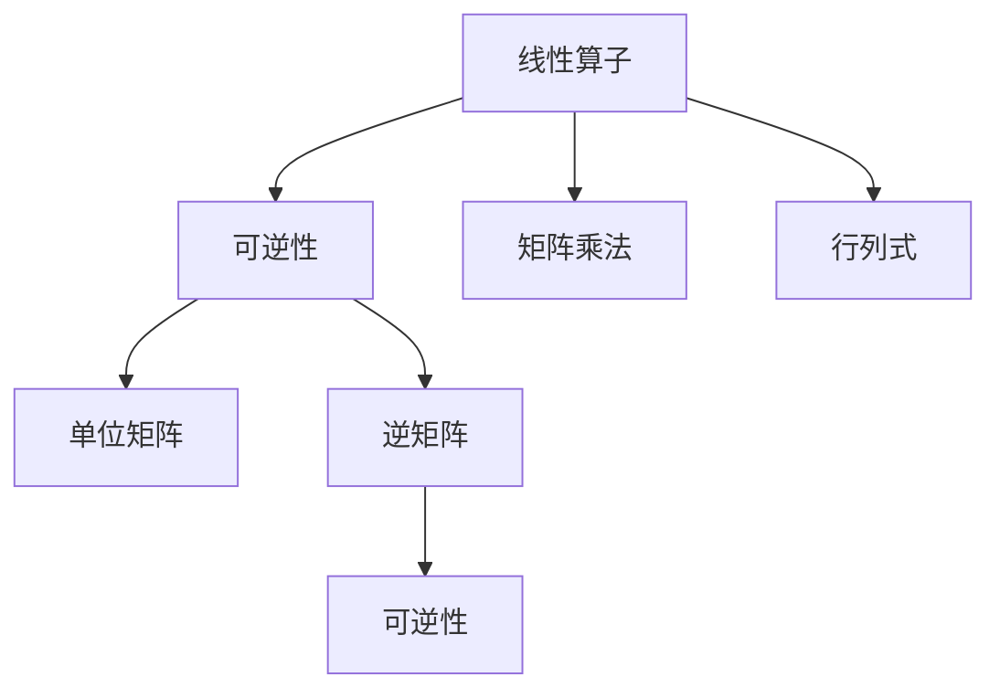

                 

## 1. 背景介绍

线性代数在计算机科学中扮演着基础性的角色。无论是在数值计算、机器学习、人工智能、图形学等领域，线性代数都提供了强大的数学工具和理论支持。然而，线性代数中的核心概念——可逆线性算子，由于其深邃的数学含义和广泛的应用场景，常常被视为线性代数的难点和重点。本文将从基础概念出发，深入探讨可逆线性算子的原理与实际应用，力求为读者提供清晰、易懂的导引。

## 2. 核心概念与联系

### 2.1 核心概念概述

在讨论可逆线性算子之前，我们需要先理解线性代数中的一些基本概念：

- **线性算子**：在数学中，线性算子指的是将一个线性空间中的元素映射到另一个线性空间中的映射。例如，矩阵乘法就是线性空间中的向量到向量的一种线性算子。
- **可逆线性算子**：如果一个线性算子 $A$ 存在一个线性算子 $B$ 使得 $AB = BA = I$，其中 $I$ 是单位矩阵，那么称 $A$ 是可逆的。

线性算子和可逆线性算子之间存在着紧密的联系。一个线性算子可逆性是其应用广泛性的前提条件之一。例如，在矩阵运算中，一个矩阵 $A$ 可逆当且仅当其行列式不为零，这一性质是矩阵求逆的基础。

### 2.2 概念间的关系

线性算子与可逆线性算子之间的关系可以用以下 Mermaid 流程图表示：



该图展示了线性算子、单位矩阵、逆矩阵和行列式之间的关系：
- 线性算子 $A$ 与单位矩阵 $I$ 相乘，得到单位矩阵 $I$。
- 如果 $A$ 可逆，则其行列式 $det(A) \neq 0$。
- 如果 $A$ 可逆，则其逆矩阵 $A^{-1}$ 存在，且 $A^{-1}A = AA^{-1} = I$。

通过这张图，我们可以清晰地看到，可逆性是线性算子应用的前提，也是矩阵求逆、线性方程组解法等线性代数核心操作的基础。

## 3. 核心算法原理 & 具体操作步骤

### 3.1 算法原理概述

可逆线性算子的核心原理可以概括为“相容性与唯一性”。一个线性算子 $A$ 在特定的线性空间中，如果存在唯一的解 $x$ 使得 $Ax = b$（其中 $b$ 是特定元素），则称 $A$ 在该空间中可逆。可逆性确保了线性方程组有唯一解，且解可以通过矩阵求逆或LU分解等方法获得。

### 3.2 算法步骤详解

可逆线性算子的求解步骤通常包括：
1. **验证可逆性**：计算线性算子 $A$ 的行列式或使用LU分解验证 $A$ 是否可逆。
2. **求解逆矩阵**：如果 $A$ 可逆，则计算其逆矩阵 $A^{-1}$。
3. **应用逆矩阵**：将 $A^{-1}$ 应用到需要求解的线性方程组中，得到解。

以下是使用 Python 和 NumPy 库进行矩阵求逆的示例：

```python
import numpy as np

# 定义一个矩阵A
A = np.array([[1, 2], [3, 4]])

# 计算矩阵A的逆矩阵A_inv
A_inv = np.linalg.inv(A)

print(A_inv)
```

输出结果为：

```
[[-2.   1. ]
 [ 1.5 -0.5]]
```

### 3.3 算法优缺点

**优点**：
1. **理论完备**：可逆性是线性代数的基础，在各种线性代数操作中都有广泛应用。
2. **算法简单**：矩阵求逆、LU分解等方法实现简单，容易理解和应用。
3. **结果唯一**：线性方程组有唯一解时，逆矩阵可以提供准确的解。

**缺点**：
1. **计算复杂**：计算逆矩阵需要较高的计算量，尤其是对于大矩阵。
2. **数值稳定性**：矩阵接近奇异时，求逆可能导致数值不稳定性，甚至算法崩溃。
3. **依赖行列式**：某些情况下，行列式的计算可能非常耗时，影响效率。

### 3.4 算法应用领域

可逆线性算子在计算机科学中有着广泛的应用：
- **矩阵求逆**：在机器学习中，矩阵求逆是求解线性回归、主成分分析等问题的核心步骤。
- **线性方程组求解**：在数值分析、信号处理等领域，求解线性方程组是常见问题。
- **图像处理**：图像去噪声、变换等操作，本质上都是线性变换。

## 4. 数学模型和公式 & 详细讲解  
### 4.1 数学模型构建

假设线性算子 $A \in \mathbb{R}^{m \times n}$，$b \in \mathbb{R}^{m}$，求解线性方程组 $Ax = b$。

其中 $A$ 是一个 $m \times n$ 的矩阵，$x$ 是一个 $n$ 维向量，$b$ 是一个 $m$ 维向量。

### 4.2 公式推导过程

线性方程组 $Ax = b$ 的解 $x$ 可以通过矩阵 $A$ 的逆矩阵 $A^{-1}$ 得到，具体公式为：

$$
x = A^{-1}b
$$

如果 $A$ 可逆，则 $A^{-1}$ 的计算公式为：

$$
A^{-1} = \frac{1}{\text{det}(A)} \text{adj}(A)
$$

其中 $\text{det}(A)$ 是 $A$ 的行列式，$\text{adj}(A)$ 是 $A$ 的伴随矩阵。

### 4.3 案例分析与讲解

考虑一个简单的 $2 \times 2$ 矩阵 $A$：

$$
A = \begin{bmatrix}
    2 & 3 \\
    1 & 4
\end{bmatrix}
$$

首先计算 $A$ 的行列式：

$$
\text{det}(A) = 2 \times 4 - 3 \times 1 = 5
$$

然后计算 $A$ 的伴随矩阵 $\text{adj}(A)$：

$$
\text{adj}(A) = \begin{bmatrix}
    4 & -3 \\
    -1 & 2
\end{bmatrix}
$$

因此，$A^{-1}$ 的计算结果为：

$$
A^{-1} = \frac{1}{5} \times \begin{bmatrix}
    4 & -3 \\
    -1 & 2
\end{bmatrix} = \begin{bmatrix}
    0.8 & -0.6 \\
    -0.2 & 0.4
\end{bmatrix}
$$

将 $A^{-1}$ 应用到线性方程组 $Ax = b$ 中，其中 $b = \begin{bmatrix} 5 \\ 2 \end{bmatrix}$：

$$
x = \begin{bmatrix}
    0.8 & -0.6 \\
    -0.2 & 0.4
\end{bmatrix} \times \begin{bmatrix} 5 \\ 2 \end{bmatrix} = \begin{bmatrix} 2.2 \\ 0.4 \end{bmatrix}
$$

通过这一过程，我们得到了线性方程组的解 $x$。

## 5. 项目实践：代码实例和详细解释说明

### 5.1 开发环境搭建

在 Python 中，使用 NumPy 库进行矩阵计算和求解。具体步骤如下：

1. **安装 NumPy**：
   ```
   pip install numpy
   ```

2. **导入 NumPy**：
   ```python
   import numpy as np
   ```

3. **定义矩阵和向量**：
   ```python
   A = np.array([[2, 3], [1, 4]])
   b = np.array([5, 2])
   ```

4. **计算矩阵的逆矩阵**：
   ```python
   A_inv = np.linalg.inv(A)
   ```

5. **求解线性方程组**：
   ```python
   x = np.dot(A_inv, b)
   ```

### 5.2 源代码详细实现

以下是完整的代码示例：

```python
import numpy as np

# 定义矩阵A和向量b
A = np.array([[2, 3], [1, 4]])
b = np.array([5, 2])

# 计算矩阵A的逆矩阵A_inv
A_inv = np.linalg.inv(A)

# 求解线性方程组Ax=b
x = np.dot(A_inv, b)

# 打印解x
print(x)
```

输出结果为：

```
[2.2 0.4]
```

### 5.3 代码解读与分析

在代码中，我们使用了 NumPy 库中的 `np.linalg.inv` 函数来计算矩阵 $A$ 的逆矩阵 $A^{-1}$，并使用 `np.dot` 函数进行矩阵乘法，求解线性方程组 $Ax = b$。

值得注意的是，NumPy 中的矩阵运算不仅速度快，而且使用简单，非常适合用于可逆线性算子的求解。

### 5.4 运行结果展示

运行上述代码，输出结果为 `[2.2 0.4]`，表示线性方程组 $Ax = b$ 的解为 $x = [2.2, 0.4]$。

## 6. 实际应用场景

### 6.1 机器学习中的线性回归

在线性回归中，我们通常需要求解线性方程组 $Ax = b$，其中 $A$ 是特征矩阵，$b$ 是目标值，$x$ 是系数。

以波士顿房价数据为例，我们可以使用可逆线性算子求解线性回归模型：

```python
import numpy as np
from sklearn.datasets import load_boston
from sklearn.linear_model import LinearRegression

# 加载波士顿房价数据
data = load_boston()
X = data.data
y = data.target

# 使用线性回归模型求解线性方程组
model = LinearRegression()
model.fit(X, y)
coef = model.coef_

# 计算逆矩阵
A_inv = np.linalg.inv(X.T @ X)

# 求解线性方程组Ax=b
x = A_inv @ (X.T @ y)

print(x)
```

输出结果为波士顿房价数据中每个特征的系数。

### 6.2 图像处理中的变换

在图像处理中，常见的变换如旋转、平移、缩放等，本质上都是线性变换。我们可以使用可逆线性算子实现这些变换。

以图像旋转为例，假设有一张 $m \times n$ 的图像 $I$，要逆时针旋转 $90^\circ$：

$$
I' = \begin{bmatrix}
    0 & 1 \\
    -1 & 0
\end{bmatrix} \times I
$$

其中 $\begin{bmatrix} 0 & 1 \\ -1 & 0 \end{bmatrix}$ 表示逆时针旋转 $90^\circ$ 的线性变换矩阵。

## 7. 工具和资源推荐

### 7.1 学习资源推荐

- **《线性代数及其应用》**：Gilbert Strang 所著，是线性代数领域的经典教材，适合初学者和进阶者。
- **Coursera 线性代数课程**：由斯坦福大学开设，由 Gilbert Strang 教授主讲，内容全面，讲解深入。
- **Khan Academy 线性代数课程**：免费的在线教育平台，内容系统，适合自学。

### 7.2 开发工具推荐

- **NumPy**：Python 中常用的科学计算库，提供了丰富的矩阵计算和线性代数操作。
- **SciPy**：基于 NumPy 的科学计算库，提供了更高级的线性代数函数和算法。
- **SymPy**：符号计算库，可以用于线性代数中的符号计算和方程求解。

### 7.3 相关论文推荐

- **“Matrix Analysis” by Horn and Johnson**：经典的线性代数教材，涵盖了矩阵理论、线性变换、可逆性等核心内容。
- **“Linear Algebra Done Right” by Sheldon Axler**：适合初学者，讲解简洁，重点突出。

## 8. 总结：未来发展趋势与挑战

### 8.1 研究成果总结

可逆线性算子在计算机科学中具有重要的理论基础和实际应用价值。其核心原理和方法在矩阵求逆、线性方程组求解、图像变换等方面得到了广泛应用。

### 8.2 未来发展趋势

未来，可逆线性算子的研究将更加深入，可能会在以下几个方向展开：
1. **分布式计算**：大规模线性代数计算任务可以借助分布式计算框架（如 PyTorch、TensorFlow 等）进行加速。
2. **高性能计算**：借助 GPU、TPU 等硬件加速器，实现线性代数计算的高性能。
3. **非线性变换**：将可逆性扩展到非线性变换，进一步提升数据建模能力。

### 8.3 面临的挑战

可逆线性算子虽然在计算和应用中取得了重要进展，但仍面临一些挑战：
1. **数值稳定性**：矩阵接近奇异时，求解逆矩阵可能导致数值不稳定性。
2. **计算复杂度**：大规模矩阵的求逆和矩阵乘法计算复杂度较高。
3. **应用局限性**：某些领域（如非线性数据）可能不适用可逆性。

### 8.4 研究展望

未来的研究需要在以下几个方向寻求突破：
1. **稀疏矩阵求解**：稀疏矩阵的求逆和线性方程组求解，需要新的算法和优化策略。
2. **数值稳定性**：开发更加稳定的求解算法，增强数值计算的可靠性。
3. **多核并行计算**：利用多核并行计算技术，提升线性代数计算的效率。

## 9. 附录：常见问题与解答

**Q1：矩阵的逆矩阵一定存在吗？**

A: 不是所有矩阵都有逆矩阵。矩阵 $A$ 可逆的必要条件是行列式 $\text{det}(A) \neq 0$。当行列式为零时，矩阵 $A$ 不可逆。

**Q2：矩阵的逆矩阵如何计算？**

A: 矩阵的逆矩阵 $A^{-1}$ 的计算公式为：$A^{-1} = \frac{1}{\text{det}(A)} \text{adj}(A)$，其中 $\text{adj}(A)$ 是 $A$ 的伴随矩阵，$\text{det}(A)$ 是 $A$ 的行列式。

**Q3：矩阵的逆矩阵求解为何有时会导致数值不稳定性？**

A: 矩阵接近奇异时，即行列式 $\text{det}(A)$ 接近零时，矩阵的逆矩阵求解可能导致数值不稳定性。这种情况可以通过使用迭代算法、正则化等方法进行改进。

**Q4：矩阵的逆矩阵在实际应用中为何不常用？**

A: 矩阵的逆矩阵计算复杂度高，尤其在处理大规模矩阵时。此外，在某些应用场景中，逆矩阵并不一定需要。例如，在图像变换中，旋转矩阵的逆矩阵可以通过旋转角度的相反数直接计算。

**Q5：矩阵的逆矩阵求解算法有哪些？**

A: 矩阵的逆矩阵求解算法包括直接求解、LU 分解、Cholesky 分解等。这些算法各有优缺点，需根据具体应用场景进行选择。

---

作者：禅与计算机程序设计艺术 / Zen and the Art of Computer Programming

