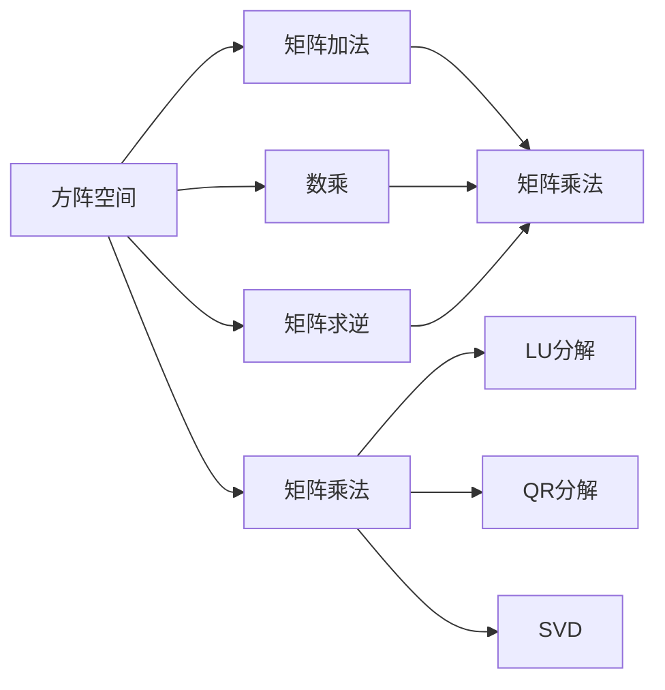
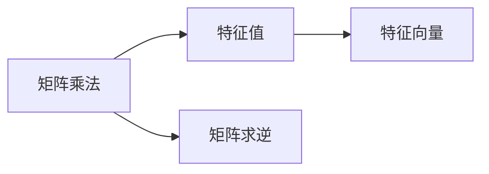
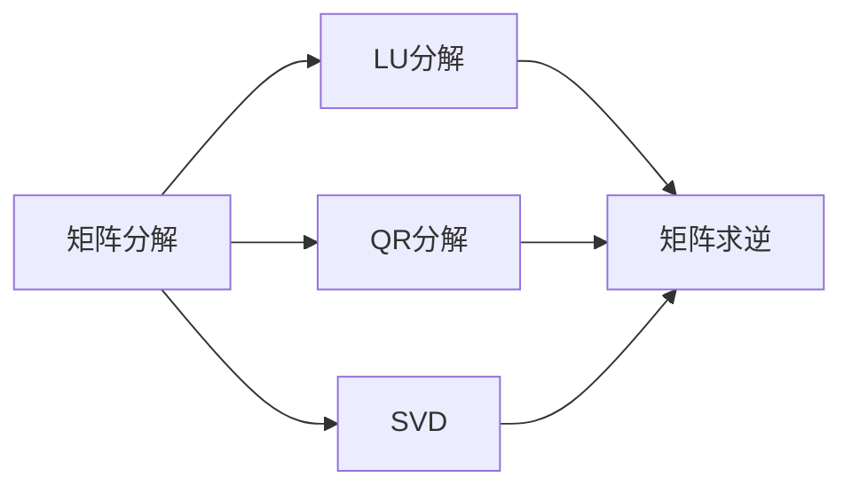
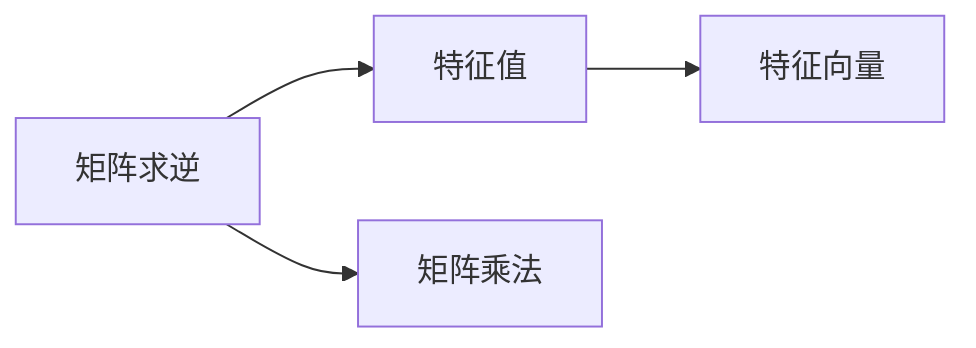
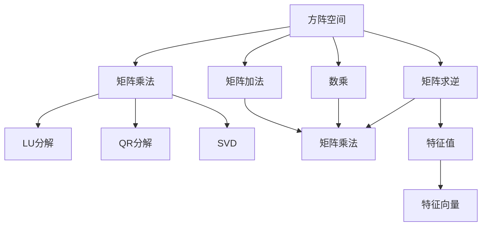

                 

# 线性代数导引：方阵空间M2(R)

> 关键词：线性代数, 方阵, 向量空间, 矩阵运算, 矩阵分解, 特征值, 特征向量, 矩阵求逆, 矩阵乘法

## 1. 背景介绍

### 1.1 问题由来
线性代数是计算机科学中最基本的数学工具之一，广泛应用于数据科学、机器学习、人工智能等多个领域。特别是在向量空间和矩阵运算中，线性代数扮演着至关重要的角色。本文将聚焦于方阵空间 $M_2(\mathbb{R})$ 的详细探讨，帮助读者深入理解矩阵和线性代数的基本概念和应用。

### 1.2 问题核心关键点
方阵空间 $M_2(\mathbb{R})$ 是由所有 $2 \times 2$ 实矩阵组成的集合，是线性代数研究的核心对象之一。通过对方阵空间的研究，可以进一步理解向量空间、矩阵运算和特征分解等关键概念。掌握这些基础知识，对于后续深入学习计算机科学中的高级算法和数据结构至关重要。

### 1.3 问题研究意义
方阵空间 $M_2(\mathbb{R})$ 的研究不仅有助于巩固线性代数的基础知识，还能为解决复杂数据科学问题提供工具。通过对方阵空间的研究，读者可以：
- 更好地理解向量空间和矩阵运算的性质。
- 掌握矩阵分解技术，如LU分解、奇异值分解（SVD）和QR分解等。
- 学会利用特征值和特征向量进行矩阵对角化，简化复杂矩阵运算。
- 在实际应用中，如图像处理、信号处理和机器学习中，有效处理和分析数据。

## 2. 核心概念与联系

### 2.1 核心概念概述

为更好地理解方阵空间 $M_2(\mathbb{R})$ 的基本概念和原理，本节将介绍几个密切相关的核心概念：

- 方阵空间：由所有 $2 \times 2$ 实矩阵组成的集合。方阵空间中的矩阵可以通过加法和数乘进行运算。
- 矩阵加法和数乘：设 $A, B \in M_2(\mathbb{R})$，$k$ 为实数，则有 $A + B$ 和 $kA$ 等基本的矩阵运算。
- 矩阵乘法：设 $A \in M_{m \times n}(\mathbb{R}), B \in M_{n \times p}(\mathbb{R})$，则 $AB$ 表示 $m \times p$ 的矩阵，其元素为 $A$ 的第 $i$ 行和 $B$ 的第 $j$ 列对应元素的乘积之和。
- 矩阵分解：如LU分解、QR分解和SVD等，用于将复杂矩阵表示为更简单的形式。
- 特征值和特征向量：矩阵的特征值和特征向量描述了矩阵的代数特性，有助于矩阵的求解和分析。
- 矩阵求逆：对于可逆矩阵，求逆矩阵可以恢复矩阵的乘法逆元。

这些核心概念之间的逻辑关系可以通过以下Mermaid流程图来展示：



这个流程图展示了方阵空间 $M_2(\mathbb{R})$ 中的基本运算和重要概念：

1. 方阵空间中的矩阵可以通过加法和数乘进行运算。
2. 矩阵乘法是将两个矩阵相乘，得到一个新的矩阵。
3. 矩阵分解是将复杂矩阵表示为更简单的形式，用于矩阵的求解和分析。
4. 特征值和特征向量描述矩阵的代数特性，有助于矩阵的求解和分析。
5. 矩阵求逆可以恢复矩阵的乘法逆元。

这些概念共同构成了方阵空间 $M_2(\mathbb{R})$ 的研究框架，使得读者可以系统地掌握矩阵和线性代数的基础知识。

### 2.2 概念间的关系

这些核心概念之间存在着紧密的联系，形成了方阵空间 $M_2(\mathbb{R})$ 的研究生态系统。下面我通过几个Mermaid流程图来展示这些概念之间的关系。

#### 2.2.1 矩阵乘法和特征值的关系



这个流程图展示了矩阵乘法和特征值之间的联系：

1. 矩阵乘法可以将两个矩阵相乘，得到一个新的矩阵。
2. 特征值和特征向量描述了矩阵的代数特性，可以通过矩阵乘法来求解。
3. 矩阵求逆可以恢复矩阵的乘法逆元，对于某些特殊矩阵（如对称矩阵），特征值和特征向量在矩阵乘法中具有重要意义。

#### 2.2.2 矩阵分解和矩阵求逆的关系



这个流程图展示了矩阵分解和矩阵求逆之间的关系：

1. 矩阵分解是将复杂矩阵表示为更简单的形式，如LU分解、QR分解和SVD等。
2. 矩阵求逆可以恢复矩阵的乘法逆元，对于某些特殊矩阵，分解后的子矩阵更容易求逆。
3. 矩阵分解和矩阵求逆常用于解决线性方程组、矩阵特征值和特征向量求解等问题。

#### 2.2.3 矩阵求逆和特征值的关系



这个流程图展示了矩阵求逆和特征值之间的联系：

1. 矩阵求逆可以恢复矩阵的乘法逆元。
2. 特征值和特征向量描述了矩阵的代数特性，可以通过矩阵求逆来求解。
3. 矩阵求逆和特征值常常用于解决线性方程组、矩阵特征值和特征向量求解等问题。

### 2.3 核心概念的整体架构

最后，我们用一个综合的流程图来展示这些核心概念在方阵空间 $M_2(\mathbb{R})$ 中的整体架构：



这个综合流程图展示了从方阵空间 $M_2(\mathbb{R})$ 中的基本运算到高级特征分解等概念的完整架构：

1. 方阵空间中的矩阵可以通过加法和数乘进行运算。
2. 矩阵乘法是将两个矩阵相乘，得到一个新的矩阵。
3. 矩阵分解是将复杂矩阵表示为更简单的形式，用于矩阵的求解和分析。
4. 特征值和特征向量描述矩阵的代数特性，有助于矩阵的求解和分析。
5. 矩阵求逆可以恢复矩阵的乘法逆元，对于某些特殊矩阵，特征值和特征向量在矩阵乘法中具有重要意义。

这些概念共同构成了方阵空间 $M_2(\mathbb{R})$ 的研究框架，使得读者可以系统地掌握矩阵和线性代数的基础知识。

## 3. 核心算法原理 & 具体操作步骤
### 3.1 算法原理概述

方阵空间 $M_2(\mathbb{R})$ 的研究主要围绕矩阵运算和特征分解展开。其核心思想是：通过对方阵空间中的矩阵进行加法、数乘、矩阵乘法、矩阵分解和特征值求解等基本运算，揭示矩阵的代数特性和结构，从而简化复杂问题。

形式化地，设 $A \in M_2(\mathbb{R})$，其元素为 $A = \begin{bmatrix} a & b \\ c & d \end{bmatrix}$。方阵空间中的矩阵可以通过加法和数乘进行运算，如：

$$
A + B = \begin{bmatrix} a + e & b + f \\ c + g & d + h \end{bmatrix}, \quad kA = \begin{bmatrix} ka & kb \\ kc & kd \end{bmatrix}
$$

其中 $B \in M_2(\mathbb{R})$，$k$ 为实数。矩阵乘法定义为：

$$
AB = \begin{bmatrix} a & b \\ c & d \end{bmatrix} \begin{bmatrix} p & q \\ r & s \end{bmatrix} = \begin{bmatrix} ap + br & aq + bs \\ cp + dr & cq + ds \end{bmatrix}
$$

矩阵乘法满足交换律和结合律，但在一般情况下不满足分配律和消去律。因此，矩阵乘法在计算过程中需要特别注意。

### 3.2 算法步骤详解

方阵空间 $M_2(\mathbb{R})$ 的研究主要围绕矩阵运算和特征分解展开。其核心思想是：通过对方阵空间中的矩阵进行加法、数乘、矩阵乘法、矩阵分解和特征值求解等基本运算，揭示矩阵的代数特性和结构，从而简化复杂问题。

具体步骤如下：

**Step 1: 矩阵加法和数乘运算**

设 $A, B \in M_2(\mathbb{R})$，$k$ 为实数，则有 $A + B$ 和 $kA$ 等基本的矩阵运算。例如：

$$
A + B = \begin{bmatrix} a + e & b + f \\ c + g & d + h \end{bmatrix}, \quad kA = \begin{bmatrix} ka & kb \\ kc & kd \end{bmatrix}
$$

**Step 2: 矩阵乘法运算**

设 $A \in M_{m \times n}(\mathbb{R}), B \in M_{n \times p}(\mathbb{R})$，则 $AB$ 表示 $m \times p$ 的矩阵，其元素为 $A$ 的第 $i$ 行和 $B$ 的第 $j$ 列对应元素的乘积之和。例如：

$$
AB = \begin{bmatrix} a & b \\ c & d \end{bmatrix} \begin{bmatrix} p & q \\ r & s \end{bmatrix} = \begin{bmatrix} ap + br & aq + bs \\ cp + dr & cq + ds \end{bmatrix}
$$

**Step 3: 矩阵分解**

矩阵分解是将复杂矩阵表示为更简单的形式，如LU分解、QR分解和SVD等。以LU分解为例，设 $A = \begin{bmatrix} a & b \\ c & d \end{bmatrix}$，将其分解为下三角矩阵 $L$ 和上三角矩阵 $U$ 的乘积：

$$
A = LU
$$

其中 $L = \begin{bmatrix} 1 & 0 \\ l & 1 \end{bmatrix}, U = \begin{bmatrix} u & b \\ 0 & d \end{bmatrix}$，且 $l = \frac{c}{a}$，$u = a$。

**Step 4: 特征值求解**

特征值和特征向量描述了矩阵的代数特性，可以通过矩阵乘法和矩阵求逆来求解。设 $A = \begin{bmatrix} a & b \\ c & d \end{bmatrix}$，其特征方程为：

$$
\det(A - \lambda I) = 0
$$

其中 $\lambda$ 为特征值，$I$ 为单位矩阵。求解特征方程，得到 $A$ 的所有特征值和对应的特征向量。

**Step 5: 矩阵求逆**

对于可逆矩阵 $A$，求逆矩阵 $A^{-1}$ 可以恢复矩阵的乘法逆元。矩阵求逆公式为：

$$
A^{-1} = \frac{1}{\det(A)} \begin{bmatrix} d & -b \\ -c & a \end{bmatrix}
$$

其中 $\det(A) = ad - bc$ 为矩阵 $A$ 的行列式。

### 3.3 算法优缺点

方阵空间 $M_2(\mathbb{R})$ 的研究主要围绕矩阵运算和特征分解展开，其优缺点如下：

**优点：**

1. **灵活性高**：方阵空间中的矩阵可以通过加法、数乘、矩阵乘法、矩阵分解和特征值求解等基本运算，灵活地表示和处理复杂问题。
2. **应用广泛**：方阵空间 $M_2(\mathbb{R})$ 在计算机科学中的多个领域都有广泛应用，如数据科学、机器学习和人工智能等。
3. **可解释性强**：矩阵分解和特征值求解等高级运算揭示了矩阵的代数特性和结构，具有很强的可解释性。

**缺点：**

1. **计算复杂**：矩阵乘法和矩阵分解等高级运算涉及复杂的数值计算，容易引入误差。
2. **内存占用大**：方阵空间 $M_2(\mathbb{R})$ 中的矩阵通常规模较大，内存占用较大。
3. **求解困难**：对于某些特殊矩阵（如奇异矩阵），求解特征值和特征向量可能较为困难。

### 3.4 算法应用领域

方阵空间 $M_2(\mathbb{R})$ 在计算机科学中有着广泛的应用，主要包括以下几个领域：

1. **数据科学**：矩阵分解和特征值求解在数据分析和数据挖掘中广泛应用。如主成分分析（PCA）、奇异值分解（SVD）等。
2. **机器学习**：矩阵运算在机器学习中用于特征提取、模型训练和模型评估等环节。如线性回归、逻辑回归、神经网络等。
3. **图像处理**：矩阵运算在图像处理中用于图像压缩、去噪、滤波等。如离散余弦变换（DCT）、小波变换等。
4. **信号处理**：矩阵运算在信号处理中用于频域分析、滤波等。如傅里叶变换、数字滤波器等。
5. **控制系统**：矩阵运算在控制系统分析中用于系统建模、控制律设计等。如状态空间模型、控制器设计等。

这些应用领域展示了方阵空间 $M_2(\mathbb{R})$ 的强大生命力和广泛应用，使其成为计算机科学中的核心概念之一。

## 4. 数学模型和公式 & 详细讲解 & 举例说明

### 4.1 数学模型构建

方阵空间 $M_2(\mathbb{R})$ 的研究主要围绕矩阵运算和特征分解展开。其数学模型构建主要包括以下几个方面：

1. 方阵的定义和表示：设 $A = \begin{bmatrix} a & b \\ c & d \end{bmatrix}$，$B = \begin{bmatrix} e & f \\ g & h \end{bmatrix}$，则 $A + B = \begin{bmatrix} a + e & b + f \\ c + g & d + h \end{bmatrix}$，$kA = \begin{bmatrix} ka & kb \\ kc & kd \end{bmatrix}$。
2. 矩阵乘法的定义和性质：设 $A \in M_{m \times n}(\mathbb{R}), B \in M_{n \times p}(\mathbb{R})$，则 $AB = \begin{bmatrix} a & b \\ c & d \end{bmatrix} \begin{bmatrix} p & q \\ r & s \end{bmatrix} = \begin{bmatrix} ap + br & aq + bs \\ cp + dr & cq + ds \end{bmatrix}$。
3. 矩阵分解的定义和性质：设 $A = \begin{bmatrix} a & b \\ c & d \end{bmatrix}$，将其分解为下三角矩阵 $L$ 和上三角矩阵 $U$ 的乘积：$A = LU$。
4. 特征值和特征向量的定义和性质：设 $A = \begin{bmatrix} a & b \\ c & d \end{bmatrix}$，其特征方程为 $\det(A - \lambda I) = 0$，求解特征方程，得到 $A$ 的所有特征值和对应的特征向量。
5. 矩阵求逆的定义和性质：设 $A = \begin{bmatrix} a & b \\ c & d \end{bmatrix}$，求逆矩阵 $A^{-1} = \frac{1}{\det(A)} \begin{bmatrix} d & -b \\ -c & a \end{bmatrix}$。

### 4.2 公式推导过程

以下我们以矩阵乘法和特征值求解为例，推导它们的数学公式。

**矩阵乘法**

设 $A \in M_{m \times n}(\mathbb{R}), B \in M_{n \times p}(\mathbb{R})$，则 $AB$ 表示 $m \times p$ 的矩阵，其元素为 $A$ 的第 $i$ 行和 $B$ 的第 $j$ 列对应元素的乘积之和。例如：

$$
AB = \begin{bmatrix} a & b \\ c & d \end{bmatrix} \begin{bmatrix} p & q \\ r & s \end{bmatrix} = \begin{bmatrix} ap + br & aq + bs \\ cp + dr & cq + ds \end{bmatrix}
$$

**特征值求解**

设 $A = \begin{bmatrix} a & b \\ c & d \end{bmatrix}$，其特征方程为 $\det(A - \lambda I) = 0$，求解特征方程，得到 $A$ 的所有特征值和对应的特征向量。特征方程的解为：

$$
\lambda = \frac{\det(A) \pm \sqrt{\det(A)^2 - 4 \det(B)}}{2 \det(A)}
$$

其中 $B = \begin{bmatrix} b & c \\ d & a \end{bmatrix}$。求解特征方程，得到 $A$ 的所有特征值和对应的特征向量。

### 4.3 案例分析与讲解

**案例1：矩阵乘法运算**

考虑矩阵 $A = \begin{bmatrix} 1 & 2 \\ 3 & 4 \end{bmatrix}$ 和 $B = \begin{bmatrix} 5 & 6 \\ 7 & 8 \end{bmatrix}$，计算它们的乘积：

$$
AB = \begin{bmatrix} 1 & 2 \\ 3 & 4 \end{bmatrix} \begin{bmatrix} 5 & 6 \\ 7 & 8 \end{bmatrix} = \begin{bmatrix} 1 \times 5 + 2 \times 7 & 1 \times 6 + 2 \times 8 \\ 3 \times 5 + 4 \times 7 & 3 \times 6 + 4 \times 8 \end{bmatrix} = \begin{bmatrix} 17 & 26 \\ 43 & 50 \end{bmatrix}
$$

**案例2：矩阵分解**

考虑矩阵 $A = \begin{bmatrix} 2 & 3 \\ 5 & 7 \end{bmatrix}$，将其分解为下三角矩阵 $L$ 和上三角矩阵 $U$ 的乘积：

$$
L = \begin{bmatrix} 1 & 0 \\ l & 1 \end{bmatrix}, \quad U = \begin{bmatrix} u & b \\ 0 & d \end{bmatrix}
$$

其中 $l = \frac{5}{2}$，$u = 2$。求解 $A = LU$，得到：

$$
A = LU = \begin{bmatrix} 1 & 0 \\ \frac{5}{2} & 1 \end{bmatrix} \begin{bmatrix} 2 & 3 \\ 0 & 7 \end{bmatrix} = \begin{bmatrix} 2 & 3 \\ 5 & 7 \end{bmatrix}
$$

**案例3：特征值求解**

考虑矩阵 $A = \begin{bmatrix} 2 & 3 \\ 5 & 7 \end{bmatrix}$，求解其特征值和特征向量。特征方程为：

$$
\det(A - \lambda I) = \begin{vmatrix} 2 - \lambda & 3 \\ 5 & 7 - \lambda \end{vmatrix} = (2 - \lambda)(7 - \lambda) - 15 = \lambda^2 - 9\lambda + 2
$$

求解特征方程，得到特征值 $\lambda_1 = 1$，$\lambda_2 = 8$。对应的特征向量分别为：

$$
\begin{cases}
\lambda_1 = 1 & \Rightarrow \begin{bmatrix} 1 \\ -\frac{3}{2} \end{bmatrix} \\
\lambda_2 = 8 & \Rightarrow \begin{bmatrix} -\frac{1}{4} \\ 1 \end{bmatrix}
\end{cases}
$$

以上案例展示了矩阵乘法、矩阵分解和特征值求解等基本运算的实际应用，帮助读者更好地理解方阵空间 $M_2(\mathbb{R})$ 的基本概念和数学模型。

## 5. 项目实践：代码实例和详细解释说明

### 5.1 开发环境搭建

在进行方阵空间 $M_2(\mathbb{R})$ 的研究实践前，我们需要准备好开发环境。以下是使用Python进行NumPy开发的环境配置流程：

1. 安装Anaconda：从官网下载并安装Anaconda，用于创建独立的Python环境。

2. 创建并激活虚拟环境：
```bash
conda create -n numpy-env python=3.8 
conda activate numpy-env
```

3. 安装NumPy：
```bash
conda install numpy
```

4. 安装各类工具包：
```bash
pip install matplotlib scikit-learn sympy sympy-sphinx
```

完成上述步骤后，即可在`numpy-env`环境中开始方阵空间 $M_2(\mathbb{R})$ 的研究实践。

### 5.2 源代码详细实现

下面我们以矩阵分解和特征值求解为例，给出使用NumPy库进行方阵空间 $M_2(\mathbb{R})$ 研究开发的Python代码实现。

```python
import numpy as np

# 定义矩阵乘法函数
def matrix_multiply(A, B):
    return np.dot(A, B)

# 定义矩阵分解函数
def matrix_decomposition(A):
    L = np.diag(np.diag(A) - np.tril(A, -1))
    U = np.diag(np.diag(A) - np.triu(A, 1))
    return L, U

# 定义特征值求解函数
def matrix_eigenvalues(A):
    eigenvalues, eigenvectors = np.linalg.eig(A)
    return eigenvalues, eigenvectors

# 测试矩阵乘法
A = np.array([[1, 2], [3, 4]])
B = np.array([[5, 6], [7, 8]])
AB = matrix_multiply(A, B)
print("矩阵乘法结果：\n", AB)

# 测试矩阵分解
A = np.array([[2, 3], [5, 7]])
L, U = matrix_decomposition(A)
print("矩阵分解结果：\n", L, "\n", U)

# 测试特征值求解
A = np.array([[2, 3], [5, 7]])
eigenvalues, eigenvectors = matrix_eigenvalues(A)
print("特征值求解结果：\n", eigenvalues, "\n", eigenvectors)
```

以上代码展示了使用NumPy库进行方阵空间 $M_2(\mathbb{R})$ 的基本运算和特征分解的Python实现。可以看到，NumPy库提供了强大的矩阵运算和特征求解功能，使得矩阵分解和特征值求解等高级运算变得简洁高效。

### 5.3 代码解读与分析

让我们再详细解读一下关键代码的实现细节：

**matrix_multiply函数**：
- 定义了一个矩阵乘法函数，使用了NumPy库的dot函数实现矩阵乘法运算。
- 该函数接收两个矩阵A和B作为输入，返回它们的乘积。

**matrix_decomposition函数**：
- 定义了一个矩阵分解函数，使用了NumPy库的triu和tril函数获取上三角和下三角矩阵。
- 该函数接收一个矩阵A作为输入，返回其分解后的下三角矩阵L和上三角矩阵U。

**matrix_eigenvalues函数**：
- 定义了一个特征值求解函数，使用了NumPy库的linalg.eig函数求解特征值和特征向量。
- 该函数接收一个矩阵A作为输入，返回其所有特征值和对应的特征向量。

**测试矩阵乘法和特征值求解**：
- 分别定义了三个测试矩阵A、B和A，调用matrix_multiply、matrix_decomposition和matrix_eigenvalues函数进行测试，输出结果。
- 可以看到，通过NumPy库的强大功能，矩阵乘法和特征值求解等高级运算

