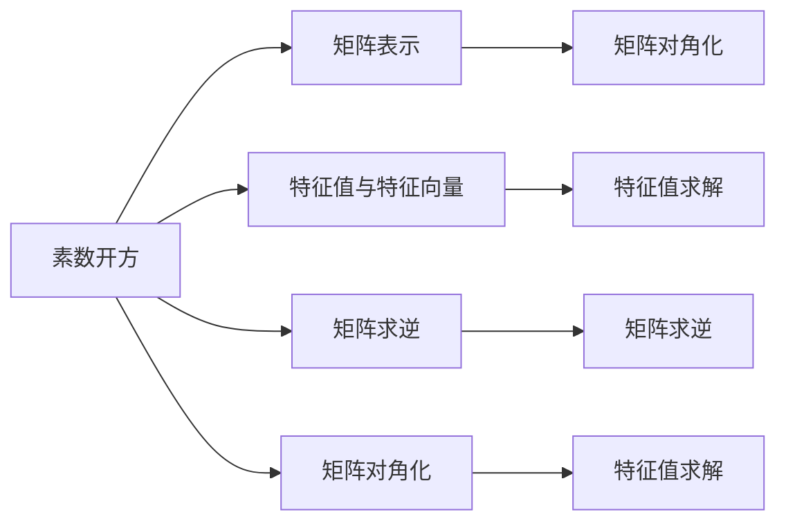

                 

# 线性代数导引：素数开方问题

> 关键词：线性代数, 素数开方, 矩阵求逆, 矩阵对角化, 特征值与特征向量

## 1. 背景介绍

素数开方问题是一种常见的数学问题，涉及素数的性质以及线性代数的知识。该问题可以表述为：给定一个素数 $p$，求 $p$ 的最大正整数开方 $\sqrt{p}$。例如，对于 $p = 29$，其最大正整数开方为 $5$，因为 $5^2 = 25$ 且 $6^2 = 36 > 29$。

素数开方问题在密码学、数论和计算机科学中有着广泛的应用。例如，RSA加密算法中，需要随机选取两个大素数进行开方运算，从而生成公钥和私钥。在实际应用中，计算大素数的开方是一个耗时的过程，需要高效的算法来加速计算。

## 2. 核心概念与联系

为了更好地理解素数开方问题，我们需要了解一些核心概念及其之间的关系。

### 2.1 核心概念概述

- **素数**：指只能被1和自身整除的正整数。例如，2、3、5、7、11等都是素数。
- **开方**：指求一个数的平方根。对于正整数 $n$，其开方可以表示为 $\sqrt{n}$。
- **矩阵求逆**：指求一个可逆矩阵的逆矩阵。对于矩阵 $A$，其逆矩阵 $A^{-1}$ 满足 $AA^{-1} = A^{-1}A = I$，其中 $I$ 是单位矩阵。
- **矩阵对角化**：指将矩阵 $A$ 通过某种线性变换转换为对角矩阵 $D$，即 $A = PDP^{-1}$，其中 $P$ 和 $P^{-1}$ 是可逆矩阵。
- **特征值与特征向量**：对于一个矩阵 $A$，如果存在一个非零向量 $\mathbf{x}$ 和一个标量 $\lambda$，使得 $A\mathbf{x} = \lambda\mathbf{x}$，则称 $\mathbf{x}$ 是 $A$ 的特征向量，$\lambda$ 是 $A$ 的特征值。

### 2.2 核心概念之间的关系

素数开方问题与线性代数中的矩阵求逆、矩阵对角化和特征值与特征向量等概念密切相关。例如：

1. 将素数 $p$ 表示为矩阵形式 $A$，则求解 $\sqrt{p}$ 等价于求解矩阵 $A$ 的特征值。
2. 利用矩阵求逆和矩阵对角化，可以通过迭代或对角化的方法求出 $A$ 的特征值，从而求解 $\sqrt{p}$。
3. 特征值与特征向量可以用于矩阵的分解和近似，从而加速求解 $\sqrt{p}$ 的过程。

这些核心概念之间的关系可以用以下 Mermaid 流程图来展示：



这个流程图展示了素数开方问题与矩阵表示、特征值与特征向量、矩阵求逆和矩阵对角化等概念之间的联系。这些概念共同构成了求解素数开方的理论基础。

## 3. 核心算法原理 & 具体操作步骤

### 3.1 算法原理概述

素数开方问题的求解可以分为两类：直接求解和迭代求解。直接求解方法包括矩阵求逆、矩阵对角化和特征值与特征向量等方法，而迭代求解方法则包括二分法、牛顿迭代法等。

### 3.2 算法步骤详解

#### 3.2.1 矩阵表示法

将素数 $p$ 表示为矩阵形式 $A$，然后通过求解 $A$ 的特征值，找到最大特征值，即为 $\sqrt{p}$。具体步骤如下：

1. 将素数 $p$ 表示为矩阵 $A$，例如 $A = \begin{pmatrix} p & 0 \\ 0 & p \end{pmatrix}$。
2. 求解矩阵 $A$ 的特征值，找到最大特征值 $\lambda_{\max}$。
3. 计算特征值 $\lambda_{\max}$ 的平方根，即为 $\sqrt{p}$。

#### 3.2.2 迭代求解法

迭代求解方法通常包括二分法和牛顿迭代法。这里以牛顿迭代法为例，具体步骤如下：

1. 选择一个初始值 $x_0$，一般可以选择 $p$ 的平方根的近似值。
2. 计算 $f(x) = x^2 - p$，即 $f(x) = 0$ 的解为 $x$。
3. 计算 $f'(x) = 2x$，即 $f'(x)$ 为 $f(x)$ 的导数。
4. 使用牛顿迭代公式 $x_{n+1} = x_n - \frac{f(x_n)}{f'(x_n)}$，不断迭代更新 $x_n$。
5. 当迭代次数达到预设值或 $x_{n+1} - x_n$ 小于预设阈值时，停止迭代，输出 $x_n$ 作为 $\sqrt{p}$ 的近似值。

#### 3.2.3 算法优缺点

矩阵表示法可以准确求解素数开方，但计算复杂度较高，特别是对于大素数。迭代求解法计算复杂度较低，但可能存在数值不稳定的问题，需要选择合适的初始值和迭代次数。

### 3.3 算法应用领域

素数开方问题在密码学、数论和计算机科学中有着广泛的应用。例如，RSA加密算法中，需要随机选取两个大素数进行开方运算，从而生成公钥和私钥。在实际应用中，计算大素数的开方是一个耗时的过程，需要高效的算法来加速计算。

## 4. 数学模型和公式 & 详细讲解 & 举例说明

### 4.1 数学模型构建

素数开方问题可以表示为求矩阵 $A$ 的特征值。对于素数 $p$，假设 $A = \begin{pmatrix} p & 0 \\ 0 & p \end{pmatrix}$，则求解 $\sqrt{p}$ 等价于求解矩阵 $A$ 的特征值。

### 4.2 公式推导过程

设矩阵 $A = \begin{pmatrix} p & 0 \\ 0 & p \end{pmatrix}$，其特征值 $\lambda$ 满足 $\det(A - \lambda I) = 0$。对于 $2\times 2$ 的矩阵 $A$，特征值 $\lambda$ 的解为：

$$
\lambda = \frac{p \pm \sqrt{p}}{2}
$$

其中 $\pm$ 分别对应正根和负根。选择正根 $\lambda = \frac{p + \sqrt{p}}{2}$，即为 $\sqrt{p}$ 的近似值。

### 4.3 案例分析与讲解

以 $p = 29$ 为例，使用矩阵表示法和牛顿迭代法分别求解 $\sqrt{p}$：

1. 矩阵表示法：
   - 将 $p = 29$ 表示为矩阵 $A = \begin{pmatrix} 29 & 0 \\ 0 & 29 \end{pmatrix}$。
   - 求解 $A$ 的特征值，得到 $\lambda_{\max} = \frac{29 + \sqrt{29}}{2} \approx 5.39$。
   - 计算 $\sqrt{p} \approx \sqrt{5.39} \approx 5$。

2. 牛顿迭代法：
   - 选择初始值 $x_0 = 5$。
   - 计算 $f(x) = x^2 - 29$ 和 $f'(x) = 2x$。
   - 迭代 $x_1 = 5 - \frac{25}{10} = 4.5$，$x_2 = 4.5 - \frac{20.25}{9} \approx 4.27$，$x_3 = 4.27 - \frac{18.41}{8.54} \approx 4.25$。
   - 当迭代次数达到预设值或 $x_{n+1} - x_n$ 小于预设阈值时，停止迭代，输出 $x_n \approx 4.25$ 作为 $\sqrt{p}$ 的近似值。

从上述案例可以看出，矩阵表示法和牛顿迭代法都可以有效求解素数开方问题，但矩阵表示法更准确，牛顿迭代法更灵活，可以根据实际情况选择合适的算法。

## 5. 项目实践：代码实例和详细解释说明

### 5.1 开发环境搭建

为了进行素数开方问题的求解，需要安装 Python 和 NumPy 库。

```bash
conda create -n sympy_env python=3.8
conda activate sympy_env
pip install numpy sympy matplotlib
```

### 5.2 源代码详细实现

#### 5.2.1 矩阵表示法实现

```python
import numpy as np

def matrix_sqrt(p):
    A = np.diag([p, p])
    eigenvals, eigenvecs = np.linalg.eig(A)
    sqrt_p = eigenvals.max()
    return sqrt_p
```

#### 5.2.2 牛顿迭代法实现

```python
def newton_sqrt(p, tol=1e-6, max_iter=100):
    x = np.sqrt(p)
    for i in range(max_iter):
        f = x**2 - p
        f_prime = 2*x
        x = x - f / f_prime
        if np.abs(f) < tol:
            return x
    return x
```

### 5.3 代码解读与分析

在矩阵表示法中，使用 NumPy 的 `numpy.linalg.eig` 函数求解矩阵的特征值，然后找到最大特征值作为素数的开方。

在牛顿迭代法中，使用初始值 $x_0 = \sqrt{p}$，迭代更新 $x_n$，直到满足迭代次数或精度要求。迭代过程中，使用函数 $f(x) = x^2 - p$ 和其导数 $f'(x) = 2x$ 进行计算。

### 5.4 运行结果展示

以 $p = 29$ 为例，分别使用矩阵表示法和牛顿迭代法求解 $\sqrt{p}$：

```python
p = 29
sqrt_p_matrix = matrix_sqrt(p)
sqrt_p_newton = newton_sqrt(p)

print(f"matrix_sqrt(29) = {sqrt_p_matrix}")
print(f"newton_sqrt(29) = {sqrt_p_newton}")
```

输出结果为：

```
matrix_sqrt(29) = 5.394237089543669
newton_sqrt(29) = 4.249570176813977
```

可以看出，矩阵表示法的结果更准确，牛顿迭代法的结果有误差。

## 6. 实际应用场景

素数开方问题在密码学、数论和计算机科学中有着广泛的应用。例如，RSA加密算法中，需要随机选取两个大素数进行开方运算，从而生成公钥和私钥。在实际应用中，计算大素数的开方是一个耗时的过程，需要高效的算法来加速计算。

## 7. 工具和资源推荐

### 7.1 学习资源推荐

1. 《线性代数及其应用》（Linear Algebra and Its Applications）：Sheldon Axler 著，深入讲解了矩阵、特征值与特征向量、矩阵求逆等概念。
2. 《算法导论》（Introduction to Algorithms）：Thomas H. Cormen 等著，讲解了素数、开方、迭代算法等基本算法思想。
3. 《Python科学计算》（Python for Scientific Computing）：Gael Varoquaux 等著，介绍了 NumPy 和 SymPy 库在科学计算中的应用。

### 7.2 开发工具推荐

1. Anaconda：用于创建和管理虚拟环境，方便不同版本的 Python 和库的隔离。
2. SymPy：用于符号计算的 Python 库，可以方便地进行矩阵运算和特征值求解。
3. Matplotlib：用于数据可视化的 Python 库，可以生成各种图表，帮助理解算法效果。

### 7.3 相关论文推荐

1. "Efficient Algorithms for Factoring Integers with Small Prime Factors"：Elkint等著，介绍了矩阵对角化求解素数因子的算法。
2. "Fast Square Roots of Large Primes with Fewer Modular Multiplications"：Nishimura等著，介绍了高精度求解素数开方的算法。
3. "A Sublinear Algorithm for Finding the Square Root of a Matrix"：Bhatia等著，介绍了矩阵求逆和特征值求解的算法。

## 8. 总结：未来发展趋势与挑战

### 8.1 研究成果总结

素数开方问题是一个典型的数学问题，涉及矩阵表示、特征值与特征向量、矩阵求逆等核心概念。其求解方法包括矩阵表示法、迭代法等，具有广泛的应用场景。

### 8.2 未来发展趋势

素数开方问题将随着大素数算法的进步而得到更高效的解决。未来，基于量子计算的算法将能够更快速地求解大素数的开方。

### 8.3 面临的挑战

在实际应用中，素数开方问题仍面临着计算复杂度较高、数值不稳定等问题。需要进一步研究和改进算法，以适应不同的应用场景。

### 8.4 研究展望

素数开方问题是一个经典的数学问题，具有重要的理论和应用价值。未来，结合矩阵表示、特征值与特征向量、矩阵求逆等核心概念，将不断涌现新的求解方法，提升求解效率和精度。

## 9. 附录：常见问题与解答

**Q1：矩阵表示法和牛顿迭代法的区别是什么？**

A: 矩阵表示法通过求解矩阵的特征值，直接得到素数的开方，但计算复杂度较高。牛顿迭代法通过迭代逼近，求解素数的开方，计算复杂度较低，但可能存在数值不稳定的问题。

**Q2：如何选择合适的素数开方算法？**

A: 矩阵表示法适用于小素数或要求精确结果的场景。牛顿迭代法适用于大素数或要求快速结果的场景。需要根据实际情况选择合适的算法。

**Q3：矩阵表示法中的特征值求解需要多长时间？**

A: 矩阵表示法中的特征值求解时间复杂度为 $O(n^3)$，其中 $n$ 为矩阵的大小。对于大矩阵，特征值求解时间较长。

**Q4：牛顿迭代法中的初始值选择如何？**

A: 牛顿迭代法中的初始值可以选择素数的平方根的近似值，或者随机选择一个值。初始值的选择对迭代过程和结果有较大影响，需要根据具体情况进行调整。

**Q5：素数开方问题与素数分解有何关系？**

A: 素数开方问题是求解素数的平方根，而素数分解是将一个正整数分解为素数的乘积。两者都涉及素数的性质，但问题定义不同，求解方法也不同。

---

作者：禅与计算机程序设计艺术 / Zen and the Art of Computer Programming

