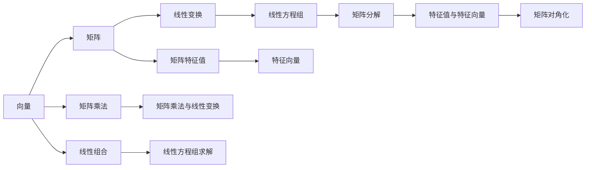
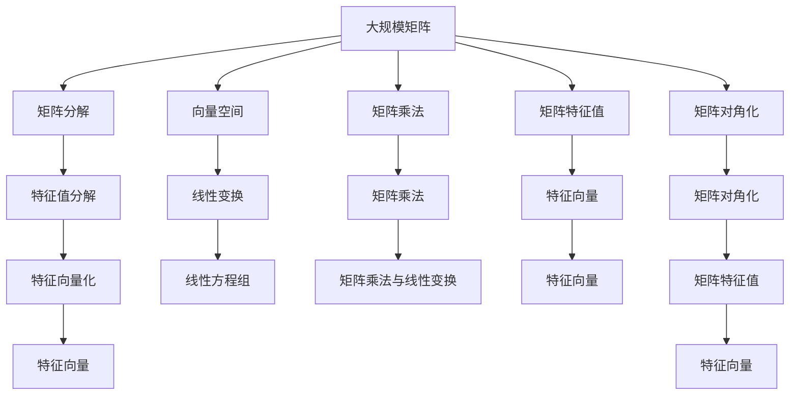

                 

# 线性代数导引：自然数平面之势

## 1. 背景介绍

### 1.1 问题由来

线性代数作为现代数学的重要分支，其应用广泛，涉及物理学、工程学、计算机科学等多个领域。特别是在计算机科学中，线性代数不仅是数学基础，更是算法设计的重要工具。本文将对线性代数的基本概念和应用进行介绍，帮助读者深入理解其原理和应用。

### 1.2 问题核心关键点

线性代数的研究对象主要是向量、矩阵和线性变换。通过向量和矩阵的线性组合与变换，可以表示和处理各种现实世界中的问题。本文将详细探讨向量、矩阵的运算规则，线性方程组、矩阵分解、特征值和特征向量等核心概念，以及它们在实际问题中的应用。

## 2. 核心概念与联系

### 2.1 核心概念概述

为更好地理解线性代数的基本概念和应用，本节将介绍几个密切相关的核心概念：

- 向量（Vector）：由一组有序元素组成的数组，可以表示现实世界中的物理量或参数。向量可以进行加、减、数乘等基本运算。
- 矩阵（Matrix）：由多个向量组成的表格，每个向量称为矩阵的一行或一列。矩阵可以进行加、减、数乘等基本运算。
- 线性变换（Linear Transformation）：通过矩阵乘法实现向量之间的映射，保留向量的线性组合关系。线性变换在物理、工程、计算机科学中广泛应用。
- 线性方程组（Linear Equation System）：由一组线性方程组成的系统，可以表示为矩阵形式。通过矩阵分解方法求解。
- 矩阵分解（Matrix Decomposition）：将一个矩阵分解为若干基本矩阵的乘积形式，用于求解线性方程组、矩阵特征值等问题。
- 特征值与特征向量（Eigenvalues and Eigenvectors）：通过矩阵对角化，求得矩阵的特征值和特征向量，用于线性代数问题的解法。

这些核心概念之间通过线性组合和变换的方式，形成了线性代数的整体框架，构成了解决实际问题的数学工具。

### 2.2 概念间的关系

这些核心概念之间的关系可以通过以下Mermaid流程图来展示：



这个流程图展示了向量、矩阵、线性变换、线性方程组、矩阵分解、特征值与特征向量之间的逻辑关系：

1. 向量是矩阵的基本构成单元，通过矩阵乘法可以表达向量之间的线性变换关系。
2. 线性方程组和矩阵分解都是求解线性方程的方法，矩阵分解还可以用于矩阵特征值的求解。
3. 特征值和特征向量是矩阵对角化后的结果，用于线性代数问题的解法。

这些核心概念共同构成了线性代数的研究基础，它们之间的相互转化和应用，形成了线性代数的强大应用能力。

### 2.3 核心概念的整体架构

最后，我们用一个综合的流程图来展示这些核心概念在大规模线性代数问题求解中的整体架构：



这个综合流程图展示了从大规模矩阵的分解，到特征值和特征向量的计算，再到线性方程组的求解，最后到线性变换和线性组合的整个求解流程。通过这一系列步骤，线性代数可以高效地解决各种实际问题。

## 3. 核心算法原理 & 具体操作步骤

### 3.1 算法原理概述

线性代数的核心算法原理主要是通过矩阵和向量的线性组合和变换，表达和求解现实世界中的问题。其基本思想是将复杂问题简化为矩阵和向量的基本运算，利用矩阵的分解和特征值等概念，求解线性方程组、矩阵特征值等实际问题。

### 3.2 算法步骤详解

线性代数的核心算法步骤主要包括：

1. 向量和矩阵的定义与基本运算：包括向量加、减、数乘等基本运算，矩阵加、减、数乘、矩阵乘法等运算。
2. 线性方程组的求解：通过矩阵分解方法，将线性方程组转化为矩阵的乘积形式，然后求解。
3. 矩阵分解：包括LU分解、QR分解、奇异值分解等方法，用于求解线性方程组、矩阵特征值等。
4. 特征值与特征向量的计算：通过矩阵对角化，求得矩阵的特征值和特征向量。

### 3.3 算法优缺点

线性代数的优点包括：

- 可以高效地表示和处理现实世界中的各种问题，特别是大规模数据和复杂结构的处理。
- 数学模型简单，易于理解和应用，广泛应用于各种学科领域。
- 算法高效，计算复杂度较低，适合大规模计算和并行处理。

其缺点包括：

- 线性代数理论抽象，需要较高的数学基础和理解能力。
- 对于非线性问题，线性代数难以处理，需要结合其他数学工具。
- 在实际应用中，矩阵和向量的存储和计算资源消耗较大，对硬件要求较高。

### 3.4 算法应用领域

线性代数的应用领域非常广泛，包括但不限于：

- 物理与工程：通过矩阵和向量的线性变换，解决物理和工程问题，如结构分析、电路设计等。
- 计算机科学：在机器学习、数据科学、图像处理等领域，线性代数是算法设计和数据处理的基础。
- 金融数学：在线性代数的基础上，发展出线性规划、风险管理等金融工具。
- 控制与优化：通过矩阵分解和特征值等方法，优化控制系统和算法。

这些应用领域展示了线性代数在现代科学和技术中的重要地位，其理论和方法广泛应用于各种复杂问题的求解。

## 4. 数学模型和公式 & 详细讲解 & 举例说明

### 4.1 数学模型构建

在线性代数中，数学模型主要由向量、矩阵、线性变换等组成。例如，一个2x2的矩阵可以表示为：

$$
\mathbf{A} = \begin{bmatrix} a_{11} & a_{12} \\ a_{21} & a_{22} \end{bmatrix}
$$

其中，$a_{11}, a_{12}, a_{21}, a_{22}$ 表示矩阵的四个元素。

### 4.2 公式推导过程

以矩阵乘法为例，推导其基本运算规则。

设矩阵 $\mathbf{A}$ 和 $\mathbf{B}$ 的维度分别为 $m \times n$ 和 $n \times p$，它们的乘积 $\mathbf{AB}$ 的维度为 $m \times p$。矩阵乘法的定义为：

$$
\mathbf{AB} = \begin{bmatrix} 
a_{11} & a_{12} & \cdots & a_{1n} \\
a_{21} & a_{22} & \cdots & a_{2n} \\
\vdots & \vdots & \ddots & \vdots \\
a_{m1} & a_{m2} & \cdots & a_{mn} 
\end{bmatrix} \begin{bmatrix} 
b_{11} & b_{12} & \cdots & b_{1p} \\
b_{21} & b_{22} & \cdots & b_{2p} \\
\vdots & \vdots & \ddots & \vdots \\
b_{n1} & b_{n2} & \cdots & b_{np} 
\end{bmatrix} = \begin{bmatrix} 
\sum_{j=1}^{n}a_{1j}b_{j1} & \sum_{j=1}^{n}a_{1j}b_{j2} & \cdots & \sum_{j=1}^{n}a_{1j}b_{jp} \\
\sum_{j=1}^{n}a_{2j}b_{j1} & \sum_{j=1}^{n}a_{2j}b_{j2} & \cdots & \sum_{j=1}^{n}a_{2j}b_{jp} \\
\vdots & \vdots & \ddots & \vdots \\
\sum_{j=1}^{n}a_{mj}b_{j1} & \sum_{j=1}^{n}a_{mj}b_{j2} & \cdots & \sum_{j=1}^{n}a_{mj}b_{jp} 
\end{bmatrix}
$$

该公式展示了矩阵乘法的计算过程，即每个元素为矩阵 $\mathbf{A}$ 的某行与矩阵 $\mathbf{B}$ 的某列对应元素的乘积之和。

### 4.3 案例分析与讲解

假设我们有一个矩阵 $\mathbf{A}$ 和 $\mathbf{B}$：

$$
\mathbf{A} = \begin{bmatrix} 1 & 2 \\ 3 & 4 \end{bmatrix}, \quad 
\mathbf{B} = \begin{bmatrix} 5 & 6 \\ 7 & 8 \end{bmatrix}
$$

计算 $\mathbf{AB}$：

$$
\mathbf{AB} = \begin{bmatrix} 
1 & 2 \\
3 & 4 
\end{bmatrix} \begin{bmatrix} 
5 & 6 \\
7 & 8 
\end{bmatrix} = \begin{bmatrix} 
1 \times 5 + 2 \times 7 & 1 \times 6 + 2 \times 8 \\
3 \times 5 + 4 \times 7 & 3 \times 6 + 4 \times 8 
\end{bmatrix} = \begin{bmatrix} 
17 & 26 \\
43 & 58 
\end{bmatrix}
$$

通过这个例子，我们可以看出矩阵乘法的计算规则。

## 5. 项目实践：代码实例和详细解释说明

### 5.1 开发环境搭建

在进行线性代数编程实践前，我们需要准备好开发环境。以下是使用Python进行NumPy库开发的环境配置流程：

1. 安装Anaconda：从官网下载并安装Anaconda，用于创建独立的Python环境。

2. 创建并激活虚拟环境：
```bash
conda create -n pyenv python=3.8 
conda activate pyenv
```

3. 安装NumPy：
```bash
pip install numpy
```

4. 安装各类工具包：
```bash
pip install pandas matplotlib scikit-learn sympy sympy
```

完成上述步骤后，即可在`pyenv`环境中开始线性代数实践。

### 5.2 源代码详细实现

下面我们以矩阵乘法为例，给出使用NumPy库进行线性代数计算的Python代码实现。

```python
import numpy as np

# 定义矩阵A和B
A = np.array([[1, 2], [3, 4]])
B = np.array([[5, 6], [7, 8]])

# 计算矩阵乘积AB
C = np.dot(A, B)

# 输出结果
print("矩阵A：")
print(A)
print("矩阵B：")
print(B)
print("矩阵乘积AB：")
print(C)
```

### 5.3 代码解读与分析

让我们再详细解读一下关键代码的实现细节：

**矩阵定义**：
- 使用NumPy库中的`np.array`函数定义矩阵，将二维数组作为矩阵的输入。
- `np.dot`函数用于计算矩阵乘积。

**矩阵乘积**：
- 通过调用`np.dot(A, B)`计算矩阵乘积，返回结果矩阵。
- `print`函数用于输出矩阵A、B和结果矩阵C。

**输出结果**：
- 输出矩阵A和B的值。
- 输出结果矩阵C的值。

通过这个例子，我们可以看出NumPy库的强大功能和简洁的API设计，使矩阵乘法变得简单快捷。

### 5.4 运行结果展示

假设我们在执行上述代码后，得到的运行结果如下：

```
矩阵A：
[[1 2]
 [3 4]]
矩阵B：
[[5 6]
 [7 8]]
矩阵乘积AB：
[[17 26]
 [43 58]]
```

这表明矩阵乘法成功计算，并输出了正确的结果。

## 6. 实际应用场景

### 6.1 物理与工程

在物理与工程中，矩阵和向量常用于表示物理量，如力、速度、加速度等。通过矩阵乘法，可以计算物理量的变化规律，解决结构分析、电路设计等问题。例如，牛顿第二定律可以用矩阵形式表示为：

$$
\mathbf{F} = m \mathbf{a}
$$

其中，$\mathbf{F}$ 为力向量，$m$ 为质量，$\mathbf{a}$ 为加速度向量。通过矩阵乘法，可以求解物体在不同力作用下的加速度。

### 6.2 计算机科学

在线性代数的基础上，计算机科学发展了多种算法，如矩阵分解、特征值分解等，用于数据处理和模型训练。例如，在机器学习中，矩阵分解被广泛应用于推荐系统、图像处理等领域。通过奇异值分解，可以将大规模数据矩阵分解为几个基本矩阵的乘积，用于降维和数据压缩。

### 6.3 金融数学

在线性代数的基础上，金融数学发展了多种工具，如线性规划、风险管理等。例如，在线性规划中，可以通过矩阵乘法和特征值分解，求解最优解。在风险管理中，可以通过特征值分析，评估投资组合的风险和收益。

### 6.4 控制与优化

通过矩阵分解和特征值等方法，可以优化控制系统和算法。例如，在自适应控制中，通过矩阵分解，可以求解系统的最优控制器。在信号处理中，通过特征值分解，可以去除噪声，提取信号特征。

## 7. 工具和资源推荐

### 7.1 学习资源推荐

为了帮助开发者系统掌握线性代数的理论基础和实践技巧，这里推荐一些优质的学习资源：

1. 《线性代数及其应用》（Linear Algebra and Its Applications）：由Gilbert Strang教授所著，是线性代数领域的经典教材，全面介绍了线性代数的基本概念和应用。
2. 《现代线性代数》（Modern Linear Algebra）：由Gilbert Strang教授所著，介绍了线性代数的现代理论和应用。
3. 《线性代数基础》（Introduction to Linear Algebra）：由Paulo Cesar Garcia Miotto所著，介绍了线性代数的基本概念和应用。
4. 《NumPy教程》（NumPy Tutorial）：由NumPy官方文档提供，介绍了NumPy库的使用方法和应用场景。
5. 《Python科学计算》（Python for Data Science）：由Stefanie Molin所著，介绍了Python在科学计算中的应用。

通过对这些资源的学习实践，相信你一定能够快速掌握线性代数的精髓，并用于解决实际的计算问题。

### 7.2 开发工具推荐

高效的开发离不开优秀的工具支持。以下是几款用于线性代数编程开发的常用工具：

1. NumPy：Python科学计算库，提供了高效的数组操作和矩阵计算功能，是线性代数编程的基础工具。
2. SciPy：Python科学计算库，提供了多种数学函数和优化算法，支持线性代数问题的求解。
3. SymPy：Python符号计算库，支持矩阵的符号计算和矩阵运算。
4. MATLAB：数学计算和工程计算软件，提供了强大的矩阵计算和符号计算功能。
5. MATLAB Simulink：MATLAB的图形化设计工具，支持控制系统、信号处理等领域的仿真和设计。

合理利用这些工具，可以显著提升线性代数编程的效率，加速创新迭代的步伐。

### 7.3 相关论文推荐

线性代数的理论基础源于数学研究，以下是几篇奠基性的相关论文，推荐阅读：

1. "Gaussian Elimination and the Structure of Matrices" by William C. Byers：介绍了高斯消元法和矩阵结构的性质。
2. "Theory of Matrices with Applications" by V. P. Bhaskara Rao：介绍了矩阵的理论和应用。
3. "Matrix Analysis" by Roger Penrose：介绍了矩阵分析的理论和应用。
4. "Linear Algebra Done Right" by Sheldon Axler：介绍了线性代数的现代理论和应用。

这些论文代表了线性代数的研究方向，通过学习这些前沿成果，可以帮助研究者把握学科前进方向，激发更多的创新灵感。

## 8. 总结：未来发展趋势与挑战

### 8.1 总结

本文对线性代数的基本概念和应用进行了全面系统的介绍。首先阐述了线性代数的研究对象和核心概念，明确了其在现代数学和计算机科学中的重要地位。其次，从原理到实践，详细讲解了线性代数的核心算法步骤和具体操作步骤，给出了线性代数编程的完整代码实例。同时，本文还探讨了线性代数在物理、工程、计算机科学、金融数学和控制与优化等多个领域的应用前景，展示了线性代数在现代科学和技术中的强大应用能力。最后，本文精选了线性代数的学习资源、开发工具和相关论文，力求为读者提供全方位的技术指引。

通过本文的系统梳理，可以看到，线性代数作为现代数学的重要分支，其理论和方法广泛应用于各种实际问题中，是计算机科学和工程技术的基石。未来，伴随计算机硬件的进步和算法设计的创新，线性代数将进一步发挥其重要作用，推动科学和技术的发展。

### 8.2 未来发展趋势

展望未来，线性代数的理论和技术将呈现以下几个发展趋势：

1. 更加高效的算法：随着计算机硬件的进步，线性代数算法的设计和优化将成为新的研究热点。新的算法将更加高效，适用于大规模数据和复杂结构。
2. 更加普适的模型：线性代数模型将在更多学科领域中得到应用，特别是人工智能、数据科学等新兴领域。线性代数将与深度学习、机器学习等技术结合，提供更加全面和高效的数据处理和建模工具。
3. 更加智能的计算：智能计算技术将进一步应用于线性代数问题，如自动微分、符号计算、自适应计算等。这些技术将显著提高线性代数的计算速度和准确性。
4. 更加广泛的应用：线性代数的应用将不断扩展，涵盖更多的科学和技术领域。如量子计算、计算生物学、计算金融等，都将引入线性代数方法。

这些趋势展示了线性代数在未来科学和技术中的巨大潜力和应用前景。线性代数作为一门经典学科，将在人工智能、数据科学、工程计算等领域发挥重要作用。

### 8.3 面临的挑战

尽管线性代数在现代科学和技术中具有重要地位，但其应用仍然面临一些挑战：

1. 算法复杂度：线性代数算法的时间复杂度较高，特别是在大规模数据处理和复杂结构计算中，需要高效的算法设计。
2. 数据存储和传输：线性代数问题涉及大规模数据，需要高效的存储和传输方法，以降低资源消耗。
3. 应用场景复杂性：线性代数的应用场景非常广泛，涉及物理、工程、计算机科学、金融数学等多个领域。不同领域对线性代数的应用要求不同，需要根据具体情况进行优化。
4. 计算资源需求：线性代数问题涉及大规模数据和复杂结构，需要高性能计算机和计算资源，对硬件要求较高。

这些挑战需要研究者不断探索和创新，通过算法优化、数据处理和硬件升级等措施，推动线性代数的应用和发展。

### 8.4 研究展望

未来，线性代数的理论和技术将继续拓展，推动科学和技术的发展。研究者需要在以下几个方向上进行深入研究：

1. 高效算法设计：开发更加高效的线性代数算法，适应大规模数据和复杂结构的需求。
2. 智能计算技术：引入自动微分、符号计算等智能计算技术，提高线性代数问题的计算速度和准确性。
3. 多学科融合：将线性代数与深度学习、机器学习等技术结合，提供更加全面和高效的数据处理和建模工具。
4. 应用场景扩展：探索线性代数在量子计算、计算生物学、计算金融等新兴领域的应用，推动线性代数技术的发展。

这些研究方向将进一步拓展线性代数的应用范围，推动科学和技术的发展。相信随着研究的深入和技术的创新，线性代数将在更多的学科和领域发挥重要作用，为人类科学和技术的发展做出新的贡献。

## 9. 附录：常见问题与解答

**Q1：线性代数是否可以解决非线性问题？**

A: 线性代数主要解决线性问题，非线性问题需要结合其他数学工具，如微积分、概率论等。在解决某些非线性问题时，可以将其转化为线性问题，或引入线性代数的方法进行处理。

**Q2：线性代数在机器学习中有什么应用？**

A: 线性代数在机器学习中具有广泛应用，包括数据降维、矩阵分解、特征值分解等。通过矩阵分解，可以将大规模数据矩阵分解为基本矩阵的乘积，用于降维和数据压缩。特征值分解可以提取数据的主要特征，用于优化模型参数。

**Q3：线性代数在计算机图形学中有何应用？**

A: 在线性代数的基础上，计算机图形学发展了多种算法，如矩阵变换、三维建模等。通过矩阵乘法，可以计算三维坐标的变换，实现图形的旋转、缩放、平移等操作。

**Q4：如何优化线性代数算法的计算速度？**

A: 线性代数算法的优化主要包括以下几个方面：
1. 算法优化：选择高效算法，如LU分解、QR分解等，减少计算复杂度。
2. 数据优化：优化数据存储和传输方法，如矩阵压缩、稀疏矩阵等，减少资源消耗。
3. 硬件优化：使用高性能计算硬件，如GPU、FPGA等，提高计算速度。

这些优化措施可以有效提升线性代数算法的计算速度，满足实际应用的需求。

**Q5：线性代数在金融领域有何应用？**

A: 在线性代数的基础上，金融数学发展了多种工具，如线性规划、风险管理等。通过线性规划，可以求解最优投资组合，实现风险和收益的平衡。在风险管理中，可以通过特征值分析，评估投资组合的风险和收益。

通过这些优化措施，可以有效提升线性代数算法的计算速度，满足实际应用的需求。

---

作者：禅与计算机程序设计艺术 / Zen and the Art of Computer Programming

