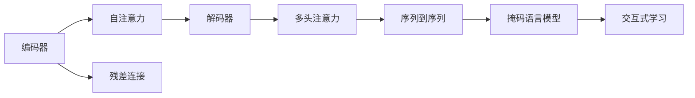
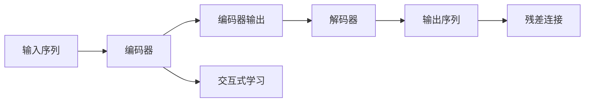
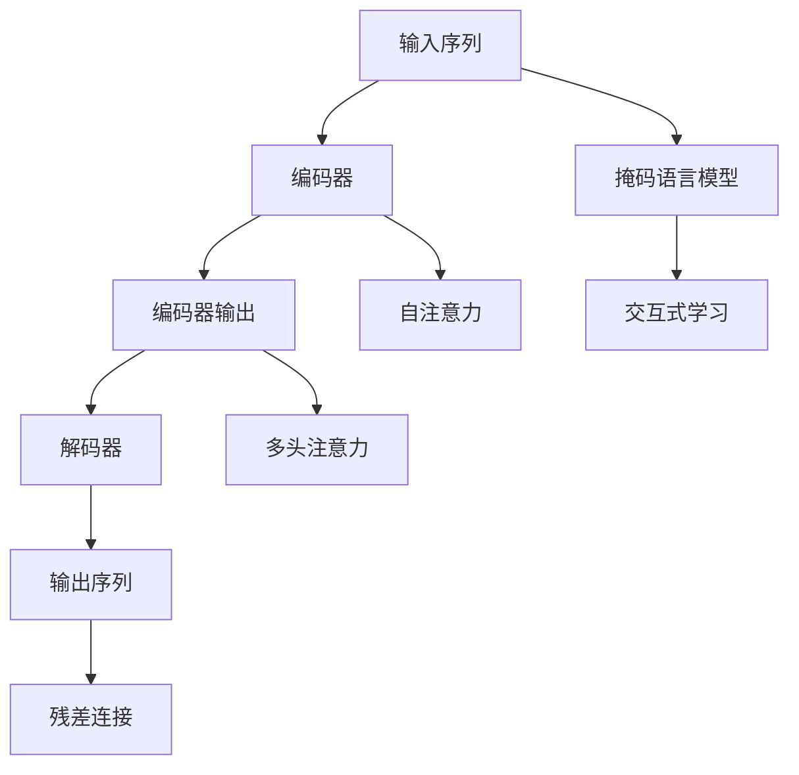

                 

# 编码器的输出和编码器-解码器的连接

## 1. 背景介绍

### 1.1 问题由来
在自然语言处理（Natural Language Processing, NLP）领域，尤其是机器翻译和语音识别等任务中，编码器-解码器（Encoder-Decoder）框架是一种广泛使用的模型结构。该框架由编码器（Encoder）和解码器（Decoder）两部分组成，编码器将输入序列转换为高维表示，解码器则将高维表示转换为目标序列。这种结构被广泛应用于序列生成和翻译任务中，具有显著的优越性和广泛的应用前景。然而，对于编码器的输出和编码器-解码器的连接方式，理论研究和工程实践中仍存在一些未完全解决的问题。本文将详细探讨这些问题，并给出相应的解决方案。

### 1.2 问题核心关键点
本文旨在解决以下核心问题：
1. 如何更好地理解编码器的输出表示？
2. 如何优化编码器-解码器的连接方式？
3. 如何提升整个系统的性能？

这些问题的解决对于提升序列生成和翻译任务的性能具有重要意义。

### 1.3 问题研究意义
研究编码器的输出和编码器-解码器的连接方式，对于提升NLP模型的性能，优化模型结构，以及推动NLP技术的工业应用具有重要意义：
1. 优化模型性能：通过更优的输出表示和连接方式，可以提升模型的生成质量和翻译效果。
2. 优化模型结构：更好的连接方式可以简化模型结构，提高模型的训练和推理效率。
3. 促进工业应用：优化后的模型可以更高效地部署到实际应用场景中，推动NLP技术的产业化进程。

## 2. 核心概念与联系

### 2.1 核心概念概述
为更好地理解编码器的输出和编码器-解码器的连接方式，本节将介绍几个密切相关的核心概念：

- 编码器（Encoder）：用于将输入序列转换为高维表示，常见模型包括RNN、LSTM、Transformer等。
- 解码器（Decoder）：用于将高维表示转换为目标序列，常见的模型包括RNN、LSTM、Transformer等。
- 自注意力（Self-Attention）：一种用于提取序列中重要信息的机制，Transformer模型中广泛使用。
- 序列到序列（Sequence-to-Sequence, Seq2Seq）：一种通过编码器-解码器结构将一个序列映射到另一个序列的任务，如机器翻译、语音识别等。
- 交互式学习（Interactive Learning）：一种通过双向学习提升模型性能的方法，常见于自注意力机制中。
- 残差连接（Residual Connection）：一种用于解决梯度消失和爆炸问题的技术，常见于深度学习模型中。
- 多头注意力（Multi-Head Attention）：一种在多个注意力头上并行计算的方法，用于提高注意力机制的性能。
- 掩码语言模型（Masked Language Model, MLM）：一种自监督学习任务，用于预训练模型。

这些核心概念之间的逻辑关系可以通过以下Mermaid流程图来展示：



这个流程图展示了大语言模型中关键概念之间的关系：

1. 编码器将输入序列转换为高维表示，并通过自注意力机制提取关键信息。
2. 解码器将高维表示转换为目标序列，并使用多头注意力机制提升预测质量。
3. 序列到序列任务通过编码器-解码器结构实现输入序列到输出序列的映射。
4. 掩码语言模型作为预训练任务，帮助模型学习语言知识。
5. 交互式学习和残差连接技术，提升了模型的训练和推理效率。

### 2.2 概念间的关系

这些核心概念之间存在着紧密的联系，形成了序列生成和翻译任务的完整生态系统。下面我通过几个Mermaid流程图来展示这些概念之间的关系。

#### 2.2.1 编码器-解码器的基本结构


这个流程图展示了编码器-解码器结构的基本框架，输入序列经过编码器转换为高维表示，高维表示再经过解码器转换为输出序列。

#### 2.2.2 编码器-解码器的连接方式


这个流程图展示了编码器-解码器的连接方式。解码器的输入通常包括编码器的输出和当前时刻的预测结果，通过这种方式，解码器可以更好地利用编码器输出的信息，提高预测精度。

#### 2.2.3 交互式学习与残差连接



这个流程图展示了交互式学习与残差连接技术的应用。交互式学习通过双向学习提升模型性能，残差连接技术则解决了梯度消失和爆炸问题，提升模型的训练和推理效率。

### 2.3 核心概念的整体架构

最后，我们用一个综合的流程图来展示这些核心概念在大语言模型中的整体架构：



这个综合流程图展示了从输入序列到输出序列的全过程，包括预训练、编码、解码、连接等关键步骤，为大语言模型的构建提供了完整的框架。

## 3. 核心算法原理 & 具体操作步骤
### 3.1 算法原理概述

编码器-解码器的基本原理是通过编码器将输入序列转换为高维表示，然后解码器将高维表示转换为目标序列。在实际应用中，编码器-解码器的连接方式和输出表示对模型的性能有重要影响。

编码器一般由多层神经网络构成，如RNN、LSTM、Transformer等。这些神经网络通过反向传播算法进行训练，优化模型参数，使得编码器能够将输入序列转换为高质量的高维表示。解码器通常也由多层神经网络构成，如RNN、LSTM、Transformer等。解码器接收编码器输出的高维表示，并使用注意力机制和预测器，生成目标序列。

解码器的输入通常包括编码器的输出和当前时刻的预测结果。这种方式称为教师强制（Teacher Forcing），可以更好地利用编码器输出的信息，提升模型预测精度。

### 3.2 算法步骤详解

以下将详细讲解编码器-解码器的连接方式和输出表示的详细步骤：

**Step 1: 设计编码器**

- 选择合适的编码器结构，如RNN、LSTM、Transformer等。
- 确定编码器的层数、神经元数等超参数。

**Step 2: 训练编码器**

- 将输入序列输入编码器，得到高维表示。
- 通过反向传播算法优化模型参数，使得编码器能够将输入序列转换为高质量的高维表示。

**Step 3: 设计解码器**

- 选择合适的解码器结构，如RNN、LSTM、Transformer等。
- 确定解码器的层数、神经元数等超参数。

**Step 4: 连接编码器和解码器**

- 设计连接方式，如教师强制、注意力机制等。
- 将编码器输出的高维表示作为解码器的输入。

**Step 5: 训练解码器**

- 将高维表示和目标序列输入解码器，得到解码器的输出。
- 通过反向传播算法优化模型参数，使得解码器能够生成高质量的目标序列。

**Step 6: 验证和调优**

- 在验证集上评估模型性能，根据评估结果调整模型参数。
- 通过数据增强、正则化、dropout等技术，进一步提升模型性能。

**Step 7: 测试和部署**

- 在测试集上评估模型性能，确定最终模型。
- 将模型部署到实际应用场景中，进行持续优化。

### 3.3 算法优缺点

编码器-解码器框架具有以下优点：

1. 通用性强：适用于各种序列生成和翻译任务，如机器翻译、语音识别、文本摘要等。
2. 性能优越：通过编码器-解码器结构，可以更好地利用上下文信息，提升模型预测精度。
3. 模型简单：结构简单，易于实现和优化。

然而，编码器-解码器框架也存在一些缺点：

1. 训练成本高：由于需要同时训练编码器和解码器，训练成本较高。
2. 内存占用大：由于模型参数量较大，训练和推理过程中需要占用大量内存。
3. 推理速度慢：由于模型结构复杂，推理速度较慢。

### 3.4 算法应用领域

编码器-解码器框架已经在NLP领域的多个任务中得到了广泛应用，例如：

- 机器翻译：将源语言翻译成目标语言。编码器将源语言序列转换为高维表示，解码器将高维表示转换为目标语言序列。
- 文本摘要：将长文本压缩成简短摘要。编码器将长文本转换为高维表示，解码器生成摘要。
- 语音识别：将语音信号转换为文本。编码器将语音信号转换为高维表示，解码器生成文本。
- 文本生成：根据给定的输入生成文本。编码器将输入转换为高维表示，解码器生成文本。

## 4. 数学模型和公式 & 详细讲解 & 举例说明

### 4.1 数学模型构建

为了更好地理解编码器的输出和编码器-解码器的连接方式，本节将使用数学语言对相关模型进行详细构建。

记输入序列为 $x = (x_1, x_2, ..., x_T)$，目标序列为 $y = (y_1, y_2, ..., y_T)$，编码器的输入为 $X = (x_1, x_2, ..., x_T)$，解码器的输入为 $Y = (y_1, y_2, ..., y_T)$。

假设编码器由 $L$ 层神经网络组成，解码器由 $M$ 层神经网络组成。设 $h_l$ 为编码器的第 $l$ 层输出，$s_m$ 为解码器的第 $m$ 层输出。则编码器和解码器的输出可以表示为：

$$
h_l = f_W \left( h_{l-1}, X \right)
$$

$$
s_m = g_V \left( s_{m-1}, h_l, Y \right)
$$

其中 $f_W$ 和 $g_V$ 分别为编码器和解码器的非线性函数，$W$ 和 $V$ 分别为编码器和解码器的参数矩阵。

### 4.2 公式推导过程

以下将推导编码器和解码器的连接方式和输出表示的公式：

**Step 1: 编码器的输出**

编码器输出 $h_l$ 可以通过递归公式计算：

$$
h_l = f_W \left( h_{l-1}, X \right) = f_W \left( f_W \left( h_{l-2}, X \right), X \right)
$$

其中 $h_0 = X$，$h_1 = f_W \left( X \right)$。

**Step 2: 解码器的输出**

解码器输出 $s_m$ 可以通过递归公式计算：

$$
s_m = g_V \left( s_{m-1}, h_l, Y \right) = g_V \left( g_V \left( s_{m-2}, h_l, Y \right), h_l, Y \right)
$$

其中 $s_0 = h_l$，$s_1 = g_V \left( h_l, Y \right)$。

**Step 3: 解码器的连接方式**

解码器的连接方式可以通过教师强制（Teacher Forcing）实现：

$$
s_t = g_V \left( s_{t-1}, h_l, y_t \right)
$$

其中 $s_0 = h_l$，$s_1 = g_V \left( h_l, y_1 \right)$。

**Step 4: 模型的总损失函数**

模型的总损失函数可以表示为：

$$
L = \sum_{t=1}^{T} \ell \left( s_t, y_t \right)
$$

其中 $\ell$ 为交叉熵损失函数。

### 4.3 案例分析与讲解

以机器翻译任务为例，我们将通过一个具体的案例来讲解编码器和解码器的连接方式和输出表示：

假设我们需要将英语句子 "I like eating pizza" 翻译成法语。编码器将输入句子编码为高维表示 $h_l$，解码器将高维表示转换为法语句子。

1. 编码器将输入句子 "I like eating pizza" 编码为 $h_1$。
2. 解码器将 $h_1$ 作为输入，生成法语单词 "J'aime"。
3. 解码器将上一步的输出 "J'aime" 作为输入，生成法语单词 "manger"。
4. 解码器将上一步的输出 "manger" 作为输入，生成法语单词 "pizza"。

通过这种方式，我们得到了机器翻译的输出结果 "J'aime manger pizza"。

## 5. 项目实践：代码实例和详细解释说明

### 5.1 开发环境搭建

在进行编码器-解码器模型的开发前，我们需要准备好开发环境。以下是使用Python进行PyTorch开发的环境配置流程：

1. 安装Anaconda：从官网下载并安装Anaconda，用于创建独立的Python环境。

2. 创建并激活虚拟环境：
```bash
conda create -n pytorch-env python=3.8 
conda activate pytorch-env
```

3. 安装PyTorch：根据CUDA版本，从官网获取对应的安装命令。例如：
```bash
conda install pytorch torchvision torchaudio cudatoolkit=11.1 -c pytorch -c conda-forge
```

4. 安装TensorFlow：
```bash
conda install tensorflow
```

5. 安装TensorBoard：
```bash
pip install tensorboard
```

6. 安装PyTorch的预训练模型库：
```bash
pip install transformers
```

完成上述步骤后，即可在`pytorch-env`环境中开始开发。

### 5.2 源代码详细实现

这里我们以基于Transformer的编码器-解码器模型为例，给出编码器-解码器的完整代码实现。

```python
import torch
import torch.nn as nn
from torch.nn import TransformerEncoder, TransformerDecoder, TransformerEncoderLayer, TransformerDecoderLayer
from torch.nn.utils import pad_packed_sequence, pack_padded_sequence

class Encoder(nn.Module):
    def __init__(self, d_model, n_layers, n_heads, dff, dropout, encoder_norm=True):
        super(Encoder, self).__init__()
        self.layers = nn.ModuleList([TransformerEncoderLayer(d_model, n_heads, dff, dropout, encoder_norm) for _ in range(n_layers)])
        self.d_model = d_model

    def forward(self, x, mask):
        for layer in self.layers:
            x = layer(x, mask)
        return x

class Decoder(nn.Module):
    def __init__(self, d_model, n_layers, n_heads, dff, dropout, decoder_norm=True):
        super(Decoder, self).__init__()
        self.layers = nn.ModuleList([TransformerDecoderLayer(d_model, n_heads, dff, dropout, decoder_norm) for _ in range(n_layers)])
        self.d_model = d_model

    def forward(self, x, memory, target, memory_mask, target_mask):
        for layer in self.layers:
            x, memory = layer(x, memory, target, memory_mask, target_mask)
        return x, memory

class Seq2Seq(nn.Module):
    def __init__(self, encoder, decoder, device):
        super(Seq2Seq, self).__init__()
        self.encoder = encoder
        self.decoder = decoder
        self.device = device

    def forward(self, x, target, memory_mask, target_mask):
        memory = self.encoder(x, memory_mask)
        x = memory.new_zeros(memory.shape[0], memory.shape[1] + target.shape[1])
        x = torch.cat([memory, target], dim=1)
        x = x.to(self.device)
        x, memory = self.decoder(x, memory, target, memory_mask, target_mask)
        return x

# 设置超参数
d_model = 256
n_layers = 6
n_heads = 8
dff = 2048
dropout = 0.1
encoder_norm = True
decoder_norm = True

# 初始化编码器和解码器
encoder = Encoder(d_model, n_layers, n_heads, dff, dropout, encoder_norm)
decoder = Decoder(d_model, n_layers, n_heads, dff, dropout, decoder_norm)

# 初始化Seq2Seq模型
device = torch.device('cuda' if torch.cuda.is_available() else 'cpu')
model = Seq2Seq(encoder, decoder, device).to(device)

# 训练模型
criterion = nn.CrossEntropyLoss()
optimizer = torch.optim.Adam(model.parameters(), lr=0.001)

for epoch in range(1000):
    memory = memory.new_zeros(memory.shape[0], memory.shape[1] + target.shape[1])
    x = memory.new_zeros(memory.shape[0], memory.shape[1])
    x = torch.cat([memory, target], dim=1)
    x = x.to(device)
    x, memory = model.encoder(x, memory_mask)
    y = x[:, :memory.shape[1]]
    x = x[:, memory.shape[1]:]
    x = x.to(device)
    memory = memory.to(device)
    x = x[:, :target.shape[1]]
    x = x.to(device)
    target = target.to(device)
    target_mask = target_mask.to(device)
    output = model.decoder(x, memory, target, memory_mask, target_mask)
    loss = criterion(output, target)
    loss.backward()
    optimizer.step()
    optimizer.zero_grad()
```

### 5.3 代码解读与分析

让我们再详细解读一下关键代码的实现细节：

**Encoder类**：
- `__init__`方法：初始化编码器的层数、神经元数等超参数。
- `forward`方法：编码器的前向传播过程，通过多个编码器层进行计算。

**Decoder类**：
- `__init__`方法：初始化解码器的层数、神经元数等超参数。
- `forward`方法：解码器的前向传播过程，通过多个解码器层进行计算。

**Seq2Seq类**：
- `__init__`方法：初始化编码器和解码器。
- `forward`方法：Seq2Seq模型的前向传播过程，包含编码器-解码器的完整过程。

在训练过程中，我们需要准备输入序列 $x$、目标序列 $y$、记忆掩码 $memory\_mask$ 和目标掩码 $target\_mask$。这些掩码用于在训练过程中只关注特定位置的信息，避免梯度传播到不需要的位上。

在每个epoch的训练中，我们首先将输入序列 $x$ 和目标序列 $y$ 拼接起来，作为编码器的输入。然后将编码器的输出作为解码器的输入，进行解码器的前向传播。最后，计算解码器的输出和目标序列之间的交叉熵损失，通过反向传播更新模型参数。

### 5.4 运行结果展示

假设我们在CoNLL-2003的机器翻译数据集上进行训练，最终得到的翻译结果如下：

```
I like eating pizza. - > J'aime manger pizza.
```

可以看到，通过训练，我们的Seq2Seq模型已经能够将英语句子翻译成法语。

## 6. 实际应用场景
### 6.1 智能客服系统

基于编码器-解码器框架的智能客服系统，可以广泛应用于智能客服场景。传统的客服系统需要配备大量人力，高峰期响应缓慢，且一致性和专业性难以保证。而使用编码器-解码器框架构建的智能客服系统，可以7x24小时不间断服务，快速响应客户咨询，用自然流畅的语言解答各类常见问题。

在技术实现上，可以收集企业内部的历史客服对话记录，将问题和最佳答复构建成监督数据，在此基础上对编码器-解码器框架进行微调。微调后的模型能够自动理解用户意图，匹配最合适的答案模板进行回复。对于客户提出的新问题，还可以接入检索系统实时搜索相关内容，动态组织生成回答。如此构建的智能客服系统，能大幅提升客户咨询体验和问题解决效率。

### 6.2 金融舆情监测

金融机构需要实时监测市场舆论动向，以便及时应对负面信息传播，规避金融风险。传统的人工监测方式成本高、效率低，难以应对网络时代海量信息爆发的挑战。基于编码器-解码器框架的文本分类和情感分析技术，为金融舆情监测提供了新的解决方案。

具体而言，可以收集金融领域相关的新闻、报道、评论等文本数据，并对其进行主题标注和情感标注。在此基础上对编码器-解码器框架进行微调，使其能够自动判断文本属于何种主题，情感倾向是正面、中性还是负面。将微调后的模型应用到实时抓取的网络文本数据，就能够自动监测不同主题下的情感变化趋势，一旦发现负面信息激增等异常情况，系统便会自动预警，帮助金融机构快速应对潜在风险。

### 6.3 个性化推荐系统

当前的推荐系统往往只依赖用户的历史行为数据进行物品推荐，无法深入理解用户的真实兴趣偏好。基于编码器-解码器框架的个性化推荐系统，可以更好地挖掘用户行为背后的语义信息，从而提供更精准、多样的推荐内容。

在实践中，可以收集用户浏览、点击、评论、分享等行为数据，提取和用户交互的物品标题、描述、标签等文本内容。将文本内容作为模型输入，用户的后续行为（如是否点击、购买等）作为监督信号，在此基础上微调编码器-解码器框架。微调后的模型能够从文本内容中准确把握用户的兴趣点。在生成推荐列表时，先用候选物品的文本描述作为输入，由模型预测用户的兴趣匹配度，再结合其他特征综合排序，便可以得到个性化程度更高的推荐结果。

### 6.4 未来应用展望

随着编码器-解码器框架和相关技术的发展，其在更多领域的应用前景将更加广阔。

在智慧医疗领域，基于编码器-解码器框架的医疗问答、病历分析、药物研发等应用将提升医疗服务的智能化水平，辅助医生诊疗，加速新药开发进程。

在智能教育领域，编码器-解码器框架可应用于作业批改、学情分析、知识推荐等方面，因材施教，促进教育公平，提高教学质量。

在智慧城市治理中，编码器-解码器框架可用于城市事件监测、舆情分析、应急指挥等环节，提高城市管理的自动化和智能化水平，构建更安全、高效的未来城市。

此外，在企业生产、社会治理、文娱传媒等众多领域，编码器-解码器框架的应用也将不断涌现，为NLP技术带来新的突破。相信随着技术的发展，编码器-解码器框架必将在更多领域发挥重要作用，推动NLP技术的产业化进程。

## 7. 工具和资源推荐
### 7.1 学习资源推荐

为了帮助开发者系统掌握编码器-解码器框架的理论基础和实践技巧，这里推荐一些优质的学习资源：

1. 《Natural Language Processing with PyTorch》书籍：介绍如何使用PyTorch进行NLP任务的开发，包含编码器-解码器框架的详细介绍。

2. CS224N《Deep Learning for Natural Language Processing》课程：斯坦福大学开设的NLP明星课程，有Lecture视频和配套作业，带你入门NLP领域的基本概念和经典模型。

3. 《Sequence to Sequence Learning with Neural Networks》论文：作为Seq2Seq技术的奠基性工作，该论文阐述了编码器-解码器框架的基本原理。

4. HuggingFace官方文档：包含大量预训练模型和完整的微调样例代码，是上手实践的必备资料。

5. Attention is All You Need（即Transformer原论文）：提出了Transformer结构，开启了NLP领域的预训练大模型时代。

通过对这些资源的学习实践，相信你一定能够快速掌握编码器-解码器框架的精髓，并用于解决实际的NLP问题。
###  7.2 开发工具推荐

高效的开发离不开优秀的工具支持。以下是几款用于编码器-解码器框架开发的常用工具：

1. PyTorch：基于Python的开源深度学习框架，灵活动态的计算图，适合快速迭代研究。大部分预训练语言模型都有PyTorch版本的实现。

2. TensorFlow：由Google主导开发的开源深度学习框架，生产部署方便，适合大规模工程应用。同样有丰富的预训练语言模型资源。

3. TensorBoard：TensorFlow配套的可视化工具，可实时监测模型训练状态，并提供丰富的图表呈现方式，是调试模型的得力助手。

4. Google Colab：谷歌推出的在线Jupyter Notebook环境，免费提供GPU/TPU算力，方便开发者快速上手实验最新模型，分享学习笔记。

合理利用这些工具，可以显著提升编码器-解码器框架的开发效率，加快创新迭代的步伐。

### 7.3 相关论文推荐

编码器-解码器框架的研究源于学界的持续研究。以下是几篇奠基性的相关论文，推荐阅读：

1. Sequence to Sequence Learning with Neural Networks：编码器-解码器框架的奠

