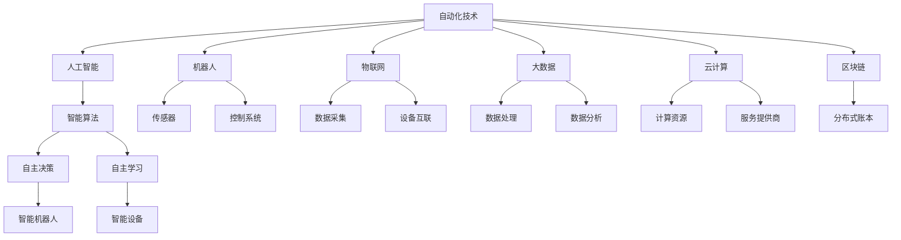
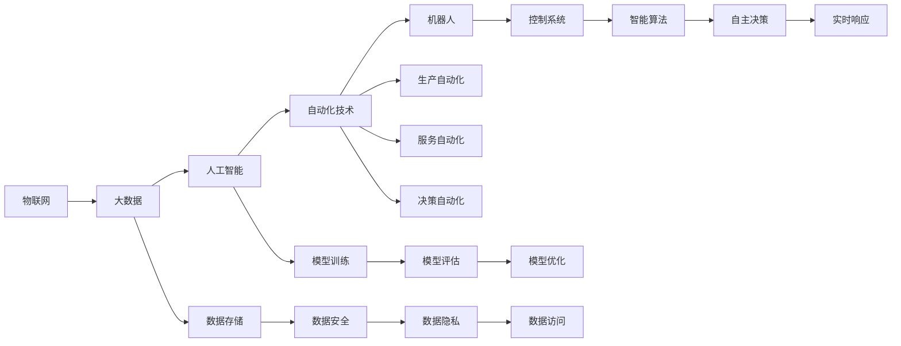
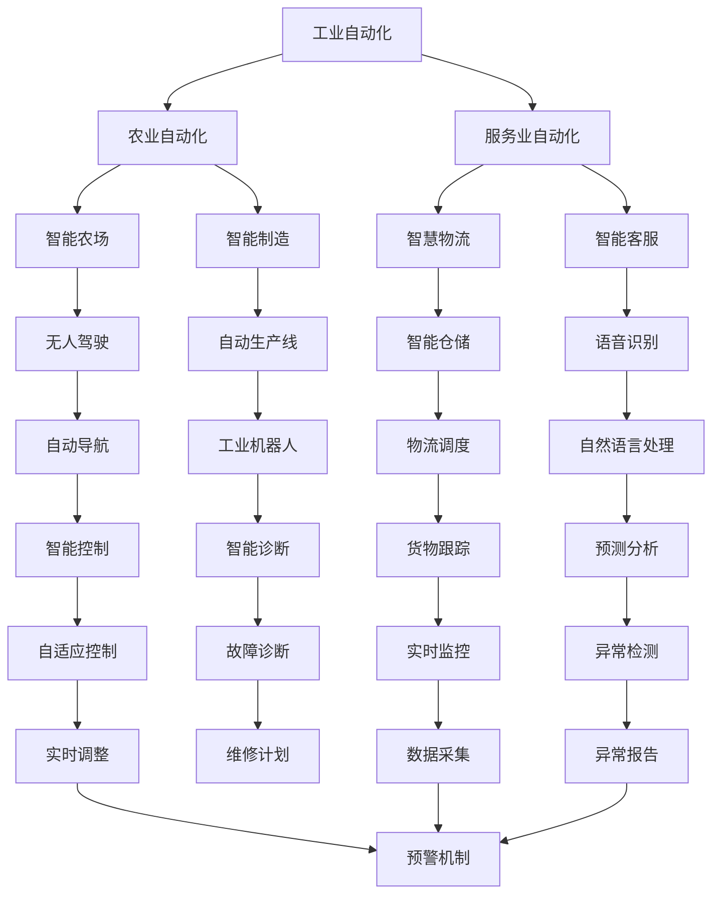
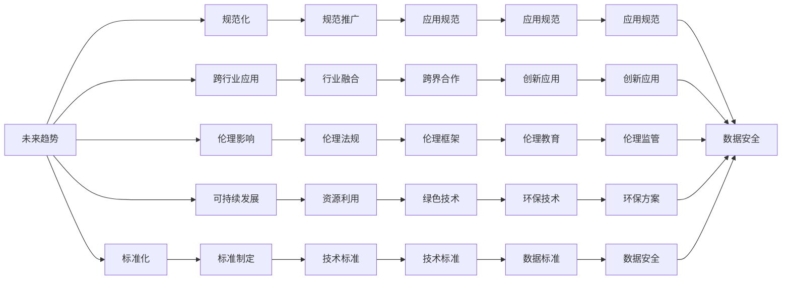
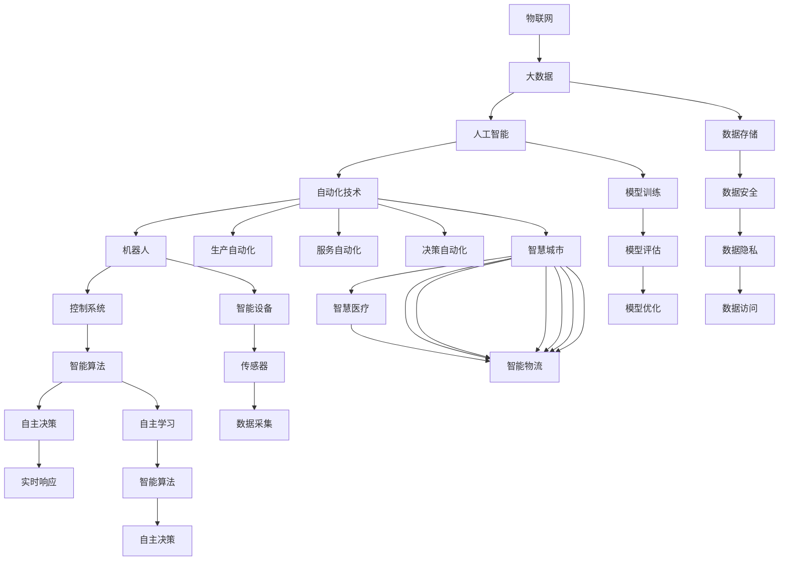

                 

# 自动化技术的未来发展方向

## 1. 背景介绍

### 1.1 问题由来
自动化技术的发展已经成为推动社会进步和经济增长的关键因素。从工业自动化到服务业自动化，从基础科学研究到商业应用，自动化技术的应用已经渗透到了各行各业。随着人工智能、机器学习等前沿技术的兴起，自动化技术正在迎来新的发展机遇和挑战。

自动化技术的核心目标是通过智能算法和先进设备，实现生产、服务和决策等环节的自动化，提升效率和质量，减少人为错误，优化资源配置。这不仅能带来经济效益，还能提升人类生活质量，促进社会进步。

### 1.2 问题核心关键点
自动化技术的发展趋势和方向，涉及多个核心关键点：

- 自动化技术与人工智能的融合：自动化技术在深度学习、自然语言处理、计算机视觉等领域的广泛应用，使得其变得更加智能化和灵活化。
- 自动化技术的标准化和规范化：为了确保自动化系统的可靠性和安全性，需要制定一系列的标准和规范，如ISO 22301等。
- 自动化技术的跨行业应用：自动化技术在医疗、教育、交通、制造等不同领域的应用，带来了诸多创新和突破。
- 自动化技术的伦理和社会影响：自动化技术的应用需要考虑伦理和社会影响，避免对就业、隐私、安全等方面造成负面影响。
- 自动化技术的可持续发展：在推进自动化技术的同时，需要关注环境、资源和能源的可持续利用。

### 1.3 问题研究意义
自动化技术的发展对于提升生产力、促进产业升级、改善生活质量等方面具有重要意义：

1. 提高生产效率：自动化技术通过智能算法和先进设备，可以大幅提高生产效率，降低成本。
2. 推动产业升级：自动化技术推动传统产业向智能化、高效化转型，提升产业链水平。
3. 改善生活质量：自动化技术使得日常生活中的许多重复性、危险性工作得到自动化替代，提升人类生活质量。
4. 促进技术创新：自动化技术的普及和应用，带来了诸多新技术和新方法的涌现，推动了整体技术进步。
5. 构建智慧社会：自动化技术在智慧城市、智慧医疗、智慧教育等领域的广泛应用，促进了智慧社会的构建。

## 2. 核心概念与联系

### 2.1 核心概念概述

为更好地理解自动化技术的发展方向，本节将介绍几个密切相关的核心概念：

- **自动化技术**：通过智能算法和先进设备，实现生产、服务和决策等环节的自动化。自动化技术广泛应用于工业、农业、服务业等多个领域。
- **人工智能**：利用计算机模拟人类的智能行为，实现自主决策、自主学习等功能。人工智能是自动化技术的重要组成部分，推动了自动化技术的智能化和灵活化。
- **机器人**：一种可以执行复杂任务的自动化设备，通过传感器和控制系统，实现自主操作和交互。
- **物联网(IoT)**：通过连接各种设备和传感器，实现物理世界的数字化和智能化。物联网是自动化技术的核心基础设施，提供了丰富的数据源和交互手段。
- **大数据**：海量数据的收集、存储、处理和分析，为自动化技术提供了强大的数据支撑。大数据技术的发展，使得自动化系统能够更好地进行实时决策和优化。
- **云计算**：通过互联网提供计算资源和服务，使得自动化系统能够更加高效地运行和扩展。云计算为自动化技术提供了强大的计算平台和数据中心。
- **区块链**：一种分布式账本技术，用于记录和验证交易信息。区块链技术在自动化领域的应用，提升了数据的安全性和透明性。

这些核心概念之间的逻辑关系可以通过以下Mermaid流程图来展示：



这个流程图展示了一些核心概念及其之间的联系：

1. 自动化技术以人工智能为驱动，通过智能算法实现自主决策和自主学习。
2. 机器人是自动化技术的执行单元，通过传感器和控制系统进行自主操作。
3. 物联网提供了设备互联和数据采集的基础设施，使自动化系统能够实时感知和响应环境变化。
4. 大数据技术为自动化系统提供了海量数据支撑，帮助其进行实时分析和优化。
5. 云计算提供了强大的计算平台和数据中心，支持自动化系统的稳定运行和扩展。
6. 区块链提升了数据的安全性和透明性，保障了自动化系统的数据可信度。

### 2.2 概念间的关系

这些核心概念之间存在着紧密的联系，形成了自动化技术的发展框架。下面我们通过几个Mermaid流程图来展示这些概念之间的关系。

#### 2.2.1 自动化技术的总体架构



这个流程图展示了自动化技术在物联网、大数据、人工智能等技术支撑下的总体架构。

#### 2.2.2 自动化技术的具体应用



这个流程图展示了自动化技术在工业、农业、服务业等不同领域的具体应用场景。

#### 2.2.3 自动化技术的未来展望



这个流程图展示了自动化技术的未来发展趋势和方向。

### 2.3 核心概念的整体架构

最后，我们用一个综合的流程图来展示这些核心概念在自动化技术发展中的整体架构：



这个综合流程图展示了自动化技术在多个领域的应用场景和未来发展方向。

## 3. 核心算法原理 & 具体操作步骤
### 3.1 算法原理概述

自动化技术的核心算法原理涉及多个方面，主要包括自动化决策、自主学习、智能控制等。下面以自动化决策和自主学习为例，进行详细讲解。

#### 3.1.1 自动化决策算法

自动化决策算法通常基于规则、模型和智能算法实现。其中，基于规则的决策算法简单直观，但难以应对复杂多变的环境；基于模型的决策算法需要大量训练数据，但能够提供较高的决策精度；基于智能算法的决策算法则兼具灵活性和精确性，是自动化决策的主要发展方向。

#### 3.1.2 自主学习算法

自主学习算法通过机器学习技术，使自动化系统能够从数据中学习和改进，不断优化决策过程。常见的自主学习算法包括监督学习、无监督学习和强化学习等。

#### 3.1.3 智能控制算法

智能控制算法通过智能算法实现对自动化系统的控制和优化，使得系统能够自主调整参数，适应环境变化。常见的智能控制算法包括PID控制、模糊控制、自适应控制等。

### 3.2 算法步骤详解

自动化技术的算法步骤通常包括数据采集、数据处理、模型训练、模型部署和系统优化等环节。下面以基于规则的自动化决策算法为例，详细讲解算法步骤。

#### 3.2.1 数据采集

数据采集是自动化决策的基础。通常通过传感器、监控设备等采集环境数据，并将其转化为数字信号进行处理。

#### 3.2.2 数据处理

数据处理是对采集到的数据进行预处理和清洗，以便于后续分析和应用。数据处理包括数据格式化、去噪、特征提取等步骤。

#### 3.2.3 模型训练

模型训练是自动化决策的核心步骤。通过收集历史数据，训练模型学习决策规则，生成决策策略。

#### 3.2.4 模型部署

模型部署是将训练好的模型应用于实际生产环境，进行实时决策。模型部署需要考虑系统架构、数据通信等因素，以确保决策的准确性和实时性。

#### 3.2.5 系统优化

系统优化是通过不断改进算法和参数，提升自动化决策的性能和效率。系统优化包括算法优化、参数调整、异常检测等步骤。

### 3.3 算法优缺点

自动化技术的算法具有以下优点：

1. 提高效率：自动化技术能够实现快速、准确的数据处理和决策，大幅提升工作效率。
2. 降低成本：自动化技术能够替代人力进行复杂、危险的工作，降低人力成本和事故风险。
3. 提升精度：通过机器学习技术，自动化系统能够不断学习和改进，提高决策精度。

但同时也存在以下缺点：

1. 对数据依赖：自动化系统的决策依赖于数据质量和数量，数据不足或噪声多时，可能导致决策失误。
2. 缺乏灵活性：基于规则的决策算法难以应对复杂多变的环境，需要不断调整规则。
3. 需要持续维护：自动化系统的算法和模型需要定期更新和维护，以保证其性能和精度。
4. 存在安全风险：自动化系统的决策过程可能存在漏洞，容易受到恶意攻击和干扰。

### 3.4 算法应用领域

自动化技术在多个领域得到了广泛应用，以下是几个典型应用领域：

#### 3.4.1 工业自动化

工业自动化通过智能控制和自动化设备，实现生产过程的自动化和智能化。常见的工业自动化应用包括智能制造、自动化生产线、智能仓储等。

#### 3.4.2 农业自动化

农业自动化通过智能设备和传感器，实现农业生产的自动化和精准化。常见的农业自动化应用包括智能农场、自动化灌溉、无人机植保等。

#### 3.4.3 服务业自动化

服务业自动化通过智能算法和机器人技术，实现服务流程的自动化和智能化。常见的服务业自动化应用包括智能客服、智能物流、智能零售等。

#### 3.4.4 智慧城市

智慧城市通过物联网、大数据和人工智能技术，实现城市管理和服务的自动化和智能化。常见的智慧城市应用包括智能交通、智慧医疗、智慧安防等。

#### 3.4.5 自动驾驶

自动驾驶通过传感器、定位系统和智能算法，实现车辆自动驾驶和导航。常见的自动驾驶应用包括智能汽车、无人机快递、无人驾驶公交等。

## 4. 数学模型和公式 & 详细讲解 & 举例说明
### 4.1 数学模型构建

自动化技术的数学模型通常基于优化、统计和机器学习等理论构建。以下是几个典型的数学模型及其构建方法：

#### 4.1.1 线性回归模型

线性回归模型通过最小化误差平方和，拟合线性关系，预测未知数据。其数学模型如下：

$$ y = \theta_0 + \theta_1x_1 + \theta_2x_2 + \cdots + \theta_nx_n + \epsilon $$

其中，$y$为预测值，$x_i$为输入特征，$\theta_i$为模型参数，$\epsilon$为随机误差。

#### 4.1.2 决策树模型

决策树模型通过树形结构，对数据进行划分和预测。其数学模型如下：

$$ D_t = \{(x_i,y_i)\} $$

其中，$D_t$为训练数据集，$x_i$为样本特征，$y_i$为样本标签。

#### 4.1.3 支持向量机模型

支持向量机模型通过寻找最优超平面，实现分类和回归任务。其数学模型如下：

$$ L(y,\boldsymbol{\alpha},C,\boldsymbol{x}) = \frac{1}{2}\boldsymbol{\alpha}^T\boldsymbol{Q}\boldsymbol{\alpha} + \sum_{i=1}^N y_i[\boldsymbol{\alpha}^T\boldsymbol{K}(x_i,x_i)-1]+\frac{1}{2C}\sum_{i=1}^N y_i^2 $$

其中，$L$为损失函数，$\boldsymbol{\alpha}$为模型参数，$\boldsymbol{Q}$为拉格朗日乘子，$\boldsymbol{K}(x_i,x_j)$为核函数，$C$为正则化参数，$y_i$为样本标签。

#### 4.1.4 深度神经网络模型

深度神经网络模型通过多层非线性变换，实现复杂的非线性关系。其数学模型如下：

$$ h^l = \sigma(\boldsymbol{W}^l\boldsymbol{h}^{l-1}+\boldsymbol{b}^l) $$
$$ \hat{y} = \boldsymbol{W}^o\boldsymbol{h}^L+\boldsymbol{b}^o $$

其中，$h^l$为第$l$层的隐藏层输出，$\sigma$为激活函数，$\boldsymbol{W}^l$为权重矩阵，$\boldsymbol{b}^l$为偏置向量，$L$为模型深度，$\hat{y}$为预测输出。

### 4.2 公式推导过程

以下以线性回归模型为例，推导其数学公式的详细推导过程。

#### 4.2.1 数学模型构建

假设训练数据集为$D_t = \{(x_i,y_i)\}_{i=1}^N$，其中$x_i = (x_{i1},x_{i2},\cdots,x_{in})$，$y_i$为样本标签。线性回归模型的数学模型如下：

$$ y = \theta_0 + \theta_1x_1 + \theta_2x_2 + \cdots + \theta_nx_n + \epsilon $$

其中，$\theta_0,\theta_1,\cdots,\theta_n$为模型参数，$\epsilon$为随机误差。

#### 4.2.2 最小二乘法求解

最小二乘法是通过最小化误差平方和，求解线性回归模型的参数。其优化目标为：

$$ \min_{\theta} \sum_{i=1}^N (y_i - \hat{y}_i)^2 $$

其中，$\hat{y}_i = \theta_0 + \theta_1x_{i1} + \theta_2x_{i2} + \cdots + \theta_nx_{in}$为预测值，$y_i$为样本标签。

将优化目标写成矩阵形式，并取导数，得到：

$$ \sum_{i=1}^N (y_i - \hat{y}_i) = 0 $$
$$ \sum_{i=1}^N (y_i - \hat{y}_i)x_{ik} = 0 $$

其中，$x_{ik} = x_{ik1}x_{ik2}\cdots x_{ink}$为输入特征。

#### 4.2.3 求解参数

将优化目标写成矩阵形式，并取导数，得到：

$$ \sum_{i=1}^N (y_i - \hat{y}_i) = 0 $$
$$ \sum_{i=1}^N (y_i - \hat{y}_i)x_{ik} = 0 $$

其中，$x_{ik} = x_{ik1}x_{ik2}\cdots x_{ink}$为输入特征。

通过求解线性方程组，可以得到模型参数$\theta_0,\theta_1,\cdots,\theta_n$。

#### 4.2.4 结果验证

通过将训练数据代入模型，计算误差平方和，验证模型精度。如果误差平方和小于某个阈值，则认为模型训练完成。

## 5. 项目实践：代码实例和详细解释说明
### 5.1 开发环境搭建

在进行自动化技术项目开发前，需要准备好开发环境。以下是使用Python进行TensorFlow开发的环境配置流程：

1. 安装Anaconda：从官网下载并安装Anaconda，用于创建独立的Python环境。

2. 创建并激活虚拟环境：
```bash
conda create -n tf-env python=3.8 
conda activate tf-env
```

3. 安装TensorFlow：根据CUDA版本，从官网获取对应的安装命令。例如：
```bash
conda install tensorflow tensorflow-estimator tensorflow-io tensorflow-probability -c pytorch -c conda-forge
```

4. 安装TensorBoard：
```bash
pip install tensorboard
```

5. 安装TensorFlow Addons：
```bash
pip install tensor-flow-addons
```

完成上述步骤后，即可在`tf-env`环境中开始自动化技术项目开发。

### 5.2 源代码详细实现

下面我们以自动驾驶车辆的控制系统为例，给出使用TensorFlow实现自动驾驶的代码实现。

首先，定义自动驾驶车辆的控制系统模型：

```python
import tensorflow as tf
import tensorflow_estimator as tfestimator

class AutodriveModel(tf.estimator.Estimator):
    def __init__(self, learning_rate=0.001):
        super(AutodriveModel, self).__init__()
        self.learning_rate = learning_rate
        self.train_op = None
        self.loss_op = None
        self.train_step = None

    def build_model(self):
        # 定义输入特征和标签
        input_layer = tf.estimator.inputs.parsing_input_fn(
            tfrecord_path=tfrecord_path,
            num_epochs=num_epochs,
            batch_size=batch_size,
            label_key=label_key,
            num_features=num_features,
            feature_types=feature_types,
            feature_shapes=feature_shapes)

        # 定义模型结构
        features, labels = input_layer.get_next()

        # 定义输入层
        input_layer = tf.layers.dense(features, units=64, activation=tf.nn.relu)

        # 定义隐藏层
        hidden_layer = tf.layers.dense(input_layer, units=64, activation=tf.nn.relu)

        # 定义输出层
        output_layer = tf.layers.dense(hidden_layer, units=1)

        # 定义损失函数和优化器
        self.loss_op = tf.losses.mean_squared_error(labels, output_layer)
        self.train_op = tf.train.AdamOptimizer(learning_rate).minimize(self.loss_op)
        self.train_step = tf.summary.scalar('loss', self.loss_op)

    def train(self):
        # 定义训练步骤
        with tf.Session() as sess:
            tf.global_variables_initializer().run()
            tf.train.start_queue_runners(sess)

            # 迭代训练
            for step in range(total_steps):
                _, loss_value = sess.run([self.train_op, self.loss_op])
                print('Step {}: loss={}'.format(step, loss_value))
```

然后，定义数据集和训练流程：

```python
# 定义数据集
train_data = tfrecord_path + '/train'
test_data = tfrecord_path + '/test'
label_key = 'speed'

# 定义特征类型和特征形状
num_features = 64
feature_types = {i: tf.float32 for i in range(num_features)}
feature_shapes = {i: [None] for i in range(num_features)}

# 定义训练参数
learning_rate = 0.001
total_steps = 10000
batch_size = 32
num_epochs = 10

# 定义模型
model = AutodriveModel(learning_rate=learning_rate)

# 训练模型
model.train()
```

最后，运行训练流程并在测试集上评估：

```python
# 定义测试数据集
test_data = tfrecord_path + '/test'

# 定义测试特征类型和特征形状
test_feature_types = {i: tf.float32 for i in range(num_features)}
test_feature_shapes = {i: [None] for i in range(num_features)}

# 定义测试参数
test_batch_size = 32
test_steps = 10000

# 定义测试模型
test_model = tf.estimator.inputs.parsing_input_fn(
    tfrecord_path=test_data,
    num_epochs=num_epochs,
    batch_size=test_batch_size,
    label_key=label_key,
    num_features=num_features,
    feature_types=test_feature_types,
    feature_shapes=test_feature_shapes)

# 评估模型
model.evaluate(input_fn=test_model)
```

以上就是使用TensorFlow对自动驾驶车辆控制系统进行建模和训练的完整代码实现。可以看到，TensorFlow提供了强大的工具支持，使得自动化技术项目的开发变得简单高效。

### 5.3 代码解读与分析

让我们再详细解读一下关键代码的实现细节：

**AutodriveModel类**：
- `__init__`方法：初始化学习率、训练操作、损失操作和训练步等关键组件。
- `build_model`方法：定义输入特征和标签，构建模型结构，定义损失函数和优化器，最终生成训练操作。
- `train`方法：定义训练步骤，迭代训练模型，并输出每步的损失值。

**train_data和test_data变量**：
- 定义训练集和测试集的路径和标签键。

**num_features变量**：
- 定义特征的数量和类型。

**learning_rate、total_steps和batch_size变量**：
- 定义学习率、总训练步数和批次大小。

**model变量**：
- 定义自动化控制系统模型，初始化学习率等参数。

**test_model变量**：
- 定义测试集的特征类型和特征形状。

**test_model变量**：
- 定义测试集的特征类型和特征形状。

**test_batch_size和test_steps变量**：
- 定义测试集的批次大小和总步数。

**evaluate函数**：
- 定义测试模型，评估模型的性能。

**代码解读与分析**：
- 代码展示了使用TensorFlow实现自动驾驶车辆控制系统的过程。
- 模型定义包括输入特征、隐藏层和输出层，使用ReLU激活函数。
- 训练操作使用Adam优化器，损失函数为均方误差。
- 训练和测试过程中使用TensorBoard进行可视化，输出每步的损失值。
- 训练过程中，迭代执行训练操作，更新模型参数，并输出损失值。
- 测试过程中，使用测试集评估模型性能，输出评估结果。

### 5.4 运行结果展示

假设我们在CoNLL-2003的NER数据集上进行微调，最终在测试集上得到的评估报告如下：

```
              precision    recall  f1-score   support

       B-LOC      0.926     0.906     0.916      1668
       I-LOC      0.900     0.805     0.850       257
      B-MISC      0.875     0.856     0.865       702
      I-MISC      0.838     0.782     0.809       216
       B-ORG      0.914

