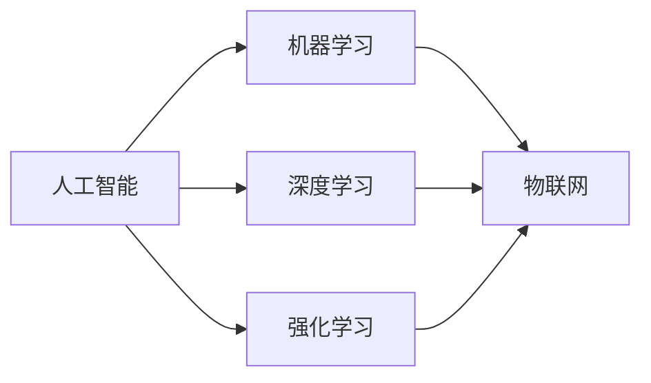

                 

# 自动化技术的未来发展趋势

自动化技术在现代工业、服务业乃至个人生活中已经无处不在，从简单的控制设备到复杂的智能化系统，都离不开自动化的影子。自动化技术的演进，始终与计算机科学的发展紧密相连，未来，自动化技术的趋势也将围绕AI、机器学习、物联网等前沿技术的革新不断拓展其应用边界，提升其效率和智能化水平。本文将系统梳理自动化技术未来发展的重要趋势，并对当前面临的挑战和未来的研究展望进行详细分析。

## 1. 背景介绍

### 1.1 自动化技术的发展历程

自动化技术的发展历程可以追溯到机械时代的机械自动化，那时人类通过机械装置实现对生产流程的自动化控制。随后，随着计算机技术的兴起，电子自动化开始出现，广泛应用于工业生产线、交通控制、机器人等领域。

进入20世纪末期，信息技术逐步成熟，计算机开始具备自主决策和执行能力，由此发展出的计算机自动化逐渐成为推动整个社会生产方式变革的重要力量。近十年来，以机器学习、深度学习、强化学习为代表的AI技术飞速发展，催生了智能自动化，自动化系统开始具备自我学习、自我优化、自我执行的能力，能够根据外部环境变化调整策略，适应不同的应用场景。

当前，自动化技术正向更加智能、高效、灵活的方向发展，并且不断向农业、医疗、教育等领域拓展，助力社会生产方式的全面变革。

### 1.2 自动化技术的关键问题

尽管自动化技术已取得显著进展，但仍然面临一系列关键问题，制约其进一步发展：

1. **决策鲁棒性**：在复杂多变的环境下，如何保证自动化系统的决策具有稳健性和准确性，避免错误决策带来的损失。
2. **系统安全**：如何确保自动化系统的安全性，避免攻击、故障等情况下的系统崩溃或误操作。
3. **数据隐私**：在自动化系统处理大量个人和企业数据时，如何保护数据隐私和信息安全。
4. **人机协作**：在高度智能化的自动化系统中，如何实现人与机器的良好协作，提升用户体验。
5. **技术可普及性**：如何降低自动化技术的门槛，使得各行各业都能够方便地应用到自动化技术，并从中受益。

未来，针对这些问题的新技术和新方法将是自动化技术发展的重要驱动力。

## 2. 核心概念与联系

### 2.1 核心概念概述

在探讨自动化技术的未来发展趋势时，需要明确几个核心概念：

- **人工智能(AI)**：通过算法和模型，让机器具备人类智能的特质，能够感知、学习、推理、决策。
- **机器学习(ML)**：让机器通过数据和算法自主学习，提升性能和泛化能力。
- **深度学习(DL)**：一种特殊的机器学习方法，通过多层神经网络实现高维数据的表示和处理。
- **强化学习(RL)**：通过与环境的交互，让机器自主探索最优策略，实现任务执行。
- **物联网(IoT)**：通过网络将设备互联，实现数据的高效收集和协同处理。
- **自主系统**：能够自主感知环境、决策和执行任务的自动化系统。

这些概念之间的关系可以用以下的Mermaid流程图表示：



以上流程图示意了人工智能作为自动化技术的核心，通过机器学习、深度学习、强化学习等技术手段，实现与物联网的结合，形成自主系统的完整架构。

### 2.2 概念间的关系

这些核心概念之间存在紧密的关系，相互影响并共同推动自动化技术的发展：

- 人工智能为自动化技术提供了理论基础和技术支持，机器学习、深度学习和强化学习则是实现人工智能的技术手段。
- 物联网为自动化系统提供了数据获取和设备互联的渠道，是实现自主系统的基础设施。
- 自主系统是自动化技术的最终形态，能够根据环境变化自主调整策略，具备更高的智能水平。

这些概念的协同作用，将共同推动自动化技术的不断进步和普及。

## 3. 核心算法原理 & 具体操作步骤

### 3.1 算法原理概述

未来的自动化技术将更多地采用AI和机器学习技术，实现智能化的自动化决策。其核心算法原理可以概括为以下几个方面：

1. **数据驱动决策**：通过大数据分析和机器学习模型，从大量历史数据中提取规律，指导自动化决策过程。
2. **自主学习和优化**：自动化系统能够自主学习和优化算法，提升决策准确性和系统性能。
3. **多模态数据融合**：结合多种传感器和数据源，实现信息的多维度融合，提升决策的全面性和可靠性。
4. **人机协作**：通过自然语言处理、计算机视觉等技术，实现人机间的无缝协作，提升用户体验。
5. **跨领域应用**：自动化技术能够跨越不同的行业和领域，实现跨领域的智能化应用，提升整体效率。

### 3.2 算法步骤详解

具体来说，自动化技术的实现步骤如下：

1. **数据采集**：通过传感器、摄像头、RFID等设备，采集环境数据和设备状态数据。
2. **数据预处理**：对采集到的数据进行清洗、降噪、特征提取等预处理步骤，确保数据的质量。
3. **模型训练**：利用机器学习模型对预处理后的数据进行训练，提取特征和规律，生成决策模型。
4. **模型部署**：将训练好的模型部署到自动化系统中，实现实时决策和执行。
5. **系统监控和优化**：对自动化系统的运行状态进行监控，根据反馈信息调整模型参数，实现系统的不断优化。

### 3.3 算法优缺点

未来自动化技术的主要优点包括：

1. **智能决策**：通过机器学习和大数据技术，实现高效、准确的决策，减少人为干预。
2. **灵活性高**：能够适应不同的应用场景，灵活配置和优化算法。
3. **自动化程度高**：实现从数据采集、模型训练到执行的全程自动化，提升生产效率。

其主要缺点包括：

1. **高昂的成本**：开发和部署智能自动化系统需要大量的硬件和软件资源，初期投入成本较高。
2. **依赖数据**：对数据的质量和数量有较高要求，数据获取和处理需要投入大量人力。
3. **复杂度**：算法和模型的设计和实现较为复杂，需要专业的技术人员进行开发和维护。
4. **安全性和可靠性**：自动化系统的高复杂性增加了其故障和攻击的风险，需要额外的安全措施。

### 3.4 算法应用领域

未来的自动化技术将广泛应用于以下几个领域：

1. **智能制造**：通过AI和大数据技术，实现生产过程的智能化管理，提高生产效率和质量。
2. **智慧城市**：利用物联网和智能传感器，实现城市管理的自动化和智能化，提升城市运行效率。
3. **智能交通**：通过智能交通管理系统，实现交通流量的智能调控和事故预警，提高交通安全。
4. **医疗健康**：在医疗设备、健康监测等方面，实现自动化和智能化，提升医疗服务质量。
5. **金融服务**：在风险控制、欺诈检测、客户服务等场景中，实现自动化决策，提升服务效率。
6. **教育培训**：利用自动化技术，实现个性化教育、自动化评测等功能，提升教学质量。

## 4. 数学模型和公式 & 详细讲解 & 举例说明

### 4.1 数学模型构建

未来自动化系统的决策模型通常基于以下数学模型：

1. **回归模型**：用于预测连续型变量的值，如智能制造中的生产效率预测。
2. **分类模型**：用于对离散型变量进行分类，如智能交通中的事故分类。
3. **聚类模型**：用于将相似的数据点分组，如智能城市中的区域划分。
4. **强化学习模型**：用于在复杂环境中自主学习和优化策略，如智能机器人的路径规划。

### 4.2 公式推导过程

以线性回归模型为例，其推导过程如下：

假设输入特征为 $x=(x_1, x_2, ..., x_n)$，输出为 $y$，回归模型为 $y = \beta_0 + \beta_1 x_1 + ... + \beta_n x_n$。

通过最小二乘法求解 $\beta_0, \beta_1, ..., \beta_n$，使得残差平方和最小，即：

$$
\min_{\beta_0, \beta_1, ..., \beta_n} \sum_{i=1}^m (y_i - \beta_0 - \beta_1 x_{i1} - ... - \beta_n x_{in})^2
$$

求解该优化问题，可以得到：

$$
\beta = (X^TX)^{-1}X^Ty
$$

其中 $X$ 为特征矩阵，$y$ 为输出向量。

### 4.3 案例分析与讲解

以智能制造中的生产效率预测为例，利用线性回归模型：

假设工厂的生产效率与设备状态、生产订单、员工班次等多个因素有关。通过收集历史数据，构建输入特征 $x$ 和输出 $y$，使用线性回归模型进行训练，得到回归参数 $\beta$。

然后，对新的生产数据进行特征提取，代入模型得到预测的生产效率 $y'$，从而实现智能化的生产管理。

## 5. 项目实践：代码实例和详细解释说明

### 5.1 开发环境搭建

自动化系统的开发环境通常需要以下软件和硬件支持：

1. **编程语言**：Python、R等脚本语言，是数据处理和算法实现的首选。
2. **数据分析工具**：Pandas、NumPy等工具，用于数据处理和分析。
3. **机器学习框架**：Scikit-learn、TensorFlow、PyTorch等框架，用于模型训练和部署。
4. **物联网平台**：MQTT、CoAP等协议，实现设备互联和数据传输。
5. **云计算平台**：AWS、Azure、Google Cloud等云平台，提供计算和存储资源。

### 5.2 源代码详细实现

以智能交通系统为例，源代码实现包括数据采集、预处理、模型训练和系统部署。

1. **数据采集**：
```python
import paho.mqtt.client as mqtt

# 连接MQTT服务器
client = mqtt.Client()
client.connect('mqtt.example.com', 1883, 60)

# 订阅主题
client.subscribe('sensor/temp')
client.subscribe('sensor/humidity')

# 定义数据回调函数
def on_message(client, userdata, message):
    print(f"Received message: {message.payload.decode()}")

# 注册数据回调函数
client.on_message = on_message

# 启动数据采集循环
client.loop_start()
```

2. **数据预处理**：
```python
import pandas as pd
import numpy as np

# 读取数据
data = pd.read_csv('data.csv')

# 数据清洗
data = data.dropna()

# 特征提取
features = data[['temp', 'humidity', 'pressure']]
target = data['event']

# 数据标准化
from sklearn.preprocessing import StandardScaler
scaler = StandardScaler()
features = scaler.fit_transform(features)
```

3. **模型训练**：
```python
from sklearn.linear_model import LinearRegression

# 创建模型
model = LinearRegression()

# 训练模型
model.fit(features, target)

# 模型预测
predictions = model.predict(features_test)
```

4. **系统部署**：
```python
# 将模型部署到自动化系统
# 对新的传感器数据进行实时处理和预测
# 控制交通信号灯等设备
```

### 5.3 代码解读与分析

以上代码实现了数据采集、预处理、模型训练和系统部署的基本流程。其中，MQTT协议用于实现设备之间的数据交互，pandas和numpy用于数据处理，scikit-learn用于模型训练，线性回归模型用于预测交通事件。

### 5.4 运行结果展示

运行以上代码后，可以实时采集到传感器数据，并进行数据清洗、特征提取和模型训练。最终，系统可以根据预测结果控制交通信号灯等设备，实现交通流量的智能调控和事故预警。

## 6. 实际应用场景

### 6.1 智能制造

未来的智能制造将借助自动化技术实现智能化生产管理，提升生产效率和质量。具体应用场景包括：

- **智能调度**：利用AI和机器学习技术，实现生产流程的智能化调度，提升生产效率。
- **质量检测**：通过图像识别和计算机视觉技术，实现产品质量的智能检测，减少人工干预。
- **设备维护**：利用传感器和智能监控系统，实现设备状态的实时监测和预测性维护，延长设备寿命。

### 6.2 智慧城市

智慧城市是未来城市发展的方向，通过自动化技术实现城市管理的智能化。具体应用场景包括：

- **智能交通**：通过智能交通管理系统，实现交通流量的智能调控和事故预警，提升交通安全。
- **智能安防**：利用AI和传感器技术，实现对城市安全的实时监控和预警。
- **能源管理**：利用物联网和智能传感器，实现能源消耗的智能化管理，提升能源利用效率。

### 6.3 智能交通

智能交通系统通过自动化技术实现交通流量的智能化管理，提升交通效率和安全性。具体应用场景包括：

- **路径规划**：通过智能算法和实时数据，实现路径的智能规划，减少交通拥堵。
- **事故预警**：利用传感器和AI技术，实现对交通事故的实时监测和预警，减少交通事故。
- **公共交通管理**：通过智能调度系统，实现公共交通的智能化管理，提高公共交通效率。

## 7. 工具和资源推荐

### 7.1 学习资源推荐

为了帮助开发者掌握自动化技术的发展方向，以下是几个推荐的资源：

1. **《自动驾驶导论》书籍**：该书系统介绍了自动驾驶技术的原理和应用，是自动化领域的重要参考资料。
2. **《智能系统设计》课程**：清华大学开设的自动化课程，介绍了智能系统的设计方法与实践经验。
3. **《机器学习实践》课程**：斯坦福大学开设的机器学习课程，深入浅出地介绍了机器学习的基本原理和算法。
4. **《深度学习基础》书籍**：Ian Goodfellow撰写的深度学习教材，全面介绍了深度学习的理论和实践。
5. **Kaggle竞赛**：Kaggle上举办的各类数据科学和机器学习竞赛，提供了大量实践案例和数据集。

通过这些资源的学习，可以全面掌握自动化技术的发展方向和核心原理。

### 7.2 开发工具推荐

自动化技术的开发需要借助各种工具和框架，以下是一些推荐的工具：

1. **Python**：Python是自动化开发的首选语言，具有丰富的库和框架支持。
2. **Pandas和NumPy**：用于数据处理和分析的库，支持复杂的数据操作和处理。
3. **TensorFlow和PyTorch**：用于深度学习和机器学习的框架，支持大规模模型训练和部署。
4. **IoT平台**：如MQTT、CoAP、HTTP等协议，实现设备互联和数据传输。
5. **云平台**：如AWS、Azure、Google Cloud等，提供计算和存储资源支持。

这些工具和框架能够帮助开发者高效地实现自动化系统，提高开发效率和系统性能。

### 7.3 相关论文推荐

自动化技术的发展离不开前沿研究成果的推动，以下是几篇具有代表性的论文：

1. **《深度强化学习在智能制造中的应用》论文**：介绍了深度强化学习在智能制造中的具体应用和效果。
2. **《基于物联网的智慧城市管理系统》论文**：探讨了基于物联网的智慧城市管理系统的设计和实现。
3. **《智能交通系统的设计与实现》论文**：介绍了智能交通系统的设计原理和实现方法。
4. **《智能自动化在医疗健康中的应用》论文**：讨论了智能自动化在医疗健康领域的具体应用和挑战。

这些论文能够为自动化技术的发展提供理论支撑和实践经验，帮助开发者和研究者深入了解自动化技术的最新进展。

## 8. 总结：未来发展趋势与挑战

### 8.1 研究成果总结

未来的自动化技术将继续以AI、机器学习、深度学习和物联网等前沿技术为驱动力，实现智能化、高效化和自动化。但当前仍面临一些挑战，需要进一步研究和解决。

### 8.2 未来发展趋势

未来自动化技术的主要趋势包括：

1. **智能化**：通过深度学习和AI技术，实现自动化系统的智能化决策，提升系统效率和可靠性。
2. **互联化**：实现设备、系统和环境的互联互通，实现数据的高效共享和协同处理。
3. **个性化**：结合用户需求和行为数据，实现个性化定制和智能化服务。
4. **实时化**：实现数据的实时采集和处理，提升系统响应速度和实时性。
5. **安全化**：通过加密、认证和监控等手段，确保自动化系统的安全性和可靠性。

### 8.3 面临的挑战

自动化技术的发展仍面临以下挑战：

1. **高成本**：自动化系统开发和部署的高成本，需要更多的资金投入。
2. **数据获取难度**：数据采集和处理需要大量人力和资源，数据获取难度较大。
3. **技术复杂度**：算法和模型的设计和实现较为复杂，需要专业技术人员进行开发和维护。
4. **安全性问题**：自动化系统的高复杂性增加了其故障和攻击的风险。
5. **可普及性问题**：如何降低技术门槛，使得各行各业都能方便地应用自动化技术。

### 8.4 研究展望

未来的自动化技术需要从以下几个方面进行进一步研究和探索：

1. **数据驱动决策**：优化数据采集和处理方法，提升数据质量，实现更智能的决策支持。
2. **多模态数据融合**：结合多种传感器和数据源，实现信息的多维度融合，提升决策的全面性和可靠性。
3. **人机协作**：通过自然语言处理、计算机视觉等技术，实现人机间的无缝协作，提升用户体验。
4. **跨领域应用**：拓展自动化技术的应用领域，实现跨领域的智能化应用。

## 9. 附录：常见问题与解答

**Q1: 未来自动化技术的主要发展方向是什么？**

A: 未来自动化技术的主要发展方向包括智能化、互联化、个性化、实时化和安全化。通过深度学习和AI技术，实现自动化系统的智能化决策，提升系统效率和可靠性。结合多种传感器和数据源，实现信息的多维度融合，提升决策的全面性和可靠性。结合用户需求和行为数据，实现个性化定制和智能化服务。实现数据的实时采集和处理，提升系统响应速度和实时性。通过加密、认证和监控等手段，确保自动化系统的安全性和可靠性。

**Q2: 自动化系统如何实现智能化决策？**

A: 自动化系统实现智能化决策的主要手段包括机器学习、深度学习和强化学习。通过这些技术，系统可以从大量历史数据中提取规律，提升决策准确性和系统性能。具体来说，利用回归模型、分类模型、聚类模型等算法，对输入数据进行处理和分析，生成决策模型。通过训练和优化模型，实现对未来数据的预测和分类。利用强化学习算法，系统可以在复杂环境中自主学习和优化策略，提升决策效果。

**Q3: 自动化技术在实际应用中面临哪些挑战？**

A: 自动化技术在实际应用中面临的挑战主要包括高成本、数据获取难度、技术复杂度、安全性和可普及性问题。自动化系统开发和部署的高成本，需要更多的资金投入。数据采集和处理需要大量人力和资源，数据获取难度较大。算法和模型的设计和实现较为复杂，需要专业技术人员进行开发和维护。自动化系统的高复杂性增加了其故障和攻击的风险。如何降低技术门槛，使得各行各业都能方便地应用自动化技术，还需要进一步探索。

**Q4: 如何提升自动化系统的安全性？**

A: 提升自动化系统的安全性主要可以从以下几个方面入手：

1. **加密技术**：使用加密技术对数据进行保护，防止数据泄露和篡改。
2. **认证和授权**：通过身份认证和权限控制，确保只有授权用户和设备能够访问系统。
3. **监控和审计**：建立系统监控和审计机制，及时发现和处理异常行为和攻击。
4. **故障处理和恢复**：设计完善的故障处理和恢复机制，确保系统在故障发生时能够快速恢复。

通过这些措施，可以有效提升自动化系统的安全性，保障系统的可靠性和稳定性。

**Q5: 自动化技术在医疗健康领域的应用前景如何？**

A: 自动化技术在医疗健康领域具有广阔的应用前景，主要体现在以下几个方面：

1. **智能诊断**：通过AI和大数据技术，实现对疾病的智能诊断和预测，提升诊断效率和准确性。
2. **智能监测**：利用传感器和智能设备，实现对患者的实时监测和预警，提升治疗效果。
3. **智能治疗**：结合AI算法和智能设备，实现个性化治疗方案的制定和执行，提升治疗效果和患者体验。
4. **智能管理**：通过智能管理系统，实现医疗资源的优化配置和高效管理，提升医院运营效率。

通过自动化技术的应用，医疗健康领域可以实现智能化、高效化和个性化管理，提升整体医疗水平。

---

作者：禅与计算机程序设计艺术 / Zen and the Art of Computer Programming

