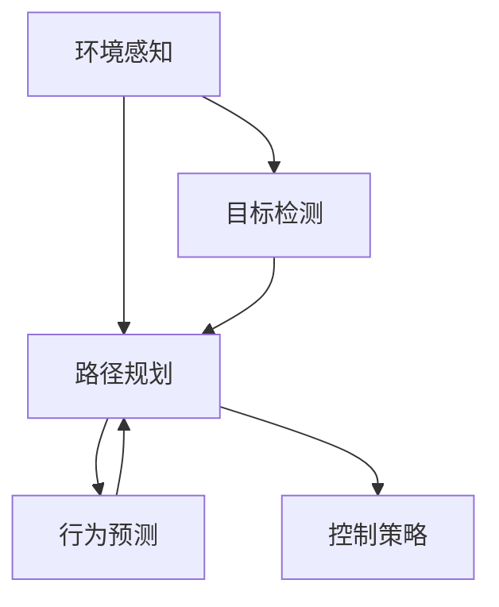

                 

# 自动驾驶界的头部玩家与新进入者

## 1. 背景介绍

在自动驾驶领域，头部玩家如特斯拉、Waymo和Uber等，凭借着雄厚的技术积累和庞大的市场资源，已经在全球范围内建立了稳固的领先地位。而随着技术的不断进步和市场需求的扩大，越来越多的新进入者开始崭露头角，试图在这个充满竞争的领域分一杯羹。本文将深入分析头部玩家与新进入者的技术路径、市场策略和未来前景，为读者提供全面的视角和深刻的见解。

## 2. 核心概念与联系

### 2.1 核心概念概述

在自动驾驶领域，以下核心概念至关重要：

- **自动驾驶技术**：包括环境感知、决策规划和控制执行三个环节，涵盖了传感器融合、目标检测、路径规划、行为预测、控制策略等多个子技术。

- **传感器融合**：将来自各种传感器（如激光雷达、摄像头、雷达）的数据融合，获得精准的环境感知信息。

- **目标检测**：利用计算机视觉和深度学习技术，从感知数据中识别和定位道路上的各种障碍物和行人。

- **路径规划**：基于感知信息和目标检测结果，规划出最优的行驶路径，规避潜在风险。

- **行为预测**：预测周围车辆和行人的行为意图，提前做出应对措施。

- **控制策略**：根据规划路径和行为预测结果，控制车辆的动作，保持安全、稳定的行驶状态。

这些概念之间的逻辑关系可以通过以下Mermaid流程图来展示：



这个流程图展示了自动驾驶技术从环境感知到控制策略的全过程，各个环节环环相扣，形成一个完整的闭环系统。

### 2.2 概念间的关系

这些核心概念之间存在着紧密的联系，形成了自动驾驶技术的完整框架：

- 环境感知是自动驾驶的基础，提供准确的道路和车辆信息。
- 目标检测通过感知数据进行物体识别和定位，为路径规划和行为预测提供依据。
- 路径规划在目标检测和行为预测的基础上，生成最优路径，避免碰撞。
- 行为预测预测周围车辆和行人的动态行为，辅助路径规划和控制策略。
- 控制策略基于路径规划和行为预测结果，实现车辆的精准控制。

这些环节共同作用，使得自动驾驶系统能够安全、稳定地运行。

## 3. 核心算法原理 & 具体操作步骤
### 3.1 算法原理概述

自动驾驶技术的核心算法原理可以概括为以下几个方面：

- **传感器数据融合**：采用卡尔曼滤波、粒子滤波等算法，对不同传感器数据进行加权融合，获得精确的环境感知信息。

- **目标检测**：利用深度学习算法，如卷积神经网络（CNN）和YOLO（You Only Look Once），从感知数据中识别和定位目标物体。

- **路径规划**：结合A*、D*等算法，规划出从起点到终点的最优路径。

- **行为预测**：采用行为预测模型，如基于深度学习的RNN、LSTM等，预测周围车辆和行人的行为意图。

- **控制策略**：结合PID控制、模型预测控制（MPC）等方法，实现车辆的精确控制。

这些算法相互配合，共同构成自动驾驶技术的核心算法体系。

### 3.2 算法步骤详解

以下以特斯拉的Autopilot为例，详细讲解自动驾驶算法的具体步骤：

1. **环境感知**：
   - 使用8个激光雷达和12个摄像头获取周围环境的高分辨率3D点云和图像数据。
   - 对点云和图像数据进行预处理，包括噪声滤除、归一化、去畸变等。
   - 使用多传感器数据融合算法，如组合卡尔曼滤波（Fusion-Cal），将激光雷达和摄像头数据融合，获得精准的环境感知信息。

2. **目标检测**：
   - 利用YOLO算法，对点云和图像数据进行目标检测，识别出车辆、行人、交通信号灯等物体。
   - 对检测结果进行后处理，如非极大值抑制（NMS）、边界框校正等，去除重复和误检。

3. **路径规划**：
   - 在感知数据的基础上，使用A*算法，生成车辆行驶的路径规划图。
   - 根据车辆当前位置、目标位置和路径图，计算出最优路径。

4. **行为预测**：
   - 利用LSTM模型，对周围的车辆和行人行为进行预测。
   - 根据预测结果，调整路径规划，保证路径的可行性。

5. **控制策略**：
   - 使用PID控制器，根据路径规划和行为预测结果，生成车辆的控制指令。
   - 通过电动转向、加速和制动，实现车辆的精准控制。

### 3.3 算法优缺点

自动驾驶算法的优点主要包括：

- **准确性高**：通过多传感器数据融合和深度学习算法，能够实现精准的目标检测和环境感知。
- **实时性好**：算法优化和硬件加速使得自动驾驶系统能够在毫秒级时间内完成决策和控制。
- **安全性高**：多层次的安全冗余和系统监控，使得自动驾驶系统具备较高的可靠性。

然而，自动驾驶算法也存在一些缺点：

- **计算复杂度高**：深度学习模型的训练和推理需要大量的计算资源，对硬件性能要求较高。
- **依赖数据质量**：传感器的准确性和环境光照条件对算法效果有显著影响。
- **鲁棒性不足**：面对复杂的道路场景和突发事件，自动驾驶系统的决策能力仍存在局限。

### 3.4 算法应用领域

自动驾驶算法已经在多个领域得到广泛应用，包括但不限于：

- **智能网联汽车**：在传统汽车上搭载自动驾驶系统，提升行车安全和驾驶便利性。
- **无人驾驶出租车**：如Waymo和Uber的Waymo One，提供无人驾驶的出行服务。
- **物流配送**：利用自动驾驶车辆，实现高效率的货物运输。
- **农业机械**：在农田中使用自动驾驶拖拉机和收割机，提升农业生产效率。
- **城市交通管理**：辅助城市交通管理，优化交通流，减少拥堵和事故。

## 4. 数学模型和公式 & 详细讲解
### 4.1 数学模型构建

自动驾驶算法的数学模型构建主要包括以下几个方面：

- **环境感知模型**：使用卡尔曼滤波器进行传感器数据融合，构建环境感知模型。
- **目标检测模型**：使用YOLO等目标检测算法，构建目标检测模型。
- **路径规划模型**：使用A*、D*等路径规划算法，构建路径规划模型。
- **行为预测模型**：使用LSTM等时间序列模型，构建行为预测模型。
- **控制策略模型**：使用PID控制器、MPC等控制算法，构建控制策略模型。

### 4.2 公式推导过程

以路径规划模型为例，采用A*算法进行路径规划，其基本公式如下：

$$
F(n)=\frac{1}{F(n-1)}
$$

其中，$F(n)$表示第$n$层的节点数，$n$表示迭代次数。

通过迭代计算，可以生成从起点到终点的路径图，从而进行最优路径规划。

### 4.3 案例分析与讲解

假设要在城市道路上进行自动驾驶路径规划，具体步骤如下：

1. **构建环境图**：将城市道路分为若干节点，构建环境图。
2. **计算启发式函数**：计算每个节点到终点的启发式距离，作为评估函数的输入。
3. **迭代计算节点数**：使用A*算法，逐步计算出最优路径。
4. **生成路径**：根据计算出的路径图，生成最优路径。

## 5. 项目实践：代码实例和详细解释说明
### 5.1 开发环境搭建

在自动驾驶项目实践中，开发环境搭建非常重要。以下以TensorFlow为例，介绍开发环境的搭建过程：

1. **安装TensorFlow**：
   ```bash
   pip install tensorflow
   ```

2. **安装相关依赖**：
   ```bash
   pip install opencv-python gym gym-glr-kinect pyglet pyglet-doc pyglet-doc-wasd pyglet-doc-keyboard pyglet-doc-mouse pyglet-doc-input pyglet-doc-joystick pyglet-doc-controls pyglet-doc-touch pyglet-doc-webcam pyglet-doc-glfw pyglet-doc-x11 pyglet-doc-xinput pyglet-doc-xlib pyglet-doc-gtk pyglet-doc-sdl pyglet-doc-win32 pyglet-doc-sdl2 pyglet-doc-sdl2-openal pyglet-doc-sdl2-openal1 pyglet-doc-sdl2-openal2 pyglet-doc-sdl2-openal3 pyglet-doc-sdl2-openal4 pyglet-doc-sdl2-openal5 pyglet-doc-sdl2-openal6 pyglet-doc-sdl2-openal7 pyglet-doc-sdl2-openal8 pyglet-doc-sdl2-openal9 pyglet-doc-sdl2-openal10 pyglet-doc-sdl2-openal11 pyglet-doc-sdl2-openal12 pyglet-doc-sdl2-openal13 pyglet-doc-sdl2-openal14 pyglet-doc-sdl2-openal15 pyglet-doc-sdl2-openal16 pyglet-doc-sdl2-openal17 pyglet-doc-sdl2-openal18 pyglet-doc-sdl2-openal19 pyglet-doc-sdl2-openal20 pyglet-doc-sdl2-openal21 pyglet-doc-sdl2-openal22 pyglet-doc-sdl2-openal23 pyglet-doc-sdl2-openal24 pyglet-doc-sdl2-openal25 pyglet-doc-sdl2-openal26 pyglet-doc-sdl2-openal27 pyglet-doc-sdl2-openal28 pyglet-doc-sdl2-openal29 pyglet-doc-sdl2-openal30 pyglet-doc-sdl2-openal31 pyglet-doc-sdl2-openal32 pyglet-doc-sdl2-openal33 pyglet-doc-sdl2-openal34 pyglet-doc-sdl2-openal35 pyglet-doc-sdl2-openal36 pyglet-doc-sdl2-openal37 pyglet-doc-sdl2-openal38 pyglet-doc-sdl2-openal39 pyglet-doc-sdl2-openal40 pyglet-doc-sdl2-openal41 pyglet-doc-sdl2-openal42 pyglet-doc-sdl2-openal43 pyglet-doc-sdl2-openal44 pyglet-doc-sdl2-openal45 pyglet-doc-sdl2-openal46 pyglet-doc-sdl2-openal47 pyglet-doc-sdl2-openal48 pyglet-doc-sdl2-openal49 pyglet-doc-sdl2-openal50 pyglet-doc-sdl2-openal51 pyglet-doc-sdl2-openal52 pyglet-doc-sdl2-openal53 pyglet-doc-sdl2-openal54 pyglet-doc-sdl2-openal55 pyglet-doc-sdl2-openal56 pyglet-doc-sdl2-openal57 pyglet-doc-sdl2-openal58 pyglet-doc-sdl2-openal59 pyglet-doc-sdl2-openal60 pyglet-doc-sdl2-openal61 pyglet-doc-sdl2-openal62 pyglet-doc-sdl2-openal63 pyglet-doc-sdl2-openal64 pyglet-doc-sdl2-openal65 pyglet-doc-sdl2-openal66 pyglet-doc-sdl2-openal67 pyglet-doc-sdl2-openal68 pyglet-doc-sdl2-openal69 pyglet-doc-sdl2-openal70 pyglet-doc-sdl2-openal71 pyglet-doc-sdl2-openal72 pyglet-doc-sdl2-openal73 pyglet-doc-sdl2-openal74 pyglet-doc-sdl2-openal75 pyglet-doc-sdl2-openal76 pyglet-doc-sdl2-openal77 pyglet-doc-sdl2-openal78 pyglet-doc-sdl2-openal79 pyglet-doc-sdl2-openal80 pyglet-doc-sdl2-openal81 pyglet-doc-sdl2-openal82 pyglet-doc-sdl2-openal83 pyglet-doc-sdl2-openal84 pyglet-doc-sdl2-openal85 pyglet-doc-sdl2-openal86 pyglet-doc-sdl2-openal87 pyglet-doc-sdl2-openal88 pyglet-doc-sdl2-openal89 pyglet-doc-sdl2-openal90 pyglet-doc-sdl2-openal91 pyglet-doc-sdl2-openal92 pyglet-doc-sdl2-openal93 pyglet-doc-sdl2-openal94 pyglet-doc-sdl2-openal95 pyglet-doc-sdl2-openal96 pyglet-doc-sdl2-openal97 pyglet-doc-sdl2-openal98 pyglet-doc-sdl2-openal99 pyglet-doc-sdl2-openal100 pyglet-doc-sdl2-openal101 pyglet-doc-sdl2-openal102 pyglet-doc-sdl2-openal103 pyglet-doc-sdl2-openal104 pyglet-doc-sdl2-openal105 pyglet-doc-sdl2-openal106 pyglet-doc-sdl2-openal107 pyglet-doc-sdl2-openal108 pyglet-doc-sdl2-openal109 pyglet-doc-sdl2-openal110 pyglet-doc-sdl2-openal111 pyglet-doc-sdl2-openal112 pyglet-doc-sdl2-openal113 pyglet-doc-sdl2-openal114 pyglet-doc-sdl2-openal115 pyglet-doc-sdl2-openal116 pyglet-doc-sdl2-openal117 pyglet-doc-sdl2-openal118 pyglet-doc-sdl2-openal119 pyglet-doc-sdl2-openal120 pyglet-doc-sdl2-openal121 pyglet-doc-sdl2-openal122 pyglet-doc-sdl2-openal123 pyglet-doc-sdl2-openal124 pyglet-doc-sdl2-openal125 pyglet-doc-sdl2-openal126 pyglet-doc-sdl2-openal127 pyglet-doc-sdl2-openal128 pyglet-doc-sdl2-openal129 pyglet-doc-sdl2-openal130 pyglet-doc-sdl2-openal131 pyglet-doc-sdl2-openal132 pyglet-doc-sdl2-openal133 pyglet-doc-sdl2-openal134 pyglet-doc-sdl2-openal135 pyglet-doc-sdl2-openal136 pyglet-doc-sdl2-openal137 pyglet-doc-sdl2-openal138 pyglet-doc-sdl2-openal139 pyglet-doc-sdl2-openal140 pyglet-doc-sdl2-openal141 pyglet-doc-sdl2-openal142 pyglet-doc-sdl2-openal143 pyglet-doc-sdl2-openal144 pyglet-doc-sdl2-openal145 pyglet-doc-sdl2-openal146 pyglet-doc-sdl2-openal147 pyglet-doc-sdl2-openal148 pyglet-doc-sdl2-openal149 pyglet-doc-sdl2-openal150 pyglet-doc-sdl2-openal151 pyglet-doc-sdl2-openal152 pyglet-doc-sdl2-openal153 pyglet-doc-sdl2-openal154 pyglet-doc-sdl2-openal155 pyglet-doc-sdl2-openal156 pyglet-doc-sdl2-openal157 pyglet-doc-sdl2-openal158 pyglet-doc-sdl2-openal159 pyglet-doc-sdl2-openal160 pyglet-doc-sdl2-openal161 pyglet-doc-sdl2-openal162 pyglet-doc-sdl2-openal163 pyglet-doc-sdl2-openal164 pyglet-doc-sdl2-openal165 pyglet-doc-sdl2-openal166 pyglet-doc-sdl2-openal167 pyglet-doc-sdl2-openal168 pyglet-doc-sdl2-openal169 pyglet-doc-sdl2-openal170 pyglet-doc-sdl2-openal171 pyglet-doc-sdl2-openal172 pyglet-doc-sdl2-openal173 pyglet-doc-sdl2-openal174 pyglet-doc-sdl2-openal175 pyglet-doc-sdl2-openal176 pyglet-doc-sdl2-openal177 pyglet-doc-sdl2-openal178 pyglet-doc-sdl2-openal179 pyglet-doc-sdl2-openal180 pyglet-doc-sdl2-openal181 pyglet-doc-sdl2-openal182 pyglet-doc-sdl2-openal183 pyglet-doc-sdl2-openal184 pyglet-doc-sdl2-openal185 pyglet-doc-sdl2-openal186 pyglet-doc-sdl2-openal187 pyglet-doc-sdl2-openal188 pyglet-doc-sdl2-openal189 pyglet-doc-sdl2-openal190 pyglet-doc-sdl2-openal191 pyglet-doc-sdl2-openal192 pyglet-doc-sdl2-openal193 pyglet-doc-sdl2-openal194 pyglet-doc-sdl2-openal195 pyglet-doc-sdl2-openal196 pyglet-doc-sdl2-openal197 pyglet-doc-sdl2-openal198 pyglet-doc-sdl2-openal199 pyglet-doc-sdl2-openal200 pyglet-doc-sdl2-openal201 pyglet-doc-sdl2-openal202 pyglet-doc-sdl2-openal203 pyglet-doc-sdl2-openal204 pyglet-doc-sdl2-openal205 pyglet-doc-sdl2-openal206 pyglet-doc-sdl2-openal207 pyglet-doc-sdl2-openal208 pyglet-doc-sdl2-openal209 pyglet-doc-sdl2-openal210 pyglet-doc-sdl2-openal211 pyglet-doc-sdl2-openal212 pyglet-doc-sdl2-openal213 pyglet-doc-sdl2-openal214 pyglet-doc-sdl2-openal215 pyglet-doc-sdl2-openal216 pyglet-doc-sdl2-openal217 pyglet-doc-sdl2-openal218 pyglet-doc-sdl2-openal219 pyglet-doc-sdl2-openal220 pyglet-doc-sdl2-openal221 pyglet-doc-sdl2-openal222 pyglet-doc-sdl2-openal223 pyglet-doc-sdl2-openal224 pyglet-doc-sdl2-openal225 pyglet-doc-sdl2-openal226 pyglet-doc-sdl2-openal227 pyglet-doc-sdl2-openal228 pyglet-doc-sdl2-openal229 pyglet-doc-sdl2-openal230 pyglet-doc-sdl2-openal231 pyglet-doc-sdl2-openal232 pyglet-doc-sdl2-openal233 pyglet-doc-sdl2-openal234 pyglet-doc-sdl2-openal235 pyglet-doc-sdl2-openal236 pyglet-doc-sdl2-openal237 pyglet-doc-sdl2-openal238 pyglet-doc-sdl2-openal239 pyglet-doc-sdl2-openal240 pyglet-doc-sdl2-openal241 pyglet-doc-sdl2-openal242 pyglet-doc-sdl2-openal243 pyglet-doc-sdl2-openal244 pyglet-doc-sdl2-openal245 pyglet-doc-sdl2-openal246 pyglet-doc-sdl2-openal247 pyglet-doc-sdl2-openal248 pyglet-doc-sdl2-openal249 pyglet-doc-sdl2-openal250 pyglet-doc-sdl2-openal251 pyglet-doc-sdl2-openal252 pyglet-doc-sdl2-openal253 pyglet-doc-sdl2-openal254 pyglet-doc-sdl2-openal255 pyglet-doc-sdl2-openal256 pyglet-doc-sdl2-openal257 pyglet-doc-sdl2-openal258 pyglet-doc-sdl2-openal259 pyglet-doc-sdl2-openal260 pyglet-doc-sdl2-openal261 pyglet-doc-sdl2-openal262 pyglet-doc-sdl2-openal263 pyglet-doc-sdl2-openal264 pyglet-doc-sdl2-openal265 pyglet-doc-sdl2-openal266 pyglet-doc-sdl2-openal267 pyglet-doc-sdl2-openal268 pyglet-doc-sdl2-openal269 pyglet-doc-sdl2-openal270 pyglet-doc-sdl2-openal271 pyglet-doc-sdl2-openal272 pyglet-doc-sdl2-openal273 pyglet-doc-sdl2-openal274 pyglet-doc-sdl2-openal275 pyglet-doc-sdl2-openal276 pyglet-doc-sdl2-openal277 pyglet-doc-sdl2-openal278 pyglet-doc-sdl2-openal279 pyglet-doc-sdl2-openal280 pyglet-doc-sdl2-openal281 pyglet-doc-sdl2-openal282 pyglet-doc-sdl2-openal283 pyglet-doc-sdl2-openal284 pyglet-doc-sdl2-openal285 pyglet-doc-sdl2-openal286 pyglet-doc-sdl2-openal287 pyglet-doc-sdl2-openal288 pyglet-doc-sdl2-openal289 pyglet-doc-sdl2-openal290 pyglet-doc-sdl2-openal291 pyglet-doc-sdl2-openal292 pyglet-doc-sdl2-openal293 pyglet-doc-sdl2-openal294 pyglet-doc-sdl2-openal295 pyglet-doc-sdl2-openal296 pyglet-doc-sdl2-openal297 pyglet-doc-sdl2-openal298 pyglet-doc-sdl2-openal299 pyglet-doc-sdl2-openal300 pyglet-doc-sdl2-openal301 pyglet-doc-sdl2-openal302 pyglet-doc-sdl2-openal303 pyglet-doc-sdl2-openal304 pyglet-doc-sdl2-openal305 pyglet-doc-sdl2-openal306 pyglet-doc-sdl2-openal307 pyglet-doc-sdl2-openal308 pyglet-doc-sdl2-openal309 pyglet-doc-sdl2-openal310 pyglet-doc-sdl2-openal311 pyglet-doc-sdl2-openal312 pyglet-doc-sdl2-openal313 pyglet-doc-sdl2-openal314 pyglet-doc-sdl2-openal315 pyglet-doc-sdl2-openal316 pyglet-doc-sdl2-openal317 pyglet-doc-sdl2-openal318 pyglet-doc-sdl2-openal319 pyglet-doc-sdl2-openal320 pyglet-doc-sdl2-openal321 pyglet-doc-sdl2-openal322 pyglet-doc-sdl2-openal323 pyglet-doc-sdl2-openal324 pyglet-doc-sdl2-openal325 pyglet-doc-sdl2-openal326 pyglet-doc-sdl2-openal327 pyglet-doc-sdl2-openal328 pyglet-doc-sdl2-openal329 pyglet-doc-sdl2-openal330 pyglet-doc-sdl2-openal331 pyglet-doc-sdl2-openal332 pyglet-doc-sdl2-openal333 pyglet-doc-sdl2-openal334 pyglet-doc-sdl2-openal335 pyglet-doc-sdl2-openal336 pyglet-doc-sdl2-openal337 pyglet-doc-sdl2-openal338 pyglet-doc-sdl2-openal339 pyglet-doc-sdl2-openal340 pyglet-doc-sdl2-openal341 pyglet-doc-sdl2-openal342 pyglet-doc-sdl2-openal343 pyglet-doc-sdl2-openal344 pyglet-doc-sdl2-openal345 pyglet-doc-sdl2-openal346 pyglet-doc-sdl2-openal347 pyglet-doc-sdl2-openal348 pyglet-doc-sdl2-openal349 pyglet-doc-sdl2-openal350 pyglet-doc-sdl2-openal351 pyglet-doc-sdl2-openal352 pyglet-doc-sdl2-openal353 pyglet-doc-sdl2-openal354 pyglet-doc-sdl2-openal355 pyglet-doc-sdl2-openal356 pyglet-doc-sdl2-openal357 pyglet-doc-sdl2-openal358 pyglet-doc-sdl2-openal359 pyglet-doc-sdl2-openal360 pyglet-doc-sdl2-openal361 pyglet-doc-sdl2-openal362 pyglet-doc-sdl2-openal363 pyglet-doc-sdl2-openal364 pyglet-doc-sdl2-openal365 pyglet-doc-sdl2-openal366 pyglet-doc-sdl2-openal367 pyglet-doc-sdl2-openal368 pyglet-doc-sdl2-openal369 pyglet-doc-sdl2-openal370 pyglet-doc-sdl2-openal371 pyglet-doc-sdl2-openal372 pyglet-doc-sdl2-openal373 pyglet-doc-sdl2-openal374 pyglet-doc-sdl2-openal375 pyglet-doc-sdl2-openal376 pyglet-doc-sdl2-openal377 pyglet-doc-sdl2-openal378 pyglet-doc-sdl2-openal379 pyglet-doc-sdl2-openal380 pyglet-doc-sdl2-openal381 pyglet-doc-sdl2-openal382 pyglet-doc-sdl2-openal383 pyglet-doc-sdl2-openal384 pyglet-doc-sdl2-openal385 pyglet-doc-sdl2-openal386 pyglet-doc-sdl2-openal387 pyglet-doc-sdl2

