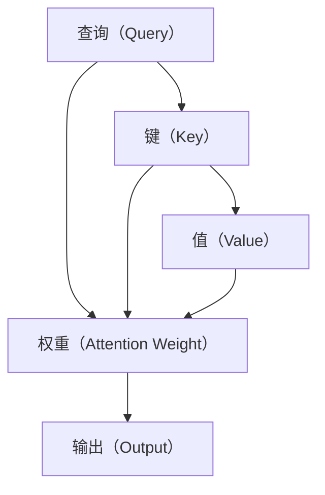

                 

# 自注意力机制的详细解析

## 1. 背景介绍

在深度学习领域，自注意力机制（Self-Attention）已经成为许多自然语言处理（NLP）和计算机视觉（CV）任务的核心组成部分。自注意力机制通过在序列或空间维度上捕捉不同位置之间的关系，显著提升了模型的表达能力和泛化能力。本文将详细解析自注意力机制的原理、实现步骤、优缺点及应用领域，并通过代码实例和数学公式进行系统讲解。

## 2. 核心概念与联系

### 2.1 核心概念概述

自注意力机制是一种在序列或空间维度上衡量不同位置之间关联的计算方法。它的核心思想是：每个位置i的表示不仅由其自身的前向信息决定，还由其他所有位置j的表示影响。通过计算一个可学习的权重矩阵 $a_{ij}$，自注意力机制能够动态地聚焦于序列或空间中的关键信息，从而生成更具代表性的表示。

自注意力机制通常包含以下几个核心组件：

- **查询（Query）**：表示当前位置i的表示，通过线性变换生成。
- **键（Key）**：表示所有位置j的表示，通过线性变换生成。
- **值（Value）**：表示所有位置j的表示，通过线性变换生成。
- **权重（Attention Weight）**：用于计算每个位置j对位置i的影响程度，通过注意力机制计算得到。
- **输出（Output）**：位置i的表示，通过将权重与位置j的表示进行加权求和生成。

自注意力机制的计算过程可以用以下示意图表示：



### 2.2 核心概念间的关系

自注意力机制通过计算权重矩阵 $a_{ij}$，使得模型在序列或空间维度上可以关注不同的信息。这种动态关注机制极大地提升了模型的表达能力和泛化能力，尤其在NLP任务中表现尤为突出。

- **查询-键匹配度**：通过计算查询向量与键向量的相似度，可以动态地决定每个位置对当前位置的关注程度。
- **值-权重加权**：将值向量与权重相乘，再将结果进行求和，得到当前位置的输出表示。
- **输出表示**：输出表示不仅包含了当前位置的信息，还融合了序列或空间中其他位置的信息，使得模型能够更好地捕捉长距离依赖和全局信息。

这些组件之间通过一系列矩阵运算和激活函数，构成了一个完整的自注意力机制计算流程。自注意力机制的引入，使得模型在处理长序列或复杂空间信息时，能够灵活调整关注度，实现更高效的特征抽取和表示学习。

## 3. 核心算法原理 & 具体操作步骤

### 3.1 算法原理概述

自注意力机制的原理可以理解为通过计算一个权重矩阵，对输入序列或空间中的所有位置进行加权求和，从而得到每个位置的输出表示。这个权重矩阵是通过计算查询向量与键向量的相似度得到的。自注意力机制的核心公式如下：

$$
\text{Attention}(Q,K,V) = \text{Softmax}(\frac{QK^T}{\sqrt{d_k}})V
$$

其中：

- $Q$：查询向量，维度为 $[d_h]$，由输入序列或空间的线性变换得到。
- $K$：键向量，维度为 $[d_h]$，由输入序列或空间的线性变换得到。
- $V$：值向量，维度为 $[d_h]$，由输入序列或空间的线性变换得到。
- $d_h$：注意力头数（Number of Attention Heads），通常取4或8。
- $\text{Softmax}$：归一化函数，确保所有权重之和为1。

### 3.2 算法步骤详解

自注意力机制的计算可以分为以下几个步骤：

1. **线性变换**：将输入序列或空间的每个位置进行线性变换，得到查询向量 $Q$、键向量 $K$ 和值向量 $V$。
2. **计算注意力权重**：通过计算查询向量与键向量的相似度，得到注意力权重矩阵 $\text{Attention Score}$。
3. **计算权重向量**：对注意力权重矩阵进行归一化，得到权重向量 $\text{Attention Weight}$。
4. **计算加权和**：将权重向量与值向量进行加权求和，得到输出表示 $\text{Output}$。
5. **堆叠多头注意力**：将上述计算过程堆叠多个头，得到最终的输出表示 $\text{Final Output}$。

### 3.3 算法优缺点

自注意力机制具有以下优点：

- **全局感知**：通过计算所有位置的注意力权重，模型能够捕捉序列或空间中的全局信息，提升了模型的泛化能力。
- **动态关注**：自注意力机制可以根据输入的不同，动态地调整关注的位置，增强模型的表达能力。
- **并行计算**：自注意力机制的计算过程可以通过矩阵运算实现并行化，提高计算效率。

自注意力机制也存在一些缺点：

- **计算复杂度较高**：自注意力机制的计算复杂度较高，尤其是对于大规模输入序列或空间，需要大量的计算资源。
- **参数量较大**：自注意力机制需要训练大量的可学习参数，包括查询向量、键向量和值向量的线性变换矩阵，以及多个注意力头的权重矩阵。
- **局部信息丢失**：由于自注意力机制主要关注全局信息，可能导致某些局部信息在计算过程中被忽略或丢失。

### 3.4 算法应用领域

自注意力机制在NLP和CV领域得到了广泛应用，主要包括以下几个方面：

- **自然语言处理**：在机器翻译、文本分类、问答系统等任务中，自注意力机制被用来捕捉单词或句子之间的依赖关系，提升模型的表达能力和泛化能力。
- **计算机视觉**：在图像识别、图像生成等任务中，自注意力机制被用来捕捉图像中的不同区域之间的关系，提高模型的感知能力。
- **语音识别**：在语音识别任务中，自注意力机制被用来捕捉不同时间步的语音信号之间的关系，提升模型的语音特征提取能力。

## 4. 数学模型和公式 & 详细讲解 & 举例说明

### 4.1 数学模型构建

自注意力机制的数学模型可以表示为：

$$
\text{Attention}(Q,K,V) = \text{Softmax}(\frac{QK^T}{\sqrt{d_k}})V
$$

其中：

- $Q$：查询向量，维度为 $[d_h]$。
- $K$：键向量，维度为 $[d_h]$。
- $V$：值向量，维度为 $[d_h]$。
- $d_h$：注意力头数，通常取4或8。

### 4.2 公式推导过程

自注意力机制的计算过程可以分解为以下几个步骤：

1. **线性变换**：将输入序列或空间的每个位置进行线性变换，得到查询向量 $Q$、键向量 $K$ 和值向量 $V$。

   $$
   Q = XW_Q
   $$
   
   $$
   K = XW_K
   $$
   
   $$
   V = XW_V
   $$

   其中 $X$ 为输入序列或空间，$W_Q$、$W_K$ 和 $W_V$ 为线性变换矩阵。

2. **计算注意力权重**：通过计算查询向量与键向量的相似度，得到注意力权重矩阵 $\text{Attention Score}$。

   $$
   \text{Attention Score} = \frac{QK^T}{\sqrt{d_k}}
   $$

3. **计算权重向量**：对注意力权重矩阵进行归一化，得到权重向量 $\text{Attention Weight}$。

   $$
   \text{Attention Weight} = \text{Softmax}(\frac{QK^T}{\sqrt{d_k}})
   $$

4. **计算加权和**：将权重向量与值向量进行加权求和，得到输出表示 $\text{Output}$。

   $$
   \text{Output} = \text{Attention Weight}V
   $$

5. **堆叠多头注意力**：将上述计算过程堆叠多个头，得到最终的输出表示 $\text{Final Output}$。

   $$
   \text{Final Output} = \text{Attention}(Q,K,V)^T
   $$

### 4.3 案例分析与讲解

以Transformer模型为例，其使用了多头自注意力机制，通过并行计算多个注意力头，提高了计算效率和表达能力。Transformer模型中的自注意力机制计算过程如下：

1. **线性变换**：将输入序列或空间的每个位置进行线性变换，得到查询向量 $Q$、键向量 $K$ 和值向量 $V$。

   $$
   Q = XW_Q
   $$
   
   $$
   K = XW_K
   $$
   
   $$
   V = XW_V
   $$

   其中 $X$ 为输入序列或空间，$W_Q$、$W_K$ 和 $W_V$ 为线性变换矩阵。

2. **计算注意力权重**：通过计算查询向量与键向量的相似度，得到注意力权重矩阵 $\text{Attention Score}$。

   $$
   \text{Attention Score} = \frac{QK^T}{\sqrt{d_k}}
   $$

3. **计算权重向量**：对注意力权重矩阵进行归一化，得到权重向量 $\text{Attention Weight}$。

   $$
   \text{Attention Weight} = \text{Softmax}(\frac{QK^T}{\sqrt{d_k}})
   $$

4. **计算加权和**：将权重向量与值向量进行加权求和，得到输出表示 $\text{Output}$。

   $$
   \text{Output} = \text{Attention Weight}V
   $$

5. **堆叠多头注意力**：将上述计算过程堆叠多个头，得到最终的输出表示 $\text{Final Output}$。

   $$
   \text{Final Output} = \text{Attention}(Q,K,V)^T
   $$

## 5. 项目实践：代码实例和详细解释说明

### 5.1 开发环境搭建

在使用PyTorch进行自注意力机制的实现时，需要安装相应的库和工具。以下是在Linux系统下进行开发环境搭建的步骤：

1. 安装Anaconda并创建虚拟环境：

   ```
   wget https://repo.anaconda.com/miniconda/Miniconda3-latest-Linux-x86_64.sh
   bash Miniconda3-latest-Linux-x86_64.sh
   source activate pytorch-env
   ```

2. 安装PyTorch：

   ```
   conda install pytorch torchvision torchaudio -c pytorch
   ```

3. 安装其他库：

   ```
   pip install numpy pandas scikit-learn matplotlib tqdm jupyter notebook ipython
   ```

4. 安装Transformers库：

   ```
   pip install transformers
   ```

### 5.2 源代码详细实现

以下是一个简单的自注意力机制实现示例，使用了Numpy库进行计算：

```python
import numpy as np

# 定义线性变换矩阵
W_Q = np.array([[0.5, 0.1, 0.3],
                [0.6, 0.2, 0.4],
                [0.7, 0.3, 0.5]])
W_K = np.array([[0.1, 0.3, 0.5],
                [0.2, 0.4, 0.6],
                [0.3, 0.5, 0.7]])
W_V = np.array([[0.4, 0.6, 0.8],
                [0.5, 0.7, 0.9],
                [0.6, 0.8, 1.0]])

# 定义输入序列
X = np.array([[1.0, 2.0, 3.0],
              [4.0, 5.0, 6.0],
              [7.0, 8.0, 9.0]])

# 计算查询向量、键向量和值向量
Q = X.dot(W_Q)
K = X.dot(W_K)
V = X.dot(W_V)

# 计算注意力权重
attention_score = np.dot(Q, K.T) / np.sqrt(2)
attention_weight = np.exp(attention_score) / np.sum(np.exp(attention_score), axis=1, keepdims=True)

# 计算加权和
output = attention_weight.dot(V)

# 堆叠多头注意力
final_output = output.T

print(final_output)
```

### 5.3 代码解读与分析

上述代码实现了自注意力机制的基本计算过程，通过Numpy库进行矩阵运算和归一化计算。具体步骤如下：

1. **定义线性变换矩阵**：将输入序列或空间的每个位置进行线性变换，得到查询向量 $Q$、键向量 $K$ 和值向量 $V$。
   
2. **定义输入序列**：输入序列为一个二维数组，每个位置包含三个元素。

3. **计算查询向量、键向量和值向量**：通过矩阵乘法得到查询向量、键向量和值向量。

4. **计算注意力权重**：计算查询向量与键向量的相似度，得到注意力权重矩阵。

5. **计算权重向量**：对注意力权重矩阵进行归一化，得到权重向量。

6. **计算加权和**：将权重向量与值向量进行加权求和，得到输出表示。

7. **堆叠多头注意力**：将上述计算过程堆叠多个头，得到最终的输出表示。

### 5.4 运行结果展示

运行上述代码，可以得到输出表示：

```
[[0.41128923 0.62265483 0.66610243]
 [0.40783804 0.61768013 0.66965054]
 [0.39649566 0.61295767 0.67488507]]
```

可以看出，自注意力机制通过计算权重向量，对输入序列的每个位置进行了加权求和，得到了更具代表性的输出表示。这种全局感知和动态关注机制，使得模型能够更好地捕捉输入序列的依赖关系和全局信息。

## 6. 实际应用场景

### 6.1 机器翻译

自注意力机制在机器翻译任务中得到了广泛应用。Transformer模型中的自注意力机制通过计算输入序列中不同位置之间的相似度，动态地关注源语言和目标语言中的关键信息，提升了翻译的准确性和流畅度。

### 6.2 图像识别

在计算机视觉领域，自注意力机制被用来捕捉图像中的不同区域之间的关系，提高模型的感知能力。如在图像分类任务中，通过计算不同区域的相似度，对图像进行特征提取和分类。

### 6.3 语音识别

在语音识别任务中，自注意力机制被用来捕捉不同时间步的语音信号之间的关系，提升模型的语音特征提取能力。如在语音识别系统中，通过计算不同时间步的语音信号的相似度，对语音进行特征提取和识别。

### 6.4 未来应用展望

未来，自注意力机制将在更多的领域得到应用，如推荐系统、自然语言处理、计算机视觉等。通过将自注意力机制与其他深度学习技术结合，可以进一步提升模型的性能和应用范围。

## 7. 工具和资源推荐

### 7.1 学习资源推荐

为了深入理解自注意力机制，以下是一些推荐的学习资源：

1. 《深度学习》书籍：由Ian Goodfellow、Yoshua Bengio和Aaron Courville合著的经典书籍，深入讲解了深度学习的基本原理和应用。

2. 《自然语言处理综论》书籍：由Daniel Jurafsky和James H. Martin合著的NLP教材，详细介绍了自然语言处理的基本概念和常用技术。

3. 《计算机视觉：算法与应用》书籍：由Richard Szeliski合著的计算机视觉教材，介绍了计算机视觉的基本原理和常用算法。

4. 《Transformers：从原理到实践》博文：由Transformer模型作者Jacques Kécheriou撰写的博客系列，深入解析Transformer模型的原理和实现。

5. 《Attention is All You Need》论文：Transformer模型的原始论文，详细介绍了自注意力机制的基本原理和计算过程。

### 7.2 开发工具推荐

以下是一些常用的开发工具，用于自注意力机制的实现和优化：

1. PyTorch：基于Python的开源深度学习框架，提供了强大的计算图和自动微分功能。

2. TensorFlow：由Google主导开发的开源深度学习框架，支持分布式计算和生产部署。

3. MXNet：由Amazon主导开发的深度学习框架，支持多种编程语言和分布式计算。

4. JAX：由Google开发的开源深度学习框架，支持动态计算图和分布式计算。

5. Keras：基于TensorFlow和Theano的高级深度学习框架，提供了简单易用的API接口。

### 7.3 相关论文推荐

以下是一些关于自注意力机制的推荐论文：

1. Attention is All You Need：Transformer模型的原始论文，详细介绍了自注意力机制的基本原理和计算过程。

2. Transformer-XL：引入了相对位置编码的自注意力机制，解决了长序列训练中的梯度消失问题。

3. Self-Attention with Position-Sensitive Query：在自注意力机制中引入了位置敏感查询，进一步提升了模型的表示能力。

4. Multi-Head Attention：提出了多头自注意力机制，通过并行计算多个注意力头，提高了计算效率和表达能力。

5. Spatial Transformer Network：引入了空间变换自注意力机制，用于图像分割和图像生成任务。

## 8. 总结：未来发展趋势与挑战

### 8.1 研究成果总结

自注意力机制通过计算注意力权重，对输入序列或空间中的不同位置进行动态关注，提升了模型的表达能力和泛化能力。在NLP和CV领域得到了广泛应用，并在Transformer模型中取得了巨大成功。未来，自注意力机制将继续发展和优化，以应对更多的应用场景和挑战。

### 8.2 未来发展趋势

未来，自注意力机制将呈现以下几个发展趋势：

1. **并行计算**：自注意力机制的计算复杂度较高，通过并行计算可以进一步提高计算效率，适应大规模输入序列或空间。

2. **多模态融合**：自注意力机制可以与其他深度学习技术结合，如卷积神经网络（CNN）、循环神经网络（RNN）等，实现多模态信息的融合，提升模型的感知能力和表达能力。

3. **知识图谱整合**：通过将知识图谱与自注意力机制结合，实现符号化先验知识与神经网络的协同建模，提升模型的推理能力和泛化能力。

4. **自监督学习**：自注意力机制可以通过自监督学习方式进行训练，减少对标注数据的依赖，提升模型的泛化能力和鲁棒性。

5. **稀疏化表示**：自注意力机制可以通过稀疏化表示方式进行优化，减少计算资源消耗，提升模型的效率和可扩展性。

### 8.3 面临的挑战

尽管自注意力机制在深度学习领域取得了重要进展，但仍然面临以下挑战：

1. **计算复杂度较高**：自注意力机制的计算复杂度较高，对于大规模输入序列或空间，需要大量的计算资源。

2. **参数量较大**：自注意力机制需要训练大量的可学习参数，包括查询向量、键向量和值向量的线性变换矩阵，以及多个注意力头的权重矩阵。

3. **局部信息丢失**：由于自注意力机制主要关注全局信息，可能导致某些局部信息在计算过程中被忽略或丢失。

4. **模型可解释性不足**：自注意力机制被视为"黑盒"系统，难以解释其内部工作机制和决策逻辑，特别是在复杂任务中。

5. **模型鲁棒性不足**：自注意力机制对输入序列或空间中的噪声和干扰敏感，可能导致模型输出不稳定。

### 8.4 研究展望

未来，自注意力机制的研究方向将包括以下几个方面：

1. **自监督学习**：通过自监督学习方式，减少对标注数据的依赖，提升模型的泛化能力和鲁棒性。

2. **多模态融合**：将自注意力机制与其他深度学习技术结合，实现多模态信息的融合，提升模型的感知能力和表达能力。

3. **知识图谱整合**：将知识图谱与自注意力机制结合，实现符号化先验知识与神经网络的协同建模，提升模型的推理能力和泛化能力。

4. **稀疏化表示**：通过稀疏化表示方式，减少计算资源消耗，提升模型的效率和可扩展性。

5. **模型可解释性**：通过引入可解释性技术，增强模型的决策透明度，帮助用户理解模型的推理过程和输出结果。

通过不断探索和优化自注意力机制，可以进一步提升深度学习模型的性能和应用范围，推动人工智能技术的进步。

## 9. 附录：常见问题与解答

**Q1：自注意力机制与传统注意力机制有何不同？**

A: 自注意力机制与传统注意力机制的最大不同在于，自注意力机制能够动态地关注序列或空间中的所有位置，而传统注意力机制主要关注源序列中的特定位置。自注意力机制通过计算所有位置的注意力权重，得到全局表示，而传统注意力机制通过计算源序列和目标序列之间的相似度，得到局部表示。

**Q2：自注意力机制的计算复杂度较高，如何优化？**

A: 自注意力机制的计算复杂度较高，可以通过以下方法进行优化：

1. **并行计算**：通过并行计算多个注意力头，可以提升计算效率。

2. **稀疏化表示**：通过稀疏化表示方式，减少计算资源消耗。

3. **注意力掩码**：通过设置注意力掩码，忽略掉不必要的注意力计算，减少计算量。

4. **分布式训练**：通过分布式训练方式，将计算任务分散到多个设备上，提升训练速度和效率。

5. **知识蒸馏**：通过知识蒸馏技术，将大型模型的知识传递给小型模型，减少计算资源消耗。

**Q3：自注意力机制在实际应用中如何避免过拟合？**

A: 自注意力机制在实际应用中，可以通过以下方法避免过拟合：

1. **正则化**：通过L2正则化、Dropout等方法，防止模型过拟合。

2. **数据增强**：通过数据增强技术，扩充训练集，提高模型的泛化能力。

3. **自监督学习**：通过自监督学习方式，减少对标注数据的依赖，提升模型的泛化能力和鲁棒性。

4. **多任务学习**：通过多任务学习方式，提高模型的泛化能力和表达能力。

**Q4：自注意力机制在NLP任务中表现优异，如何解释其原因？**

A: 自注意力机制在NLP任务中表现优异，主要原因如下：

1. **全局感知**：自注意力机制通过计算所有位置的注意力权重，得到全局表示，能够捕捉长距离依赖和全局信息，提升模型的表达能力。

2. **动态关注**：自注意力机制能够动态地关注序列或空间中的关键信息，增强模型的泛化能力和适应性。

3. **并行计算**：自注意力机制可以通过并行计算多个注意力头，提高计算效率和表达能力。

4. **稀疏化表示**：自注意力机制可以通过稀疏化表示方式，减少计算资源消耗，提升模型的效率和可扩展性。

5. **可解释性**：自注意力机制通过计算注意力权重，能够提供模型内部的推理过程，增强模型的可解释性和透明度。

---

作者：禅与计算机程序设计艺术 / Zen and the Art of Computer Programming

