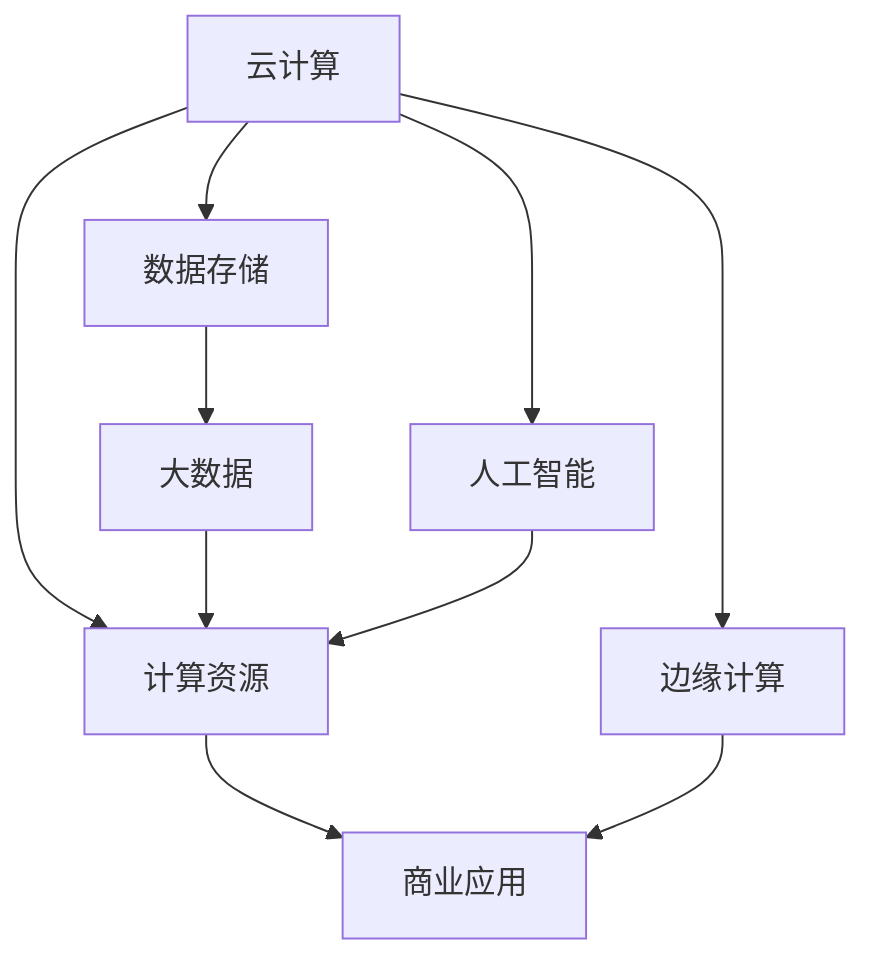
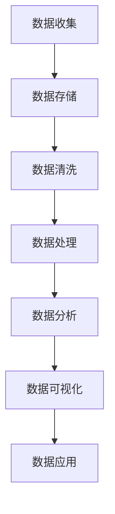
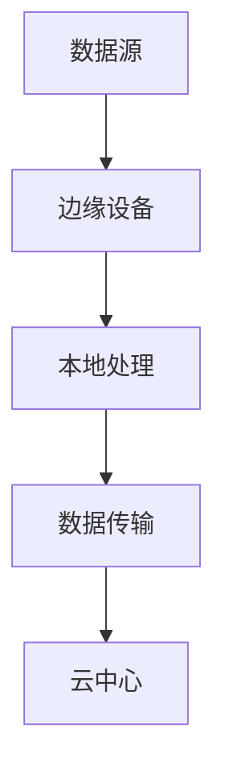
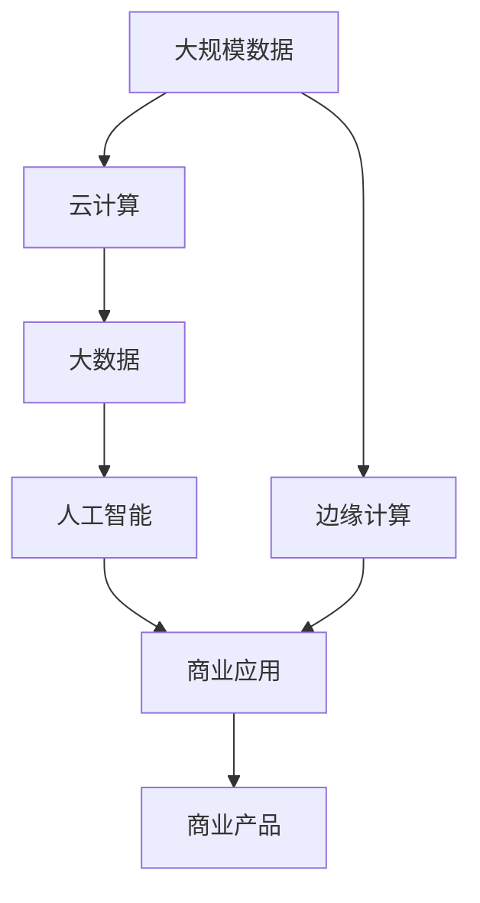

                 

# 算力平台的商业机会分析

> 关键词：算力平台、云计算、大数据、人工智能、边缘计算、商业应用、市场前景

## 1. 背景介绍

### 1.1 问题由来
随着科技的快速发展，算力平台在现代信息化社会的各个领域都扮演着越来越重要的角色。从数据存储、计算到分析、训练人工智能模型，算力平台的需求量呈指数级增长。同时，随着物联网、5G、AI等技术的快速推进，数据量和应用场景的复杂度也在不断提升，对算力的需求变得更加紧迫。因此，算力平台已成为当前和未来信息科技产业的核心组成部分，对企业竞争力和国家科技实力具有重要影响。

### 1.2 问题核心关键点
算力平台的商业机会主要体现在以下几个方面：
1. 云计算市场的不断扩展，特别是公有云和混合云服务的普及，为算力平台提供了广阔的市场空间。
2. 大数据技术的发展，尤其是数据存储和处理技术的进步，使得算力平台能更高效地处理海量数据。
3. 人工智能的崛起，算法模型的训练和推理任务对算力的巨大需求，催生了算力平台的高增长潜力。
4. 边缘计算的兴起，将算力下沉到更接近数据源的分布式环境中，开辟了新的算力平台应用场景。
5. 5G、物联网等新兴技术的融合应用，为算力平台带来了新的业务模式和市场需求。

### 1.3 问题研究意义
算力平台的商业机会研究对于把握信息科技发展的趋势、指导企业和科研机构投资决策具有重要意义：
1. 帮助企业识别计算资源的需求点，优化资源配置，提升运营效率。
2. 助力科研机构选择适合的算力平台技术，加速科技创新。
3. 为企业制定算力平台相关领域的战略布局提供依据，避免市场风险。
4. 为投资者评估算力平台相关项目提供数据支持，促进资本市场的健康发展。

## 2. 核心概念与联系

### 2.1 核心概念概述

为更好地理解算力平台的商业机会，本节将介绍几个密切相关的核心概念：

- **云计算(Cloud Computing)**：基于互联网的计算服务模式，用户通过网络随时随地访问计算资源。
- **大数据(Big Data)**：指在短时间内处理的海量、多样、实时性强的数据集。
- **人工智能(AI)**：涉及机器学习、深度学习、自然语言处理、计算机视觉等领域的智能技术。
- **边缘计算(Edge Computing)**：在靠近数据源的设备上处理数据，减少延迟和带宽需求。
- **商业应用(Business Application)**：指将算力平台技术与业务需求相结合，开发出的具体应用产品或服务。

这些概念之间的联系可以通过以下Mermaid流程图来展示：



这个流程图展示了几者之间的相互关系：

1. 云计算提供了计算资源，是算力平台的基础。
2. 大数据依托云计算，对数据进行存储和处理。
3. 人工智能利用云计算和大数据进行模型训练和推理。
4. 商业应用将算力平台技术转化为实际业务产品或服务。
5. 边缘计算在靠近数据源处进行数据处理，提供低延迟的计算服务。

### 2.2 概念间的关系

这些核心概念之间存在着紧密的联系，形成了算力平台商业机会的完整生态系统。下面我们通过几个Mermaid流程图来展示这些概念之间的关系。

#### 2.2.1 云计算的产业链条


这个流程图展示了云计算服务的产业链条，从基础设施层到应用层，提供全方位计算资源。

#### 2.2.2 大数据的存储处理流程



这个流程图展示了大数据存储和处理的基本流程，从数据收集到应用分析。

#### 2.2.3 人工智能的训练推理流程


这个流程图展示了人工智能模型的训练和推理流程，从数据集到应用场景。

#### 2.2.4 边缘计算的数据流图



这个流程图展示了边缘计算的数据流过程，从数据源到云中心。

### 2.3 核心概念的整体架构

最后，我们用一个综合的流程图来展示这些核心概念在算力平台商业机会中的整体架构：



这个综合流程图展示了从数据源到商业产品的完整过程，从大规模数据到云计算和大数据，再到人工智能和商业应用。

## 3. 核心算法原理 & 具体操作步骤
### 3.1 算法原理概述

算力平台的商业机会涉及多个技术领域的深度融合，涵盖从数据采集、存储、处理到计算资源的管理、调度、优化，以及算力资源的商业化应用。其核心算法原理可以概括为：

1. **数据流管理**：通过优化数据采集、存储和处理流程，减少数据延时和冗余，提高数据效率。
2. **计算资源调度**：通过智能算法进行计算资源的管理和调度，提高资源利用率和性能。
3. **模型训练优化**：通过高效的模型训练和推理算法，降低计算成本，提升模型效果。
4. **商业化应用设计**：通过结合具体业务需求，设计具有高度实用价值的商业产品和服务，创造商业价值。

### 3.2 算法步骤详解

算力平台的商业机会实现涉及以下关键步骤：

**Step 1: 数据采集与存储优化**
- 使用大数据技术，对数据进行分布式存储和并行处理，提升数据采集效率。
- 采用数据清洗和去重技术，提高数据质量。
- 应用数据压缩和归档技术，减少存储空间消耗。

**Step 2: 计算资源调度与管理**
- 设计高效的资源调度算法，实现负载均衡和资源共享。
- 引入智能监控技术，实时监测计算资源状态，自动调整资源分配。
- 采用分布式计算框架，如Spark、Flink等，提高并行处理能力。

**Step 3: 模型训练与优化**
- 选择高性能计算平台，如GPU、TPU、边缘计算节点等，进行模型训练。
- 应用混合精度训练、量化加速等技术，降低计算成本。
- 优化模型结构和训练流程，提升模型效率和效果。

**Step 4: 商业应用设计与落地**
- 结合具体业务需求，设计具有高度实用价值的商业产品和服务。
- 实施平台上线和用户对接，进行商业化推广。
- 持续优化产品和服务，提升用户体验和市场竞争力。

### 3.3 算法优缺点

算力平台的商业机会具有以下优点：
1. 高效的资源管理和调度，提升资源利用率和运营效率。
2. 强大的数据处理能力，支持海量数据存储和快速分析。
3. 先进的计算技术，支持高性能模型训练和推理。
4. 多样化的商业应用设计，创造巨大的市场价值。

同时，也存在一些缺点：
1. 初始投资较大，需要大量的硬件设施和技术积累。
2. 技术复杂度高，对团队专业能力要求较高。
3. 安全性与隐私保护问题，需要严格的数据管理和监控。
4. 市场需求变化快，对持续创新和优化提出挑战。

### 3.4 算法应用领域

算力平台的商业机会涵盖多个领域，主要包括以下几个方面：

- **云计算服务**：公有云、私有云、混合云等云服务解决方案，覆盖各类企业客户需求。
- **大数据分析**：数据挖掘、商业智能、实时数据处理等大数据应用，为企业决策提供数据支持。
- **人工智能应用**：深度学习、自然语言处理、计算机视觉等AI技术，应用于智能推荐、自动化流程等场景。
- **边缘计算服务**：物联网设备的数据处理、5G通信边缘计算等，提供低延迟、高效能的计算服务。
- **区块链技术**：通过区块链技术提升数据安全性、透明性和可追溯性。
- **自动化运维**：自动化部署、监控和维护工具，提升系统稳定性和运营效率。

## 4. 数学模型和公式 & 详细讲解 & 举例说明

### 4.1 数学模型构建

本节将使用数学语言对算力平台的商业机会进行更加严格的刻画。

假设大规模数据量为 $D$，计算资源量为 $C$，训练集为 $T$，商业应用用户量为 $U$，商业应用收入为 $I$。设 $f(D, C, T, U)$ 为商业机会函数，则有：

$$
f(D, C, T, U) = \max \left( \frac{I}{U}, \frac{T}{D} \cdot \frac{I}{C} \cdot f(D, C, T, U) \right)
$$

其中，$\frac{I}{U}$ 为单位用户收入，$\frac{T}{D}$ 为训练效率，$\frac{I}{C}$ 为计算效率。

### 4.2 公式推导过程

将上述公式进行简化，得到：

$$
f(D, C, T, U) = \max \left( \frac{I}{U}, \frac{T}{D} \cdot \frac{I}{C} \cdot f(D, C, T, U) \right) = \max \left( \frac{I}{U}, \frac{T}{D} \cdot \frac{I}{C} \right) \cdot f(D, C, T, U)
$$

因此，商业机会最大化，需要对单位用户收入、训练效率和计算效率进行优化。具体而言：

- 优化 $I/U$：提升商业应用的销售和推广，增加用户量和用户收入。
- 优化 $T/D$：提高数据处理和模型训练的效率，减少数据延时和训练时间。
- 优化 $I/C$：降低计算成本，提升计算效率，确保高效能的计算资源使用。

### 4.3 案例分析与讲解

假设某企业开发了一个基于云平台的大数据和AI服务，以实时分析客户数据，提供个性化推荐服务。根据上述公式，其商业机会函数为：

$$
f(D, C, T, U) = \max \left( \frac{R}{U}, \frac{T}{D} \cdot \frac{R}{C} \right) \cdot \max \left( \frac{D}{T} \cdot \frac{R}{U} \cdot f(D, C, T, U) \right)
$$

其中 $R$ 为推荐服务收入。通过优化训练效率和计算效率，可以提升模型效果和推荐质量，从而增加用户量和收入。

## 5. 项目实践：代码实例和详细解释说明

### 5.1 开发环境搭建

在进行算力平台商业机会实践前，我们需要准备好开发环境。以下是使用Python进行Hadoop开发的环境配置流程：

1. 安装Hadoop：从官网下载Hadoop安装包，并按照官方文档进行安装。
2. 配置Hadoop环境变量：编辑`/etc/hadoop/conf/core-site.xml`和`/etc/hadoop/conf/hdfs-site.xml`文件，配置Hadoop集群的基本信息。
3. 启动Hadoop集群：使用`bin/start-hadoop.sh`命令启动Hadoop集群。

完成上述步骤后，即可在本地搭建起一个Hadoop集群，开始商业机会的实践。

### 5.2 源代码详细实现

下面我们以一个简单的Hadoop数据处理示例，展示如何在Hadoop上进行数据处理和分析。

首先，定义Hadoop的MapReduce框架下的数据处理函数：

```python
from pydoop.mapreduce.api import Mapper, Reducer
from pydoop.mapreduce.topology import Job, Task

class MapFunction(Mapper):
    def map(self, context):
        key = context.key
        value = context.value
        yield key, value

class ReduceFunction(Reducer):
    def reduce(self, key, values):
        total = sum(values)
        yield key, total

# 定义数据处理作业
job = Job(WordCount)
map_task = Mapper()
reduce_task = Reducer()

job.add_input('input', 'file:///data/input')
job.set_output('output', 'file:///data/output')
job.add_mapper(map_task)
job.add_reducer(reduce_task)
job.run()
```

然后，定义Hadoop数据处理作业：

```python
from pydoop.mapreduce.topology import Job, Task

job = Job(WordCount)
map_task = Mapper()
reduce_task = Reducer()

job.add_input('input', 'file:///data/input')
job.set_output('output', 'file:///data/output')
job.add_mapper(map_task)
job.add_reducer(reduce_task)
job.run()
```

最后，启动Hadoop集群，运行数据处理作业：

```bash
hadoop jar WordCount.jar data/input data/output
```

这个简单的Hadoop数据处理示例展示了如何使用MapReduce框架进行数据的并行处理和分析。在实际应用中，Hadoop还支持分布式存储、大数据分析和机器学习等多种功能。开发者可以根据具体需求，使用Hadoop进行复杂的数据处理和商业应用设计。

### 5.3 代码解读与分析

让我们再详细解读一下关键代码的实现细节：

**MapReduce框架**：
- `Mapper`和`Reducer`类分别实现了Map和Reduce函数，对输入数据进行处理和计算。
- `Job`类用于创建和提交MapReduce作业。
- `Task`类用于定义具体的Map和Reduce任务。
- `add_input`和`set_output`方法用于设置作业的输入输出路径。
- `add_mapper`和`add_reducer`方法用于添加具体的Map和Reduce任务。

**数据处理作业**：
- 使用`Job`类创建了一个WordCount作业。
- 定义了Map和Reduce函数的具体实现，用于统计每个单词的词频。
- 使用`add_input`和`set_output`方法设置输入和输出路径。
- 调用`add_mapper`和`add_reducer`方法添加具体的Map和Reduce任务。
- 调用`run`方法提交作业并运行。

**作业执行**：
- 使用Hadoop命令`hadoop jar`指定WordCount.jar文件，并指定输入输出路径，即可启动作业执行。

可以看到，Hadoop框架提供了一种强大的分布式计算解决方案，可以在大规模数据上高效处理和分析。开发者可以使用Hadoop进行各种复杂的数据处理和商业应用设计，以实现商业机会的最大化。

当然，工业级的系统实现还需考虑更多因素，如性能优化、数据安全性、扩展性等。但核心的算法原理和实现方法，即通过MapReduce框架进行数据处理和分析，是构建算力平台商业机会的基础。

## 6. 实际应用场景
### 6.1 智能推荐系统

智能推荐系统是算力平台商业机会的重要应用之一。通过大数据分析和AI技术，企业能够实时分析用户行为数据，提供个性化的商品推荐、内容推荐等，提升用户体验和销售转化率。

具体而言，可以在用户行为数据上应用商业机会模型，结合用户画像和商品标签，设计推荐算法。在实际应用中，推荐系统可以部署在云平台上，利用分布式计算和存储资源，进行高效的数据处理和模型训练。

### 6.2 医疗健康平台

医疗健康平台是算力平台商业机会的另一个典型应用场景。通过结合云计算和大数据技术，医疗机构可以实时分析患者数据，提供个性化的健康管理、疾病预测等服务。

具体而言，可以建立医疗数据仓库，利用Hadoop等分布式计算框架进行数据存储和处理。结合AI技术，设计疾病预测、个性化诊疗等应用，为患者提供个性化的健康服务。同时，平台可以通过云服务模式，为不同医疗机构提供统一的数据管理和分析平台，实现资源共享和协同诊疗。

### 6.3 工业互联网平台

工业互联网平台是算力平台商业机会的重要组成部分，通过云计算、大数据和AI技术，可以实现智能制造、智慧供应链等应用。

具体而言，企业可以构建工业大数据平台，利用Hadoop等分布式计算框架，进行工业数据存储和处理。结合AI技术，设计智能制造、预测性维护等应用，实现生产流程的自动化和智能化。同时，平台可以部署在云平台上，为不同企业提供统一的数据管理和分析服务，提升整体生产效率。

### 6.4 未来应用展望

随着算力平台技术的不断发展和应用场景的不断扩展，未来商业机会将呈现以下几个趋势：

1. 云计算市场将继续扩展，特别是公有云和混合云服务。未来云计算市场将呈现多元化、个性化、智能化的发展趋势。
2. 大数据技术将更加成熟，通过数据挖掘、商业智能等应用，提升企业的决策效率和竞争力。
3. 人工智能技术将更广泛地应用于各个领域，带来更多的商业机会和市场价值。
4. 边缘计算和物联网技术将推动算力平台向更靠近数据源的方向发展，提升数据处理的实时性和高效性。
5. 区块链技术将为算力平台带来更高的数据安全和透明性，推动算力平台应用的普及。

## 7. 工具和资源推荐
### 7.1 学习资源推荐

为了帮助开发者系统掌握算力平台的技术基础和实践技巧，这里推荐一些优质的学习资源：

1. **Hadoop官方文档**：从Hadoop官网下载官方文档，涵盖Hadoop的安装、配置、使用等方面的详细说明。
2. **Apache Spark官方文档**：从Apache官网下载Spark官方文档，学习Spark的大数据处理和机器学习应用。
3. **Hadoop权威指南**：Hadoop技术的权威入门书籍，详细介绍了Hadoop的原理、架构和实践。
4. **机器学习实战**：Google工程师编写的机器学习实践指南，涵盖Hadoop、Spark等技术在机器学习中的应用。
5. **大数据技术架构》：深入浅出地讲解了大数据技术和Hadoop等平台的架构设计。

通过对这些资源的学习实践，相信你一定能够快速掌握算力平台的技术基础，并用于解决实际的商业问题。

### 7.2 开发工具推荐

高效的开发离不开优秀的工具支持。以下是几款用于算力平台商业机会开发的常用工具：

1. **Hadoop**：分布式计算框架，支持大规模数据存储和处理。
2. **Spark**：基于内存的分布式计算框架，支持大规模数据处理和机器学习应用。
3. **TensorFlow**：开源深度学习框架，支持大规模模型训练和推理。
4. **Kubernetes**：开源容器编排工具，支持算力平台的自动化部署和管理。
5. **Prometheus**：开源监控系统，实时监控算力平台的状态和性能。
6. **Fluentd**：开源日志收集系统，支持算力平台的大规模日志处理和分析。

合理利用这些工具，可以显著提升算力平台商业机会的开发效率，加快创新迭代的步伐。

### 7.3 相关论文推荐

算力平台商业机会的发展源于学界的持续研究。以下是几篇奠基性的相关论文，推荐阅读：

1. **MapReduce: Simplified Data Processing on Large Clusters**：Hadoop技术的核心论文，详细介绍了MapReduce框架的基本原理和设计思想。
2. **YARN: Yet Another Resource Negotiator**：Hadoop的资源管理调度框架，介绍了YARN的资源管理和调度机制。
3. **Spark: Cluster Computing with Working Sets**：Spark技术的核心论文，详细介绍了Spark框架的原理和应用。
4. **TensorFlow: A System for Large-Scale Machine Learning**：TensorFlow技术的核心论文，介绍了TensorFlow的架构和应用。
5. **Big Data: Repository of Digital Assets for Contemporary Science**：大数据技术的经典论文，详细介绍了大数据技术的背景和发展方向。

这些论文代表了大规模数据处理和算力平台技术的发展脉络。通过学习这些前沿成果，可以帮助研究者把握学科前进方向，激发更多的创新灵感。

除上述资源外，还有一些值得关注的前沿资源，帮助开发者紧跟算力平台商业机会的最新进展，例如：

1. **arXiv论文预印本**：人工智能领域最新研究成果的发布平台，包括大量尚未发表的前沿工作，学习前沿技术的必读资源。
2. **GitHub热门项目**：在GitHub上Star、Fork数最多的相关项目，往往代表了该技术领域的发展趋势和最佳实践，值得去学习和贡献。
3. **业界技术博客**：如AWS、Microsoft Azure、Google Cloud等顶尖云服务商的官方博客，第一时间分享他们的最新研究成果和洞见。
4. **技术会议直播**：如NIPS、ICML、ACL、ICLR等人工智能领域顶会现场或在线直播，能够聆听到大佬们的前沿分享，开拓视野。
5. **行业分析报告**：各大咨询公司如McKinsey、PwC等针对信息科技产业的分析报告，有助于从商业视角审视技术趋势，把握应用价值。

总之，对于算力平台商业机会的学习和实践，需要开发者保持开放的心态和持续学习的意愿。多关注前沿资讯，多动手实践，多思考总结，必将收获满满的成长收益。

## 8. 总结：未来发展趋势与挑战

### 8.1 总结

本文对算力平台的商业机会进行了全面系统的介绍。首先阐述了算力平台在现代信息化社会的地位和作用，明确了其商业机会的来源和重要性。其次，从原理到实践，详细讲解了算力平台商业机会的数学模型和关键步骤，给出了算力平台商业机会开发的完整代码实例。同时，本文还广泛探讨了算力平台商业机会在多个行业领域的应用前景，展示了其广阔的市场潜力。此外，本文精选了算力平台商业机会相关的学习资源和工具，力求为读者提供全方位的技术指引。

通过本文的系统梳理，可以看到，算力平台商业机会正在成为信息科技产业的重要组成部分，对企业竞争力和国家科技实力具有重要影响。未来随着算力平台的不断发展，其商业机会也将持续扩大，为企业带来更大的市场机遇和挑战。

### 8.2 未来发展趋势

展望未来，算力平台的商业机会将呈现以下几个发展趋势：

1. **云计算市场的不断扩展**：云计算服务将更加普及和多样化，包括公有云、私有云、混合云等多种服务模式。
2. **大数据技术的持续进步**：通过先进的数据存储和处理技术，算力平台将支持更高效的数据管理和大数据应用。
3. **人工智能应用的广泛渗透**：AI技术将在更多领域得到应用，带来更多的商业机会和市场价值。
4. **边缘计算的崛起**：边缘计算将推动算力平台向更靠近数据源的方向发展，提升数据处理的实时性和高效性。
5. **区块链技术的融合**：区块链技术将为算力平台带来更高的数据安全和透明性，推动算力平台应用的普及。
6. **自动化运维的普及**：通过自动化运维工具，算力平台将实现更高效、稳定的运行。

### 8.3 面临的挑战

尽管算力平台商业机会已展现出巨大的潜力，但在迈向更加智能化、普适化应用的过程中，仍面临诸多挑战：

1. **初始投资较大**：算力平台的建设需要大量的硬件设施和技术积累，初期的投资门槛较高。
2. **技术复杂度高**：算力平台涉及多种技术的融合，对团队的专业能力要求较高。
3. **安全性与隐私保护**：算力平台需要严格的数据管理和监控，以确保数据安全和隐私保护。
4. **市场需求变化快**：算力平台需要持续创新和优化，以适应不断变化的市场需求。

### 8.4 研究展望

面对算力平台商业机会面临的种种挑战，未来的研究需要在以下几个方面寻求新的突破：

1. **优化资源配置**：通过智能调度算法，提升资源利用率和运营效率。
2. **提升数据处理能力**：通过大数据技术和云计算平台，支持海量数据的存储和处理。
3. **降低计算成本**：通过混合精度训练、量化加速等技术，降低计算成本，提升模型效果。
4. **加强数据安全和隐私保护**：通过区块链技术和数据加密技术，确保数据安全和隐私保护。
5. **提高算力平台灵活性**：通过平台开放API接口，支持多样化应用场景和灵活配置。

## 9. 附录：常见问题与解答

**Q1：算力平台的主要应用场景有哪些？**

A: 算力平台的主要应用场景包括云计算服务、大数据分析、人工智能应用、边缘计算服务、工业互联网平台等。具体应用领域包括智能推荐系统、医疗健康平台、工业互联网平台、金融交易平台等。

**Q2：算力平台商业机会的商业化路径有哪些？**

A: 算力平台商业机会的商业化路径主要包括：
1. **公有云和私有云服务**：提供云计算基础设施和云服务解决方案，满足企业不同需求。
2. **大数据分析服务**：通过数据挖掘、商业智能等应用，提供数据驱动的决策支持。
3. **AI应用服务**：通过深度学习、自然语言处理等技术，提供AI应用解决方案。
4. **边缘计算服务**：通过物联网设备的数据处理和5G通信边缘计算，提供低延迟、高效能的计算服务。
5. **区块链技术服务**：通过区块链技术提升数据安全和透明性，推动算力平台应用的普及。

**Q3

