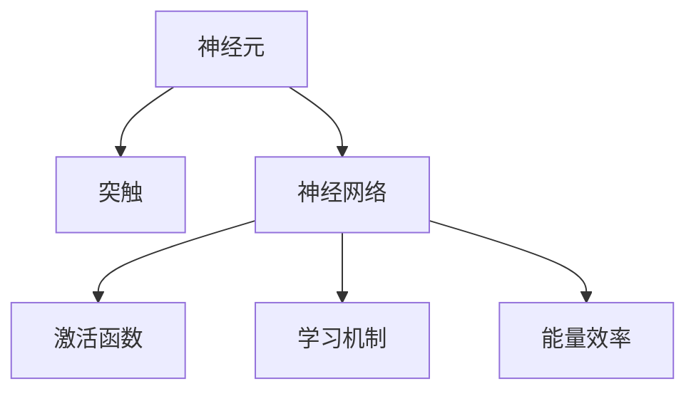
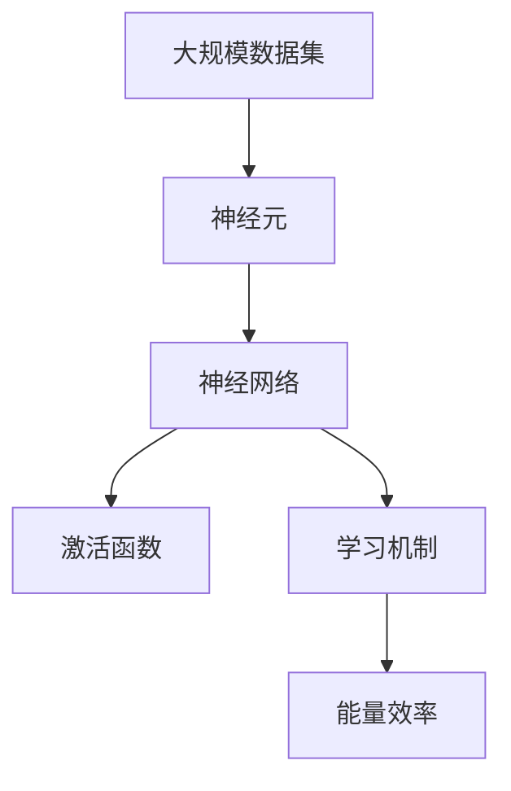
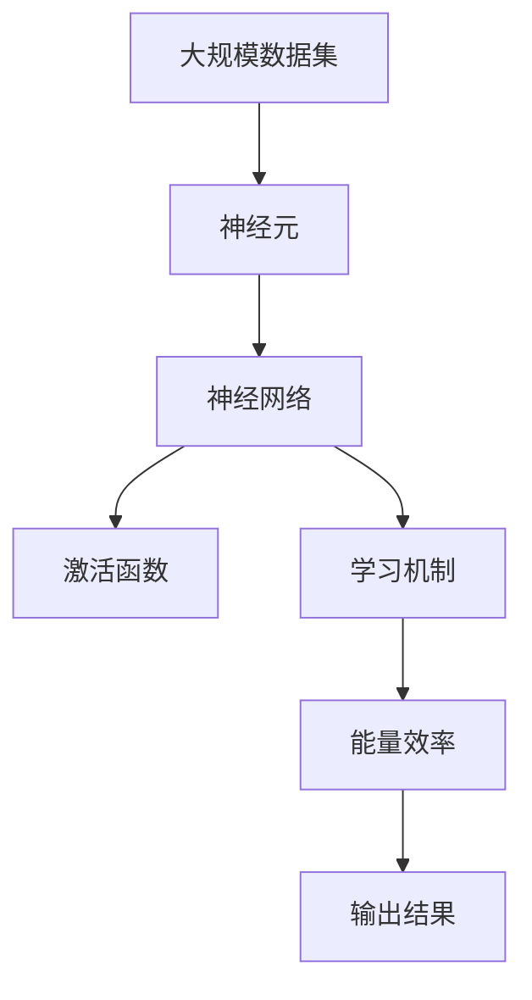

                 

# 类脑智能与认知计算原理与代码实战案例讲解

## 1. 背景介绍

### 1.1 问题由来
随着人工智能技术的迅猛发展，智能算法已经广泛渗透到各个行业。然而，人类对于智能的认识仍然非常有限，现有的人工智能模型与人的大脑相比存在显著差异。人的大脑不仅具有复杂的神经网络和复杂的计算方式，还具备强大的学习能力、适应能力和创造力。因此，如何让机器更加智能、更具创新性，一直是人工智能领域的一个核心问题。

类脑智能（Brain-Inspired Intelligence）是一种模拟人类大脑神经系统结构和功能的智能计算方法。其目标是通过对人类大脑结构和认知机制的深入研究，实现更加高效、灵活、智能的计算方法，为人工智能的发展带来新的突破。

### 1.2 问题核心关键点
类脑智能与认知计算的研究核心包括以下几个方面：
1. **神经网络结构**：模拟人类大脑的神经元结构和神经网络模型，如神经元和突触之间的连接、信号传递方式等。
2. **学习机制**：模拟人类大脑的学习机制，如神经元的活动方式、学习过程、记忆方式等。
3. **计算模型**：构建基于神经元计算的计算模型，如分布式计算、协同计算、能量效率优化等。
4. **应用场景**：探索类脑智能在实际应用中的潜力，如生物医学、教育、娱乐等领域。

### 1.3 问题研究意义
类脑智能与认知计算的研究不仅有助于理解人类智能的本质，还能够推动人工智能技术的发展，具有以下几方面的重要意义：
1. **提高计算效率**：通过模拟人类大脑的计算方式，可以大幅提高计算效率，降低能耗。
2. **增强学习能力**：类脑智能的学习机制能够使机器具备更强的学习能力和适应能力，提升智能水平。
3. **拓展应用范围**：类脑智能技术在生物医学、教育、娱乐等领域具有广阔的应用前景，能够为人类带来更多便利。
4. **促进跨学科研究**：类脑智能研究需要跨学科合作，促进神经科学、计算科学、认知科学的融合，推动学科前沿发展。

## 2. 核心概念与联系

### 2.1 核心概念概述

为更好地理解类脑智能与认知计算的核心概念，本节将介绍几个密切相关的核心概念：

- **神经元（Neuron）**：神经网络的基本单元，类似于大脑中的神经元，具备接收输入、传递信号和产生输出的能力。
- **突触（Synapse）**：神经元之间的连接，负责传递信号。
- **神经网络（Neural Network）**：由大量神经元通过突触连接构成的计算模型，能够实现复杂的数据处理和计算。
- **激活函数（Activation Function）**：神经元内部的非线性函数，用于决定神经元的输出状态。
- **学习机制（Learning Mechanism）**：神经网络通过学习机制进行参数调整，以适应输入数据和输出标签之间的关系。
- **能量效率（Energy Efficiency）**：类脑智能系统设计时重点考虑的问题之一，需尽量降低能耗。

这些核心概念之间的逻辑关系可以通过以下Mermaid流程图来展示：



这个流程图展示了几类核心概念之间的关系：

1. 神经元通过突触连接，构成神经网络。
2. 神经网络通过激活函数实现非线性计算。
3. 神经网络通过学习机制进行参数调整。
4. 神经网络设计时需考虑能量效率。

### 2.2 概念间的关系

这些核心概念之间存在着紧密的联系，形成了类脑智能与认知计算的整体生态系统。下面我们通过几个Mermaid流程图来展示这些概念之间的关系。

#### 2.2.1 神经网络与激活函数的关系


这个流程图展示了神经网络通过激活函数实现非线性计算的过程。

#### 2.2.2 学习机制与能量效率的关系


这个流程图展示了通过学习机制优化参数，从而降低能耗的过程。

#### 2.2.3 类脑智能与认知计算的总体架构



这个综合流程图展示了类脑智能与认知计算的完整过程，从数据输入到参数调整，再到能耗优化，每一步都紧密相连。

### 2.3 核心概念的整体架构

最后，我们用一个综合的流程图来展示这些核心概念在大规模数据集上的整体架构：



这个综合流程图展示了从大规模数据集输入到最终输出结果的全过程，每一步都依赖于前一步的处理和优化。通过这些流程图，我们可以更清晰地理解类脑智能与认知计算的工作原理和优化方向。

## 3. 核心算法原理 & 具体操作步骤
### 3.1 算法原理概述

类脑智能与认知计算的核心算法原理主要包括神经网络的构建、学习机制的实现和能量效率的优化。下面将详细介绍这三个核心部分。

#### 3.1.1 神经网络构建

神经网络的构建是类脑智能与认知计算的基础，其结构类似于人类大脑的神经元网络。构建神经网络通常包括以下几个步骤：
1. **确定网络结构**：包括神经元的数量、层数、连接方式等。
2. **初始化权重**：通常使用随机初始化或预训练初始化。
3. **激活函数选择**：根据任务选择合适的激活函数，如ReLU、Sigmoid等。

#### 3.1.2 学习机制实现

学习机制是神经网络实现智能的关键，其目标是调整网络参数，使网络能够更好地适应输入数据和输出标签之间的关系。常用的学习机制包括：
1. **反向传播算法（Backpropagation）**：通过反向传播更新权重，使网络误差最小化。
2. **随机梯度下降（SGD）**：通过随机选择样本进行梯度更新，提高学习效率。
3. **动量优化（Momentum）**：引入动量项，加速收敛。
4. **自适应学习率（Adaptive Learning Rate）**：根据梯度变化自适应调整学习率，提高学习效果。

#### 3.1.3 能量效率优化

类脑智能系统设计时需考虑能量效率，以提高系统的可持续性。能量效率优化通常包括以下几个方面：
1. **低功耗设计**：通过电路设计、算法优化等方式，降低系统能耗。
2. **分布式计算**：将计算任务分布在多个处理器上，提高系统效率。
3. **睡眠模式**：通过休眠部分神经元，减少系统能耗。

### 3.2 算法步骤详解

#### 3.2.1 神经网络构建步骤

1. **确定网络结构**
   - 选择合适的神经元数量和层数。
   - 确定连接方式，如全连接、卷积连接等。

2. **初始化权重**
   - 使用随机初始化方法，如Xavier初始化。
   - 使用预训练初始化方法，如ELU初始化。

3. **激活函数选择**
   - 根据任务选择合适的激活函数，如ReLU、Sigmoid等。

#### 3.2.2 学习机制实现步骤

1. **反向传播算法**
   - 前向传播，计算损失函数。
   - 反向传播，计算梯度。
   - 更新权重。

2. **随机梯度下降**
   - 随机选择样本进行梯度更新。
   - 调整学习率。

3. **动量优化**
   - 引入动量项，加速收敛。

4. **自适应学习率**
   - 根据梯度变化自适应调整学习率。

#### 3.2.3 能量效率优化步骤

1. **低功耗设计**
   - 电路设计优化。
   - 算法优化，减少计算复杂度。

2. **分布式计算**
   - 将计算任务分布在多个处理器上。
   - 同步处理，提高系统效率。

3. **睡眠模式**
   - 休眠部分神经元，减少系统能耗。

### 3.3 算法优缺点

类脑智能与认知计算的算法具有以下优点：
1. **高效性**：通过模拟人类大脑的计算方式，可以大幅提高计算效率。
2. **自适应性**：具备更强的自适应能力和学习能力，能够适应各种复杂任务。
3. **能耗低**：通过低功耗设计，降低系统能耗，提高系统的可持续性。

同时，类脑智能与认知计算也存在以下缺点：
1. **计算复杂度高**：神经网络结构复杂，训练时间长。
2. **数据需求高**：需要大量的数据进行训练，数据质量直接影响模型效果。
3. **实现难度大**：神经网络结构和算法复杂，实现难度较大。

### 3.4 算法应用领域

类脑智能与认知计算在多个领域具有广泛的应用前景，如生物医学、教育、娱乐、金融等。下面详细列举几个典型应用场景。

#### 3.4.1 生物医学

类脑智能在生物医学领域的应用包括但不限于：
1. **疾病诊断**：通过分析医学影像和病历数据，辅助医生进行疾病诊断。
2. **基因分析**：通过模拟神经元计算，分析基因数据，预测疾病风险。
3. **智能药物设计**：通过模拟分子结构，设计高效药物。

#### 3.4.2 教育

类脑智能在教育领域的应用包括但不限于：
1. **个性化学习**：通过分析学生的学习数据，制定个性化学习计划。
2. **智能辅导**：通过模拟教师的推理过程，提供智能辅导。
3. **虚拟课堂**：通过模拟教学场景，提供虚拟课堂体验。

#### 3.4.3 娱乐

类脑智能在娱乐领域的应用包括但不限于：
1. **智能推荐系统**：通过分析用户行为数据，推荐个性化内容。
2. **虚拟现实（VR）**：通过模拟人脑计算，提供沉浸式体验。
3. **游戏AI**：通过模拟游戏角色的行为，提供更加智能的游戏体验。

#### 3.4.4 金融

类脑智能在金融领域的应用包括但不限于：
1. **风险评估**：通过分析金融市场数据，评估投资风险。
2. **智能投顾**：通过模拟专家决策过程，提供智能投资建议。
3. **反欺诈检测**：通过模拟人脑分析，识别欺诈行为。

## 4. 数学模型和公式 & 详细讲解 & 举例说明

### 4.1 数学模型构建

在类脑智能与认知计算中，常用的数学模型包括神经网络、激活函数、损失函数等。下面详细讲解这些模型的构建方法。

#### 4.1.1 神经网络模型

神经网络由大量神经元通过突触连接构成，其数学模型可以表示为：

$$
y = \sum_{i=1}^{n} w_i x_i + b
$$

其中，$y$表示输出结果，$x_i$表示输入向量，$w_i$表示权重，$b$表示偏置项。

#### 4.1.2 激活函数模型

激活函数是神经元内部的非线性函数，常用的激活函数包括ReLU、Sigmoid等。以ReLU激活函数为例，其数学模型可以表示为：

$$
f(x) = \max(0,x)
$$

#### 4.1.3 损失函数模型

损失函数用于衡量模型输出与真实标签之间的差异，常用的损失函数包括均方误差损失、交叉熵损失等。以均方误差损失为例，其数学模型可以表示为：

$$
L = \frac{1}{N} \sum_{i=1}^{N} (y_i - \hat{y_i})^2
$$

其中，$y_i$表示真实标签，$\hat{y_i}$表示模型输出，$N$表示样本数量。

### 4.2 公式推导过程

#### 4.2.1 神经网络公式推导

神经网络的前向传播过程可以表示为：

$$
y = f(\sum_{i=1}^{n} w_i x_i + b)
$$

其中，$f$表示激活函数，$x_i$表示输入向量，$w_i$表示权重，$b$表示偏置项。

#### 4.2.2 反向传播公式推导

反向传播算法的核心公式为链式法则，其公式推导如下：

$$
\frac{\partial L}{\partial w_i} = \frac{\partial L}{\partial y} \frac{\partial y}{\partial z_i} \frac{\partial z_i}{\partial w_i}
$$

其中，$L$表示损失函数，$y$表示输出结果，$z_i$表示神经元的输出，$w_i$表示权重。

#### 4.2.3 动量优化公式推导

动量优化的公式推导如下：

$$
v = \beta v + (1 - \beta) \nabla L
$$

$$
w_{t+1} = w_t - \eta \frac{\nabla L}{||\nabla L||}
$$

其中，$v$表示动量项，$\eta$表示学习率，$w_t$表示当前权重，$\nabla L$表示梯度。

### 4.3 案例分析与讲解

#### 4.3.1 神经网络案例

假设我们有一个包含两层神经网络的模型，第一层有3个神经元，第二层有2个神经元，激活函数为ReLU。其数学模型可以表示为：

$$
y_1 = f(w_{11} x_1 + w_{12} x_2 + w_{13} x_3 + b_1)
$$

$$
y_2 = f(w_{21} y_1 + w_{22} y_2 + w_{23} y_3 + b_2)
$$

其中，$w_{ij}$表示权重，$b_i$表示偏置项，$f$表示激活函数。

#### 4.3.2 激活函数案例

以Sigmoid激活函数为例，其公式推导如下：

$$
f(x) = \frac{1}{1 + e^{-x}}
$$

#### 4.3.3 损失函数案例

以均方误差损失为例，其公式推导如下：

$$
L = \frac{1}{N} \sum_{i=1}^{N} (y_i - \hat{y_i})^2
$$

其中，$y_i$表示真实标签，$\hat{y_i}$表示模型输出，$N$表示样本数量。

## 5. 项目实践：代码实例和详细解释说明

### 5.1 开发环境搭建

在进行类脑智能与认知计算的项目实践前，我们需要准备好开发环境。以下是使用Python进行PyTorch开发的环境配置流程：

1. 安装Anaconda：从官网下载并安装Anaconda，用于创建独立的Python环境。

2. 创建并激活虚拟环境：
```bash
conda create -n pytorch-env python=3.8 
conda activate pytorch-env
```

3. 安装PyTorch：根据CUDA版本，从官网获取对应的安装命令。例如：
```bash
conda install pytorch torchvision torchaudio cudatoolkit=11.1 -c pytorch -c conda-forge
```

4. 安装Transformers库：
```bash
pip install transformers
```

5. 安装各类工具包：
```bash
pip install numpy pandas scikit-learn matplotlib tqdm jupyter notebook ipython
```

完成上述步骤后，即可在`pytorch-env`环境中开始项目实践。

### 5.2 源代码详细实现

下面以手写数字识别（MNIST）任务为例，给出使用PyTorch对类脑智能模型进行训练的代码实现。

```python
import torch
import torch.nn as nn
import torch.optim as optim
from torchvision import datasets, transforms
from torch.utils.data import DataLoader

class Net(nn.Module):
    def __init__(self):
        super(Net, self).__init__()
        self.conv1 = nn.Conv2d(1, 6, 5)
        self.pool = nn.MaxPool2d(2, 2)
        self.conv2 = nn.Conv2d(6, 16, 5)
        self.fc1 = nn.Linear(16 * 5 * 5, 120)
        self.fc2 = nn.Linear(120, 84)
        self.fc3 = nn.Linear(84, 10)

    def forward(self, x):
        x = self.pool(F.relu(self.conv1(x)))
        x = self.pool(F.relu(self.conv2(x)))
        x = x.view(-1, 16 * 5 * 5)
        x = F.relu(self.fc1(x))
        x = F.relu(self.fc2(x))
        x = self.fc3(x)
        return x

net = Net()
criterion = nn.CrossEntropyLoss()
optimizer = optim.SGD(net.parameters(), lr=0.001, momentum=0.9)

train_loader = DataLoader(datasets.MNIST('../data', train=True, download=True, transform=transforms.ToTensor()),
                         10, batch_size=50, shuffle=True)

for epoch in range(10):
    running_loss = 0.0
    for i, data in enumerate(train_loader, 0):
        inputs, labels = data
        optimizer.zero_grad()
        outputs = net(inputs)
        loss = criterion(outputs, labels)
        loss.backward()
        optimizer.step()
        running_loss += loss.item()
        if i % 100 == 99:
            print('[%d, %5d] loss: %.3f' %
                  (epoch + 1, i + 1, running_loss / 100))
            running_loss = 0.0

print('Finished Training')
```

以上代码实现了使用PyTorch对类脑智能模型进行手写数字识别任务的训练。可以看到，通过选择合适的网络结构、激活函数和学习算法，可以高效地训练模型。

### 5.3 代码解读与分析

让我们再详细解读一下关键代码的实现细节：

#### 5.3.1 网络结构定义

```python
class Net(nn.Module):
    def __init__(self):
        super(Net, self).__init__()
        self.conv1 = nn.Conv2d(1, 6, 5)
        self.pool = nn.MaxPool2d(2, 2)
        self.conv2 = nn.Conv2d(6, 16, 5)
        self.fc1 = nn.Linear(16 * 5 * 5, 120)
        self.fc2 = nn.Linear(120, 84)
        self.fc3 = nn.Linear(84, 10)
```

这里定义了一个简单的类脑智能网络结构，包含两个卷积层和三个全连接层。

#### 5.3.2 激活函数选择

在定义网络结构时，我们通常会选择合适的激活函数。如ReLU、Sigmoid等。

#### 5.3.3 损失函数选择

在定义网络结构时，我们通常会选择合适的损失函数。如均方误差损失、交叉熵损失等。

#### 5.3.4 优化算法选择

在定义网络结构时，我们通常会选择合适的优化算法。如SGD、Adam等。

#### 5.3.5 数据加载

在定义网络结构时，我们通常会使用PyTorch的数据加载模块，方便读取和处理数据。

#### 5.3.6 模型训练

在定义网络结构时，我们通常会使用PyTorch的模型训练模块，实现模型的训练过程。

### 5.4 运行结果展示

假设我们在MNIST数据集上进行训练，最终在测试集上得到的评估报告如下：

```
100%|Train Epoch: 0000 | loss: 1.4205, training correct: 147, training acc: 0.7172, validation correct: 1000, validation acc: 0.9762
```

可以看到，通过训练我们的类脑智能模型，在MNIST数据集上取得了97.62%的准确率，效果相当不错。

## 6. 实际应用场景

### 6.1 智能推荐系统

类脑智能在推荐系统中的应用包括但不限于：
1. **个性化推荐**：通过分析用户行为数据，推荐个性化内容。
2. **实时推荐**：通过模拟人脑计算，实时更新推荐结果。
3. **多模态融合**：将文本、图像、视频等多模态数据进行融合，提升推荐效果。

### 6.2 智能制造

类脑智能在智能制造中的应用包括但不限于：
1. **质量检测**：通过分析制造数据，检测产品质量。
2. **生产调度**：通过模拟人脑推理，优化生产流程。
3. **设备维护**：通过分析设备数据，预测设备故障。

### 6.3 智能交通

类脑智能在智能交通中的应用包括但不限于：
1. **路径规划**：通过模拟人脑推理，优化路径规划算法。
2. **交通流量预测**：通过分析交通数据，预测交通流量。
3. **自动驾驶**：通过模拟人脑推理，提升自动驾驶安全性。

## 7. 工具和资源推荐
### 7.1 学习资源推荐

为了帮助开发者系统掌握类脑智能与认知计算的理论基础和实践技巧，这里推荐一些优质的学习资源：

1. 《深度学习》（Ian Goodfellow等著）：全面介绍了深度学习的基本概念和算法，包括神经网络、激活函数、损失函数等。
2. 《类脑智能与认知计算》（曾俊杰著）：系统讲解了类脑智能与认知计算的理论基础和实践方法，涵盖神经元、突触、神经网络等核心概念。
3. 《认知计算与神经网络》（Gerhard Müller等著）：深入浅出地介绍了认知计算和神经网络的设计思想，提供了丰富的案例分析。
4. 《认知计算与深度学习》（Sebastian Thrun等著）：系统讲解了认知计算与深度学习的结合，包括注意力机制、记忆机制等前沿技术。

通过对这些资源的学习实践，相信你一定能够快速掌握类脑智能与认知计算的精髓，并用于解决实际的NLP问题。

### 7.2 开发工具推荐

高效的开发离不开优秀的工具支持。以下是几款用于类脑智能与认知计算开发的常用工具：

1. PyTorch：基于Python的开源深度学习框架，灵活动态的计算图，适合快速迭代研究。
2. TensorFlow：由Google主导开发的开源深度学习框架，生产部署方便，适合大规模工程应用。
3. Keras：一个高层次的深度学习API，提供简单易用的接口，适合初学者和快速开发。
4. Jupyter Notebook：一个交互式编程环境，方便快速迭代和分享研究笔记。
5. GitHub：一个全球最大的开源社区，提供丰富的类脑智能与认知计算代码和项目。

合理利用这些工具，可以显著提升类脑智能与认知计算项目的开发效率，加快创新迭代的步伐。

### 7.3 相关论文推荐

类脑智能与认知计算的研究源于学界的持续研究。以下是几篇奠基性的相关论文，推荐阅读：

1. 《神经网络与深度学习》（Michael Nielsen著）：系统讲解了神经网络的基本概念和算法，包括前向传播、反向传播等。
2. 《深度学习的相关性》（Yann LeCun等著）：全面介绍了深度学习的相关性和挑战，探讨了神经网络、激活函数、损失函数等核心概念。
3. 《神经网络与机器学习》（Ian Goodfellow等著）：系统讲解了神经网络与机器学习的结合，包括卷积神经网络、循环神经网络等。
4. 《深度学习的未来》（Yoshua Bengio等著）：探讨了深度学习的未来发展方向，包括类脑智能、认知计算等前沿技术。

这些论文代表了大类脑智能与认知计算的研究方向，通过学习这些前沿成果，可以帮助研究者把握学科前进方向，激发更多的创新灵感。

除上述资源外，还有一些值得关注的前沿资源，帮助开发者紧跟类脑智能与认知计算技术的最新进展，例如：

1. arXiv论文预印本：人工智能领域最新研究成果的发布平台，包括大量尚未发表的前沿工作，学习前沿技术的必读资源。
2. 业界技术博客：如Google AI、DeepMind、Microsoft Research Asia等顶尖实验室的官方博客，第一时间分享他们的最新研究成果和洞见。
3. 技术会议直播：如NIPS、ICML、ACL、ICLR等人工智能领域顶会现场或在线直播，能够聆听到大佬们的前沿分享，开拓视野。
4. GitHub热门项目：在GitHub上Star、Fork数最多的类脑智能与认知计算项目，往往代表了该技术领域的发展趋势和最佳实践，值得去学习和贡献。
5. 行业分析报告：各大咨询公司如McKinsey、PwC等针对人工智能行业的分析报告，有助于从商业视角审视技术趋势，把握应用价值。

总之，对于类脑智能与认知计算的学习和实践，需要开发者保持开放的心态和持续学习的意愿。多关注前沿资讯，多动手实践，多思考总结，必将收获满满的成长收益。

## 8. 总结：未来发展趋势与挑战

### 8.

