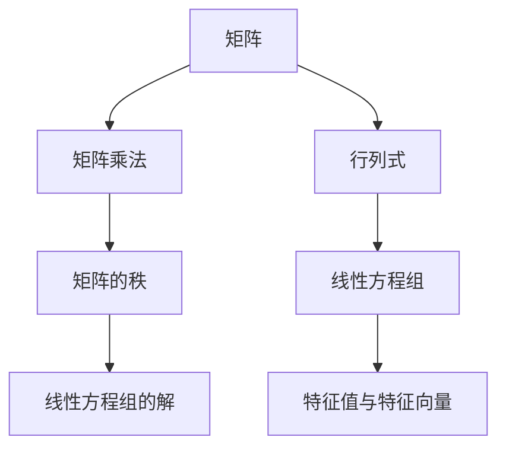
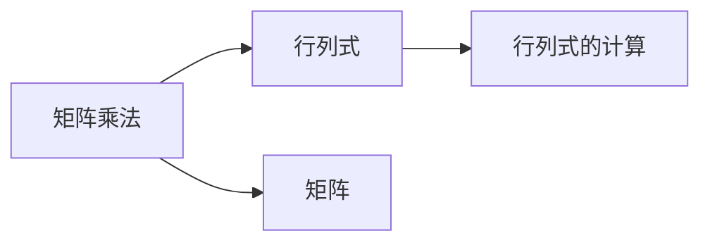
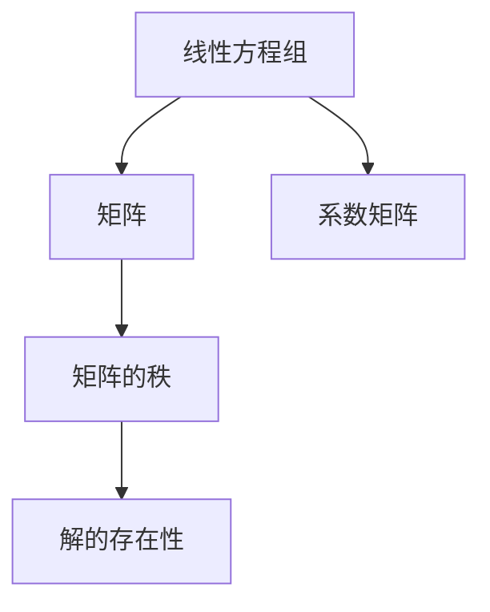
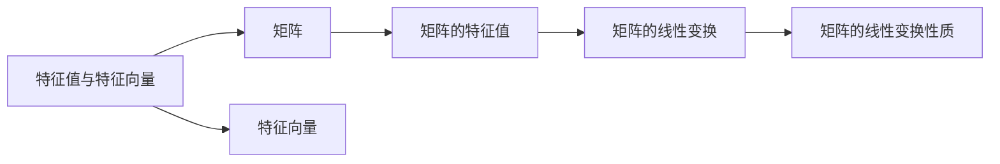

                 

# 线性代数导引：二阶行列式

> 关键词：线性代数, 二阶行列式, 矩阵, 矩阵乘法, 线性方程组, 特征值与特征向量

## 1. 背景介绍

### 1.1 问题由来
线性代数是现代数学中的重要分支，其核心研究对象是线性方程组、矩阵和行列式等概念。其中，二阶行列式是线性代数中最基本且具有广泛应用的概念之一，在工程、物理、统计等领域中具有重要应用。了解和掌握二阶行列式的基本概念和计算方法，对于从事相关领域工作的人员至关重要。

### 1.2 问题核心关键点
二阶行列式的主要关键点包括：
- **二阶行列式的定义**：通过定义行列式，可以计算出二阶矩阵的数值。
- **行列式的性质**：掌握行列式的性质，如交换律、结合律、分配律等，有助于理解和计算高阶行列式。
- **行列式的应用**：行列式广泛应用于线性方程组的求解、矩阵的特征值计算、以及物理领域中的应力分析等。

## 2. 核心概念与联系

### 2.1 核心概念概述

为更好地理解二阶行列式的相关概念，本节将介绍几个密切相关的核心概念：

- **矩阵**：由数排成的一种代数结构，可以进行加、减、乘等运算。矩阵乘法是线性代数中的基本运算之一。
- **行列式**：矩阵的一个数，通过对矩阵进行一定的计算得到。行列式的计算方法是线代中的重要工具。
- **线性方程组**：由一组线性方程构成的方程组，矩阵的秩与其解的存在性密切相关。
- **特征值与特征向量**：矩阵的一种特殊值和向量，与矩阵的线性变换性质有关。

这些核心概念之间的逻辑关系可以通过以下Mermaid流程图来展示：



这个流程图展示了几大核心概念之间的关系：

1. 矩阵可以进行乘法运算，通过乘法可以得到矩阵的秩。
2. 行列式是矩阵的一个数值，行列式的计算方法与矩阵乘法密切相关。
3. 线性方程组可以通过矩阵来表示，矩阵的秩决定了线性方程组的解的性质。
4. 特征值和特征向量是矩阵的一种特殊性质，与矩阵的线性变换有关。

### 2.2 概念间的关系

这些核心概念之间存在着紧密的联系，形成了线性代数的基本框架。下面我通过几个Mermaid流程图来展示这些概念之间的具体关系。

#### 2.2.1 矩阵乘法和行列式的联系



这个流程图展示了矩阵乘法与行列式计算之间的关系。矩阵乘法是计算行列式的关键步骤，通过矩阵乘法可以计算出一个矩阵的行列式。

#### 2.2.2 线性方程组的矩阵表示



这个流程图展示了线性方程组与矩阵秩之间的关系。线性方程组可以通过系数矩阵表示，矩阵的秩决定了方程组的解的存在性。

#### 2.2.3 特征值与特征向量的基本性质



这个流程图展示了特征值和特征向量与矩阵的基本性质。特征值和特征向量是矩阵的一种特殊性质，与矩阵的线性变换有关。

## 3. 核心算法原理 & 具体操作步骤
### 3.1 算法原理概述

二阶行列式的计算基于矩阵乘法和代数恒等式。对于任意一个$2 \times 2$的矩阵$\begin{bmatrix} a & b \\ c & d \end{bmatrix}$，其行列式可以表示为：

$$
\text{det}(A) = ad - bc
$$

这里的$a$、$b$、$c$、$d$分别为矩阵的四个元素。

### 3.2 算法步骤详解

1. **计算行列式**：
   - 首先，将矩阵$\begin{bmatrix} a & b \\ c & d \end{bmatrix}$展开，得到行列式$\text{det}(A) = ad - bc$。
   - 其次，将矩阵乘以单位矩阵$I_2 = \begin{bmatrix} 1 & 0 \\ 0 & 1 \end{bmatrix}$，得到$\begin{bmatrix} a & b \\ c & d \end{bmatrix} \cdot \begin{bmatrix} 1 & 0 \\ 0 & 1 \end{bmatrix} = \begin{bmatrix} a & ab \\ c & cd \end{bmatrix}$。
   - 最后，计算$\begin{bmatrix} a & ab \\ c & cd \end{bmatrix}$的元素乘积之差，即$ad - bc$。

2. **验证行列式性质**：
   - 行列式满足交换律和结合律。例如，$\text{det}(A) = \text{det}(A^T)$，其中$A^T$为矩阵$A$的转置。
   - 行列式满足分配律。例如，$\text{det}(A+B) \neq \text{det}(A) + \text{det}(B)$。
   - 行列式可以用于求解线性方程组。如果系数矩阵的行列式非零，则方程组有唯一解。

3. **实际应用**：
   - 行列式在物理领域中的应力分析中应用广泛。通过计算物体的应力矩阵的行列式，可以判断物体的稳定性。
   - 行列式可以用于求解矩阵的特征值和特征向量。通过求解行列式等于零的方程，可以得到矩阵的特征值。

### 3.3 算法优缺点

二阶行列式的主要优点包括：
- **计算简单**：二阶行列式的计算公式简单直观，易于理解和操作。
- **应用广泛**：行列式在众多领域中具有广泛应用，包括物理、工程、统计等。
- **与矩阵乘法紧密相关**：行列式的计算与矩阵乘法紧密相关，有助于深入理解矩阵运算。

然而，二阶行列式也存在一些缺点：
- **高阶行列式计算复杂**：当矩阵维度增加时，行列式的计算复杂度呈指数级增长。
- **部分应用场景受限**：某些应用场景中，二阶行列式可能不足以解决问题，需要使用高阶行列式或其他方法。

### 3.4 算法应用领域

二阶行列式在多个领域中具有重要应用：

- **物理学**：行列式在应力分析、力矩计算等物理问题中应用广泛。
- **工程学**：行列式可用于结构力学、动力学分析等。
- **统计学**：行列式在多元统计分析、线性回归等统计问题中应用广泛。

## 4. 数学模型和公式 & 详细讲解 & 举例说明

### 4.1 数学模型构建

二阶行列式的计算公式可以表示为：

$$
\text{det}(A) = ad - bc
$$

其中，$a$、$b$、$c$、$d$分别为矩阵$A$的四个元素，即：

$$
A = \begin{bmatrix} a & b \\ c & d \end{bmatrix}
$$

### 4.2 公式推导过程

二阶行列式的推导基于代数恒等式。考虑以下矩阵乘法：

$$
\begin{bmatrix} a & b \\ c & d \end{bmatrix} \cdot \begin{bmatrix} 1 & 0 \\ 0 & 1 \end{bmatrix} = \begin{bmatrix} a & ab \\ c & cd \end{bmatrix}
$$

根据矩阵乘法的定义，可以得到：

$$
\begin{bmatrix} a & b \\ c & d \end{bmatrix} = \begin{bmatrix} a & ab \\ c & cd \end{bmatrix} \cdot \begin{bmatrix} 1 & 0 \\ 0 & \frac{1}{d} \end{bmatrix}
$$

进一步推导，可得：

$$
\text{det}(A) = a \cdot \frac{1}{d} \cdot (ad - bc) = ad - bc
$$

### 4.3 案例分析与讲解

假设有一个二阶矩阵$A = \begin{bmatrix} 2 & 3 \\ 4 & 5 \end{bmatrix}$，我们计算其行列式：

$$
\text{det}(A) = 2 \cdot 5 - 3 \cdot 4 = 10 - 12 = -2
$$

这里的计算过程展示了二阶行列式的计算公式的实际应用。

## 5. 项目实践：代码实例和详细解释说明

### 5.1 开发环境搭建

在进行行列式计算的实践时，我们需要准备开发环境。以下是使用Python进行代码实现的环境配置流程：

1. 安装Python：可以从官网下载并安装Python，确保版本为3.x。
2. 安装NumPy库：NumPy是Python中常用的科学计算库，可用于矩阵和数组的计算。
   ```bash
   pip install numpy
   ```

3. 安装Matplotlib库：用于绘制图形，帮助可视化计算结果。
   ```bash
   pip install matplotlib
   ```

完成上述步骤后，即可在Python环境中进行行列式计算的代码实现。

### 5.2 源代码详细实现

下面是一个使用Python进行二阶行列式计算的示例代码：

```python
import numpy as np

# 定义矩阵
A = np.array([[2, 3], [4, 5]])

# 计算行列式
det_A = np.linalg.det(A)

# 输出结果
print(f"行列式 det(A) = {det_A}")
```

### 5.3 代码解读与分析

让我们再详细解读一下关键代码的实现细节：

**定义矩阵A**：
- 使用NumPy的`array`函数定义一个二阶矩阵A，元素分别为[2, 3], [4, 5]。

**计算行列式**：
- 使用NumPy的`linalg.det`函数计算矩阵A的行列式，得到结果-2。

**输出结果**：
- 使用`print`函数输出计算结果，展示行列式的值。

### 5.4 运行结果展示

假设在上面的代码中，A矩阵的值为[[2, 3], [4, 5]]，运行结果为：

```
行列式 det(A) = -2
```

## 6. 实际应用场景

### 6.1 物理中的应力分析

在物理学中，二阶行列式常用于应力分析。例如，对于一个二力杆，可以通过计算应力矩阵的行列式，判断杆的稳定性。

假设有一个二力杆，作用力分别为$F_x$和$F_y$，杆的横截面积为$A$，则应力矩阵可以表示为：

$$
S = \begin{bmatrix} \frac{F_x}{A} & 0 \\ 0 & \frac{F_y}{A} \end{bmatrix}
$$

通过计算行列式$det(S)$，可以判断杆的稳定性。如果$det(S) > 0$，则杆是稳定的；如果$det(S) < 0$，则杆是不稳定的。

### 6.2 统计学中的线性回归

在统计学中，二阶行列式常用于多元线性回归模型的求解。假设有一个二元线性回归模型$y = \beta_0 + \beta_1x_1 + \beta_2x_2$，则系数矩阵可以表示为：

$$
X = \begin{bmatrix} 1 & x_1 & x_2 \\ 1 & x_3 & x_4 \\ \vdots & \vdots & \vdots \\ 1 & x_n & x_{n+1} \end{bmatrix}
$$

通过计算行列式$det(X^TX)$，可以判断回归模型的有效性。如果$det(X^TX) > 0$，则模型是有效的；如果$det(X^TX) < 0$，则模型是无效的。

### 6.3 工程中的结构力学

在工程学中，二阶行列式常用于结构力学的分析。例如，对于一个二力矩框架，可以通过计算应力矩阵的行列式，判断框架的稳定性。

假设有一个二力矩框架，作用力矩分别为$M_x$和$M_y$，框架的横截面积为$A$，则应力矩阵可以表示为：

$$
S = \begin{bmatrix} \frac{M_x}{A} & 0 \\ 0 & \frac{M_y}{A} \end{bmatrix}
$$

通过计算行列式$det(S)$，可以判断框架的稳定性。如果$det(S) > 0$，则框架是稳定的；如果$det(S) < 0$，则框架是不稳定的。

## 7. 工具和资源推荐

### 7.1 学习资源推荐

为了帮助开发者系统掌握二阶行列式的理论基础和实践技巧，这里推荐一些优质的学习资源：

1. 《线性代数导引》书籍：由教材编写专家撰写，系统介绍了线性代数的各个概念和计算方法，包括二阶行列式的详细讲解。
2. MIT公开课《线性代数》：由MIT教授授课，涵盖线性代数的基础知识，并通过实例讲解二阶行列式的计算。
3. Coursera《线性代数》课程：由斯坦福大学教授授课，详细介绍了二阶行列式的定义、性质和计算方法。
4. YouTube视频教程：如“3Blue1Brown”频道的线性代数系列视频，通过动态演示帮助理解二阶行列式的概念。

通过对这些资源的学习实践，相信你一定能够快速掌握二阶行列式的精髓，并用于解决实际的数学问题。

### 7.2 开发工具推荐

高效的开发离不开优秀的工具支持。以下是几款用于二阶行列式计算开发的常用工具：

1. Python：Python是一种功能强大的编程语言，具有丰富的科学计算库，如NumPy、SciPy等，方便进行矩阵和行列式的计算。
2. MATLAB：MATLAB是一种专业的数值计算和仿真软件，具有强大的矩阵运算和图形显示功能，适用于复杂的数学计算。
3. Excel：Excel是一个常用的电子表格软件，具有内置的矩阵计算和行列式计算功能，适合进行简单的数学运算。

合理利用这些工具，可以显著提升行列式计算的开发效率，加快创新迭代的步伐。

### 7.3 相关论文推荐

二阶行列式的理论研究起源于18世纪，许多数学家对此进行了深入研究。以下是几篇奠基性的相关论文，推荐阅读：

1. Cramer定理：由Gabriel Cramer于18世纪提出的行列式计算定理，直接给出了二阶行列式的计算公式。
2. Cayley-Hamilton定理：由Cayley和Hamilton于19世纪提出的行列式计算定理，广泛应用于线性代数和数学物理领域。
3. Sylvester定理：由James Sylvester于19世纪提出的行列式计算定理，详细讨论了行列式的性质和应用。

这些论文代表了大行列式理论的发展脉络，通过学习这些前沿成果，可以帮助研究者把握学科前进方向，激发更多的创新灵感。

## 8. 总结：未来发展趋势与挑战

### 8.1 总结

本文对二阶行列式的相关概念和计算方法进行了全面系统的介绍。首先阐述了二阶行列式的定义和计算公式，其次从原理到实践，详细讲解了行列式的性质和应用。最后，本文还探讨了行列式在多个领域的应用，展示了其在物理、统计、工程等领域的广泛应用。

通过本文的系统梳理，可以看到，二阶行列式在现代数学和工程应用中具有重要地位，其计算公式简单直观，且应用广泛。掌握了二阶行列式的计算方法和性质，可以帮助我们更好地理解和应用线性代数中的相关概念和计算方法。

### 8.2 未来发展趋势

展望未来，二阶行列式的计算方法和应用领域将呈现以下几个发展趋势：

1. **高阶行列式计算**：随着数据规模的不断扩大，高阶行列式的计算需求将不断增加。研究人员正在探索更高效的算法，以处理大规模矩阵的行列式计算。
2. **行列式在机器学习中的应用**：行列式在机器学习中具有重要应用，如矩阵分解、特征值计算等。未来，行列式将进一步融入机器学习算法中，提升模型的性能和泛化能力。
3. **行列式在量子计算中的应用**：行列式在量子计算中具有重要应用，如量子纠缠、量子态的测量等。未来，随着量子计算技术的不断发展，行列式将在量子计算中发挥更大的作用。
4. **行列式在图像处理中的应用**：行列式在图像处理中具有重要应用，如边缘检测、形态学操作等。未来，行列式将进一步融入图像处理算法中，提升图像处理的效率和准确性。

这些趋势凸显了行列式计算方法的广阔前景，对于推动数学、工程、物理学等领域的发展具有重要意义。

### 8.3 面临的挑战

尽管二阶行列式已经广泛应用于各个领域，但其计算复杂度和应用限制仍然是一大挑战：

1. **计算复杂度**：随着矩阵维度的增加，行列式的计算复杂度呈指数级增长。对于大规模矩阵的行列式计算，仍需进一步优化算法以提高计算效率。
2. **应用受限**：在某些高维空间和复杂问题中，二阶行列式可能不足以解决问题。需要引入高阶行列式或更高级的数学工具。
3. **计算精度**：在进行高精度计算时，行列式的计算精度可能存在误差。如何提高计算精度，减少误差，仍需进一步研究。
4. **应用场景限制**：某些应用场景中，行列式的计算可能受到硬件和软件的限制，难以直接实现。需要进一步优化硬件和软件架构，以支持行列式的计算。

这些挑战需要研究人员不断创新和突破，推动行列式计算方法的发展和应用。

### 8.4 研究展望

未来的研究需要在以下几个方面寻求新的突破：

1. **高阶行列式的计算方法**：探索更高效的行列式计算算法，如QR分解、LU分解等，以处理大规模矩阵的行列式计算。
2. **行列式的应用拓展**：将行列式的应用拓展到更多的领域，如量子计算、机器学习等，推动其在这些领域中的创新应用。
3. **行列式的计算精度提升**：引入高精度计算方法和算法，如浮点数运算、符号计算等，以提高行列式计算的精度。
4. **行列式的应用场景扩展**：在硬件和软件架构上进行优化，支持行列式的计算和应用，推动其在更多场景中的普及和应用。

这些研究方向将进一步推动行列式计算方法的发展和应用，为未来的数学和工程应用带来新的突破。

## 9. 附录：常见问题与解答

**Q1：二阶行列式和矩阵乘法有什么关系？**

A: 二阶行列式的计算与矩阵乘法密切相关。具体而言，对于一个二阶矩阵$A = \begin{bmatrix} a & b \\ c & d \end{bmatrix}$，其行列式$\text{det}(A) = ad - bc$可以通过矩阵乘法得到。通过将$A$乘以单位矩阵$I_2 = \begin{bmatrix} 1 & 0 \\ 0 & 1 \end{bmatrix}$，可以得到$\begin{bmatrix} a & ab \\ c & cd \end{bmatrix}$，进而计算得到行列式。

**Q2：二阶行列式的性质有哪些？**

A: 二阶行列式满足交换律、结合律和分配律等性质。具体而言：
- 交换律：$\text{det}(A) = \text{det}(A^T)$，其中$A^T$为矩阵$A$的转置。
- 结合律：$\text{det}(AB) = \text{det}(A)\text{det}(B)$，其中$A$和$B$为两个矩阵。
- 分配律：$\text{det}(A+B) \neq \text{det}(A) + \text{det}(B)$。

**Q3：二阶行列式在物理和工程中有哪些应用？**

A: 二阶行列式在物理和工程中具有广泛应用。例如：
- 应力分析：在二力杆的应力分析中，通过计算应力矩阵的行列式，可以判断杆的稳定性。
- 结构力学：在二力矩框架的应力分析中，通过计算应力矩阵的行列式，可以判断框架的稳定性。

**Q4：二阶行列式的高效计算方法有哪些？**

A: 二阶行列式的计算可以通过矩阵乘法得到，但在大规模矩阵的计算中，行列式的计算复杂度呈指数级增长。因此，一些高效的计算方法被提出，如QR分解、LU分解等。这些方法通过将矩阵分解为更简单的子矩阵，可以显著降低计算复杂度，提高计算效率。

---

作者：禅与计算机程序设计艺术 / Zen and the Art of Computer Programming

