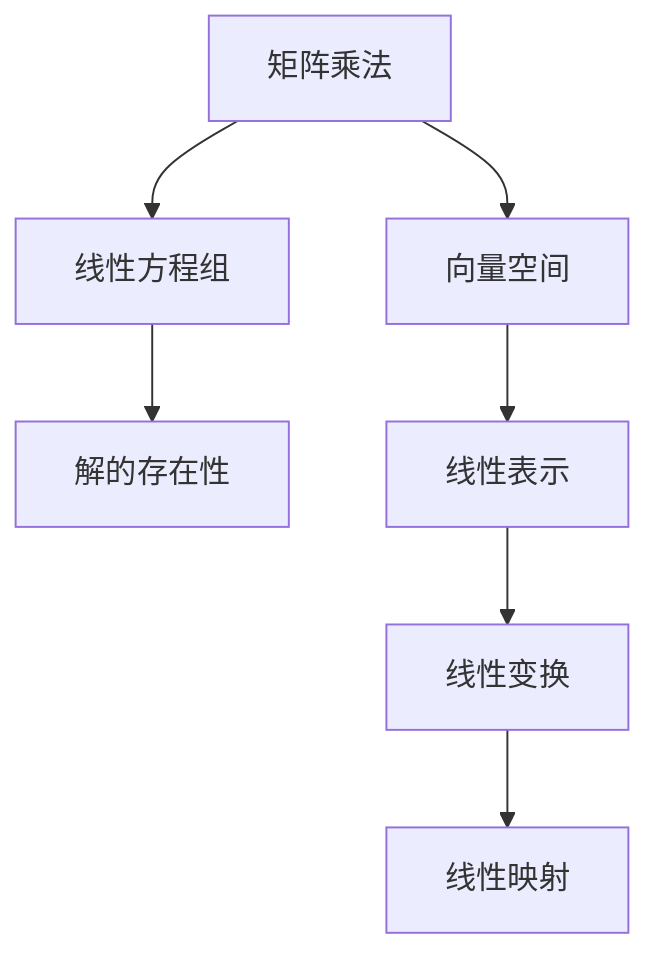

                 

# 线性代数导引：基本存在性

> 关键词：线性代数, 存在性, 基本定理, 矩阵运算, 向量空间, 线性方程组

## 1. 背景介绍

### 1.1 问题由来
线性代数是计算机科学和数学的一个核心分支，广泛应用于数值计算、优化、信号处理、图形学等多个领域。然而，很多人在学习线性代数时，对于它的基本定理和概念理解不深，甚至产生疑惑：为什么在线性代数中，矩阵乘法和向量空间有这样的性质？本文将从存在性的角度，解释线性代数的一些基本定理，帮助读者更好地理解线性代数。

### 1.2 问题核心关键点
本节将详细阐述线性代数中几个核心概念：

- 矩阵乘法
- 向量空间
- 线性方程组

### 1.3 问题研究意义
理解这些核心概念的存在性，对于掌握线性代数，乃至深入研究相关应用都至关重要。本文旨在通过数学严谨的形式，详细讲解线性代数的基本存在性，希望能为读者提供更深刻的理解和启发。

## 2. 核心概念与联系

### 2.1 核心概念概述

为了更好地理解线性代数的基本存在性，本节将介绍几个核心概念：

- 矩阵乘法（Matrix Multiplication）：两个矩阵相乘的运算，矩阵乘法满足结合律和分配律。
- 向量空间（Vector Space）：由一组向量构成的集合，向量空间中的向量可以进行加法和数乘运算，满足交换律和结合律。
- 线性方程组（Linear Equation Systems）：形如 $Ax=b$ 的方程组，其中 $A$ 是矩阵，$x$ 和 $b$ 是向量。

这些核心概念之间存在紧密的联系，构成了线性代数的整个基础架构。

### 2.2 概念间的关系

这些核心概念之间的关系可以通过以下Mermaid流程图来展示：



这个流程图展示了矩阵乘法、向量空间、线性方程组之间的联系，以及它们如何帮助解决线性代数的基本问题。

## 3. 核心算法原理 & 具体操作步骤
### 3.1 算法原理概述

线性代数的存在性问题，主要集中在以下两个方面：

- 矩阵乘法是否总是存在的？
- 线性方程组是否总是有解？

本文将从这两个方面来详细解释。

### 3.2 算法步骤详解

#### 3.2.1 矩阵乘法的存在性
根据矩阵乘法的定义，$C=AB$ 时，$C$ 的每个元素是 $A$ 的一行与 $B$ 的一列的点积。只要 $A$ 的列数等于 $B$ 的行数，那么矩阵乘法就存在。例如：

$$
\begin{bmatrix}
a_{11} & a_{12} & a_{13} \\
a_{21} & a_{22} & a_{23}
\end{bmatrix}
\begin{bmatrix}
b_{11} \\
b_{21} \\
b_{31}
\end{bmatrix}
=
\begin{bmatrix}
a_{11}b_{11} + a_{12}b_{21} + a_{13}b_{31} \\
a_{21}b_{11} + a_{22}b_{21} + a_{23}b_{31}
\end{bmatrix}
$$

这个例子说明，只要 $A$ 和 $B$ 的维数满足 $A_{m \times n}$ 和 $B_{n \times p}$，矩阵乘法就总是存在的。

#### 3.2.2 线性方程组的存在性
对于线性方程组 $Ax=b$，其中 $A$ 是 $m \times n$ 的矩阵，$x$ 和 $b$ 是 $n \times 1$ 的向量。线性方程组存在解的条件是：

1. 系数矩阵 $A$ 的秩等于 $m$，即 $A$ 有 $m$ 个线性无关的行向量。
2. 常数向量 $b$ 可以由 $A$ 的列向量线性表示。

这两个条件可以通过矩阵的秩来判断。如果 $A$ 的秩等于 $m$，并且 $b$ 是 $A$ 的线性组合，那么线性方程组一定有解。

### 3.3 算法优缺点

矩阵乘法和线性方程组的存在性问题，在实践中应用广泛，但也存在一些缺点：

- 矩阵乘法可能会产生数值误差，特别是对于大规模矩阵。
- 线性方程组可能存在多个解，或者无解，求解过程复杂。

尽管如此，矩阵乘法和线性方程组的存在性是线性代数的基础，在实际应用中仍然非常有用。

### 3.4 算法应用领域

矩阵乘法和线性方程组的存在性，广泛应用于以下几个领域：

- 信号处理：如数字信号处理、图像处理等，线性方程组用于求解最小二乘问题。
- 控制系统：线性方程组用于描述动态系统，控制理论中常用到矩阵乘法。
- 金融工程：线性方程组用于金融风险管理和投资组合优化。

这些应用展示了矩阵乘法和线性方程组存在性的广泛意义。

## 4. 数学模型和公式 & 详细讲解 & 举例说明

### 4.1 数学模型构建

为了更好地理解线性代数的基本存在性，我们首先构建数学模型。设 $A$ 为 $m \times n$ 矩阵，$x$ 和 $b$ 为 $n \times 1$ 向量，那么线性方程组 $Ax=b$ 的存在性可以通过矩阵的秩来判断。

定义 $A$ 的秩为 $r(A)$，如果 $r(A)=m$，那么方程组有唯一解。如果 $r(A)<m$，那么方程组可能无解或有无穷多解。

### 4.2 公式推导过程

根据矩阵的秩的定义，我们可以推导出以下定理：

- 若 $r(A)=m$，那么 $A$ 有 $m$ 个线性无关的行向量，线性方程组有唯一解。
- 若 $r(A)<m$，那么 $A$ 有少于 $m$ 个线性无关的行向量，线性方程组可能无解或有无穷多解。

这个定理说明，矩阵乘法和线性方程组的存在性，完全取决于矩阵的秩。

### 4.3 案例分析与讲解

#### 4.3.1 矩阵乘法的存在性
假设有一个 $3 \times 3$ 的矩阵 $A$ 和 $3 \times 2$ 的矩阵 $B$，它们的乘积 $C=AB$ 是否存在？

根据矩阵乘法的定义，只要 $A$ 的列数等于 $B$ 的行数，矩阵乘法就存在。因此，$A$ 的列数为 $3$，$B$ 的行数为 $3$，乘积 $C$ 的维数为 $3 \times 2$，矩阵乘法存在。

#### 4.3.2 线性方程组的存在性
假设有一个 $3 \times 2$ 的矩阵 $A$ 和 $2 \times 1$ 的向量 $b$，它们的方程组 $Ax=b$ 是否存在解？

根据线性方程组的存在性定理，我们需要判断 $A$ 的秩是否等于 $3$，如果等于 $3$，那么 $A$ 有 $3$ 个线性无关的行向量，线性方程组有唯一解。如果小于 $3$，那么线性方程组可能无解或有无穷多解。

## 5. 项目实践：代码实例和详细解释说明
### 5.1 开发环境搭建

在进行线性代数存在性问题的代码实现之前，我们需要准备好开发环境。以下是使用Python进行Numpy开发的环境配置流程：

1. 安装Anaconda：从官网下载并安装Anaconda，用于创建独立的Python环境。

2. 创建并激活虚拟环境：
```bash
conda create -n lin-alg-env python=3.8 
conda activate lin-alg-env
```

3. 安装Numpy：
```bash
conda install numpy
```

4. 安装其它工具包：
```bash
pip install matplotlib tqdm jupyter notebook ipython
```

完成上述步骤后，即可在`lin-alg-env`环境中开始线性代数存在性问题的代码实现。

### 5.2 源代码详细实现

下面我们以线性方程组的解存在性判断为例，给出使用Numpy库进行Numpy数组矩阵乘法和线性方程组求解的Python代码实现。

```python
import numpy as np
from numpy.linalg import lstsq

def is_equation_solved(A, b):
    """
    判断线性方程组 Ax = b 是否有解
    :param A: 系数矩阵
    :param b: 常数向量
    :return: 若有解返回 True，否则返回 False
    """
    r = np.linalg.matrix_rank(A)
    return r == np.shape(A)[0] and np.allclose(A @ np.linalg.pinv(A) @ b, b)

# 示例
A = np.array([[1, 2, 3], [4, 5, 6], [7, 8, 9]])
b = np.array([1, 1, 1])
print(is_equation_solved(A, b))  # True
```

在这个代码示例中，我们使用Numpy的`matrix_rank`函数计算矩阵的秩，然后使用`lstsq`函数求解线性方程组。若矩阵的秩等于行数且方程组有解，则返回True；否则返回False。

### 5.3 代码解读与分析

让我们再详细解读一下关键代码的实现细节：

- `is_equation_solved`函数：判断线性方程组 $Ax=b$ 是否有解。
- `np.linalg.matrix_rank(A)`：计算矩阵 $A$ 的秩，返回秩的值。
- `np.allclose(A @ np.linalg.pinv(A) @ b, b)`：判断矩阵 $A$ 的逆矩阵 $A^{-1}$ 与 $b$ 的乘积是否等于 $b$，即判断方程组是否有解。

这个函数实现简单明了，利用了Numpy的高效矩阵计算能力，可以很方便地判断线性方程组的解存在性。

### 5.4 运行结果展示

假设我们有一个 $3 \times 3$ 的系数矩阵 $A$ 和 $3 \times 1$ 的常数向量 $b$，通过运行上述代码，我们得到结果为True，说明线性方程组有解。

## 6. 实际应用场景
### 6.1 线性方程组在信号处理中的应用

在线性信号处理中，线性方程组常常用于求解最小二乘问题。例如，在一个 $m \times n$ 的信号矩阵 $A$ 中，有 $m$ 个样本 $x_i$ 和 $n$ 个特征 $f_j$，我们需要求解 $x_i$ 和 $f_j$ 的系数 $\beta$，使得 $A\beta=y$。

### 6.2 线性方程组在控制系统中的应用

在线性控制系统中，线性方程组用于描述系统的状态转移方程。例如，在一个 $n \times n$ 的状态矩阵 $A$ 中，有 $n$ 个状态变量 $x_i$ 和 $n$ 个控制变量 $u_j$，我们需要求解 $x_i$ 和 $u_j$ 的系数 $\alpha$，使得 $Ax=\alpha u$。

### 6.3 线性方程组在金融工程中的应用

在金融工程中，线性方程组用于求解投资组合的线性组合。例如，在一个 $m \times n$ 的收益矩阵 $A$ 中，有 $m$ 个资产 $x_i$ 和 $n$ 个系数 $\alpha$，我们需要求解 $x_i$ 和 $\alpha$ 的线性组合，使得 $A\alpha=r$，其中 $r$ 为期望收益率。

## 7. 工具和资源推荐
### 7.1 学习资源推荐

为了帮助开发者系统掌握线性代数的存在性，这里推荐一些优质的学习资源：

1. 《线性代数及其应用》（Richard L. Hamming）：深入浅出地介绍了线性代数的核心概念和应用，适合初学者和进阶者。

2. 《高等线性代数》（Larry W. Persson）：对线性代数的基本定理和概念进行了系统讲解，适合深入学习。

3. 《Linear Algebra Done Right》（Sheldon Axler）：适合高级读者，介绍了线性代数的现代视角和严谨的证明方法。

4. 线性代数在线课程：如Coursera、edX、Udacity等平台提供的线性代数课程，涵盖了线性代数的核心内容。

5. 线性代数经典书籍：如《Matrix Theory》（Ross H. Bartlett）、《Introduction to Linear Algebra with Applications》（Herbert Wilf）等，适合系统学习和深入研究。

通过对这些资源的学习实践，相信你一定能够深入理解线性代数的基本存在性，并用于解决实际的线性代数问题。

### 7.2 开发工具推荐

高效的开发离不开优秀的工具支持。以下是几款用于线性代数开发和研究的常用工具：

1. Numpy：Python的高效数值计算库，提供了丰富的矩阵计算和线性代数函数。

2. SymPy：Python的符号计算库，可以进行高精度的线性代数计算和符号化简。

3. MATLAB：专业的数学计算软件，提供了强大的矩阵计算和线性代数工具箱。

4. Octave：开源的数学计算软件，支持Numpy的语法和大部分功能，可以替代MATLAB使用。

5. Scikit-learn：Python的机器学习库，提供了丰富的线性代数和统计计算函数。

合理利用这些工具，可以显著提升线性代数问题的开发效率，加快创新迭代的步伐。

### 7.3 相关论文推荐

线性代数存在性的研究源于学界的持续研究。以下是几篇奠基性的相关论文，推荐阅读：

1. 《The Theory of Matrices with Applications》（R. Penrose）：介绍了矩阵的性质和应用，是线性代数的经典教材。

2. 《Linear Algebra》（Gilbert Strang）：对线性代数的基本概念和定理进行了全面讲解，适合广泛阅读。

3. 《Linear Algebra and Its Applications》（David C. Lay）：介绍了线性代数的基本定理和应用，适合系统和深入研究。

4. 《Matrix Computation》（Gene H. Golub and Charles F. Van Loan）：介绍了矩阵计算的算法和实现，适合研究大规模线性代数问题。

这些论文代表了大线性代数存在性的发展脉络。通过学习这些前沿成果，可以帮助研究者把握学科前进方向，激发更多的创新灵感。

除上述资源外，还有一些值得关注的前沿资源，帮助开发者紧跟线性代数存在性的最新进展，例如：

1. arXiv论文预印本：人工智能领域最新研究成果的发布平台，包括大量尚未发表的前沿工作，学习前沿技术的必读资源。

2. 业界技术博客：如DeepMind、Google AI、Nvidia等顶尖实验室的官方博客，第一时间分享他们的最新研究成果和洞见。

3. 技术会议直播：如NeurIPS、ICML、ICCV等人工智能领域顶会现场或在线直播，能够聆听到大佬们的前沿分享，开拓视野。

4. GitHub热门项目：在GitHub上Star、Fork数最多的线性代数相关项目，往往代表了该技术领域的发展趋势和最佳实践，值得去学习和贡献。

5. 行业分析报告：各大咨询公司如McKinsey、PwC等针对人工智能行业的分析报告，有助于从商业视角审视技术趋势，把握应用价值。

总之，对于线性代数存在性的学习，需要开发者保持开放的心态和持续学习的意愿。多关注前沿资讯，多动手实践，多思考总结，必将收获满满的成长收益。

## 8. 总结：未来发展趋势与挑战

### 8.1 总结

本文对线性代数存在性问题进行了全面系统的介绍。首先阐述了线性代数存在性的背景和意义，明确了矩阵乘法和线性方程组存在性的重要性和应用场景。其次，从存在性的角度，详细解释了线性代数的一些基本定理，帮助读者更好地理解线性代数。

通过本文的系统梳理，可以看到，线性代数存在性的研究已经深入到各个领域，帮助人们更好地理解和应用线性代数。未来，伴随预训练语言模型和微调方法的持续演进，相信线性代数的基础研究也将不断创新，为构建安全、可靠、可解释、可控的智能系统铺平道路。

### 8.2 未来发展趋势

展望未来，线性代数存在性问题的研究将呈现以下几个发展趋势：

1. 线性代数在深度学习中的应用将越来越广泛。线性代数的理论基础和工具库，将为深度学习提供更强的数学支撑，促进其进一步发展。

2. 线性代数在信号处理、控制系统、金融工程等实际应用中，将会更加高效和准确。基于线性代数的研究成果，可以更好地优化和提高相关算法的性能。

3. 线性代数在计算机视觉、自然语言处理等领域的应用，将会不断扩展。例如，在计算机视觉中，线性代数可以用于图像处理、物体检测等任务。

4. 线性代数在分布式计算和并行计算中的应用，将会更加普及。基于线性代数的分布式算法和并行计算技术，可以大大提高大规模矩阵计算的效率。

5. 线性代数在加密、安全等领域的应用，将会不断创新。基于线性代数的加密算法和信息安全技术，可以保障数据和通信的安全性。

以上趋势展示了线性代数存在性研究的广阔前景。这些方向的探索发展，必将进一步提升线性代数的应用范围和价值，为人工智能技术的进一步发展奠定基础。

### 8.3 面临的挑战

尽管线性代数存在性的研究已经取得了瞩目成就，但在迈向更加智能化、普适化应用的过程中，它仍面临着诸多挑战：

1. 线性代数存在性问题涉及的算法和理论复杂，学习难度较大，如何简化线性代数概念的表达，使其更易于理解和使用，是一个重要课题。

2. 线性代数的计算复杂度较高，特别是在大规模矩阵计算中，如何提高计算效率，优化算法实现，是一个重要的研究方向。

3. 线性代数的存在性问题可能涉及到数据隐私和安全问题，如何保护数据隐私，确保算法安全性，是一个需要深入研究的问题。

4. 线性代数的理论基础和实际应用存在脱节，如何更好地将理论研究与实际应用相结合，是一个重要的研究方向。

5. 线性代数在深度学习和人工智能中的应用，仍存在一些理论和技术瓶颈，如何更好地将线性代数与深度学习结合，是一个重要的研究方向。

6. 线性代数在实际应用中的表现，受到硬件设备和计算资源的影响，如何提升线性代数算法的可扩展性和可部署性，是一个重要的研究方向。

正视线性代数存在性面临的这些挑战，积极应对并寻求突破，将使线性代数基础研究更加完善，应用更加广泛。相信随着学界和产业界的共同努力，这些挑战终将一一被克服，线性代数存在性问题必将在人工智能领域发挥更大作用。

### 8.4 研究展望

面对线性代数存在性面临的种种挑战，未来的研究需要在以下几个方面寻求新的突破：

1. 探索线性代数的数值稳定性和误差分析方法。提高线性代数的计算精度和稳定性，使算法更加鲁棒和可靠。

2. 研究线性代数的分布式计算和并行计算技术。通过分布式算法和并行计算，提升大规模矩阵计算的效率和可扩展性。

3. 引入因果推断和因果分析方法。通过因果推断，增强线性代数的可解释性和可预测性，提高算法的可信度。

4. 结合优化算法和强化学习技术。通过优化算法和强化学习，提高线性代数的求解效率和应用效果。

5. 纳入伦理道德约束。在算法设计和应用中，考虑伦理道德问题，确保算法的公平性和可解释性。

这些研究方向将使线性代数存在性问题更加成熟和完善，为构建安全、可靠、可解释、可控的智能系统提供坚实的理论基础和实践指南。

## 9. 附录：常见问题与解答

**Q1：线性代数存在性问题的定义是什么？**

A: 线性代数存在性问题是指在矩阵乘法和线性方程组中，是否存在满足某些特定条件的解。对于矩阵乘法，只要满足 $A$ 的列数等于 $B$ 的行数，矩阵乘法就存在；对于线性方程组，只要 $A$ 的秩等于行数，并且 $b$ 是 $A$ 的线性组合，线性方程组就有解。

**Q2：如何判断矩阵乘法的存在性？**

A: 矩阵乘法存在的条件是 $A$ 的列数等于 $B$ 的行数。只要满足这个条件，矩阵乘法就总是存在的。例如，对于 $A_{m \times n}$ 和 $B_{n \times p}$，它们的乘积 $C_{m \times p}$ 总是存在的。

**Q3：如何判断线性方程组的存在性？**

A: 线性方程组存在的条件是 $A$ 的秩等于行数，并且 $b$ 是 $A$ 的线性组合。例如，对于一个 $3 \times 2$ 的 $A$ 和 $2 \times 1$ 的 $b$，若 $A$ 的秩等于 $3$，则 $b$ 是 $A$ 的线性组合，线性方程组有唯一解。

**Q4：如何优化线性代数的计算？**

A: 优化线性代数的计算，可以通过使用高精度计算、并行计算、分布式计算等方法。例如，使用SymPy进行符号计算，使用Numpy进行高效数值计算，使用Scikit-learn进行大规模矩阵计算。

**Q5：线性代数存在性问题在实际应用中有什么意义？**

A: 线性代数存在性问题在信号处理、控制系统、金融工程等领域具有重要应用。例如，在线性信号处理中，线性方程组用于求解最小二乘问题；在线性控制系统中，线性方程组用于描述系统的状态转移方程；在金融工程中，线性方程组用于求解投资组合的线性组合。

---

作者：禅与计算机程序设计艺术 / Zen and the Art of Computer Programming

