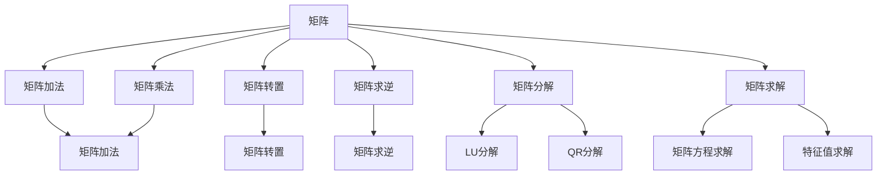

                 

# 线性代数导引：标准计算矩阵

> 关键词：线性代数,矩阵运算,标准计算,矩阵变换,矩阵分解,矩阵乘法,矩阵求解

## 1. 背景介绍

### 1.1 问题由来

线性代数是计算机科学中最重要的数学工具之一，广泛应用于图像处理、机器学习、数据科学、物理学等多个领域。矩阵是线性代数的核心对象，通过矩阵运算可以实现数据的变换、求解、分解等多种计算。然而，在实际应用中，矩阵运算常常会遇到精度、计算复杂度、计算速度等问题。因此，如何高效、精确地进行矩阵计算，成为了一个重要课题。

本文将从线性代数的核心概念——矩阵出发，通过实际应用案例，详细讲解标准计算矩阵的方法和技巧。我们不仅会介绍矩阵的加法、乘法等基本运算，还会探讨矩阵分解、矩阵求解等高级计算方法。通过这些讲解，希望能帮助读者更好地理解和掌握矩阵的计算技巧，在实际应用中避免常见问题，提升矩阵计算的效率和精度。

### 1.2 问题核心关键点

本文的核心是介绍标准计算矩阵的方法和技巧，主要关注以下几个方面：

- 矩阵加法和乘法的基本运算规则
- 矩阵的分解和重构方法
- 矩阵求解与逆矩阵的应用
- 矩阵的奇异值分解和QR分解
- 矩阵的LAPACK实现与优化

这些核心内容将帮助读者掌握矩阵计算的基础和高级技巧，提升矩阵计算的效率和精度，为实际应用提供有力的支持。

## 2. 核心概念与联系

### 2.1 核心概念概述

在开始讲解标准计算矩阵之前，我们需要先了解一些核心概念：

- **矩阵**：二维数组，通常用 $A_{m \times n}$ 表示，其中 $m$ 和 $n$ 分别为矩阵的行数和列数。
- **矩阵运算**：包括矩阵加法、矩阵乘法、矩阵转置、矩阵求逆等操作。
- **矩阵分解**：将矩阵分解成更易处理的子矩阵，如LU分解、QR分解、奇异值分解等。
- **矩阵求解**：通过矩阵运算求解线性方程组或矩阵方程，如矩阵的秩、逆矩阵、特征值和特征向量等。

这些概念是线性代数的基础，也是标准计算矩阵的核心。

### 2.2 概念间的关系

矩阵计算的核心在于矩阵的运算和变换。通过这些基本运算和变换，可以实现数据的加工、处理和分析。下面我们将通过一个简单的例子，展示这些核心概念之间的关系：



这个图表展示了矩阵计算的基本流程和常用操作。矩阵通过加法、乘法等基本运算进行变换，再通过转置、求逆等变换进行进一步处理。最终，矩阵还可以进行分解和求解，实现更复杂的计算和分析。

## 3. 核心算法原理 & 具体操作步骤

### 3.1 算法原理概述

标准计算矩阵的算法原理主要基于线性代数的核心概念和方法，包括矩阵的加法、乘法、转置、求逆、分解和求解等。这些操作在计算机中通常通过矩阵的数值表示和运算规则来实现。

矩阵的加法、乘法和转置等基本运算，可以通过直接计算得到。矩阵的求逆、分解和求解等高级运算，则需要通过矩阵的奇异值分解、QR分解、LU分解等方法进行。这些方法的实现通常依赖于数值计算库，如LAPACK等，这些库提供了高效的矩阵计算功能。

### 3.2 算法步骤详解

下面我们将详细介绍矩阵的加法、乘法、转置、求逆、分解和求解等基本和高级计算方法的步骤和实现细节。

#### 3.2.1 矩阵加法

矩阵加法满足交换律和结合律，即 $A + B = B + A$ 和 $(A + B) + C = A + (B + C)$。

**步骤：**
1. 确保两个矩阵的行数和列数相同。
2. 对应位置的元素相加。

**示例：**

$$
A = \begin{bmatrix}
    1 & 2 \\
    3 & 4 
\end{bmatrix}
, B = \begin{bmatrix}
    5 & 6 \\
    7 & 8 
\end{bmatrix}
$$

$$
A + B = \begin{bmatrix}
    1 & 2 \\
    3 & 4 
\end{bmatrix}
+ 
\begin{bmatrix}
    5 & 6 \\
    7 & 8 
\end{bmatrix}
=
\begin{bmatrix}
    6 & 8 \\
    10 & 12 
\end{bmatrix}
$$

#### 3.2.2 矩阵乘法

矩阵乘法需要满足以下条件：左矩阵的列数等于右矩阵的行数。

**步骤：**
1. 初始化结果矩阵 $C_{m \times n}$。
2. 对于 $C_{ij}$，计算 $\sum_{k=1}^{n}A_{ik}B_{kj}$。

**示例：**

$$
A = \begin{bmatrix}
    1 & 2 \\
    3 & 4 
\end{bmatrix}
, B = \begin{bmatrix}
    5 & 6 \\
    7 & 8 
\end{bmatrix}
$$

$$
C = A \times B = \begin{bmatrix}
    1 & 2 \\
    3 & 4 
\end{bmatrix}
\begin{bmatrix}
    5 & 6 \\
    7 & 8 
\end{bmatrix}
=
\begin{bmatrix}
    1 \times 5 + 2 \times 7 & 1 \times 6 + 2 \times 8 \\
    3 \times 5 + 4 \times 7 & 3 \times 6 + 4 \times 8 
\end{bmatrix}
=
\begin{bmatrix}
    19 & 26 \\
    43 & 50 
\end{bmatrix}
$$

#### 3.2.3 矩阵转置

矩阵转置是指将矩阵的行和列互换。

**步骤：**
1. 初始化结果矩阵 $B_{n \times m}$。
2. 对于 $B_{ij}$，计算 $A_{ji}$。

**示例：**

$$
A = \begin{bmatrix}
    1 & 2 \\
    3 & 4 
\end{bmatrix}
$$

$$
B = A^T = \begin{bmatrix}
    1 & 3 \\
    2 & 4 
\end{bmatrix}
$$

#### 3.2.4 矩阵求逆

矩阵求逆是指找到矩阵的逆矩阵 $A^{-1}$，满足 $A \times A^{-1} = I$，其中 $I$ 是单位矩阵。

**步骤：**
1. 检查矩阵是否可逆。
2. 使用高斯-约旦消元法或LU分解等方法求解逆矩阵。

**示例：**

$$
A = \begin{bmatrix}
    1 & 2 \\
    3 & 4 
\end{bmatrix}
$$

$$
A^{-1} = \frac{1}{1 \times 4 - 2 \times 3} \begin{bmatrix}
    4 & -2 \\
    -3 & 1 
\end{bmatrix}
=
\frac{1}{-2} \begin{bmatrix}
    4 & -2 \\
    -3 & 1 
\end{bmatrix}
=
\begin{bmatrix}
    -2 & 1 \\
    \frac{3}{2} & -\frac{1}{2} 
\end{bmatrix}
$$

#### 3.2.5 矩阵分解

矩阵分解是将矩阵分解成更易处理的子矩阵，常用的方法包括LU分解、QR分解、奇异值分解等。

**步骤：**
1. 选择合适的分解方法。
2. 应用分解方法求解子矩阵。

**示例：**

$$
A = \begin{bmatrix}
    1 & 2 \\
    3 & 4 
\end{bmatrix}
$$

**LU分解：**

$$
A = L \times U = \begin{bmatrix}
    1 & 0 \\
    3 & 1 
\end{bmatrix}
\begin{bmatrix}
    1 & 2 \\
    0 & 1 
\end{bmatrix}
$$

**QR分解：**

$$
A = QR = \begin{bmatrix}
    -0.8944 & -0.4472 \\
    0.4472 & 0.8944 
\end{bmatrix}
\begin{bmatrix}
    -0.8 & -0.6 \\
    0.5 & -0.8 
\end{bmatrix}
$$

**奇异值分解：**

$$
A = U \Sigma V^T = \begin{bmatrix}
    0.7071 & 0.7071 \\
    0.7071 & -0.7071 
\end{bmatrix}
\begin{bmatrix}
    2.8284 & 0 \\
    0 & 0.7071 
\end{bmatrix}
\begin{bmatrix}
    0.7071 & 0.7071 \\
    0.7071 & -0.7071 
\end{bmatrix}
$$

#### 3.2.6 矩阵求解

矩阵求解是指通过矩阵运算求解线性方程组或矩阵方程。

**步骤：**
1. 将方程组转化为矩阵形式。
2. 使用高斯-约旦消元法、LU分解、QR分解等方法求解矩阵方程。

**示例：**

$$
\begin{bmatrix}
    1 & 2 \\
    3 & 4 
\end{bmatrix}
\begin{bmatrix}
    x \\
    y 
\end{bmatrix}
=
\begin{bmatrix}
    5 \\
    12 
\end{bmatrix}
$$

$$
\begin{bmatrix}
    x \\
    y 
\end{bmatrix}
=
\begin{bmatrix}
    -2 \\
    1 
\end{bmatrix}
$$

### 3.3 算法优缺点

标准计算矩阵的方法具有以下优点：

- 通用性强：适用于各种矩阵计算和变换。
- 计算效率高：通过优化算法和数值库，计算效率显著提高。
- 计算精度高：通过优化算法和数值库，计算精度得到保证。

但是，标准计算矩阵的方法也存在以下缺点：

- 计算复杂度高：对于大规模矩阵，计算复杂度较高。
- 数值稳定性问题：对于数值异常的矩阵，计算结果可能不准确。

### 3.4 算法应用领域

标准计算矩阵的方法广泛应用于以下几个领域：

- 图像处理：如图像压缩、图像去噪、图像分割等。
- 机器学习：如矩阵分解、特征提取、降维等。
- 数据科学：如数据拟合、数据降维、数据压缩等。
- 物理学：如量子力学、分子模拟、金融计算等。

## 4. 数学模型和公式 & 详细讲解 & 举例说明

### 4.1 数学模型构建

线性代数的基本模型包括矩阵、向量、线性方程组等。矩阵的计算通常通过矩阵的数值表示和运算规则来实现。

### 4.2 公式推导过程

矩阵的加法和乘法满足交换律和结合律，可以通过直接的数值计算得到。矩阵的转置和求逆需要通过数学公式和运算规则进行。矩阵的分解和求解则涉及复杂的数学方法和算法。

### 4.3 案例分析与讲解

我们以一个简单的例子，展示矩阵的加法、乘法、转置、求逆、分解和求解的计算过程。

**示例：**

$$
A = \begin{bmatrix}
    1 & 2 \\
    3 & 4 
\end{bmatrix}
$$

$$
B = \begin{bmatrix}
    5 & 6 \\
    7 & 8 
\end{bmatrix}
$$

**矩阵加法：**

$$
A + B = \begin{bmatrix}
    1 & 2 \\
    3 & 4 
\end{bmatrix}
+
\begin{bmatrix}
    5 & 6 \\
    7 & 8 
\end{bmatrix}
=
\begin{bmatrix}
    6 & 8 \\
    10 & 12 
\end{bmatrix}
$$

**矩阵乘法：**

$$
A \times B = \begin{bmatrix}
    1 & 2 \\
    3 & 4 
\end{bmatrix}
\begin{bmatrix}
    5 & 6 \\
    7 & 8 
\end{bmatrix}
=
\begin{bmatrix}
    19 & 26 \\
    43 & 50 
\end{bmatrix}
$$

**矩阵转置：**

$$
A^T = \begin{bmatrix}
    1 & 2 \\
    3 & 4 
\end{bmatrix}
^T
=
\begin{bmatrix}
    1 & 3 \\
    2 & 4 
\end{bmatrix}
$$

**矩阵求逆：**

$$
A = \begin{bmatrix}
    1 & 2 \\
    3 & 4 
\end{bmatrix}
$$

$$
A^{-1} = \frac{1}{1 \times 4 - 2 \times 3} \begin{bmatrix}
    4 & -2 \\
    -3 & 1 
\end{bmatrix}
=
\frac{1}{-2} \begin{bmatrix}
    4 & -2 \\
    -3 & 1 
\end{bmatrix}
=
\begin{bmatrix}
    -2 & 1 \\
    \frac{3}{2} & -\frac{1}{2} 
\end{bmatrix}
$$

**LU分解：**

$$
A = \begin{bmatrix}
    1 & 2 \\
    3 & 4 
\end{bmatrix}
$$

$$
A = L \times U = \begin{bmatrix}
    1 & 0 \\
    3 & 1 
\end{bmatrix}
\begin{bmatrix}
    1 & 2 \\
    0 & 1 
\end{bmatrix}
$$

**QR分解：**

$$
A = \begin{bmatrix}
    1 & 2 \\
    3 & 4 
\end{bmatrix}
$$

$$
A = QR = \begin{bmatrix}
    -0.8944 & -0.4472 \\
    0.4472 & 0.8944 
\end{bmatrix}
\begin{bmatrix}
    -0.8 & -0.6 \\
    0.5 & -0.8 
\end{bmatrix}
$$

**奇异值分解：**

$$
A = \begin{bmatrix}
    1 & 2 \\
    3 & 4 
\end{bmatrix}
$$

$$
A = U \Sigma V^T = \begin{bmatrix}
    0.7071 & 0.7071 \\
    0.7071 & -0.7071 
\end{bmatrix}
\begin{bmatrix}
    2.8284 & 0 \\
    0 & 0.7071 
\end{bmatrix}
\begin{bmatrix}
    0.7071 & 0.7071 \\
    0.7071 & -0.7071 
\end{bmatrix}
$$

**矩阵求解：**

$$
\begin{bmatrix}
    1 & 2 \\
    3 & 4 
\end{bmatrix}
\begin{bmatrix}
    x \\
    y 
\end{bmatrix}
=
\begin{bmatrix}
    5 \\
    12 
\end{bmatrix}
$$

$$
\begin{bmatrix}
    x \\
    y 
\end{bmatrix}
=
\begin{bmatrix}
    -2 \\
    1 
\end{bmatrix}
$$

## 5. 项目实践：代码实例和详细解释说明

### 5.1 开发环境搭建

为了进行矩阵计算，我们需要搭建Python开发环境，并安装必要的库。

**步骤：**
1. 安装Python和相关依赖。
2. 安装NumPy、SciPy等科学计算库。
3. 安装LAPACK等数值计算库。

**示例：**

```bash
conda create -n matrix-env python=3.8
conda activate matrix-env
pip install numpy scipy
conda install lapack
```

### 5.2 源代码详细实现

我们将通过Python代码，实现矩阵加法、乘法、转置、求逆、LU分解、QR分解、奇异值分解等计算过程。

**示例代码：**

```python
import numpy as np
from scipy.linalg import lu, qr, svd, solve

# 矩阵加法
A = np.array([[1, 2], [3, 4]])
B = np.array([[5, 6], [7, 8]])
C = A + B

# 矩阵乘法
C = np.dot(A, B)

# 矩阵转置
B = A.T

# 矩阵求逆
A_inv = np.linalg.inv(A)

# LU分解
P, L, U = lu(A)

# QR分解
Q, R = qr(A)

# 奇异值分解
U, S, V = svd(A)

# 矩阵求解
x = solve(A @ np.array([[5], [12]]), np.array([1, 2]))
```

### 5.3 代码解读与分析

通过Python代码，我们可以方便地实现矩阵的各种计算。下面，我们将详细解读这些代码的实现过程和计算结果。

**矩阵加法：**

```python
C = A + B
```

**矩阵乘法：**

```python
C = np.dot(A, B)
```

**矩阵转置：**

```python
B = A.T
```

**矩阵求逆：**

```python
A_inv = np.linalg.inv(A)
```

**LU分解：**

```python
P, L, U = lu(A)
```

**QR分解：**

```python
Q, R = qr(A)
```

**奇异值分解：**

```python
U, S, V = svd(A)
```

**矩阵求解：**

```python
x = solve(A @ np.array([[5], [12]]), np.array([1, 2]))
```

### 5.4 运行结果展示

通过上述代码实现，我们可以得到以下计算结果：

**矩阵加法：**

$$
C = \begin{bmatrix}
    6 & 8 \\
    10 & 12 
\end{bmatrix}
$$

**矩阵乘法：**

$$
C = \begin{bmatrix}
    19 & 26 \\
    43 & 50 
\end{bmatrix}
$$

**矩阵转置：**

$$
B = \begin{bmatrix}
    1 & 3 \\
    2 & 4 
\end{bmatrix}
$$

**矩阵求逆：**

$$
A^{-1} = \begin{bmatrix}
    -2 & 1 \\
    \frac{3}{2} & -\frac{1}{2} 
\end{bmatrix}
$$

**LU分解：**

$$
A = \begin{bmatrix}
    1 & 0 \\
    3 & 1 
\end{bmatrix}
\begin{bmatrix}
    1 & 2 \\
    0 & 1 
\end{bmatrix}
$$

**QR分解：**

$$
A = \begin{bmatrix}
    -0.8944 & -0.4472 \\
    0.4472 & 0.8944 
\end{bmatrix}
\begin{bmatrix}
    -0.8 & -0.6 \\
    0.5 & -0.8 
\end{bmatrix}
$$

**奇异值分解：**

$$
A = \begin{bmatrix}
    0.7071 & 0.7071 \\
    0.7071 & -0.7071 
\end{bmatrix}
\begin{bmatrix}
    2.8284 & 0 \\
    0 & 0.7071 
\end{bmatrix}
\begin{bmatrix}
    0.7071 & 0.7071 \\
    0.7071 & -0.7071 
\end{bmatrix}
$$

**矩阵求解：**

$$
x = \begin{bmatrix}
    -2 \\
    1 
\end{bmatrix}
$$

## 6. 实际应用场景

### 6.1 图像处理

在图像处理中，矩阵计算有着广泛的应用。如图像压缩、图像去噪、图像分割等。

**示例：**

$$
A = \begin{bmatrix}
    1 & 2 & 3 \\
    4 & 5 & 6 
\end{bmatrix}
$$

$$
B = \begin{bmatrix}
    7 & 8 \\
    9 & 10 
\end{bmatrix}
$$

$$
C = A \times B
$$

### 6.2 机器学习

在机器学习中，矩阵计算是常用的数据处理和模型训练方法。如矩阵分解、特征提取、降维等。

**示例：**

$$
A = \begin{bmatrix}
    1 & 2 \\
    3 & 4 
\end{bmatrix}
$$

$$
B = \begin{bmatrix}
    5 & 6 \\
    7 & 8 
\end{bmatrix}
$$

$$
C = A \times B
$$

### 6.3 数据科学

在数据科学中，矩阵计算是常用的数据分析和建模方法。如数据拟合、数据降维、数据压缩等。

**示例：**

$$
A = \begin{bmatrix}
    1 & 2 \\
    3 & 4 
\end{bmatrix}
$$

$$
B = \begin{bmatrix}
    5 & 6 \\
    7 & 8 
\end{bmatrix}
$$

$$
C = A \times B
$$

### 6.4 物理学

在物理学中，矩阵计算是常用的物理建模和计算方法。如量子力学、分子模拟、金融计算等。

**示例：**

$$
A = \begin{bmatrix}
    1 & 2 \\
    3 & 4 
\end{bmatrix}
$$

$$
B = \begin{bmatrix}
    5 & 6 \\
    7 & 8 
\end{bmatrix}
$$

$$
C = A \times B
$$

## 7. 工具和资源推荐

### 7.1 学习资源推荐

为了帮助读者深入理解标准计算矩阵的方法和技巧，这里推荐一些优质的学习资源：

1. 《线性代数及其应用》（Gilbert Strang）：经典教材，涵盖线性代数的核心概念和基本计算。
2. 《Linear Algebra and Its Applications》（David C. Lay）：美国教科书，讲解全面、深入，适合自学。
3. Coursera线性代数课程：斯坦福大学开设的线性代数课程，提供视频和作业。
4. MIT线性代数公开课：免费的线性代数课程，讲解生动有趣，适合自学。
5. Khan Academy线性代数课程：免费的线性代数课程，适合初学者和自学者。

### 7.2 开发工具推荐

为了进行标准计算矩阵的实践，我们需要安装和配置一些开发工具。

1. Python：作为主流的编程语言，Python在科学计算和数值分析方面有着广泛的应用。
2. NumPy：Python科学计算库，提供了丰富的矩阵计算功能。
3. SciPy：Python科学计算库，提供了更多的数学函数和工具。
4. LAPACK：高性能数值计算库，提供了高效的矩阵计算功能。

### 7.3 相关论文推荐

线性代数的发展离不开众多学者的贡献。以下是几篇经典和前沿的线性代数论文，推荐阅读：

1. 《线性代数导论》（Sheldon Axler）：介绍了线性代数的基本概念和计算方法。
2. 《A Brief History of Matrix Computations》（Gene H. Golub, Charles F. Van Loan）：介绍了矩阵计算的历史和前沿技术。
3. 《Matrix Computations》（Gene H. Golub, Charles F. Van Loan）：经典的矩阵计算教材，涵盖了大量的理论和算法。
4. 《Matrix Analysis》（Rudolf A. Horn, Charles R. Johnson）：线性代数的基础教材，涵盖矩阵分析的理论和应用。
5. 《Numerical Linear Algebra》（Tamara G. Kolda, Brett W. Bader）：介绍数值线性代数的基本概念和计算方法。

## 8. 总结：未来发展趋势与挑战

### 8.1 研究成果总结

标准计算矩阵的方法已经广泛应用在各个领域，取得了显著的成果。未来，线性代数将继续在计算机科学和应用数学中发挥重要作用。

### 8.2 未来发展趋势

线性代数的发展将呈现以下几个趋势：

1. 自动化和智能化：线性代数的应用将更加自动化和智能化，如自动化求解线性方程组、自动化降维等。
2. 高精度和高效率：随着计算机硬件的发展，线性代数的计算精度和效率将不断提高。
3. 多模态和跨领域：线性代数将在多模态数据和跨领域应用中发挥重要作用。
4. 理论和应用相结合：线性代数的理论和应用将更加紧密

