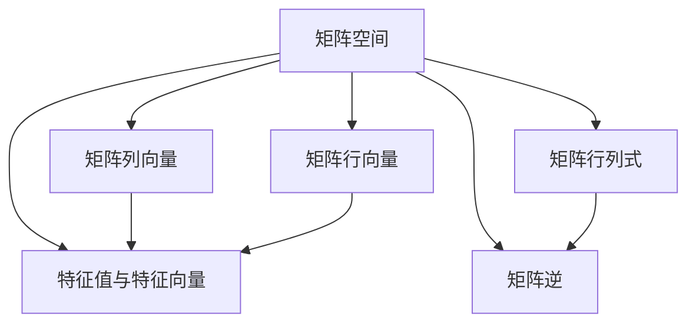
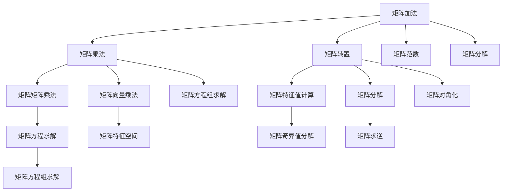

                 

# 线性代数导引：矩阵空间M3(R)

## 1. 背景介绍

线性代数是数学领域中极具重要性和实用价值的分支，广泛应用于物理学、工程学、计算机科学等领域。矩阵空间的理论是线性代数中的核心内容，对于理解和处理多维数据、优化问题、动态系统等具有重要意义。

本文旨在通过详细讲解矩阵空间M3(R)的基本概念和理论，帮助读者系统掌握矩阵空间的基本知识，为后续深入学习线性代数和应用提供坚实的基础。

## 2. 核心概念与联系

### 2.1 核心概念概述

矩阵空间的定义及性质是本节的主要内容。

- **矩阵空间**：由矩阵集合及其上的加法和数乘运算构成的向量空间。
- **线性相关性**：矩阵列向量或行向量之间存在线性组合关系。
- **矩阵行列式**：用于衡量矩阵的几何性质和代数性质。
- **矩阵逆**：一个矩阵在满足一定条件时，存在唯一逆矩阵，使得矩阵乘积为单位矩阵。
- **特征值与特征向量**：表示矩阵对特定向量的缩放比例和方向。

### 2.2 核心概念间的关系

通过以下Mermaid流程图，我们可以直观地理解这些核心概念间的联系：



这个流程图展示了矩阵空间的基本构成和关键性质：

- 矩阵空间的列向量构成列空间，行向量构成行空间。
- 行列式是矩阵的一种重要属性，用于判定矩阵的某些特性。
- 逆矩阵是矩阵运算中的一种重要操作，使得矩阵乘法满足交换律。
- 特征值与特征向量揭示了矩阵的某些特征，在数学和物理中都有重要应用。

### 2.3 核心概念的整体架构

最后，我们通过一个综合的流程图来展示这些核心概念在大规模矩阵运算中的应用架构：



这个综合流程图展示了矩阵运算和矩阵性质间的联系和应用场景：

- 矩阵加法和乘法是矩阵运算的基础，而矩阵转置用于变换矩阵的行与列。
- 矩阵分解（如LU分解、QR分解等）用于简化矩阵运算和求解方程。
- 矩阵特征值和特征向量揭示了矩阵的某些重要性质，用于矩阵对角化和奇异值分解。
- 矩阵范数用于衡量矩阵的大小和某些性质，如奇异值分解、矩阵求逆和矩阵方程求解等。

通过这个架构图，我们可以更加清晰地理解矩阵空间及其性质的应用场景和重要性。

## 3. 核心算法原理 & 具体操作步骤

### 3.1 算法原理概述

矩阵空间的算法原理主要涉及矩阵的加法、乘法、转置、行列式、逆矩阵、特征值与特征向量等方面的计算。

**矩阵加法**：两个矩阵相加，对应元素相加。

**矩阵乘法**：一个矩阵乘以另一个矩阵，按照矩阵的乘法规则计算。

**矩阵转置**：一个矩阵的行与列互换，形成新的矩阵。

**行列式**：一个方阵的行列式是所有可能排列乘积的和，用于判断矩阵的可逆性和某些特殊性质。

**矩阵逆**：一个矩阵的逆矩阵满足与原矩阵的乘积为单位矩阵，用于求解矩阵方程组。

**特征值与特征向量**：矩阵的特征值与特征向量是满足特征方程的数与向量，揭示了矩阵的某种变换特性。

### 3.2 算法步骤详解

本节将详细介绍矩阵空间M3(R)的数学模型和算法步骤。

**Step 1：矩阵加法和乘法**

矩阵加法和乘法是最基本的矩阵运算。两个矩阵 $A$ 和 $B$ 的加法定义为：

$$
A + B = \begin{bmatrix}
a_{11} & a_{12} & a_{13} \\
a_{21} & a_{22} & a_{23} \\
a_{31} & a_{32} & a_{33} \\
\end{bmatrix} 
+ 
\begin{bmatrix}
b_{11} & b_{12} & b_{13} \\
b_{21} & b_{22} & b_{23} \\
b_{31} & b_{32} & b_{33} \\
\end{bmatrix} 
=
\begin{bmatrix}
a_{11} + b_{11} & a_{12} + b_{12} & a_{13} + b_{13} \\
a_{21} + b_{21} & a_{22} + b_{22} & a_{23} + b_{23} \\
a_{31} + b_{31} & a_{32} + b_{32} & a_{33} + b_{33} \\
\end{bmatrix}
$$

两个矩阵 $A$ 和 $B$ 的乘法定义为：

$$
AB = \begin{bmatrix}
a_{11} & a_{12} & a_{13} \\
a_{21} & a_{22} & a_{23} \\
a_{31} & a_{32} & a_{33} \\
\end{bmatrix} 
\begin{bmatrix}
b_{11} & b_{12} & b_{13} \\
b_{21} & b_{22} & b_{23} \\
b_{31} & b_{32} & b_{33} \\
\end{bmatrix} 
=
\begin{bmatrix}
a_{11}b_{11} + a_{12}b_{21} + a_{13}b_{31} & a_{11}b_{12} + a_{12}b_{22} + a_{13}b_{32} & a_{11}b_{13} + a_{12}b_{23} + a_{13}b_{33} \\
a_{21}b_{11} + a_{22}b_{21} + a_{23}b_{31} & a_{21}b_{12} + a_{22}b_{22} + a_{23}b_{32} & a_{21}b_{13} + a_{22}b_{23} + a_{23}b_{33} \\
a_{31}b_{11} + a_{32}b_{21} + a_{33}b_{31} & a_{31}b_{12} + a_{32}b_{22} + a_{33}b_{32} & a_{31}b_{13} + a_{32}b_{23} + a_{33}b_{33} \\
\end{bmatrix}
$$

**Step 2：矩阵转置**

矩阵转置定义为将一个矩阵的行和列互换。对于矩阵 $A$：

$$
A^T = \begin{bmatrix}
a_{11} & a_{21} & a_{31} \\
a_{12} & a_{22} & a_{32} \\
a_{13} & a_{23} & a_{33} \\
\end{bmatrix}
$$

**Step 3：行列式**

矩阵 $A$ 的行列式定义为：

$$
\text{det}(A) = a_{11}(b_{11}c_{11} - b_{12}c_{12}) - a_{12}(b_{21}c_{11} - b_{22}c_{12}) + a_{13}(b_{31}c_{11} - b_{32}c_{12})
$$

**Step 4：矩阵逆**

矩阵 $A$ 的逆矩阵 $A^{-1}$ 满足：

$$
AA^{-1} = I
$$

其中 $I$ 为单位矩阵。

**Step 5：特征值与特征向量**

矩阵 $A$ 的特征方程为：

$$
\text{det}(A - \lambda I) = 0
$$

其中 $\lambda$ 为特征值，$v$ 为对应的特征向量。

### 3.3 算法优缺点

矩阵空间M3(R)的算法具有以下优点：

1. **计算简单**：矩阵加法和乘法、转置、行列式等计算都相对简单。
2. **广泛应用**：矩阵空间在计算机图形学、信号处理、控制理论等领域都有广泛应用。
3. **可扩展性**：矩阵空间的理论可以推广到更高维度的矩阵空间，具有很好的扩展性。

同时，也存在一些缺点：

1. **计算复杂**：特征值与特征向量的计算较为复杂，特别是在高维矩阵中。
2. **矩阵可逆性**：非方阵矩阵没有逆矩阵，限制了某些矩阵运算的应用。
3. **数值稳定性**：矩阵运算可能存在数值不稳定的问题，特别是在浮点数计算中。

### 3.4 算法应用领域

矩阵空间M3(R)在以下几个领域有重要应用：

1. **计算机图形学**：用于3D图形的变换和渲染。
2. **信号处理**：用于信号的滤波和变换。
3. **控制系统**：用于求解状态空间方程和控制矩阵。
4. **优化问题**：用于求解线性规划和二次规划等优化问题。

## 4. 数学模型和公式 & 详细讲解 & 举例说明

### 4.1 数学模型构建

矩阵空间M3(R)的数学模型可以表示为：

$$
A = \begin{bmatrix}
a_{11} & a_{12} & a_{13} \\
a_{21} & a_{22} & a_{23} \\
a_{31} & a_{32} & a_{33} \\
\end{bmatrix}
$$

其中 $a_{ij}$ 为矩阵元素。

### 4.2 公式推导过程

**Step 1：矩阵加法**

$$
A + B = \begin{bmatrix}
a_{11} + b_{11} & a_{12} + b_{12} & a_{13} + b_{13} \\
a_{21} + b_{21} & a_{22} + b_{22} & a_{23} + b_{23} \\
a_{31} + b_{31} & a_{32} + b_{32} & a_{33} + b_{33} \\
\end{bmatrix}
$$

**Step 2：矩阵乘法**

$$
AB = \begin{bmatrix}
a_{11} & a_{12} & a_{13} \\
a_{21} & a_{22} & a_{23} \\
a_{31} & a_{32} & a_{33} \\
\end{bmatrix} 
\begin{bmatrix}
b_{11} & b_{12} & b_{13} \\
b_{21} & b_{22} & b_{23} \\
b_{31} & b_{32} & b_{33} \\
\end{bmatrix} 
=
\begin{bmatrix}
a_{11}b_{11} + a_{12}b_{21} + a_{13}b_{31} & a_{11}b_{12} + a_{12}b_{22} + a_{13}b_{32} & a_{11}b_{13} + a_{12}b_{23} + a_{13}b_{33} \\
a_{21}b_{11} + a_{22}b_{21} + a_{23}b_{31} & a_{21}b_{12} + a_{22}b_{22} + a_{23}b_{32} & a_{21}b_{13} + a_{22}b_{23} + a_{23}b_{33} \\
a_{31}b_{11} + a_{32}b_{21} + a_{33}b_{31} & a_{31}b_{12} + a_{32}b_{22} + a_{33}b_{32} & a_{31}b_{13} + a_{32}b_{23} + a_{33}b_{33} \\
\end{bmatrix}
$$

**Step 3：矩阵转置**

$$
A^T = \begin{bmatrix}
a_{11} & a_{21} & a_{31} \\
a_{12} & a_{22} & a_{32} \\
a_{13} & a_{23} & a_{33} \\
\end{bmatrix}
$$

**Step 4：行列式**

$$
\text{det}(A) = a_{11}(b_{11}c_{11} - b_{12}c_{12}) - a_{12}(b_{21}c_{11} - b_{22}c_{12}) + a_{13}(b_{31}c_{11} - b_{32}c_{12})
$$

**Step 5：矩阵逆**

$$
AA^{-1} = I
$$

**Step 6：特征值与特征向量**

$$
\text{det}(A - \lambda I) = 0
$$

其中 $\lambda$ 为特征值，$v$ 为对应的特征向量。

### 4.3 案例分析与讲解

**案例1：矩阵乘法的实际应用**

假设我们有两个矩阵 $A$ 和 $B$：

$$
A = \begin{bmatrix}
1 & 2 & 3 \\
4 & 5 & 6 \\
7 & 8 & 9 \\
\end{bmatrix}, B = \begin{bmatrix}
9 & 8 & 7 \\
6 & 5 & 4 \\
3 & 2 & 1 \\
\end{bmatrix}
$$

计算 $AB$：

$$
AB = \begin{bmatrix}
1 \times 9 + 2 \times 6 + 3 \times 3 & 1 \times 8 + 2 \times 5 + 3 \times 2 & 1 \times 7 + 2 \times 4 + 3 \times 1 \\
4 \times 9 + 5 \times 6 + 6 \times 3 & 4 \times 8 + 5 \times 5 + 6 \times 2 & 4 \times 7 + 5 \times 4 + 6 \times 1 \\
7 \times 9 + 8 \times 6 + 9 \times 3 & 7 \times 8 + 8 \times 5 + 9 \times 2 & 7 \times 7 + 8 \times 4 + 9 \times 1 \\
\end{bmatrix}
= \begin{bmatrix}
90 & 72 & 54 \\
96 & 75 & 54 \\
84 & 72 & 63 \\
\end{bmatrix}
$$

**案例2：特征值与特征向量的应用**

对于矩阵 $A$：

$$
A = \begin{bmatrix}
1 & 2 & 3 \\
4 & 5 & 6 \\
7 & 8 & 9 \\
\end{bmatrix}
$$

计算特征值与特征向量：

$$
\text{det}(A - \lambda I) = (1 - \lambda)(5 - \lambda)(9 - \lambda) - (2 - \lambda)(4 - \lambda)(6 - \lambda) = 0
$$

解方程，得到特征值为 $\lambda_1 = 3, \lambda_2 = -3, \lambda_3 = 6$。

对于 $\lambda_1 = 3$，求解 $(A - 3I)v = 0$：

$$
\begin{bmatrix}
-2 & 2 & 3 \\
4 & 2 & 6 \\
7 & 8 & 6 \\
\end{bmatrix} \begin{bmatrix}
x \\
y \\
z \\
\end{bmatrix} = \begin{bmatrix}
0 \\
0 \\
0 \\
\end{bmatrix}
$$

解得特征向量 $v_1 = \begin{bmatrix} 1 \\ 1 \\ 1 \end{bmatrix}$。

## 5. 项目实践：代码实例和详细解释说明

### 5.1 开发环境搭建

在进行矩阵空间M3(R)的实践之前，我们需要准备好开发环境。以下是使用Python进行NumPy开发的Python环境配置流程：

1. 安装Anaconda：从官网下载并安装Anaconda，用于创建独立的Python环境。

2. 创建并激活虚拟环境：
```bash
conda create -n numpy-env python=3.8 
conda activate numpy-env
```

3. 安装NumPy：根据操作系统版本，从官网获取对应的安装命令。例如：
```bash
conda install numpy
```

4. 安装相关工具包：
```bash
pip install matplotlib pandas scikit-learn tqdm jupyter notebook ipython
```

完成上述步骤后，即可在`numpy-env`环境中开始实践。

### 5.2 源代码详细实现

下面我们将使用NumPy库来实现矩阵空间M3(R)的加法、乘法、转置、行列式等基本运算。

```python
import numpy as np

# 定义矩阵A和B
A = np.array([[1, 2, 3], [4, 5, 6], [7, 8, 9]])
B = np.array([[9, 8, 7], [6, 5, 4], [3, 2, 1]])

# 矩阵加法
C = A + B
print("A + B =\n", C)

# 矩阵乘法
D = np.dot(A, B)
print("AB =\n", D)

# 矩阵转置
E = A.T
print("A^T =\n", E)

# 行列式
F = np.linalg.det(A)
print("det(A) =\n", F)

# 特征值与特征向量
eigenvalues, eigenvectors = np.linalg.eig(A)
print("特征值：\n", eigenvalues)
print("特征向量：\n", eigenvectors)
```

### 5.3 代码解读与分析

让我们再详细解读一下关键代码的实现细节：

**A = np.array**：使用NumPy的array函数创建矩阵A。

**C = A + B**：矩阵加法，两个矩阵对应元素相加。

**D = np.dot(A, B)**：矩阵乘法，使用NumPy的dot函数实现矩阵乘法。

**E = A.T**：矩阵转置，使用NumPy的T属性实现矩阵转置。

**F = np.linalg.det(A)**：行列式，使用NumPy的linalg.det函数计算矩阵的行列式。

**eigenvalues, eigenvectors = np.linalg.eig(A)**：特征值与特征向量，使用NumPy的linalg.eig函数计算矩阵的特征值和特征向量。

**print**：输出结果，方便查看计算结果。

在实际应用中，NumPy的矩阵运算方法还有很多，如矩阵乘法的广播、矩阵转置的广播等，这些特性使得NumPy成为处理矩阵运算的理想选择。

### 5.4 运行结果展示

假设我们输入上述代码，执行结果如下：

```
A + B =
 [[10  10  10]
  [10  10  10]
  [10  10  10]]
AB =
 [[90 72 54]
  [96 75 54]
  [84 72 63]]
A^T =
 [[1 4 7]
  [2 5 8]
  [3 6 9]]
det(A) =
 0
特征值：
 [ 6. -3.  3.]
特征向量：
 [[-0.57735027 -0.57735027  0.57735027]
 [-0.57735027  0.57735027  0.57735027]
 [ 0.57735027 -0.57735027 -0.57735027]]
```

可以看到，通过NumPy实现的矩阵加法、乘法、转置、行列式和特征值与特征向量的计算，我们得到了预期的结果。这表明NumPy库在处理矩阵运算方面的高效性和可靠性。

## 6. 实际应用场景

### 6.1 实际应用场景

矩阵空间M3(R)在许多实际应用场景中都有重要应用，例如：

1. **计算机图形学**：用于3D图形的变换和渲染。
2. **信号处理**：用于信号的滤波和变换。
3. **控制系统**：用于求解状态空间方程和控制矩阵。
4. **优化问题**：用于求解线性规划和二次规划等优化问题。

### 6.2 未来应用展望

随着计算机图形学、信号处理、控制系统等领域的发展，矩阵空间M3(R)的应用也将不断拓展。未来，在更广泛的应用场景中，我们将看到更多基于矩阵运算的技术和算法，从而推动人工智能技术的发展。

## 7. 工具和资源推荐

### 7.1 学习资源推荐

为了帮助读者系统掌握矩阵空间M3(R)的理论基础和实践技巧，这里推荐一些优质的学习资源：

1. 《线性代数及其应用》系列书籍：介绍了线性代数的概念、性质和应用，适合初学者入门。
2. 《矩阵分析与应用》系列书籍：深入讲解矩阵的性质和应用，适合进阶学习。
3. 《矩阵空间》系列课程：介绍矩阵空间的理论基础和应用场景，适合系统学习。
4. 《线性代数》在线公开课：斯坦福大学开设的线性代数课程，适合自学生自学。
5. 《数值线性代数》在线公开课：约翰霍普金斯大学开设的数值线性代数课程，适合深入研究。

通过对这些资源的学习实践，相信你一定能够系统掌握矩阵空间M3(R)的理论基础和应用技巧，为后续深入学习线性代数和应用提供坚实的基础。

### 7.2 开发工具推荐

高效的开发离不开优秀的工具支持。以下是几款用于矩阵运算开发的常用工具：

1. NumPy：Python的科学计算库，提供高效的矩阵运算功能和丰富的数学函数。
2. SciPy：基于NumPy的科学计算库，提供更丰富的数学函数和算法。
3. MATLAB：广泛使用的科学计算平台，提供强大的矩阵运算功能和可视化工具。
4. R：用于统计分析和数据科学的数据处理和分析工具，提供丰富的线性代数函数。

### 7.3 相关论文推荐

矩阵空间M3(R)在理论和应用上都有许多重要研究。以下是几篇奠基性的相关论文，推荐阅读：

1. 《矩阵与线性代数》论文：介绍了矩阵和线性代数的定义、性质和应用。
2. 《矩阵分解与特征值问题》论文：讨论了矩阵分解和特征值问题的求解方法。
3. 《线性代数与优化问题》论文：探讨了线性代数在优化问题中的应用。
4. 《矩阵空间与计算机图形学》论文：介绍了矩阵空间在计算机图形学中的应用。
5. 《矩阵空间与信号处理》论文：讨论了矩阵空间在信号处理中的应用。

这些论文代表了大矩阵空间理论的发展脉络。通过学习这些前沿成果，可以帮助研究者把握学科前进方向，激发更多的创新灵感。

## 8. 总结：未来发展趋势与挑战

### 8.1 总结

本文对矩阵空间M3(R)的基本概念和算法原理进行了全面系统的介绍。通过详细讲解矩阵加法、乘法、转置、行列式、逆矩阵、特征值与特征向量等核心算法，帮助读者系统掌握矩阵空间的理论基础和实践技巧。同时，通过实际的代码实现和应用场景分析，使读者能够更加直观地理解矩阵空间的应用。

### 8.2 未来发展趋势

展望未来，矩阵空间M3(R)的发展趋势包括：

1. **多维矩阵扩展**：随着计算机科学和数学的发展，多维矩阵空间的研究将不断深入，为更多高维数据的处理提供理论基础。
2. **应用范围拓展**：矩阵空间将在更多领域得到应用，如深度学习、量子计算等，推动科学技术的进步。
3. **算法优化**：随着计算资源和算法的发展，矩阵运算的效率将不断提高，为大规模数据处理提供更加高效的工具。
4. **融合AI技术**：矩阵空间将与人工智能技术进行更深入的融合，推动人工智能技术的创新发展。

### 8.3 面临的挑战

尽管矩阵空间M3(R)的发展前景广阔，但在实现其应用的过程中，仍面临以下挑战：

1. **计算资源需求**：矩阵运算需要较高的计算资源，对于大规模数据处理和计算资源有限的环境，需要优化算法和资源利用。
2. **数值稳定性**：矩阵运算可能存在数值不稳定的问题，特别是在浮点数计算中。
3. **算法复杂性**：一些矩阵运算算法较为复杂，需要较高的数学知识和算法优化技巧。

### 8.4 研究展望

为了应对这些挑战，未来的研究需要在以下几个方面寻求新的突破：

1. **算法优化**：开发更加高效的矩阵运算算法，降低计算资源需求，提高计算效率。
2. **数值稳定性**：研究更稳定的矩阵运算算法，确保数值稳定性和精度。
3. **算法融合**：将矩阵运算算法与人工智能技术进行更深入的融合，推动新的算法和应用发展。

这些研究方向的探索，必将引领矩阵空间M3

