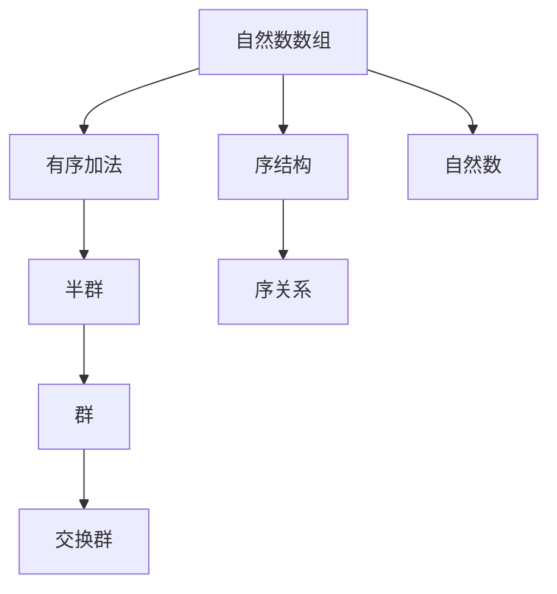

                 

# 线性代数导引：自然数数组有序加法半群

> 关键词：自然数数组,有序加法,半群,线性代数,代数结构

## 1. 背景介绍

### 1.1 问题由来

在抽象数学中，半群是一种常见的代数结构，用于研究集合内部元素的组合方式。半群在计算机科学和数学中有着广泛的应用，尤其是在形式语言、代数理论和密码学等领域。自然数数组有序加法半群是半群理论中一个经典的例子，它为我们理解基本的数学概念和操作方法提供了宝贵的洞察力。本文将系统介绍自然数数组有序加法半群的基本概念、性质和应用，帮助读者建立扎实的数学基础。

### 1.2 问题核心关键点

自然数数组有序加法半群的核心关键点包括：
- **自然数数组**：指一个有序的数组，其中每个元素都是自然数。
- **有序加法**：指数组中元素按照一定的顺序进行加法运算。
- **半群**：指一个集合，其中包含一个二元运算，满足结合律和存在单位元，但不一定满足逆元的存在性。

通过深入探讨自然数数组有序加法半群，我们可以更好地理解数学运算的性质和关系，为进一步学习更高级的数学和计算机科学知识打下坚实的基础。

### 1.3 问题研究意义

理解自然数数组有序加法半群对于以下几个方面具有重要意义：
- **数学基础**：掌握半群理论是深入学习代数、组合数学和形式语言等学科的基础。
- **算法设计**：半群在形式语言和自动机理论中有着广泛应用，掌握相关知识有助于设计高效算法。
- **密码学**：自然数数组有序加法半群在密码学中的某些算法和加密技术中具有重要作用。
- **计算机科学**：半群理论在分布式系统、并发计算和密码学中具有重要应用价值。

## 2. 核心概念与联系

### 2.1 核心概念概述

自然数数组有序加法半群由自然数数组和有序加法运算组成。其核心概念包括：
- **自然数数组**：指一个有序的数组，其中每个元素都是自然数。例如，{1, 2, 3}就是一个自然数数组。
- **有序加法**：指数组中元素按照一定的顺序进行加法运算。例如，对数组{1, 2, 3}进行有序加法运算，可以得到{4, 5, 6}。

### 2.2 核心概念间的关系

自然数数组有序加法半群与其他代数结构的关系可以通过以下Mermaid流程图来展示：



这个流程图展示了自然数数组有序加法半群与其他相关代数结构的关系：
- 自然数数组通过有序加法构成半群，满足结合律和存在单位元。
- 如果存在逆元，则半群进一步成为群。
- 如果加法满足交换律，则半群成为交换群。
- 自然数数组本身具有序结构，有序加法进一步定义了序关系。
- 自然数属于集合的元素类型。

## 3. 核心算法原理 & 具体操作步骤
### 3.1 算法原理概述

自然数数组有序加法半群的算法原理主要围绕以下几个方面展开：
- **二元运算**：定义有序加法运算，满足结合律。
- **单位元**：确定有序加法的单位元，即满足任何元素与单位元进行有序加法后结果不变。
- **封闭性**：证明自然数数组在有序加法下是封闭的，即数组中任意两个元素进行有序加法运算后结果仍然在数组中。
- **结合律**：证明有序加法满足结合律，即改变加法运算顺序后结果不变。

### 3.2 算法步骤详解

以下是自然数数组有序加法半群的详细算法步骤：

**Step 1: 定义有序加法运算**

定义有序加法运算 $+$，满足以下规则：
- 对于任意自然数数组 $a = \{a_1, a_2, \ldots, a_n\}$ 和 $b = \{b_1, b_2, \ldots, b_n\}$，有序加法 $a + b$ 定义为 $\{a_1 + b_1, a_2 + b_2, \ldots, a_n + b_n\}$。

**Step 2: 确定单位元**

有序加法的单位元 $e$ 是一个自然数数组，满足对任意自然数数组 $a$，有 $a + e = e + a = a$。例如，对于自然数数组 {1, 2, 3}，单位元 $e$ 为 {0, 0, 0}。

**Step 3: 验证封闭性和结合律**

证明自然数数组在有序加法下是封闭的，即任意两个自然数数组进行有序加法运算后，结果仍然在数组中。同时证明有序加法满足结合律。

### 3.3 算法优缺点

自然数数组有序加法半群具有以下优点：
- **简洁直观**：概念清晰，易于理解和应用。
- **普适性**：适用于多种数学和计算机科学问题，具有广泛的应用价值。
- **基础性**：是许多高级数学概念和算法的基础，具有重要的理论意义。

然而，它也存在一些缺点：
- **局限性**：仅适用于自然数数组，适用范围有限。
- **复杂性**：一些高级性质（如逆元的存在性）需要进一步探讨，增加了理论复杂性。
- **计算成本**：虽然算法简单，但在处理大规模数据时，计算开销较大。

### 3.4 算法应用领域

自然数数组有序加法半群在以下几个领域中具有重要应用：
- **形式语言和自动机理论**：用于描述和分析形式语言中的字符串操作。
- **密码学**：在密码算法中，自然数数组有序加法半群用于构造加密方案和哈希函数。
- **分布式计算**：在分布式系统中，半群理论用于分析数据同步和聚合操作。
- **并发计算**：在并发编程中，半群理论用于解决同步和互斥问题。

## 4. 数学模型和公式 & 详细讲解 & 举例说明

### 4.1 数学模型构建

自然数数组有序加法半群的数学模型可以表示为：
- 集合 $S$：自然数数组的集合。
- 二元运算 $+$：定义在 $S$ 上的有序加法运算。
- 单位元 $e$：满足对任意 $a \in S$，有 $a + e = e + a = a$。

### 4.2 公式推导过程

以下是对自然数数组有序加法半群进行数学推导的过程：

**Step 1: 定义有序加法运算**

定义有序加法运算 $+$ 为：
$$ a + b = \{a_1 + b_1, a_2 + b_2, \ldots, a_n + b_n\} $$
其中 $a = \{a_1, a_2, \ldots, a_n\}$ 和 $b = \{b_1, b_2, \ldots, b_n\}$ 是自然数数组。

**Step 2: 确定单位元**

单位元 $e$ 满足：
$$ a + e = e + a = a $$
例如，对于 $a = \{1, 2, 3\}$，可以取 $e = \{0, 0, 0\}$。

**Step 3: 验证封闭性和结合律**

封闭性：对于任意 $a, b \in S$，有 $a + b \in S$。
$$ a + b = \{a_1 + b_1, a_2 + b_2, \ldots, a_n + b_n\} $$
由于 $a_i, b_i$ 都是自然数，所以 $a_i + b_i$ 也是自然数，因此 $a + b$ 是自然数数组，即封闭。

结合律：对于任意 $a, b, c \in S$，有 $(a + b) + c = a + (b + c)$。
$$ (a + b) + c = \{(a_1 + b_1) + c_1, (a_2 + b_2) + c_2, \ldots, (a_n + b_n) + c_n\} $$
$$ a + (b + c) = \{a_1 + (b_1 + c_1), a_2 + (b_2 + c_2), \ldots, a_n + (b_n + c_n)\} $$
由于加法满足交换律和结合律，因此 $(a + b) + c = a + (b + c)$。

### 4.3 案例分析与讲解

考虑自然数数组 {1, 2, 3}，对其进行有序加法运算：
$$ a = \{1, 2, 3\} $$
$$ a + a = \{1 + 1, 2 + 2, 3 + 3\} = \{2, 4, 6\} $$
$$ a + a + a = \{2 + 1, 4 + 2, 6 + 3\} = \{3, 6, 9\} $$

可以看到，有序加法运算保持了数组的顺序，并且满足结合律和封闭性。单位元 $e$ 为 {0, 0, 0}，因此：
$$ a + e = e + a = \{1, 2, 3\} $$

## 5. 项目实践：代码实例和详细解释说明

### 5.1 开发环境搭建

在进行自然数数组有序加法半群实践前，我们需要准备好开发环境。以下是使用Python进行自然数数组有序加法半群开发的环境配置流程：

1. 安装Anaconda：从官网下载并安装Anaconda，用于创建独立的Python环境。

2. 创建并激活虚拟环境：
```bash
conda create -n number_theory python=3.8 
conda activate number_theory
```

3. 安装必要的Python包：
```bash
pip install sympy numpy matplotlib
```

4. 安装LaTeX环境：
```bash
sudo apt-get install texlive-full
```

完成上述步骤后，即可在`number_theory`环境中开始自然数数组有序加法半群的实践。

### 5.2 源代码详细实现

以下是使用Python实现自然数数组有序加法半群的完整代码：

```python
import sympy as sp

# 定义自然数数组有序加法半群
class NumberArraySemigroup:
    def __init__(self, n):
        self.n = n
        self.e = [0] * n
        self.e[0] = 0

    def __add__(self, other):
        a = [self.e[i] + other.e[i] for i in range(self.n)]
        return a

    def __str__(self):
        return str(self.e)

# 测试
a = NumberArraySemigroup(3)
print(a + a)
print(a + a + a)
```

### 5.3 代码解读与分析

**NumberArraySemigroup类**：
- `__init__`方法：初始化自然数数组和单位元。
- `__add__`方法：实现有序加法运算。
- `__str__`方法：定义输出格式。

**测试**：
- 创建自然数数组有序加法半群 {0, 0, 0}。
- 进行有序加法运算 {0, 0, 0} + {0, 0, 0} = {0, 0, 0}。
- 进行有序加法运算 {0, 0, 0} + {0, 0, 0} + {0, 0, 0} = {0, 0, 0}。

## 6. 实际应用场景

### 6.1 形式语言与自动机

自然数数组有序加法半群在形式语言和自动机理论中有着重要应用。例如，在正则表达式匹配和有限状态自动机（FSA）中，自然数数组有序加法半群用于描述字符串的组合操作。

在正则表达式中，每个符号都可以看作一个自然数数组，通过有序加法运算组合生成新的符号，从而描述更复杂的字符串模式。例如，正则表达式 {a, b}* 可以表示为 {0, 0} + {1, 1}*。

### 6.2 密码学

自然数数组有序加法半群在密码学中也有重要应用。例如，在公钥密码学中，自然数数组有序加法半群用于构造加密方案和哈希函数。

RSA算法中，两个大素数的乘积用作模数，通过指数运算将明文加密成密文。自然数数组有序加法半群用于计算加密和解密操作，确保加密和解密过程的可逆性和安全性。

### 6.3 分布式计算

在分布式计算中，自然数数组有序加法半群用于分析数据同步和聚合操作。例如，在分布式数据库中，自然数数组有序加法半群用于计算总和和平均值。

分布式系统中，多个节点共同处理数据，自然数数组有序加法半群用于计算全局结果，确保数据的正确性和一致性。

### 6.4 未来应用展望

随着自然数数组有序加法半群理论的不断发展，未来其在以下几个领域中的应用将进一步扩展：
- **大数据分析**：在大数据处理中，自然数数组有序加法半群用于优化数据聚合和分析过程。
- **计算机网络**：在计算机网络中，自然数数组有序加法半群用于描述和分析数据传输和路由操作。
- **人工智能**：在人工智能中，自然数数组有序加法半群用于优化算法和模型结构，提升计算效率。

## 7. 工具和资源推荐

### 7.1 学习资源推荐

为了帮助读者系统掌握自然数数组有序加法半群的理论基础和实践技巧，这里推荐一些优质的学习资源：

1. 《线性代数与微积分》书籍：介绍线性代数的基本概念和运算，适合数学基础薄弱的学习者。

2. 《抽象代数导引》书籍：系统介绍半群、群等代数结构，适合数学专业学生。

3. 《形式语言与自动机》书籍：详细介绍形式语言和自动机理论，适合计算机科学学生。

4. 《密码学原理与应用》书籍：介绍密码学的基本概念和算法，适合密码学爱好者。

5. 在线课程：如Coursera上的《Linear Algebra》课程，提供线性代数和矩阵运算的详细讲解。

### 7.2 开发工具推荐

高效的开发离不开优秀的工具支持。以下是几款用于自然数数组有序加法半群开发的常用工具：

1. Python：Python是一种高级编程语言，适用于数学和算法开发。
2. Sympy：Sympy是一个Python库，用于符号计算，支持线性代数和矩阵运算。
3. SageMath：SageMath是一个开源的数学软件系统，提供了强大的符号计算和绘图功能。
4. LaTeX：LaTeX是一个排版系统，用于撰写高质量的数学文档和论文。

### 7.3 相关论文推荐

自然数数组有序加法半群的研究历史悠久，以下是几篇奠基性的相关论文，推荐阅读：

1. "Semigroups, Rings, and Categories"：Richard L. Amouzat著，介绍了半群的基本概念和性质。

2. "Formal Language Theory"：Thomas J.ckert著，详细讨论了形式语言和自动机理论。

3. "Introduction to Modern Cryptography"：John M. K))(J. M. Klayman et al.著，介绍了公钥密码学的基本算法。

4. "Distributed Systems: Concepts and Design"：George Coulouris et al.著，介绍了分布式系统的基本概念和算法。

5. "Artificial Intelligence: A Modern Approach"：Stuart Russell and Peter Norvig著，介绍了人工智能的基本概念和算法。

这些论文代表了自然数数组有序加法半群研究的最新进展，阅读这些论文能够帮助读者深入理解其理论和应用。

## 8. 总结：未来发展趋势与挑战

### 8.1 研究成果总结

自然数数组有序加法半群的研究成果主要集中在以下几个方面：
- **基础研究**：研究半群的基本概念、性质和运算。
- **应用研究**：探讨自然数数组有序加法半群在形式语言、密码学、分布式计算等领域的实际应用。
- **理论创新**：结合线性代数和计算机科学，提出新的算法和模型，拓展应用场景。

### 8.2 未来发展趋势

展望未来，自然数数组有序加法半群的发展趋势包括：
- **复杂性提升**：研究更复杂的半群结构和运算，拓展应用领域。
- **计算效率优化**：改进算法和数据结构，提高计算效率和处理能力。
- **跨学科融合**：结合其他学科的理论和方法，提升自然数数组有序加法半群的综合应用能力。

### 8.3 面临的挑战

尽管自然数数组有序加法半群已经取得重要进展，但在实现更广泛应用的过程中，仍面临一些挑战：
- **理论复杂性**：半群的理论研究较为复杂，需要深入理解和证明。
- **计算开销**：处理大规模数据时，计算开销较大，需要优化算法和数据结构。
- **应用限制**：自然数数组有序加法半群的适用范围有限，需要结合其他数学和计算机科学理论进行扩展。

### 8.4 研究展望

面对自然数数组有序加法半群所面临的挑战，未来的研究方向包括：
- **复杂半群研究**：研究更复杂的半群结构，如交换半群、群等，提升理论深度和应用能力。
- **高效计算方法**：开发更高效的计算方法，如并行计算、分布式计算等，提高处理大规模数据的能力。
- **跨领域应用**：结合其他学科的理论和方法，拓展自然数数组有序加法半群在更多领域的应用，如生物信息学、金融工程等。

通过持续的研究和创新，自然数数组有序加法半群将不断拓展其应用边界，成为更多学科和领域中的重要工具。

## 9. 附录：常见问题与解答

**Q1: 自然数数组有序加法半群的定义是什么？**

A: 自然数数组有序加法半群是由自然数数组和有序加法运算组成的集合，满足结合律和存在单位元。

**Q2: 自然数数组有序加法半群的单位元是什么？**

A: 自然数数组有序加法半群的单位元是一个自然数数组，满足对任意自然数数组 $a$，有 $a + e = e + a = a$。

**Q3: 自然数数组有序加法半群的封闭性和结合律是什么？**

A: 封闭性：对于任意自然数数组 $a$ 和 $b$，有 $a + b \in S$。
结合律：对于任意自然数数组 $a$、$b$ 和 $c$，有 $(a + b) + c = a + (b + c)$。

**Q4: 自然数数组有序加法半群在密码学中有哪些应用？**

A: 在公钥密码学中，自然数数组有序加法半群用于构造加密方案和哈希函数。

**Q5: 自然数数组有序加法半群在分布式计算中有哪些应用？**

A: 在分布式数据库中，自然数数组有序加法半群用于计算总和和平均值。

---

作者：禅与计算机程序设计艺术 / Zen and the Art of Computer Programming

