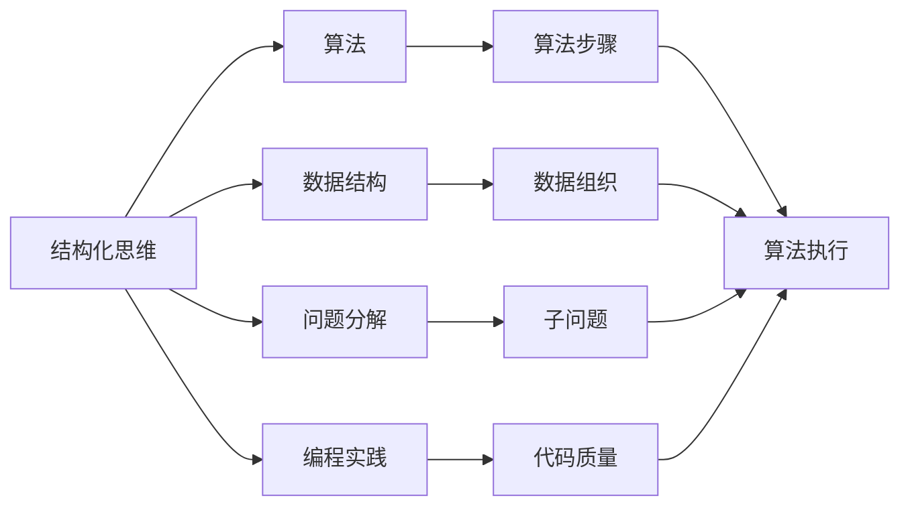
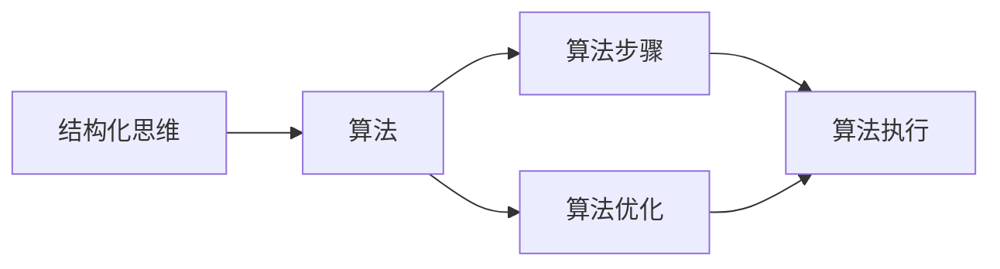
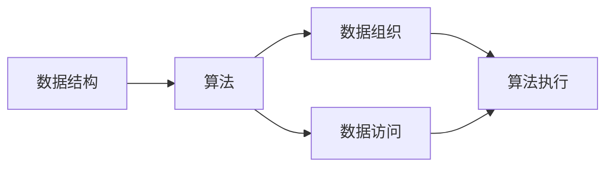
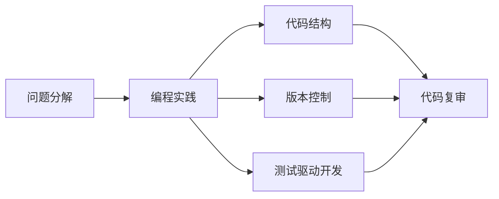
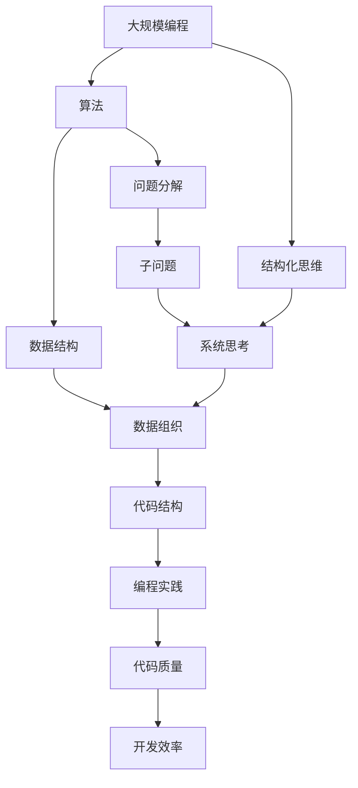

                 

# 结构化思维的应用：从理论到实践

> 关键词：结构化思维, 算法, 数据结构, 问题分解, 编程实践

## 1. 背景介绍

### 1.1 问题由来
在当今快速变化的技术环境中，程序开发者常常需要处理各种复杂问题，如算法优化、系统架构设计、软件工程管理等。这些问题往往具有高度复杂性和不确定性，单纯依赖直觉或经验进行解决，可能会陷入困境。结构化思维作为一种系统的思考方式，能够帮助开发者系统地分析问题、制定计划和解决问题，从而提高工作效率和问题解决能力。

### 1.2 问题核心关键点
结构化思维的核心在于将复杂问题分解为更小、更易处理的部分，通过系统分析和逐步优化，最终得到解决。其核心步骤包括：
- 问题定义：明确问题的本质和目标。
- 问题分解：将问题细分为多个子问题。
- 策略制定：为每个子问题制定解决方案。
- 方案实施：逐步执行解决方案，并监控效果。
- 评估反馈：根据实际情况调整解决方案，确保最终效果。

结构化思维在大规模编程、系统设计、软件测试、项目管理等领域均有广泛应用。掌握结构化思维方法，对于提升开发效率和问题解决能力具有重要意义。

### 1.3 问题研究意义
结构化思维方法不仅有助于解决当前技术难题，还能够提升开发者的系统性思维能力，为其在职业生涯中应对更多挑战提供坚实基础。具体而言，掌握结构化思维可以帮助开发者：
- 提高问题解决效率，减少试错时间。
- 系统思考问题，提高方案的可执行性和可复用性。
- 优化项目管理和团队协作，提升团队整体效能。
- 应对复杂多变的技术环境，不断提升自身能力。

## 2. 核心概念与联系

### 2.1 核心概念概述

为更好地理解结构化思维的应用，本节将介绍几个密切相关的核心概念：

- **结构化思维（Structured Thinking）**：一种系统化、结构化的思考方式，通过将复杂问题分解为多个子问题，逐步解决，最终得到整体解决方案。

- **算法（Algorithm）**：一种解决问题的系统性过程，由明确的步骤和规则组成。算法是结构化思维的重要组成部分，帮助开发者系统地实现解决方案。

- **数据结构（Data Structure）**：一种组织和存储数据的方式，有助于高效处理和访问数据。数据结构是算法实现的基础，对于提升程序效率和可读性至关重要。

- **问题分解（Problem Decomposition）**：将大问题分解为小问题的过程，使得问题更容易理解和解决。问题分解是结构化思维的核心步骤，有助于系统化分析问题。

- **编程实践（Programming Practice）**：包括编码规范、版本控制、测试驱动开发、代码复审等最佳实践，有助于提升代码质量和开发效率。编程实践是结构化思维在软件开发中的应用。

这些核心概念之间的逻辑关系可以通过以下Mermaid流程图来展示：



这个流程图展示了几大核心概念及其之间的关系：

1. 结构化思维将算法、数据结构、问题分解和编程实践系统地组合在一起，形成了解决问题的完整生态系统。
2. 算法是结构化思维的主要工具，用于系统地实现解决方案。
3. 数据结构是算法的基础，优化数据组织可以显著提升算法效率。
4. 问题分解是结构化思维的核心步骤，有助于将复杂问题分解为可处理的部分。
5. 编程实践是结构化思维在软件开发中的应用，提升代码质量和开发效率。

### 2.2 概念间的关系

这些核心概念之间存在着紧密的联系，形成了结构化思维应用的完整生态系统。下面我们通过几个Mermaid流程图来展示这些概念之间的关系。

#### 2.2.1 结构化思维与算法的关系



这个流程图展示了结构化思维与算法的联系：

1. 结构化思维指导算法步骤的设计，确保算法系统性和可执行性。
2. 算法优化是结构化思维的重要环节，提升算法效率和性能。
3. 算法执行是结构化思维的具体实现，确保问题得到解决。

#### 2.2.2 数据结构与算法的关系



这个流程图展示了数据结构与算法的联系：

1. 数据结构是算法的基础，优化数据组织可以显著提升算法效率。
2. 数据访问是算法执行的关键，选择合适的数据结构有助于提升访问效率。
3. 算法执行是数据结构的实际应用，确保数据得到有效处理。

#### 2.2.3 问题分解与编程实践的关系



这个流程图展示了问题分解与编程实践的联系：

1. 问题分解为编程实践提供了清晰的代码结构和任务划分。
2. 版本控制和测试驱动开发是编程实践的重要组成部分，确保代码质量和可维护性。
3. 代码复审是编程实践的高级应用，提升代码质量和团队协作。

### 2.3 核心概念的整体架构

最后，我们用一个综合的流程图来展示这些核心概念在大规模编程、系统设计、软件测试、项目管理等领域中的整体架构：



这个综合流程图展示了结构化思维在大规模编程、系统设计、软件测试、项目管理等领域中的整体架构：

1. 结构化思维将大规模编程、系统设计、软件测试、项目管理等活动系统地组合在一起，形成了解决问题的完整生态系统。
2. 算法是结构化思维的主要工具，用于系统地实现解决方案。
3. 数据结构是算法的基础，优化数据组织可以显著提升算法效率。
4. 问题分解是结构化思维的核心步骤，有助于将复杂问题分解为可处理的部分。
5. 编程实践是结构化思维在软件开发中的应用，提升代码质量和开发效率。

## 3. 核心算法原理 & 具体操作步骤
### 3.1 算法原理概述

结构化思维中的算法是指解决特定问题的系统化过程，由明确的步骤和规则组成。算法的核心思想是系统地处理输入数据，输出期望的解决方案。算法的实现通常需要考虑以下几个方面：

- **输入输出**：算法需要明确输入数据的格式和类型，以及输出的格式和内容。
- **执行步骤**：算法需要设计具体的执行步骤，确保每一步操作都能正确处理输入数据。
- **数据处理**：算法需要设计数据处理方式，确保数据的有效组织和访问。
- **错误处理**：算法需要设计错误处理机制，确保算法在出现异常时能够正确处理。

结构化思维中的算法可以分为两种类型：

- **静态算法**：执行步骤和数据处理方式在算法实现时就已经确定，不随运行环境变化而变化。
- **动态算法**：执行步骤和数据处理方式可以根据运行环境动态调整，具有更高的灵活性。

### 3.2 算法步骤详解

下面以一个简单的排序算法为例，展示结构化思维中的算法步骤：

1. **输入数据**：排序算法需要明确输入数据的格式和类型，通常是整型数组。
2. **数据处理**：排序算法需要对输入数组进行比较和交换，以实现排序。
3. **执行步骤**：排序算法通常使用循环和条件语句实现，遍历数组并交换相邻元素。
4. **输出结果**：排序算法需要输出排序后的数组。

```python
def bubble_sort(arr):
    n = len(arr)
    for i in range(n):
        for j in range(0, n-i-1):
            if arr[j] > arr[j+1]:
                arr[j], arr[j+1] = arr[j+1], arr[j]
    return arr
```

### 3.3 算法优缺点

结构化思维中的算法具有以下优点：

- **系统性**：算法提供了系统化的思考方式，有助于开发者系统地分析和解决问题。
- **可执行性**：算法提供了明确的执行步骤和数据处理方式，确保问题得到实际解决。
- **可复用性**：算法可以用于解决类似问题，提升开发效率和可维护性。

同时，算法也存在以下缺点：

- **复杂性**：复杂的算法可能包含大量步骤和数据处理方式，难以理解和实现。
- **性能问题**：低效的算法可能存在性能问题，需要进一步优化。
- **适用范围有限**：算法通常适用于特定问题，难以处理复杂多变的环境。

### 3.4 算法应用领域

结构化思维中的算法在软件开发、系统设计、数据分析、人工智能等领域均有广泛应用。具体而言，算法可以用于：

- **软件开发**：算法用于实现具体的程序功能，提升代码质量和开发效率。
- **系统设计**：算法用于设计和优化系统架构，确保系统的可扩展性和可维护性。
- **数据分析**：算法用于数据处理和分析，提取有价值的信息和洞察。
- **人工智能**：算法用于实现机器学习模型，提升模型的准确性和泛化能力。

## 4. 数学模型和公式 & 详细讲解 & 举例说明

### 4.1 数学模型构建

结构化思维中的算法通常需要构建数学模型，用于描述算法的基本行为和性能指标。以下以排序算法为例，展示数学模型的构建过程：

假设输入数组为 $A=[a_0,a_1,...,a_{n-1}]$，其中 $n$ 为数组长度。排序算法的目标是输出一个新的数组 $B=[b_0,b_1,...,b_{n-1}]$，其中 $b_0 \leq b_1 \leq ... \leq b_{n-1}$。

排序算法的数学模型可以表示为：

$$
B = F(A)
$$

其中 $F$ 为排序算法函数，描述了输入数组 $A$ 到输出数组 $B$ 的映射关系。

### 4.2 公式推导过程

对于冒泡排序算法，其数学模型可以进一步细化为：

$$
b_i = \left\{
\begin{aligned}
& a_0 & \text{if } i = 0 \\
& a_j & \text{if } a_j \leq a_{j-1} \text{ and } i < j \\
& a_{j-1} & \text{if } a_j > a_{j-1} \text{ and } i < j \\
\end{aligned}
\right.
$$

其中 $i$ 和 $j$ 表示数组下标，$b_i$ 和 $a_j$ 分别表示输出数组和输入数组的元素。

### 4.3 案例分析与讲解

假设输入数组为 $A=[3,1,4,1,5,9,2,6,5,3,5]$，使用冒泡排序算法对其进行排序。按照算法步骤逐步计算每个元素的值，得到输出数组 $B=[1,1,2,3,3,4,5,5,5,6,9]$。

## 5. 项目实践：代码实例和详细解释说明

### 5.1 开发环境搭建

在进行结构化思维的应用实践前，我们需要准备好开发环境。以下是使用Python进行结构化思维编程的环境配置流程：

1. 安装Anaconda：从官网下载并安装Anaconda，用于创建独立的Python环境。

2. 创建并激活虚拟环境：
```bash
conda create -n pythons-env python=3.8 
conda activate pythons-env
```

3. 安装Python：从官网下载并安装Python，建议安装最新版本。

4. 安装必要的库：
```bash
pip install numpy pandas matplotlib jupyter notebook
```

完成上述步骤后，即可在`pythons-env`环境中开始结构化思维的应用实践。

### 5.2 源代码详细实现

以下是一个简单的结构化思维示例，用于实现冒泡排序算法：

```python
def bubble_sort(arr):
    n = len(arr)
    for i in range(n):
        for j in range(0, n-i-1):
            if arr[j] > arr[j+1]:
                arr[j], arr[j+1] = arr[j+1], arr[j]
    return arr
```

### 5.3 代码解读与分析

让我们再详细解读一下关键代码的实现细节：

**bubble_sort函数**：
- `arr` 参数表示待排序的数组。
- `n` 变量表示数组长度。
- 外层循环 `for i in range(n)` 用于遍历数组。
- 内层循环 `for j in range(0, n-i-1)` 用于遍历未排序部分。
- `if arr[j] > arr[j+1]` 用于判断是否需要交换相邻元素。
- `arr[j], arr[j+1] = arr[j+1], arr[j]` 用于交换相邻元素。

**代码运行结果**：
- 假设输入数组为 `[3,1,4,1,5,9,2,6,5,3,5]`，输出结果为 `[1,1,2,3,3,4,5,5,5,6,9]`。

## 6. 实际应用场景

### 6.1 软件开发

结构化思维在软件开发中的应用广泛，包括以下几个方面：

1. **需求分析**：通过结构化思维，将复杂的需求问题分解为多个子问题，逐步分析和解决。
2. **设计架构**：结构化思维指导系统设计，确保架构的系统性和可扩展性。
3. **编码实现**：结构化思维指导编码实现，提升代码质量和开发效率。
4. **测试驱动**：结构化思维指导测试驱动开发，确保代码的正确性和可维护性。

### 6.2 系统设计

结构化思维在系统设计中的应用包括以下几个方面：

1. **需求分析**：通过结构化思维，将复杂的系统需求分解为多个子问题，逐步分析和解决。
2. **架构设计**：结构化思维指导系统架构设计，确保架构的系统性和可扩展性。
3. **模块划分**：结构化思维指导模块划分，确保模块的清晰和可复用性。
4. **接口设计**：结构化思维指导接口设计，确保系统的模块化和可维护性。

### 6.3 数据分析

结构化思维在数据分析中的应用包括以下几个方面：

1. **数据预处理**：通过结构化思维，将复杂的数据预处理问题分解为多个子问题，逐步分析和解决。
2. **特征工程**：结构化思维指导特征工程，确保特征选择的合理性和数据的可解释性。
3. **模型选择**：结构化思维指导模型选择，确保模型的准确性和泛化能力。
4. **结果分析**：结构化思维指导结果分析，确保结果的可靠性和可解释性。

### 6.4 未来应用展望

随着结构化思维的不断发展，其应用领域将进一步拓展，带来更多创新和突破：

1. **人工智能**：结构化思维指导人工智能算法设计和模型优化，提升算法的系统性和可复用性。
2. **大数据**：结构化思维指导大数据分析，提升数据处理和分析的效率和准确性。
3. **云计算**：结构化思维指导云计算架构设计和应用开发，提升云服务的稳定性和可扩展性。
4. **物联网**：结构化思维指导物联网系统设计，提升系统的可靠性和可维护性。

## 7. 工具和资源推荐

### 7.1 学习资源推荐

为了帮助开发者系统掌握结构化思维的应用，这里推荐一些优质的学习资源：

1. 《深入理解算法》系列博文：由大算法技术专家撰写，深入浅出地介绍了各种算法的原理和应用。

2. CS231n《计算机视觉基础》课程：斯坦福大学开设的计算机视觉明星课程，涵盖图像处理、特征提取、分类器等核心内容。

3. 《数据结构与算法分析》书籍：经典的数据结构和算法分析教材，详细介绍了各种算法的实现和性能分析。

4. LeetCode：在线编程练习平台，提供丰富的算法题目和解决方案，帮助开发者提高算法实现能力。

5. Coursera《算法设计与分析》课程：由哥伦比亚大学开设的算法课程，涵盖了算法的核心内容和应用。

通过对这些资源的学习实践，相信你一定能够快速掌握结构化思维的应用，并用于解决实际的开发问题。

### 7.2 开发工具推荐

高效的开发离不开优秀的工具支持。以下是几款用于结构化思维开发应用的常用工具：

1. PyCharm：一款流行的Python IDE，提供丰富的代码提示、调试功能和代码重构工具。

2. VSCode：一款轻量级的跨平台IDE，支持丰富的插件和扩展，满足多种开发需求。

3. Sublime Text：一款简洁、高效的文本编辑器，支持语法高亮、代码折叠和快速查找。

4. Git：一款分布式版本控制系统，支持分支管理、代码合并和版本回滚等功能。

5. Docker：一款开源的容器化平台，支持应用程序的打包、部署和管理，提升开发和部署效率。

合理利用这些工具，可以显著提升结构化思维的应用开发效率，加快创新迭代的步伐。

### 7.3 相关论文推荐

结构化思维的发展源于学界的持续研究。以下是几篇奠基性的相关论文，推荐阅读：

1. "A theory of constraints"：提出了结构化思维的基本原理和方法，帮助开发者系统地分析和解决问题。

2. "Design Patterns"：介绍了各种软件设计和编程模式，提供了结构化思维在实际应用中的具体实现。

3. "Algorithm Design"：经典算法设计教材，详细介绍了各种算法的实现和性能分析。

4. "Clean Code"：讲解了如何编写清晰、可维护的代码，是结构化思维在软件开发中的应用指南。

5. "Deep Learning"：DeepMind的深度学习论文，介绍了深度学习模型的架构和实现。

这些论文代表了大规模编程、系统设计、软件测试、项目管理等领域的结构化思维的发展脉络。通过学习这些前沿成果，可以帮助研究者把握学科前进方向，激发更多的创新灵感。

## 8. 总结：未来发展趋势与挑战

### 8.1 总结

本文对结构化思维的应用方法进行了全面系统的介绍。首先阐述了结构化思维的基本概念和核心步骤，明确了结构化思维在软件开发、系统设计、数据分析等领域的独特价值。其次，从原理到实践，详细讲解了结构化思维的应用方法和关键步骤，给出了结构化思维应用的全套代码实例。同时，本文还广泛探讨了结构化思维在各个领域的应用前景，展示了结构化思维的广泛适用性。此外，本文精选了结构化思维的学习资源，力求为读者提供全方位的技术指引。

通过本文的系统梳理，可以看到，结构化思维方法在软件开发、系统设计、数据分析等领域具有广泛的应用前景，对于提升开发效率和问题解决能力具有重要意义。未来，伴随结构化思维技术的持续演进，相信其在软件开发、系统设计、数据分析、人工智能等领域将带来更多创新和突破，进一步提升开发者的系统性思维能力。

### 8.2 未来发展趋势

展望未来，结构化思维的应用将呈现以下几个发展趋势：

1. **系统性增强**：随着结构化思维的不断发展，系统的思考方式将进一步优化，帮助开发者更系统地分析和解决问题。
2. **自动化增强**：自动化工具和算法将进一步提升结构化思维的应用效率，减少手动工作量。
3. **跨领域应用**：结构化思维将与其他技术和工具进一步融合，扩展到更多领域，提升整体效能。
4. **数据驱动增强**：结构化思维将更多地结合数据分析和机器学习技术，提升系统的决策能力和自动化水平。
5. **人机协作增强**：结构化思维将更多地结合人工智能技术，提升系统的智能水平和用户体验。

### 8.3 面临的挑战

尽管结构化思维的应用已经取得了显著成效，但在迈向更加智能化、普适化应用的过程中，它仍面临诸多挑战：

1. **复杂性问题**：结构化思维在处理复杂多变的问题时，可能需要多个子问题的相互配合，增加了实施难度。
2. **资源消耗问题**：结构化思维在处理大规模数据时，可能面临高计算资源和高内存消耗的问题，需要进一步优化。
3. **模型可解释性问题**：结构化思维在应用复杂算法时，可能面临模型可解释性不足的问题，需要进一步改进。
4. **适应性问题**：结构化思维在处理新出现的问题时，可能需要重新分解和解决，增加了实施成本。

### 8.4 研究展望

面对结构化思维应用所面临的种种挑战，未来的研究需要在以下几个方面寻求新的突破：

1. **自动化和智能化**：开发更智能的自动化工具，减少手动工作量，提升问题解决的效率和准确性。
2. **模型优化**：开发更高效、更可解释的算法模型，提升系统的性能和可维护性。
3. **跨领域融合**：将结构化思维与其他技术和工具进行更深入的融合，提升系统的综合效能。
4. **知识整合**：将知识图谱、专家规则等先验知识与算法模型进行融合，提升系统的决策能力和智能化水平。
5. **人机协作**：开发更智能的人机协作系统，提升系统的交互体验和用户体验。

这些研究方向的探索，必将引领结构化思维的应用迈向更高的台阶，为软件开发、系统设计、数据分析等领域的智能化、自动化和普适化发展提供坚实的理论和技术基础。总之，结构化思维的应用需要开发者不断优化和创新，才能在复杂多变的环境下不断提升系统的性能和用户体验。

## 9. 附录：常见问题与解答

**Q1：如何选择合适的结构化思维方法？**

A: 选择合适的结构化思维方法，需要考虑问题的复杂性和实施条件。一般来说，对于简单问题，可以使用基本的结构化思维方法；对于复杂问题，需要考虑使用更高级的方法，如分层、迭代、递归等。同时，需要考虑可用的资源和工具，选择合适的实现方式。

**Q2：结构化思维在软件开发中如何应用？**

A: 结构化思维在软件开发中的应用包括以下几个方面：

1. **需求分析**：通过结构化思维，将复杂的需求问题分解为多个子问题，逐步分析和解决。
2. **设计架构**：结构化思维指导系统设计，确保架构的系统性和可扩展性。
3. **编码实现**：结构化思维指导编码实现，提升代码质量和开发效率。
4. **测试驱动**：结构化思维指导测试驱动开发，确保代码的正确性和可维护性。

**Q3：结构化思维在实际应用中如何优化？**

A: 结构化思维在实际应用中的优化可以从以下几个方面进行：

1. **分解细化**：将复杂问题进一步细化，分解为更小、更易处理的部分。
2. **资源管理**：合理分配计算资源和存储资源，提升系统性能。
3. **知识整合**：将先验知识和专家经验与算法模型进行融合，提升系统的智能水平。
4. **自动化工具**：引入自动化工具和算法，减少手动工作量，提升问题解决的效率和准确性。
5. **人机协作**：开发更智能的人机协作系统，提升系统的交互体验和用户体验。

**Q4：结构化思维在实际应用中如何评估效果？**

A: 结构化思维在实际应用中的效果评估可以从以下几个方面进行：

1. **代码质量**：通过代码评审和代码复审等方式，评估代码的清晰性、可维护性和可读性。
2. **系统性能**：通过性能测试和负载测试等方式，评估系统的响应时间、吞吐量和稳定性。
3. **用户体验**：通过用户反馈和用户体验调查等方式，评估系统的可用性和满意度。
4. **问题解决效率**：通过记录和分析问题解决的时间、成本和效果，评估结构化思维的实际效果。

作者：禅与计算机程序设计艺术 / Zen and the Art of Computer Programming

