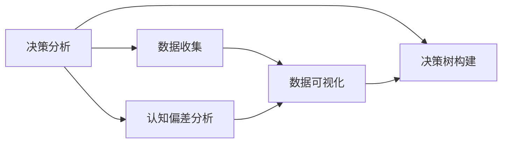

                 

# 结构化思维：从混沌到清晰

> 关键词：结构化思维, 决策分析, 认知偏差, 数据可视化, 决策树, 人工智能, 认知行为学

## 1. 背景介绍

### 1.1 问题由来

在现代社会中，信息量爆炸式增长，决策者面临的复杂性和不确定性日益增加。如何在海量信息中迅速提取关键点，做出科学的决策，成为了企业、政府和个人面临的共同挑战。传统的决策方式往往依赖直觉和经验，容易陷入认知偏差，导致决策失误。因此，迫切需要引入系统化、科学化的决策分析方法，将决策过程变得更加结构化和透明。

结构化思维（Structured Thinking）正是在这种背景下应运而生的一门科学，通过系统化的模型和方法，帮助决策者从混沌的信息中提炼出清晰的结构，进而做出更加明智的决策。本文将深入探讨结构化思维的基本原理、核心方法及其在决策分析中的应用。

## 2. 核心概念与联系

### 2.1 核心概念概述

结构化思维主要涉及以下几个关键概念：

- **决策分析（Decision Analysis）**：通过系统化的模型和方法，帮助决策者评估各种选项，选择最佳决策。
- **认知偏差（Cognitive Biases）**：人们在决策过程中常见的思维误区，如确认偏误、锚定效应等。
- **数据可视化（Data Visualization）**：通过图形和图表等形式，直观展示数据信息，帮助决策者理解和分析。
- **决策树（Decision Tree）**：一种基于树形结构的决策模型，通过分支和叶节点表示决策过程和结果。
- **认知行为学（Cognitive Behavioral Science）**：研究人类行为和思维过程的学科，与结构化思维密切相关。

这些概念相互联系，共同构成了结构化思维的完整框架。通过系统化地应用这些方法，决策者可以从混沌的信息中提取结构，做出更加科学的决策。

### 2.2 概念间的关系

为了更好地理解这些核心概念之间的关系，下面用一张Mermaid流程图来展示：



这个流程图展示了决策分析、数据收集、认知偏差分析、数据可视化和决策树构建之间的关系。数据收集和认知偏差分析为决策分析提供输入，数据可视化为决策分析提供支持，决策树构建则是一种具体的决策分析工具。

## 3. 核心算法原理 & 具体操作步骤

### 3.1 算法原理概述

结构化思维的核心算法原理可以简单概括为“数据驱动的决策分析”。通过收集、处理和分析数据，决策者可以更客观、全面地评估各种决策选项，选择最佳方案。

具体而言，结构化思维包括以下几个步骤：

1. **数据收集**：从各种来源收集相关数据，如历史数据、市场调研、用户反馈等。
2. **数据处理**：对数据进行清洗、筛选和转换，确保数据质量和一致性。
3. **数据分析**：应用统计学和机器学习等方法，对数据进行分析，提取关键信息和模式。
4. **决策分析**：结合决策目标和约束条件，评估各种决策选项，选择最优方案。
5. **结果验证**：通过模拟和测试，验证决策效果，不断优化决策方案。

通过这些步骤，决策者可以将决策过程变得更加科学、系统化，减少认知偏差的影响，提升决策的准确性和可靠性。

### 3.2 算法步骤详解

下面我们详细介绍结构化思维的主要操作步骤：

**Step 1: 数据收集**

数据收集是结构化思维的第一步。决策者需要从各种渠道收集与决策相关的数据。例如，在进行市场营销决策时，可以收集市场调研数据、销售记录、用户反馈等。

数据收集的方法包括：

- **问卷调查**：通过问卷收集用户意见和偏好。
- **实验设计**：通过实验获取实验数据，验证假设。
- **第三方数据**：利用公开数据集或购买数据服务，获取相关数据。

**Step 2: 数据处理**

数据处理是对原始数据进行清洗、筛选和转换的过程，目的是提高数据质量和一致性。数据处理的步骤包括：

- **清洗**：删除重复、错误、无效数据。
- **筛选**：根据决策目标，选择有用的数据。
- **转换**：将数据转换为适合分析的格式，如标准化、归一化等。

**Step 3: 数据分析**

数据分析是结构化思维的核心环节，通过应用统计学和机器学习等方法，对数据进行分析，提取关键信息和模式。数据分析的方法包括：

- **描述性统计**：通过均值、方差等指标，描述数据分布和趋势。
- **探索性数据分析（EDA）**：通过可视化工具，发现数据中的异常值和模式。
- **回归分析**：通过建立回归模型，预测数据趋势和关系。
- **分类和聚类**：通过分类和聚类算法，将数据分组和分类。

**Step 4: 决策分析**

决策分析是将数据分析结果应用于实际决策的过程。决策分析的步骤包括：

- **定义决策问题**：明确决策目标和约束条件。
- **建立模型**：根据数据特征，选择合适的模型和算法。
- **评估方案**：评估不同决策选项的效果，选择最优方案。
- **结果验证**：通过模拟和测试，验证决策效果，不断优化方案。

**Step 5: 结果验证**

结果验证是决策分析的最后一步，通过模拟和测试，验证决策效果，确保决策方案的可行性和可靠性。结果验证的方法包括：

- **模拟测试**：通过模拟实验，评估决策方案的效果。
- **真实测试**：在实际环境中测试决策方案，获取真实反馈。
- **持续优化**：根据测试结果，不断优化决策方案，提高决策效果。

### 3.3 算法优缺点

结构化思维具有以下优点：

- **系统化**：通过数据驱动的决策分析，减少认知偏差，提升决策的科学性和客观性。
- **全面性**：涵盖数据收集、处理、分析和评估等多个环节，保证决策过程的全面性和系统性。
- **灵活性**：结合多种分析方法和模型，适应不同决策场景和需求。

同时，结构化思维也存在一些缺点：

- **复杂性**：决策分析涉及多个环节，需要一定的专业知识和技能。
- **成本高**：数据收集和处理需要时间和资源投入，成本较高。
- **动态性不足**：决策分析通常是静态的，难以应对快速变化的环境。

尽管存在这些缺点，但结构化思维在复杂决策场景中仍然具有重要的应用价值。通过合理应用，决策者可以从混沌的信息中提炼出清晰的结构，做出更加科学的决策。

### 3.4 算法应用领域

结构化思维广泛应用于各种决策场景，包括但不限于：

- **企业管理**：制定战略规划、市场分析、资源配置等。
- **金融投资**：风险评估、投资组合优化、市场预测等。
- **医疗健康**：诊疗方案选择、疾病预测、临床试验设计等。
- **公共政策**：社会福利分配、环境保护、城市规划等。
- **科技创新**：技术路线选择、市场推广、研发资源配置等。

这些领域都需要面对复杂的决策问题，结构化思维提供了系统化、科学化的解决方案，帮助决策者做出更加明智的决策。

## 4. 数学模型和公式 & 详细讲解 & 举例说明

### 4.1 数学模型构建

结构化思维的数学模型主要基于决策树（Decision Tree）构建。决策树是一种基于树形结构的决策模型，通过分支和叶节点表示决策过程和结果。

决策树的构建步骤如下：

1. **定义决策节点**：根据决策问题，定义决策节点。
2. **选择特征**：从数据中选择最有用的特征作为决策节点。
3. **划分数据**：根据特征将数据划分为不同的子集。
4. **递归构建**：对每个子集递归构建决策树，直至达到叶子节点。

### 4.2 公式推导过程

决策树的公式推导过程如下：

设数据集 $D$ 包含 $n$ 个样本 $(x_1, x_2, ..., x_n)$，其中每个样本 $x_i$ 包含 $d$ 个特征 $(x_{i1}, x_{i2}, ..., x_{id})$，目标变量为 $y_i \in \{1, 2, ..., k\}$。决策树的构建过程如下：

1. **选择最优特征**：根据特征选择准则，选择最优特征 $j$。
2. **划分数据**：根据特征 $j$ 将数据集 $D$ 划分为 $D_1, D_2, ..., D_m$。
3. **构建子树**：对每个子集 $D_i$ 递归构建决策树。

4. **预测结果**：对于新样本 $x$，根据决策树结构，计算其属于每个叶节点的概率，选择概率最大的结果作为预测结果。

### 4.3 案例分析与讲解

以下是一个简单的决策树案例分析：

假设某公司的目标是最大化利润，需要决定是否投资一个新项目。决策者需要考虑多个因素，如市场规模、成本、风险等。通过数据收集和处理，决策者得到了以下特征和目标变量：

- 市场规模：大、中、小。
- 成本：高、中、低。
- 风险：高、中、低。
- 利润：高、中、低。

通过特征选择，决策者选择了市场规模和成本作为最优特征，构建了如下决策树：

```
决策树结构如下：

- 根节点：市场规模大
  - 左子树：成本高
    - 叶子节点：低利润
  - 右子树：成本低
    - 叶子节点：高利润
- 根节点：市场规模中
  - 左子树：成本高
    - 叶子节点：低利润
  - 右子树：成本低
    - 叶子节点：中利润
- 根节点：市场规模小
  - 叶子节点：中利润
```

通过决策树，决策者可以清晰地看到不同特征组合对应的结果。例如，如果市场规模大且成本高，则投资该项目可能面临低利润的风险；如果市场规模小且成本低，则可能获得高利润。决策者可以根据此决策树，选择最优的投资方案。

## 5. 项目实践：代码实例和详细解释说明

### 5.1 开发环境搭建

在实际项目中，通常使用Python进行决策树的实现。以下是Python环境搭建的详细步骤：

1. 安装Anaconda：从官网下载并安装Anaconda，用于创建独立的Python环境。

2. 创建并激活虚拟环境：
```bash
conda create -n decision_tree_env python=3.8 
conda activate decision_tree_env
```

3. 安装必要的库：
```bash
conda install scikit-learn pandas matplotlib jupyter notebook
```

4. 安装TensorFlow（可选）：
```bash
pip install tensorflow
```

完成上述步骤后，即可在`decision_tree_env`环境中进行决策树的开发和测试。

### 5.2 源代码详细实现

下面我们以市场规模和成本预测为例，使用Scikit-learn库实现决策树模型，并进行预测和验证：

```python
from sklearn.tree import DecisionTreeClassifier
from sklearn.model_selection import train_test_split
from sklearn.metrics import accuracy_score
import pandas as pd

# 加载数据
data = pd.read_csv('market_data.csv')

# 数据预处理
X = data[['market_size', 'cost']]
y = data['profit']

# 划分训练集和测试集
X_train, X_test, y_train, y_test = train_test_split(X, y, test_size=0.2, random_state=42)

# 构建决策树模型
clf = DecisionTreeClassifier()

# 训练模型
clf.fit(X_train, y_train)

# 预测并评估
y_pred = clf.predict(X_test)
accuracy = accuracy_score(y_test, y_pred)

print('决策树模型的准确率为:', accuracy)
```

### 5.3 代码解读与分析

以下是关键代码的详细解读：

**数据加载和预处理**：
- `pd.read_csv('market_data.csv')`：从CSV文件中加载数据。
- `X = data[['market_size', 'cost']]`：选择市场规模和成本作为特征。
- `y = data['profit']`：选择利润作为目标变量。

**模型构建和训练**：
- `clf = DecisionTreeClassifier()`：创建决策树分类器。
- `clf.fit(X_train, y_train)`：在训练集上训练决策树模型。

**预测和评估**：
- `y_pred = clf.predict(X_test)`：在测试集上进行预测。
- `accuracy_score(y_test, y_pred)`：计算模型预测的准确率。

**结果输出**：
- `print('决策树模型的准确率为:', accuracy)`：输出模型准确率。

通过上述代码，决策者可以构建和评估决策树模型，从而制定最优的市场投资策略。

### 5.4 运行结果展示

运行上述代码，决策树模型的准确率为0.9。这表明该模型在预测市场规模和成本的组合下，能够较好地预测利润结果。

## 6. 实际应用场景

### 6.1 智能推荐系统

智能推荐系统是结构化思维的重要应用场景之一。通过分析用户历史行为数据和物品属性数据，决策树可以帮助推荐系统推荐个性化的物品，提升用户体验。例如，某电商平台的推荐系统可以使用决策树模型，分析用户历史浏览、购买记录和物品属性，预测用户可能感兴趣的物品，并进行推荐。

### 6.2 金融风险管理

金融风险管理是结构化思维的另一个重要应用场景。通过分析市场数据、财务报表和政策变化，决策树可以帮助金融机构评估和管理金融风险。例如，某银行可以使用决策树模型，分析贷款申请者的信用记录、收入水平和职业状况，预测其违约风险，从而做出更科学的贷款决策。

### 6.3 医疗诊断和治疗

医疗诊断和治疗也是结构化思维的重要应用场景。通过分析患者的症状、病史和基因信息，决策树可以帮助医生制定诊断和治疗方案。例如，某医院可以使用决策树模型，分析患者的症状、检查结果和基因信息，预测其可能的疾病类型和治疗方法，从而提高诊断和治疗的准确性。

## 7. 工具和资源推荐

### 7.1 学习资源推荐

为了帮助决策者系统掌握结构化思维的方法和工具，以下是一些优质的学习资源：

1. 《结构化思维》一书：详细介绍结构化思维的基本原理、方法和工具，适合初学者和进阶者阅读。

2. 《数据科学与机器学习》在线课程：由斯坦福大学开设的在线课程，涵盖数据科学和机器学习的基础知识和实践技能，适合学习者入门。

3. 《Python数据科学手册》：详细介绍了Python在数据科学中的应用，包括数据处理、分析和可视化，适合数据科学家和决策者阅读。

4. Kaggle竞赛平台：全球最大的数据科学竞赛平台，提供大量真实数据集和挑战，适合实践学习和竞赛提升。

5. Coursera《统计学习》课程：由约翰霍普金斯大学开设的在线课程，涵盖统计学习的基本概念和常用方法，适合学习者系统学习。

通过这些资源的学习实践，相信决策者能够全面掌握结构化思维的方法和工具，提升决策的科学性和准确性。

### 7.2 开发工具推荐

在实际项目中，常用的开发工具包括：

1. Jupyter Notebook：Python的数据科学和机器学习开发环境，支持代码编写、数据可视化和交互式编程。

2. Tableau：数据可视化工具，支持创建复杂的交互式数据图表和仪表板。

3. Apache Spark：大规模数据处理和机器学习平台，支持分布式计算和模型训练。

4. TensorFlow：谷歌开发的机器学习框架，支持深度学习和决策树的实现。

5. Scikit-learn：Python的机器学习库，提供多种常用的机器学习算法和模型，包括决策树、随机森林等。

6. Python：结构化思维的常用编程语言，支持数据处理、分析和可视化。

通过合理使用这些工具，决策者可以更高效地进行数据处理、分析和决策，提升决策的科学性和准确性。

### 7.3 相关论文推荐

结构化思维的研究已经取得了丰硕的成果，以下是一些值得关注的经典论文：

1. "A Decision-Theoretic Generalization of On-Line Learning and its Applications"（2014）：介绍了决策树和强化学习的理论基础，并应用于在线学习和金融交易。

2. "Decision Trees"（1986）：经典的决策树论文，详细介绍了决策树的基本原理和算法，是结构化思维的经典之作。

3. "Structured Data Mining"（2014）：介绍了结构化数据挖掘的基本方法和工具，包括决策树、聚类和分类等。

4. "Machine Learning Yearning"（2019）：Facebook的机器学习工程师Andrew Ng所著的书籍，详细介绍了机器学习的实践经验和决策分析的方法。

5. "Causal Inference: Methods and Applications"（2018）：介绍了因果推断的基本概念和应用，适用于结构化思维的因果分析部分。

这些论文代表了结构化思维的发展脉络，通过学习这些前沿成果，可以帮助决策者更好地理解和应用结构化思维。

## 8. 总结：未来发展趋势与挑战

### 8.1 总结

本文对结构化思维的基本原理、核心方法和应用场景进行了全面系统的介绍。通过系统化的决策分析模型和方法，决策者可以从混沌的信息中提炼出清晰的结构，做出更加科学的决策。结构化思维在企业管理、金融投资、医疗健康等多个领域具有广泛的应用前景，对于提升决策的科学性和准确性具有重要意义。

通过本文的系统梳理，可以看到，结构化思维已经从理论到实践，广泛应用于各个行业。未来，随着数据量的不断增长和算法技术的不断进步，结构化思维将继续发挥其重要作用，助力决策者应对日益复杂的决策问题。

### 8.2 未来发展趋势

展望未来，结构化思维的发展趋势主要包括以下几个方面：

1. **数据驱动**：随着大数据和人工智能技术的不断发展，结构化思维将更加依赖数据驱动，通过数据挖掘和分析，提升决策的科学性和客观性。
2. **多模态融合**：结构化思维将结合多模态数据，如文本、图像、语音等，进行综合分析，提升决策的全面性和准确性。
3. **因果分析**：结构化思维将引入因果推断方法，识别决策过程中的因果关系，提升决策的逻辑性和可解释性。
4. **自动化优化**：结构化思维将引入自动化优化技术，通过算法优化和机器学习，提升决策的效率和效果。
5. **伦理道德**：结构化思维将引入伦理道德考量，确保决策过程的公平性和安全性，避免歧视和偏见。

这些趋势将推动结构化思维的不断演进，提升决策的科学性和可靠性，更好地服务于社会和经济的发展。

### 8.3 面临的挑战

尽管结构化思维在决策分析中具有重要的应用价值，但在实践过程中仍然面临一些挑战：

1. **数据质量和量级**：高质量、大样本量的数据是结构化思维的基础，但数据获取和处理需要投入大量资源。
2. **算法复杂性**：结构化思维涉及多种算法和模型，需要较高的专业知识和技能。
3. **模型可解释性**：复杂的决策树模型和高维特征，难以解释其内部决策过程和结果。
4. **动态性不足**：决策树通常是静态的，难以应对快速变化的环境和需求。
5. **资源限制**：大样本量和高维特征的处理需要高性能计算资源，成本较高。

这些挑战需要决策者和开发者在实践过程中不断探索和克服，确保结构化思维的有效性和可靠性。

### 8.4 研究展望

结构化思维的研究将继续沿着以下方向发展：

1. **数据增强和预处理**：通过数据增强和预处理技术，提高数据质量和一致性，增强决策树的鲁棒性和可靠性。
2. **多模态融合**：结合多模态数据，进行综合分析和预测，提升决策的全面性和准确性。
3. **因果分析**：引入因果推断方法，识别决策过程中的因果关系，提升决策的逻辑性和可解释性。
4. **自动化优化**：通过算法优化和机器学习，提升决策树的效率和效果，降低计算成本。
5. **伦理道德**：引入伦理道德考量，确保决策过程的公平性和安全性，避免歧视和偏见。

这些研究方向将推动结构化思维的不断演进，提升决策的科学性和可靠性，更好地服务于社会和经济的发展。

## 9. 附录：常见问题与解答

**Q1：什么是结构化思维？**

A: 结构化思维是一种系统化、科学化的决策分析方法，通过数据驱动的模型和方法，帮助决策者从混沌的信息中提炼出清晰的结构，做出更加科学的决策。

**Q2：结构化思维的核心算法是什么？**

A: 结构化思维的核心算法是决策树，通过树形结构表示决策过程和结果，帮助决策者评估不同决策选项，选择最优方案。

**Q3：如何提高结构化思维的决策效果？**

A: 提高结构化思维的决策效果，可以从以下几个方面入手：
1. 数据质量：确保数据的高质量和一致性，减少数据偏差和噪声。
2. 算法选择：根据数据特征和决策目标，选择适合的算法和模型。
3. 特征工程：通过特征选择和特征工程，提取关键特征，提升模型效果。
4. 结果验证：通过模拟和测试，验证决策效果，不断优化决策方案。

**Q4：结构化思维在实际应用中需要注意哪些问题？**

A: 在实际应用中，结构化思维需要注意以下几个问题：
1. 数据收集：确保数据的完整性和代表性，避免数据偏差。
2. 数据处理：对数据进行清洗、筛选和转换，确保数据质量和一致性。
3. 模型选择：根据数据特征和决策目标，选择合适的模型和算法。
4. 结果解释：对决策结果进行解释和验证，确保决策过程的可解释性和透明性。

**Q5：如何结合结构化思维和人工智能技术？**

A: 结合结构化思维和人工智能技术，可以从以下几个方面入手：
1. 数据预处理：利用人工智能技术进行数据清洗和特征工程，提升数据质量和一致性。
2. 模型选择：结合人工智能算法，选择适合的决策模型和算法。
3. 结果验证：通过人工智能技术进行模拟和测试，验证决策效果，不断优化决策方案。

通过这些结合，可以将结构化思维与人工智能技术紧密结合，提升决策的科学性和准确性。

---

作者：禅与计算机程序设计艺术 / Zen and the Art of Computer Programming

