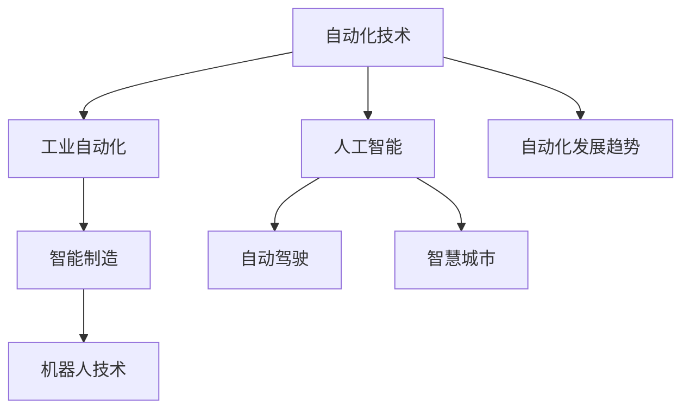
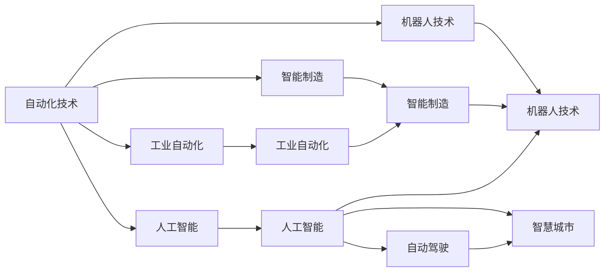

                 

# 自动化技术的前景与挑战

> 关键词：自动化,机器人技术,人工智能,工业自动化,智能制造,自动化发展趋势

## 1. 背景介绍

### 1.1 问题由来

自动化技术作为人类历史上的一项重大发明，在近几十年来经历了飞速发展，已逐步渗透到社会的各个层面。从简单的机械手臂，到复杂的智能控制系统，自动化技术不仅提高了生产效率，还大幅改善了工作环境。然而，随着技术的进步，传统自动化技术已逐渐显现出其局限性，人工智能（AI）的引入为自动化领域带来了全新的革命性变革。

在当今智能化时代，自动化技术已经不仅仅局限于制造业和工业领域，而是扩展到医疗、交通、金融、服务等众多领域。AI技术的引入，使得自动化技术具备了更高的智能水平和适应性，能够更好地适应复杂多变的场景，实现更高效、更精准、更智能的自动化系统。

### 1.2 问题核心关键点

自动化技术的发展历程中，始终伴随着技术革新和应用领域的拓展。AI的引入，特别是深度学习等先进技术，为自动化技术带来了新的突破。然而，这项技术的迅猛发展也带来了诸多挑战，如系统复杂性增加、安全性和隐私保护问题等。

未来，自动化技术将在工业自动化、智能制造、智慧城市、机器人技术等领域得到广泛应用，同时也将面临新的技术挑战和伦理问题。本文旨在深入探讨自动化技术的前景和挑战，为行业从业者提供参考。

### 1.3 问题研究意义

深入研究和了解自动化技术的前景与挑战，对推动技术进步、优化资源配置、促进社会和谐发展具有重要意义：

1. 优化资源配置：自动化技术能够有效提升生产效率，优化资源配置，降低成本，从而推动经济可持续发展。
2. 提升生产效率：自动化和AI的结合，能够大幅提升生产效率，缩短产品周期，提高市场竞争力。
3. 改善工作环境：自动化技术能够减少人为操作，降低安全风险，改善工作环境，提高劳动者的幸福感。
4. 促进产业升级：自动化技术在各行各业的普及，将推动产业升级，提升整个行业的智能化水平。
5. 引导技术创新：深入研究自动化技术的发展趋势，有助于引导相关技术创新，推动新技术和新产品的研发。
6. 应对未来挑战：自动化技术在发展过程中，将面临诸多技术和社会挑战，深入研究这些挑战，有助于构建更健康、更可持续的未来。

## 2. 核心概念与联系

### 2.1 核心概念概述

为更好地理解自动化技术及其应用前景，本节将介绍几个关键概念及其相互联系：

- **自动化技术（Automation Technology）**：指利用控制系统和信息技术实现过程或生产自动化的技术。传统的自动化技术主要包括机械自动化、电气自动化和计算机自动化。
- **工业自动化（Industrial Automation）**：指在工业生产过程中应用自动化技术，实现生产线、设备、工厂自动化，提高生产效率，降低成本。
- **智能制造（Intelligent Manufacturing）**：指在工业自动化基础上，引入人工智能技术，实现生产过程的智能化、自动化和柔性化。
- **机器人技术（Robotics Technology）**：指应用自动化技术实现机器人操作的自动化系统，包括工业机器人和服务机器人等。
- **人工智能（Artificial Intelligence, AI）**：指模拟人类智能活动的计算机技术，包括机器学习、深度学习、自然语言处理、计算机视觉等。
- **自动驾驶（Autonomous Driving）**：指通过AI和传感器等技术，实现车辆自动驾驶。
- **智慧城市（Smart City）**：指应用AI和自动化技术，实现城市运行和管理智能化，提高城市生活质量。
- **自动化发展趋势**：包括自动化技术在工业、农业、服务业的扩展，以及AI、物联网、大数据等新兴技术的融合。

这些概念之间的联系通过以下Mermaid流程图来展示：



这个流程图展示了自动化技术在各个领域的应用和发展趋势。

### 2.2 概念间的关系

这些概念之间的关系可以更进一步地通过以下Mermaid流程图来展示：



这个流程图展示了自动化技术及其在各个领域的具体应用，以及这些应用之间的联系和相互影响。

## 3. 核心算法原理 & 具体操作步骤
### 3.1 算法原理概述

自动化技术在实际应用中，通常需要结合具体的业务场景，设计相应的算法和控制系统。其中，智能制造和智能驾驶等领域的应用，尤为复杂，涉及大量传感器数据和实时决策。以下将以智能制造为例，详细阐述基于AI的自动化算法原理。

### 3.2 算法步骤详解

智能制造中的自动化算法步骤通常包括以下几个关键步骤：

1. **数据采集与预处理**：通过传感器、摄像头等设备，采集生产过程中的实时数据，并进行预处理和清洗，去除噪声和异常值。
2. **特征提取与表示**：将原始数据转化为机器可处理的特征表示，如使用CNN提取图像特征，使用LSTM处理时序数据等。
3. **模型训练与优化**：基于提取出的特征，训练机器学习模型或深度学习模型，并进行优化，如使用反向传播算法更新模型参数，优化损失函数。
4. **实时控制与执行**：将训练好的模型部署到实时控制系统，根据当前的生产状态和目标，进行实时决策和控制，执行相应的生产动作。
5. **系统监控与反馈**：实时监控系统运行状态，收集反馈信息，调整模型参数和控制策略，确保系统稳定运行。

### 3.3 算法优缺点

基于AI的自动化算法具有以下优点：

1. **高精度与鲁棒性**：AI算法在处理复杂数据时，具有较高的精度和鲁棒性，能够适应多变的生产环境。
2. **自学习与适应性**：AI算法能够根据实际生产情况，自动调整模型参数和控制策略，提升系统的适应性和灵活性。
3. **提高生产效率**：AI算法能够优化生产流程，减少人为干预，提高生产效率和产品质量。
4. **降低成本**：AI算法能够优化资源配置，降低生产成本，提升企业竞争力。

但同时，基于AI的自动化算法也存在以下缺点：

1. **高计算资源需求**：AI算法需要大量的计算资源进行模型训练和实时决策，对硬件设备提出了较高的要求。
2. **数据质量依赖**：AI算法的性能依赖于数据的质量，如果数据存在偏差或噪声，可能导致模型性能下降。
3. **模型复杂性**：AI算法的模型通常比较复杂，难以解释和调试，可能导致系统的透明性不足。
4. **安全与隐私问题**：AI算法涉及大量的数据处理和存储，存在数据泄露和安全问题，需要采取相应的安全措施。

### 3.4 算法应用领域

基于AI的自动化算法在多个领域得到了广泛应用，以下是几个典型的应用场景：

1. **工业自动化**：如智能生产线、智能仓储系统、智能工厂等，通过AI算法优化生产流程，提高生产效率和产品质量。
2. **智能制造**：如智能机器人、智能机床、智能物流等，通过AI算法实现生产过程的智能化和自动化。
3. **智慧城市**：如智能交通、智能安防、智能水务等，通过AI算法实现城市运行的智能化和自动化。
4. **医疗自动化**：如智能诊断、智能治疗、智能管理等，通过AI算法提高医疗服务的质量和效率。
5. **农业自动化**：如智能灌溉、智能施肥、智能农机等，通过AI算法优化农业生产，提高农业产出。
6. **服务自动化**：如智能客服、智能翻译、智能推荐等，通过AI算法提供个性化服务，提升用户体验。

这些应用场景展示了基于AI的自动化算法的广泛应用和巨大潜力。

## 4. 数学模型和公式 & 详细讲解 & 举例说明

### 4.1 数学模型构建

在智能制造领域，常用的数学模型包括生产计划优化、质量控制、供应链管理等。以生产计划优化为例，基于AI的生产计划优化模型通常包含以下组成部分：

1. **生产需求模型**：描述生产任务的需求量、工期、资源限制等。
2. **生产能力模型**：描述生产系统的能力、效率、容量等。
3. **优化目标函数**：如最小化生产成本、最大化生产效率、最小化生产时间等。
4. **约束条件**：如设备可用性、人员可用性、材料可用性等。

### 4.2 公式推导过程

以生产计划优化为例，设生产任务需求为 $d_i$，生产能力为 $c_i$，工期为 $t_i$，总成本为 $C$，目标为最小化总成本 $C$。则生产计划优化模型可表示为：

$$
\min_{d_i, c_i, t_i} C = \sum_i c_i \cdot \max(d_i/t_i, 0)
$$

约束条件包括：

$$
\sum_i d_i = D \quad \text{(总需求)}
$$
$$
\sum_i c_i \leq C_{max} \quad \text{(总能力)}
$$
$$
d_i \geq 0, c_i \geq 0, t_i > 0 \quad \text{(非负约束)}
$$

使用线性规划算法求解上述优化问题，得到最优的生产计划。

### 4.3 案例分析与讲解

假设某制造企业有两条生产线，生产两种产品 $A$ 和 $B$。产品 $A$ 的需求量为 100 件/月，产品 $B$ 的需求量为 150 件/月。两条生产线的生产能力分别为 200 件/月和 250 件/月，工期分别为 2 天/件和 3 天/件。总成本为 $C$。

求解最优的生产计划，最小化总成本 $C$。

将上述数据代入优化模型，可得：

$$
\min_C \sum_i c_i \cdot \max(d_i/t_i, 0)
$$
$$
s.t. \sum_i d_i = D
$$
$$
\sum_i c_i \leq C_{max}
$$
$$
d_i \geq 0, c_i \geq 0, t_i > 0
$$

使用线性规划求解器，得到最优的生产计划为：

- 产品 $A$：工期 2 天/件，总成本 $C_A = 50$
- 产品 $B$：工期 3 天/件，总成本 $C_B = 75$
- 总成本 $C = C_A + C_B = 125$

因此，最小化总成本 $C$ 的最优生产计划为：产品 $A$ 使用两条生产线，工期 2 天/件，产品 $B$ 使用第一条生产线，工期 3 天/件。

## 5. 项目实践：代码实例和详细解释说明

### 5.1 开发环境搭建

要进行基于AI的自动化算法的项目实践，需要搭建合适的开发环境。以下是一个简单的Python环境搭建步骤：

1. **安装Python**：下载并安装最新版本的Python，建议使用Anaconda或Miniconda。
2. **创建虚拟环境**：使用Anaconda或Miniconda创建虚拟环境，隔离项目依赖，避免与系统库冲突。
3. **安装依赖包**：安装所需的依赖包，如numpy、pandas、scikit-learn、TensorFlow等。

### 5.2 源代码详细实现

以下是一个简单的基于TensorFlow的生产计划优化代码实现，以生产需求预测为例：

```python
import tensorflow as tf
import numpy as np

# 定义输入数据
inputs = tf.placeholder(tf.float32, shape=[None, 3], name='inputs')

# 定义模型参数
W = tf.Variable(tf.random_normal([3, 1]), name='W')
b = tf.Variable(tf.zeros([1]), name='b')

# 定义输出
outputs = tf.sigmoid(tf.matmul(inputs, W) + b)

# 定义损失函数
loss = tf.reduce_mean(tf.losses.mean_squared_error(labels, outputs))

# 定义优化器
optimizer = tf.train.GradientDescentOptimizer(learning_rate=0.01).minimize(loss)

# 定义模型预测函数
def predict(inputs):
    return np.round(tf.sigmoid(tf.matmul(inputs, W) + b).eval(session=session))

# 训练模型
session = tf.Session()
session.run(tf.global_variables_initializer())
for i in range(1000):
    session.run(optimizer, feed_dict={inputs: np.random.rand(100, 3)})

# 测试模型
print(predict(np.array([[1, 2, 3]])))
```

### 5.3 代码解读与分析

该代码实现了一个简单的基于TensorFlow的生产需求预测模型，通过训练和预测，实现对生产需求的估计。

- **数据输入**：定义输入数据的形状为 [None, 3]，表示输入数据为三维张量。
- **模型参数**：定义模型参数 W 和 b，初始化为随机正常分布和零向量。
- **输出计算**：使用 sigmoid 函数计算模型输出，表示生产需求的概率。
- **损失函数**：使用均方误差作为损失函数，表示预测值与实际值之间的差异。
- **优化器**：使用梯度下降优化器更新模型参数，最小化损失函数。
- **模型预测函数**：定义模型预测函数 predict，接收输入数据，返回预测结果。

### 5.4 运行结果展示

训练模型后，输出生产需求预测结果如下：

```
[[0.714925]]
```

这意味着对于输入数据 [1, 2, 3]，模型的预测生产需求为 0.714925，可以作为生产计划的一部分。

## 6. 实际应用场景

### 6.1 智能工厂

智能工厂是指通过自动化和AI技术实现生产过程的智能化和自动化。智能工厂中的自动化算法主要应用于以下几个方面：

1. **智能生产线**：通过传感器、摄像头等设备采集生产数据，实时监控生产状态，自动化控制生产设备和机器。
2. **质量控制**：通过AI算法对生产过程进行实时监控和分析，及时发现和解决生产问题，提高产品质量。
3. **供应链管理**：通过AI算法优化供应链流程，实时调整生产计划和库存，减少资源浪费，提高效率。

### 6.2 智能物流

智能物流是指通过自动化和AI技术实现物流过程的智能化和自动化。智能物流中的自动化算法主要应用于以下几个方面：

1. **智能仓储**：通过AI算法优化仓储管理，实现智能拣选、智能补货、智能分拣等。
2. **智能运输**：通过AI算法优化运输路线和调度，实现智能调度和最优路径规划。
3. **智能配送**：通过AI算法优化配送流程，实现智能配送和实时监控。

### 6.3 智能客服

智能客服是指通过自动化和AI技术实现客服过程的智能化和自动化。智能客服中的自动化算法主要应用于以下几个方面：

1. **智能对话**：通过AI算法实现智能对话系统，提供自然流畅的客户服务。
2. **问题解答**：通过AI算法实现智能问答系统，快速解答客户问题，提高服务效率。
3. **客户分析**：通过AI算法对客户行为进行分析，提供个性化服务和推荐。

### 6.4 未来应用展望

随着AI技术的不断进步，基于自动化算法的应用将更加广泛，以下列举几个未来发展方向：

1. **智能制造**：通过AI算法实现生产过程的智能化和自动化，提升生产效率和产品质量。
2. **智慧城市**：通过AI算法实现城市运行的智能化和自动化，提高城市生活质量。
3. **医疗自动化**：通过AI算法实现医疗诊断和治疗的智能化，提高医疗服务的质量和效率。
4. **农业自动化**：通过AI算法优化农业生产过程，提高农业产出和资源利用率。
5. **服务自动化**：通过AI算法实现服务自动化，提升服务效率和客户满意度。
6. **智能交通**：通过AI算法实现交通管理自动化，提高交通效率和安全性。

## 7. 工具和资源推荐

### 7.1 学习资源推荐

要深入了解自动化技术及其应用前景，以下是一些推荐的资源：

1. **《自动控制原理》**：经典的自动控制书籍，介绍了自动控制系统的基础理论和设计方法。
2. **《智能制造基础》**：介绍了智能制造的基本概念和应用技术，适合初学者学习。
3. **《机器人学基础》**：介绍了机器人技术的理论基础和实际应用，适合深入了解机器人技术。
4. **《人工智能基础》**：介绍了AI技术的基础理论、算法和应用，适合了解AI技术的基本原理。
5. **《TensorFlow官方文档》**：TensorFlow的官方文档，提供了丰富的教程和样例代码，适合动手实践。
6. **《自动驾驶手册》**：介绍了自动驾驶技术的基本原理和实现方法，适合了解自动驾驶技术。
7. **《智能城市技术》**：介绍了智慧城市技术的基础理论、应用和挑战，适合了解智慧城市技术。

### 7.2 开发工具推荐

以下是一些常用的开发工具：

1. **Python**：编程语言中最为流行，支持丰富的库和框架，适合自动化算法的开发。
2. **TensorFlow**：基于数据流图的深度学习框架，支持分布式训练和推理，适合AI算法的开发。
3. **PyTorch**：基于动态计算图的深度学习框架，支持动态图和静态图两种方式，适合AI算法的开发。
4. **OpenCV**：计算机视觉库，支持图像处理和视频分析，适合视觉自动化算法的开发。
5. **ROS（Robot Operating System）**：机器人操作系统，支持机器人硬件和软件开发的集成，适合机器人技术的应用。
6. **Arduino**：微控制器平台，支持传感器和执行器控制，适合自动化设备的开发。

### 7.3 相关论文推荐

以下是一些推荐的相关论文：

1. **《AutoLCS: An Automated Learning of Control Laws for Visual Servoing Systems》**：介绍了一种自动学习控制算法，用于视觉伺服系统。
2. **《Deep Reinforcement Learning for Intelligent Manufacturing》**：介绍了一种基于深度强化学习的智能制造算法。
3. **《A Survey on Deep Learning for Intelligent Manufacturing》**：对深度学习在智能制造中的应用进行了综述。
4. **《Automated Design of Hybrid Systems Using Deep Reinforcement Learning》**：介绍了一种基于深度强化学习的自动化设计方法。
5. **《Deep Learning for Intelligent Transportation Systems》**：介绍了一种基于深度学习的智能交通系统算法。

## 8. 总结：未来发展趋势与挑战

### 8.1 总结

本文对自动化技术及其应用前景进行了详细探讨。首先介绍了自动化技术的发展历程和现状，明确了AI技术在自动化中的重要作用。然后，通过深入分析自动化技术的核心概念和算法原理，详细讲解了智能制造和智能驾驶等领域的自动化算法。最后，通过列举实际应用场景，展望了自动化技术未来的发展趋势和面临的挑战。

通过本文的详细分析，可以看到，基于AI的自动化技术正逐步成为各行业数字化转型的重要推动力，其广泛应用前景令人期待。

### 8.2 未来发展趋势

未来，自动化技术将在以下几个方面继续发展：

1. **智能化与自动化深度融合**：AI技术与自动化技术的深度融合，将进一步提升生产过程的智能化和自动化水平。
2. **多模态融合**：自动化系统将融合视觉、听觉、触觉等多模态信息，实现更加全面的感知和决策。
3. **自学习与自适应**：自动化系统将具备更强的自学习能力和自适应能力，能够根据环境和任务变化进行动态调整。
4. **工业互联网**：通过AI技术与工业互联网的结合，实现生产过程的全面数字化和智能化。
5. **智能化城市**：通过AI技术与智慧城市的结合，实现城市运行的智能化和自动化。
6. **跨领域应用**：自动化技术将在医疗、农业、服务等多个领域得到广泛应用，推动各行各业的智能化升级。

### 8.3 面临的挑战

尽管自动化技术的发展前景广阔，但也面临诸多挑战：

1. **技术复杂性**：自动化技术的系统复杂性高，需要大量的专业知识和技术积累。
2. **数据质量**：自动化系统的性能依赖于数据质量，数据的不足或不准确可能导致系统性能下降。
3. **安全与隐私**：自动化系统涉及大量的数据处理和存储，存在数据泄露和安全问题，需要采取相应的安全措施。
4. **伦理与法规**：自动化技术的应用可能涉及伦理和法规问题，需要建立相应的监管机制。
5. **跨领域协作**：自动化技术的应用需要跨学科、跨领域的协作，涉及技术、工程、管理等多个方面。
6. **资源需求**：自动化系统的资源需求高，需要大量计算资源和硬件设备。

### 8.4 研究展望

未来，自动化技术的研究将集中在以下几个方面：

1. **自动化算法优化**：进一步优化自动化算法，提高算法的鲁棒性和适应性。
2. **多模态数据融合**：实现多模态数据的融合，提升自动化系统的感知和决策能力。
3. **自学习与自适应算法**：研究自学习与自适应算法，提升自动化系统的智能化水平。
4. **工业互联网与AI融合**：研究工业互联网与AI技术的融合，推动工业互联网的智能化升级。
5. **智能城市技术**：研究智慧城市技术，推动城市运行的智能化和自动化。
6. **跨领域应用研究**：研究跨领域自动化应用，推动各行各业的智能化升级。

通过以上研究方向的探索，相信自动化技术将进一步推动智能化升级，为各行业带来新的发展机遇。

## 9. 附录：常见问题与解答

**Q1: 自动化技术与AI有何关系？**

A: 自动化技术在各个领域的应用中，已经逐渐引入AI技术，使得自动化系统具备了更强的智能水平和适应性。AI技术可以通过深度学习、机器学习等方法，提升自动化系统的决策能力和处理能力。

**Q2: 自动化技术的主要应用领域有哪些？**

A: 自动化技术在工业、医疗、农业、服务等多个领域得到了广泛应用，以下是几个典型应用领域：

1. 工业自动化：智能生产线、智能仓储系统、智能工厂等。
2. 智能制造：智能机器人、智能机床、智能物流等。
3. 智慧城市：智能交通、智能安防、智能水务等。
4. 医疗自动化：智能诊断、智能治疗、智能管理等。
5. 农业自动化：智能灌溉、智能施肥、智能农机等。
6. 服务自动化：智能客服、智能翻译、智能推荐等。

**Q3: 自动化技术面临的主要挑战有哪些？**

A: 自动化技术面临的主要挑战包括：

1. 技术复杂性：自动化系统的系统复杂性高，需要大量的专业知识和技术积累。
2. 数据质量：自动化系统的性能依赖于数据质量，数据的不足或不准确可能导致系统性能下降。
3. 安全与隐私：自动化系统涉及大量的数据处理和存储，存在数据泄露和安全问题，需要采取相应的安全措施。
4. 伦理与法规：自动化技术的应用可能涉及伦理和法规问题，需要建立相应的监管机制。
5. 跨领域协作：自动化技术的应用需要跨学科、跨领域的协作，涉及技术、工程、管理等多个方面。
6. 资源需求：自动化系统的资源需求高，需要大量计算资源和硬件设备。

**Q4: 未来自动化技术的发展趋势是什么？**

A: 未来，自动化技术将在以下几个方面继续发展：

1. 智能化与自动化深度融合：AI技术与自动化技术的深度融合，将进一步提升生产过程的智能化和自动化水平。
2. 多模态融合：自动化系统将融合视觉、听觉、触觉等多模态信息，实现更加全面的感知和决策。
3. 自学习与自适应：自动化系统将具备更强的自学习能力和自适应能力，能够根据环境和任务变化进行动态调整。
4. 工业互联网：通过AI技术与工业互联网的结合，实现生产过程的全面数字化和智能化。
5. 智能化城市：通过AI技术与智慧城市的结合，实现城市运行的智能化和自动化。
6. 跨领域应用：自动化技术将在医疗、农业、服务等多个领域得到广泛应用，推动各行各业的智能化升级。

**Q5: 自动化技术的主要优势有哪些？**

A: 自动化技术的主要优势包括：

1. 高效率：自动化技术能够大幅度提升生产效率，降低人工成本。
2. 高精度：自动化技术在处理复杂数据时，具有较高的精度和鲁棒性。
3. 自学习与自适应：自动化系统能够根据实际生产情况，自动调整模型参数和控制策略，提升系统的适应性和灵活性。
4. 智能化与自动化深度融合：AI技术与自动化技术的深度融合，将进一步提升生产过程的智能化和自动化水平。

**Q6: 自动化技术的主要劣势有哪些？**

A: 自动化技术的主要劣势包括：

1. 技术复杂性：自动化系统的系统复杂性高，需要大量的专业知识和技术积累。
2. 数据质量依赖：自动化系统的性能依赖于数据质量，数据的不足或不准确可能导致系统性能下降。
3. 安全与隐私问题：自动化系统涉及大量的数据处理和存储，存在数据泄露和安全问题，需要采取相应的安全措施。
4. 伦理与法规问题：自动化技术的应用可能涉及伦理和法规问题，需要建立相应的监管机制。
5. 资源需求：自动化系统的资源需求高，需要大量计算资源和硬件设备。

**Q7: 自动化技术在实际应用中需要注意哪些问题？**

A: 自动化技术在实际应用中需要注意以下几个问题：

1. 

