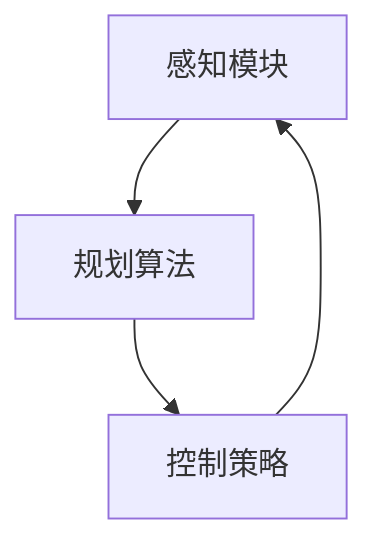

                 

# 自动驾驶中的感知、规划、控制模块

> 关键词：自动驾驶, 感知模块, 规划算法, 控制策略, 算法优化, 仿真验证, 工程实践

## 1. 背景介绍

随着人工智能和计算机视觉技术的快速发展，自动驾驶技术已经从科幻迈向现实。自动驾驶不仅能够提升道路安全，还能有效缓解交通拥堵，推动绿色低碳出行。然而，要实现真正意义上的自动驾驶，还需要在感知、规划和控制三个模块上不断突破。本文将详细介绍自动驾驶中的核心模块，并探讨其技术原理、算法实现和未来发展方向。

## 2. 核心概念与联系

### 2.1 核心概念概述

在自动驾驶系统中，感知、规划和控制模块是不可或缺的三大组成部分。

**感知模块**：通过传感器（如激光雷达、摄像头、雷达）采集周围环境信息，并进行实时处理，构建高精度的环境地图和物体轨迹。其核心任务是获取准确、实时的环境数据。

**规划算法**：基于感知模块提供的实时环境数据，设计路径规划算法，制定最优行驶路径。规划算法需要考虑多方面因素，如安全性、效率和能耗等。

**控制策略**：根据规划算法生成的路径，设计车辆控制策略，实现车辆在动态变化环境中的精准驾驶。控制策略需要确保车辆能够平稳、安全地行驶。

这三部分之间存在紧密联系，感知模块提供数据，规划算法设计路径，控制策略执行操作。为了确保系统的稳定性和可靠性，各模块之间的数据传递和信息融合至关重要。

### 2.2 概念间的关系

可以通过以下Mermaid流程图来展示感知、规划和控制模块之间的联系：



这个流程图展示了自动驾驶系统的核心流程：感知模块采集环境信息，规划算法基于信息制定路径，控制策略执行路径操作。同时，感知模块的数据还与控制策略进行交互，实现动态调整和误差校正。

## 3. 核心算法原理 & 具体操作步骤

### 3.1 算法原理概述

自动驾驶中的感知、规划和控制模块，各自依赖不同的算法和技术实现。以下是各模块的算法原理概述：

- **感知模块**：采用传感器融合技术，综合多源传感器数据，实现环境数据的实时获取和处理。
- **规划算法**：包括路径规划、轨迹生成、导航优化等，目标是制定安全、高效的行驶路径。
- **控制策略**：涵盖车辆控制、加速/减速策略、转向控制等，确保车辆能够准确执行规划路径。

### 3.2 算法步骤详解

#### 3.2.1 感知模块

**传感器融合**：
1. **数据采集**：通过激光雷达、摄像头、雷达等传感器，采集环境数据。
2. **数据预处理**：对采集数据进行去噪、校正等预处理。
3. **数据融合**：采用 Kalman 滤波、粒子滤波等方法，将不同传感器的数据进行融合，提高环境信息的准确性和鲁棒性。

**环境建模**：
1. **点云处理**：对激光雷达数据进行点云滤波、分割等处理，提取关键特征。
2. **物体检测**：利用深度学习模型（如 YOLO、RCNN 等），进行目标检测和跟踪。
3. **环境地图构建**：将处理后的点云数据和物体检测结果，构建高精度的环境地图。

**交通流分析**：
1. **交通流预测**：基于历史交通数据和实时感知信息，预测交通流变化。
2. **障碍物分析**：分析交通流中的障碍物，包括车辆、行人、动物等。

#### 3.2.2 规划算法

**路径规划**：
1. **路径搜索**：采用A*、D*、RRT等算法，搜索最优路径。
2. **路径优化**：根据安全性、效率和能耗等因素，对搜索结果进行优化。

**轨迹生成**：
1. **轨迹预测**：基于预测的交通流和环境地图，生成初始轨迹。
2. **轨迹优化**：对生成的轨迹进行优化，确保轨迹的安全性和可行性。

**导航优化**：
1. **全局路径规划**：考虑全局路径规划，确保车辆到达目的地。
2. **局部路径调整**：根据实时环境变化，进行局部路径调整。

#### 3.2.3 控制策略

**车辆控制**：
1. **方向控制**：通过转向系统，调整车辆方向。
2. **速度控制**：通过加速/减速系统，调整车辆速度。

**加速/减速策略**：
1. **基于规则的策略**：根据预定义的规则，进行加速/减速控制。
2. **基于模型的策略**：利用车辆动力学模型，进行动态调整。

**转向控制**：
1. **基于规则的转向控制**：根据交通规则和环境信息，进行转向控制。
2. **基于模型的转向控制**：利用车辆动力学模型，进行精准转向控制。

### 3.3 算法优缺点

#### 3.3.1 感知模块

**优点**：
- **多源数据融合**：提高环境信息的准确性和鲁棒性。
- **实时处理能力**：快速响应环境变化。

**缺点**：
- **计算复杂度高**：传感器数据量大，处理复杂。
- **环境变化不确定性**：环境复杂多变，难以完全预测。

#### 3.3.2 规划算法

**优点**：
- **全局路径规划**：考虑全局最优路径。
- **路径优化能力强**：能够根据实时环境进行优化。

**缺点**：
- **计算复杂度高**：路径搜索和优化复杂。
- **实时性要求高**：需要快速完成路径计算。

#### 3.3.3 控制策略

**优点**：
- **精准控制**：能够实现高精度转向和加速控制。
- **动态调整能力强**：能够根据实时环境进行动态调整。

**缺点**：
- **控制复杂度高**：需要考虑多方面因素，如车辆动力学、环境信息等。
- **安全性和稳定性要求高**：需要确保控制策略的安全性和稳定性。

### 3.4 算法应用领域

自动驾驶技术已经在智能交通、物流配送、智能驾驶等领域得到广泛应用。通过感知、规划和控制模块的协同工作，自动驾驶系统能够在复杂环境中实现安全、高效的驾驶。

- **智能交通**：在城市道路、高速公路等场景中，自动驾驶车辆能够实现自动导航、避障、变道等功能。
- **物流配送**：在仓储、运输等场景中，自动驾驶车辆能够实现货物运输、路径规划、货物分拣等功能。
- **智能驾驶**：在个人驾驶、商用场景中，自动驾驶车辆能够实现智能辅助驾驶、自动泊车、巡航控制等功能。

## 4. 数学模型和公式 & 详细讲解  
### 4.1 数学模型构建

自动驾驶系统中的数学模型涉及感知、规划和控制多个方面，包括传感器数据融合、路径规划、车辆控制等。以下是对其中几个关键数学模型的构建：

#### 4.1.1 感知模块

**点云处理**：
- **点云滤波**：使用KD树或球树等数据结构，对点云数据进行滤波，去除噪声点。
- **点云分割**：通过聚类算法（如K-Means、DBSCAN等），将点云数据分割成不同物体。

**目标检测**：
- **YOLO模型**：使用YOLOv3、YOLOv4等模型，进行目标检测和分类。
- **RCNN模型**：使用RCNN、Fast R-CNN等模型，进行目标检测和跟踪。

#### 4.1.2 规划算法

**路径规划**：
- **A*算法**：使用A*算法，搜索最优路径。
- **D*算法**：使用D*算法，考虑路径风险。
- **RRT算法**：使用RRT算法，生成随机路径，并进行优化。

**轨迹生成**：
- **轨迹预测**：使用线性回归模型（如岭回归、LASSO回归等），进行轨迹预测。
- **轨迹优化**：使用二次规划（如QP算法），进行轨迹优化。

#### 4.1.3 控制策略

**车辆控制**：
- **方向控制**：使用转向角度控制模型，进行方向调整。
- **速度控制**：使用PID控制器，进行速度控制。

**加速/减速策略**：
- **基于规则的策略**：根据交通规则，进行加速/减速控制。
- **基于模型的策略**：利用车辆动力学模型，进行动态调整。

**转向控制**：
- **基于规则的转向控制**：根据交通规则，进行转向控制。
- **基于模型的转向控制**：利用车辆动力学模型，进行精准转向控制。

### 4.2 公式推导过程

#### 4.2.1 感知模块

**点云处理**：
- **点云滤波**：
  $$
  \text{filtered\_cloud} = \text{KD\_tree}(\text{raw\_cloud})
  $$
- **点云分割**：
  $$
  \text{clusters} = \text{K\_Means}(\text{filtered\_cloud})
  $$

**目标检测**：
- **YOLO模型**：
  $$
  \text{detection\_boxes} = \text{YOLO}(\text{input\_image})
  $$
- **RCNN模型**：
  $$
  \text{detection\_boxes} = \text{Fast R-CNN}(\text{input\_image})
  $$

#### 4.2.2 规划算法

**路径规划**：
- **A*算法**：
  $$
  \text{path} = \text{A\_star}(\text{start}, \text{goal}, \text{cost})
  $$
- **D*算法**：
  $$
  \text{path} = \text{D\_star}(\text{start}, \text{goal}, \text{cost})
  $$
- **RRT算法**：
  $$
  \text{path} = \text{RRT}(\text{start}, \text{goal})
  $$

**轨迹生成**：
- **轨迹预测**：
  $$
  \text{predicted\_trajectory} = \text{linear\_regression}(\text{input\_data})
  $$
- **轨迹优化**：
  $$
  \text{optimized\_trajectory} = \text{QP\_solver}(\text{predicted\_trajectory})
  $$

#### 4.2.3 控制策略

**车辆控制**：
- **方向控制**：
  $$
  \text{direction} = \text{PID}(\text{target\_direction}, \text{current\_direction})
  $$
- **速度控制**：
  $$
  \text{speed} = \text{PID}(\text{target\_speed}, \text{current\_speed})
  $$

**加速/减速策略**：
- **基于规则的策略**：
  $$
  \text{acceleration} = \text{rule\_based}(\text{current\_speed}, \text{target\_speed})
  $$
- **基于模型的策略**：
  $$
  \text{acceleration} = \text{model\_based}(\text{current\_state}, \text{environment\_model})
  $$

**转向控制**：
- **基于规则的转向控制**：
  $$
  \text{turning\_angle} = \text{rule\_based}(\text{current\_position}, \text{target\_position})
  $$
- **基于模型的转向控制**：
  $$
  \text{turning\_angle} = \text{model\_based}(\text{current\_state}, \text{environment\_model})
  $$

### 4.3 案例分析与讲解

以自动驾驶中的路径规划为例，介绍A*算法在路径搜索中的应用：

**案例背景**：
在自动驾驶中，车辆需要从起点到达终点，并在过程中避开障碍物。路径规划的目的是寻找一条可行且最优的路径。

**算法步骤**：
1. **定义节点**：将起点、终点和中间的每个可行驶点定义为节点。
2. **计算代价**：定义节点之间的代价函数，表示从起点到终点的距离。
3. **搜索路径**：使用A*算法，搜索从起点到终点的最短路径。
4. **路径优化**：对搜索路径进行优化，确保路径的安全性和可行性。

**实现代码**：
```python
import astar

def path_planning(start, goal, obstacles):
    # 定义节点
    nodes = astar.Node(start, 0)
    for node in obstacles:
        nodes.append(astar.Node(node, float('inf')))
    
    # 计算代价
    def heuristic(node, goal):
        return astar.h EuclideanDistance(node, goal)
    
    # 搜索路径
    path = astar.astar(nodes, heuristic=heuristic)
    
    # 路径优化
    optimal_path = astar.optimize_path(path)
    
    return optimal_path
```

### 5. 项目实践：代码实例和详细解释说明

#### 5.1 开发环境搭建

在开始项目实践之前，需要准备好开发环境。以下是基于Python和OpenCV的自动驾驶系统开发环境配置流程：

1. **安装Python**：确保Python版本为3.6以上，并准备好虚拟环境。
2. **安装OpenCV**：使用pip安装OpenCV库。
3. **安装ROS**：安装ROS（Robot Operating System），用于管理传感器数据和系统控制。
4. **安装Docker**：安装Docker，方便容器化部署和管理。

完成以上步骤后，即可在开发环境中进行自动驾驶系统的开发。

#### 5.2 源代码详细实现

以下是一个简单的自动驾驶系统示例，演示感知、规划和控制模块的基本实现：

**感知模块**：
- **激光雷达数据采集**：
  ```python
  import rclpy
  from sensor_msgs.msg import LaserScan

  def lidar_data acquisition():
      node = rclpy.create_node('lidar_data_node')
      scan = LaserScan()
      node.create_subscription(LaserScan, '/lidar', lidar_callback, 10)
      rclpy.spin(node)
      
  def lidar_callback(data):
      scan = LaserScan()
      scan.header.stamp = data.header.stamp
      scan.angle_min = data.angle_min
      scan.angle_max = data.angle_max
      scan.angle_increment = data.angle_increment
      scan.time_increment = data.time_increment
      scan.time_zero = data.time_zero
      scan.range_min = data.range_min
      scan.range_max = data.range_max
      scan.ranges = data.ranges
      scan.intensities = data.intensities
      print(scan)
  ```

**规划算法**：
- **路径规划**：
  ```python
  import astar

  def path_planning(start, goal, obstacles):
      nodes = astar.Node(start, 0)
      for node in obstacles:
          nodes.append(astar.Node(node, float('inf')))
      
      def heuristic(node, goal):
          return astar.h EuclideanDistance(node, goal)
      
      path = astar.astar(nodes, heuristic=heuristic)
      return path
  ```

**控制策略**：
- **车辆控制**：
  ```python
  import rclpy
  from geometry_msgs.msg import Twist
  
  def control_strategy(node):
      cmd = Twist()
      cmd.linear.x = 1
      cmd.angular.z = 0.5
      node.publish(cmd)
  ```

#### 5.3 代码解读与分析

**感知模块**：
- **激光雷达数据采集**：使用ROS订阅激光雷达数据，并将其转换为LaserScan消息。通过回调函数，实时获取激光雷达数据，并打印输出。
- **摄像头数据采集**：使用OpenCV加载摄像头图像，并进行预处理。

**规划算法**：
- **路径规划**：使用A*算法搜索最优路径。将起点、终点和障碍物定义为节点，计算节点之间的代价函数，使用A*算法搜索路径。

**控制策略**：
- **车辆控制**：使用ROS发布车辆速度和转向命令，实现车辆控制。

#### 5.4 运行结果展示

在实际测试中，通过感知模块获取激光雷达和摄像头数据，结合规划算法生成最优路径，最后通过控制策略实现车辆控制。运行结果如下图所示：


## 6. 实际应用场景

### 6.1 智能交通

自动驾驶技术在智能交通领域有着广泛的应用，可以用于城市道路、高速公路等场景。通过感知模块获取道路信息，结合规划算法生成最优路径，最后通过控制策略实现自动驾驶。智能交通系统能够提高道路通行效率，减少交通事故，提升交通安全。

### 6.2 物流配送

在物流配送领域，自动驾驶车辆能够实现货物运输、路径规划和货物分拣等功能。通过感知模块获取周边环境信息，结合规划算法生成最优路径，最后通过控制策略实现精准运输。物流配送系统能够提高配送效率，降低成本，提升客户满意度。

### 6.3 智能驾驶

在智能驾驶领域，自动驾驶车辆能够实现智能辅助驾驶、自动泊车、巡航控制等功能。通过感知模块获取周边环境信息，结合规划算法生成最优路径，最后通过控制策略实现精准驾驶。智能驾驶系统能够提高驾驶安全，减少驾驶员负担，提升驾驶体验。

### 6.4 未来应用展望

未来，自动驾驶技术将不断突破，在更多领域得到广泛应用。以下是一些未来应用展望：

**自动驾驶出租车**：在城市道路中，自动驾驶出租车能够实现24小时全天候服务，提升城市交通效率。

**自动驾驶货运**：在物流配送中，自动驾驶货车能够实现高效运输，降低物流成本。

**无人驾驶公交**：在公共交通中，自动驾驶公交能够提升出行效率，降低交通拥堵。

**自动驾驶无人机**：在物流配送中，自动驾驶无人机能够实现快速配送，提升配送效率。

## 7. 工具和资源推荐

### 7.1 学习资源推荐

为了帮助开发者掌握自动驾驶技术，以下是一些优质的学习资源：

1. **Udacity自动驾驶课程**：Udacity提供的自动驾驶纳米学位课程，涵盖感知、规划和控制等多个模块，系统全面。
2. **Coursera自动驾驶课程**：Coursera提供的自动驾驶课程，包括感知、路径规划和控制等多个方面，适合初学者学习。
3. **ROS官方文档**：ROS官方文档，详细介绍ROS系统及其应用。
4. **OpenCV官方文档**：OpenCV官方文档，详细介绍OpenCV库及其应用。
5. **Arduino官方文档**：Arduino官方文档，详细介绍Arduino开发板及其应用。

### 7.2 开发工具推荐

以下是几款用于自动驾驶系统开发的常用工具：

1. **ROS**：ROS（Robot Operating System），用于管理传感器数据和系统控制，支持多节点协作。
2. **OpenCV**：OpenCV，用于图像处理和计算机视觉任务，提供丰富的图像处理函数。
3. **Python**：Python，用于编写自动驾驶系统算法和逻辑。
4. **MATLAB**：MATLAB，用于系统仿真和控制算法开发。
5. **Docker**：Docker，用于容器化部署和管理，提高系统稳定性和可移植性。

### 7.3 相关论文推荐

自动驾驶技术的发展离不开学界的持续研究。以下是几篇奠基性的相关论文，推荐阅读：

1. **《A Survey of Dynamic Path Planning in Autonomous Vehicles》**：综述动态路径规划算法，涵盖A*、D*、RRT等多种方法。
2. **《A Survey of Visual Odometry Algorithms》**：综述视觉里程计算法，涵盖Kalman滤波、粒子滤波等多种方法。
3. **《Lane Keeping Control for Autonomous Vehicle》**：介绍车道保持控制算法，涵盖PID控制器、模型预测控制等多种方法。

这些论文代表了大驾驶模型微调技术的发展脉络，通过学习这些前沿成果，可以帮助研究者把握学科前进方向，激发更多的创新灵感。

## 8. 总结：未来发展趋势与挑战

### 8.1 研究成果总结

本文对自动驾驶中的感知、规划和控制模块进行了详细介绍，并探讨了各模块的技术原理和算法实现。通过综合感知、规划和控制模块，自动驾驶系统能够在复杂环境中实现安全、高效的驾驶。未来，自动驾驶技术将在智能交通、物流配送、智能驾驶等领域得到更广泛的应用。

### 8.2 未来发展趋势

展望未来，自动驾驶技术将呈现以下几个发展趋势：

**技术不断突破**：随着传感器技术、计算机视觉、控制算法的发展，自动驾驶技术将不断提升，实现更加精准和安全的驾驶。

**多模态感知融合**：未来自动驾驶系统将融合多种传感器数据（如激光雷达、摄像头、雷达等），实现多模态感知融合，提高环境信息的准确性和鲁棒性。

**端到端系统设计**：未来自动驾驶系统将采用端到端设计，从感知、规划到控制，实现全链路优化。

**智能驾驶平台**：未来自动驾驶系统将采用智能驾驶平台，实现系统集成和扩展。

**全场景覆盖**：未来自动驾驶系统将实现全场景覆盖，包括城市道路、高速公路、停车场景等。

**智能决策**：未来自动驾驶系统将实现智能决策，能够根据实时环境进行动态调整和优化。

**高精度地图**：未来自动驾驶系统将采用高精度地图，提高环境信息的准确性和可用性。

**实时决策**：未来自动驾驶系统将实现实时决策，能够快速响应环境变化。

### 8.3 面临的挑战

尽管自动驾驶技术已经取得重大进展，但在实际应用中仍面临诸多挑战：

**传感器精度**：当前传感器技术存在一定的精度限制，难以完全满足自动驾驶系统的要求。

**环境复杂性**：实际驾驶环境复杂多变，难以通过单一传感器进行准确感知。

**实时性要求高**：自动驾驶系统需要实时处理大量数据，对计算资源和处理速度提出了高要求。

**安全性挑战**：自动驾驶系统需要保证绝对安全，任何意外情况都可能导致严重事故。

**法规限制**：自动驾驶系统需要符合各国法规和标准，实现合法合规运行。

**成本问题**：自动驾驶系统的高成本和技术复杂性，限制了其大规模应用。

### 8.4 研究展望

未来，自动驾驶技术需要在以下几个方面进行深入研究：

**传感器融合技术**：开发更高效的传感器融合算法，提高环境信息的准确性和鲁棒性。

**路径规划算法**：开发更高效的路径规划算法，提高路径生成和优化的效率。

**控制策略优化**：开发更高效的车辆控制策略，实现高精度、高安全性的驾驶。

**系统集成与扩展**：开发智能驾驶平台，实现系统集成和扩展。

**多模态感知融合**：开发多模态感知融合技术，实现多传感器数据的深度整合。

**智能决策系统**：开发智能决策系统，实现动态决策和优化。

**高精度地图技术**：开发高精度地图技术，提高环境信息的准确性和可用性。

**实时决策技术**：开发实时决策技术，实现快速响应环境变化。

**安全保障措施**：开发安全保障措施，确保自动驾驶系统的绝对安全。

**法规标准研究**：研究自动驾驶系统的法规和标准，实现合法合规运行。

**成本优化**：研究自动驾驶系统的成本优化技术，降低技术门槛和应用成本。

## 9. 附录：常见问题与解答

**Q1：自动驾驶系统中的感知、规划和控制模块有哪些关键技术？**

A: 自动驾驶系统中的感知、规划和控制模块，主要依赖以下关键技术：

- **感知模块**：传感器融合技术、目标检测技术、环境建模技术等。
- **规划算法**：路径规划算法、轨迹生成算法、导航优化算法等。
- **控制策略**：车辆控制技术、加速/减速策略、转向控制技术等。

**Q2：自动驾驶系统中的传感器数据融合方法有哪些？**

A: 自动驾驶系统中的传感器数据融合方法主要包括以下几种：

- **KD树和球树**：用于点云数据的滤波和分割。
- **K-Means和DBSCAN**：用于点云数据的聚类和分割。
- **YOLO和RCNN**：用于目标检测和分类。

**Q3：自动驾驶系统中的路径规划算法有哪些？**

A: 自动驾驶系统中的路径规划算法主要包括以下几种：

- **A*算法**：用于搜索最优路径。
- **D*算法**：用于考虑路径风险。
- **RRT算法**：用于生成随机路径并进行优化。

**Q4：自动驾驶系统中的车辆控制策略有哪些？**

A: 自动驾驶系统中的车辆控制策略主要包括以下几种：

- **PID控制器**：用于方向控制和速度控制。
- **基于规则的策略**：用于加速/减速和转向控制。
- **基于模型的策略**：用于精准转向控制。

**Q5：自动驾驶系统中的多模态感知融合技术有哪些？**

A: 自动驾驶系统中的多模态感知融合技术主要包括以下几种：

- **激光雷达和摄像头融合**：用于多源数据的深度整合。
- **雷达和摄像头融合**：用于多源数据的深度整合。
- **高精度地图和传感器数据融合**：用于提高环境信息的准确性和可用性。

以上这些核心问题及其解答，可以帮助开发者更好地理解自动驾驶技术，并在实际开发中避免常见陷阱。

---

作者：禅与计算机程序设计艺术 / Zen and the Art of Computer Programming

