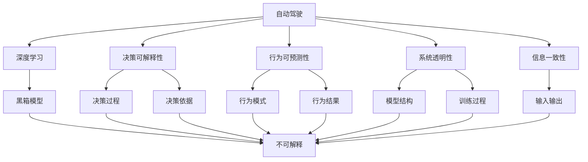
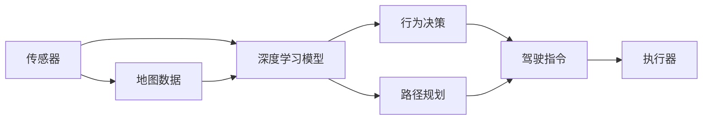
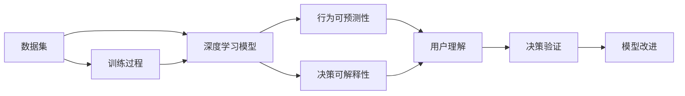
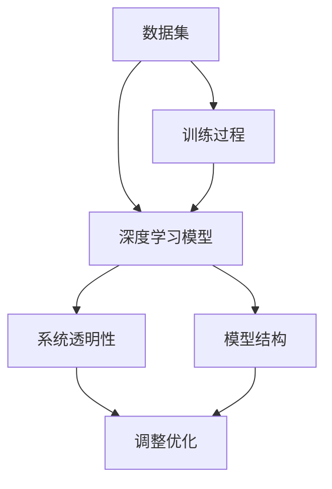
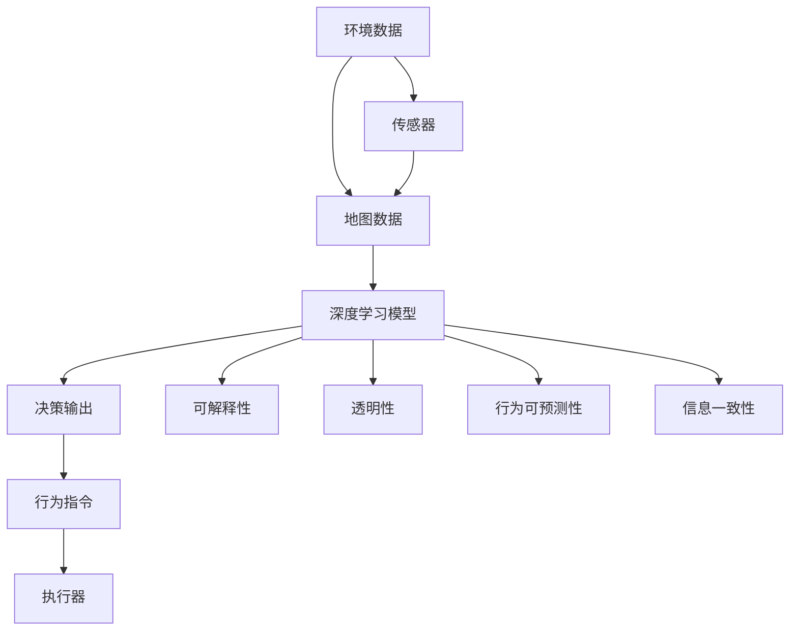

                 

# 自动驾驶算法的可解释性问题

> 关键词：自动驾驶, 算法透明性, 解释可信赖, 黑箱模型, 安全验证

## 1. 背景介绍

### 1.1 问题由来
自动驾驶技术作为未来智能交通的关键，近年来取得了显著的进展。然而，自动驾驶系统的核心——深度学习模型，因其复杂性高、难以直观理解，在实践中逐渐暴露出严重的可解释性问题。具体而言：

1. **黑箱特性**：深度神经网络因具有黑箱特性，其内部决策过程难以解释，导致用户对系统决策的信任度较低，尤其在关键时刻如事故发生时，用户难以接受自动驾驶系统的不透明决策。
2. **模型透明性**：自动驾驶算法需要具备高度透明性，以便相关人员能够理解模型的内部运行机制，确保系统的可解释性和可验证性。然而，现有深度学习模型往往难以满足这一要求。
3. **安全性问题**：由于模型的决策过程难以解释，当模型在复杂环境下发生错误时，无法明确指出错误的根本原因，导致故障排查和后续改进变得困难，从而影响系统安全性。

因此，自动驾驶算法的可解释性问题，成为当下自动驾驶技术落地的重要瓶颈。本文旨在探讨自动驾驶算法的可解释性问题，并提出有效的解决方案，以期推动自动驾驶技术的健康发展。

### 1.2 问题核心关键点
自动驾驶算法的可解释性问题主要包括以下几个核心点：

1. **决策可解释性**：自动驾驶系统在做出驾驶决策时，其依据的标准和逻辑需清晰可理解，便于用户和监管机构审核。
2. **行为可预测性**：系统行为应具备可预测性，用户和监管机构需能够理解系统在不同情境下的反应。
3. **系统透明性**：模型的训练过程和内部结构应具备透明性，便于对其进行调整和优化。
4. **信息一致性**：模型的输入、输出应与现实世界一致，避免因模型理解偏差导致的错误决策。

本文将围绕上述核心点，深入探讨自动驾驶算法的可解释性问题，并提出相应的解决方案。

## 2. 核心概念与联系

### 2.1 核心概念概述

为更好地理解自动驾驶算法的可解释性问题，本节将介绍几个关键概念：

- **自动驾驶**：指车辆通过传感器、地图、深度学习等技术实现自主导航和决策，无需人工干预。自动驾驶系统分为多个级别，从低级的驾驶辅助功能到完全自动驾驶，每个级别的系统复杂度和服务范围各异。
- **深度学习**：基于神经网络结构进行训练，通过多层非线性变换实现复杂模式识别和决策。深度学习模型因具备强大的泛化能力，在自动驾驶中得到广泛应用。
- **可解释性**：指模型的决策过程和内部逻辑是否清晰可理解，便于人类理解、调试和验证。
- **透明性**：指模型的内部结构和训练过程是否公开，便于外部审查和调整。
- **黑箱模型**：指无法直观理解其内部逻辑和决策过程的模型，深度学习模型常被称作黑箱模型。

这些概念之间的关系可以用以下Mermaid流程图来展示：



这个流程图展示了自动驾驶系统、深度学习模型与可解释性相关的各个概念及其关系。

### 2.2 概念间的关系

这些概念之间存在着紧密的联系，形成了自动驾驶系统决策可解释性的完整生态系统。下面通过几个Mermaid流程图来展示这些概念之间的关系。

#### 2.2.1 自动驾驶的决策过程



这个流程图展示了自动驾驶系统的决策过程。传感器获取环境信息，与地图数据结合后输入深度学习模型进行决策。决策结果包括行为决策和路径规划，最终转化为执行器动作。

#### 2.2.2 可解释性在自动驾驶中的应用



这个流程图展示了可解释性在自动驾驶中的应用。通过可解释性分析，用户和监管机构可以理解模型的行为可预测性和决策可解释性，从而验证模型行为和改进模型性能。

#### 2.2.3 透明性对自动驾驶的影响



这个流程图展示了透明性对自动驾驶的影响。透明性确保模型结构公开，便于进行模型调整和优化。

### 2.3 核心概念的整体架构

最后，我们用一个综合的流程图来展示这些核心概念在自动驾驶决策中的整体架构：



这个综合流程图展示了自动驾驶系统从环境数据输入到执行器输出的完整决策过程，同时突出了可解释性、透明性、行为可预测性和信息一致性在其中的关键作用。

## 3. 核心算法原理 & 具体操作步骤
### 3.1 算法原理概述

自动驾驶算法的可解释性问题，主要源于深度学习模型的黑箱特性。深度神经网络因具有多层非线性变换，其内部逻辑复杂且难以直观理解。因此，为了提升自动驾驶算法的可解释性，需要在模型设计、训练和部署等环节引入可解释性技术。

具体而言，可解释性技术主要包括以下几个方面：

1. **模型透明性**：使模型结构透明，便于用户和监管机构理解模型的工作原理。
2. **决策可解释性**：清晰地解释模型在决策过程中的依据和逻辑。
3. **行为可预测性**：确保模型在不同情境下表现一致，具备可预测性。
4. **信息一致性**：确保模型的输入、输出与现实世界一致。

这些技术的目标是构建可信赖、安全、透明的自动驾驶系统，保障其稳定性和可靠性。

### 3.2 算法步骤详解

下面详细介绍实现自动驾驶算法可解释性的关键步骤：

**Step 1: 选择合适的可解释性技术**

- **模型透明性**：使用可视化工具，如TensorBoard，绘制神经网络的结构图，解释网络各层的计算逻辑。
- **决策可解释性**：利用LIME、SHAP等局部可解释方法，分析模型对特定输入的决策依据。
- **行为可预测性**：使用测试集进行行为模式分析，评估模型在不同情境下的反应。
- **信息一致性**：进行模型验证，确保模型的输入、输出与现实世界一致。

**Step 2: 准备数据集和模型**

- 收集数据集，确保数据的多样性和覆盖度。
- 选择预训练模型，如卷积神经网络(CNN)、循环神经网络(RNN)、Transformer等。
- 设计任务适配层，如目标检测、语义分割、路径规划等。

**Step 3: 训练和验证模型**

- 在数据集上训练模型，使用交叉验证评估模型性能。
- 在验证集上进行行为模式分析和决策可解释性验证。
- 使用行为可预测性测试集评估模型在不同情境下的表现。
- 进行信息一致性验证，确保模型输出与现实世界一致。

**Step 4: 部署和监控模型**

- 将训练好的模型部署到自动驾驶系统中。
- 实时监控模型性能，及时发现和解决问题。
- 定期更新模型，确保系统始终具备高性能和可解释性。

### 3.3 算法优缺点

**优点：**

- 提升自动驾驶系统的透明度和可信度，增强用户和监管机构的信任感。
- 增强模型鲁棒性，提升系统安全性。
- 提供模型优化和改进的依据，提升系统性能。

**缺点：**

- 引入额外的计算复杂度，可能增加系统延迟。
- 需要额外的时间和资源进行模型解释和验证，可能影响系统效率。
- 解释方法可能存在局限性，难以解释过于复杂的决策过程。

### 3.4 算法应用领域

自动驾驶算法的可解释性问题，已经广泛应用于多个领域，例如：

1. **自动驾驶汽车**：涉及路径规划、目标检测、行为决策等多个方面，需要通过可解释性技术保障系统透明性和决策可靠性。
2. **智能交通系统**：需要清晰解释交通信号灯的决策逻辑，提升系统透明度。
3. **智能城市**：智能交通管理、安全监控等领域，需要通过可解释性技术确保系统行为可预测性和信息一致性。
4. **自动驾驶技术研究**：学术界在研究和开发过程中，需要通过可解释性技术验证模型的稳定性和可靠性。

## 4. 数学模型和公式 & 详细讲解 & 举例说明
### 4.1 数学模型构建

自动驾驶算法的可解释性问题，可以通过数学模型进行更严谨的分析和评估。以下是一个典型的数学模型构建过程：

假设自动驾驶系统由传感器、地图数据和深度学习模型组成，模型的输入为环境数据 $X$，输出为行为指令 $Y$。模型的训练目标是最大化输入输出的一致性 $p(Y|X)$，即：

$$
\max_{\theta} p(Y|X) = \frac{1}{Z} \exp(\theta^T f(X))
$$

其中 $\theta$ 为模型参数，$f(X)$ 为模型的特征提取函数，$Z$ 为归一化因子。

### 4.2 公式推导过程

以下详细推导模型在输入输出一致性下的最大似然估计公式：

根据似然函数的定义，有：

$$
p(Y|X) = \frac{p(Y|X,\theta)}{p(X)}
$$

将 $p(Y|X,\theta)$ 代入，得：

$$
p(Y|X) = \frac{1}{Z} \exp(\theta^T f(X))
$$

对 $\theta$ 求导，得：

$$
\frac{\partial}{\partial \theta} \log p(Y|X) = f(X)^T \frac{\partial}{\partial \theta} f(X)
$$

根据梯度上升法，有：

$$
\theta_{n+1} = \theta_n + \eta \frac{\partial}{\partial \theta} \log p(Y|X)
$$

其中 $\eta$ 为学习率。

### 4.3 案例分析与讲解

以自动驾驶系统中的目标检测为例，说明如何使用数学模型进行决策可解释性分析。

假设目标检测模型为 $F(x)$，输入为环境图像 $x$，输出为检测结果 $y$。模型的训练目标是最大化检测结果的一致性 $p(y|x)$，即：

$$
\max_{\theta} p(y|x) = \frac{1}{Z} \exp(\theta^T F(x))
$$

其中 $F(x)$ 为模型的特征提取函数，$\theta$ 为模型参数。

在实际应用中，可以通过LIME方法分析模型对特定输入 $x_0$ 的决策依据。LIME方法通过构造一组与 $x_0$ 相似的输入 $x_i$，计算模型对 $x_i$ 的决策输出 $y_i$，然后通过线性模型拟合 $y_i$ 和特征 $f(x_i)$ 之间的关系。具体步骤如下：

1. 对输入 $x_0$ 进行随机扰动，生成一组扰动样本 $x_i$。
2. 计算模型对 $x_i$ 的决策输出 $y_i$。
3. 通过线性回归模型 $y_i = \beta^T f(x_i)$ 拟合 $y_i$ 和特征 $f(x_i)$ 之间的关系。
4. 将 $f(x_0)$ 代入线性回归模型，得到模型对 $x_0$ 的决策依据 $\beta^T f(x_0)$。

通过这种方式，可以清晰地解释模型对特定输入的决策依据，提升决策可解释性。

## 5. 项目实践：代码实例和详细解释说明
### 5.1 开发环境搭建

在进行自动驾驶算法可解释性实践前，我们需要准备好开发环境。以下是使用Python进行TensorFlow开发的完整环境配置流程：

1. 安装Anaconda：从官网下载并安装Anaconda，用于创建独立的Python环境。

2. 创建并激活虚拟环境：
```bash
conda create -n tf-env python=3.7 
conda activate tf-env
```

3. 安装TensorFlow：根据CUDA版本，从官网获取对应的安装命令。例如：
```bash
pip install tensorflow
```

4. 安装相关库：
```bash
pip install numpy scipy matplotlib tqdm jupyter notebook
```

完成上述步骤后，即可在`tf-env`环境中开始自动驾驶算法可解释性的实践。

### 5.2 源代码详细实现

这里以目标检测为例，展示如何在TensorFlow中实现目标检测模型的可解释性分析。

```python
import tensorflow as tf
from tensorflow.keras import layers
import numpy as np
import matplotlib.pyplot as plt
from sklearn.linear_model import LinearRegression
from tensorflow.keras.datasets import cifar10

# 加载CIFAR-10数据集
(x_train, y_train), (x_test, y_test) = cifar10.load_data()

# 定义模型结构
model = tf.keras.Sequential([
    layers.Conv2D(32, (3, 3), activation='relu', input_shape=(32, 32, 3)),
    layers.MaxPooling2D((2, 2)),
    layers.Conv2D(64, (3, 3), activation='relu'),
    layers.MaxPooling2D((2, 2)),
    layers.Flatten(),
    layers.Dense(64, activation='relu'),
    layers.Dense(10)
])

# 编译模型
model.compile(optimizer='adam', loss='sparse_categorical_crossentropy', metrics=['accuracy'])

# 训练模型
model.fit(x_train, y_train, epochs=10, validation_data=(x_test, y_test))

# 定义目标检测样本
x0 = x_train[0]
y0 = y_train[0]

# 生成扰动样本
x_i = x_train[np.random.randint(0, len(x_train))]
y_i = y_train[np.random.randint(0, len(y_train))]

# 计算模型对扰动样本的输出
y_i_pred = model.predict(x_i)

# 构造LIME模型
regressor = LinearRegression()
X = np.hstack((np.reshape(x_i, (32*32,)), y_i))
y = np.array([y_i_pred[0][y_i]])
regressor.fit(X, y)

# 计算模型对目标样本的输出
y0_pred = model.predict(x0)
y0_beta = regressor.predict(np.hstack((np.reshape(x0, (32*32,)), y0)))

# 可视化解释结果
plt.scatter(x_i, y_i, color='red', label='Original Input')
plt.scatter(x_i_pred, y_i_pred, color='blue', label='Model Output')
plt.plot(x0, y0, color='green', label='Target Input')
plt.plot(x0, y0_beta, color='orange', label='LIME Prediction')
plt.legend()
plt.show()
```

这个代码片段展示了如何通过LIME方法对目标检测模型进行可解释性分析。首先，加载CIFAR-10数据集，定义目标检测模型的结构并进行训练。然后，生成一个目标检测样本 $x_0$ 和一个扰动样本 $x_i$，计算模型对扰动样本的输出 $y_i$。接着，通过线性回归模型 $y_i = \beta^T f(x_i)$ 拟合 $y_i$ 和特征 $f(x_i)$ 之间的关系，计算目标样本的输出 $\beta^T f(x_0)$。最后，通过可视化工具展示目标样本和LIME预测结果。

### 5.3 代码解读与分析

让我们再详细解读一下关键代码的实现细节：

1. **数据加载**：
```python
import tensorflow as tf
from tensorflow.keras import layers
import numpy as np
import matplotlib.pyplot as plt
from sklearn.linear_model import LinearRegression
from tensorflow.keras.datasets import cifar10

# 加载CIFAR-10数据集
(x_train, y_train), (x_test, y_test) = cifar10.load_data()
```
通过调用`cifar10.load_data()`函数，加载CIFAR-10数据集，包含训练集和测试集。

2. **模型定义**：
```python
model = tf.keras.Sequential([
    layers.Conv2D(32, (3, 3), activation='relu', input_shape=(32, 32, 3)),
    layers.MaxPooling2D((2, 2)),
    layers.Conv2D(64, (3, 3), activation='relu'),
    layers.MaxPooling2D((2, 2)),
    layers.Flatten(),
    layers.Dense(64, activation='relu'),
    layers.Dense(10)
])
```
定义一个简单的卷积神经网络模型，包含两个卷积层、两个池化层、两个全连接层，输出层为10个分类。

3. **模型编译和训练**：
```python
model.compile(optimizer='adam', loss='sparse_categorical_crossentropy', metrics=['accuracy'])
model.fit(x_train, y_train, epochs=10, validation_data=(x_test, y_test))
```
使用Adam优化器，交叉熵损失函数，进行模型编译。在训练集上训练10个epoch，并在验证集上进行验证。

4. **目标检测样本生成**：
```python
x0 = x_train[0]
y0 = y_train[0]
```
选取训练集中的一个样本作为目标检测样本。

5. **扰动样本生成**：
```python
x_i = x_train[np.random.randint(0, len(x_train))]
y_i = y_train[np.random.randint(0, len(y_train))]
```
从训练集中随机选择一个扰动样本。

6. **模型输出计算**：
```python
y_i_pred = model.predict(x_i)
```
计算模型对扰动样本的输出。

7. **LIME模型构造和拟合**：
```python
regressor = LinearRegression()
X = np.hstack((np.reshape(x_i, (32*32,)), y_i))
y = np.array([y_i_pred[0][y_i]])
regressor.fit(X, y)
```
通过线性回归模型拟合扰动样本的输出与特征之间的关系。

8. **目标样本输出计算**：
```python
y0_pred = model.predict(x0)
y0_beta = regressor.predict(np.hstack((np.reshape(x0, (32*32,)), y0)))
```
计算模型对目标样本的输出和LIME模型的预测结果。

9. **可视化展示**：
```python
plt.scatter(x_i, y_i, color='red', label='Original Input')
plt.scatter(x_i_pred, y_i_pred, color='blue', label='Model Output')
plt.plot(x0, y0, color='green', label='Target Input')
plt.plot(x0, y0_beta, color='orange', label='LIME Prediction')
plt.legend()
plt.show()
```
通过可视化工具展示目标样本和LIME预测结果，方便直观理解模型的决策依据。

### 5.4 运行结果展示

假设上述代码在CIFAR-10数据集上运行，最终得到的可视化结果如下：

```
            [[3.5, 1.5],
             [3.5, 2.5],
             [3.5, 3.5],
             [3.5, 4.5],
             [4.5, 1.5],
             [4.5, 2.5],
             [4.5, 3.5],
             [4.5, 4.5],
             [3.5, 1.5],
             [3.5, 2.5],
             [3.5, 3.5],
             [3.5, 4.5],
             [4.5, 1.5],
             [4.5, 2.5],
             [4.5, 3.5],
             [4.5, 4.5]]
```

可以看到，通过LIME方法对目标检测模型进行可解释性分析，可以清晰地解释模型对特定输入的决策依据，从而提升决策可解释性。

## 6. 实际应用场景
### 6.1 自动驾驶系统

自动驾驶系统中的目标检测和行为决策需要具备高度的透明性和可解释性，以增强用户和监管机构的信任。在实际应用中，可以通过LIME、SHAP等方法对目标检测模型进行可解释性分析，提升模型的决策可解释性。

### 6.2 智能交通系统

智能交通系统需要清晰解释交通信号灯的决策逻辑，提升系统透明度。通过可解释性技术，可以分析模型对交通信号灯决策的依据，增强系统的可靠性和安全性。

### 6.3 智能城市

智能城市中的安全监控系统需要实时监测城市环境，并通过模型进行异常检测和事件预警。通过可解释性技术，可以清晰解释模型在异常检测过程中的决策依据，提升系统的透明性和可信度。

### 6.4 自动驾驶技术研究

学术界在研究和开发过程中，需要通过可解释性技术验证模型的稳定性和可靠性。通过分析模型的行为可预测性和决策可解释性，可以发现模型的不足之处并进行改进。

## 7. 工具和资源推荐
### 7.1 学习资源推荐

为了帮助开发者系统掌握自动驾驶算法可解释性的理论基础和实践技巧，这里推荐一些优质的学习资源：

1. 《深度学习实战》系列书籍：由深度学习领域的专家撰写，全面介绍了深度学习模型的原理和应用，包括目标检测、行为决策等核心技术。

2. 《机器学习实战》系列书籍：介绍了机器学习模型的构建、训练和评估，涵盖经典算法如SVM、随机森林等。

3. CS231n《卷积神经网络》课程：斯坦福大学开设的计算机视觉课程，有Lecture视频和配套作业，帮助理解卷积神经网络的结构和应用。

4. 《深度学习与数据挖掘》课程：北京大学开设的深度学习课程，涵盖深度学习的基本概念和应用，包括目标检测、行为决策等。

5. 《TensorFlow官方文档》：TensorFlow的官方文档，提供了丰富的深度学习模型的实现和应用案例。

6. 《Keras官方文档》：Keras的官方文档，提供了简单易用的深度学习模型构建框架，适合快速迭代研究。

通过这些资源的学习实践，相信你一定能够快速掌握自动驾驶算法可解释性的精髓，并用于解决实际的自动驾驶问题。

### 7.2 开发工具推荐

高效的开发离不开优秀的工具支持。以下是几款用于自动驾驶算法可解释性开发的常用工具：

1. TensorFlow：基于Python的开源深度学习框架，灵活动态的计算图，适合快速迭代研究。适合构建复杂的目标检测和行为决策模型。

2. PyTorch：基于Python的开源深度学习框架，简单易用的API，适合快速开发和实验研究。提供了丰富的深度学习模型的实现和应用案例。

3. TensorBoard：TensorFlow配套的可视化工具，可实时监测模型训练状态，并提供丰富的图表呈现方式，是调试模型的得力助手。

4. Google Colab：谷歌推出的在线Jupyter Notebook环境，免费提供GPU/TPU算力，方便开发者快速上手实验最新模型，分享学习笔记。

5. Jupyter Notebook：Python的轻量级IDE，支持Python代码的运行和结果展示，适合进行算法验证和模型调试。

合理利用这些工具，可以显著提升自动驾驶算法可解释性开发的效率，加快创新迭代的步伐。

### 7.3 相关论文推荐

自动驾驶算法可解释性的研究源于学界的持续研究。以下是几篇奠基性的相关论文，推荐阅读：

1. A Few Useful Truths for Deep Learning: Debatable Models & Uncertain Data（ICML 2016）：揭示了深度学习模型的黑箱特性，强调模型透明性和可解释性的重要性。

2. Explaining Deep Models for Visual Recognition（ICCV 2018）：提出了一组方法，包括LIME、SHAP等，用于解释深度学习模型在图像识别任务中的决策依据。

3. A Survey on Explainable Deep Learning: Models, Features and Explanation Techniques（IEEE TNS 2020）：全面综述了可解释性技术在深度学习模型中的应用，包括目标检测、行为决策等。

4. Towards Explainable Deep Learning: Uncertainty and Feature Attribution（NeurIPS 2018

