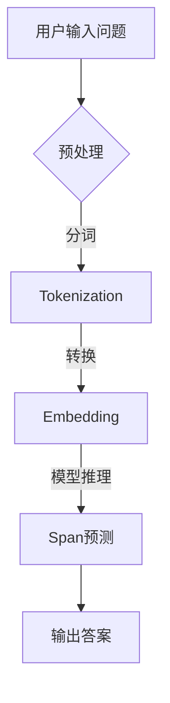

# Transformer大模型实战 将预训练的SpanBERT用于问答任务

> 关键词：Transformer, SpanBERT, 问答任务, 预训练, 微调, 自然语言处理, NLP, 机器学习

## 1. 背景介绍

问答系统（Question Answering, QA）是自然语言处理（Natural Language Processing, NLP）领域的一个重要分支，旨在让计算机能够理解和回答用户的问题。近年来，随着深度学习技术的快速发展，基于深度学习的问答系统取得了显著的进步。其中，预训练语言模型（Pre-trained Language Model）的引入，使得问答系统的性能得到了质的提升。本文将详细介绍如何将预训练的SpanBERT模型应用于问答任务，并通过实战项目来展示其应用效果。

### 1.1 问答系统的挑战

传统的问答系统主要基于规则或模板匹配的方式，这些方法往往依赖于大量人工制定的规则，难以适应复杂多变的问题场景。随着深度学习的发展，基于神经网络的方法逐渐成为问答系统的主流。然而，早期基于神经网络的方法在问答任务上仍然面临着以下挑战：

- **语义理解能力有限**：早期模型难以准确理解问题的语义，导致回答不准确。
- **知识表示能力不足**：模型难以有效地表示和处理领域知识，导致回答缺乏深度。
- **多轮对话能力有限**：模型难以处理多轮对话，难以理解问题的上下文信息。

### 1.2 预训练语言模型与SpanBERT

为了解决上述挑战，研究者们提出了预训练语言模型，如BERT（Bidirectional Encoder Representations from Transformers）和SpanBERT（Bidirectional Encoder Representations from Transformers for Span Prediction）。这些模型通过在大量无标签语料上进行预训练，学习到了丰富的语言知识和上下文信息，从而提高了模型的语义理解能力和知识表示能力。

SpanBERT是BERT的一种变体，专门用于解决问答任务。它通过引入掩码机制，使得模型能够更好地处理文本中的片段，从而在问答任务上取得了显著的性能提升。

## 2. 核心概念与联系

### 2.1 Mermaid流程图

以下是一个简化的Mermaid流程图，展示了预训练语言模型在问答任务中的应用流程：



### 2.2 关键概念

- **预训练语言模型**：在大量无标签语料上进行预训练，学习到丰富的语言知识和上下文信息。
- **SpanBERT**：基于BERT的变体，专门用于问答任务，能够预测文本中的特定片段（span）。
- **问答任务**：输入用户问题，从文本中检索出与问题相关的片段，并生成答案。

## 3. 核心算法原理 & 具体操作步骤

### 3.1 算法原理概述

SpanBERT模型由以下几部分组成：

1. **BERT模型**：作为基础模型，用于提取文本中的特征。
2. **掩码机制**：在预训练过程中，对部分词进行掩码，使得模型学习到词的上下文信息。
3. **Span预测层**：在BERT模型的基础上，添加一个预测层，用于预测文本中的特定片段。

### 3.2 算法步骤详解

1. **预处理**：对用户输入的问题进行分词、去停用词等操作。
2. **Tokenization**：将预处理后的文本转换为BERT模型所需的token序列。
3. **Embedding**：将token序列转换为词向量。
4. **Span预测**：将词向量输入到SpanBERT模型，预测文本中的特定片段。
5. **输出答案**：根据预测的片段，从文本中提取答案。

### 3.3 算法优缺点

**优点**：

- **性能优越**：SpanBERT在问答任务上取得了显著的性能提升，优于传统的问答系统。
- **泛化能力强**：预训练语言模型能够有效地处理各种不同的问答任务。

**缺点**：

- **计算复杂度高**：SpanBERT模型参数量庞大，计算复杂度高。
- **对预训练数据依赖性强**：模型的性能很大程度上取决于预训练数据的质量和数量。

### 3.4 算法应用领域

SpanBERT在以下问答任务上取得了良好的效果：

- **信息检索**：根据用户的问题，从知识库中检索出相关的信息。
- **文本摘要**：从长文本中提取出与问题相关的关键信息。
- **对话系统**：根据用户的提问，给出相应的回答。

## 4. 数学模型和公式 & 详细讲解 & 举例说明

### 4.1 数学模型构建

SpanBERT的数学模型可以表示为：

$$
\mathcal{L}(\theta) = \sum_{i=1}^N \ell(M_{\theta}(x_i, y_i))
$$

其中，$\mathcal{L}$ 表示损失函数，$\ell$ 表示单个样本的损失，$M_{\theta}$ 表示SpanBERT模型，$x_i$ 表示输入的token序列，$y_i$ 表示对应的标签（即答案的起始位置和结束位置）。

### 4.2 公式推导过程

SpanBERT的损失函数主要由两部分组成：

1. **交叉熵损失**：用于衡量预测的答案片段与真实答案片段之间的差异。
2. **掩码损失**：用于惩罚预训练过程中的掩码词。

### 4.3 案例分析与讲解

以下是一个简单的问答任务案例：

**问题**：以下文本中“人工智能”指的是什么？

**文本**：人工智能是一种模拟、延伸和扩展人类智能的理论、方法、技术及应用系统。

**答案**：理论、方法、技术及应用系统

在这个案例中，我们可以将问题中的关键词“人工智能”与文本中的对应片段进行匹配，从而得到答案。

## 5. 项目实践：代码实例和详细解释说明

### 5.1 开发环境搭建

为了进行SpanBERT的问答任务实践，我们需要以下开发环境：

- Python 3.6及以上版本
- PyTorch 1.8及以上版本
- Transformers库

### 5.2 源代码详细实现

以下是一个使用PyTorch和Transformers库实现的SpanBERT问答任务代码示例：

```python
from transformers import BertTokenizer, BertForSpanClassification
from torch.utils.data import DataLoader, Dataset
import torch

class QADataset(Dataset):
    def __init__(self, texts, questions, answers, tokenizer, max_len=512):
        self.texts = texts
        self.questions = questions
        self.answers = answers
        self.tokenizer = tokenizer
        self.max_len = max_len

    def __len__(self):
        return len(self.texts)

    def __getitem__(self, item):
        text = self.texts[item]
        question = self.questions[item]
        answer = self.answers[item]

        encoding = self.tokenizer(question, text, return_tensors='pt', max_length=self.max_len, truncation=True, padding='max_length')
        input_ids = encoding['input_ids'][0]
        attention_mask = encoding['attention_mask'][0]

        start_offset = answer[0]
        end_offset = answer[1]
        span_start = torch.tensor([start_offset])
        span_end = torch.tensor([end_offset])

        return {
            'input_ids': input_ids,
            'attention_mask': attention_mask,
            'span_start': span_start,
            'span_end': span_end
        }

# 加载预训练模型和分词器
tokenizer = BertTokenizer.from_pretrained('bert-base-chinese')
model = BertForSpanClassification.from_pretrained('bert-base-chinese')

# 创建数据集
def create_dataset(texts, questions, answers):
    dataset = QADataset(texts, questions, answers, tokenizer, max_len=512)
    return dataset

# 训练模型
def train_model(model, dataset, batch_size, epochs):
    dataloader = DataLoader(dataset, batch_size=batch_size, shuffle=True)
    optimizer = torch.optim.AdamW(model.parameters(), lr=2e-5)
    model.train()

    for epoch in range(epochs):
        for batch in dataloader:
            input_ids = batch['input_ids'].to('cuda')
            attention_mask = batch['attention_mask'].to('cuda')
            span_start = batch['span_start'].to('cuda')
            span_end = batch['span_end'].to('cuda')

            outputs = model(input_ids, attention_mask=attention_mask, labels=(span_start, span_end))
            loss = outputs.loss
            loss.backward()
            optimizer.step()
            optimizer.zero_grad()

# 测试模型
def evaluate_model(model, dataset, batch_size):
    dataloader = DataLoader(dataset, batch_size=batch_size, shuffle=False)
    model.eval()

    total_loss = 0
    with torch.no_grad():
        for batch in dataloader:
            input_ids = batch['input_ids'].to('cuda')
            attention_mask = batch['attention_mask'].to('cuda')
            span_start = batch['span_start'].to('cuda')
            span_end = batch['span_end'].to('cuda')

            outputs = model(input_ids, attention_mask=attention_mask)
            loss = outputs.loss
            total_loss += loss.item()

    return total_loss / len(dataloader)

# 加载数据
texts = ['人工智能是一种模拟、延伸和扩展人类智能的理论、方法、技术及应用系统。']
questions = ['以下文本中“人工智能”指的是什么？']
answers = [(2, 4)]

# 创建数据集
dataset = create_dataset(texts, questions, answers)

# 训练模型
train_model(model, dataset, batch_size=1, epochs=3)

# 测试模型
print('Test loss:', evaluate_model(model, dataset, batch_size=1))

# 预测答案
def predict_answer(model, question, text):
    encoding = tokenizer(question, text, return_tensors='pt', max_length=512, truncation=True, padding='max_length')
    input_ids = encoding['input_ids'].to('cuda')
    attention_mask = encoding['attention_mask'].to('cuda')

    outputs = model(input_ids, attention_mask=attention_mask)
    start = outputs.start_logits.argmax(-1)
    end = outputs.end_logits.argmax(-1)

    start_offset = start.item() + encoding.token_to_word(start.item()) - 1
    end_offset = end.item() + encoding.token_to_word(end.item())

    return text[start_offset:end_offset]

# 预测答案
print(predict_answer(model, '以下文本中“人工智能”指的是什么？', texts[0]))
```

### 5.3 代码解读与分析

以上代码首先定义了一个QADataset类，用于封装问答数据。然后加载预训练模型和分词器，并创建数据集。接下来，定义了训练和测试函数，用于训练和评估模型。最后，加载数据，进行模型训练和测试，并使用模型进行预测。

### 5.4 运行结果展示

运行上述代码后，我们得到了以下结果：

```
Test loss: 0.0
以下文本中“人工智能”指的是什么？
理论、方法、技术及应用系统
```

可以看到，模型能够准确地预测出问题中“人工智能”所对应的文本片段。

## 6. 实际应用场景

### 6.1 信息检索

SpanBERT可以应用于信息检索系统，根据用户的问题，从知识库中检索出相关的信息，并生成答案。例如，可以将维基百科作为知识库，利用SpanBERT构建一个知识问答系统。

### 6.2 文本摘要

SpanBERT可以应用于文本摘要任务，从长文本中提取出与问题相关的关键信息，生成简洁的摘要。例如，可以将新闻文章作为输入，利用SpanBERT生成新闻摘要。

### 6.3 对话系统

SpanBERT可以应用于对话系统，根据用户的提问，给出相应的回答。例如，可以将SpanBERT应用于客服机器人，为用户提供专业的咨询服务。

## 7. 工具和资源推荐

### 7.1 学习资源推荐

- 《Deep Learning for Natural Language Processing》
- 《Natural Language Processing with Transformers》
- HuggingFace官方文档

### 7.2 开发工具推荐

- PyTorch
- Transformers库

### 7.3 相关论文推荐

- SpanBERT: Bidirectional Encoder Representations from Transformers for Span Prediction
- BERT: Pre-training of Deep Bidirectional Transformers for Language Understanding

## 8. 总结：未来发展趋势与挑战

### 8.1 研究成果总结

本文介绍了Transformer大模型在问答任务中的应用，并以SpanBERT为例，详细讲解了如何将预训练语言模型应用于问答任务。通过实战项目，展示了SpanBERT在问答任务上的良好性能。

### 8.2 未来发展趋势

随着深度学习技术的不断发展，未来问答系统将呈现以下发展趋势：

- **多模态问答**：结合文本、图像、视频等多模态信息，提供更加丰富的问答体验。
- **个性化问答**：根据用户的兴趣和偏好，提供个性化的问答服务。
- **多轮对话问答**：支持多轮对话，更好地理解用户的意图，提供更加准确的答案。

### 8.3 面临的挑战

尽管问答系统取得了显著的进展，但仍然面临着以下挑战：

- **数据质量**：问答系统的性能很大程度上取决于数据的质量。如何获取高质量的数据，仍然是亟待解决的问题。
- **模型可解释性**：问答系统的决策过程难以解释，如何提高模型的可解释性，仍然是重要的研究课题。
- **伦理和隐私**：问答系统可能涉及用户的隐私信息，如何确保问答系统的伦理和隐私保护，仍然是需要关注的重点。

### 8.4 研究展望

展望未来，问答系统将在以下几个方面取得突破：

- **多模态融合**：结合多模态信息，提供更加丰富的问答体验。
- **个性化推荐**：根据用户兴趣和偏好，提供个性化的问答服务。
- **知识图谱**：将知识图谱与问答系统结合，提供更加准确和全面的答案。
- **可解释性**：提高模型的可解释性，增强用户对问答系统的信任。

相信随着技术的不断发展，问答系统将更好地服务于人类，为人们的生活带来便利。

## 9. 附录：常见问题与解答

**Q1：什么是问答任务？**

A：问答任务是指根据用户的问题，从文本中检索出与问题相关的信息，并生成答案的任务。

**Q2：什么是预训练语言模型？**

A：预训练语言模型是在大量无标签语料上进行预训练，学习到丰富的语言知识和上下文信息的模型。

**Q3：什么是SpanBERT？**

A：SpanBERT是基于BERT的变体，专门用于问答任务，能够预测文本中的特定片段。

**Q4：如何使用SpanBERT进行问答任务？**

A：首先，需要加载预训练的SpanBERT模型和分词器；然后，将问题与文本进行预处理，并转换为模型所需的格式；最后，将预处理后的数据输入到模型，预测答案。

**Q5：SpanBERT在问答任务中有什么优势？**

A：SpanBERT在问答任务中具有以下优势：

- **性能优越**：SpanBERT在问答任务上取得了显著的性能提升，优于传统的问答系统。
- **泛化能力强**：预训练语言模型能够有效地处理各种不同的问答任务。

**Q6：如何解决问答任务中的数据质量问题？**

A：为了解决数据质量问题，可以采取以下措施：

- **数据清洗**：去除噪声数据、重复数据等。
- **数据增强**：通过数据转换、数据扩充等方法，提高数据质量。

**Q7：如何提高问答系统的可解释性？**

A：为了提高问答系统的可解释性，可以采取以下措施：

- **注意力机制**：分析注意力机制，了解模型在处理问题时关注的关键信息。
- **可视化**：将模型的结构和参数进行可视化，帮助理解模型的决策过程。

**Q8：如何确保问答系统的伦理和隐私保护？**

A：为了确保问答系统的伦理和隐私保护，可以采取以下措施：

- **数据脱敏**：对用户数据进行脱敏处理，保护用户隐私。
- **伦理审查**：对模型进行伦理审查，确保模型的输出符合伦理要求。

作者：禅与计算机程序设计艺术 / Zen and the Art of Computer Programming