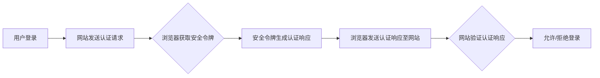

# WebAuthn 的实施步骤

> 关键词：WebAuthn, 凭证，认证，安全，跨平台，无密码登录，FIDO

## 1. 背景介绍

随着互联网的普及和线上服务的多样化，用户名和密码成为了最常见的认证方式。然而，传统的用户名密码认证存在着易被盗用、易忘记、安全风险高等问题。为了解决这些问题，FIDO联盟（Fast Identity Online）提出了WebAuthn协议，它提供了一种简单、安全、无密码的认证方式，旨在实现用户在各个网站和应用程序之间的一次性登录。

WebAuthn协议是基于公钥基础设施（PKI）的，它允许用户使用可信的硬件或软件安全令牌进行认证，而不需要记住复杂的密码。本篇文章将详细介绍WebAuthn的实施步骤，帮助开发者构建安全的无密码登录系统。

## 2. 核心概念与联系

### 2.1 核心概念

- **公钥基础设施（PKI）**：PKI是一种基础设施，用于创建、分发、管理、存储和撤销数字证书。WebAuthn利用PKI提供的安全认证。

- **安全令牌**：安全令牌可以是物理设备（如USB安全令牌、智能卡）或软件（如移动应用、浏览器扩展）。

- **认证请求**：当用户尝试登录网站时，网站向用户的浏览器发送认证请求。

- **认证响应**：用户的浏览器使用安全令牌生成认证响应，并发送给网站。

- **认证结果**：网站验证认证响应的有效性，并根据结果决定是否允许用户登录。

### 2.2 架构图

以下是WebAuthn认证流程的Mermaid流程图：



## 3. 核心算法原理 & 具体操作步骤

### 3.1 算法原理概述

WebAuthn协议的工作原理如下：

1. 用户在浏览器中输入网址，尝试登录。
2. 网站发送一个认证请求，包含挑战（challenge）和域（domain）信息。
3. 浏览器向用户的安全令牌发送认证请求。
4. 安全令牌根据用户的私钥和挑战信息生成认证响应。
5. 浏览器将认证响应发送给网站。
6. 网站验证认证响应的有效性，并根据结果决定是否允许用户登录。

### 3.2 算法步骤详解

以下是WebAuthn认证流程的详细步骤：

1. **网站生成挑战和域信息**：网站生成一个挑战（challenge）和一个域（domain），用于验证用户的身份。
2. **浏览器展示认证请求**：浏览器将挑战和域信息展示给用户，并提示用户使用安全令牌进行认证。
3. **用户使用安全令牌生成认证响应**：用户使用安全令牌（如USB安全令牌、移动应用或浏览器扩展）生成认证响应，包括用户凭证（credential）和签名（signature）。
4. **浏览器发送认证响应**：浏览器将认证响应发送给网站。
5. **网站验证认证响应**：网站使用公钥基础设施（PKI）验证用户凭证的有效性，并验证签名是否正确。
6. **决定认证结果**：根据验证结果，网站决定是否允许用户登录。

### 3.3 算法优缺点

**优点**：

- 安全性高：基于PKI，使用用户私钥进行签名，难以被伪造。
- 无密码登录：用户无需记住复杂的密码，提高用户体验。
- 跨平台：支持各种操作系统和设备。

**缺点**：

- 需要额外设备：用户需要拥有安全令牌才能进行认证。
- 兼容性：部分浏览器和操作系统可能不支持WebAuthn。

### 3.4 算法应用领域

WebAuthn协议适用于以下场景：

- 电子商务网站：提高账户安全性，减少密码泄露风险。
- 金融服务：保护用户账户安全，防止欺诈行为。
- 企业内部系统：加强企业内部系统的安全性，防止未授权访问。
- 移动应用：提高移动应用的安全性，保护用户隐私。

## 4. 数学模型和公式 & 详细讲解 & 举例说明

### 4.1 数学模型构建

WebAuthn协议的数学模型主要涉及以下概念：

- **私钥（Private Key）**：用户的私钥用于生成签名。
- **公钥（Public Key）**：用户的公钥用于验证签名。
- **签名（Signature）**：用户使用私钥对挑战信息进行签名。

### 4.2 公式推导过程

以下是WebAuthn签名生成的公式：

$$
\text{Signature} = \text{Sign}(k, \text{challenge}, \text{domain}, \text{credentialId})
$$

其中，$\text{Sign}$ 为签名算法，$k$ 为用户的私钥，$\text{challenge}$ 为挑战信息，$\text{domain}$ 为域信息，$\text{credentialId}$ 为用户凭证ID。

### 4.3 案例分析与讲解

假设用户Alice使用安全令牌登录网站www.example.com，以下是具体的操作步骤：

1. **网站生成挑战和域信息**：
    - 挑战（challenge）：`1234567890abcdef1234567890abcdef`
    - 域（domain）：`www.example.com`
2. **浏览器展示认证请求**：浏览器将挑战和域信息展示给用户。
3. **Alice使用安全令牌生成认证响应**：
    - Alice的安全令牌使用其私钥对挑战和域信息进行签名，生成签名（signature）。
4. **浏览器发送认证响应**：浏览器将挑战、域、用户凭证ID和签名发送给网站。
5. **网站验证认证响应**：
    - 网站使用Alice的公钥和签名算法验证签名是否正确。
    - 网站使用Alice的公钥验证用户凭证的有效性。

## 5. 项目实践：代码实例和详细解释说明

### 5.1 开发环境搭建

为了演示WebAuthn的实现，我们需要以下环境：

- Node.js 14.17.0 或更高版本
- npm 6.14.8 或更高版本

### 5.2 源代码详细实现

以下是一个简单的WebAuthn认证示例，使用Node.js和Express框架实现：

```javascript
const express = require('express');
const { createKey, verifyKey, getChallenge, getAssertion } = require('webauthn');

const app = express();
const port = 3000;

app.get('/register', async (req, res) => {
  const challenge = await getChallenge('example.com');
  res.json({ challenge });
});

app.post('/assertion', async (req, res) => {
  const assertion = req.body.assertion;
  const verification = await verifyKey('example.com', assertion);
  res.json({ verified: verification.success });
});

app.listen(port, () => {
  console.log(`WebAuthn server listening at http://localhost:${port}`);
});
```

### 5.3 代码解读与分析

- `createKey` 函数用于生成挑战和域信息。
- `verifyKey` 函数用于验证认证响应。
- `/register` 路由用于生成挑战和域信息。
- `/assertion` 路由用于验证认证响应。

### 5.4 运行结果展示

1. 启动服务器：

```bash
node server.js
```

2. 访问 `http://localhost:3000/register`，获取挑战和域信息。
3. 使用WebAuthn认证工具（如Chrome浏览器扩展）生成认证响应。
4. 将认证响应发送到 `/assertion` 路由，验证结果为 `true` 表示认证成功。

## 6. 实际应用场景

### 6.1 电子商务网站

电子商务网站可以使用WebAuthn提供安全、便捷的登录方式，提高用户账户安全性，减少密码泄露风险。

### 6.2 金融服务

金融服务行业可以使用WebAuthn保护用户账户安全，防止欺诈行为，提升用户信任度。

### 6.3 企业内部系统

企业内部系统可以使用WebAuthn加强安全性，防止未授权访问，保障企业信息安全。

### 6.4 移动应用

移动应用可以使用WebAuthn提供安全、便捷的登录方式，提高用户体验。

## 7. 工具和资源推荐

### 7.1 学习资源推荐

- [FIDO联盟官网](https://www.fidoalliance.org/)
- [WebAuthn官方文档](https://www.w3.org/TR/webauthn/)
- [Node.js WebAuthn库](https://github.com/webauthn/credential-management-node)

### 7.2 开发工具推荐

- [Chrome浏览器](https://www.google.com/chrome/)
- [Firefox浏览器](https://www.mozilla.org/en-US/firefox/)
- [Node.js](https://nodejs.org/)

### 7.3 相关论文推荐

- [WebAuthn: An API for Cross-Platform Strong Authentication in Web Applications](https://www.w3.org/TR/webauthn/)

## 8. 总结：未来发展趋势与挑战

### 8.1 研究成果总结

WebAuthn协议提供了一种简单、安全、无密码的认证方式，适用于各种场景。通过WebAuthn，用户可以更方便、安全地进行身份验证，而开发者可以构建更加安全的在线服务。

### 8.2 未来发展趋势

- **跨平台支持**：WebAuthn将继续扩展到更多操作系统和设备。
- **更丰富的API**：WebAuthn将提供更多功能，如多因素认证、用户撤销等。
- **标准化**：WebAuthn将继续完善标准化过程，提高兼容性。

### 8.3 面临的挑战

- **用户教育**：用户需要了解WebAuthn的工作原理，才能更好地使用它。
- **设备兼容性**：需要确保WebAuthn在所有设备和操作系统上的兼容性。
- **安全风险**：需要持续关注WebAuthn的安全风险，并采取措施进行防范。

### 8.4 研究展望

WebAuthn将推动互联网安全认证的发展，为用户提供更加便捷、安全的身份验证方式。未来，WebAuthn将在更多领域得到应用，为构建安全、可信的互联网环境贡献力量。

## 9. 附录：常见问题与解答

### 9.1 问答

**Q1：什么是WebAuthn？**

A1：WebAuthn是一种基于公钥基础设施（PKI）的认证协议，提供了一种简单、安全、无密码的认证方式。

**Q2：WebAuthn如何工作？**

A2：WebAuthn通过挑战、域、用户凭证和签名等机制，实现用户在各个网站和应用程序之间的一次性登录。

**Q3：WebAuthn有哪些优点？**

A3：WebAuthn具有安全性高、无密码登录、跨平台等优点。

**Q4：WebAuthn有哪些缺点？**

A4：WebAuthn需要额外设备，兼容性可能存在问题。

**Q5：WebAuthn适用于哪些场景？**

A5：WebAuthn适用于电子商务、金融服务、企业内部系统、移动应用等场景。

作者：禅与计算机程序设计艺术 / Zen and the Art of Computer Programming