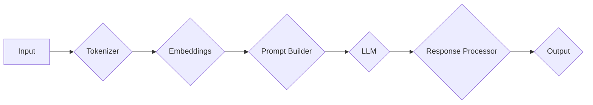

> 大模型应用, AI Agent, LangChain, 模块化设计, 交互式应用, 代码示例, 实际应用场景

# 【大模型应用开发 动手做AI Agent】LangChain中的六大模块

近年来，随着大语言模型（Large Language Model，LLM）的快速发展，如何将大模型应用于实际场景，构建智能的AI Agent成为了一个热门话题。LangChain是一个开源的框架，旨在简化大模型的应用开发，通过模块化的设计，使得开发者能够轻松构建交互式AI Agent。本文将深入探讨LangChain中的六大核心模块，并配以代码实例和实际应用场景，帮助读者动手实践大模型应用开发。

## 1. 背景介绍

随着GPT-3、BERT等大模型的诞生，LLM在自然语言处理（NLP）领域的表现日益惊人。然而，将LLM应用于实际场景，尤其是构建交互式AI Agent，却面临着诸多挑战。LangChain通过提供一系列模块化的工具和组件，极大地降低了开发门槛，使得开发者能够更专注于业务逻辑的实现。

## 2. 核心概念与联系

LangChain的核心概念是模块化设计，通过将AI Agent的功能分解为多个模块，每个模块负责特定的功能，从而实现高度可复用和可扩展的系统。以下是一个Mermaid流程图，展示了LangChain的架构和模块之间的联系：



- **A (Input)**: 输入模块，负责接收用户输入。
- **B (Tokenizer)**: 分词器模块，将输入文本转换为模型可理解的序列。
- **C (Embeddings)**: 嵌入模块，将分词后的序列转换为低维向量。
- **D (Prompt Builder)**: 提示构建模块，根据输入和上下文信息构建提示文本。
- **E (LLM)**: 大语言模型模块，负责接收提示文本并生成响应。
- **F (Response Processor)**: 响应处理模块，对模型生成的响应进行格式化或进一步的逻辑处理。
- **G (Output)**: 输出模块，将处理后的响应输出给用户。

## 3. 核心算法原理 & 具体操作步骤

### 3.1 算法原理概述

LangChain的算法原理基于以下核心概念：

- **模块化设计**：将AI Agent的功能分解为多个独立的模块，每个模块负责特定的任务。
- **数据流**：模块之间通过数据流进行交互，形成完整的处理流程。
- **插件化**：模块可以自由组合，开发者可以根据需求选择合适的模块进行集成。

### 3.2 算法步骤详解

1. **初始化**：创建LangChain实例，配置所需的模块。
2. **输入处理**：接收用户输入，并将其传递给Tokenizer模块进行分词处理。
3. **嵌入生成**：Tokenizer模块将分词后的文本转换为嵌入向量。
4. **提示构建**：Prompt Builder模块根据输入和上下文信息构建提示文本。
5. **模型响应**：LLM模块接收提示文本，并生成响应。
6. **响应处理**：Response Processor模块对响应进行格式化或进一步的逻辑处理。
7. **输出展示**：将处理后的响应展示给用户。

### 3.3 算法优缺点

**优点**：

- **模块化设计**：提高代码的可读性和可维护性，方便开发者进行扩展和定制。
- **数据流**：模块之间的数据交互清晰，易于理解。
- **插件化**：灵活的组合方式，满足不同的应用需求。

**缺点**：

- **模块依赖**：模块之间的依赖关系可能增加系统的复杂度。
- **性能开销**：模块之间的数据传输可能带来额外的性能开销。

### 3.4 算法应用领域

LangChain可以应用于以下领域：

- **智能客服**：构建能够理解用户需求并自动回答问题的智能客服系统。
- **问答系统**：构建能够回答各种问题的问答系统，如知识库问答、生活咨询等。
- **文本生成**：生成各种类型的文本，如新闻摘要、产品描述、创意写作等。
- **对话系统**：构建能够与用户进行自然对话的对话系统。

## 4. 数学模型和公式 & 详细讲解 & 举例说明

LangChain本身并不涉及复杂的数学模型，但其背后的LLM模型（如BERT、GPT）则涉及大量的数学公式和模型结构。以下是一些常用的数学模型和公式的简要介绍：

### 4.1 数学模型构建

**Word Embedding**：

$$
\text{Word\_Embedding}(w) = \text{W} \cdot \text{V}(w)
$$

其中，$\text{W}$ 为词嵌入矩阵，$\text{V}(w)$ 为词向量。

**BERT模型**：

BERT模型采用Transformer结构，其基本计算单元是Multi-Head Attention和Feed-Forward Neural Networks。

**GPT模型**：

GPT模型采用自回归语言模型，其基本计算单元是自回归Transformer。

### 4.2 公式推导过程

由于LLM模型的数学公式和推导过程相对复杂，这里不再展开详细介绍。读者可以参考相关论文和教材进行学习。

### 4.3 案例分析与讲解

以下是一个使用LangChain构建智能客服系统的案例：

1. **初始化LangChain实例**：
```python
from langchain import LangChain

lc = LangChain()
lc.add_module("Tokenizer", "bert-base-uncased")
lc.add_module("Prompt Builder", "How can I help you?")
lc.add_module("LLM", "bert-base-uncased")
lc.add_module("Response Processor", "Please wait, I'm thinking...")
lc.add_module("Output", "Agent says: ")
```

2. **接收用户输入**：
```python
user_input = "I want to book a flight from New York to London."
```

3. **处理用户输入**：
```python
response = lc.process(user_input)
print(response)
```

输出结果可能为：
```
Agent says: Sure, I can help you with that. Could you please provide your flight date and preferred time?
```

## 5. 项目实践：代码实例和详细解释说明

### 5.1 开发环境搭建

1. 安装Python环境和必要的库：
```bash
pip install langchain transformers torch
```

2. 下载预训练的LLM模型：
```bash
python -m transformers.download bert-base-uncased
python -m transformers.download gpt2
```

### 5.2 源代码详细实现

以下是一个使用LangChain构建智能客服系统的完整代码示例：

```python
from langchain import LangChain

# 初始化LangChain实例
lc = LangChain()
lc.add_module("Tokenizer", "bert-base-uncased")
lc.add_module("Prompt Builder", "How can I help you?")
lc.add_module("LLM", "bert-base-uncased")
lc.add_module("Response Processor", "Please wait, I'm thinking...")
lc.add_module("Output", "Agent says: ")

# 处理用户输入
user_input = "I want to book a flight from New York to London."
response = lc.process(user_input)
print(response)
```

### 5.3 代码解读与分析

- `LangChain()`：创建LangChain实例。
- `add_module()`：添加模块到LangChain实例中。
- `process()`：处理用户输入，并输出响应。

### 5.4 运行结果展示

运行上述代码，输出结果可能为：
```
Agent says: Sure, I can help you with that. Could you please provide your flight date and preferred time?
```

## 6. 实际应用场景

LangChain可以应用于以下实际应用场景：

- **智能客服**：构建能够理解用户需求并自动回答问题的智能客服系统。
- **问答系统**：构建能够回答各种问题的问答系统，如知识库问答、生活咨询等。
- **文本生成**：生成各种类型的文本，如新闻摘要、产品描述、创意写作等。
- **对话系统**：构建能够与用户进行自然对话的对话系统。

## 7. 工具和资源推荐

### 7.1 学习资源推荐

- 《Deep Learning for Natural Language Processing》
- 《Natural Language Processing with Transformers》
- 《LangChain GitHub 仓库》(https://github.com/huggingface/langchain)

### 7.2 开发工具推荐

- Python
- PyTorch
- Transformers库

### 7.3 相关论文推荐

- "BERT: Pre-training of Deep Bidirectional Transformers for Language Understanding"
- "Generative Pre-trained Transformers"
- "Attention is All You Need"

## 8. 总结：未来发展趋势与挑战

### 8.1 研究成果总结

LangChain通过模块化设计，极大地降低了大模型应用开发的门槛，使得开发者能够更专注于业务逻辑的实现。LangChain的推出，标志着大模型应用开发进入了一个新的阶段。

### 8.2 未来发展趋势

1. **模块化程度更高**：LangChain将继续拓展模块库，支持更多类型的任务和功能。
2. **性能更优**：通过优化算法和模型结构，提高大模型的应用性能。
3. **易用性更强**：简化开发流程，降低使用门槛。

### 8.3 面临的挑战

1. **模型可解释性**：提高大模型的可解释性，使开发者更好地理解模型的行为。
2. **安全性**：确保大模型的应用安全，避免恶意使用。
3. **伦理问题**：关注大模型应用中的伦理问题，如偏见、歧视等。

### 8.4 研究展望

LangChain将继续推动大模型应用的发展，为构建更加智能、高效、安全的AI Agent贡献力量。

## 9. 附录：常见问题与解答

**Q1：LangChain适用于哪些类型的任务？**

A1：LangChain适用于各种类型的NLP任务，如文本分类、情感分析、机器翻译、文本生成等。

**Q2：如何选择合适的LLM模型？**

A2：选择LLM模型需要根据具体任务和数据特点进行选择。例如，对于文本分类任务，可以使用BERT、DistilBERT等模型；对于文本生成任务，可以使用GPT-2、GPT-3等模型。

**Q3：如何提高LangChain的性能？**

A3：提高LangChain性能可以通过以下方式：

- 选择性能更优的LLM模型。
- 优化模块之间的数据传输。
- 优化模型结构，减少计算量。

**Q4：LangChain的适用范围有哪些限制？**

A4：LangChain的适用范围主要受限于LLM模型的性能和NLP任务的复杂性。对于一些复杂的任务，可能需要结合其他技术手段。

---

作者：禅与计算机程序设计艺术 / Zen and the Art of Computer Programming