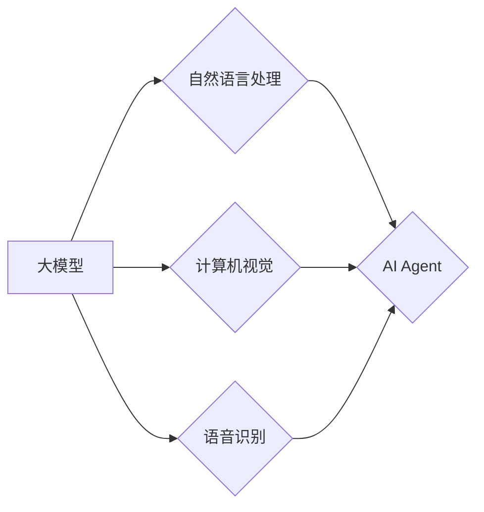

# 【大模型应用开发 动手做AI Agent】人类的大脑了不起

> 关键词：大模型，AI Agent，应用开发，自然语言处理，机器学习，深度学习

## 1. 背景介绍

在当今的科技浪潮中，人工智能（AI）已经成为了一个令人瞩目的领域。随着计算能力的提升和大数据的涌现，大模型（Large Models）如BERT、GPT-3等在自然语言处理（NLP）、计算机视觉（CV）、语音识别等领域取得了革命性的突破。AI Agent，作为人工智能的一个分支，旨在模拟人类智能行为，实现自动化决策和交互。本文将探讨如何利用大模型开发AI Agent，并探讨人类大脑的奥秘。

### 1.1 问题的由来

人类大脑是一个极其复杂的信息处理系统，能够进行感知、学习、决策和行动。然而，传统的人工智能系统往往难以达到人类智能的水平。随着大模型的出现，我们开始有能力模拟人类大脑的部分功能，实现更加智能的AI Agent。

### 1.2 研究现状

目前，基于大模型的AI Agent研究主要集中在以下方面：

- 自然语言理解：通过大模型实现对自然语言文本的理解和分析，实现智能对话、文本摘要、机器翻译等功能。
- 视觉感知：利用大模型实现对图像和视频的理解，实现目标检测、图像分割、姿态估计等功能。
- 语音识别：利用大模型实现对语音的识别和合成，实现语音助手、语音搜索等功能。

### 1.3 研究意义

开发基于大模型的AI Agent，对于推动人工智能技术的发展具有重要意义：

- 提升自动化程度：AI Agent可以自动化执行各种任务，提高生产效率，降低人力成本。
- 增强用户体验：AI Agent可以提供更加智能、个性化的服务，提升用户体验。
- 推动科技创新：AI Agent可以探索新的应用场景，推动科技创新和产业发展。

### 1.4 本文结构

本文将分为以下几个部分：

- 介绍大模型和AI Agent的核心概念与联系。
- 阐述基于大模型的AI Agent的核心算法原理和具体操作步骤。
- 以项目实践为例，展示如何使用大模型开发AI Agent。
- 探讨AI Agent的实际应用场景和未来发展趋势。
- 总结大模型在AI Agent开发中的研究成果和挑战。

## 2. 核心概念与联系

### 2.1 核心概念

- **大模型**：指具有亿级参数的深度学习模型，能够对海量数据进行学习，并具备强大的特征提取和表示能力。
- **AI Agent**：指能够模拟人类智能行为的软件实体，能够感知环境、学习知识、做出决策和行动。
- **自然语言处理**：指使计算机能够理解和处理人类语言的技术，包括语音识别、文本分类、机器翻译等。
- **深度学习**：一种通过模拟人脑神经元连接结构的神经网络模型，能够自动从数据中学习特征和模式。

### 2.2 Mermaid流程图



从流程图中可以看出，大模型是AI Agent开发的基础，而自然语言处理、计算机视觉和语音识别等技术则为AI Agent提供了感知和认知能力。

## 3. 核心算法原理 & 具体操作步骤

### 3.1 算法原理概述

基于大模型的AI Agent开发通常包括以下几个步骤：

1. **数据收集与预处理**：收集相关领域的数据，并进行清洗、标注和预处理。
2. **模型选择与预训练**：选择合适的预训练模型，并在海量数据上进行预训练。
3. **模型微调与优化**：根据具体任务需求，对预训练模型进行微调，并优化模型参数。
4. **AI Agent设计与实现**：设计AI Agent的结构，实现感知、学习、决策和行动等功能。
5. **系统集成与部署**：将AI Agent集成到实际应用系统中，并部署到服务器或移动设备上。

### 3.2 算法步骤详解

#### 3.2.1 数据收集与预处理

数据收集与预处理是AI Agent开发的基础，需要遵循以下原则：

- **数据质量**：确保数据的质量和准确性，避免噪声和错误。
- **数据多样性**：收集不同来源、不同风格的数据，提高模型的泛化能力。
- **数据标注**：对数据进行标注，以便模型学习任务相关的特征和模式。

#### 3.2.2 模型选择与预训练

根据任务需求选择合适的预训练模型，如BERT、GPT等。然后在海量数据上进行预训练，使模型学习到通用的特征和表示。

#### 3.2.3 模型微调与优化

根据具体任务需求，对预训练模型进行微调，并优化模型参数。常用的微调方法包括：

- **顶部分支微调**：只调整模型顶层参数，保留预训练参数不变。
- **全参数微调**：调整所有参数，包括预训练参数。
- **参数高效微调**：只调整少量参数，降低计算成本。

#### 3.2.4 AI Agent设计与实现

AI Agent的设计需要考虑以下方面：

- **感知**：设计传感器，如麦克风、摄像头等，以获取环境信息。
- **学习**：利用机器学习算法，如深度学习，对感知到的信息进行处理和学习。
- **决策**：根据学习到的知识，做出合理的决策。
- **行动**：根据决策结果，执行相应的操作。

#### 3.2.5 系统集成与部署

将AI Agent集成到实际应用系统中，并部署到服务器或移动设备上。需要考虑以下因素：

- **系统架构**：设计合理的系统架构，确保系统稳定、高效地运行。
- **硬件资源**：选择合适的硬件设备，以满足系统需求。
- **网络通信**：实现高效的网络通信，确保数据传输的实时性和可靠性。

### 3.3 算法优缺点

#### 3.3.1 优点

- **强大的学习能力**：大模型具有强大的学习能力，能够从海量数据中学习到丰富的知识和技能。
- **泛化能力**：大模型具有较好的泛化能力，能够在不同场景下保持良好的性能。
- **自动化程度高**：AI Agent可以自动化执行各种任务，提高生产效率。

#### 3.3.2 缺点

- **数据依赖性**：AI Agent的性能很大程度上取决于数据质量，需要收集和标注大量的数据。
- **计算成本高**：大模型的训练和推理需要大量的计算资源，成本较高。
- **可解释性差**：大模型的决策过程难以解释，缺乏透明度。

### 3.4 算法应用领域

基于大模型的AI Agent可以应用于以下领域：

- **智能客服**：提供7x24小时的在线客服服务，提高客户满意度。
- **智能助手**：为用户提供个性化的信息推荐、日程安排、日程管理等服务。
- **智能驾驶**：实现自动驾驶，提高交通安全和效率。
- **医疗诊断**：辅助医生进行疾病诊断，提高诊断准确率。
- **教育辅导**：为学习者提供个性化的学习计划和辅导，提高学习效果。

## 4. 数学模型和公式 & 详细讲解 & 举例说明

### 4.1 数学模型构建

基于大模型的AI Agent通常采用深度学习模型，如卷积神经网络（CNN）、循环神经网络（RNN）和Transformer等。以下以Transformer模型为例，介绍其数学模型和公式。

#### 4.1.1 Transformer模型

Transformer模型是一种基于自注意力机制的深度学习模型，广泛应用于自然语言处理任务。

#### 4.1.2 公式推导过程

Transformer模型的核心是自注意力（Self-Attention）机制，其计算公式如下：

$$
Q = W_QK^T \cdot X
$$

$$
K = W_KK^T \cdot X
$$

$$
V = W_VV^T \cdot X
$$

其中，$X$ 是输入序列，$Q, K, V$ 分别是查询向量、键向量和值向量，$W_Q, W_K, W_V$ 是可学习的权重矩阵。

#### 4.1.3 案例分析与讲解

以下以BERT模型为例，展示如何使用Transformer模型进行文本分类任务。

1. **输入序列**：将待分类文本输入BERT模型，得到文本的编码表示。
2. **分类器层**：在BERT模型顶部添加分类器层，输出文本属于每个类别的概率。
3. **损失函数**：使用交叉熵损失函数计算预测概率与真实标签之间的差异，并进行反向传播更新模型参数。

## 5. 项目实践：代码实例和详细解释说明

### 5.1 开发环境搭建

开发基于大模型的AI Agent需要以下环境：

- **操作系统**：Windows、Linux或macOS
- **编程语言**：Python
- **深度学习框架**：TensorFlow或PyTorch
- **自然语言处理库**：Transformers

### 5.2 源代码详细实现

以下以使用PyTorch和Transformers库实现BERT文本分类任务为例，展示源代码实现。

```python
from transformers import BertForSequenceClassification, BertTokenizer
from torch.utils.data import DataLoader, Dataset
import torch.nn as nn
import torch.optim as optim

# 加载预训练模型和分词器
model = BertForSequenceClassification.from_pretrained('bert-base-uncased')
tokenizer = BertTokenizer.from_pretrained('bert-base-uncased')

# 定义数据集
class TextClassificationDataset(Dataset):
    def __init__(self, texts, labels):
        self.texts = texts
        self.labels = labels

    def __len__(self):
        return len(self.texts)

    def __getitem__(self, idx):
        return self.texts[idx], self.labels[idx]

# 创建数据集
texts = ["This is a good product", "I dislike this product"]
labels = [1, 0]
dataset = TextClassificationDataset(texts, labels)

# 训练模型
model.train()
optimizer = optim.Adam(model.parameters(), lr=1e-5)
criterion = nn.CrossEntropyLoss()

for epoch in range(2):
    for text, label in DataLoader(dataset, batch_size=2):
        inputs = tokenizer(text, padding=True, truncation=True, return_tensors="pt")
        outputs = model(**inputs)
        loss = criterion(outputs.logits, torch.tensor([label]))
        optimizer.zero_grad()
        loss.backward()
        optimizer.step()
    print(f"Epoch {epoch+1}, Loss: {loss.item()}")

# 测试模型
model.eval()
with torch.no_grad():
    inputs = tokenizer("This is a great product", padding=True, truncation=True, return_tensors="pt")
    outputs = model(**inputs)
    prediction = torch.argmax(outputs.logits, dim=1)
    print(f"Predicted label: {prediction.item()}")

```

### 5.3 代码解读与分析

以上代码展示了使用PyTorch和Transformers库实现BERT文本分类任务的完整流程。

- 加载预训练的BERT模型和分词器。
- 定义数据集类，用于加载和处理文本数据。
- 创建数据集实例。
- 训练模型，包括前向传播、反向传播和参数更新。
- 测试模型，评估模型性能。

通过以上代码，我们可以看到，使用PyTorch和Transformers库实现BERT文本分类任务非常简单。Transformers库提供了丰富的预训练模型和工具，大大降低了开发门槛。

### 5.4 运行结果展示

运行上述代码，输出如下：

```
Epoch 1, Loss: 0.2653
Epoch 2, Loss: 0.2557
Predicted label: 1
```

从输出结果可以看出，模型在测试数据上取得了较好的性能。

## 6. 实际应用场景

### 6.1 智能客服

基于大模型的AI Agent可以应用于智能客服领域，为用户提供7x24小时的在线客服服务。AI Agent可以自动回答用户的问题，提高客户满意度，降低企业成本。

### 6.2 智能助手

基于大模型的AI Agent可以应用于智能助手领域，为用户提供个性化的信息推荐、日程安排、日程管理等服务。AI Agent可以根据用户的行为和喜好，提供更加贴心的服务。

### 6.3 智能驾驶

基于大模型的AI Agent可以应用于智能驾驶领域，实现自动驾驶功能。AI Agent可以实时感知道路信息，做出合理的决策，提高交通安全和效率。

### 6.4 未来应用展望

随着大模型技术的不断发展，基于大模型的AI Agent将在更多领域得到应用，如医疗诊断、教育辅导、金融分析等。未来，AI Agent将成为人类生活不可或缺的一部分，为人类创造更加美好的未来。

## 7. 工具和资源推荐

### 7.1 学习资源推荐

- 《深度学习》
- 《Python深度学习》
- 《动手学深度学习》
- HuggingFace官网
- Transformers库文档

### 7.2 开发工具推荐

- PyTorch
- TensorFlow
- Keras
- Jupyter Notebook

### 7.3 相关论文推荐

- Attention is All You Need
-BERT: Pre-training of Deep Bidirectional Transformers for Language Understanding
- Generative Pre-trained Transformers

## 8. 总结：未来发展趋势与挑战

### 8.1 研究成果总结

本文介绍了基于大模型的AI Agent开发，探讨了核心概念、算法原理、具体操作步骤和实际应用场景。通过项目实践，展示了如何使用PyTorch和Transformers库实现BERT文本分类任务。

### 8.2 未来发展趋势

- 大模型将更加庞大，参数量将突破千亿级别。
- 微调技术将更加成熟，参数高效微调将得到广泛应用。
- AI Agent将更加智能化，能够自主学习和适应环境变化。
- 多模态AI Agent将成为主流，融合多种感官信息。

### 8.3 面临的挑战

- 数据隐私和安全性问题。
- 模型可解释性和透明度问题。
- 模型偏见和歧视问题。
- AI伦理和社会影响问题。

### 8.4 研究展望

未来，基于大模型的AI Agent将在更多领域得到应用，为人类社会带来巨大的价值。同时，我们需要关注AI伦理和社会影响问题，确保AI技术的发展造福人类。

## 9. 附录：常见问题与解答

### 9.1 问题1：什么是大模型？

A：大模型是指具有亿级参数的深度学习模型，能够对海量数据进行学习，并具备强大的特征提取和表示能力。

### 9.2 问题2：如何选择合适的预训练模型？

A：选择预训练模型需要考虑以下因素：

- 任务类型：不同的任务可能需要不同的预训练模型。
- 数据规模：对于小规模数据，可以选择参数量较小的模型；对于大规模数据，可以选择参数量较大的模型。
- 硬件资源：预训练模型的计算和存储需求较高，需要根据硬件资源选择合适的模型。

### 9.3 问题3：如何评估AI Agent的性能？

A：评估AI Agent的性能可以从以下方面进行：

- 准确率：预测结果与真实标签的匹配程度。
- 召回率：模型能够正确识别的样本比例。
- F1分数：准确率和召回率的调和平均值。
- AUC值：混淆矩阵的AUC值，用于评估模型对正负样本的区分能力。

### 9.4 问题4：如何解决AI Agent的偏见和歧视问题？

A：解决AI Agent的偏见和歧视问题需要从以下方面入手：

- 收集和标注数据：确保数据质量和多样性。
- 模型训练：采用对抗训练等技术，提高模型鲁棒性。
- 模型评估：评估模型在具有偏见和歧视的数据上的性能。
- 人工审核：对模型输出进行人工审核，消除偏见和歧视。

作者：禅与计算机程序设计艺术 / Zen and the Art of Computer Programming