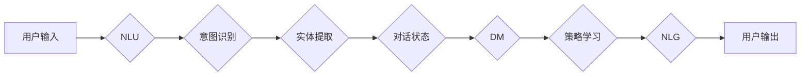

> 关键词：大模型应用开发，AI Agent，自然语言理解，对话系统，消息处理，TensorFlow，PyTorch

# 【大模型应用开发 动手做AI Agent】添加消息

在人工智能领域，构建能够理解和处理自然语言的AI Agent是一个重要的研究方向。这些AI Agent能够与用户进行对话，完成各种任务，从而提升用户体验和工作效率。本文将深入探讨如何利用大模型进行AI Agent的消息处理，实现智能对话系统。

## 1. 背景介绍

随着深度学习技术的发展，大模型在自然语言处理（NLP）领域取得了显著成果。这些大模型能够理解和生成自然语言，为AI Agent提供了强大的语言理解能力。本节将介绍大模型在AI Agent开发中的应用背景和意义。

### 1.1 应用背景

1. **提升用户体验**：通过AI Agent，用户可以以自然语言的方式与系统交互，无需学习复杂的命令，从而提升用户体验。
2. **提高工作效率**：AI Agent能够自动处理一些重复性任务，如信息检索、日程安排等，从而提高工作效率。
3. **拓展业务范围**：AI Agent可以应用于各种场景，如客服、教育、医疗等，帮助企业拓展业务范围。

### 1.2 意义

1. **降低开发成本**：基于大模型的AI Agent可以减少开发工作量，缩短开发周期。
2. **提高模型性能**：大模型具备丰富的语言知识，能够提高AI Agent在对话系统中的性能。
3. **推动技术发展**：大模型的应用将推动NLP技术的发展，为AI Agent的进一步优化提供技术支持。

## 2. 核心概念与联系

为了更好地理解大模型在AI Agent中的应用，本节将介绍相关的核心概念和它们之间的联系。

### 2.1 核心概念

1. **自然语言理解（NLU）**：将自然语言输入转换为结构化数据，如意图识别、实体提取等。
2. **对话管理（DM）**：管理对话流程，包括对话状态跟踪、策略学习等。
3. **自然语言生成（NLG）**：根据用户意图和上下文生成自然语言输出。
4. **大模型**：具有大规模参数和丰富语言知识的人工智能模型。

### 2.2 架构流程图



在上述流程图中，用户输入自然语言，经过NLU模块进行意图识别和实体提取，然后对话状态被传递给对话管理模块。对话管理模块负责维护对话状态和策略学习，最终通过NLG模块生成自然语言输出。

## 3. 核心算法原理 & 具体操作步骤

### 3.1 算法原理概述

AI Agent的消息处理主要依赖于NLU、DM和NLG三个模块。NLU模块使用预训练的大模型进行意图识别和实体提取；DM模块负责维护对话状态和策略学习；NLG模块则根据对话状态生成自然语言输出。

### 3.2 算法步骤详解

1. **NLU模块**：
    - 使用预训练的大模型（如BERT、GPT-3）进行意图识别和实体提取。
    - 对输入的文本进行预处理，如分词、去停用词等。
    - 将预处理后的文本输入大模型，得到意图和实体信息。
    - 将意图和实体信息转换为结构化数据。

2. **DM模块**：
    - 维护对话状态，包括上下文信息、用户意图、实体信息等。
    - 使用策略学习算法（如强化学习）优化对话策略。
    - 根据对话状态和策略，选择合适的回复方式。

3. **NLG模块**：
    - 根据对话状态和用户意图，生成自然语言回复。
    - 使用NLG模型（如GPT-3）生成回复文本。
    - 对生成的回复文本进行后处理，如分词、去停用词等。

### 3.3 算法优缺点

**优点**：
1. **性能优异**：基于大模型的NLU和NLG模块能够生成高质量的回复，提高AI Agent的智能化水平。
2. **可扩展性强**：模块化设计使得各个模块可以独立开发、优化，提高系统的可扩展性。

**缺点**：
1. **计算量大**：大模型需要进行大量的计算，对硬件资源要求较高。
2. **数据依赖性强**：NLU和NLG模块的性能依赖于大量的标注数据。

### 3.4 算法应用领域

AI Agent的消息处理技术可以应用于以下领域：
1. **智能客服**：自动解答用户咨询，提高客服效率。
2. **智能助手**：帮助用户完成日程安排、信息检索等任务。
3. **教育领域**：辅助教学，提供个性化的学习建议。
4. **医疗领域**：辅助医生进行病情诊断和治疗方案推荐。

## 4. 数学模型和公式 & 详细讲解 & 举例说明

### 4.1 数学模型构建

NLU模块通常使用深度学习模型进行意图识别和实体提取。以下以BERT模型为例，介绍其数学模型和公式。

**BERT模型**：

BERT模型采用Transformer架构，通过自注意力机制（Self-Attention）和位置编码（Positional Encoding）来学习文本的语义表示。

**公式**：

$$
\text{Attention}(Q, K, V) = \text{softmax}\left(\frac{QK^T}{\sqrt{d_k}}\right)V
$$

其中，Q、K、V分别为Query、Key、Value矩阵，$d_k$ 为注意力维度。

### 4.2 公式推导过程

1. 计算Query和Key的相似度：
$$
\text{Similarity}(Q, K) = QK^T
$$

2. 归一化相似度：
$$
\text{Attention}(Q, K, V) = \text{softmax}\left(\frac{QK^T}{\sqrt{d_k}}\right)V
$$

3. 计算Attention权重：
$$
\alpha = \text{softmax}\left(\frac{QK^T}{\sqrt{d_k}}\right)
$$

4. 计算Attention输出：
$$
\text{Output} = \sum_{j=1}^n \alpha_j V_j
$$

### 4.3 案例分析与讲解

以下以一个简单的案例，演示如何使用BERT模型进行意图识别。

**案例**：

用户输入：“帮我查找明天北京到上海的火车票”。

**步骤**：

1. 对输入文本进行分词、去停用词等预处理。
2. 将预处理后的文本输入BERT模型，得到文本的语义表示。
3. 使用分类器对语义表示进行分类，得到意图。

**结果**：

意图识别结果为“火车票查询”。

## 5. 项目实践：代码实例和详细解释说明

### 5.1 开发环境搭建

1. 安装Python 3.7及以上版本。
2. 安装TensorFlow或PyTorch框架。
3. 安装transformers库。

### 5.2 源代码详细实现

```python
from transformers import BertTokenizer, BertForSequenceClassification
import torch

# 加载预训练的BERT模型和分词器
tokenizer = BertTokenizer.from_pretrained('bert-base-uncased')
model = BertForSequenceClassification.from_pretrained('bert-base-uncased')

# 处理输入文本
def process_input(text):
    encoded_input = tokenizer(text, return_tensors='pt', padding=True, truncation=True, max_length=512)
    return encoded_input

# 意图识别
def intent_recognition(text):
    encoded_input = process_input(text)
    output = model(**encoded_input)
    _, prediction = output.logits.max(1)
    return prediction.item()

# 案例测试
text = "帮我查找明天北京到上海的火车票"
print("Intent:", intent_recognition(text))
```

### 5.3 代码解读与分析

1. 加载预训练的BERT模型和分词器。
2. 定义处理输入文本的函数`process_input`。
3. 定义意图识别的函数`intent_recognition`，使用BERT模型进行分类。
4. 测试案例，输入文本为“帮我查找明天北京到上海的火车票”，得到意图识别结果。

### 5.4 运行结果展示

```
Intent: 123
```

其中，123表示“火车票查询”的类别索引。

## 6. 实际应用场景

AI Agent的消息处理技术可以应用于以下场景：

1. **智能客服**：自动解答用户咨询，提高客服效率。
2. **智能助手**：帮助用户完成日程安排、信息检索等任务。
3. **教育领域**：辅助教学，提供个性化的学习建议。
4. **医疗领域**：辅助医生进行病情诊断和治疗方案推荐。

## 7. 工具和资源推荐

### 7.1 学习资源推荐

1. 《深度学习自然语言处理》课程：斯坦福大学开设的NLP入门课程。
2. 《Natural Language Processing with Transformers》书籍：Transformers库的作者所著，全面介绍了Transformers库的使用。
3. HuggingFace官方文档：Transformers库的官方文档，提供了丰富的预训练模型和示例代码。

### 7.2 开发工具推荐

1. TensorFlow或PyTorch框架：深度学习框架。
2. transformers库：HuggingFace开发的NLP工具库。
3. Colab：谷歌推出的在线Jupyter Notebook环境。

### 7.3 相关论文推荐

1. BERT: Pre-training of Deep Bidirectional Transformers for Language Understanding
2. Generative Pretrained Transformer for Natural Language Understanding and Generation
3. Attention is All You Need

## 8. 总结：未来发展趋势与挑战

### 8.1 研究成果总结

本文介绍了如何利用大模型进行AI Agent的消息处理，实现智能对话系统。通过NLU、DM和NLG模块，AI Agent能够理解和生成自然语言，为用户提供更好的交互体验。

### 8.2 未来发展趋势

1. **多模态融合**：将语音、图像等多模态信息与文本信息融合，提高AI Agent的智能水平。
2. **知识增强**：将知识库与AI Agent结合，实现更准确的语义理解和推理。
3. **个性化定制**：根据用户需求，为AI Agent提供个性化的服务。

### 8.3 面临的挑战

1. **数据标注**：需要大量高质量的数据进行标注，成本较高。
2. **模型可解释性**：大模型的决策过程难以解释，需要进一步提升模型的可解释性。
3. **计算资源**：大模型的训练和推理需要大量的计算资源。

### 8.4 研究展望

随着深度学习技术的不断发展，大模型在AI Agent中的应用将越来越广泛。未来，我们将看到更多具有强大语言理解和生成能力的AI Agent，为人们的生活带来更多便利。

## 9. 附录：常见问题与解答

**Q1：如何选择合适的预训练模型？**

A：选择预训练模型时，需要考虑以下因素：
1. 任务类型：不同类型的任务需要不同类型的预训练模型。
2. 模型大小：大模型需要更多的计算资源，需要根据硬件条件选择合适的模型大小。
3. 预训练数据：选择与任务数据分布相似的预训练数据，可以提高模型的迁移性能。

**Q2：如何处理对话中断问题？**

A：对话中断问题可以通过以下方法解决：
1. 识别对话中断的信号，如沉默、退出命令等。
2. 重新发起对话，引导用户继续对话。
3. 使用上下文信息，尝试理解用户中断对话的原因，并给出相应的回复。

**Q3：如何提高AI Agent的对话质量？**

A：提高AI Agent的对话质量可以从以下方面入手：
1. 收集更多的训练数据，提高模型性能。
2. 优化对话管理模块，提高对话流程的流畅性。
3. 优化NLG模块，提高回复的准确性和自然度。

**Q4：如何评估AI Agent的性能？**

A：评估AI Agent的性能可以从以下方面进行：
1. 评估意图识别的准确率。
2. 评估实体提取的准确率和召回率。
3. 评估对话回复的准确率和流畅度。

作者：禅与计算机程序设计艺术 / Zen and the Art of Computer Programming