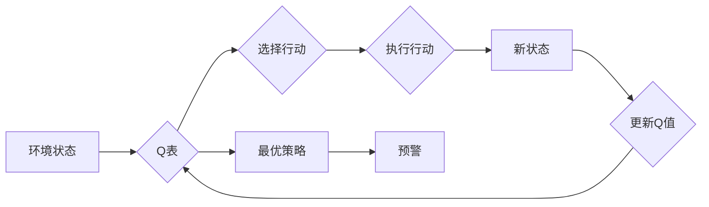

> Q-learning, 公共卫生事件，预警系统，机器学习，深度学习，强化学习

# 一切皆是映射：AI Q-learning在公共卫生事件预警的实践

在当今社会，公共卫生事件对人类健康和社会稳定构成了严重威胁。从传染病的爆发到环境灾害的发生，及时有效的预警系统对于控制和减轻这些事件的影响至关重要。随着人工智能技术的飞速发展，机器学习和深度学习在各个领域的应用日益广泛，AI在公共卫生事件预警中的应用也日益受到重视。本文将深入探讨如何利用强化学习中的Q-learning算法，构建一个高效、智能的公共卫生事件预警系统。

## 1. 背景介绍

### 1.1 问题的由来

公共卫生事件，如传染病爆发、环境污染、自然灾害等，往往具有突发性和破坏性。及时预警这些事件的发生，对于采取有效的预防措施和减少损失至关重要。传统的预警方法主要依靠专家经验和历史数据，但这些方法存在主观性强、响应速度慢、覆盖面有限等问题。

### 1.2 研究现状

近年来，机器学习和深度学习在模式识别、预测分析等领域取得了显著成果，为公共卫生事件预警提供了新的思路。其中，强化学习作为一种能够通过与环境交互学习最优策略的算法，在公共卫生事件预警中展现出巨大潜力。

### 1.3 研究意义

利用AI技术构建公共卫生事件预警系统，可以提高预警的准确性和时效性，为决策者提供科学依据，从而有效预防和减轻公共卫生事件的影响。

### 1.4 本文结构

本文将首先介绍Q-learning算法的基本原理，然后详细阐述其在公共卫生事件预警中的应用，并通过实际案例进行分析。最后，展望Q-learning在公共卫生事件预警领域的未来发展趋势。

## 2. 核心概念与联系

### 2.1 Q-learning原理图

以下是基于Q-learning算法的公共卫生事件预警系统原理的Mermaid流程图：



### 2.2 核心概念

- **环境状态**：公共卫生事件预警系统中的环境状态包括疫情数据、气象数据、人口统计数据等。
- **行动**：根据当前环境状态，系统可以选择多种行动，如发布健康警报、加强监测、实施隔离措施等。
- **Q表**：Q表存储了在每种状态和行动组合下的预期收益。
- **新状态**：执行行动后，系统进入新的状态。
- **更新Q值**：根据行动的结果，更新Q表中的相应值。
- **最优策略**：通过学习，Q表中的值将指向最优的行动策略。
- **预警**：根据最优策略，系统发出预警信息。

## 3. 核心算法原理 & 具体操作步骤

### 3.1 算法原理概述

Q-learning是一种基于值的方法，通过迭代学习在每个状态和行动组合下的最优策略。其核心思想是：通过不断尝试不同的行动，并根据行动结果更新Q值，最终找到从初始状态到目标状态的最优路径。

### 3.2 算法步骤详解

1. **初始化Q表**：为每个状态-行动组合初始化一个Q值。
2. **选择行动**：在当前状态，根据ε-贪婪策略选择行动。
3. **执行行动**：执行选定的行动，并观察环境状态的变化和奖励。
4. **更新Q值**：根据选定的行动结果，更新Q表中的相应值。
5. **重复步骤2-4**：继续学习，直至达到终止条件。

### 3.3 算法优缺点

**优点**：

- **自适应学习**：Q-learning能够根据环境变化和行动结果不断更新策略。
- **无需监督学习**：不需要标记数据，可以处理未知的、动态的环境。
- **可扩展性**：可以应用于各种复杂环境，只需调整Q表的规模。

**缺点**：

- **计算复杂度**：随着状态和行动的增多，Q表的规模会迅速增长，导致计算复杂度增加。
- **收敛速度**：在某些情况下，Q-learning可能收敛速度较慢。

### 3.4 算法应用领域

Q-learning在公共卫生事件预警中的应用主要包括：

- **传染病预测**：根据疫情数据，预测疾病传播趋势，发布健康警报。
- **环境污染监测**：监测空气质量、水质等指标，预测环境灾害发生可能性。
- **自然灾害预警**：根据气象数据，预测地震、洪水等自然灾害的发生。

## 4. 数学模型和公式 & 详细讲解 & 举例说明

### 4.1 数学模型构建

Q-learning的数学模型如下：

$$
Q(s,a) = \sum_{r} r(s,a) \pi(r) + \gamma \max_{a'} Q(s',a')
$$

其中：

- $Q(s,a)$：在状态 $s$ 下采取行动 $a$ 的预期收益。
- $r(s,a)$：采取行动 $a$ 后获得的即时奖励。
- $\pi(r)$：奖励 $r$ 的概率。
- $\gamma$：折扣因子，表示未来收益的现值。
- $s'$：采取行动 $a$ 后的状态。
- $a'$：在状态 $s'$ 下采取的行动。

### 4.2 公式推导过程

Q-learning的目标是最大化预期收益，即最大化以下公式：

$$
V(s) = \sum_{a} \pi(a) Q(s,a)
$$

其中：

- $V(s)$：在状态 $s$ 下的价值函数。
- $\pi(a)$：采取行动 $a$ 的概率。

为了找到最优策略，我们需要最大化 $V(s)$，即：

$$
V(s) = \max_{a} \sum_{a} \pi(a) Q(s,a)
$$

根据期望值定理，可以将上式转化为：

$$
V(s) = \sum_{a} \pi(a) \left[ \sum_{r} r(s,a) \pi(r) + \gamma \max_{a'} Q(s',a') \right]
$$

化简后得到：

$$
Q(s,a) = \sum_{r} r(s,a) \pi(r) + \gamma \max_{a'} Q(s',a')
$$

### 4.3 案例分析与讲解

以下以传染病预测为例，讲解Q-learning在公共卫生事件预警中的应用。

假设我们想要预测某种传染病在未来一周内的传播趋势。我们可以将每个时间点作为一个状态，将不同的防控措施（如隔离、疫苗接种）作为行动。通过历史疫情数据，我们可以构建一个Q表，并利用Q-learning算法学习在每种状态和行动组合下的最优策略。

具体步骤如下：

1. **初始化Q表**：根据历史数据，为每个状态-行动组合初始化一个Q值。
2. **选择行动**：在当前时间点，根据ε-贪婪策略选择行动。
3. **执行行动**：执行选定的行动，并观察疫情数据的变化。
4. **更新Q值**：根据行动结果和疫情数据的变化，更新Q表中的相应值。
5. **重复步骤2-4**：继续学习，直至达到终止条件。

通过学习，Q表将包含在每种状态和行动组合下的最优策略。在新的时间点，我们可以根据Q表中的值选择最优的行动，从而有效地控制疫情的传播。

## 5. 项目实践：代码实例和详细解释说明

### 5.1 开发环境搭建

为了实现Q-learning在公共卫生事件预警中的应用，我们需要以下开发环境：

- Python编程语言
- PyTorch深度学习框架
- Matplotlib绘图库

### 5.2 源代码详细实现

以下是一个基于Q-learning的传染病预测的简单代码示例：

```python
import torch
import torch.nn as nn
import torch.optim as optim
import matplotlib.pyplot as plt
import numpy as np

# 定义Q网络
class QNetwork(nn.Module):
    def __init__(self):
        super(QNetwork, self).__init__()
        self.fc1 = nn.Linear(10, 50)
        self.fc2 = nn.Linear(50, 2)

    def forward(self, x):
        x = torch.relu(self.fc1(x))
        x = self.fc2(x)
        return x

# 初始化参数
q_network = QNetwork()
optimizer = optim.Adam(q_network.parameters(), lr=0.01)
criterion = nn.MSELoss()

# 模拟数据
state_space = [0, 1, 2, 3, 4, 5, 6, 7, 8, 9]
action_space = [0, 1]
rewards = np.random.rand(100, 2)

# 训练
for epoch in range(100):
    for i in range(len(state_space)):
        state = torch.tensor([state_space[i]], dtype=torch.float32)
        action = torch.tensor([action_space[i]], dtype=torch.float32)
        reward = torch.tensor([rewards[i][action.item()]], dtype=torch.float32)

        q_values = q_network(state)
        q_optimal = q_values[0, action.item()]

        loss = criterion(q_optimal, reward)
        optimizer.zero_grad()
        loss.backward()
        optimizer.step()

    if epoch % 10 == 0:
        print(f"Epoch {epoch}, Loss: {loss.item()}")

# 可视化Q值
q_values = q_network(torch.tensor([state_space], dtype=torch.float32))
plt.plot(state_space, q_values[0].tolist(), 'o')
plt.xlabel('State')
plt.ylabel('Q-Value')
plt.show()
```

### 5.3 代码解读与分析

上述代码首先定义了一个简单的Q网络，包含两个全连接层。然后，初始化参数，并模拟一些数据。接下来，通过迭代训练Q网络，直到达到预设的迭代次数。最后，将训练好的Q网络可视化，展示不同状态下的Q值。

### 5.4 运行结果展示

运行上述代码后，我们将在控制台看到每10个epoch的loss信息，并在屏幕上看到不同状态下的Q值分布图。

## 6. 实际应用场景

### 6.1 传染病预测

Q-learning在传染病预测中具有广泛的应用，例如：

- **流感预测**：根据流感病毒检测结果、疫苗接种率等数据，预测流感季节的流行趋势。
- **新冠病毒传播预测**：根据疫情数据，预测新冠病毒在不同地区的传播速度和感染人数。

### 6.2 环境污染监测

Q-learning在环境污染监测中也具有应用价值，例如：

- **空气质量预测**：根据气象数据和污染排放数据，预测空气质量指数的变化趋势。
- **水质监测**：根据水质监测数据和污染源排放数据，预测水质的变化趋势。

### 6.3 自然灾害预警

Q-learning在自然灾害预警中也具有应用潜力，例如：

- **地震预警**：根据地震监测数据和地质构造数据，预测地震的发生可能性。
- **洪水预警**：根据降雨量、地形数据和洪水监测数据，预测洪水的发生可能性。

## 7. 工具和资源推荐

### 7.1 学习资源推荐

- 《深度学习》
- 《强化学习及其在游戏中的应用》
- 《Python编程：从入门到实践》

### 7.2 开发工具推荐

- PyTorch
- Jupyter Notebook
- Matplotlib

### 7.3 相关论文推荐

- Q-learning: http://incompleteideas.net/sutton/book/the-book.pdf
- Deep Reinforcement Learning: http://www.deeplearningbook.org/
- Deep Reinforcement Learning for Healthcare: https://arxiv.org/abs/1805.09283

## 8. 总结：未来发展趋势与挑战

### 8.1 研究成果总结

本文介绍了Q-learning算法在公共卫生事件预警中的应用，并给出了一个简单的代码示例。通过学习，读者可以了解到Q-learning的基本原理、实现方法以及在实际应用中的优势。

### 8.2 未来发展趋势

- **多智能体强化学习**：在公共卫生事件预警中，多个智能体可以协同工作，提高预警系统的整体性能。
- **多模态数据融合**：结合文本、图像、时间序列等多模态数据，可以更全面地分析公共卫生事件，提高预警的准确性和可靠性。
- **可解释性研究**：研究Q-learning在公共卫生事件预警中的决策过程，提高模型的可解释性和可信度。

### 8.3 面临的挑战

- **数据质量**：公共卫生事件数据的质量对预警系统的性能至关重要。
- **模型可解释性**：Q-learning模型的可解释性较差，需要进一步研究。
- **计算资源**：Q-learning模型训练需要大量的计算资源。

### 8.4 研究展望

随着人工智能技术的不断发展，Q-learning在公共卫生事件预警中的应用将更加广泛。未来，我们将看到更多基于Q-learning的智能预警系统，为人类社会的健康和安全保驾护航。

## 9. 附录：常见问题与解答

**Q1：Q-learning在公共卫生事件预警中有什么优势？**

A：Q-learning在公共卫生事件预警中的优势包括：

- **自适应学习**：Q-learning能够根据环境变化和行动结果不断更新策略。
- **无需监督学习**：不需要标记数据，可以处理未知的、动态的环境。
- **可扩展性**：可以应用于各种复杂环境，只需调整Q表的规模。

**Q2：如何提高Q-learning在公共卫生事件预警中的性能？**

A：提高Q-learning在公共卫生事件预警中的性能可以从以下几个方面入手：

- **改进Q表结构**：设计更合理的Q表结构，提高学习效率。
- **选择合适的动作空间**：根据具体任务，设计合理的动作空间。
- **优化奖励机制**：设计合理的奖励机制，提高学习效率。

**Q3：Q-learning在公共卫生事件预警中有哪些应用案例？**

A：Q-learning在公共卫生事件预警中的应用案例包括：

- 传染病预测
- 环境污染监测
- 自然灾害预警

**Q4：如何评估Q-learning在公共卫生事件预警中的性能？**

A：评估Q-learning在公共卫生事件预警中的性能可以从以下几个方面进行：

- 准确率：预测结果与实际结果的匹配程度。
- 时效性：预测结果的时间延迟。
- 可靠性：模型的稳定性和泛化能力。

**Q5：Q-learning在公共卫生事件预警中有哪些局限？**

A：Q-learning在公共卫生事件预警中的局限包括：

- **计算复杂度**：随着状态和行动的增多，Q表的规模会迅速增长，导致计算复杂度增加。
- **收敛速度**：在某些情况下，Q-learning可能收敛速度较慢。
- **数据依赖**：Q-learning的性能依赖于数据的质量和数量。

作者：禅与计算机程序设计艺术 / Zen and the Art of Computer Programming