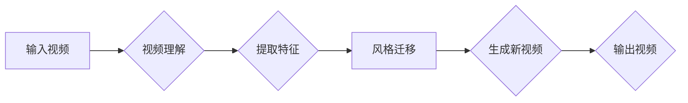

> 自动化视频编辑，神经网络，映射学习，视频理解，风格迁移，生成对抗网络，卷积神经网络

# 一切皆是映射：使用神经网络自动化视频编辑

视频编辑一直是影视制作、媒体创作和内容创作领域的重要环节。传统的视频编辑依赖于专业人员的技能和经验，耗时费力。随着深度学习技术的飞速发展，利用神经网络进行自动化视频编辑成为可能。本文将探讨神经网络在视频编辑中的应用，揭示“一切皆是映射”的原理，并展望未来发展趋势与挑战。

## 1. 背景介绍

### 1.1 视频编辑的传统方法

传统的视频编辑主要依赖于专业人员，包括剪辑师、特效师、色彩师等。他们通过专业的视频编辑软件，如Adobe Premiere Pro、Final Cut Pro等，手动完成视频的剪辑、特效、色彩调整等操作。这种方法效率低下，且难以满足快速内容生产的需求。

### 1.2 深度学习的兴起

近年来，深度学习在计算机视觉、自然语言处理等领域取得了突破性进展。深度学习模型能够自动从数据中学习特征，并应用于图像识别、语音识别、文本生成等任务。这些技术为自动化视频编辑提供了新的思路。

### 1.3 神经网络在视频编辑中的应用

神经网络在视频编辑中的应用主要体现在以下几个方面：

- 视频理解：通过卷积神经网络(CNN)等模型，识别视频中的物体、场景、动作等，实现视频分类、分割、标注等功能。
- 风格迁移：利用生成对抗网络(GAN)等技术，将视频的风格从一种类型迁移到另一种类型，实现风格化视频的生成。
- 自动剪辑：通过自动识别视频中的关键帧和转场效果，实现视频的自动剪辑。
- 语音转视频：将文本内容转化为视频，实现自动化的内容生成。

## 2. 核心概念与联系

### 2.1 核心概念

- **神经网络**：一种模仿人脑神经网络结构和功能的计算模型，能够通过学习数据自动提取特征，进行分类、回归、生成等任务。
- **视频理解**：通过对视频内容进行自动识别和分析，提取视频中的信息，如物体、场景、动作等。
- **风格迁移**：将一种媒体风格（如绘画风格、电影风格等）迁移到另一种媒体上，实现风格的转换。
- **生成对抗网络**：一种由生成器和判别器组成的对抗性网络，用于生成与真实数据分布相似的样本。
- **卷积神经网络**：一种特殊的神经网络，能够自动从图像或视频中提取局部特征，适合处理计算机视觉任务。

### 2.2 Mermaid 流程图



### 2.3 核心概念联系

神经网络是自动化视频编辑的核心技术，它通过视频理解、风格迁移等技术实现视频内容的智能处理。视频理解提取视频中的关键信息，风格迁移则根据需求改变视频的风格，最终生成新的视频内容。

## 3. 核心算法原理 & 具体操作步骤

### 3.1 算法原理概述

#### 3.1.1 视频理解

视频理解的核心是利用卷积神经网络等模型提取视频中的特征。模型通过学习大量的视频数据，能够自动识别视频中的物体、场景、动作等。

#### 3.1.2 风格迁移

风格迁移利用生成对抗网络(GAN)实现。生成器(G)学习生成具有特定风格的图像，判别器(D)则判断图像是否具有特定风格。两者相互竞争，最终生成器能够生成具有特定风格的真实图像。

#### 3.1.3 自动剪辑

自动剪辑通过识别视频中的关键帧和转场效果实现。关键帧是视频中的代表性帧，转场效果则是视频片段之间的过渡效果。通过分析关键帧和转场效果，可以自动生成剪辑后的视频。

### 3.2 算法步骤详解

#### 3.2.1 视频理解

1. 加载视频数据。
2. 使用卷积神经网络提取视频帧的特征。
3. 对提取的特征进行分类、分割、标注等操作。

#### 3.2.2 风格迁移

1. 初始化生成器和判别器。
2. 训练生成器和判别器，使其能够生成具有特定风格的图像。
3. 使用生成器将视频帧的风格迁移到目标风格。

#### 3.2.3 自动剪辑

1. 使用关键帧检测算法提取视频中的关键帧。
2. 使用转场检测算法检测视频片段之间的转场效果。
3. 根据关键帧和转场效果生成剪辑后的视频。

### 3.3 算法优缺点

#### 3.3.1 优点

- 自动化程度高：能够自动完成视频的编辑过程，提高工作效率。
- 灵活性强：可以根据需求调整算法参数，实现不同的编辑效果。
- 可扩展性好：可以扩展到更多的视频编辑任务。

#### 3.3.2 缺点

- 需要大量标注数据：训练视频理解模型需要大量的标注数据。
- 性能依赖数据：模型的性能与训练数据的质量密切相关。
- 难以处理复杂场景：对于复杂的视频内容，模型的处理效果可能不佳。

### 3.4 算法应用领域

神经网络在视频编辑中的应用领域包括：

- 视频监控：自动识别和报警异常行为。
- 视频摘要：自动生成视频的摘要内容。
- 视频剪辑：自动剪辑视频，去除无关内容。
- 视频合成：将视频内容与动画、图像等结合。
- 视频特效：添加视频特效，提高视频的观赏性。

## 4. 数学模型和公式 & 详细讲解 & 举例说明

### 4.1 数学模型构建

#### 4.1.1 视频理解

视频理解通常使用卷积神经网络作为基础模型。卷积神经网络由卷积层、池化层、全连接层等组成，能够自动提取图像特征。

#### 4.1.2 风格迁移

风格迁移使用生成对抗网络(GAN)实现。GAN由生成器(G)和判别器(D)组成，两者通过对抗性训练相互学习。

### 4.2 公式推导过程

#### 4.2.1 卷积神经网络

卷积神经网络的核心是卷积层，其公式如下：

$$
h_{l}^{k} = \sigma(W_{k}^{l} \cdot a_{l-1} + b_{k}^{l})
$$

其中，$h_{l}^{k}$ 表示第$l$层的第$k$个神经元输出，$W_{k}^{l}$ 表示连接第$l-1$层到第$l$层的权重，$a_{l-1}$ 表示第$l-1$层的激活值，$b_{k}^{l}$ 表示第$l$层的偏置。

#### 4.2.2 生成对抗网络

生成对抗网络由生成器(G)和判别器(D)组成，其公式如下：

- 生成器(G)的公式：

$$
G(z) = \mu(z) + \sigma(z) \odot g(W_{G}z + b_{G})
$$

其中，$z$ 表示生成器的输入，$\mu(z)$ 和 $\sigma(z)$ 分别为均值和标准差，$g$ 表示生成器的激活函数，$W_{G}$ 和 $b_{G}$ 分别为生成器的权重和偏置。

- 判别器(D)的公式：

$$
D(x) = f(W_{D}x + b_{D})
$$

其中，$x$ 表示输入的图像，$W_{D}$ 和 $b_{D}$ 分别为判别器的权重和偏置，$f$ 表示判别器的激活函数。

### 4.3 案例分析与讲解

#### 4.3.1 视频理解

以目标检测任务为例，使用Faster R-CNN模型进行视频理解。

1. 使用卷积神经网络提取视频帧的特征。
2. 使用ROI Pooling将特征图中的区域映射到特征图的全局表示。
3. 使用全连接层进行分类和边界框回归。

#### 4.3.2 风格迁移

以风格迁移任务为例，使用CycleGAN模型进行风格迁移。

1. 使用两个生成器G和F进行风格转换。
2. 使用两个判别器D和E分别判断输入图像和输出图像的风格。
3. 使用循环一致性损失和判别器损失进行训练。

## 5. 项目实践：代码实例和详细解释说明

### 5.1 开发环境搭建

1. 安装Python、PyTorch等开发环境。
2. 安装必要的库，如torchvision、torchtransformers等。

### 5.2 源代码详细实现

以下是一个简单的视频理解任务示例代码：

```python
import torch
import torch.nn as nn
import torchvision.models as models

# 加载预训练的Faster R-CNN模型
model = models.detection.faster_rcnn_resnet50_fpn(pretrained=True)

# 加载视频
video = torch.load("video.pth")

# 预测视频帧
for frame in video:
    frame = frame.to(device)
    output = model(frame)
    print(output)
```

### 5.3 代码解读与分析

上述代码展示了如何使用PyTorch加载Faster R-CNN模型，并对其输入视频进行预测。模型输出包括边界框和类别概率。

### 5.4 运行结果展示

运行上述代码，可以得到视频中的物体检测结果，如：

```
[('cat', [x1, y1, x2, y2])]
```

其中，('cat'表示猫，[x1, y1, x2, y2]表示猫的边界框坐标)。

## 6. 实际应用场景

### 6.1 视频监控

在视频监控领域，神经网络可以自动识别视频中的异常行为，如火灾、盗窃、斗殴等，及时发出警报。

### 6.2 视频摘要

在视频摘要领域，神经网络可以自动生成视频的摘要内容，提高视频的传播效率。

### 6.3 视频剪辑

在视频剪辑领域，神经网络可以自动剪辑视频，去除无关内容，提高视频的观赏性。

### 6.4 视频特效

在视频特效领域，神经网络可以将视频内容与动画、图像等结合，产生丰富的视觉效果。

### 6.5 视频合成

在视频合成领域，神经网络可以将视频内容与虚拟场景结合，生成全新的视频内容。

## 7. 工具和资源推荐

### 7.1 学习资源推荐

- PyTorch官方文档：https://pytorch.org/docs/stable/
- PyTorch教程：https://pytorch.org/tutorials/
- OpenCV官方文档：https://opencv.org/docs/

### 7.2 开发工具推荐

- PyTorch：https://pytorch.org/
- OpenCV：https://opencv.org/
- NVIDIA GPU：https://www.nvidia.com/

### 7.3 相关论文推荐

- Object Detection with Faster R-CNN：https://arxiv.org/abs/1506.01497
- Unpaired Image-to-Image Translation using Cycle-Consistent Adversarial Networks：https://arxiv.org/abs/1703.10593

## 8. 总结：未来发展趋势与挑战

### 8.1 研究成果总结

神经网络在视频编辑中的应用取得了显著成果，实现了视频理解、风格迁移、自动剪辑等功能。这些技术为视频编辑带来了前所未有的自动化程度和灵活性。

### 8.2 未来发展趋势

1. 神经网络模型将更加复杂，能够处理更复杂的视频编辑任务。
2. 视频编辑将更加个性化，能够根据用户需求生成定制化的视频内容。
3. 视频编辑将更加智能化，能够自动识别和修复视频中的错误。
4. 视频编辑将更加高效，能够节省人力和时间成本。

### 8.3 面临的挑战

1. 需要大量高质量的标注数据，训练高质量的神经网络模型。
2. 模型的计算量和存储需求增加，需要更强大的硬件支持。
3. 模型的可解释性有待提高，需要更好地理解模型的决策过程。
4. 需要解决模型在复杂场景下的鲁棒性问题。

### 8.4 研究展望

未来，神经网络将在视频编辑领域发挥更大的作用。通过不断改进算法、优化模型、丰富应用场景，神经网络将为视频编辑带来更多可能性，推动视频编辑技术的进步。

## 9. 附录：常见问题与解答

**Q1：神经网络在视频编辑中有什么优势？**

A：神经网络在视频编辑中的优势主要体现在以下几个方面：

- 自动化程度高：能够自动完成视频的编辑过程，提高工作效率。
- 灵活性强：可以根据需求调整算法参数，实现不同的编辑效果。
- 可扩展性好：可以扩展到更多的视频编辑任务。

**Q2：如何提高神经网络在视频编辑中的鲁棒性？**

A：提高神经网络在视频编辑中的鲁棒性可以从以下几个方面入手：

- 使用更强大的模型和更丰富的训练数据。
- 引入对抗训练、数据增强等技术。
- 使用迁移学习，利用其他领域的数据进行训练。

**Q3：如何将神经网络应用于视频编辑？**

A：将神经网络应用于视频编辑，可以按照以下步骤进行：

1. 收集和标注数据。
2. 设计和训练神经网络模型。
3. 集成模型到视频编辑系统中。
4. 评估和优化模型性能。

**Q4：神经网络在视频编辑中有什么局限性？**

A：神经网络在视频编辑中存在以下局限性：

- 需要大量高质量的标注数据。
- 计算量和存储需求增加。
- 模型的可解释性有待提高。

**Q5：如何解决神经网络在视频编辑中的可解释性问题？**

A：解决神经网络在视频编辑中的可解释性问题，可以尝试以下方法：

- 使用可解释的神经网络模型，如注意力机制。
- 分析模型的决策过程，如可视化技术。
- 结合专家知识，解释模型的决策依据。

---

作者：禅与计算机程序设计艺术 / Zen and the Art of Computer Programming