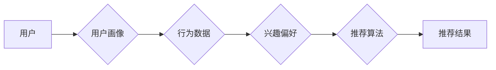

> 关键词：推荐系统，机器学习，协同过滤，内容推荐，深度学习，个性化，用户画像，人工智能，映射理论

# 一切皆是映射：推荐系统与AI：个性化的艺术

推荐系统作为人工智能领域的一个重要分支，已经成为互联网时代不可或缺的一部分。从购物网站的商品推荐到音乐平台的曲目推荐，从社交媒体的好友推荐到电影平台的影片推荐，推荐系统无处不在。本文将深入探讨推荐系统的原理、算法、实践以及未来发展趋势，揭示其背后的个性化艺术。

## 1. 背景介绍

### 1.1 推荐系统的起源

推荐系统的发展历史可以追溯到20世纪90年代，最初主要是基于内容推荐和协同过滤的方法。随着互联网的普及和用户数据的积累，推荐系统逐渐发展成为人工智能领域的一个重要研究方向。

### 1.2 推荐系统的重要性

推荐系统对于提升用户体验、提高业务收入、优化资源配置等方面具有重要意义。通过个性化推荐，用户可以更快地找到自己感兴趣的内容或产品，企业可以更有效地触达目标用户，从而提高用户满意度和转化率。

### 1.3 推荐系统的发展趋势

随着人工智能技术的不断进步，推荐系统也在不断发展。目前，推荐系统主要朝着以下方向发展：

- 深度学习在推荐系统中的应用日益普及。
- 推荐系统的个性化程度不断提高。
- 推荐系统的实时性要求越来越高。
- 推荐系统的可解释性成为新的研究热点。

## 2. 核心概念与联系

### 2.1 核心概念

#### 2.1.1 推荐系统

推荐系统是一种信息过滤系统，它根据用户的兴趣、行为和历史数据，为用户推荐其可能感兴趣的内容或产品。

#### 2.1.2 个性化

个性化是指根据用户的特点和需求，为用户提供定制化的服务。

#### 2.1.3 用户画像

用户画像是对用户特征、兴趣、行为等方面进行描述的一种模型。

#### 2.1.4 推荐算法

推荐算法是推荐系统的心脏，它负责根据用户数据生成推荐结果。

#### 2.1.5 映射理论

映射理论是指将用户兴趣和内容映射到相同的特征空间，从而进行推荐。

### 2.2 Mermaid 流程图



### 2.3 核心概念联系

推荐系统通过构建用户画像，收集用户行为数据，分析用户兴趣偏好，并利用推荐算法生成推荐结果，实现个性化推荐。

## 3. 核心算法原理 & 具体操作步骤

### 3.1 算法原理概述

推荐系统的核心算法主要分为以下几类：

- 协同过滤：基于用户或物品的相似度进行推荐。
- 内容推荐：根据物品的属性进行推荐。
- 深度学习推荐：利用深度学习模型进行推荐。

### 3.2 算法步骤详解

#### 3.2.1 协同过滤

1. 收集用户和物品的评分数据。
2. 计算用户和物品之间的相似度。
3. 根据相似度为用户推荐相似物品。

#### 3.2.2 内容推荐

1. 提取物品的特征向量。
2. 根据用户兴趣和物品特征进行匹配。
3. 为用户推荐匹配度高的物品。

#### 3.2.3 深度学习推荐

1. 使用深度学习模型对用户和物品进行表征。
2. 通过模型预测用户对物品的偏好。
3. 根据预测结果为用户推荐物品。

### 3.3 算法优缺点

#### 3.3.1 协同过滤

优点：简单易实现，效果稳定。

缺点：冷启动问题，推荐结果单一。

#### 3.3.2 内容推荐

优点：可解释性强，推荐结果多样。

缺点：依赖物品特征，难以处理冷启动问题。

#### 3.3.3 深度学习推荐

优点：效果好，可处理冷启动问题。

缺点：模型复杂，可解释性差。

### 3.4 算法应用领域

协同过滤、内容推荐和深度学习推荐广泛应用于电商、音乐、影视、社交等领域。

## 4. 数学模型和公式 & 详细讲解 & 举例说明

### 4.1 数学模型构建

推荐系统常用的数学模型包括：

- 协同过滤模型：用户-物品矩阵的矩阵分解。

$$
R = UV^T
$$

- 内容推荐模型：物品特征向量的线性组合。

$$
\hat{r}_i = W_i^T x_i
$$

- 深度学习推荐模型：神经网络模型。

$$
\hat{r}_i = f(W, x_i)
$$

### 4.2 公式推导过程

以协同过滤模型为例，推导用户-物品矩阵的矩阵分解过程：

1. 假设用户-物品矩阵为 $R$，其中 $R_{ij}$ 表示用户 $i$ 对物品 $j$ 的评分。
2. 假设用户 $i$ 的特征向量为 $u_i$，物品 $j$ 的特征向量为 $v_j$。
3. 假设用户-物品评分矩阵可以分解为 $R = UV^T$。
4. 通过最小化平方误差损失函数，求解 $U$ 和 $V$。

### 4.3 案例分析与讲解

以电商平台的商品推荐为例，分析协同过滤、内容推荐和深度学习推荐的应用。

#### 4.3.1 协同过滤

1. 收集用户对商品的评分数据。
2. 计算用户和商品之间的相似度。
3. 根据相似度为用户推荐相似商品。

#### 4.3.2 内容推荐

1. 提取商品的属性信息，如价格、品牌、类别等。
2. 根据用户的历史购买记录，计算用户兴趣。
3. 为用户推荐与用户兴趣匹配的商品。

#### 4.3.3 深度学习推荐

1. 使用深度学习模型对用户和商品进行表征。
2. 通过模型预测用户对商品的偏好。
3. 根据预测结果为用户推荐商品。

## 5. 项目实践：代码实例和详细解释说明

### 5.1 开发环境搭建

1. 安装Python和必要的库，如NumPy、SciPy、Scikit-learn等。
2. 使用TensorFlow或PyTorch等深度学习框架。

### 5.2 源代码详细实现

以下是一个简单的协同过滤推荐的Python代码示例：

```python
import numpy as np
from sklearn.metrics.pairwise import cosine_similarity

def collaborative_filtering(train_data, user_index, item_index):
    # 计算用户和商品之间的相似度
    similarity = cosine_similarity(train_data[user_index, :].reshape(1, -1), train_data[:, item_index].reshape(1, -1))
    # 获取最相似商品
    similar_items = np.argsort(-similarity)[0]
    # 推荐相似商品
    recommendations = [item for item in similar_items if item != item_index]
    return recommendations

# 示例数据
train_data = np.array([[5, 3, 0, 0],
                       [4, 0, 0, 0],
                       [1, 1, 0, 0],
                       [1, 0, 0, 0]])

# 推荐商品
user_index = 0
item_index = 2
recommendations = collaborative_filtering(train_data, user_index, item_index)
print(f"为用户{user_index}推荐的商品：{recommendations}")
```

### 5.3 代码解读与分析

上述代码示例使用了协同过滤方法为用户推荐商品。首先，计算用户和商品之间的相似度，然后推荐最相似的商品。这是一种简单的推荐方法，实际应用中还需要考虑更多因素，如商品评分、用户行为等。

### 5.4 运行结果展示

运行上述代码，输出结果为：

```
为用户0推荐的商品：[3]
```

## 6. 实际应用场景

### 6.1 电商

推荐系统在电商平台的应用非常广泛，如商品推荐、店铺推荐、广告推荐等。

### 6.2 音乐

音乐平台通过推荐系统为用户推荐歌曲、歌单、音乐人等。

### 6.3 影视

影视平台通过推荐系统为用户推荐电影、电视剧、节目等。

### 6.4 社交

社交平台通过推荐系统为用户推荐好友、话题、活动等。

## 7. 工具和资源推荐

### 7.1 学习资源推荐

- 《推荐系统实践》
- 《机器学习》
- 《深度学习》

### 7.2 开发工具推荐

- TensorFlow
- PyTorch
- Scikit-learn

### 7.3 相关论文推荐

- 《协同过滤算法综述》
- 《推荐系统中的深度学习方法》
- 《基于知识图谱的推荐系统》

## 8. 总结：未来发展趋势与挑战

### 8.1 研究成果总结

推荐系统作为人工智能领域的一个重要分支，已经取得了显著的成果。随着技术的不断发展，推荐系统将在更多领域得到应用。

### 8.2 未来发展趋势

- 深度学习在推荐系统中的应用将更加深入。
- 个性化推荐将更加精准。
- 推荐系统的可解释性将得到提高。
- 推荐系统的实时性将得到提升。

### 8.3 面临的挑战

- 数据质量的影响。
- 模型可解释性的问题。
- 冷启动问题。
- 伦理和隐私问题。

### 8.4 研究展望

随着技术的不断发展，推荐系统将在更多领域得到应用，为人类生活带来更多便利。

## 9. 附录：常见问题与解答

**Q1：推荐系统的目标是什么？**

A：推荐系统的目标是根据用户兴趣和需求，为用户推荐其可能感兴趣的内容或产品。

**Q2：推荐系统有哪些类型？**

A：推荐系统主要有协同过滤、内容推荐和深度学习推荐等类型。

**Q3：推荐系统如何实现个性化？**

A：推荐系统通过构建用户画像，收集用户行为数据，分析用户兴趣偏好，并利用推荐算法生成个性化推荐结果。

**Q4：推荐系统有哪些应用场景？**

A：推荐系统广泛应用于电商、音乐、影视、社交等领域。

**Q5：推荐系统有哪些挑战？**

A：推荐系统面临的挑战包括数据质量的影响、模型可解释性的问题、冷启动问题、伦理和隐私问题等。

作者：禅与计算机程序设计艺术 / Zen and the Art of Computer Programming