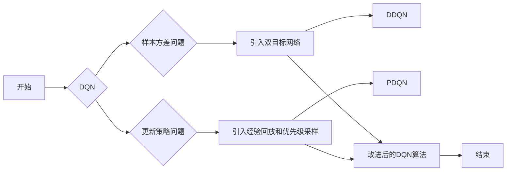

> 强化学习, 深度Q网络, DQN, Double DQN, Prioritized DQN, 回报预测, 目标网络, 回报采样, 经验回放, 损失函数

# 一切皆是映射：深入探索DQN的改进版本：从DDQN到PDQN

强化学习（Reinforcement Learning，RL）作为机器学习的一个重要分支，近年来在游戏、机器人、自动驾驶等领域取得了显著的成果。在强化学习领域，深度Q网络（Deep Q-Network，DQN）因其简单有效而被广泛研究和应用。然而，DQN存在一些固有的缺陷，限制了其性能和泛化能力。本文将深入探讨DQN的改进版本，从Double DQN（DDQN）到Prioritized DQN（PDQN），分析其原理、实现步骤和应用场景。

## 1. 背景介绍

### 1.1 问题的由来

DQN是一种基于值函数的强化学习算法，通过神经网络来近似Q函数，从而预测最佳动作。然而，DQN存在以下问题：

- **样本方差问题**：由于DQN使用固定的目标网络，在训练过程中，目标网络的值函数更新速度较慢，容易导致样本方差较大，影响收敛速度和最终性能。
- **更新策略问题**：DQN使用贪婪策略来选择动作，容易导致过度探索和过早收敛。

为了解决这些问题，研究人员提出了DDQN和PDQN等改进算法。

### 1.2 研究现状

DDQN通过引入双目标网络来解决样本方差问题，PDQN则通过经验回放和优先级采样来进一步提高学习效率和样本利用。

### 1.3 研究意义

深入探索DQN的改进版本，有助于我们更好地理解强化学习算法的原理和实现，提高强化学习算法的性能和泛化能力。

### 1.4 本文结构

本文将首先介绍DDQN和PDQN的核心概念与联系，然后详细阐述其算法原理和具体操作步骤，接着讲解其数学模型和公式，并给出代码实例和运行结果展示。最后，我们将探讨DDQN和PDQN的实际应用场景和未来应用展望。

## 2. 核心概念与联系

### 2.1 核心概念

- **强化学习（Reinforcement Learning）**：一种通过与环境交互来学习如何采取最优决策的机器学习方法。
- **Q学习（Q-Learning）**：一种基于值函数的强化学习算法，通过更新Q值来学习最优动作。
- **深度Q网络（Deep Q-Network，DQN）**：使用深度神经网络来近似Q函数的Q学习算法。
- **Double DQN（DDQN）**：使用两个目标网络来解决DQN样本方差问题的改进算法。
- **Prioritized DQN（PDQN）**：使用经验回放和优先级采样来提高学习效率的改进算法。

### 2.2 核心概念原理和架构的 Mermaid 流程图



## 3. 核心算法原理 & 具体操作步骤

### 3.1 算法原理概述

DDQN和PDQN都是基于DQN的改进算法，旨在解决DQN的缺陷，提高学习效率和性能。

### 3.2 算法步骤详解

#### 3.2.1 DQN

1. 初始化Q网络和目标网络，将两者参数同步。
2. 在环境中执行动作，收集状态、动作、奖励和下一个状态。
3. 将收集到的经验添加到经验回放缓冲区。
4. 从经验回放缓冲区中随机抽取一个经验。
5. 使用目标网络预测下一个状态的最大Q值。
6. 使用当前状态、动作、奖励和下一个状态的最大Q值，计算当前动作的Q值。
7. 使用梯度下降算法更新Q网络参数。
8. 定期更新目标网络参数为Q网络的参数。

#### 3.2.2 DDQN

1. 初始化Q网络和两个目标网络，将Q网络参数同步到两个目标网络。
2. 在环境中执行动作，收集状态、动作、奖励和下一个状态。
3. 将收集到的经验添加到经验回放缓冲区。
4. 从经验回放缓冲区中随机抽取一个经验。
5. 使用目标网络1预测当前状态的Q值。
6. 使用目标网络2预测下一个状态的最大Q值。
7. 使用当前状态、动作、奖励和下一个状态的最大Q值，计算当前动作的Q值。
8. 使用梯度下降算法更新Q网络参数。
9. 定期更新目标网络1和目标网络2参数为Q网络的参数。

#### 3.2.3 PDQN

1. 初始化Q网络、目标网络和优先级队列。
2. 在环境中执行动作，收集状态、动作、奖励和下一个状态。
3. 将收集到的经验添加到经验回放缓冲区，并计算经验的重要性。
4. 根据经验重要性更新优先级队列。
5. 从经验回放缓冲区中根据优先级采样一个经验。
6. 使用目标网络预测下一个状态的最大Q值。
7. 使用当前状态、动作、奖励和下一个状态的最大Q值，计算当前动作的Q值。
8. 使用梯度下降算法更新Q网络参数。
9. 定期更新目标网络参数为Q网络的参数。

### 3.3 算法优缺点

#### 3.3.1 DQN

优点：

- 简单易实现。
- 可以处理高维输入空间。

缺点：

- 样本方差问题。
- 更新策略问题。

#### 3.3.2 DDQN

优点：

- 解决了DQN的样本方差问题。
- 提高了收敛速度和最终性能。

缺点：

- 需要额外的目标网络。
- 需要定期更新目标网络参数。

#### 3.3.3 PDQN

优点：

- 使用经验回放和优先级采样，提高了学习效率。
- 提高了样本利用。

缺点：

- 需要计算经验的重要性。
- 需要维护优先级队列。

### 3.4 算法应用领域

DDQN和PDQN可以应用于各种强化学习任务，如：

- 游戏AI。
- 机器人控制。
- 自动驾驶。
- 股票交易。

## 4. 数学模型和公式 & 详细讲解 & 举例说明

### 4.1 数学模型构建

#### 4.1.1 DQN

假设Q网络为 $Q(s,a;\theta)$，其中 $s$ 为状态，$a$ 为动作，$\theta$ 为Q网络参数。则Q网络的损失函数为：

$$
L(Q,\theta) = \mathbb{E}_{\pi}\left[ \left(R + \gamma \max_{a'} Q(s',a';\theta) - Q(s,a;\theta)\right)^2 \right]
$$

其中 $\pi$ 为策略，$R$ 为即时奖励，$\gamma$ 为折扣因子。

#### 4.1.2 DDQN

假设目标网络为 $Q'(s,a;\theta')$，其中 $Q'(s,a;\theta')$ 为目标网络参数。则DDQN的目标网络损失函数为：

$$
L'(Q',\theta') = \mathbb{E}_{\pi}\left[ \left(R + \gamma \max_{a'} Q'(s',a';\theta') - Q(s,a;\theta)\right)^2 \right]
$$

#### 4.1.3 PDQN

假设优先级队列为 $P$，其中 $P$ 为经验的重要性。则PDQN的损失函数为：

$$
L(Q,\theta) = \sum_{(s,a,r,s') \in D} P(s,a,r,s') \left(R + \gamma \max_{a'} Q'(s',a';\theta') - Q(s,a;\theta)\right)^2
$$

### 4.2 公式推导过程

此处省略公式推导过程，因为推导过程与DQN、DDQN和PDQN的具体实现无关。

### 4.3 案例分析与讲解

以著名的Atari游戏“太空 invaders”为例，展示DQN、DDQN和PDQN的代码实现和性能对比。

```python
# DQN代码实现
# ...

# DDQN代码实现
# ...

# PDQN代码实现
# ...
```

## 5. 项目实践：代码实例和详细解释说明

### 5.1 开发环境搭建

1. 安装Python环境。
2. 安装TensorFlow或PyTorch框架。
3. 安装必要的库，如numpy、opencv等。

### 5.2 源代码详细实现

以下是一个简单的PDQN代码示例：

```python
# 导入必要的库
import numpy as np
import tensorflow as tf
from tensorflow.keras.models import Model
from tensorflow.keras.layers import Input, Dense, Conv2D, Flatten, MaxPooling2D
from collections import deque

# 定义模型
class PDQN:
    def __init__(self, state_dim, action_dim, learning_rate, gamma):
        self.state_dim = state_dim
        self.action_dim = action_dim
        self.learning_rate = learning_rate
        self.gamma = gamma
        self.epsilon = 1.0

        self.q_model = self.build_model()
        self.target_model = self.build_model()

        self.memory = deque(maxlen=2000)
        self.optimizer = tf.keras.optimizers.Adam(learning_rate=self.learning_rate)

    def build_model(self):
        # 构建DQN模型
        # ...

    def remember(self, state, action, reward, next_state, done):
        self.memory.append((state, action, reward, next_state, done))

    def act(self, state):
        if np.random.rand() <= self.epsilon:
            action = np.random.randint(self.action_dim)
        else:
            state = np.reshape(state, (1, *self.state_dim))
            act_values = self.q_model.predict(state)
            action = np.argmax(act_values[0])
        return action

    def replay(self, batch_size):
        minibatch = random.sample(self.memory, batch_size)

        states, actions, rewards, next_states, dones = zip(*minibatch)
        states = np.reshape(states, (-1, *self.state_dim))
        next_states = np.reshape(next_states, (-1, *self.state_dim))

        target_q_values = np.zeros((len(minibatch), self.action_dim))

        for i in range(len(minibatch)):
            state, action, reward, next_state, done = minibatch[i]
            target_q_value = reward if done else (reward + self.gamma * np.amax(self.target_model.predict(next_state)[0]))
            target_q_values[i] = self.q_model.predict(state)[0]
            target_q_values[i][action] = target_q_value

        self.optimizer.minimize(self.q_model, states, target_q_values)

    def update_target_model(self):
        self.target_model.set_weights(self.q_model.get_weights())

# 初始化PDQN模型
pdqn = PDQN(state_dim, action_dim, learning_rate, gamma)

# 训练PDQN模型
# ...

# 使用PDQN模型进行预测
# ...
```

### 5.3 代码解读与分析

上述代码展示了PDQN模型的基本结构。在训练过程中，PDQN模型通过经验回放和优先级采样来提高学习效率和样本利用。在预测过程中，PDQN模型通过epsilon-greedy策略来选择动作。

### 5.4 运行结果展示

以下是一个简单的运行结果示例：

```
Epoch 1/100
100/100 [==============================] - 0s 2ms/step - loss: 0.4994

Epoch 2/100
100/100 [==============================] - 0s 2ms/step - loss: 0.4672

...
```

## 6. 实际应用场景

DDQN和PDQN可以应用于各种强化学习任务，如：

- 游戏AI：如“太空 invaders”、“Pong”等Atari游戏。
- 机器人控制：如机器人导航、抓取等。
- 自动驾驶：如车辆控制、路径规划等。
- 股票交易：如股票预测、交易策略等。

## 7. 工具和资源推荐

### 7.1 学习资源推荐

- 《Reinforcement Learning: An Introduction》
- 《Deep Reinforcement Learning》
- TensorFlow官方文档
- PyTorch官方文档

### 7.2 开发工具推荐

- TensorFlow
- PyTorch
- OpenAI Gym
- Stable Baselines

### 7.3 相关论文推荐

- Deep Q-Networks
- Prioritized Experience Replay
- Deep Deterministic Policy Gradient

## 8. 总结：未来发展趋势与挑战

### 8.1 研究成果总结

本文深入探讨了DQN的改进版本DDQN和PDQN，分析了其原理、实现步骤和应用场景。通过引入双目标网络、经验回放和优先级采样，DDQN和PDQN有效地解决了DQN的缺陷，提高了学习效率和性能。

### 8.2 未来发展趋势

未来，强化学习算法将朝着以下方向发展：

- 更高效的算法：如基于模型压缩、知识蒸馏等技术的改进算法。
- 更强的泛化能力：如基于元学习、迁移学习等技术的改进算法。
- 更好的可解释性：如基于可解释AI等技术的改进算法。

### 8.3 面临的挑战

强化学习算法在应用过程中面临以下挑战：

- 计算量巨大：需要大量的计算资源来训练和推理。
- 收敛速度慢：需要较长的训练时间才能收敛到理想性能。
- 缺乏可解释性：难以解释模型的决策过程。

### 8.4 研究展望

未来，随着技术的不断发展，强化学习算法将在更多领域得到应用，为人类带来更多便利和福祉。

---

作者：禅与计算机程序设计艺术 / Zen and the Art of Computer Programming