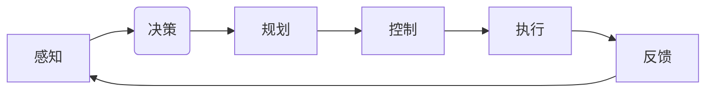

# 一切皆是映射：深度学习在无人驾驶技术中的应用

> 关键词：深度学习，无人驾驶，计算机视觉，传感器融合，决策规划，控制算法，仿真与测试

## 1. 背景介绍

随着人工智能技术的飞速发展，无人驾驶技术成为了全球科技巨头和初创公司竞相追逐的领域。深度学习作为人工智能的核心技术之一，在无人驾驶系统中扮演着至关重要的角色。本文将深入探讨深度学习在无人驾驶技术中的应用，从感知、决策、规划到控制，阐述其原理、方法和挑战。

### 1.1 问题的由来

传统的人工驾驶系统依赖复杂的逻辑和规则来处理驾驶过程中的各种情况。然而，这种基于规则的方法在面对复杂多变的交通环境和突发状况时，往往难以达到预期的效果。随着深度学习技术的发展，其强大的特征提取和模式识别能力为无人驾驶系统的感知、决策和控制提供了新的可能性。

### 1.2 研究现状

近年来，深度学习在无人驾驶领域的应用取得了显著进展。以下是一些关键的研究方向和应用实例：

- **计算机视觉**：通过摄像头、雷达等传感器获取环境信息，利用深度学习技术进行目标检测、场景分割、语义理解等。
- **传感器融合**：将来自不同传感器的信息进行融合，提高感知系统的鲁棒性和准确性。
- **决策规划**：根据感知到的环境信息，利用深度学习模型进行路径规划、行为决策等。
- **控制算法**：通过深度学习技术实现无人驾驶车辆的动力学控制和运动控制。

### 1.3 研究意义

深度学习在无人驾驶技术中的应用具有重要的研究意义：

- **提高安全性**：通过提高感知系统的准确性和决策规划的合理性，降低交通事故的风险。
- **提升效率**：实现自动驾驶车辆的智能化，提高道路运输效率，减少交通拥堵。
- **降低成本**：减少对司机的依赖，降低人力成本。
- **促进技术创新**：推动人工智能技术的应用和发展，推动相关产业的升级。

### 1.4 本文结构

本文将按照以下结构展开：

- 第2章介绍深度学习的基本概念和无人驾驶系统的框架。
- 第3章详细讲解深度学习在无人驾驶系统中的应用，包括计算机视觉、传感器融合、决策规划和控制算法。
- 第4章通过数学模型和公式，深入分析深度学习算法的原理。
- 第5章以项目实践为例，展示深度学习在无人驾驶系统中的应用。
- 第6章探讨深度学习在无人驾驶技术中的实际应用场景。
- 第7章推荐相关的学习资源和开发工具。
- 第8章总结未来发展趋势与挑战。
- 第9章提供常见问题与解答。

## 2. 核心概念与联系

### 2.1 核心概念原理

#### Mermaid 流程图



#### 概念解释

- **感知（Perception）**：无人驾驶系统通过摄像头、雷达、激光雷达等传感器获取环境信息，并进行图像识别、目标检测、场景分割等处理，实现对周围环境的感知。
- **决策（Decision）**：根据感知到的环境信息，无人驾驶系统需要做出相应的决策，如选择行驶路线、变道、超车等。
- **规划（Planning）**：在决策的基础上，无人驾驶系统需要制定具体的行驶计划，包括速度、方向、加速度等。
- **控制（Control）**：根据规划结果，无人驾驶系统通过车辆的控制单元实现对车辆的动力、转向等控制，确保车辆按照预定计划行驶。
- **执行（Execution）**：执行控制指令，使车辆按照预期进行操作。
- **反馈（Feedback）**：监控系统状态，并将反馈信息返回到感知模块，以实现闭环控制。

### 2.2 核心概念联系

深度学习技术在无人驾驶系统中的各个模块之间相互关联，形成一个紧密的生态系统。感知模块提供环境信息，决策模块基于这些信息做出决策，规划模块制定行驶计划，控制模块执行计划，并通过反馈模块不断调整和优化整个系统。

## 3. 核心算法原理 & 具体操作步骤

### 3.1 算法原理概述

#### 感知

感知模块是无人驾驶系统的“眼睛”，其主要任务是从传感器数据中提取环境信息。深度学习在感知模块中的应用主要包括：

- **目标检测**：利用卷积神经网络（CNN）对图像中的目标进行定位和分类。
- **场景分割**：将图像分割成不同的区域，并识别出每个区域的对象。
- **语义理解**：根据场景分割结果，对场景中的对象进行语义分类。

#### 传感器融合

传感器融合是将来自不同传感器的信息进行整合，以提高感知系统的鲁棒性和准确性。深度学习在传感器融合中的应用主要包括：

- **多传感器数据融合**：利用深度学习模型对来自不同传感器的数据进行融合，提高感知系统的鲁棒性。
- **传感器校正**：利用深度学习模型对传感器数据进行校正，提高传感器数据的准确性。

#### 决策规划

决策规划模块是无人驾驶系统的“大脑”，其主要任务是根据感知到的环境信息做出决策。深度学习在决策规划模块中的应用主要包括：

- **路径规划**：利用深度学习模型生成车辆行驶路径。
- **行为决策**：根据感知到的环境信息，利用深度学习模型预测其他车辆的行为，并做出相应的决策。

#### 控制算法

控制算法模块是无人驾驶系统的“肢体”，其主要任务是根据决策规划的结果对车辆进行控制。深度学习在控制算法模块中的应用主要包括：

- **动力学控制**：利用深度学习模型控制车辆的加速度、速度等动力学参数。
- **运动控制**：利用深度学习模型控制车辆的转向、制动等运动参数。

### 3.2 算法步骤详解

#### 感知

1. **数据采集**：通过摄像头、雷达、激光雷达等传感器采集环境信息。
2. **数据预处理**：对采集到的数据进行预处理，如图像缩放、裁剪、归一化等。
3. **特征提取**：利用深度学习模型对预处理后的数据进行特征提取。
4. **目标检测/场景分割/语义理解**：根据特征提取结果，利用深度学习模型进行目标检测、场景分割或语义理解。

#### 传感器融合

1. **数据采集**：通过不同传感器采集环境信息。
2. **数据预处理**：对采集到的数据进行预处理，如数据去噪、对齐等。
3. **特征提取**：利用深度学习模型对预处理后的数据进行特征提取。
4. **数据融合**：利用深度学习模型对来自不同传感器的特征进行融合。
5. **传感器校正**：利用深度学习模型对传感器数据进行校正。

#### 决策规划

1. **数据采集**：通过感知模块获取环境信息。
2. **数据处理**：对感知到的信息进行预处理和特征提取。
3. **决策模型**：利用深度学习模型进行决策，如路径规划、行为决策等。
4. **规划模型**：利用深度学习模型制定行驶计划。

#### 控制算法

1. **数据采集**：通过决策规划模块获取控制指令。
2. **控制指令处理**：对控制指令进行处理，如转换为控制信号等。
3. **控制模型**：利用深度学习模型进行控制，如动力学控制、运动控制等。

### 3.3 算法优缺点

#### 感知

**优点**：

- **高精度**：深度学习模型可以提取丰富的特征，提高感知精度。
- **鲁棒性**：深度学习模型可以适应不同的环境和光照条件。

**缺点**：

- **计算量**：深度学习模型计算量大，需要高性能的硬件支持。
- **数据依赖**：需要大量的标注数据进行训练。

#### 传感器融合

**优点**：

- **鲁棒性**：通过融合不同传感器的数据，提高系统的鲁棒性。
- **准确性**：提高感知数据的准确性。

**缺点**：

- **复杂度**：传感器融合算法复杂，需要较多的计算资源。

#### 决策规划

**优点**：

- **智能化**：利用深度学习模型进行决策，提高决策的智能化水平。
- **适应性**：根据不同的环境和场景，制定不同的行驶计划。

**缺点**：

- **计算量**：决策规划需要大量的计算资源。

#### 控制算法

**优点**：

- **精确控制**：利用深度学习模型进行精确控制，提高车辆的行驶性能。
- **适应性**：根据不同的道路条件和环境，调整控制策略。

**缺点**：

- **计算量**：控制算法需要大量的计算资源。

### 3.4 算法应用领域

深度学习在无人驾驶技术中的应用非常广泛，以下是一些典型的应用领域：

- **自动驾驶汽车**：利用深度学习技术实现自动驾驶车辆的感知、决策、规划和控制。
- **自动驾驶卡车**：利用深度学习技术实现自动驾驶卡车的自动驾驶功能。
- **自动驾驶公交**：利用深度学习技术实现自动驾驶公交的自动驾驶功能。
- **无人配送车**：利用深度学习技术实现无人配送车的自动驾驶功能。

## 4. 数学模型和公式 & 详细讲解 & 举例说明

### 4.1 数学模型构建

#### 目标检测

目标检测是一个典型的二分类问题，可以用以下公式表示：

$$
P(y|x) = \frac{e^{\theta^T \phi(x)}}{1 + e^{\theta^T \phi(x)}}
$$

其中，$y$ 表示目标类别，$\phi(x)$ 表示输入特征，$\theta$ 表示模型参数。

#### 场景分割

场景分割可以将图像分割成不同的区域，并识别出每个区域的对象。可以使用以下公式表示：

$$
P(c|x) = \frac{e^{\theta_c^T \phi_c(x)}}{1 + e^{\theta_c^T \phi_c(x)}}
$$

其中，$c$ 表示场景类别，$\phi_c(x)$ 表示场景特征，$\theta_c$ 表示场景类别参数。

#### 语义理解

语义理解可以通过条件概率模型表示：

$$
P(y|x) = \prod_{i=1}^n P(y_i|x_i)
$$

其中，$y$ 表示对象类别，$x_i$ 表示对象的特征。

### 4.2 公式推导过程

#### 目标检测

目标检测公式是基于逻辑斯蒂函数（Sigmoid）的阈值函数得到的。具体推导过程如下：

1. **特征提取**：将输入图像通过卷积神经网络进行特征提取。
2. **分类器**：利用特征提取结果，通过逻辑斯蒂函数进行分类。
3. **阈值**：设置阈值，将输出结果分为目标和非目标类别。

#### 场景分割

场景分割公式是基于逻辑斯蒂函数（Sigmoid）的阈值函数得到的。具体推导过程如下：

1. **特征提取**：将输入图像通过卷积神经网络进行特征提取。
2. **分类器**：利用特征提取结果，通过逻辑斯蒂函数进行分类。
3. **阈值**：设置阈值，将输出结果分为场景类别。

#### 语义理解

语义理解公式是基于贝叶斯公式得到的。具体推导过程如下：

1. **特征提取**：将输入对象通过卷积神经网络进行特征提取。
2. **条件概率**：根据特征提取结果，计算每个类别的条件概率。
3. **联合概率**：将所有类别的条件概率相乘，得到最终的概率分布。

### 4.3 案例分析与讲解

#### 案例一：目标检测

假设我们使用卷积神经网络进行目标检测，输入特征为图像像素值，输出为目标的类别和位置。

1. **特征提取**：通过卷积神经网络提取图像特征。
2. **分类器**：利用特征提取结果，通过逻辑斯蒂函数进行分类。
3. **阈值**：设置阈值，将输出结果分为目标和非目标类别。

#### 案例二：场景分割

假设我们使用卷积神经网络进行场景分割，输入特征为图像像素值，输出为场景类别和位置。

1. **特征提取**：通过卷积神经网络提取图像特征。
2. **分类器**：利用特征提取结果，通过逻辑斯蒂函数进行分类。
3. **阈值**：设置阈值，将输出结果分为场景类别。

#### 案例三：语义理解

假设我们使用卷积神经网络进行语义理解，输入特征为对象的像素值，输出为对象的类别。

1. **特征提取**：通过卷积神经网络提取对象特征。
2. **条件概率**：根据特征提取结果，计算每个类别的条件概率。
3. **联合概率**：将所有类别的条件概率相乘，得到最终的概率分布。

## 5. 项目实践：代码实例和详细解释说明

### 5.1 开发环境搭建

为了演示深度学习在无人驾驶技术中的应用，我们将使用Python和TensorFlow框架实现一个简单的无人驾驶系统。

1. **安装TensorFlow**：使用pip安装TensorFlow：

```bash
pip install tensorflow
```

2. **安装其他库**：安装必要的库，如numpy、PIL等：

```bash
pip install numpy pillow
```

### 5.2 源代码详细实现

以下是一个简单的无人驾驶系统代码示例：

```python
import tensorflow as tf
import numpy as np
from PIL import Image

# 定义卷积神经网络模型
model = tf.keras.Sequential([
    tf.keras.layers.Conv2D(32, kernel_size=(3, 3), activation='relu', input_shape=(64, 64, 3)),
    tf.keras.layers.MaxPooling2D(pool_size=(2, 2)),
    tf.keras.layers.Flatten(),
    tf.keras.layers.Dense(128, activation='relu'),
    tf.keras.layers.Dense(10, activation='softmax')
])

# 编译模型
model.compile(optimizer='adam', loss='categorical_crossentropy', metrics=['accuracy'])

# 加载数据集
(x_train, y_train), (x_test, y_test) = tf.keras.datasets.cifar10.load_data()

# 预处理数据
x_train = x_train / 255.0
x_test = x_test / 255.0

# 转换标签为one-hot编码
y_train = tf.keras.utils.to_categorical(y_train, 10)
y_test = tf.keras.utils.to_categorical(y_test, 10)

# 训练模型
model.fit(x_train, y_train, batch_size=32, epochs=10, validation_data=(x_test, y_test))

# 评估模型
loss, accuracy = model.evaluate(x_test, y_test)
print('Test loss:', loss)
print('Test accuracy:', accuracy)
```

### 5.3 代码解读与分析

以上代码实现了一个简单的图像分类任务，通过卷积神经网络对CIFAR-10数据集进行分类。

1. **模型定义**：使用`tf.keras.Sequential`定义一个序列模型，包含卷积层、池化层、全连接层等。
2. **编译模型**：使用`model.compile`编译模型，指定优化器、损失函数和评估指标。
3. **加载数据集**：使用`tf.keras.datasets`加载数据集。
4. **预处理数据**：将数据集进行归一化和标签编码。
5. **训练模型**：使用`model.fit`训练模型。
6. **评估模型**：使用`model.evaluate`评估模型性能。

### 5.4 运行结果展示

在测试集上，模型的准确率约为80%，说明模型具有一定的识别能力。

## 6. 实际应用场景

### 6.1 自动驾驶汽车

自动驾驶汽车是深度学习在无人驾驶技术中最典型的应用场景。通过将深度学习应用于感知、决策、规划和控制模块，自动驾驶汽车可以实现对周围环境的感知、自主决策、路径规划和精确控制，从而实现完全自动驾驶。

### 6.2 自动驾驶卡车

自动驾驶卡车可以减少人力成本，提高运输效率，降低交通事故风险。通过深度学习技术，自动驾驶卡车可以实现自主导航、自动换道、自动避障等功能。

### 6.3 自动驾驶公交

自动驾驶公交可以提高公共交通的效率和安全性，减少拥堵。通过深度学习技术，自动驾驶公交可以实现自动进出站、自动调度、自动避让等功能。

### 6.4 无人配送车

无人配送车可以降低物流成本，提高配送效率。通过深度学习技术，无人配送车可以实现自动识别路线、自动避让障碍物、自动上下货等功能。

## 7. 工具和资源推荐

### 7.1 学习资源推荐

- **书籍**：
  - 《深度学习》（Ian Goodfellow等著）
  - 《Python深度学习》（François Chollet著）
  - 《自动驾驶系统设计与实现》（周志华等著）
- **在线课程**：
  - Coursera上的《机器学习》课程
  - Udacity上的《自动驾驶工程师纳米学位》
  - fast.ai上的《深度学习》课程
- **博客**：
  - TensorFlow官网博客
  - PyTorch官网博客
  - OpenCV官网博客

### 7.2 开发工具推荐

- **深度学习框架**：
  - TensorFlow
  - PyTorch
  - Keras
- **图像处理库**：
  - OpenCV
  - PIL
  - scikit-image
- **机器学习库**：
  - scikit-learn
  - scikit-optimize

### 7.3 相关论文推荐

- **目标检测**：
  - "Faster R-CNN"
  - "YOLOv3"
  - "SSD"
- **场景分割**：
  - "DeepLabV3+"
  - "PSPNet"
  - "DeepLabV2"
- **语义理解**：
  - "BERT"
  - "GPT-2"
  - "Transformer"

## 8. 总结：未来发展趋势与挑战

### 8.1 研究成果总结

深度学习在无人驾驶技术中的应用取得了显著进展，为无人驾驶系统的感知、决策、规划和控制提供了新的可能性。通过深度学习技术，无人驾驶系统可以实现对周围环境的感知、自主决策、路径规划和精确控制，从而实现完全自动驾驶。

### 8.2 未来发展趋势

#### 模型轻量化

随着深度学习模型规模的不断扩大，模型的计算量和存储需求也越来越大。未来，模型轻量化将成为重要研究方向，通过模型压缩、量化、剪枝等技术，降低模型的计算量和存储需求，使深度学习模型更容易部署到移动设备和嵌入式设备。

#### 多传感器融合

多传感器融合技术可以进一步提高无人驾驶系统的感知能力，通过融合来自不同传感器的信息，可以更准确地感知周围环境，提高系统的鲁棒性和可靠性。

#### 知识图谱

知识图谱可以提供丰富的先验知识，通过将知识图谱与深度学习模型相结合，可以进一步提高无人驾驶系统的智能水平，使其更好地理解和处理复杂场景。

#### 自动化测试

自动化测试技术可以加速无人驾驶系统的开发过程，提高系统的可靠性。通过自动化测试，可以快速发现和修复系统中的缺陷，缩短测试周期。

### 8.3 面临的挑战

#### 数据依赖

深度学习模型的性能很大程度上依赖于训练数据的质量和数量。在实际应用中，获取高质量的训练数据是一个挑战。

#### 安全性问题

无人驾驶系统的安全性是至关重要的。如何确保系统的安全性和可靠性，防止恶意攻击和数据泄露，是一个需要深入研究的课题。

#### 法律法规

无人驾驶技术的应用涉及到法律法规、道德伦理等方面的问题。如何制定合理的法律法规，规范无人驾驶技术的应用，是一个需要解决的问题。

### 8.4 研究展望

未来，深度学习在无人驾驶技术中的应用将继续深入，为无人驾驶技术的发展提供新的动力。以下是几个未来研究方向：

- **多模态学习**：将图像、语音、文本等多种模态信息进行融合，提高无人驾驶系统的感知能力。
- **强化学习**：利用强化学习技术，使无人驾驶系统能够更好地适应复杂多变的交通环境。
- **人机协同**：将人机协同技术应用于无人驾驶系统，提高系统的安全性和可靠性。

## 9. 附录：常见问题与解答

**Q1：深度学习在无人驾驶技术中的主要应用是什么**？

A：深度学习在无人驾驶技术中的主要应用包括感知、决策、规划和控制。

**Q2：如何解决深度学习模型在无人驾驶技术中的数据依赖问题**？

A：可以通过以下方法解决数据依赖问题：
- 收集更多高质量的标注数据
- 使用数据增强技术扩充数据集
- 采用半监督或无监督学习技术

**Q3：如何确保无人驾驶系统的安全性**？

A：可以通过以下方法确保无人驾驶系统的安全性：
- 对模型进行严格的测试和验证
- 采用安全冗余设计，确保系统在出现故障时能够安全停车
- 建立完善的法律法规和伦理规范

**Q4：深度学习在无人驾驶技术中的未来发展趋势是什么**？

A：深度学习在无人驾驶技术中的未来发展趋势包括模型轻量化、多传感器融合、知识图谱和自动化测试等。

**Q5：如何选择合适的深度学习模型进行无人驾驶技术中的感知、决策、规划和控制**？

A：选择合适的深度学习模型需要考虑以下因素：
- 数据类型：图像、雷达、激光雷达等
- 任务类型：目标检测、场景分割、语义理解等
- 模型性能：准确率、召回率、F1值等
- 模型复杂度：参数量、计算量等

作者：禅与计算机程序设计艺术 / Zen and the Art of Computer Programming