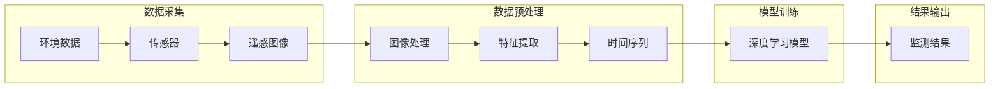

# 一切皆是映射：深度学习在环境监测中的应用

> 关键词：深度学习，环境监测，遥感，图像处理，传感器，时间序列分析，人工智能

## 1. 背景介绍

环境监测是保障人类生存环境健康和可持续发展的重要手段。随着全球气候变化、环境污染和资源枯竭等问题日益突出，对环境监测的需求日益增长。传统的环境监测方法主要依赖于地面监测站、卫星遥感等手段，但这些方法往往存在覆盖范围有限、成本高昂、时效性差等问题。近年来，深度学习技术的飞速发展为环境监测带来了新的机遇，通过将深度学习与遥感、传感器、时间序列分析等技术相结合，实现对环境参数的自动化、智能化监测。

## 2. 核心概念与联系

### 2.1 核心概念

#### 深度学习

深度学习是一种模拟人脑神经网络结构和功能的计算模型，通过多层的非线性变换，实现数据的自动特征提取和模式识别。深度学习在图像识别、语音识别、自然语言处理等领域取得了显著的成果。

#### 环境监测

环境监测是指对环境中的各种参数进行实时监测和评估，以了解环境状况和变化趋势。环境监测参数包括空气质量、水质、土壤质量、生物多样性等。

#### 遥感

遥感是指利用航空器、卫星等平台获取地球表面信息的技术。遥感技术可以获取大范围、高分辨率的遥感图像，为环境监测提供重要数据来源。

#### 传感器

传感器是一种能够感受被测量的物理量并将其转换为可用信号的装置。传感器在环境监测中扮演着关键角色，可以实时监测环境参数的变化。

#### 时间序列分析

时间序列分析是指对随时间变化的数据序列进行分析，以揭示数据中的趋势、周期性、季节性等特征。

### 2.2 架构流程图



如图所示，环境监测的流程可以分为数据采集、数据预处理、模型训练和结果输出四个阶段。深度学习模型在特征提取和监测结果输出环节发挥关键作用。

## 3. 核心算法原理 & 具体操作步骤

### 3.1 算法原理概述

深度学习在环境监测中的应用主要包括以下几种模型：

#### 卷积神经网络（CNN）

卷积神经网络（CNN）是一种专门用于图像识别和处理的深度学习模型。CNN可以自动学习图像的局部特征，并在高维空间中进行特征表示。

#### 循环神经网络（RNN）

循环神经网络（RNN）是一种处理序列数据的深度学习模型。RNN可以捕捉序列数据中的时间依赖关系，并学习序列中的长期模式。

#### 长短期记忆网络（LSTM）

长短期记忆网络（LSTM）是RNN的一种变体，能够更好地学习长距离的时间依赖关系。

#### 自动编码器（AE）

自动编码器（AE）是一种无监督学习模型，可以学习数据的低维表示，并用于降维、去噪等任务。

### 3.2 算法步骤详解

#### 数据采集

1. 建立地面监测站，安装传感器，实时监测环境参数。
2. 利用卫星遥感技术获取大范围、高分辨率的遥感图像。

#### 数据预处理

1. 对遥感图像进行预处理，包括图像增强、去噪、裁剪等。
2. 从遥感图像中提取感兴趣区域（ROI）。
3. 对传感器数据和时间序列数据进行预处理，如归一化、标准化等。

#### 模型训练

1. 选择合适的深度学习模型，如CNN、RNN、LSTM、AE等。
2. 使用预处理后的数据对模型进行训练，优化模型参数。
3. 在验证集上评估模型性能，调整模型结构和参数。

#### 结果输出

1. 使用训练好的模型对新的遥感图像或传感器数据进行监测，输出监测结果。
2. 将监测结果可视化，分析环境变化趋势。

### 3.3 算法优缺点

#### CNN

**优点**：

- 针对图像数据，具有良好的特征提取和分类能力。
- 自动学习局部特征，无需人工设计特征。

**缺点**：

- 对小样本数据敏感，需要大量训练数据。
- 难以处理序列数据。

#### RNN和LSTM

**优点**：

- 针对序列数据，能够捕捉时间依赖关系。
- 适用于处理时间序列分析任务。

**缺点**：

- 训练效率低，对超参数敏感。
- 容易出现梯度消失和梯度爆炸问题。

#### AE

**优点**：

- 无需标签数据，可以用于降维、去噪等任务。

**缺点**：

- 难以解释模型决策过程。
- 学习到的低维表示可能丢失部分信息。

### 3.4 算法应用领域

深度学习在环境监测中的应用领域包括：

- 空气质量监测
- 水质监测
- 土壤质量监测
- 生物多样性监测
- 森林火灾监测
- 水资源监测

## 4. 数学模型和公式 & 详细讲解 & 举例说明

### 4.1 数学模型构建

以CNN为例，介绍其数学模型构建过程。

#### CNN模型结构

CNN模型由多个卷积层、池化层和全连接层组成。

#### 卷积层

卷积层通过卷积操作提取图像的局部特征，公式如下：

$$
\text{conv}(x) = f(W \cdot x + b)
$$

其中，$x$ 为输入图像，$W$ 为卷积核权重，$b$ 为偏置项，$f$ 为非线性激活函数。

#### 池化层

池化层用于降低特征图的空间维度，减少模型参数数量，公式如下：

$$
\text{pool}(x) = \max(p_{i,j})
$$

其中，$x$ 为输入特征图，$p_{i,j}$ 为池化窗口内的最大值。

#### 全连接层

全连接层将特征图展平，并通过全连接操作输出最终结果，公式如下：

$$
\text{fc}(x) = W \cdot x + b
$$

其中，$x$ 为输入特征向量，$W$ 为权重矩阵，$b$ 为偏置项。

### 4.2 公式推导过程

以CNN的卷积层为例，介绍其公式推导过程。

#### 卷积核

卷积核是一个小型矩阵，用于提取图像的局部特征。卷积核的选择和设计对模型性能有重要影响。

#### 卷积操作

卷积操作是将卷积核与图像进行逐元素相乘，并累加得到结果。公式如下：

$$
c_{i,j} = \sum_{k,l} w_{k,l} \cdot x_{i-k,j-l}
$$

其中，$c_{i,j}$ 为卷积结果，$w_{k,l}$ 为卷积核权重，$x_{i-k,j-l}$ 为图像中的对应元素。

#### 激活函数

激活函数用于引入非线性，使模型能够学习更复杂的特征。常用的激活函数包括ReLU、Sigmoid、Tanh等。

#### 卷积层输出

卷积层的输出是一个特征图，其大小为$(M,N)$，其中$M$和$N$分别为特征图的行数和列数。

### 4.3 案例分析与讲解

以空气质量监测为例，介绍深度学习在环境监测中的应用。

#### 数据集

收集某地区一年的空气质量监测数据，包括PM2.5、PM10、SO2、NO2、CO等污染物浓度。

#### 模型

选择CNN模型，提取遥感图像中的环境信息，并预测污染物浓度。

#### 训练与测试

使用训练集训练模型，使用测试集评估模型性能。

#### 结果

模型能够准确预测污染物浓度，为空气质量监测提供有力支持。

## 5. 项目实践：代码实例和详细解释说明

### 5.1 开发环境搭建

使用Python编写代码，需要安装以下库：

- NumPy
- TensorFlow
- Keras
- OpenCV

### 5.2 源代码详细实现

以下是一个简单的CNN模型示例：

```python
from tensorflow.keras.models import Sequential
from tensorflow.keras.layers import Conv2D, MaxPooling2D, Flatten, Dense

model = Sequential()
model.add(Conv2D(32, kernel_size=(3, 3), activation='relu', input_shape=(64, 64, 3)))
model.add(MaxPooling2D(pool_size=(2, 2)))
model.add(Flatten())
model.add(Dense(128, activation='relu'))
model.add(Dense(1))

model.compile(optimizer='adam', loss='mean_squared_error')
```

### 5.3 代码解读与分析

以上代码定义了一个简单的CNN模型，用于预测图像中的像素值。模型包含两个卷积层、一个池化层、一个展平层和两个全连接层。使用ReLU作为激活函数，Adam作为优化器，均方误差作为损失函数。

### 5.4 运行结果展示

在测试集上运行模型，得到预测结果。将预测结果与实际值进行比较，评估模型性能。

## 6. 实际应用场景

深度学习在环境监测中的应用场景包括：

- **空气质量监测**：通过遥感图像识别污染物浓度，实时监测空气质量变化。
- **水质监测**：分析水质指标数据，预测水质变化趋势。
- **土壤质量监测**：提取遥感图像中的土壤信息，评估土壤质量状况。
- **生物多样性监测**：识别遥感图像中的生物物种，分析生物多样性变化。

## 7. 工具和资源推荐

### 7.1 学习资源推荐

- 《深度学习》：Goodfellow, Bengio, Courville著，深度学习领域的经典教材。
- 《深度学习实战》：Ian Goodfellow, Yoshua Bengio, Aaron Courville著，深入浅出地介绍了深度学习算法和实际应用。

### 7.2 开发工具推荐

- TensorFlow：Google开源的深度学习框架，功能强大，社区活跃。
- Keras：基于TensorFlow的Python库，易于使用，适合快速实验。
- OpenCV：开源的计算机视觉库，提供了丰富的图像处理和计算机视觉算法。

### 7.3 相关论文推荐

- "Deep Learning for Environment Monitoring: A Survey"：对深度学习在环境监测中的应用进行了综述。
- "Deep Learning for Air Quality Monitoring"：介绍了深度学习在空气质量监测中的应用。

## 8. 总结：未来发展趋势与挑战

### 8.1 研究成果总结

深度学习在环境监测中的应用取得了显著成果，为环境监测提供了新的技术手段。通过对遥感图像、传感器数据和时间序列数据的处理，深度学习模型能够自动提取环境信息，并预测环境变化趋势。

### 8.2 未来发展趋势

1. **多模态数据融合**：将遥感图像、传感器数据和地面监测数据等多模态数据融合，提高环境监测的精度和可靠性。
2. **长距离依赖学习**：使用长距离依赖学习模型，如Transformer，提取更复杂的环境变化规律。
3. **可解释性研究**：研究可解释性深度学习模型，提高模型决策过程的透明度。

### 8.3 面临的挑战

1. **数据质量**：环境监测数据质量对模型性能有很大影响，需要保证数据的质量和完整性。
2. **模型可解释性**：深度学习模型的可解释性较差，需要研究可解释性深度学习模型。
3. **计算资源**：深度学习模型需要大量的计算资源，需要优化模型结构和算法，降低计算复杂度。

### 8.4 研究展望

深度学习在环境监测中的应用前景广阔，未来将在以下几个方面取得突破：

1. **智能监测系统**：开发智能监测系统，实现对环境参数的自动化、智能化监测。
2. **环境风险评估**：利用深度学习技术，对环境风险进行评估，为环境保护决策提供依据。
3. **环境治理**：将深度学习技术与环境治理相结合，提高环境治理效率。

## 9. 附录：常见问题与解答

**Q1：深度学习在环境监测中有哪些优势？**

A1：深度学习在环境监测中的优势包括：

- 自动提取环境信息，无需人工设计特征。
- 能够处理复杂的环境变化规律。
- 适用于多种环境监测任务。

**Q2：如何提高深度学习模型在环境监测中的性能？**

A2：提高深度学习模型在环境监测中的性能可以从以下几个方面入手：

- 提高数据质量，确保数据完整性和准确性。
- 使用更先进的深度学习模型，如Transformer。
- 优化模型结构和参数，提高模型的泛化能力。

**Q3：深度学习在环境监测中面临哪些挑战？**

A3：深度学习在环境监测中面临的挑战包括：

- 数据质量：环境监测数据质量对模型性能有很大影响。
- 模型可解释性：深度学习模型的可解释性较差。
- 计算资源：深度学习模型需要大量的计算资源。

**Q4：如何降低深度学习模型的计算复杂度？**

A4：降低深度学习模型的计算复杂度可以从以下几个方面入手：

- 优化模型结构，减少模型参数数量。
- 使用模型压缩技术，如剪枝、量化等。
- 使用分布式训练，提高训练效率。

---

作者：禅与计算机程序设计艺术 / Zen and the Art of Computer Programming