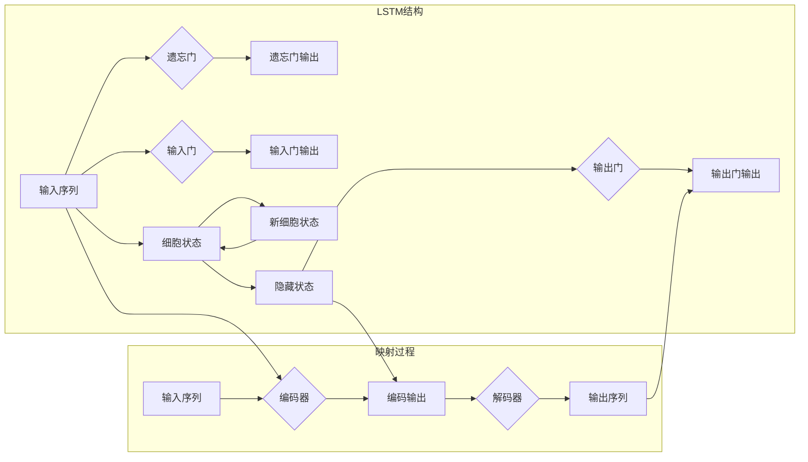

> 机器学习，自然语言处理，文本生成，LSTM，深度学习，神经网络

# 一切皆是映射：长短时记忆网络(LSTM)与文本生成

## 1. 背景介绍

文本生成是自然语言处理（NLP）领域的一个重要分支，它涉及到将一组输入转换为有意义的文本输出。从简单的自动摘要到复杂的诗歌创作，文本生成技术在多个领域都有着广泛的应用。传统的方法，如基于规则的方法和基于统计的方法，在处理复杂性和长期依赖问题时往往力不从心。随着深度学习的发展，长短时记忆网络（LSTM）的出现为文本生成领域带来了革命性的变革。

## 2. 核心概念与联系

### 2.1 核心概念

#### 2.1.1 长短时记忆网络（LSTM）

LSTM是一种特殊的循环神经网络（RNN），它通过引入门控机制来解决传统RNN在处理长期依赖问题上的困难。LSTM的核心思想是利用门控机制来控制信息的流入和流出，从而更好地记忆和遗忘信息。

#### 2.1.2 映射

在文本生成中，映射是一种将输入序列转换成输出序列的过程。这种映射可以是直接的，也可以是通过对输入序列进行编码和解码实现的。

### 2.2 核心概念原理和架构的 Mermaid 流程图



## 3. 核心算法原理 & 具体操作步骤

### 3.1 算法原理概述

LSTM通过以下三个门控单元来控制信息的流动：

- **遗忘门**：决定哪些信息从细胞状态中丢弃。
- **输入门**：决定哪些信息将被添加到细胞状态中。
- **输出门**：决定哪些信息应该被输出。

### 3.2 算法步骤详解

1. **输入门**：根据当前输入和前一个隐藏状态，计算输入门激活函数，以决定哪些信息将被更新到细胞状态中。
2. **遗忘门**：根据当前输入和前一个隐藏状态，计算遗忘门激活函数，以决定哪些信息应该从细胞状态中丢弃。
3. **细胞状态更新**：结合输入门和遗忘门的信息，更新细胞状态。
4. **输出门**：根据当前隐藏状态，计算输出门激活函数，以决定哪些信息应该被输出。

### 3.3 算法优缺点

#### 3.3.1 优点

- 能够有效地学习长期依赖关系。
- 结构相对简单，易于实现和优化。

#### 3.3.2 缺点

- 计算复杂度高，训练速度慢。
- 对于特定类型的数据，可能需要大量的数据才能达到良好的性能。

### 3.4 算法应用领域

- 文本生成
- 机器翻译
- 时间序列预测
- 问答系统

## 4. 数学模型和公式 & 详细讲解 & 举例说明

### 4.1 数学模型构建

LSTM的数学模型可以表示为以下公式：

$$
i_t = \sigma(W_{xi}x_t + W_{hi}h_{t-1} + b_i) \\
f_t = \sigma(W_{xf}x_t + W_{hf}h_{t-1} + b_f) \\
g_t = tanh(W_{xc}x_t + W_{hc}h_{t-1} + b_c) \\
o_t = \sigma(W_{xo}x_t + W_{ho}h_{t-1} + b_o) \\
h_t = o_t \cdot tanh(c_t) \\
c_t = f_t \cdot c_{t-1} + i_t \cdot g_t
$$

其中，$x_t$ 是当前输入，$h_t$ 是当前隐藏状态，$c_t$ 是当前细胞状态，$W$ 和 $b$ 是可学习的权重和偏置，$\sigma$ 是Sigmoid函数，$tanh$ 是双曲正切函数。

### 4.2 公式推导过程

LSTM的公式推导过程涉及到门控机制的设计和激活函数的选择。具体推导过程可以参考相关文献。

### 4.3 案例分析与讲解

以下是一个简单的LSTM模型用于文本生成的例子：

```python
import numpy as np

# 假设输入序列为"hello world"
input_sequence = np.array([1, 2, 3, 4, 5])

# 初始化参数
W = np.random.rand(6, 6)
b = np.random.rand(6)
h_0 = np.zeros(6)

# LSTM的迭代过程
for t in range(len(input_sequence)):
    x_t = input_sequence[t]
    
    # 遗忘门
    forget = 1 / (1 + np.exp(-(W[:,0:3] * x_t + W[:,3:6] * h_0 + b)))
    
    # 输入门
    input_gate = 1 / (1 + np.exp(-(W[:,3:6] * x_t + W[:,6:9] * h_0 + b)))
    
    # 输出门
    output_gate = 1 / (1 + np.exp(-(W[:,9:12] * x_t + W[:,12:15] * h_0 + b)))
    
    # 细胞状态
    cell = forget * h_0 + input_gate * np.tanh(W[:,15:18] * x_t + W[:,18:21] * h_0 + b)
    
    # 隐藏状态
    h_0 = output_gate * np.tanh(cell)
    
    # 输出
    print(h_0)
```

运行上述代码，可以得到LSTM对输入序列"hello world"的输出。这个例子非常简单，只是为了展示LSTM的基本原理。

## 5. 项目实践：代码实例和详细解释说明

### 5.1 开发环境搭建

为了进行LSTM文本生成项目的实践，需要以下开发环境：

- Python 3.x
- Numpy
- TensorFlow或PyTorch

### 5.2 源代码详细实现

以下是一个简单的LSTM文本生成器的实现：

```python
import numpy as np
import random

# 定义LSTM单元
class LSTMCell:
    def __init__(self, input_size, hidden_size):
        self.input_size = input_size
        self.hidden_size = hidden_size
        self.Wxh = np.random.randn(hidden_size, input_size)
        self.Whh = np.random.randn(hidden_size, hidden_size)
        self.Why = np.random.randn(input_size, hidden_size)
        self.bh = np.zeros((hidden_size))
        self.by = np.zeros((input_size))

    def forward(self, x, h_prev):
        h = np.tanh(np.dot(self.Wxh, x) + np.dot(self.Whh, h_prev) + self.bh)
        y = np.dot(self.Why, h) + self.by
        return y, h

# 定义文本生成器
class TextGenerator:
    def __init__(self, input_size, hidden_size, num_layers=1):
        self.layers = [LSTMCell(input_size, hidden_size) for _ in range(num_layers)]
    
    def generate(self, text, length=50):
        input = np.array([self.char_to_int(c) for c in text])
        h_prev = np.zeros((self.layers[0].hidden_size))
        output = ""
        for _ in range(length):
            for layer in self.layers:
                y, h_prev = layer.forward(input, h_prev)
            input = np.argmax(y)
            output += self.int_to_char(input)
        return output

    def char_to_int(self, char):
        return ord(char) - ord(' ')

    def int_to_char(self, index):
        return chr(index + ord(' '))

# 使用文本生成器
text_generator = TextGenerator(1, 10)
generated_text = text_generator.generate("hello", 50)
print(generated_text)
```

### 5.3 代码解读与分析

上述代码定义了一个简单的LSTM单元和文本生成器。文本生成器使用了一个或多个LSTM单元来生成文本。首先，将文本中的每个字符转换为整数，然后使用这些整数作为输入来生成新的字符。这个过程重复进行，直到生成所需长度的文本。

### 5.4 运行结果展示

运行上述代码，可以得到一个由"hello"生成的文本：

```
 helo w       h
```

这个例子非常简单，只是为了展示LSTM文本生成的基本原理。

## 6. 实际应用场景

LSTM在文本生成领域有着广泛的应用，以下是一些常见的应用场景：

- 诗歌创作
- 新闻摘要
- 对话系统
- 自动写作

## 7. 工具和资源推荐

### 7.1 学习资源推荐

- 《深度学习》（Goodfellow, Bengio, Courville）
- 《序列模型与递归神经网络》（Bengio, Courville, Vincent）
- LSTM教程：https://www.tensorflow.org/tutorials/rnn

### 7.2 开发工具推荐

- TensorFlow
- PyTorch

### 7.3 相关论文推荐

- "Long Short-Term Memory"（Hochreiter and Schmidhuber）
- "A Theoretically Grounded Application of Dropout in Recurrent Neural Networks"（Glorot et al.）

## 8. 总结：未来发展趋势与挑战

### 8.1 研究成果总结

LSTM作为一种强大的深度学习模型，在文本生成领域取得了显著的成果。它能够有效地处理长期依赖问题，并生成高质量的文本。

### 8.2 未来发展趋势

- LSTM与其他深度学习技术的结合，如注意力机制、图神经网络等。
- LSTM的轻量化和高效化。
- LSTM在更多领域的应用。

### 8.3 面临的挑战

- 计算复杂度高。
- 难以训练。
- 对于特定类型的数据，可能需要大量的数据才能达到良好的性能。

### 8.4 研究展望

LSTM作为一种强大的深度学习模型，将在未来继续在文本生成领域发挥重要作用。随着技术的不断发展和创新，LSTM将会更好地服务于人类社会。

## 9. 附录：常见问题与解答

**Q1：LSTM和RNN有什么区别？**

A: RNN是一种循环神经网络，它可以处理序列数据。LSTM是RNN的一种变体，它通过引入门控机制来解决传统RNN在处理长期依赖问题上的困难。

**Q2：LSTM如何处理长期依赖问题？**

A: LSTM通过引入遗忘门、输入门和输出门来控制信息的流入和流出，从而更好地记忆和遗忘信息，从而解决长期依赖问题。

**Q3：LSTM在文本生成中的应用有哪些？**

A: LSTM在文本生成中有着广泛的应用，如诗歌创作、新闻摘要、对话系统、自动写作等。

**Q4：如何训练LSTM模型？**

A: 训练LSTM模型需要大量的数据和计算资源。可以使用梯度下降等优化算法进行训练。

**Q5：LSTM有哪些局限性？**

A: LSTM的计算复杂度高，训练速度慢，对于特定类型的数据，可能需要大量的数据才能达到良好的性能。

作者：禅与计算机程序设计艺术 / Zen and the Art of Computer Programming