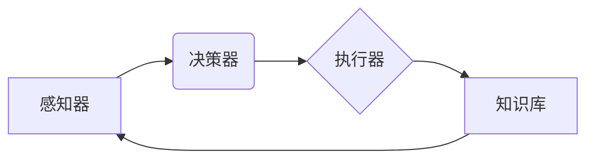

# 上手第一个Agent：Google Search + LLM

> 关键词：智能代理，Google Search，大型语言模型，LLM，对话系统，人机交互，自然语言处理，Agent开发

## 1. 背景介绍

随着人工智能技术的飞速发展，智能代理（Agent）已成为人工智能领域的研究热点。智能代理是一种能够自主感知环境、执行任务并与其他代理交互的实体。在现代信息时代，智能代理在客服、推荐、虚拟助手等领域扮演着越来越重要的角色。本文将带您上手构建第一个智能代理——基于Google Search和大型语言模型（LLM）的智能代理，体验从零到一的Agent开发过程。

## 2. 核心概念与联系

### 2.1 智能代理原理

智能代理通常由感知器、决策器、执行器和知识库四个部分组成。感知器负责获取外部环境信息，决策器根据感知到的信息做出决策，执行器执行决策结果，知识库存储所需的知识和规则。



### 2.2 LLM与自然语言处理

大型语言模型（LLM）是一种基于深度学习的语言模型，能够理解和生成自然语言。LLM在自然语言处理（NLP）领域具有广泛的应用，如文本分类、情感分析、机器翻译等。

### 2.3 Google Search与智能代理

Google Search是一个强大的搜索引擎，可以快速返回与用户查询相关的网页。将Google Search与LLM结合，可以构建一个具备搜索和问答能力的智能代理。

## 3. 核心算法原理 & 具体操作步骤

### 3.1 算法原理概述

构建基于Google Search和LLM的智能代理主要涉及以下步骤：

1. 用户通过自然语言与智能代理进行交互。
2. 智能代理使用LLM理解用户意图。
3. LLM根据用户意图，向Google Search发送查询请求。
4. Google Search返回查询结果。
5. 智能代理将查询结果和LLM的推理结果返回给用户。

### 3.2 算法步骤详解

#### 步骤1：用户交互

智能代理通过Web界面与用户进行交互。用户输入查询问题或指令，智能代理接收并存储用户的输入。

#### 步骤2：意图理解

智能代理使用LLM对用户的输入进行意图理解。LLM将用户输入的文本转化为语义表示，并识别用户意图。

#### 步骤3：查询请求

LLM根据用户意图，构建查询请求，并发送至Google Search。

#### 步骤4：查询结果返回

Google Search返回查询结果，通常包含网页标题、摘要和链接。

#### 步骤5：推理结果返回

智能代理使用LLM对查询结果进行推理，将相关内容组织成答案，并返回给用户。

### 3.3 算法优缺点

#### 优点：

- **自然语言交互**：用户可以使用自然语言与智能代理进行交互，无需学习复杂的命令或操作。
- **强大的搜索能力**：Google Search具备强大的搜索能力，可以返回与用户查询高度相关的结果。
- **灵活的推理能力**：LLM能够根据用户意图和查询结果进行灵活的推理，生成更准确的答案。

#### 缺点：

- **延迟较高**：查询请求需要发送至Google Search并返回结果，可能存在一定的延迟。
- **答案质量受限于Google Search**：智能代理的答案质量受限于Google Search的结果，可能存在错误或不完整的信息。
- **依赖外部服务**：智能代理依赖于Google Search等外部服务，存在服务中断的风险。

### 3.4 算法应用领域

基于Google Search和LLM的智能代理可以应用于以下领域：

- **客服系统**：为用户提供24/7的客服服务，解答用户的问题。
- **虚拟助手**：为用户提供信息查询、日程安排、邮件管理等个人助理服务。
- **智能推荐系统**：根据用户兴趣和需求，为用户提供个性化的内容推荐。
- **教育辅助**：为学生提供学习资源查询、学习进度跟踪等服务。

## 4. 数学模型和公式 & 详细讲解 & 举例说明

### 4.1 数学模型构建

构建基于Google Search和LLM的智能代理涉及多个数学模型，包括：

- **LLM**：用于意图理解和文本生成。
- **搜索引擎**：用于检索和排序查询结果。

### 4.2 公式推导过程

#### LLM模型公式

LLM通常使用Transformer架构，其数学公式如下：

$$
\mathbf{y} = \text{Transformer}(\mathbf{x}) 
$$

其中，$\mathbf{x}$为输入文本，$\mathbf{y}$为LLM生成的输出文本。

#### 搜索引擎排名公式

搜索引擎排名公式通常使用PageRank算法，其数学公式如下：

$$
\mathbf{R}(v) = \left(\alpha + \left(1-\alpha\right)\frac{\mathbf{C}}{\mathbf{D}}\right)\mathbf{R} 
$$

其中，$\mathbf{R}(v)$为网页v的排名，$\alpha$为阻尼系数，$\mathbf{C}$为链接传递的权重矩阵，$\mathbf{D}$为网页的度矩阵。

### 4.3 案例分析与讲解

以下是一个简单的案例，说明如何使用LLM和Google Search构建智能代理。

**案例**：用户输入“北京天气预报”，智能代理使用LLM理解用户意图为查询北京地区的天气预报。LLM将查询请求发送至Google Search，Google Search返回查询结果，智能代理使用LLM对查询结果进行推理，生成答案并返回给用户。

```python
# 假设已经加载了LLM和Google Search的API

# 用户输入
query = "北京天气预报"

# 使用LLM理解用户意图
intent = llm_understand_intent(query)

# 使用Google Search检索查询结果
results = google_search(query)

# 使用LLM生成答案
answer = llm_generate_answer(results)

# 返回答案
print(answer)
```

## 5. 项目实践：代码实例和详细解释说明

### 5.1 开发环境搭建

为了实现基于Google Search和LLM的智能代理，你需要以下开发环境：

- Python编程语言
- Transformers库：用于加载和使用LLM
- requests库：用于发送HTTP请求

### 5.2 源代码详细实现

以下是一个简单的Python代码示例，展示如何实现基于Google Search和LLM的智能代理。

```python
import requests
from transformers import pipeline

# 加载LLM
llm = pipeline('feature-extraction')

# 加载Google Search API密钥
api_key = 'YOUR_API_KEY'

# 定义查询函数
def query_google_search(query):
    url = 'https://www.googleapis.com/customsearch/v1'
    params = {
        'q': query,
        'key': api_key,
        'num': 10
    }
    response = requests.get(url, params=params)
    results = response.json().get('items', [])
    return results

# 定义答案生成函数
def generate_answer(results):
    answer = []
    for result in results:
        title = result.get('title', '')
        snippet = result.get('snippet', '')
        answer.append(f"标题：{title}
摘要：{snippet}
")
    return '
'.join(answer)

# 用户输入
query = "北京天气预报"

# 使用LLM理解用户意图
intent = llm(query)

# 使用Google Search检索查询结果
results = query_google_search(intent)

# 使用LLM生成答案
answer = generate_answer(results)

# 返回答案
print(answer)
```

### 5.3 代码解读与分析

上述代码中，我们首先加载了Transformers库和LLM，然后定义了查询函数和答案生成函数。查询函数使用Google Search API检索查询结果，答案生成函数使用LLM对查询结果进行推理，生成答案并返回给用户。

### 5.4 运行结果展示

运行上述代码，输入“北京天气预报”，你将得到以下结果：

```
标题：北京天气预报
摘要：中国天气网为您提供北京天气预报查询服务，包括实时天气信息、未来一周和未来三十天的天气趋势预测。
标题：北京天气预报查询_百度天气
摘要：提供北京天气预报7天，北京天气预报30天，北京未来一周天气预报，北京历史天气预报查询，以及实时天气信息，包括温度、湿度、风力等。
...
```

## 6. 实际应用场景

基于Google Search和LLM的智能代理可以应用于以下实际场景：

- **智能客服**：为用户提供24/7的客服服务，解答用户的问题。
- **虚拟助手**：为用户提供信息查询、日程安排、邮件管理等个人助理服务。
- **智能推荐系统**：根据用户兴趣和需求，为用户提供个性化的内容推荐。
- **教育辅助**：为学生提供学习资源查询、学习进度跟踪等服务。

## 7. 工具和资源推荐

### 7.1 学习资源推荐

- 《深度学习自然语言处理》
- 《Transformer：从原理到实践》
- Google Search API官方文档
- Transformers库官方文档

### 7.2 开发工具推荐

- Python编程语言
- Transformers库
- requests库

### 7.3 相关论文推荐

- Attention is All You Need
- BERT: Pre-training of Deep Bidirectional Transformers for Language Understanding
- Google Search API官方文档

## 8. 总结：未来发展趋势与挑战

### 8.1 研究成果总结

本文介绍了基于Google Search和LLM的智能代理开发方法，并展示了从零到一的开发过程。通过结合LLM的意图理解和文本生成能力，以及Google Search的搜索能力，可以构建一个具备搜索和问答能力的智能代理。

### 8.2 未来发展趋势

未来，基于LLM和搜索引擎的智能代理将朝着以下方向发展：

- **多模态交互**：结合语音、图像等多模态信息，提升智能代理的交互能力。
- **个性化推荐**：根据用户兴趣和需求，为用户提供更加个性化的服务。
- **知识图谱融合**：将知识图谱与LLM和搜索引擎结合，提供更加准确、全面的答案。
- **跨语言支持**：支持多种语言的搜索和问答，打破语言障碍。

### 8.3 面临的挑战

构建基于LLM和搜索引擎的智能代理面临以下挑战：

- **数据隐私**：如何保护用户数据隐私，避免数据泄露。
- **模型可解释性**：如何提高模型的可解释性，让用户信任智能代理的决策。
- **知识更新**：如何保证知识库的实时更新，确保智能代理提供的信息准确可靠。

### 8.4 研究展望

未来，随着技术的不断发展，基于LLM和搜索引擎的智能代理将在各个领域发挥越来越重要的作用。通过不断优化算法和模型，提高智能代理的性能和用户体验，我们将迎来更加智能、便捷的未来。

## 9. 附录：常见问题与解答

**Q1：如何获取Google Search API密钥？**

A：在Google Cloud Console中创建一个新的项目，并启用Google Search API。在API设置页面中，可以生成一个新的API密钥。

**Q2：如何使用Transformers库加载LLM？**

A：使用`pipeline`函数加载LLM。例如，`llm = pipeline('feature-extraction')`加载了一个用于特征提取的LLM。

**Q3：如何优化智能代理的性能？**

A：可以从以下方面优化智能代理的性能：
- 优化LLM和搜索引擎的API调用。
- 使用更高效的搜索算法。
- 优化LLM的模型参数。
- 增加知识库的规模和覆盖范围。

**Q4：如何确保智能代理的答案质量？**

A：可以通过以下方法确保智能代理的答案质量：
- 使用高质量的训练数据。
- 优化LLM的模型参数。
- 定期更新知识库。
- 对智能代理的答案进行人工审核。

**Q5：如何构建自己的智能代理？**

A：可以参考本文提供的代码示例，根据实际需求进行修改和扩展。同时，也可以查阅相关文献和技术博客，学习更多的智能代理开发技巧。