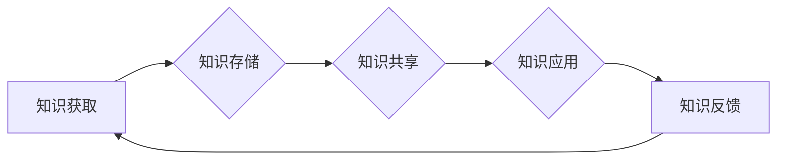
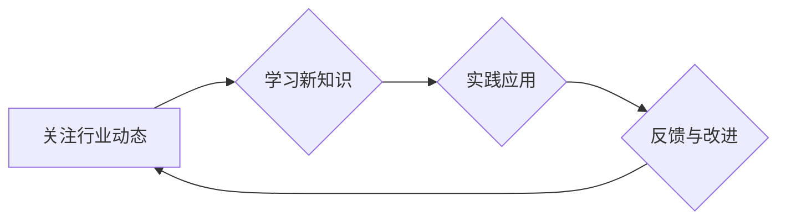

# 专业知识的积累：让项目顺利完成

> 关键词：专业知识，项目成功，IT领域，知识管理，技能提升，持续学习，团队协作

## 1. 背景介绍

在IT行业中，专业知识是推动项目顺利进行的关键因素。一个项目的成功往往依赖于团队成员对相关领域知识的深入理解和灵活运用。然而，随着技术的快速发展和行业需求的不断变化，专业知识的积累和更新变得尤为重要。本文将探讨专业知识在项目成功中的重要性，分析积累专业知识的方法，并提供一些建议，帮助IT从业者提升专业知识，确保项目顺利完成。

### 1.1 项目成功的要素

项目成功通常包括以下几个关键要素：

- **明确的目标和需求**：项目目标应该具体、可衡量、可实现、相关性强、时限性明确。
- **优秀的团队**：团队成员应具备相应的技能和经验，能够高效协作。
- **有效的项目管理**：合理的时间管理、风险管理、成本控制和质量管理。
- **技术的先进性和适用性**：选择合适的技术方案，确保项目的技术先进性和适用性。
- **持续的学习和改进**：团队成员应不断学习新知识，适应技术变化，并持续改进项目流程。

### 1.2 专业知识的重要性

专业知识是项目成功的基石。以下是专业知识在项目成功中的几个关键作用：

- **问题解决能力**：专业知识可以帮助团队识别和解决项目中的技术问题。
- **决策支持**：深厚的专业知识为项目决策提供依据，确保决策的科学性和合理性。
- **技术风险评估**：专业知识可以帮助团队评估项目的技术风险，并制定相应的应对策略。
- **沟通协作**：团队成员之间共享专业知识，促进团队协作和沟通。
- **项目延续性**：积累的知识有助于项目的延续和发展。

## 2. 核心概念与联系

### 2.1 知识管理

知识管理是确保专业知识得到有效积累和利用的关键环节。以下是一个简化的知识管理流程：



### 2.2 技能提升

技能提升是专业知识积累的重要途径。以下是一个技能提升的流程：

```mermaid
graph LR
A[学习新技术] --> B{实践应用}
B --> C{反馈与改进}
C --> D[评估效果]
D --> A|是
D --> E[深入学习]
E --> A|否
```

### 2.3 持续学习

持续学习是IT从业者必备的品质。以下是一个持续学习的流程：



## 3. 核心算法原理 & 具体操作步骤

### 3.1 算法原理概述

本节将介绍一种常用的专业知识积累方法——知识图谱。知识图谱是一种结构化的知识表示方法，通过实体、属性和关系来描述知识，使得知识之间的关系更加清晰。

### 3.2 算法步骤详解

知识图谱的构建通常包括以下几个步骤：

1. **数据收集**：从各种来源收集相关领域的知识数据。
2. **数据清洗**：去除无关数据，提高数据质量。
3. **实体识别**：从文本中识别出实体，如人名、地名、组织名等。
4. **关系抽取**：从文本中抽取实体之间的关系。
5. **知识融合**：将实体和关系整合到知识图谱中。
6. **知识存储**：将知识图谱存储到数据库中，以便后续查询和应用。

### 3.3 算法优缺点

知识图谱的优缺点如下：

**优点**：

- **结构化知识表示**：知识图谱以结构化的方式表示知识，便于理解和应用。
- **知识关联**：知识图谱能够揭示实体之间的关系，有助于发现新的知识。
- **可扩展性**：知识图谱可以根据新数据不断更新和扩展。

**缺点**：

- **数据收集难度**：知识图谱需要收集大量的知识数据，数据收集难度较大。
- **构建成本高**：知识图谱的构建需要一定的技术手段和人力资源。
- **知识更新慢**：知识图谱的知识更新速度较慢，难以反映最新的知识变化。

### 3.4 算法应用领域

知识图谱在以下领域具有广泛的应用：

- **搜索引擎**：通过知识图谱，搜索引擎可以提供更加准确和丰富的搜索结果。
- **推荐系统**：知识图谱可以帮助推荐系统更好地理解用户和物品之间的关系，提供更精准的推荐结果。
- **问答系统**：知识图谱可以为问答系统提供丰富的知识背景，提高问答系统的准确性。
- **知识图谱可视化**：知识图谱可视化可以帮助用户更好地理解知识结构和关系。

## 4. 数学模型和公式 & 详细讲解 & 举例说明

### 4.1 数学模型构建

以下是一个简单的知识图谱构建的数学模型：

$$
G = (E, R, V)
$$

其中，$E$ 表示实体集合，$R$ 表示关系集合，$V$ 表示属性集合。

### 4.2 公式推导过程

知识图谱的构建过程涉及到实体识别、关系抽取等步骤，这些步骤可以通过相应的数学模型进行描述。

### 4.3 案例分析与讲解

以下是一个简单的案例，展示了如何构建一个简单的知识图谱。

**案例**：构建一个关于电影的简单知识图谱。

- **实体**：电影、演员、导演、类型等。
- **关系**：主演、导演、属于类型等。
- **属性**：电影名称、上映年份、导演姓名等。

根据上述实体、关系和属性，我们可以构建如下知识图谱：

```
电影 <主演> 演员
电影 <导演> 导演
电影 <类型> 类型
```

## 5. 项目实践：代码实例和详细解释说明

### 5.1 开发环境搭建

为了构建知识图谱，我们需要以下开发环境：

- **编程语言**：Python
- **库**：NetworkX、NLTK、spaCy等
- **工具**：Jupyter Notebook

### 5.2 源代码详细实现

以下是一个简单的知识图谱构建的代码实例：

```python
import networkx as nx

# 创建一个空的图
G = nx.Graph()

# 添加实体
G.add_node("电影1", 名称="电影名称1", 上映年份="2021")
G.add_node("演员1", 姓名="演员姓名1")
G.add_node("导演1", 姓名="导演姓名1")
G.add_node("类型1", 名称="动作片")

# 添加关系
G.add_edge("电影1", "演员1", 主演="主演")
G.add_edge("电影1", "导演1", 导演="导演")
G.add_edge("电影1", "类型1", 类型="类型")

# 打印图的结构
print(nx.draw(G))
```

### 5.3 代码解读与分析

以上代码使用NetworkX库创建了一个简单的知识图谱。首先创建一个空的图，然后添加实体和关系，最后打印出图的结构。

### 5.4 运行结果展示

运行上述代码，将得到以下知识图谱结构：

```
(电影1, 导演1, {'导演': '导演姓名1', '名称': '电影名称1', '上映年份': '2021'})
(电影1, 类型1, {'名称': '动作片', '类型': '类型'})
(电影1, 演员1, {'主演': '主演', '姓名': '演员姓名1'})
```

## 6. 实际应用场景

### 6.1 搜索引擎

知识图谱可以帮助搜索引擎提供更加准确和丰富的搜索结果。例如，当用户搜索“电影名称1”时，搜索引擎可以返回与该电影相关的演员、导演、类型等信息。

### 6.2 推荐系统

知识图谱可以帮助推荐系统提供更精准的推荐结果。例如，当用户对“动作片”感兴趣时，推荐系统可以根据用户的历史行为和知识图谱中电影与类型的关联，推荐其他类似的电影。

### 6.3 问答系统

知识图谱可以为问答系统提供丰富的知识背景，提高问答系统的准确性。例如，当用户问“电影名称1的导演是谁？”时，问答系统可以根据知识图谱中电影与导演的关联，给出正确的答案。

## 7. 工具和资源推荐

### 7.1 学习资源推荐

- 《图解机器学习》
- 《知识图谱：概念、方法与应用》
- 《Python网络数据分析》

### 7.2 开发工具推荐

- NetworkX：Python知识图谱构建库
- spaCy：Python自然语言处理库
- Neo4j：图数据库

### 7.3 相关论文推荐

- "Knowledge Graph Embedding: A Survey of Techniques and Applications"
- "Link Prediction in Knowledge Graphs: A Survey of Recent Advances"
- "A Survey of Deep Learning Techniques for Knowledge Graph Completion"

## 8. 总结：未来发展趋势与挑战

### 8.1 研究成果总结

本文探讨了专业知识在项目成功中的重要性，分析了积累专业知识的方法，并介绍了一种常用的专业知识积累方法——知识图谱。通过构建知识图谱，可以帮助IT从业者更好地理解和应用专业知识，提高项目成功率。

### 8.2 未来发展趋势

未来，随着人工智能和大数据技术的发展，知识图谱在IT领域的应用将更加广泛。以下是一些可能的发展趋势：

- **多模态知识图谱**：将文本、图像、语音等多模态数据整合到知识图谱中。
- **知识图谱可视化**：开发更加直观的知识图谱可视化工具，帮助用户更好地理解知识结构。
- **知识图谱推理**：利用知识图谱进行推理，发现新的知识。

### 8.3 面临的挑战

尽管知识图谱在IT领域具有广泛的应用前景，但仍面临以下挑战：

- **数据质量**：知识图谱的质量取决于数据质量，如何保证数据质量是一个挑战。
- **知识表示**：如何有效地表示知识，是一个需要不断探索的问题。
- **知识更新**：知识更新速度快，如何快速更新知识图谱是一个挑战。

### 8.4 研究展望

未来，知识图谱在IT领域的应用将更加深入，为IT行业带来更多的创新和变革。以下是几个可能的研究方向：

- **知识图谱构建**：研究更加高效的知识图谱构建方法，降低构建成本。
- **知识图谱推理**：研究更加精准的知识图谱推理方法，提高推理效果。
- **知识图谱应用**：将知识图谱应用到更多领域，如智能问答、推荐系统等。

## 9. 附录：常见问题与解答

**Q1：如何提高专业知识积累的效率？**

A：提高专业知识积累的效率可以通过以下方法：

- **制定学习计划**：合理安排学习时间，确保持续学习。
- **选择合适的学习资源**：选择适合自己的学习资源，如书籍、在线课程、技术博客等。
- **实践应用**：将所学知识应用到实际项目中，加深理解。
- **交流学习**：与同行交流学习，分享经验，共同进步。

**Q2：知识图谱在IT领域的应用有哪些？**

A：知识图谱在IT领域的应用非常广泛，包括：

- **搜索引擎优化**：提高搜索结果的准确性和相关性。
- **推荐系统**：提供更加精准的推荐结果。
- **问答系统**：提高问答系统的准确性。
- **知识库构建**：构建行业知识库，为用户提供专业的知识服务。
- **智能客服**：提供更加智能化的客服服务。

**Q3：如何评估知识图谱的质量？**

A：评估知识图谱的质量可以从以下几个方面进行：

- **实体质量**：实体的准确性、完整性、唯一性。
- **关系质量**：关系的准确性、完整性、唯一性。
- **属性质量**：属性的准确性、完整性、唯一性。
- **知识覆盖度**：知识图谱覆盖的知识领域和知识点。

**Q4：知识图谱与自然语言处理有什么关系？**

A：知识图谱与自然语言处理有密切的关系。知识图谱可以提供丰富的背景知识，帮助自然语言处理模型更好地理解语言，提高处理效果。

**Q5：如何确保知识图谱的更新及时性？**

A：确保知识图谱的更新及时性可以通过以下方法：

- **定期更新**：定期从各种渠道收集新的知识，更新知识图谱。
- **实时更新**：对于一些动态变化的知识，如新闻、社交媒体等，可以采用实时更新的方式。
- **自动化更新**：开发自动化工具，自动从数据源中提取知识，更新知识图谱。

作者：禅与计算机程序设计艺术 / Zen and the Art of Computer Programming