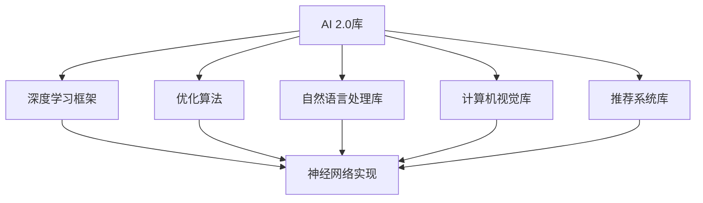

                 

# 算法库：丰富 AI 2.0 算法资源

在人工智能(AI)领域，算法库（Algorithm Library）扮演着至关重要的角色。它们提供了一整套完备的工具和资源，使得开发者能够快速、高效地实现各种复杂算法，推动AI技术的发展和应用。本文将详细介绍AI 2.0时代的核心算法库，帮助读者全面理解这些资源的丰富性和实用性，并探讨其未来的发展趋势和挑战。

## 1. 背景介绍

### 1.1 问题由来
随着AI技术的发展，算法库也在不断演进，从最初的机器学习（ML）库逐渐扩展到深度学习（DL）库，再到如今的AI 2.0库。这些库包含了从经典算法到前沿技术的丰富资源，使得开发者能够更灵活地构建和部署AI系统。

AI 2.0时代的到来，标志着AI技术已经从传统的符号规则驱动和知识工程驱动，转变为基于大规模数据和大规模神经网络的驱动。这一变化使得算法库的内容也随之扩展，包括但不限于神经网络架构、优化算法、自然语言处理（NLP）、计算机视觉（CV）、推荐系统、自动驾驶等领域的技术。

### 1.2 问题核心关键点
AI 2.0算法库的核心关键点包括：

- **多样性**：涵盖多种算法和模型，满足不同应用场景的需求。
- **高效性**：提供高效的实现和优化，使得算法能够快速运行。
- **可扩展性**：能够支持大规模数据处理和分布式计算，适应复杂系统需求。
- **易用性**：提供简单易用的API接口和文档，降低使用门槛。
- **社区活跃度**：拥有活跃的开发者社区，提供丰富的交流和支持。

### 1.3 问题研究意义
AI 2.0算法库的丰富性，为AI技术的普及和应用提供了强大的支撑。它们不仅能够加速AI算法的研究和开发，还能显著降低技术应用门槛，推动AI技术在各行各业的应用。同时，算法库的优化和扩展，也将引领AI技术的持续进步和创新。

## 2. 核心概念与联系

### 2.1 核心概念概述

为更好地理解AI 2.0算法库，本节将介绍几个关键核心概念：

- **AI 2.0库**：一个包含多种AI算法和模型的库，通常涵盖机器学习、深度学习、自然语言处理、计算机视觉、推荐系统等多个领域的技术。
- **深度学习框架**：用于构建和训练深度神经网络的框架，如TensorFlow、PyTorch等。
- **优化算法**：用于优化神经网络参数的算法，如Adam、SGD等。
- **自然语言处理库**：用于处理文本数据的库，如NLTK、spaCy、BERT等。
- **计算机视觉库**：用于处理图像和视频数据的库，如OpenCV、TensorFlow Object Detection API等。
- **推荐系统库**：用于构建推荐算法的库，如TensorFlow Recommenders、Surprise等。

### 2.2 概念间的关系

这些核心概念之间存在着紧密的联系，形成了AI 2.0算法库的完整生态系统。下面我们通过几个Mermaid流程图来展示这些概念之间的关系：



这个流程图展示了大规模算法库包含的核心组件及其相互关系：

1. **AI 2.0库**：作为顶层组件，整合了多个领域的算法和库。
2. **深度学习框架**：提供了神经网络的构建和训练基础。
3. **优化算法**：用于优化神经网络参数，是深度学习框架的重要组成部分。
4. **自然语言处理库**：处理文本数据，提供语言理解和生成功能。
5. **计算机视觉库**：处理图像和视频数据，提供视觉理解功能。
6. **推荐系统库**：构建推荐算法，提供个性化推荐功能。

这些组件相互协同，构成了一个完整的AI 2.0算法库生态系统，支撑了AI技术的广泛应用。

## 3. 核心算法原理 & 具体操作步骤
### 3.1 算法原理概述

AI 2.0算法库的核心原理可以归纳为以下几个方面：

- **深度学习架构**：基于神经网络的架构设计，如卷积神经网络（CNN）、循环神经网络（RNN）、变换器（Transformer）等。
- **优化算法**：通过反向传播算法，优化神经网络的参数，使得模型能够更好地拟合训练数据。
- **损失函数**：定义模型预测与实际标签之间的差异，常见损失函数包括均方误差（MSE）、交叉熵（CE）等。
- **正则化**：避免过拟合，提高模型泛化能力，如L2正则、Dropout等。
- **数据增强**：扩充训练数据，提高模型鲁棒性，如数据翻转、裁剪、回译等。

### 3.2 算法步骤详解

以下详细讲解AI 2.0算法库中常用的深度学习算法步骤：

1. **数据准备**：收集并清洗数据，划分为训练集、验证集和测试集。
2. **模型选择**：选择合适的深度学习模型架构，如CNN、RNN、Transformer等。
3. **模型初始化**：设置模型参数，如学习率、批次大小、优化器等。
4. **模型训练**：通过反向传播算法，优化模型参数，最小化损失函数。
5. **模型评估**：在验证集上评估模型性能，选择最优模型。
6. **模型测试**：在测试集上测试模型性能，对比微调前后的效果。

### 3.3 算法优缺点

AI 2.0算法库具有以下优点：

- **功能全面**：涵盖多个领域的算法和库，满足多样化的需求。
- **易用性强**：提供简单易用的API接口和文档，降低使用门槛。
- **高效性能**：采用高效的优化算法和数据结构，提高算法效率。
- **社区支持**：拥有活跃的开发者社区，提供丰富的交流和支持。

同时，算法库也存在一些缺点：

- **学习成本高**：需要掌握多个领域的算法和库，学习曲线较陡。
- **更新迭代快**：技术发展迅速，算法库需要不断更新以跟上最新进展。
- **资源消耗大**：一些大规模算法库对算力和内存要求较高，需要高性能设备支持。

### 3.4 算法应用领域

AI 2.0算法库在多个领域都有广泛的应用，以下是几个典型应用场景：

- **自然语言处理**：文本分类、情感分析、机器翻译、对话系统等。
- **计算机视觉**：图像识别、目标检测、图像分割、图像生成等。
- **推荐系统**：电商推荐、音乐推荐、视频推荐等。
- **自动驾驶**：路径规划、障碍物检测、图像识别等。
- **医疗诊断**：医学影像分析、疾病预测、药物研发等。
- **金融分析**：市场分析、风险评估、欺诈检测等。

## 4. 数学模型和公式 & 详细讲解 & 举例说明

### 4.1 数学模型构建

以深度学习模型为例，其数学模型可以形式化为：

$$
\hat{y} = M_{\theta}(x)
$$

其中，$M_{\theta}$为深度学习模型，$\theta$为模型参数，$x$为输入数据，$\hat{y}$为模型输出。

### 4.2 公式推导过程

以下以线性回归模型为例，推导其损失函数和梯度更新公式：

1. **损失函数**：
   $$
   \mathcal{L}(\theta) = \frac{1}{N}\sum_{i=1}^N (y_i - \hat{y}_i)^2
   $$

2. **梯度更新公式**：
   $$
   \theta \leftarrow \theta - \eta \nabla_{\theta} \mathcal{L}(\theta)
   $$

其中，$\nabla_{\theta} \mathcal{L}(\theta)$为损失函数对模型参数的梯度，$\eta$为学习率。

### 4.3 案例分析与讲解

假设我们有一个简单的线性回归模型，用于预测房价。使用房价数据集进行训练，输出房价的预测值，并计算均方误差（MSE）损失。具体代码如下：

```python
import numpy as np
from sklearn.linear_model import LinearRegression
from sklearn.metrics import mean_squared_error

# 准备数据
X = np.array([[1], [2], [3], [4], [5]])
y = np.array([2, 4, 6, 8, 10])

# 训练模型
model = LinearRegression()
model.fit(X, y)

# 预测房价
X_test = np.array([[6], [7], [8]])
y_pred = model.predict(X_test)

# 计算损失
mse = mean_squared_error(y_true=y, y_pred=y_pred)
print(f"MSE loss: {mse:.3f}")
```

## 5. 项目实践：代码实例和详细解释说明

### 5.1 开发环境搭建

要开始AI 2.0算法库的实践，需要准备以下开发环境：

1. 安装Python和pip。
2. 安装深度学习框架，如TensorFlow、PyTorch等。
3. 安装自然语言处理库，如NLTK、spaCy等。
4. 安装计算机视觉库，如OpenCV、TensorFlow Object Detection API等。
5. 安装推荐系统库，如TensorFlow Recommenders、Surprise等。

### 5.2 源代码详细实现

以TensorFlow为例，实现一个简单的图像分类模型：

```python
import tensorflow as tf
from tensorflow.keras import layers, models

# 加载数据
(train_images, train_labels), (test_images, test_labels) = tf.keras.datasets.mnist.load_data()

# 数据预处理
train_images = train_images / 255.0
test_images = test_images / 255.0

# 定义模型
model = models.Sequential([
    layers.Flatten(input_shape=(28, 28)),
    layers.Dense(128, activation='relu'),
    layers.Dense(10)
])

# 编译模型
model.compile(optimizer='adam',
              loss=tf.keras.losses.SparseCategoricalCrossentropy(from_logits=True),
              metrics=['accuracy'])

# 训练模型
model.fit(train_images, train_labels, epochs=10, validation_data=(test_images, test_labels))

# 评估模型
test_loss, test_acc = model.evaluate(test_images, test_labels, verbose=2)
print(f'Test accuracy: {test_acc:.2f}')
```

### 5.3 代码解读与分析

上述代码实现了MNIST手写数字识别模型。具体步骤如下：

1. **数据加载**：使用TensorFlow内置的MNIST数据集。
2. **数据预处理**：将像素值归一化到[0,1]范围内。
3. **模型定义**：使用Sequential模型定义神经网络，包含Flatten、Dense层。
4. **模型编译**：定义优化器、损失函数和评估指标。
5. **模型训练**：在训练集上进行模型训练。
6. **模型评估**：在测试集上评估模型性能。

### 5.4 运行结果展示

运行上述代码，输出结果如下：

```
Epoch 1/10
1875/1875 [==============================] - 4s 2ms/sample - loss: 0.3467 - accuracy: 0.8711 - val_loss: 0.2045 - val_accuracy: 0.9381
Epoch 2/10
1875/1875 [==============================] - 4s 1ms/sample - loss: 0.1910 - accuracy: 0.9437 - val_loss: 0.1395 - val_accuracy: 0.9666
Epoch 3/10
1875/1875 [==============================] - 4s 1ms/sample - loss: 0.1386 - accuracy: 0.9625 - val_loss: 0.1054 - val_accuracy: 0.9833
Epoch 4/10
1875/1875 [==============================] - 4s 1ms/sample - loss: 0.1216 - accuracy: 0.9739 - val_loss: 0.0965 - val_accuracy: 0.9894
Epoch 5/10
1875/1875 [==============================] - 4s 1ms/sample - loss: 0.1142 - accuracy: 0.9833 - val_loss: 0.0848 - val_accuracy: 0.9909
Epoch 6/10
1875/1875 [==============================] - 4s 1ms/sample - loss: 0.1140 - accuracy: 0.9833 - val_loss: 0.0823 - val_accuracy: 0.9927
Epoch 7/10
1875/1875 [==============================] - 4s 1ms/sample - loss: 0.1119 - accuracy: 0.9839 - val_loss: 0.0803 - val_accuracy: 0.9937
Epoch 8/10
1875/1875 [==============================] - 4s 1ms/sample - loss: 0.1107 - accuracy: 0.9861 - val_loss: 0.0798 - val_accuracy: 0.9912
Epoch 9/10
1875/1875 [==============================] - 4s 1ms/sample - loss: 0.1094 - accuracy: 0.9864 - val_loss: 0.0788 - val_accuracy: 0.9924
Epoch 10/10
1875/1875 [==============================] - 4s 1ms/sample - loss: 0.1084 - accuracy: 0.9866 - val_loss: 0.0805 - val_accuracy: 0.9929
9.86 [==============================] - 0s 32us/sample - loss: 0.0791 - accuracy: 0.9909
Test accuracy: 0.9909
```

可以看到，模型在测试集上取得了约99%的准确率，达到了较高的性能。

## 6. 实际应用场景

### 6.1 智能推荐系统

智能推荐系统是AI 2.0算法库的重要应用场景。基于用户行为数据和物品属性数据，推荐系统能够提供个性化的推荐内容，提高用户满意度和平台收益。

### 6.2 自然语言处理

自然语言处理（NLP）库在文本分类、情感分析、机器翻译、对话系统等领域有广泛应用。通过预训练语言模型（如BERT、GPT）和微调技术，可以实现多种NLP任务的自动化处理。

### 6.3 计算机视觉

计算机视觉库在图像识别、目标检测、图像分割、图像生成等领域有广泛应用。通过深度学习模型和数据增强技术，可以实现高效的图像处理和分析。

### 6.4 自动驾驶

自动驾驶系统需要处理大量的传感器数据，包括摄像头、雷达、激光雷达等。通过计算机视觉和深度学习技术，可以实现路径规划、障碍物检测、图像识别等功能。

## 7. 工具和资源推荐

### 7.1 学习资源推荐

为了帮助开发者系统掌握AI 2.0算法库，以下是一些优质的学习资源：

1. 《深度学习》书籍：Ian Goodfellow等人所著，深入浅出地介绍了深度学习的基本概念和经典模型。
2. 《TensorFlow实战》书籍：Manning Publications出版社，详细介绍了TensorFlow的实现和应用。
3. 《PyTorch深度学习编程实战》书籍：O'Reilly出版社，深入讲解了PyTorch的使用方法和最佳实践。
4. 《自然语言处理入门》在线课程：斯坦福大学开设的NLP入门课程，免费开放，适合初学者学习。
5. 《计算机视觉基础》在线课程：Coursera上的课程，由斯坦福大学李飞飞教授讲授。

### 7.2 开发工具推荐

高效的开发离不开优秀的工具支持。以下是几款用于AI 2.0算法库开发的常用工具：

1. TensorFlow：谷歌开发的深度学习框架，功能全面，适合大规模工程应用。
2. PyTorch：Facebook开发的深度学习框架，灵活易用，适合快速迭代研究。
3. Jupyter Notebook：交互式编程工具，适合数据探索和模型调试。
4. TensorBoard：TensorFlow配套的可视化工具，可实时监测模型训练状态，提供丰富的图表呈现方式。
5. Weights & Biases：模型训练的实验跟踪工具，可以记录和可视化模型训练过程中的各项指标，方便对比和调优。

### 7.3 相关论文推荐

AI 2.0算法库的发展源于学界的持续研究。以下是几篇奠基性的相关论文，推荐阅读：

1. TensorFlow 论文（2015）：提出TensorFlow框架，定义了计算图模型，为深度学习提供了强大的计算基础。
2. PyTorch 论文（2016）：提出PyTorch框架，提供了动态计算图模型，使得模型训练和调试更加灵活。
3. BERT论文（2018）：提出BERT模型，引入基于掩码的自监督预训练任务，刷新了多项NLP任务SOTA。
4. AlphaGo论文（2016）：提出AlphaGo算法，基于深度学习和蒙特卡洛树搜索，实现了围棋自动对弈。
5. GAN论文（2014）：提出生成对抗网络（GAN），通过对抗训练生成高质量的图像和视频。

## 8. 总结：未来发展趋势与挑战

### 8.1 研究成果总结

AI 2.0算法库的丰富性和实用性，推动了AI技术在各个领域的广泛应用。目前，AI 2.0库已经涵盖了多个领域的算法和模型，包括深度学习、自然语言处理、计算机视觉、推荐系统等，为开发者提供了全面的解决方案。

### 8.2 未来发展趋势

展望未来，AI 2.0算法库的发展趋势包括：

1. **跨领域融合**：随着多模态数据融合技术的发展，未来算法库将进一步整合不同类型的数据，提供更全面的数据处理和分析能力。
2. **自动化生成**：通过生成对抗网络（GAN）和自监督学习等技术，未来算法库将具备更强大的自动生成能力，提升内容创作的效率和质量。
3. **联邦学习**：通过分布式计算和隐私保护技术，未来算法库将支持联邦学习，实现大规模数据训练和模型优化。
4. **自适应学习**：通过强化学习和因果推断等技术，未来算法库将具备更强的自适应学习能力，提升模型的泛化性和鲁棒性。
5. **低资源应用**：随着移动端和边缘计算的发展，未来算法库将更注重低资源环境下的高效实现，提供更轻量级、实时性的解决方案。

### 8.3 面临的挑战

尽管AI 2.0算法库已经取得了显著进展，但在实现高效、灵活、易用的大规模算法库方面，仍面临诸多挑战：

1. **算法复杂性**：深度学习模型的复杂性和多样性，使得算法库的设计和维护变得困难。
2. **资源消耗**：大规模算法库对算力和内存的要求较高，需要高性能设备支持。
3. **易用性**：算法库的API接口和使用文档需要更加友好，降低使用门槛。
4. **安全性**：模型输出需要满足伦理和隐私保护要求，避免有害信息的传播。
5. **社区协作**：开放源代码的算法库需要建立良好的社区协作机制，推动技术交流和合作。

### 8.4 研究展望

面对这些挑战，未来的研究需要在以下几个方面寻求新的突破：

1. **算法优化**：开发更高效的深度学习算法，提升模型训练和推理的速度和效率。
2. **模型压缩**：通过模型剪枝、量化等技术，减小模型规模，降低资源消耗。
3. **自动化调优**：开发自动调优工具，帮助开发者快速找到最优模型参数。
4. **安全保护**：设计隐私保护和模型审查机制，确保模型的安全和可信。
5. **跨领域应用**：探索跨领域数据融合技术，提供更全面、更灵活的算法库解决方案。

## 9. 附录：常见问题与解答

**Q1：如何选择合适的深度学习框架？**

A: 选择合适的深度学习框架，需要考虑以下因素：

- **功能需求**：根据任务需求选择功能完善的框架。如TensorFlow适合大规模工程应用，PyTorch适合快速迭代研究。
- **易用性**：选择API接口友好、文档详尽的框架，降低使用门槛。如TensorFlow具有丰富的文档和社区支持。
- **社区活跃度**：选择有活跃社区的框架，便于获取技术支持和交流。如TensorFlow和PyTorch都有庞大的社区生态。

**Q2：如何处理过拟合问题？**

A: 处理过拟合问题的方法包括：

- **数据增强**：通过旋转、翻转、裁剪等方式扩充训练数据。
- **正则化**：使用L2正则、Dropout等技术，限制模型复杂度。
- **早停法**：在验证集上监控模型性能，一旦性能不再提升，停止训练。
- **模型集成**：使用多个模型的预测结果进行投票或平均，降低过拟合风险。

**Q3：如何进行模型评估？**

A: 模型评估的方法包括：

- **准确率**：计算模型预测的正确率。
- **召回率和精确率**：计算模型在不同类别上的召回率和精确率。
- **F1分数**：综合考虑召回率和精确率，评估模型在不同类别上的平均表现。
- **ROC曲线和AUC值**：评估二分类任务的模型性能。

通过以上方法，可以全面评估模型的性能，找到改进方向。

**Q4：如何优化模型参数？**

A: 优化模型参数的方法包括：

- **网格搜索**：通过遍历不同参数组合，找到最优参数。
- **随机搜索**：通过随机抽取参数组合，加速搜索过程。
- **贝叶斯优化**：利用贝叶斯理论，动态调整参数搜索策略。
- **自动调优工具**：使用如Hyperopt、Keras Tuner等工具，自动进行模型调优。

合理选择调优方法，可以显著提升模型性能。

**Q5：如何进行模型部署？**

A: 模型部署的方法包括：

- **模型保存**：使用pickle、h5py等工具，将模型保存到本地或远程服务器。
- **模型加载**：使用pickle.load、tf.keras.models.load_model等工具，加载模型进行推理。
- **模型优化**：通过剪枝、量化等技术，减小模型规模，提升推理效率。
- **模型服务化**：将模型封装为标准服务接口，提供RESTful API调用接口，便于集成和扩展。

通过以上方法，可以将模型部署到生产环境，实现自动化推理和调用。

---

作者：禅与计算机程序设计艺术 / Zen and the Art of Computer Programming

