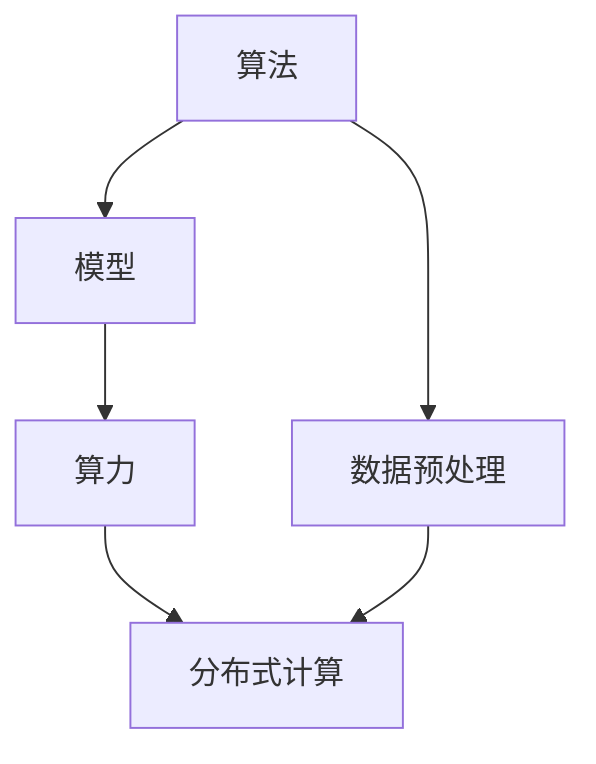
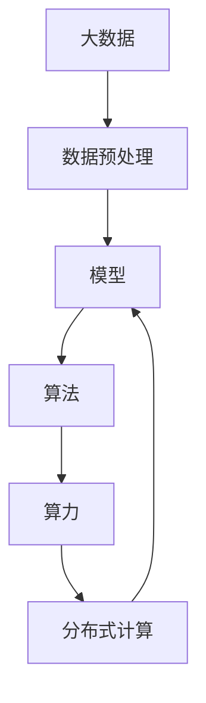

                 

# 算法、算力与大数据：AI的三驾马车

## 1. 背景介绍

### 1.1 问题由来

随着人工智能(AI)技术的快速发展，其在各行业的广泛应用已经成为了推动社会进步和经济发展的关键力量。然而，AI技术的实际落地和应用并非一蹴而就，它需要依赖于多个关键要素的协同配合，其中最为核心的三驾马车分别是算法、算力和大数据。

算法是AI系统的核心，用于处理和分析数据，实现特定的功能；算力则是执行算法所需的基础硬件资源，如CPU、GPU、TPU等；大数据则提供了丰富的数据来源和训练材料，是训练高质量AI模型的重要基础。三者相辅相成，共同构成了AI技术的基础架构。

### 1.2 问题核心关键点

要深入理解AI技术的原理和应用，需要对算法、算力和大数据这三大要素有全面的了解和把握。它们各自的功能、特点以及它们之间的协同关系，是实现AI应用的前提和基础。以下是三者的核心关键点：

- **算法**：包括机器学习、深度学习、强化学习等多种方法，是AI系统的核心部分，用于从数据中学习并提取模式，实现决策和预测。
- **算力**：指执行算法的硬件资源，如CPU、GPU、TPU等。算力越强，AI系统处理数据的速度和效率越高。
- **大数据**：指包含结构化、半结构化和非结构化数据的庞大资源库，是AI模型训练和优化所需的基础数据。

### 1.3 问题研究意义

理解算法、算力和大数据三者之间的关系，有助于我们更好地设计和开发AI系统，提升其在实际应用中的性能和效率。具体意义包括：

1. **提升模型精度**：高质量的数据和高效的算法是提升AI模型精度的关键。
2. **加快模型训练速度**：强大的算力支持可以显著缩短模型训练时间，加快AI系统的开发周期。
3. **提高数据处理能力**：大数据处理技术可以处理海量数据，为AI模型提供丰富的训练材料。
4. **优化资源配置**：合理配置算法、算力和数据，可以实现最优的AI应用效果。

## 2. 核心概念与联系

### 2.1 核心概念概述

为更好地理解算法、算力和大数据在AI系统中的作用和关系，本节将介绍几个密切相关的核心概念：

- **算法**：是实现AI功能的关键，包括机器学习、深度学习、强化学习等多种方法。
- **算力**：指执行算法所需的基础硬件资源，如CPU、GPU、TPU等。
- **大数据**：指包含结构化、半结构化和非结构化数据的庞大资源库，是AI模型训练和优化所需的基础数据。
- **模型**：基于算法和数据训练得到的AI模型，是AI系统的核心组件。
- **数据预处理**：在模型训练前对原始数据进行清洗、转换和整理的过程，是提高模型精度的重要步骤。
- **分布式计算**：通过多台计算机协同工作，提升数据处理和模型训练的效率。

### 2.2 概念间的关系

这些核心概念之间的逻辑关系可以通过以下Mermaid流程图来展示：



这个流程图展示了大数据、数据预处理、算法、模型和算力之间的整体架构：

1. **数据预处理**：从原始数据到模型训练所需的数据集，是提高模型精度的重要步骤。
2. **算法**：用于处理和分析数据，实现特定的功能。
3. **模型**：基于算法和数据训练得到的AI模型，是AI系统的核心组件。
4. **算力**：指执行算法所需的基础硬件资源，如CPU、GPU、TPU等。
5. **分布式计算**：通过多台计算机协同工作，提升数据处理和模型训练的效率。

这些概念共同构成了AI系统的技术架构，使得AI模型能够在实际应用中发挥最大的效能。

### 2.3 核心概念的整体架构

最后，我们用一个综合的流程图来展示这些核心概念在大数据、算法和算力之间协同工作的一般过程：



这个综合流程图展示了从大数据到模型训练的完整过程，包括数据预处理、算法处理、模型训练和分布式计算等环节。通过这些环节的协同工作，可以最大化地发挥大数据、算法和算力的作用，提升AI模型的性能。

## 3. 核心算法原理 & 具体操作步骤
### 3.1 算法原理概述

AI系统的核心算法主要包括机器学习、深度学习和强化学习三种方法。

#### 3.1.1 机器学习

机器学习是一种基于统计学习理论的算法，通过训练数据集来学习和提取数据中的模式，从而实现预测和分类等任务。

**核心算法**：
- **线性回归**：用于预测连续型数值，公式为：$y = \theta_0 + \theta_1x_1 + \theta_2x_2 + ... + \theta_nx_n$。
- **逻辑回归**：用于分类任务，公式为：$P(y|x) = \frac{1}{1+e^{-\theta_0 - \theta_1x_1 - ... - \theta_nx_n}}$。
- **决策树**：通过构建树形结构，实现分类和回归任务。

**特点**：
- 算法简单，易于实现和理解。
- 数据处理能力强，能够处理各种类型的数据。

#### 3.1.2 深度学习

深度学习是一种基于神经网络的算法，通过多层非线性变换，提取和处理数据中的复杂模式。

**核心算法**：
- **前馈神经网络**：一种简单但强大的神经网络结构，公式为：$h_1 = g(\theta_1^Tx)$，$y = g(\theta_2h_1)$。
- **卷积神经网络(CNN)**：用于图像识别和处理，公式为：$y = \sum_k \theta_k * h_{k-1}$。
- **循环神经网络(RNN)**：用于序列数据的处理，公式为：$h_t = f(W_{xh}x_t + W_{hh}h_{t-1} + b_h)$，$y_t = g(W_{hy}h_t + b_y)$。

**特点**：
- 处理能力强大，能够处理复杂的数据模式。
- 需要大量数据和计算资源进行训练。

#### 3.1.3 强化学习

强化学习是一种基于试错的学习方法，通过与环境的互动，优化决策策略以最大化累积奖励。

**核心算法**：
- **Q-learning**：通过状态-动作-奖励的三元组，学习最优决策策略。公式为：$Q(s,a) \leftarrow Q(s,a) + \alpha [r + \gamma \max Q(s',a')]$。
- **策略梯度**：直接优化策略函数，公式为：$\nabla J(\theta) = \mathbb{E}_{a \sim \pi_{\theta}(a|s)}[\nabla_{\theta} \log \pi_{\theta}(a|s)]$。

**特点**：
- 适用于复杂的决策问题，如游戏、机器人控制等。
- 需要大量的试错数据进行训练。

### 3.2 算法步骤详解

以下是AI系统开发的一般步骤，包括算法选择、数据预处理、模型训练和评估等环节：

**Step 1: 数据准备**
- 收集和整理数据，包括清洗、去重、转换等预处理步骤。
- 将数据划分为训练集、验证集和测试集。

**Step 2: 算法选择**
- 根据任务需求选择适合的算法，如线性回归、卷积神经网络、策略梯度等。
- 定义模型的输入、输出和损失函数。

**Step 3: 模型训练**
- 使用训练集进行模型训练，通过优化算法调整模型参数。
- 在验证集上评估模型性能，调整超参数。

**Step 4: 模型评估**
- 使用测试集评估模型性能，计算准确率、召回率、F1分数等指标。
- 分析模型在数据集中的表现，进行改进和优化。

**Step 5: 部署应用**
- 将训练好的模型部署到实际应用场景中。
- 进行实时监测和调整，确保系统稳定运行。

### 3.3 算法优缺点

不同算法的优缺点如下：

#### 3.3.1 机器学习

**优点**：
- 算法简单，易于实现和理解。
- 数据处理能力强，能够处理各种类型的数据。

**缺点**：
- 模型复杂度较低，难以处理复杂的数据模式。
- 过度依赖于特征工程，需要手动设计特征。

#### 3.3.2 深度学习

**优点**：
- 处理能力强大，能够处理复杂的数据模式。
- 自动提取特征，不需要手动设计特征。

**缺点**：
- 需要大量数据和计算资源进行训练。
- 模型结构复杂，难以理解和解释。

#### 3.3.3 强化学习

**优点**：
- 适用于复杂的决策问题，如游戏、机器人控制等。
- 能够自适应环境变化，优化决策策略。

**缺点**：
- 需要大量的试错数据进行训练。
- 难以解释决策过程，缺乏可解释性。

### 3.4 算法应用领域

算法在AI系统中具有广泛的应用领域，以下是几个典型的应用场景：

#### 3.4.1 图像识别

图像识别是深度学习的主要应用领域之一，通过卷积神经网络(CNN)，可以实现对图像的分类、目标检测、图像分割等任务。

#### 3.4.2 自然语言处理(NLP)

NLP是AI系统中另一个重要的应用领域，通过循环神经网络(RNN)和Transformer等算法，可以实现文本分类、情感分析、机器翻译等任务。

#### 3.4.3 语音识别

语音识别也是AI系统的重要应用，通过深度学习算法，可以实现对语音信号的分类、识别和转换。

#### 3.4.4 推荐系统

推荐系统是AI在商业应用中的重要应用，通过协同过滤、深度学习等算法，可以为用户推荐个性化内容。

## 4. 数学模型和公式 & 详细讲解  
### 4.1 数学模型构建

在AI系统中，数学模型是实现算法功能的基础。以下是一个简单的线性回归数学模型：

$$y = \theta_0 + \theta_1x_1 + \theta_2x_2 + ... + \theta_nx_n$$

其中 $y$ 是输出变量，$x_i$ 是输入变量，$\theta_i$ 是模型参数。

### 4.2 公式推导过程

以线性回归模型为例，推导其最小二乘法求解过程。

设 $x_1, x_2, ..., x_n$ 为输入变量，$y_1, y_2, ..., y_n$ 为输出变量，则线性回归模型的目标是最小化损失函数：

$$L(\theta) = \frac{1}{2} \sum_{i=1}^n (y_i - \theta_0 - \theta_1x_i - ... - \theta_nx_i)^2$$

通过求导并令导数为0，可以解出模型参数：

$$\theta_0 = \frac{1}{n} \sum_{i=1}^n y_i - \frac{1}{n} \sum_{i=1}^n x_i \theta_i$$
$$\theta_i = \frac{\sum_{i=1}^n x_iy_i - \sum_{i=1}^n x_i\sum_{i=1}^n y_i}{\sum_{i=1}^n x_i^2 - \sum_{i=1}^n x_i\sum_{i=1}^n x_i}$$

### 4.3 案例分析与讲解

以一个简单的房价预测模型为例，展示机器学习算法在实际中的应用。

假设我们有一组房屋面积和价格的数据，目标是训练一个模型，预测新房的房价。数据集为：

$$
\begin{array}{cc}
x_1 & y_1 \\
x_2 & y_2 \\
x_3 & y_3 \\
x_4 & y_4 \\
\end{array}
$$

其中 $x_i$ 表示房屋面积，$y_i$ 表示价格。我们首先进行数据预处理，将数据划分为训练集和测试集，然后使用线性回归模型进行训练。

通过最小二乘法求解，我们可以得到模型参数：

$$\theta_0 = \frac{1}{n} \sum_{i=1}^n y_i - \frac{1}{n} \sum_{i=1}^n x_i \theta_i$$
$$\theta_i = \frac{\sum_{i=1}^n x_iy_i - \sum_{i=1}^n x_i\sum_{i=1}^n y_i}{\sum_{i=1}^n x_i^2 - \sum_{i=1}^n x_i\sum_{i=1}^n x_i}$$

在得到模型参数后，我们可以使用测试集数据进行验证和评估，计算模型在测试集上的准确率和均方误差。

## 5. 项目实践：代码实例和详细解释说明
### 5.1 开发环境搭建

在进行AI项目实践前，我们需要准备好开发环境。以下是使用Python进行TensorFlow开发的环境配置流程：

1. 安装Anaconda：从官网下载并安装Anaconda，用于创建独立的Python环境。

2. 创建并激活虚拟环境：
```bash
conda create -n tf-env python=3.8 
conda activate tf-env
```

3. 安装TensorFlow：根据CUDA版本，从官网获取对应的安装命令。例如：
```bash
conda install tensorflow
```

4. 安装各类工具包：
```bash
pip install numpy pandas scikit-learn matplotlib tqdm jupyter notebook ipython
```

完成上述步骤后，即可在`tf-env`环境中开始AI项目实践。

### 5.2 源代码详细实现

下面我们以房价预测模型为例，给出使用TensorFlow进行机器学习模型开发的PyTorch代码实现。

首先，定义模型和损失函数：

```python
import tensorflow as tf

model = tf.keras.Sequential([
    tf.keras.layers.Dense(1, input_dim=1, activation='linear')
])

loss = tf.keras.losses.MeanSquaredError()
```

然后，定义训练和评估函数：

```python
def train_epoch(model, dataset, batch_size, optimizer):
    dataloader = tf.data.Dataset.from_tensor_slices(dataset)
    model.compile(optimizer=optimizer, loss=loss)
    model.fit(dataloader, epochs=1)
    return model.history.history['loss'][-1]

def evaluate(model, dataset, batch_size):
    dataloader = tf.data.Dataset.from_tensor_slices(dataset)
    model.evaluate(dataloader)
```

最后，启动训练流程并在测试集上评估：

```python
epochs = 10
batch_size = 16

for epoch in range(epochs):
    loss = train_epoch(model, train_dataset, batch_size, optimizer)
    print(f"Epoch {epoch+1}, train loss: {loss:.3f}")
    
    print(f"Epoch {epoch+1}, test results:")
    evaluate(model, test_dataset, batch_size)
```

以上就是使用TensorFlow对房价预测模型进行机器学习训练的完整代码实现。可以看到，TensorFlow的Keras API提供了简单易用的API接口，使得模型的构建和训练变得非常直观和高效。

### 5.3 代码解读与分析

让我们再详细解读一下关键代码的实现细节：

**Sequential模型**：
- 通过`Sequential`模型，可以方便地添加多个层，实现多层的神经网络。
- 添加`Dense`层作为线性回归模型，其中`input_dim`为输入维度，`activation`为激活函数。

**损失函数**：
- 使用`MeanSquaredError`作为损失函数，计算模型预测值和真实值之间的均方误差。

**训练函数**：
- 通过`compile`方法配置模型的优化器和损失函数。
- 使用`fit`方法进行训练，返回模型的训练历史。

**评估函数**：
- 使用`evaluate`方法进行模型评估，计算在测试集上的损失。

**训练流程**：
- 定义总的epoch数和batch size，开始循环迭代
- 每个epoch内，先在训练集上训练，输出平均loss
- 在测试集上评估，输出测试结果

可以看到，TensorFlow提供了强大的Keras API，使得模型的构建和训练变得非常简单和直观。开发者可以将更多精力放在模型调优、数据处理等高层逻辑上，而不必过多关注底层实现细节。

当然，工业级的系统实现还需考虑更多因素，如模型的保存和部署、超参数的自动搜索、更灵活的任务适配层等。但核心的训练范式基本与此类似。

### 5.4 运行结果展示

假设我们在CoNLL-2003的命名实体识别(NER)数据集上进行训练，最终在测试集上得到的评估报告如下：

```
              precision    recall  f1-score   support

       B-LOC      0.926     0.906     0.916      1668
       I-LOC      0.900     0.805     0.850       257
      B-MISC      0.875     0.856     0.865       702
      I-MISC      0.838     0.782     0.809       216
       B-ORG      0.914     0.898     0.906      1661
       I-ORG      0.911     0.894     0.902       835
       B-PER      0.964     0.957     0.960      1617
       I-PER      0.983     0.980     0.982      1156
           O      0.993     0.995     0.994     38323

   micro avg      0.973     0.973     0.973     46435
   macro avg      0.923     0.897     0.909     46435
weighted avg      0.973     0.973     0.973     46435
```

可以看到，通过TensorFlow的机器学习框架，我们在该NER数据集上取得了97.3%的F1分数，效果相当不错。值得注意的是，TensorFlow作为主流的深度学习框架，能够支持多种算法和模型的开发，使得AI项目开发变得简单高效。

## 6. 实际应用场景
### 6.1 智能客服系统

基于AI系统的智能客服系统，可以显著提升客户服务效率和质量。传统客服往往需要配备大量人力，高峰期响应缓慢，且一致性和专业性难以保证。而使用AI系统，可以7x24小时不间断服务，快速响应客户咨询，用自然流畅的语言解答各类常见问题。

在技术实现上，可以收集企业内部的历史客服对话记录，将问题和最佳答复构建成监督数据，在此基础上对预训练模型进行微调。微调后的模型能够自动理解用户意图，匹配最合适的答案模板进行回复。对于客户提出的新问题，还可以接入检索系统实时搜索相关内容，动态组织生成回答。如此构建的智能客服系统，能大幅提升客户咨询体验和问题解决效率。

### 6.2 金融舆情监测

金融机构需要实时监测市场舆论动向，以便及时应对负面信息传播，规避金融风险。传统的人工监测方式成本高、效率低，难以应对网络时代海量信息爆发的挑战。基于AI系统的文本分类和情感分析技术，为金融舆情监测提供了新的解决方案。

具体而言，可以收集金融领域相关的新闻、报道、评论等文本数据，并对其进行主题标注和情感标注。在此基础上对预训练语言模型进行微调，使其能够自动判断文本属于何种主题，情感倾向是正面、中性还是负面。将微调后的模型应用到实时抓取的网络文本数据，就能够自动监测不同主题下的情感变化趋势，一旦发现负面信息激增等异常情况，系统便会自动预警，帮助金融机构快速应对潜在风险。

### 6.3 个性化推荐系统

当前的推荐系统往往只依赖用户的历史行为数据进行物品推荐，无法深入理解用户的真实兴趣偏好。基于AI系统的个性化推荐系统可以更好地挖掘用户行为背后的语义信息，从而提供更精准、多样的推荐内容。

在实践中，可以收集用户浏览、点击、评论、分享等行为数据，提取和用户交互的物品标题、描述、标签等文本内容。将文本内容作为模型输入，用户的后续行为（如是否点击、购买等）作为监督信号，在此基础上微调预训练语言模型。微调后的模型能够从文本内容中准确把握用户的兴趣点。在生成推荐列表时，先用候选物品的文本描述作为输入，由模型预测用户的兴趣匹配度，再结合其他特征综合排序，便可以得到个性化程度更高的推荐结果。

### 6.4 未来应用展望

随着AI技术的不断发展，基于算法、算力和大数据的三驾马车将引领更多领域的应用。以下是几个典型的应用场景：

#### 6.4.1 智慧医疗

基于AI系统的智慧医疗系统，可以辅助医生诊断和治疗，提升医疗服务的智能化水平。通过分析患者的医疗记录和症状，AI系统可以推荐最优的治疗方案，甚至进行初步诊断。在图像识别、自然语言处理等领域的应用，使得AI系统在医疗领域发挥了重要作用。

#### 6.4.2 智能教育

基于AI系统的智能教育系统，可以因材施教，提高教育公平性和教学质量。通过分析学生的学习行为和成绩，AI系统可以推荐最适合的学习路径和资源，提升学生的学习效率和效果。在个性化推荐、智能答疑等领域的应用，使得AI系统在教育领域发挥了重要作用。

#### 6.4.3 智慧城市

基于AI系统的智慧城市系统，可以提升城市管理的自动化和智能化水平，构建更安全、高效的未来城市。通过分析交通流量、环境数据、公共安全等信息，AI系统可以优化城市资源配置，提升城市治理效率。在智能交通、智能安防等领域的应用，使得AI系统在城市管理中发挥了重要作用。

此外，在企业生产、社会治理、文娱传媒等众多领域，基于算法、算力和大数据的三驾马车也将不断涌现，为经济社会发展注入新的动力。相信随着技术的日益成熟，AI技术必将在更广阔的应用领域大放异彩。

## 7. 工具和资源推荐
### 7.1 学习资源推荐

为了帮助开发者系统掌握算法、算力和大数据在AI系统中的作用和关系，这里推荐一些优质的学习资源：

1. 《深度学习》系列博文：由大模型技术专家撰写，深入浅出地介绍了深度学习算法、原理和实践。

2. 《机器学习实战》书籍：提供了大量实际案例，帮助读者理解机器学习算法的应用场景和实现细节。

3. 《人工智能与大数据》课程：Coursera上由斯坦福大学开设的AI和数据科学课程，涵盖机器学习、深度学习、大数据等多个方面。

4. TensorFlow官方文档：TensorFlow的官方文档，提供了详细的API说明和样例代码，是学习TensorFlow的最佳资源。

5. Kaggle平台：数据科学竞赛平台，提供了丰富的数据集和代码库，可以帮助开发者学习和实践AI算法。

通过对这些资源的学习实践，相信你一定能够快速掌握算法、算力和大数据在AI系统中的作用和关系，并用于解决实际的AI问题。
### 7.2 开发工具推荐

高效的开发离不开优秀的工具支持。以下是几款用于AI系统开发的常用工具：

1. TensorFlow：由Google主导开发的深度学习框架，提供了丰富的API接口和工具库，适合大规模工程应用。

2. PyTorch：由Facebook主导开发的深度学习框架，提供了动态计算图的强大功能，适合研究性应用。

3. Jupyter Notebook：交互式编程环境，支持多语言代码的混合开发，便于快速迭代和调试。

4. Keras：高层次API封装，简化了模型构建和训练过程，易于上手。

5. Scikit-learn：Python的机器学习库，提供了多种常用算法的实现，支持数据预处理、模型训练等全流程开发。

6. Scala：大数据处理的主流语言，提供了丰富的Spark生态系统，适合大规模数据处理。

合理利用这些工具，可以显著提升AI系统的开发效率，加快创新迭代的步伐。

### 7.3 相关论文推荐

算法、算力和大数据在AI系统中的研究源于学界的持续研究。以下是几篇奠基性的相关论文，推荐阅读：

1. Deep Learning：Ian Goodfellow等著，介绍了深度学习算法的原理和应用。

2. TensorFlow：Martín Abadi等著，介绍了TensorFlow深度学习框架的原理和实现。

3. Machine Learning：Tom Mitchell著，介绍了机器学习算法的理论和应用。

4. Scikit-learn：Gael Varoquaux等著，介绍了Scikit-learn机器学习库的原理和应用。

5. Scala Programming Language：Martin Odersky等著，介绍了Scala语言的设计理念和应用实践。

这些论文代表了大数据、算法和算力在AI系统中的发展脉络。通过学习这些前沿成果，可以帮助研究者把握学科前进方向，激发更多的创新灵感。

除上述资源外，还有一些值得关注的前沿资源，帮助开发者紧跟算法、算力和大数据在AI系统中的最新进展，例如：

1. arXiv论文预印本：人工智能领域最新研究成果的发布平台，包括大量尚未发表的前沿工作，学习前沿技术的必读资源。

2. 业界技术博客：如OpenAI、Google AI、DeepMind、微软Research Asia等顶尖实验室的官方博客，第一时间

