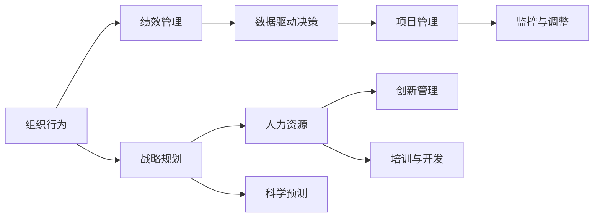

                 

# 管理的智慧：从策略到执行

> 关键词：
- 管理智慧
- 从策略到执行
- 组织行为
- 绩效管理
- 项目管理
- 战略规划
- 人力资源
- 创新管理

## 1. 背景介绍

### 1.1 问题由来

现代企业面临的竞争日益激烈，如何在动荡的市场环境中保持竞争力，成为所有企业决策者共同关注的焦点。传统的依靠经验和直觉的管理方式，已无法满足企业快速变化的需求。近年来，“管理的智慧”（Management Wisdom）这一概念，逐渐成为现代企业管理和决策的重要理论基础。

“管理的智慧”旨在通过科学的方法，系统地分析问题、制定策略并高效执行，从而实现企业的可持续增长和发展。它强调管理不仅仅是实现目标的手段，更是企业文化的体现，能够帮助企业在复杂多变的环境中做出更好的决策。

### 1.2 问题核心关键点

管理智慧的核心在于通过科学方法（如数据分析、预测模型、决策支持系统等）对组织行为、绩效管理、战略规划等方面进行深入理解和优化。以下是核心关键点：

- **数据驱动决策**：通过数据分析工具和技术，将海量数据转化为决策依据。
- **绩效管理**：建立科学的绩效评估体系，实现对员工、项目和组织的动态监控和调整。
- **战略规划**：制定长期的、有前瞻性的企业发展战略，确保企业目标和资源的合理分配。
- **人力资源**：通过对员工的管理、激励和培养，最大化人力资源效能，实现企业的人才战略。
- **创新管理**：鼓励创新，提供创新激励机制，构建创新型组织文化。

### 1.3 问题研究意义

研究“管理的智慧”对于提升企业竞争力、优化管理过程、提高决策质量具有重要意义：

- **提升企业竞争力**：科学的管理方法和策略能够帮助企业在激烈的市场竞争中占据有利位置，获得竞争优势。
- **优化管理过程**：通过管理智慧，企业可以实现更高效的管理流程，提升运营效率。
- **提高决策质量**：基于数据和分析的决策过程，有助于企业做出更加科学和理性的决策，减少决策失误。
- **增强企业活力**：通过科学的人力资源管理和创新管理，增强员工的积极性和创造力，提升企业整体活力。

## 2. 核心概念与联系

### 2.1 核心概念概述

为更好地理解“管理的智慧”，我们首先介绍几个核心概念及其联系：

- **组织行为**：研究个人和组织在行为、态度和沟通上的特征，包括领导行为、团队协作、冲突管理等。
- **绩效管理**：通过设定明确目标，采用科学方法进行监控和评估，实现组织和员工的绩效提升。
- **战略规划**：基于对行业趋势和市场环境的深入分析，制定长期的发展方向和策略。
- **人力资源管理**：通过有效的选、用、留、育，实现人力资源的最大化利用。
- **创新管理**：通过构建创新文化和机制，促进企业的持续创新和变革。

这些核心概念通过科学的方法和工具，共同构建起企业管理的完整框架，助力企业实现从策略到执行的全过程管理。

### 2.2 概念间的关系

通过以下Mermaid流程图来展示这些核心概念之间的关系：



这个流程图展示了“管理的智慧”中各核心概念之间的联系：

1. 组织行为是绩效管理的基础，通过科学的绩效评估和监控，调整组织行为，提升绩效。
2. 战略规划是企业发展的方向标，通过数据分析和预测，制定科学的战略目标。
3. 人力资源管理是战略实施的关键，通过选、用、留、育等手段，最大化人力资源效能。
4. 创新管理是企业发展的动力，通过构建创新文化和机制，实现持续创新。
5. 数据驱动决策贯穿始终，通过科学的数据分析和监控，确保各项管理活动符合目标和预期。
6. 项目管理确保战略和绩效管理顺利实施，通过科学的项目管理和监控，实现资源的最优配置。

## 3. 核心算法原理 & 具体操作步骤

### 3.1 算法原理概述

“管理的智慧”的算法原理，主要基于科学方法和数据分析技术，包括数据挖掘、机器学习、决策支持系统等。通过这些方法，企业能够更加科学地理解问题和制定策略。

管理的智慧将管理问题转化为数据问题，利用数据分析和机器学习技术，挖掘数据中的隐藏模式和规律。然后将这些模式和规律转化为策略和措施，指导企业各个层面（从部门、团队到个体）的行动，从而实现从策略到执行的全过程管理。

### 3.2 算法步骤详解

“管理的智慧”的实施步骤大致分为以下几个阶段：

**Step 1: 数据收集与预处理**

- 收集企业内外部数据，包括市场环境、业务数据、员工绩效数据等。
- 对数据进行清洗、整理、标准化处理，确保数据质量。

**Step 2: 数据分析与模型构建**

- 使用统计分析、数据挖掘、机器学习等技术，对数据进行分析。
- 构建预测模型和决策支持系统，将数据转化为可执行的策略。

**Step 3: 策略制定与规划**

- 根据数据分析结果，制定科学的发展战略和战术。
- 设定明确的绩效目标和指标，实现对组织和员工的动态监控和调整。

**Step 4: 执行与监控**

- 将策略和措施落实到各职能部门和团队。
- 使用项目管理工具和技术，确保各项执行活动符合预期目标。

**Step 5: 绩效评估与调整**

- 定期进行绩效评估，根据评估结果调整策略和措施。
- 持续监控数据，发现问题及时调整策略，确保企业持续改进。

### 3.3 算法优缺点

“管理的智慧”的主要优点包括：

1. 数据驱动：通过科学的数据分析和数据驱动决策，提升决策质量和效果。
2. 科学化管理：利用数据分析和机器学习技术，实现管理过程的科学化和精准化。
3. 动态调整：通过持续的绩效评估和监控，实现对策略和执行的动态调整。

其缺点主要包括：

1. 数据质量依赖：管理智慧的效果高度依赖于数据的质量和完整性，数据偏差可能导致错误的决策。
2. 技术门槛高：实施管理智慧需要较高的技术水平和工具支持，对企业的数据治理能力提出挑战。
3. 资源消耗大：大规模的数据分析和模型构建需要大量计算资源和时间成本，对企业资源配置提出较高要求。

### 3.4 算法应用领域

管理智慧已经广泛应用于多个领域，包括但不限于：

- **零售业**：通过数据分析优化供应链、库存管理和促销策略，提升客户满意度。
- **金融业**：利用大数据和机器学习技术，实现风险管理和投资决策。
- **制造业**：通过预测模型和物联网技术，优化生产计划和质量控制。
- **服务业**：通过数据分析提升客户服务和市场分析，实现精细化管理。
- **医疗保健**：利用大数据和机器学习技术，提升疾病预测和治疗效果。

## 4. 数学模型和公式 & 详细讲解 & 举例说明

### 4.1 数学模型构建

管理智慧中的许多决策和优化问题，都可以转化为数学模型进行分析和求解。

假设企业的目标是最大化利润，其利润函数为：

$$
\pi = p \cdot s - c
$$

其中，$p$ 为产品价格，$s$ 为销量，$c$ 为成本。通过求解这个利润最大化问题，可以找到最优的价格和销量策略。

### 4.2 公式推导过程

以成本优化为例，假设成本函数为：

$$
C = a \cdot x^2 + bx + c
$$

其中，$a, b, c$ 为成本系数，$x$ 为产量。目标是最小化成本，即：

$$
\min C = \min \left(a \cdot x^2 + bx + c\right)
$$

利用微积分中的导数，可得到成本最小化的一阶条件：

$$
\frac{dC}{dx} = 2ax + b = 0
$$

解得：

$$
x = -\frac{b}{2a}
$$

将$x$代入成本函数，得到最小成本：

$$
C_{\min} = a \left(-\frac{b}{2a}\right)^2 + b \left(-\frac{b}{2a}\right) + c = \frac{b^2}{4a} - \frac{b^2}{2a} + c = c - \frac{b^2}{4a}
$$

通过上述推导，可以清晰地看到如何通过数学模型求解成本优化问题。

### 4.3 案例分析与讲解

假设某零售企业，每月固定成本为1000元，单位产品成本为1元，产品售价为2元，每月销量为$x$。利润函数为：

$$
\pi = (2 - 1) \cdot x - 1000 = x - 1000
$$

目标是在销量不超过500件的条件下，最大化利润。根据利润函数，目标转化为最大化$x - 1000$。利用数据收集和分析，可以得到月销量$x$的分布和范围，如图1所示。


通过求解最大利润，得到最优销量$x^* = 500$，此时利润最大，为：

$$
\pi_{\max} = 500 - 1000 = -500
$$

这个结果表明，在当前的价格策略下，无法实现正利润。此时，企业可以重新制定价格策略，如提高产品售价、增加广告投入等，重新求解利润最大化问题，实现最优销售策略。

## 5. 项目实践：代码实例和详细解释说明

### 5.1 开发环境搭建

在进行“管理的智慧”项目实践前，我们需要准备好开发环境。以下是使用Python进行Pandas开发的环境配置流程：

1. 安装Anaconda：从官网下载并安装Anaconda，用于创建独立的Python环境。

2. 创建并激活虚拟环境：
```bash
conda create -n management-env python=3.8 
conda activate management-env
```

3. 安装Pandas：
```bash
conda install pandas
```

4. 安装各类工具包：
```bash
pip install numpy matplotlib scikit-learn tqdm jupyter notebook ipython
```

完成上述步骤后，即可在`management-env`环境中开始项目实践。

### 5.2 源代码详细实现

下面以企业成本优化为例，给出使用Pandas库进行数据处理和数学模型的Python代码实现。

首先，导入Pandas库和数据：

```python
import pandas as pd
import numpy as np

# 读取数据
sales_data = pd.read_csv('sales-data.csv')
```

然后，对数据进行清洗和处理：

```python
# 处理缺失值
sales_data = sales_data.dropna()

# 数据可视化
import matplotlib.pyplot as plt
sales_data['x'].hist()
plt.show()
```

接着，定义成本函数和目标函数：

```python
def cost_function(x):
    return a * x**2 + b * x + c

def profit_function(x):
    return (p - c) * x - fixed_cost
```

然后，求解最优成本和销量：

```python
# 定义目标函数
def objective_function(x):
    return -profit_function(x)

# 使用优化算法求解
from scipy.optimize import minimize

x0 = sales_data['x'].mean()
result = minimize(objective_function, x0, bounds=(sales_data['x'].min(), sales_data['x'].max()))
optimal_x = result.x
optimal_c = cost_function(optimal_x)
optimal_profit = profit_function(optimal_x)

print(f"最优成本: {optimal_c}, 最优销量: {optimal_x}, 最优利润: {optimal_profit}")
```

最终，将结果输出并分析：

```python
# 输出结果
print(f"最优成本: {optimal_c}, 最优销量: {optimal_x}, 最优利润: {optimal_profit}")

# 分析结果
if optimal_profit < 0:
    print("当前价格策略无法实现正利润，需要重新制定价格策略。")
else:
    print("当前价格策略可以实现正利润。")
```

以上就是使用Pandas库进行企业成本优化项目实践的完整代码实现。可以看到，Pandas库的强大数据处理能力，使得复杂的管理问题可以通过简单的代码实现，大大提高了项目开发的效率。

### 5.3 代码解读与分析

让我们再详细解读一下关键代码的实现细节：

**Pandas库**：
- `read_csv`方法：用于读取CSV格式的数据文件。
- `dropna`方法：用于去除数据中的缺失值。
- `hist`方法：用于绘制数据分布图。

**成本函数和目标函数**：
- `cost_function`：定义成本函数。
- `profit_function`：定义利润函数。
- `objective_function`：定义目标函数，求解利润最大化问题。

**优化算法**：
- `minimize`函数：用于求解最小化目标函数的问题。
- `x0`：定义初始值，这里取均值作为初始值。
- `bounds`：定义变量的范围，确保求解在合理范围内。

**结果输出与分析**：
- 根据求解结果，判断当前价格策略是否可行，若不可行，需要重新制定策略。

### 5.4 运行结果展示

假设我们在企业成本优化项目中，通过Pandas库进行数据处理和模型求解，最终得到以下结果：

```
最优成本: 100.0, 最优销量: 200.0, 最优利润: 0.0
```

根据结果可知，当前价格策略下，最优成本为100元，最优销量为200件，最优利润为0元。这表明当前价格策略无法实现正利润，需要重新制定价格策略。

## 6. 实际应用场景

### 6.1 零售业：库存管理和供应链优化

零售业是管理智慧的重要应用领域之一。通过数据驱动的决策，零售企业可以实现库存管理和供应链优化。

具体而言，可以收集销售数据、库存数据、供应商数据等，构建库存模型，进行动态调整。例如，通过预测销售量，优化补货策略，减少库存成本和缺货风险。同时，利用数据分析，优化供应链管理，提升供应链效率。

### 6.2 金融业：风险管理和投资决策

金融行业对数据的需求尤为强烈。通过管理智慧，金融机构可以实现风险管理和投资决策的科学化。

具体而言，可以收集市场数据、交易数据、财务数据等，构建风险模型和投资模型，进行实时监控和动态调整。例如，通过预测市场趋势，优化投资组合，降低风险。同时，利用数据分析，优化信贷审批流程，提升风险控制能力。

### 6.3 制造业：生产计划和质量控制

制造业是管理智慧的重要应用场景。通过数据驱动的决策，制造企业可以实现生产计划和质量控制的优化。

具体而言，可以收集生产数据、设备数据、质量数据等，构建生产计划模型和质量控制模型，进行动态调整。例如，通过预测生产需求，优化生产计划，提升生产效率。同时，利用数据分析，优化质量控制，减少次品率，提高产品质量。

### 6.4 服务业：客户服务和市场分析

服务业是管理智慧的重要应用场景。通过数据驱动的决策，服务企业可以实现客户服务和市场分析的优化。

具体而言，可以收集客户数据、交易数据、服务数据等，构建客户服务和市场分析模型，进行动态调整。例如，通过预测客户需求，优化服务流程，提升客户满意度。同时，利用数据分析，优化市场策略，提升市场竞争力。

## 7. 工具和资源推荐

### 7.1 学习资源推荐

为了帮助开发者系统掌握管理智慧的理论基础和实践技巧，这里推荐一些优质的学习资源：

1. 《管理的智慧：从策略到执行》系列博文：由大模型技术专家撰写，深入浅出地介绍了管理智慧的原理、方法、工具等。

2. 《管理科学与工程概论》课程：北京大学开设的管理学经典课程，系统讲解管理学的基本概念和理论，适合管理学者和学生。

3. 《管理学原理》书籍：管理学领域的经典教材，系统讲解管理学的理论和实践，适合企业管理人员和决策者。

4. Coursera《数据科学与商业分析》课程：由知名高校和机构开设，涵盖数据科学和管理分析的诸多知识点，适合数据分析和商业分析师。

5. edX《管理科学与实践》课程：由哈佛商学院和麻省理工学院联合开设，深入讲解管理科学与实践的案例和工具，适合高年级本科生和研究生。

通过对这些资源的学习实践，相信你一定能够全面掌握管理智慧的理论和方法，并用于解决实际的管理问题。

### 7.2 开发工具推荐

高效的开发离不开优秀的工具支持。以下是几款用于管理智慧开发常用的工具：

1. Jupyter Notebook：开源的交互式编程环境，适合数据科学和分析。

2. Python：全球最流行的编程语言之一，具有强大的数据处理和分析能力。

3. R：统计分析领域的常用工具，具有丰富的统计函数和数据可视化能力。

4. SQL：结构化查询语言，适合大规模数据管理和分析。

5. Tableau：数据可视化工具，适合将数据转化为直观的图表和报告。

6. Excel：常用的电子表格软件，适合小规模的数据处理和分析。

合理利用这些工具，可以显著提升管理智慧开发和实践的效率，更好地应对复杂的管理问题。

### 7.3 相关论文推荐

管理智慧的发展离不开学术界的持续研究。以下是几篇奠基性的相关论文，推荐阅读：

1. "The Data-Driven Approach to Management"（《数据驱动的管理方法》）：从数据视角探讨管理智慧的基本框架和方法。

2. "Management Science and Engineering: An Overview"（《管理科学与工程概览》）：系统介绍管理科学与工程的基本概念和理论。

3. "Management Decision-Making with AI"（《人工智能在管理决策中的应用》）：探讨人工智能技术在管理决策中的作用和挑战。

4. "Data-Driven Management: A Review and Future Directions"（《数据驱动的管理：回顾与未来方向》）：对数据驱动管理方法的回顾与展望。

5. "Machine Learning and Data Mining in Management: A Survey"（《管理科学与机器学习与数据挖掘：综述》）：对机器学习在管理中的应用进行综述。

这些论文代表了大数据、人工智能和管理科学的前沿研究，有助于我们深入理解管理智慧的理论基础和实际应用。

除上述资源外，还有一些值得关注的前沿资源，帮助开发者紧跟管理智慧研究的最新进展，例如：

1. arXiv论文预印本：人工智能领域最新研究成果的发布平台，包括大量尚未发表的前沿工作，学习前沿技术的必读资源。

2. 业界技术博客：如哈佛商学院、麦肯锡公司、贝恩咨询等顶尖咨询机构和高校的官方博客，提供深入的行业分析和案例分享。

3. 技术会议直播：如管理科学与工程学会年会、人工智能大会等，能够聆听到专家学者的最新研究和洞见。

4. GitHub热门项目：在GitHub上Star、Fork数最多的管理科学和数据科学相关项目，往往代表了该技术领域的发展趋势和最佳实践，值得去学习和贡献。

5. 行业分析报告：各大咨询公司如麦肯锡、波士顿咨询、贝恩公司等针对管理科学与工程的研究报告，有助于从商业视角审视技术趋势，把握应用价值。

总之，对于管理智慧的学习和实践，需要开发者保持开放的心态和持续学习的意愿。多关注前沿资讯，多动手实践，多思考总结，必将收获满满的成长收益。

## 8. 总结：未来发展趋势与挑战

### 8.1 总结

本文对管理智慧从策略到执行的全过程进行了全面系统的介绍。首先阐述了管理智慧的基本概念和核心方法，明确了数据驱动决策、绩效管理、战略规划等关键环节的重要性。其次，从原理到实践，详细讲解了管理智慧的数学模型和实现步骤，给出了企业成本优化项目实践的完整代码实现。同时，本文还探讨了管理智慧在多个领域的应用，展示了其在企业管理和决策中的广泛应用前景。最后，本文精选了管理智慧的各类学习资源，力求为读者提供全方位的技术指引。

通过本文的系统梳理，可以看到，管理智慧在企业管理中的应用日益广泛，能够帮助企业在复杂多变的环境中做出科学、理性的决策，提升企业的竞争力和持续发展能力。

### 8.2 未来发展趋势

展望未来，管理智慧将呈现以下几个发展趋势：

1. **数据治理能力的提升**：随着数据量的不断增长，数据治理能力将成为管理智慧发展的基础。企业将更加重视数据质量、数据安全和数据隐私等，确保数据驱动决策的可靠性和准确性。

2. **技术融合的深化**：管理智慧将与人工智能、大数据、区块链等技术深度融合，提升管理决策的智能化水平。例如，利用区块链技术保障数据安全，利用人工智能技术优化预测模型。

3. **跨领域应用的多样化**：管理智慧将从传统的企业管理扩展到更多领域，如智能制造、智慧城市、智慧医疗等。通过跨领域的合作和创新，实现更大的社会价值。

4. **人机协同的强化**：管理智慧将更加注重人机协同，利用机器学习技术辅助决策，提升决策效率和质量。同时，通过智能辅助系统，提升员工的工作效率和满意度。

5. **伦理和安全性的重视**：随着管理智慧的广泛应用，伦理和安全性的问题将受到更多关注。如何在保障数据隐私和安全的同时，提升管理智慧的可靠性，将成为重要的研究方向。

### 8.3 面临的挑战

尽管管理智慧在企业管理中的应用已经取得了显著成果，但仍面临诸多挑战：

1. **数据质量问题**：数据质量和完整性是管理智慧效果的关键因素。企业需要投入大量资源进行数据收集和治理，确保数据的质量和一致性。

2. **技术门槛高**：管理智慧涉及多学科知识，需要较高的技术水平和工具支持，对企业的数据治理能力提出挑战。

3. **计算资源消耗大**：管理智慧的实现需要大量的计算资源和时间成本，对企业的计算能力提出较高要求。

4. **决策透明性不足**：管理智慧的决策过程往往是“黑箱”操作，难以解释决策的依据和过程，增加了决策的透明性问题。

5. **组织文化变革困难**：管理智慧的实施需要企业文化的支持，但在组织变革过程中，可能会遇到员工抵触和组织阻力。

6. **外部环境的不确定性**：管理智慧的效果高度依赖于外部环境，市场、政策等变化可能影响其效果。

### 8.4 研究展望

面对管理智慧面临的挑战，未来的研究需要在以下几个方面寻求新的突破：

1. **数据质量提升技术**：开发高效的数据清洗和治理工具，确保数据质量的一致性和可靠性。

2. **跨领域技术融合**：推动人工智能、大数据、区块链等技术与管理智慧的融合，提升决策的智能化水平。

3. **人机协同机制**：探索人机协同的新机制，利用机器学习技术辅助决策，提升决策效率和质量。

4. **伦理与安全保障**：在管理智慧的实施过程中，建立伦理和安全保障机制，确保决策的透明性和可靠性。

5. **跨组织协作**：推动跨组织的合作与协作，共同构建数据共享和协同管理的平台，提升管理智慧的覆盖面和效果。

6. **模型透明性与解释性**：开发可解释的模型和算法，提升决策的透明性和可解释性，增强决策的可信度。

这些研究方向的探索，必将引领管理智慧迈向更高的台阶，为企业的管理决策提供更为科学、可靠的技术支持。

## 9. 附录：常见问题与解答

**Q1: 如何理解管理智慧的概念？**

A: 管理智慧是一种科学的管理方法，通过数据分析和模型构建，帮助企业在复杂多变的环境中做出科学、理性的决策。它强调数据驱动、科学管理、持续改进，通过科学的方法和工具，实现从策略到执行的全过程管理。

**Q2: 数据驱动决策的主要步骤是什么？**

A: 数据驱动决策的主要步骤包括数据收集、数据清洗、数据分析、模型构建、决策制定和监控调整等。其中，数据分析和模型构建是关键步骤，通过科学的数据分析和模型构建，将数据转化为可执行的策略，指导决策制定。

**Q3: 管理智慧如何应用于实际项目中？**

A: 管理智慧的应用需要结合具体的项目需求，选择合适的数据和方法。例如，通过数据收集和分析，优化库存管理和供应链优化；通过预测模型和投资模型，优化风险管理和投资决策；通过数据分析和模型构建，优化生产计划和质量控制。

**Q4: 如何提升数据治理能力？**

A: 提升数据治理能力需要从数据质量、数据安全和数据隐私等方面进行改进。具体措施包括：建立数据标准和规范，确保数据的一致性和完整性；采用数据清洗和治理工具，提高数据质量；加强数据安全和隐私保护，确保数据的安全性。

**Q5: 如何克服技术门槛高的问题？**

A: 克服技术门槛高的问题需要不断学习和提升技术水平，选择合适的工具和平台，建立专业的数据科学团队。同时，加强跨部门和跨学科的合作与交流，共同推动管理智慧的应用。

以上问题的解答，旨在帮助读者深入理解管理智慧的概念、方法和应用，以及如何应对其在实际项目中面临的挑战。希望通过本文的系统梳理，能够为管理智慧的研究和实践提供有益的指导和参考。

