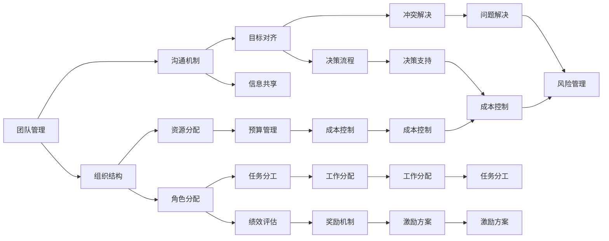
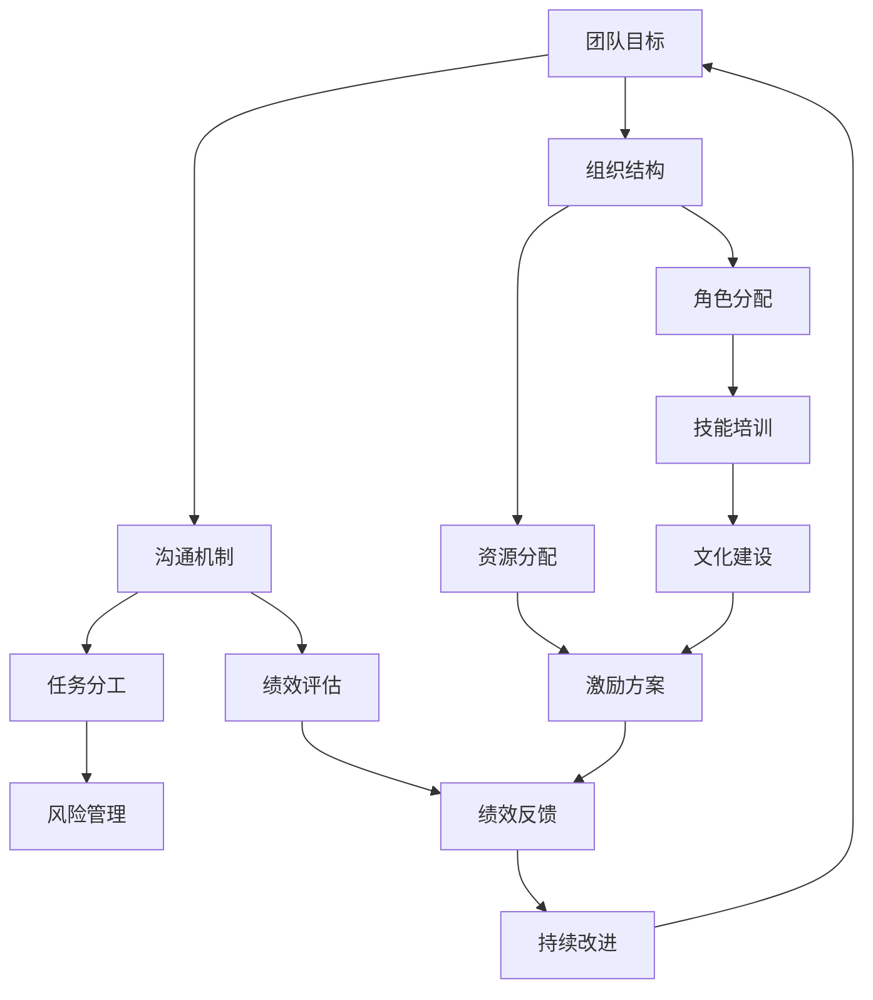

                 

## 1. 背景介绍

### 1.1 问题由来

在当今这个快速变化、高度竞争的商业环境中，如何高效管理团队，激发其潜能，一直是企业面临的重要挑战。特别是对于高科技企业，团队成员往往是高度专业化和多元化的，如何在不同的技术方向和产品线中高效协同，实现技术创新和商业成功，成为了管理的核心问题。

### 1.2 问题核心关键点

要高效管理团队，必须理解团队成员的工作动机、心理状态、技能水平和团队文化的特性，同时还需要适应不断变化的市场和技术环境。核心关键点包括：

- **团队管理：** 构建高效团队协作的组织结构和沟通机制。
- **员工激励：** 了解员工需求，制定个性化的激励方案。
- **技能培训：** 定期培训提升团队成员的专业技能。
- **文化建设：** 打造积极向上的企业文化和价值观。
- **风险管理：** 识别和管理技术风险和市场风险。

### 1.3 问题研究意义

研究团队管理智慧，对于构建高绩效团队、提升企业竞争力和创新能力具有重要意义：

1. **提高团队协作效率：** 通过科学的团队管理，能够提升团队协作的效率和质量，加速项目交付。
2. **增强员工满意度：** 有效的激励机制和团队文化建设，可以提升员工满意度和忠诚度。
3. **促进技术创新：** 灵活的培训和知识分享机制，可以激发团队成员的创造力，推动技术突破。
4. **增强市场响应能力：** 及时的风险识别和管理，可以降低市场和技术的风险，增强企业的市场适应能力。
5. **提升企业形象：** 良好的团队文化和员工满意度，可以提升企业形象和品牌价值。

## 2. 核心概念与联系

### 2.1 核心概念概述

为更好地理解团队管理的核心概念及其联系，本节将介绍几个关键概念：

- **团队管理：** 通过科学的管理方法和工具，构建高效的团队协作机制。
- **员工激励：** 通过合理的设计和实施激励机制，激发员工的积极性和创造力。
- **技能培训：** 提供持续的技能培训和发展机会，提升团队成员的专业能力。
- **文化建设：** 通过价值观、使命和行为规范的塑造，形成积极向上的团队文化。
- **风险管理：** 识别、评估和管理技术、市场等风险，确保项目和企业的稳定发展。

这些概念之间存在着紧密的联系，形成了团队管理的基本框架。通过理解这些概念，可以更好地设计和实施有效的团队管理策略。

### 2.2 概念间的关系

这些核心概念之间的关系可以用以下Mermaid流程图来展示：



这个流程图展示了大团队管理的核心概念及其之间的关系：

1. **组织结构：** 通过合理的组织结构和角色分配，明确团队的职责和分工。
2. **沟通机制：** 构建有效的沟通机制，确保信息流畅传递和团队协作。
3. **任务分工：** 根据团队成员的技能和兴趣，进行合理的工作分配。
4. **资源分配：** 合理分配团队资源，如预算、设备等，确保项目的顺利进行。
5. **绩效评估：** 定期评估团队成员的工作表现，提供激励和改进建议。
6. **激励方案：** 设计个性化的激励方案，激发员工的积极性和创造力。
7. **目标对齐：** 确保团队成员与组织目标的一致性，共同努力实现公司愿景。
8. **风险管理：** 识别和管理技术、市场等风险，保障项目和企业的稳定发展。

通过这些概念的有机结合，可以构建一个高效、稳定、充满活力的团队，实现企业的战略目标。

### 2.3 核心概念的整体架构

最后，我们用一个综合的流程图来展示这些核心概念在大团队管理中的整体架构：



这个综合流程图展示了从团队目标设定到绩效反馈和持续改进的完整管理过程，体现了团队管理的全生命周期和动态性。

## 3. 核心算法原理 & 具体操作步骤

### 3.1 算法原理概述

团队管理的核心算法原理主要基于组织行为学和心理学原理，通过科学的方法和工具，提升团队协作效率和员工满意度。核心算法原理包括：

1. **系统理论：** 将团队看作一个系统，通过系统化的管理方法提升系统效率。
2. **行为科学：** 理解团队成员的行为动机和心理状态，制定个性化的激励和管理策略。
3. **数据驱动：** 通过数据分析和量化评估，客观地识别问题和改进空间。
4. **人本管理：** 尊重员工个体差异，注重员工发展，提升员工的满意度和忠诚度。
5. **风险管理：** 识别和评估技术、市场等风险，制定相应的风险管理策略。

### 3.2 算法步骤详解

以下是团队管理的具体操作步骤：

**Step 1: 组织结构设计**
- 根据公司战略和业务需求，设计合适的组织结构，明确各部门的职责和权限。
- 使用矩阵式或扁平式结构，灵活应对不同的项目需求和团队规模。
- 设计跨部门的协作机制，促进团队间的信息共享和资源协同。

**Step 2: 角色和任务分配**
- 根据团队成员的技能和兴趣，进行合理的工作分配，确保每个人都有挑战和成长的机会。
- 制定明确的任务分工和绩效指标，评估团队成员的工作表现，提供及时的反馈和改进建议。
- 通过项目管理工具如Jira、Trello等，跟踪任务进度和成果。

**Step 3: 沟通机制建设**
- 建立定期的团队会议和跨部门沟通渠道，确保信息流畅传递和问题及时解决。
- 使用Slack、Microsoft Teams等协作工具，实现即时沟通和协作。
- 定期进行团队建设活动，增强团队凝聚力和合作精神。

**Step 4: 技能培训和发展**
- 定期组织技能培训和专业发展课程，提升团队成员的专业能力。
- 鼓励知识分享和内部讲师制度，形成良好的学习和交流氛围。
- 设立技术分享会和内部分享会，促进知识传播和创新。

**Step 5: 文化建设和激励机制**
- 制定公司的使命和价值观，形成积极向上的企业文化。
- 设计个性化的激励方案，如绩效奖金、股权激励、职业发展路径等，激发员工的积极性和创造力。
- 设立内部晋升和跨部门交流机制，鼓励员工多元化发展。

**Step 6: 风险管理**
- 定期进行风险评估和识别，识别技术、市场、法规等潜在的风险因素。
- 制定相应的风险管理策略，如技术预案、市场分析、合规审查等。
- 建立预警和应急响应机制，及时处理和缓解风险。

**Step 7: 绩效评估和持续改进**
- 制定科学的绩效评估标准，定期评估团队成员的工作表现。
- 根据评估结果，提供个性化的改进建议和激励方案。
- 持续改进团队管理方法和工具，提升团队协作效率和员工满意度。

### 3.3 算法优缺点

团队管理算法的优点包括：

1. **系统化：** 通过科学的管理方法和工具，提升团队协作效率和员工满意度。
2. **数据驱动：** 通过数据分析和量化评估，客观地识别问题和改进空间。
3. **人本管理：** 尊重员工个体差异，注重员工发展，提升员工的满意度和忠诚度。
4. **风险管理：** 识别和评估技术、市场等风险，制定相应的风险管理策略。

团队管理算法的缺点包括：

1. **复杂度高：** 需要综合考虑多个维度的管理因素，设计和管理复杂。
2. **个性化需求高：** 不同团队和员工的需求各异，需要个性化管理策略。
3. **资源投入大：** 需要投入大量的管理资源和时间，进行系统设计和执行。
4. **动态变化大：** 团队需求和市场环境不断变化，需要持续调整和优化。

### 3.4 算法应用领域

基于团队管理算法，已经在高科技企业、咨询公司、研发团队等多个领域得到了广泛应用。

- **高科技企业：** 如Google、Apple、Amazon等，通过科学的管理方法和工具，提升团队协作效率和创新能力。
- **咨询公司：** 如麦肯锡、BCG等，通过个性化的激励和文化建设，提升员工满意度和忠诚度。
- **研发团队：** 如Google Brain、Facebook AI Research等，通过技术预案和风险管理，保障项目的顺利进行和成果交付。

## 4. 数学模型和公式 & 详细讲解 & 举例说明

### 4.1 数学模型构建

团队管理的数学模型主要基于以下几个关键要素：

- **团队规模：** 描述团队中成员的数量和结构。
- **任务复杂度：** 描述任务难度和所需资源。
- **绩效指标：** 描述团队成员的工作表现和评估标准。
- **激励强度：** 描述激励机制的设计和实施效果。
- **风险评估：** 描述风险识别和评估的指标和方法。

构建数学模型时，可以使用以下公式：

1. **任务复杂度公式：**
   $$
   C = \sum_{i=1}^n \frac{c_i}{p_i}
   $$
   其中，$C$为任务复杂度，$n$为任务数，$c_i$为任务$i$的复杂度，$p_i$为任务$i$的完成概率。

2. **绩效指标公式：**
   $$
   P = \frac{\sum_{j=1}^m p_j \times v_j}{\sum_{j=1}^m p_j}
   $$
   其中，$P$为绩效指标，$m$为评估维度，$p_j$为评估维度$j$的权重，$v_j$为评估维度$j$的评分。

3. **激励强度公式：**
   $$
   I = \alpha \times K + \beta \times J
   $$
   其中，$I$为激励强度，$\alpha$为物质激励的权重，$K$为物质激励的系数，$\beta$为精神激励的权重，$J$为精神激励的系数。

4. **风险评估公式：**
   $$
   R = \sum_{k=1}^K r_k \times w_k
   $$
   其中，$R$为风险评估值，$K$为风险种类，$r_k$为风险$k$的评分，$w_k$为风险$k$的权重。

### 4.2 公式推导过程

以下是这些公式的推导过程：

**任务复杂度公式推导：**
根据任务复杂度的一般定义，假设任务$i$的复杂度为$c_i$，完成概率为$p_i$，则总复杂度$C$为所有任务的复杂度之和除以完成概率之和，即：
$$
C = \sum_{i=1}^n \frac{c_i}{p_i}
$$

**绩效指标公式推导：**
绩效指标$P$的计算公式为各个评估维度的加权平均值，其中$v_j$为评估维度$j$的评分，权重$p_j$反映了该维度对整体绩效的重要性，即：
$$
P = \frac{\sum_{j=1}^m p_j \times v_j}{\sum_{j=1}^m p_j}
$$

**激励强度公式推导：**
激励强度$I$由物质激励和精神激励两部分组成，分别乘以相应的权重$\alpha$和$\beta$，并求和，即：
$$
I = \alpha \times K + \beta \times J
$$

**风险评估公式推导：**
风险评估$R$通过将所有风险种类$r_k$的评分乘以相应的权重$w_k$，并求和，得到综合的风险评估值，即：
$$
R = \sum_{k=1}^K r_k \times w_k
$$

### 4.3 案例分析与讲解

假设某高科技公司有100名工程师，需要进行一个复杂的软件项目。项目分为10个任务，每个任务复杂度为5，完成概率为0.8。通过任务复杂度公式计算得到：

$$
C = \sum_{i=1}^{10} \frac{5}{0.8} = 10 \times 6.25 = 62.5
$$

表示该项目的任务复杂度为62.5，需要投入较多的人力资源。

在绩效评估方面，公司设定了10个评估维度，每个维度权重分别为0.1，评估维度的评分分别为1到10分。通过绩效指标公式计算得到：

$$
P = \frac{0.1 \times 1 + 0.1 \times 2 + ... + 0.1 \times 10}{10} = 5.5
$$

表示该项目的整体绩效为5.5分，需要进行改进。

在激励强度方面，公司设定了物质激励和精神激励两个维度，物质激励的权重为0.6，系数为1000元；精神激励的权重为0.4，系数为2小时休假。通过激励强度公式计算得到：

$$
I = 0.6 \times 1000 + 0.4 \times 2 = 680
$$

表示该项目的激励强度为680元。

在风险评估方面，公司识别了5种风险，每种风险的评分分别为3、4、5、6、7分，权重分别为0.1、0.2、0.1、0.3、0.3。通过风险评估公式计算得到：

$$
R = 3 \times 0.1 + 4 \times 0.2 + 5 \times 0.1 + 6 \times 0.3 + 7 \times 0.3 = 6.2
$$

表示该项目的风险评估值为6.2，需要进行风险管理。

## 5. 项目实践：代码实例和详细解释说明

### 5.1 开发环境搭建

在进行团队管理实践前，我们需要准备好开发环境。以下是使用Python进行Pandas开发的环境配置流程：

1. 安装Anaconda：从官网下载并安装Anaconda，用于创建独立的Python环境。

2. 创建并激活虚拟环境：
```bash
conda create -n pytorch-env python=3.8 
conda activate pytorch-env
```

3. 安装PyTorch：根据CUDA版本，从官网获取对应的安装命令。例如：
```bash
conda install pytorch torchvision torchaudio cudatoolkit=11.1 -c pytorch -c conda-forge
```

4. 安装各类工具包：
```bash
pip install numpy pandas scikit-learn matplotlib tqdm jupyter notebook ipython
```

完成上述步骤后，即可在`pytorch-env`环境中开始团队管理实践。

### 5.2 源代码详细实现

以下是一个简单的团队管理数据分析示例，使用Pandas进行数据处理和可视化：

```python
import pandas as pd
import matplotlib.pyplot as plt

# 假设有一份员工绩效评估数据
data = {
    '员工': ['张三', '李四', '王五', '赵六', '钱七'],
    '绩效': [8, 7, 9, 6, 8],
    '奖金': [5000, 4000, 6000, 3000, 5000]
}

# 将数据构建成Pandas DataFrame
df = pd.DataFrame(data)

# 计算绩效和奖金的平均值
mean_performance = df['绩效'].mean()
mean_bonus = df['奖金'].mean()

# 绘制直方图
plt.hist(df['绩效'], bins=10)
plt.xlabel('绩效评分')
plt.ylabel('频次')
plt.title('员工绩效分布')
plt.show()

# 绘制散点图
plt.scatter(df['绩效'], df['奖金'])
plt.xlabel('绩效评分')
plt.ylabel('奖金')
plt.title('绩效与奖金关系')
plt.show()

# 计算相关系数
correlation = df['绩效'].corr(df['奖金'])
print('绩效与奖金的相关系数为：', correlation)
```

### 5.3 代码解读与分析

让我们再详细解读一下关键代码的实现细节：

**数据结构**：
- `data`字典：包含员工、绩效和奖金三列数据。
- `df` DataFrame：将字典数据转换为Pandas DataFrame，方便进行数据处理和分析。

**数据处理**：
- `mean_performance`：计算绩效评分的平均值。
- `mean_bonus`：计算奖金的平均值。
- `plt.hist()`：绘制绩效评分的直方图。
- `plt.scatter()`：绘制绩效评分与奖金的散点图。
- `correlation`：计算绩效评分与奖金的相关系数。

**可视化**：
- `plt.show()`：显示直方图和散点图。
- `print()`：输出相关系数的值。

这个示例展示了如何使用Pandas进行团队管理数据的处理和分析，通过计算平均值、绘制图表和计算相关系数等操作，可以更好地理解团队成员的绩效和激励关系，为团队管理决策提供支持。

当然，在工业级的系统实现中，还需要考虑更多的因素，如数据存储、模型训练、用户界面等。但核心的团队管理分析流程基本与此类似。

### 5.4 运行结果展示

假设我们通过分析团队数据，发现绩效评分与奖金存在较强的正相关关系，表示奖金激励对团队成员的绩效有显著影响。根据这一发现，我们可以设计个性化的激励方案，进一步提升团队绩效。

## 6. 实际应用场景

### 6.1 智能客服系统

基于团队管理智慧，智能客服系统可以通过科学的管理方法和工具，构建高效的团队协作机制。传统客服往往需要配备大量人力，高峰期响应缓慢，且一致性和专业性难以保证。使用团队管理智慧的智能客服系统，可以7x24小时不间断服务，快速响应客户咨询，用自然流畅的语言解答各类常见问题。

在技术实现上，可以收集企业内部的历史客服对话记录，将问题和最佳答复构建成监督数据，在此基础上对团队进行科学管理。通过个性化的激励和文化建设，提升员工满意度和忠诚度，同时通过技能培训和知识分享，提升客服质量。

### 6.2 金融舆情监测

金融机构需要实时监测市场舆论动向，以便及时应对负面信息传播，规避金融风险。使用团队管理智慧的金融舆情监测系统，可以通过科学的管理方法和工具，提升团队协作效率和员工满意度，增强市场响应能力。

在团队管理中，通过识别技术风险和市场风险，制定相应的风险管理策略，确保系统稳定运行。同时，通过个性化的激励和文化建设，提升员工满意度和忠诚度，增强系统运行的动力。

### 6.3 个性化推荐系统

当前的推荐系统往往只依赖用户的历史行为数据进行物品推荐，无法深入理解用户的真实兴趣偏好。使用团队管理智慧的个性化推荐系统，可以通过科学的管理方法和工具，提升团队协作效率和员工满意度，推动技术突破。

在团队管理中，通过识别技术风险和市场风险，制定相应的风险管理策略，确保系统稳定运行。同时，通过个性化的激励和文化建设，提升员工满意度和忠诚度，增强系统运行的动力。

### 6.4 未来应用展望

随着团队管理智慧的不断演进，未来在更多领域将得到应用，为传统行业带来变革性影响。

在智慧医疗领域，基于团队管理智慧的医疗问答、病历分析、药物研发等应用将提升医疗服务的智能化水平，辅助医生诊疗，加速新药开发进程。

在智能教育领域，团队管理智慧可应用于作业批改、学情分析、知识推荐等方面，因材施教，促进教育公平，提高教学质量。

在智慧城市治理中，团队管理智慧可应用于城市事件监测、舆情分析、应急指挥等环节，提高城市管理的自动化和智能化水平，构建更安全、高效的未来城市。

此外，在企业生产、社会治理、文娱传媒等众多领域，基于团队管理智慧的人工智能应用也将不断涌现，为经济社会发展注入新的动力。相信随着学界和产业界的共同努力，团队管理智慧必将引领人工智能技术迈向更高的台阶，为构建安全、可靠、可解释、可控的智能系统铺平道路。

## 7. 工具和资源推荐

### 7.1 学习资源推荐

为了帮助开发者系统掌握团队管理智慧的理论基础和实践技巧，这里推荐一些优质的学习资源：

1. 《团队管理从原理到实践》系列博文：由团队管理专家撰写，深入浅出地介绍了团队管理的基本概念和核心方法。

2. CS330《管理学原理》课程：斯坦福大学开设的管理学入门课程，系统讲解了团队管理、激励机制、组织设计等核心内容。

3. 《团队管理与激励》书籍：管理学家所著，全面介绍了团队管理的理论基础和实际案例，是团队管理实践的必备读物。

4. HBR《哈佛商业评论》：收录了大量团队管理、激励机制、组织设计的经典文章，是管理理论和实践的前沿窗口。

5. TED Talks：邀请管理专家和团队领导者分享管理经验和心得，是学习团队管理智慧的良好资源。

通过对这些资源的学习实践，相信你一定能够快速掌握团队管理智慧的精髓，并用于解决实际的团队管理问题。

### 7.2 开发工具推荐

高效的团队管理离不开优秀的工具支持。以下是几款用于团队管理开发的常用工具：

1. Jira：用于任务管理和项目跟踪，支持自定义工作流和报表生成。
2. Slack：用于即时通信和协作，支持机器人集成和频道管理。
3. Trello：用于任务分配和进度跟踪，支持看板和标签管理。
4. Asana：用于团队协作和项目管理，支持任务分配和进度跟踪。
5. Zoom：用于视频会议和远程协作，支持屏幕共享和会议记录。
6. Google Drive：用于文件共享和协作，支持版本控制和权限管理。

合理利用这些工具，可以显著提升团队管理的效率，加快创新迭代的步伐。

### 7.3 相关论文推荐

团队管理智慧的研究源于学界的持续研究。以下是几篇奠基性的相关论文，推荐阅读：

1. 《团队动力和绩效：激励机制与管理实践》：管理学家所著，系统总结了团队激励机制和管理实践的有效性。

2. 《团队合作：理论和实践》：管理学家所著，深入探讨了团队合作的理论基础和实践方法。

3. 《组织行为学》：管理学家所著，全面介绍了组织行为学的基本概念和应用案例。

4. 《团队冲突与协调：理论和实践》：管理学家所著，探讨了团队冲突的成因和解决策略。

5. 《团队领导与管理：理论与实践》：管理学家所著，介绍了团队领导的理论和方法。

这些论文代表了大团队管理智慧的发展脉络。通过学习这些前沿成果，可以帮助研究者把握学科前进方向，激发更多的创新灵感。

除上述资源外，还有一些值得关注的前沿资源，帮助开发者紧跟团队管理智慧的最新进展，例如：

1. arXiv论文预印本：人工智能领域最新研究成果的发布平台，包括大量尚未发表的前沿工作，学习前沿技术的必读资源。

2. 业界技术博客：如Google AI、Microsoft AI、Facebook AI Research等顶尖实验室的官方博客，第一时间分享他们的最新研究成果和洞见。

3. 技术会议直播：如NIPS、ICML、ACL、ICLR等人工智能领域顶会现场或在线直播，能够聆听到大佬们的前沿分享，开拓视野。

4. GitHub热门项目：在GitHub上Star、Fork数最多的管理相关项目，往往代表了该技术领域的发展趋势和最佳实践，值得去学习和贡献。

5. 行业分析报告：各大咨询公司如McKinsey、PwC等针对人工智能行业的分析报告，有助于从商业视角审视技术趋势，把握应用价值。

总之，对于团队管理智慧的学习和实践，需要开发者保持开放的心态和持续学习的意愿。多关注前沿资讯，多动手实践，多思考总结，必将收获满满的成长收益。

## 8. 总结：未来发展趋势与挑战

### 8.1 总结

本文对团队管理的核心概念和操作步骤进行了全面系统的介绍。首先阐述了团队管理的重要性，明确了管理智慧的核心要素和关键问题。其次，从原理到实践，详细讲解了团队管理的数学模型和具体步骤，给出了团队管理数据处理的代码实例。同时，本文还广泛探讨了团队管理智慧在多个行业领域的应用前景，展示了管理智慧的巨大潜力。

通过本文的系统梳理，可以看到，团队管理智慧在提升团队协作效率和员工满意度方面具有重要价值，是企业成功不可或缺的要素。

### 8.2 未来发展趋势

展望未来，团队管理智慧将呈现

