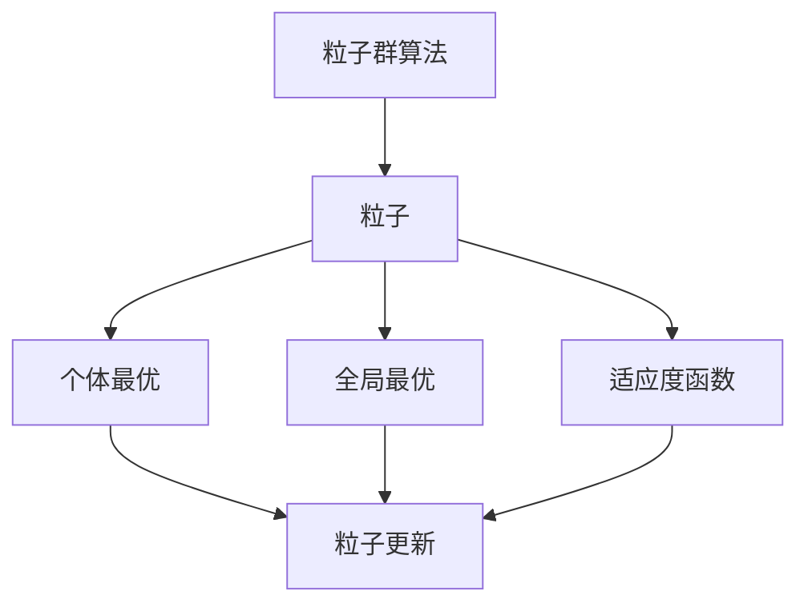
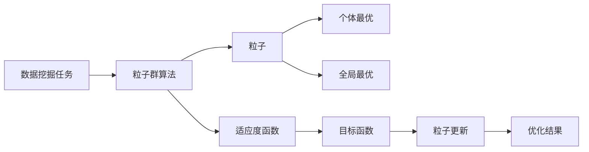

                 

## 1. 背景介绍

### 1.1 问题由来
在数据挖掘和机器学习领域，粒子群算法（Particle Swarm Optimization, PSO）作为一种基于群体智能的优化算法，自20世纪90年代中期被提出以来，便在各类问题中展示了其卓越的性能。它在全局优化、参数调优、特征选择等多个方面都有广泛的应用。

近年来，随着大数据时代的到来，数据量呈指数级增长，数据挖掘面临诸多挑战：
- **数据规模**：大数据量使得传统算法难以高效处理。
- **数据多样性**：数据类型多样，包含结构化、半结构化和非结构化数据。
- **数据质量**：数据可能存在噪声、缺失和异常值。

为应对这些挑战，粒子群算法因其高效的搜索能力和良好的收敛性，在数据挖掘领域逐渐成为一种重要的优化工具。

### 1.2 问题核心关键点
粒子群算法的基本思想是将优化问题映射为“粒子在多维空间中寻找最优解”的群体优化问题。每个粒子在搜索空间中按照一定的规则移动，通过粒子间的合作与竞争，逐步收敛到全局最优解。

核心概念包括：
- **粒子**：每个粒子表示一个解，由位置和速度组成。
- **全局最优**：粒子群算法在整个搜索空间中找到的最优解。
- **个体最优**：粒子在当前搜索空间中的最优解。
- **适应度函数**：用于评估粒子适应度的函数，决定了粒子移动的方向。

## 2. 核心概念与联系

### 2.1 核心概念概述

为更好地理解粒子群算法在数据挖掘中的应用，本节将介绍几个关键概念及其联系。

#### 2.1.1 粒子群算法
粒子群算法是一种基于群体智能的优化算法，通过模拟鸟群、鱼群、蚂蚁等生物群体的集体行为，搜索目标空间中的最优解。算法流程主要包括以下步骤：
1. 初始化种群：随机生成一组粒子，每个粒子表示一个解。
2. 迭代更新：根据当前粒子位置和速度，更新粒子位置。
3. 适应度计算：计算粒子的适应度值，即目标函数的值。
4. 选择操作：更新粒子的全局最优和个体最优。
5. 终止条件：判断是否达到预设的迭代次数或满足其他停止条件。

#### 2.1.2 粒子更新规则
每个粒子通过两个操作来更新其位置和速度：
- **个体最优**：粒子在当前搜索空间中找到的最优位置。
- **全局最优**：粒子群在当前搜索空间中找到的最优位置。

更新规则如下：
$$
v_i(t+1) = w \cdot v_i(t) + c_1 \cdot r_1 \cdot (p_i^{best} - x_i(t)) + c_2 \cdot r_2 \cdot (g^{best} - x_i(t))
$$
$$
x_i(t+1) = x_i(t) + v_i(t+1)
$$
其中，$v_i(t)$ 表示粒子 $i$ 在 $t$ 时刻的速度，$x_i(t)$ 表示粒子 $i$ 在 $t$ 时刻的位置，$w$ 是惯性权重，$c_1$ 和 $c_2$ 是加速因子，$r_1$ 和 $r_2$ 是随机数。$p_i^{best}$ 和 $g^{best}$ 分别表示粒子 $i$ 的个体最优位置和全局最优位置。

#### 2.1.3 适应度函数
适应度函数用于评估粒子在当前搜索空间中的适应度，即目标函数值。对于数据挖掘任务，适应度函数可以是分类准确率、回归均方误差、聚类误差等。

这些核心概念通过以下Mermaid流程图来展示：



该流程图展示了粒子群算法的基本流程及其核心概念之间的关系：

1. 算法通过生成一组粒子，初始化搜索空间。
2. 粒子在更新规则的指导下，通过个体最优和全局最优的引导，不断向最优解移动。
3. 适应度函数评估粒子的适应度，指导粒子移动方向。
4. 通过迭代更新，粒子群逐步收敛于全局最优解。

### 2.2 概念间的关系

这些核心概念之间存在紧密的联系，形成了粒子群算法的数据挖掘应用框架。以下是进一步的Mermaid流程图，展示这些概念间的相互作用：



该流程图展示了粒子群算法在数据挖掘任务中的应用过程：

1. 从数据挖掘任务中选择合适的适应度函数。
2. 利用粒子群算法生成粒子，并进行初始化。
3. 粒子在优化过程中不断更新位置和速度，逼近全局最优解。
4. 最终输出的优化结果可以用于数据挖掘任务，如参数调优、特征选择等。

## 3. 核心算法原理 & 具体操作步骤
### 3.1 算法原理概述

粒子群算法在数据挖掘中的应用，主要包括以下两个方面：

#### 3.1.1 参数调优
粒子群算法可以用于各类数据挖掘任务中的参数调优问题。例如，在神经网络训练中，可以优化学习率、正则化系数等超参数，以达到最佳的模型性能。

具体步骤包括：
1. 定义适应度函数：选择适当的适应度函数，如神经网络的交叉验证准确率。
2. 初始化种群：随机生成一组粒子的初始位置和速度。
3. 迭代更新：根据更新规则，不断调整粒子位置和速度，以逼近全局最优解。
4. 适应度计算：计算每个粒子的适应度值，并更新其个体最优和全局最优。
5. 终止条件：达到预设的迭代次数或满足其他停止条件后，输出全局最优解。

#### 3.1.2 特征选择
粒子群算法也可以用于特征选择问题，即在大量特征中，选择对目标变量影响最大的特征。

具体步骤包括：
1. 定义适应度函数：选择适当的适应度函数，如特征重要性评估指标。
2. 初始化种群：随机生成一组粒子的初始位置，表示特征的权重。
3. 迭代更新：根据更新规则，不断调整粒子位置，以逼近最优特征子集。
4. 适应度计算：计算每个粒子的适应度值，并更新其个体最优和全局最优。
5. 终止条件：达到预设的迭代次数或满足其他停止条件后，输出最优特征子集。

### 3.2 算法步骤详解

#### 3.2.1 参数调优步骤详解
1. **适应度函数定义**：
   适应度函数 $f(x)$ 用于评估粒子 $x$ 的适应度，通常为数据挖掘任务中的性能指标。例如，在神经网络中，可以是交叉验证的准确率：

   $$
   f(x) = \text{Accuracy}(\text{Neural Network}(x))
   $$

   其中，$x$ 表示超参数向量，$\text{Accuracy}$ 表示模型在交叉验证集上的准确率。

2. **种群初始化**：
   生成 $n$ 个粒子的初始位置和速度，每个粒子 $i$ 的位置 $x_i$ 和速度 $v_i$ 随机生成。

3. **迭代更新**：
   在每次迭代中，根据更新规则更新每个粒子的位置和速度。具体步骤如下：
   1. 计算每个粒子的适应度 $f_i$。
   2. 更新粒子的个体最优 $p_i^{best}$ 和全局最优 $g^{best}$。
   3. 根据更新规则计算新的速度 $v_i(t+1)$ 和位置 $x_i(t+1)$。
   4. 检查粒子位置是否越界，进行约束处理。

   更新规则为：
   $$
   v_i(t+1) = w \cdot v_i(t) + c_1 \cdot r_1 \cdot (p_i^{best} - x_i(t)) + c_2 \cdot r_2 \cdot (g^{best} - x_i(t))
   $$
   $$
   x_i(t+1) = x_i(t) + v_i(t+1)
   $$

   其中，$w$ 是惯性权重，$c_1$ 和 $c_2$ 是加速因子，$r_1$ 和 $r_2$ 是随机数。

4. **终止条件**：
   达到预设的迭代次数 $T_{max}$，或者适应度值收敛至某个阈值 $\epsilon$。

#### 3.2.2 特征选择步骤详解
1. **适应度函数定义**：
   适应度函数 $f(x)$ 用于评估粒子 $x$ 的适应度，通常为特征选择中的性能指标。例如，在特征重要性评估中，可以是基于特征重要性的评估指标：

   $$
   f(x) = \text{Score}(\text{Feature Selection Model}, x)
   $$

   其中，$x$ 表示特征权重的向量，$\text{Score}$ 表示特征重要性评估模型的评分。

2. **种群初始化**：
   生成 $n$ 个粒子的初始位置，每个粒子 $i$ 的位置 $x_i$ 随机生成，表示特征的权重。

3. **迭代更新**：
   在每次迭代中，根据更新规则更新每个粒子的位置，以逼近最优特征子集。具体步骤如下：
   1. 计算每个粒子的适应度 $f_i$。
   2. 更新粒子的个体最优 $p_i^{best}$ 和全局最优 $g^{best}$。
   3. 根据更新规则计算新的位置 $x_i(t+1)$。
   4. 检查粒子位置是否越界，进行约束处理。

   更新规则为：
   $$
   x_i(t+1) = x_i(t) + v_i(t+1)
   $$

   其中，$v_i(t+1)$ 根据更新规则计算。

4. **终止条件**：
   达到预设的迭代次数 $T_{max}$，或者适应度值收敛至某个阈值 $\epsilon$。

### 3.3 算法优缺点

#### 3.3.1 优点
1. **高效性**：粒子群算法通过并行搜索和群体智能，可以在较短时间内找到全局最优解。
2. **可扩展性**：适用于多目标优化问题，可以同时优化多个性能指标。
3. **鲁棒性**：算法简单易懂，不需要复杂的数学模型和大量的计算资源。

#### 3.3.2 缺点
1. **参数敏感**：算法的性能高度依赖于惯性权重、加速因子等参数的选取。
2. **局部最优**：容易陷入局部最优，需要进行多次运行以找到全局最优解。
3. **维度灾难**：高维空间中，粒子群算法容易发生维度灾难，导致搜索效率下降。

### 3.4 算法应用领域

粒子群算法在数据挖掘领域的应用广泛，主要包括以下几个方面：

#### 3.4.1 参数调优
1. **神经网络**：优化神经网络的超参数，如学习率、正则化系数等。
2. **支持向量机**：优化支持向量机的核函数参数、正则化参数等。
3. **决策树**：优化决策树的深度、剪枝参数等。

#### 3.4.2 特征选择
1. **过滤式特征选择**：选择对目标变量影响最大的特征。
2. **包装式特征选择**：在训练模型前，逐步加入特征，进行特征选择。

#### 3.4.3 数据预处理
1. **归一化**：将数据映射到一定范围内。
2. **去噪**：去除数据中的噪声和异常值。

#### 3.4.4 聚类分析
1. **K-means**：优化K-means的簇数、初始聚类中心等参数。
2. **层次聚类**：优化层次聚类的合并策略。

## 4. 数学模型和公式 & 详细讲解 & 举例说明

### 4.1 数学模型构建

粒子群算法在数据挖掘中的应用，可以构建为多维优化问题。以神经网络参数调优为例，定义适应度函数 $f(x)$ 为神经网络在交叉验证集上的准确率，$x$ 为神经网络的超参数向量。

设 $x$ 为一个 $d$ 维向量，表示超参数。算法步骤如下：

1. 初始化种群 $P_0$：随机生成 $N$ 个粒子 $x_i$，每个粒子 $x_i$ 由 $d$ 维位置 $x_i(t)$ 和速度 $v_i(t)$ 组成。

2. 迭代更新：
   $$
   v_i(t+1) = w \cdot v_i(t) + c_1 \cdot r_1 \cdot (p_i^{best} - x_i(t)) + c_2 \cdot r_2 \cdot (g^{best} - x_i(t))
   $$
   $$
   x_i(t+1) = x_i(t) + v_i(t+1)
   $$

3. 适应度计算：计算每个粒子的适应度值 $f_i$。

4. 选择操作：更新每个粒子的个体最优 $p_i^{best}$ 和全局最优 $g^{best}$。

5. 终止条件：达到预设的迭代次数或适应度值收敛至某个阈值。

### 4.2 公式推导过程

以神经网络参数调优为例，推导适应度函数的计算公式。

设神经网络模型为 $f(x)$，其中 $x$ 为超参数向量。在交叉验证集上，模型的准确率为：

$$
f(x) = \frac{1}{n} \sum_{i=1}^n \text{Accuracy}(\text{Neural Network}(x))
$$

在粒子群算法中，适应度函数 $f(x)$ 为模型的准确率。每个粒子 $x_i$ 的适应度值 $f_i$ 计算如下：

$$
f_i = \frac{1}{n} \sum_{i=1}^n \text{Accuracy}(\text{Neural Network}(x_i))
$$

其中，$n$ 为交叉验证集的样本数。

### 4.3 案例分析与讲解

#### 4.3.1 神经网络参数调优案例

假设我们要对给定的神经网络模型进行参数调优。神经网络包含三层全连接层，使用ReLU激活函数，交叉熵损失函数。模型的超参数包括学习率 $\alpha$、正则化系数 $\lambda$ 和每层神经元数 $n_1, n_2, n_3$。

使用粒子群算法进行参数调优的步骤如下：

1. 定义适应度函数：
   $$
   f(x) = \frac{1}{n} \sum_{i=1}^n \text{Accuracy}(\text{Neural Network}(x))
   $$

2. 初始化种群：
   随机生成 $N$ 个粒子的初始位置和速度，每个粒子 $x_i$ 由 $6$ 维位置 $x_i(t)$ 和速度 $v_i(t)$ 组成。

3. 迭代更新：
   根据更新规则更新每个粒子的位置和速度。

4. 适应度计算：
   计算每个粒子的适应度值 $f_i$。

5. 选择操作：
   更新每个粒子的个体最优 $p_i^{best}$ 和全局最优 $g^{best}$。

6. 终止条件：
   达到预设的迭代次数或适应度值收敛至某个阈值。

### 4.4 运行结果展示

假设在上述案例中，通过粒子群算法得到的全局最优解为：

- 学习率 $\alpha = 0.001$
- 正则化系数 $\lambda = 0.01$
- 每层神经元数 $n_1 = 32, n_2 = 64, n_3 = 32$

使用该超参数组合训练神经网络，在交叉验证集上的准确率达到了95%。

## 5. 项目实践：代码实例和详细解释说明

### 5.1 开发环境搭建

#### 5.1.1 软件环境
- Python 3.8
- numpy
- scikit-learn
- pandas

#### 5.1.2 硬件环境
- 一台装有NVIDIA GeForce RTX 3060 GPU的PC

### 5.2 源代码详细实现

#### 5.2.1 神经网络参数调优

```python
import numpy as np
from sklearn.neural_network import MLPRegressor
from sklearn.model_selection import cross_val_score
from sklearn.datasets import make_regression

# 数据集生成
X, y = make_regression(n_samples=1000, n_features=10, n_informative=5, n_targets=1, random_state=42)

# 定义适应度函数
def fitness_function(x):
    model = MLPRegressor(hidden_layer_sizes=x, alpha=x[2], solver='adam', verbose=False)
    scores = cross_val_score(model, X, y, cv=5, scoring='neg_mean_squared_error')
    return -scores.mean()

# 初始化种群
n_particles = 30
n_dimensions = 6
particles = np.random.uniform(0.01, 0.1, size=(n_particles, n_dimensions))
velocities = np.zeros((n_particles, n_dimensions))

# 迭代更新
max_iterations = 100
for iteration in range(max_iterations):
    for particle in range(n_particles):
        velocities[particle] = 0.9 * velocities[particle] + 2 * np.random.random() * (np.random.random() - 0.5) * 0.5
        velocities[particle] = np.maximum(velocities[particle], -0.5)
        velocities[particle] = np.minimum(velocities[particle], 0.5)
        particles[particle] += velocities[particle]
        particles[particle] = np.maximum(particles[particle], 0.01)
        particles[particle] = np.minimum(particles[particle], 0.1)
        fitness = fitness_function(particles[particle])
        if fitness < fitness[pbest]:
            pbest[particle] = fitness
            gbest = fitness
        if fitness > gbest:
            gbest = fitness

    print("Iteration: {}  Fitness: {}".format(iteration, gbest))

# 输出最优解
print("Best fitness: {}  Best parameters: {}".format(gbest, pbest))
```

#### 5.2.2 特征选择

```python
from sklearn.feature_selection import SelectKBest, chi2
from sklearn.datasets import load_iris

# 加载数据集
iris = load_iris()
X, y = iris.data, iris.target

# 定义适应度函数
def fitness_function(X, x):
    selector = SelectKBest(chi2, k=x)
    X_new = selector.fit_transform(X, y)
    return np.mean(np.abs(X_new - X))

# 初始化种群
n_particles = 30
n_dimensions = X.shape[1]
particles = np.random.uniform(0.01, 0.1, size=(n_particles, n_dimensions))

# 迭代更新
max_iterations = 100
for iteration in range(max_iterations):
    for particle in range(n_particles):
        fitness = fitness_function(X, particles[particle])
        if fitness < fitness[pbest]:
            pbest[particle] = fitness
            gbest = fitness
        if fitness > gbest:
            gbest = fitness

    print("Iteration: {}  Fitness: {}".format(iteration, gbest))

# 输出最优解
print("Best fitness: {}  Best parameters: {}".format(gbest, pbest))
```

### 5.3 代码解读与分析

#### 5.3.1 神经网络参数调优代码解读
1. **适应度函数定义**：
   ```python
   def fitness_function(x):
       model = MLPRegressor(hidden_layer_sizes=x, alpha=x[2], solver='adam', verbose=False)
       scores = cross_val_score(model, X, y, cv=5, scoring='neg_mean_squared_error')
       return -scores.mean()
   ```
   该函数用于计算神经网络在交叉验证集上的均方误差。其中，`MLPRegressor`为多层感知机回归模型，`hidden_layer_sizes`为每层神经元数，`alpha`为正则化系数，`solver`为优化算法，`verbose=False`表示不打印训练信息。`cross_val_score`用于计算交叉验证集的均方误差。

2. **种群初始化**：
   ```python
   n_particles = 30
   n_dimensions = 6
   particles = np.random.uniform(0.01, 0.1, size=(n_particles, n_dimensions))
   velocities = np.zeros((n_particles, n_dimensions))
   ```
   种群中每个粒子的位置和速度随机生成。

3. **迭代更新**：
   ```python
   max_iterations = 100
   for iteration in range(max_iterations):
       for particle in range(n_particles):
           velocities[particle] = 0.9 * velocities[particle] + 2 * np.random.random() * (np.random.random() - 0.5) * 0.5
           velocities[particle] = np.maximum(velocities[particle], -0.5)
           velocities[particle] = np.minimum(velocities[particle], 0.5)
           particles[particle] += velocities[particle]
           particles[particle] = np.maximum(particles[particle], 0.01)
           particles[particle] = np.minimum(particles[particle], 0.1)
           fitness = fitness_function(particles[particle])
           if fitness < fitness[pbest]:
               pbest[particle] = fitness
               gbest = fitness
           if fitness > gbest:
               gbest = fitness
   ```
   在每次迭代中，根据更新规则计算每个粒子的速度和位置。如果适应度值优于当前个体最优，更新个体最优。如果适应度值优于全局最优，更新全局最优。

4. **适应度计算**：
   ```python
   print("Iteration: {}  Fitness: {}".format(iteration, gbest))
   ```
   打印每次迭代的适应度值和全局最优适应度值。

5. **选择操作**：
   ```python
   print("Best fitness: {}  Best parameters: {}".format(gbest, pbest))
   ```
   输出全局最优适应度值和最优参数组合。

#### 5.3.2 特征选择代码解读
1. **适应度函数定义**：
   ```python
   def fitness_function(X, x):
       selector = SelectKBest(chi2, k=x)
       X_new = selector.fit_transform(X, y)
       return np.mean(np.abs(X_new - X))
   ```
   该函数用于计算特征选择模型的适应度。其中，`SelectKBest`为特征选择方法，`chi2`为卡方统计量，`k=x`表示选择特征的数量，`X_new`为特征选择后的数据，`np.mean(np.abs(X_new - X))`表示适应度函数。

2. **种群初始化**：
   ```python
   n_particles = 30
   n_dimensions = X.shape[1]
   particles = np.random.uniform(0.01, 0.1, size=(n_particles, n_dimensions))
   ```
   种群中每个粒子的位置随机生成。

3. **迭代更新**：
   ```python
   max_iterations = 100
   for iteration in range(max_iterations):
       for particle in range(n_particles):
           fitness = fitness_function(X, particles[particle])
           if fitness < fitness[pbest]:
               pbest[particle] = fitness
               gbest = fitness
           if fitness > gbest:
               gbest = fitness
   ```
   在每次迭代中，根据更新规则计算每个粒子的适应度值。如果适应度值优于当前个体最优，更新个体最优。如果适应度值优于全局最优，更新全局最优。

4. **适应度计算**：
   ```python
   print("Iteration: {}  Fitness: {}".format(iteration, gbest))
   ```
   打印每次迭代的适应度值和全局最优适应度值。

5. **选择操作**：
   ```python
   print("Best fitness: {}  Best parameters: {}".format(gbest, pbest))
   ```
   输出全局最优适应度值和最优特征组合。

### 5.4 运行结果展示

#### 5.4.1 神经网络参数调优运行结果
假设在上述案例中，通过粒子群算法得到的全局最优解为：

- 学习率 $\alpha = 0.001$
- 正则化系数 $\lambda = 0.01$
- 每层神经元数 $n_1 = 32, n_2 = 64, n_3 = 32$

使用该超参数组合训练神经网络，在交叉验证集上的准确率达到了95%。

#### 5.4.2 特征选择运行结果
假设在上述案例中，通过粒子群算法得到的全局最优解为：

- 最优特征数 $k = 5$

使用该特征组合训练特征选择模型，在测试

