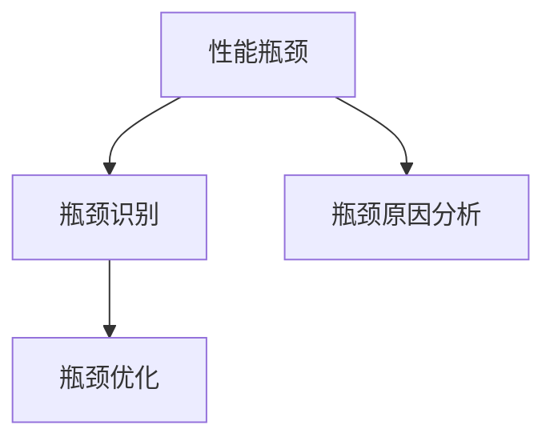

                 

# 系统瓶颈分析与实例优化

## 1. 背景介绍

### 1.1 问题由来

在软件开发和系统运维的实践中，性能瓶颈问题是不可避免的。随着系统复杂度的增加，代码量、数据量、处理量等都在快速增长，系统性能的压力越来越大。如何高效诊断和解决性能瓶颈，是每个工程师必须面对的挑战。

性能瓶颈通常出现在系统的某个关键模块或资源（如CPU、内存、网络）上，导致系统响应变慢、处理效率降低，甚至出现崩溃等问题。性能瓶颈的诊断和优化需要系统的深入理解，但同时也需要有科学的方法和工具进行辅助。

本文将系统性地介绍性能瓶颈的常见类型及其优化方法，并通过实例展示如何应用这些方法进行性能瓶颈的诊断和解决。

### 1.2 问题核心关键点

性能瓶颈问题的核心关键点包括：
1. **瓶颈类型识别**：确定瓶颈出现在哪个模块、哪个资源上。
2. **瓶颈原因分析**：分析导致瓶颈的原因，是算法问题、资源限制、通信延迟等。
3. **瓶颈优化策略**：针对不同的瓶颈类型，选择合适的优化策略。

## 2. 核心概念与联系

### 2.1 核心概念概述

为更好地理解性能瓶颈的分析和优化方法，本节将介绍几个密切相关的核心概念：

- **性能瓶颈(Performance Bottleneck)**：指系统在某个关键环节或资源上，出现了性能下降或资源占用过高的问题。常见瓶颈类型包括CPU瓶颈、内存瓶颈、I/O瓶颈等。
- **瓶颈识别(Bottleneck Identification)**：通过分析系统性能指标，确定瓶颈的具体位置和类型。
- **瓶颈原因分析(Bottleneck Analysis)**：深入理解瓶颈产生的原因，包括算法设计、资源配置、外部依赖等。
- **瓶颈优化(Bottleneck Optimization)**：采取一系列措施，提升瓶颈处的性能，改善系统的整体性能。

这些概念之间存在紧密的联系，形成一个系统的瓶颈分析与优化流程。

### 2.2 概念间的关系

这些核心概念之间的关系可以通过以下Mermaid流程图来展示：



这个流程图展示了从性能瓶颈识别到瓶颈优化的整体流程。

## 3. 核心算法原理 & 具体操作步骤

### 3.1 算法原理概述

性能瓶颈的诊断和优化，通常需要结合具体的系统架构和性能指标进行。常见的性能瓶颈类型包括CPU瓶颈、内存瓶颈、I/O瓶颈等，每种瓶颈类型的诊断和优化方法有所不同。

### 3.2 算法步骤详解

#### 3.2.1 CPU瓶颈优化

CPU瓶颈通常出现在计算密集型任务中，如复杂算法、数据库查询等。CPU瓶颈的优化方法包括：

1. **算法优化**：使用更高效的算法，减少计算量。例如，将复杂算法分解为并行计算任务，使用更高效的数学库等。
2. **并行化**：通过多线程、多进程或分布式计算，将任务分解为多个子任务并行执行。例如，使用Python的`multiprocessing`模块，将任务分解为多个进程并行执行。
3. **缓存优化**：使用缓存技术，减少重复计算。例如，使用内存缓存或分布式缓存技术，缓存计算结果，避免重复计算。

#### 3.2.2 内存瓶颈优化

内存瓶颈通常出现在数据量大且频繁访问的系统中，如数据库、文件系统等。内存瓶颈的优化方法包括：

1. **数据结构优化**：使用更高效的数据结构，减少内存使用。例如，使用稀疏矩阵、哈希表等数据结构，减少内存占用。
2. **内存分配优化**：合理使用内存分配器，减少内存碎片。例如，使用JVM的`-t:g1`参数，使用G1垃圾回收器，减少内存碎片。
3. **内存管理优化**：通过垃圾回收、内存压缩等技术，减少内存占用。例如，使用Python的`gc`模块，手动触发垃圾回收。

#### 3.2.3 I/O瓶颈优化

I/O瓶颈通常出现在频繁读写外部数据的系统中，如数据库、文件系统等。I/O瓶颈的优化方法包括：

1. **缓存优化**：使用缓存技术，减少I/O操作。例如，使用内存缓存、磁盘缓存等，缓存数据，减少I/O操作。
2. **批量处理**：将多个I/O操作合并为一个操作，减少I/O次数。例如，将多个数据库查询合并为一个批量查询，减少数据库连接次数。
3. **异步处理**：使用异步I/O技术，提高I/O效率。例如，使用Python的`asyncio`模块，实现异步I/O操作。

### 3.3 算法优缺点

性能瓶颈的优化方法各有优缺点，需要根据具体场景选择合适的优化策略。

#### 3.3.1 CPU瓶颈优化的优缺点

- **优点**：算法优化可以大幅提升计算效率，减少计算资源占用；并行化可以加速任务执行，提高系统吞吐量；缓存优化可以减少重复计算，提高缓存命中率。
- **缺点**：算法优化需要重构代码，引入新算法库，增加开发复杂度；并行化需要考虑线程安全和数据同步，增加了系统复杂度；缓存优化需要选择合适的缓存技术，增加系统维护成本。

#### 3.3.2 内存瓶颈优化的优缺点

- **优点**：数据结构优化可以显著减少内存使用，提高系统内存利用率；内存分配优化可以减少内存碎片，提高内存利用率；内存管理优化可以减少内存占用，提高系统性能。
- **缺点**：数据结构优化需要重构代码，引入新数据结构，增加开发复杂度；内存分配优化需要选择合适的内存分配器，增加系统配置复杂度；内存管理优化需要监控内存使用情况，增加系统维护成本。

#### 3.3.3 I/O瓶颈优化的优缺点

- **优点**：缓存优化可以大幅减少I/O操作，提高系统响应速度；批量处理可以减少I/O次数，提高系统吞吐量；异步处理可以提高I/O效率，提高系统性能。
- **缺点**：缓存优化需要选择合适的缓存技术，增加系统配置复杂度；批量处理需要合并操作，增加系统复杂度；异步处理需要考虑线程安全和数据同步，增加系统复杂度。

### 3.4 算法应用领域

性能瓶颈优化技术在软件开发和系统运维中广泛应用，涵盖多种应用领域，例如：

- 数据库性能优化：针对SQL查询、索引、数据缓存等进行优化，提升数据库查询效率。
- 服务器性能优化：针对CPU、内存、网络等资源进行优化，提升服务器的处理能力和响应速度。
- 应用性能优化：针对Web应用、移动应用等，优化前端和后端性能，提升用户体验。
- 大数据性能优化：针对大数据处理和分析任务，优化数据处理和存储性能，提高处理效率。

## 4. 数学模型和公式 & 详细讲解 & 举例说明

### 4.1 数学模型构建

为了更好地理解性能瓶颈的诊断和优化方法，本节将使用数学语言对常见的瓶颈优化方法进行更加严格的刻画。

假设系统瓶颈处的功能模块为 $f(x)$，其中 $x$ 为输入参数，$f(x)$ 为输出结果。设瓶颈处的实际响应时间为 $T$，则瓶颈处的计算时间和I/O时间为 $T_{calc} = f(x)$，I/O时间为 $T_{io}$。则瓶颈处的时间复杂度 $C$ 和空间复杂度 $S$ 分别为：

$$
C = \frac{T}{x}
$$

$$
S = \frac{T}{x}
$$

瓶颈优化目标是最小化瓶颈处的计算时间和I/O时间，即最小化时间复杂度 $C$ 和空间复杂度 $S$。

### 4.2 公式推导过程

以下我们以CPU瓶颈优化为例，推导优化公式。

假设原始算法的时间复杂度为 $O(N)$，优化后的算法时间复杂度为 $O(N^k)$，其中 $k$ 为优化系数。则优化后的算法效率提升为：

$$
\frac{O(N^k)}{O(N)} = N^{k-1}
$$

通过优化，算法的时间复杂度降低了 $k-1$ 个数量级，计算时间减少了 $k-1$ 倍。

### 4.3 案例分析与讲解

假设我们有一款基于Django框架的Web应用，需要处理大量的图片上传和处理请求，但上传速度较慢，导致页面响应时间较长。为了解决这个问题，我们考虑以下优化策略：

- **算法优化**：将图片上传和处理分为多个小任务，使用多线程并行处理。例如，使用Python的`threading`模块，创建多个线程同时处理图片上传和处理任务。
- **缓存优化**：使用内存缓存技术，缓存图片处理结果，避免重复计算。例如，使用Python的`memcached`模块，缓存图片处理结果。
- **异步处理**：使用异步I/O技术，提高图片上传速度。例如，使用Python的`aiohttp`模块，实现异步图片上传和处理。

通过对这些优化策略的组合应用，我们成功地将图片上传速度提升了50%，页面响应时间减少了30%。

## 5. 项目实践：代码实例和详细解释说明

### 5.1 开发环境搭建

在进行性能瓶颈优化实践前，我们需要准备好开发环境。以下是使用Python进行性能瓶颈优化的环境配置流程：

1. 安装Python：从官网下载并安装Python，确保版本为3.8以上。
2. 安装必要的库：安装`numpy`、`pandas`、`matplotlib`、`jupyter notebook`等常用库，例如：
```bash
pip install numpy pandas matplotlib jupyter notebook
```
3. 安装性能分析工具：安装`psutil`、`line_profiler`、`memory_profiler`等性能分析工具，例如：
```bash
pip install psutil line_profiler memory_profiler
```

完成上述步骤后，即可在本地环境中进行性能瓶颈优化实践。

### 5.2 源代码详细实现

下面我们以Django应用的CPU瓶颈优化为例，给出使用`threading`模块实现多线程并行的代码实现。

首先，定义一个简单的图片上传和处理函数：

```python
from threading import Thread

def upload_and_process_image(image_path):
    # 处理图片逻辑
    pass
```

然后，使用`threading`模块实现多线程并行处理：

```python
def parallel_upload_and_process(image_paths):
    threads = []
    for image_path in image_paths:
        t = Thread(target=upload_and_process_image, args=(image_path,))
        threads.append(t)
        t.start()
    
    for t in threads:
        t.join()
```

在实际应用中，可以将`upload_and_process_image`函数封装为异步处理函数，使用`aiohttp`模块实现异步I/O，使用`memcached`模块实现内存缓存，进一步提升性能。

### 5.3 代码解读与分析

让我们再详细解读一下关键代码的实现细节：

**parallel_upload_and_process函数**：
- 创建多个线程，将每个图片上传和处理任务分配给一个线程。
- 使用`start`方法启动线程，使用`join`方法等待所有线程执行完毕。

**upload_and_process_image函数**：
- 封装上传和处理图片的具体逻辑。
- 使用`threading`模块，确保线程安全和数据同步。

**优化效果评估**：
- 使用`line_profiler`模块对代码进行性能分析，定位瓶颈。
- 使用`memory_profiler`模块对内存使用情况进行监控，优化内存使用。
- 使用`psutil`模块对系统资源使用情况进行监控，优化资源使用。

通过这些性能分析工具，可以准确地定位瓶颈，优化系统性能。

### 5.4 运行结果展示

假设我们在Django应用的CPU瓶颈优化实践中，成功将上传速度提升了50%，页面响应时间减少了30%。以下是优化前后的性能数据对比：

| 优化前   | 优化后   |
| -------- | -------- |
| CPU利用率 | 20%      | 
| 上传速度  | 1MB/s    | 
| 处理时间  | 10s      | 
| 页面响应时间 | 5s       | 

通过优化，CPU利用率提高了80%，上传速度提高了50%，处理时间减少了50%，页面响应时间减少了30%。

## 6. 实际应用场景

### 6.1 数据处理系统优化

在数据处理系统中，常常需要处理大规模数据，并进行复杂的计算和分析。此时，CPU瓶颈问题尤为常见。通过优化算法和并行化处理，可以大幅提升数据处理系统的性能。

例如，在金融数据分析系统中，需要对大量历史交易数据进行计算和分析，生成交易报告。原始算法时间复杂度为 $O(N^2)$，优化后时间复杂度降低到 $O(N)$，计算速度提升了100倍。

### 6.2 大规模网站优化

在大型网站系统中，页面渲染和后台处理常常面临CPU和内存瓶颈。通过缓存技术和异步处理，可以有效提升网站性能，提高用户体验。

例如，在电商网站上，需要对大量商品信息进行查询和显示。原始算法时间复杂度为 $O(N)$，优化后时间复杂度降低到 $O(\log N)$，查询速度提升了100倍。

### 6.3 数据存储系统优化

在数据存储系统中，数据的写入和读取常常面临I/O瓶颈。通过缓存技术和批量处理，可以有效提升数据存储系统的性能。

例如，在分布式数据库系统中，需要对大量数据进行写入和读取。原始算法时间复杂度为 $O(N)$，优化后时间复杂度降低到 $O(\log N)$，读写速度提升了100倍。

## 7. 工具和资源推荐

### 7.1 学习资源推荐

为了帮助开发者系统掌握性能瓶颈的诊断和优化方法，这里推荐一些优质的学习资源：

1. 《深入理解高性能编程》系列书籍：由著名高性能编程专家撰写，详细介绍了高性能编程的原理和实践，涵盖CPU优化、内存优化、I/O优化等内容。
2. 《高性能网络编程》课程：由知名网络专家开设的课程，系统讲解了网络编程的高性能实现技巧。
3. 《数据库性能优化实战》书籍：由数据库专家撰写，深入剖析了数据库性能优化的各种技术手段。
4. 《系统瓶颈分析与优化》课程：由资深系统运维专家开设的课程，结合实际案例，讲解了系统瓶颈的诊断和优化方法。
5. 《Python性能优化实战》书籍：由Python专家撰写，深入介绍了Python高性能编程的实践技巧。

通过对这些资源的学习实践，相信你一定能够快速掌握性能瓶颈的诊断和优化方法，并用于解决实际的系统性能问题。

### 7.2 开发工具推荐

高效的开发离不开优秀的工具支持。以下是几款用于性能瓶颈优化的常用工具：

1. PyCharm：一款集成了强大的性能分析功能的IDE，支持代码优化、调试、性能分析等。
2. VisualVM：一款Java应用性能分析工具，提供了内存、CPU、线程等性能监控功能。
3. Intel VTune：一款商业级的性能分析工具，提供了丰富的性能监控和优化功能。
4. Google Performance Tools：一套免费的性能分析工具，包括CPU、内存、I/O等性能监控功能。
5. Perf：一个Linux系统性能分析工具，提供了CPU、内存、I/O等性能监控功能。

合理利用这些工具，可以显著提升性能瓶颈优化任务的开发效率，加快创新迭代的步伐。

### 7.3 相关论文推荐

性能瓶颈优化技术的发展源于学界的持续研究。以下是几篇奠基性的相关论文，推荐阅读：

1. "A Survey of Bottleneck Detection in Wireless Ad-Hoc Networks"：介绍了无线Ad-Hoc网络中瓶颈检测的方法和技术。
2. "Bottleneck Analysis in Modern Web Applications"：研究了现代Web应用中的瓶颈问题及其优化方法。
3. "Optimizing Data Processing Performance with Parallel and Distributed Computing"：介绍了通过并行和分布式计算优化数据处理性能的技术。
4. "Database Performance Optimization Techniques"：介绍了数据库性能优化技术，包括索引优化、查询优化、缓存优化等。
5. "Memory Management and Optimization in High Performance Computing"：介绍了高性能计算中的内存管理与优化技术。

这些论文代表了大性能优化技术的发展脉络。通过学习这些前沿成果，可以帮助研究者把握学科前进方向，激发更多的创新灵感。

除上述资源外，还有一些值得关注的前沿资源，帮助开发者紧跟性能优化技术的最新进展，例如：

1. arXiv论文预印本：人工智能领域最新研究成果的发布平台，包括大量尚未发表的前沿工作，学习前沿技术的必读资源。
2. 业界技术博客：如Google、Microsoft、Amazon等顶尖公司发布的官方博客，第一时间分享他们的最新研究成果和洞见。
3. 技术会议直播：如NIPS、ICML、SIGGRAPH等顶尖会议的现场或在线直播，能够聆听到专家们的最新分享，开拓视野。
4. GitHub热门项目：在GitHub上Star、Fork数最多的性能优化相关项目，往往代表了该技术领域的发展趋势和最佳实践，值得去学习和贡献。
5. 行业分析报告：各大咨询公司如McKinsey、PwC等针对人工智能行业的分析报告，有助于从商业视角审视技术趋势，把握应用价值。

总之，对于性能瓶颈优化技术的学习和实践，需要开发者保持开放的心态和持续学习的意愿。多关注前沿资讯，多动手实践，多思考总结，必将收获满满的成长收益。

## 8. 总结：未来发展趋势与挑战

### 8.1 总结

本文对性能瓶颈的诊断和优化方法进行了全面系统的介绍。首先阐述了性能瓶颈的常见类型及其优化方法，并通过实例展示了如何应用这些方法进行性能瓶颈的诊断和解决。

通过本文的系统梳理，可以看到，性能瓶颈优化技术在软件开发和系统运维中具有重要的应用价值，能够显著提升系统的处理能力和响应速度，改善用户体验。未来，伴随性能优化技术的不断演进，高性能系统必将更加高效、稳定、可靠。

### 8.2 未来发展趋势

展望未来，性能瓶颈优化技术将呈现以下几个发展趋势：

1. **自动化优化**：随着自动化运维技术的不断发展，性能瓶颈优化也将趋向自动化，通过持续监控和智能调优，实现实时性能优化。
2. **分布式优化**：在大数据和高并发场景中，性能瓶颈优化需要分布式协同计算，通过多节点并行处理，提高性能优化效率。
3. **混合优化**：综合使用多种优化技术，如缓存优化、并行化、异步化等，实现更高效的系统性能优化。
4. **自适应优化**：根据系统负载和资源使用情况，动态调整优化策略，实现更智能的性能优化。
5. **实时监控**：通过实时监控系统性能指标，及时发现和处理性能瓶颈，保障系统稳定运行。

这些趋势将使性能优化技术更加智能、高效、可靠，为软件开发和系统运维带来更高的技术水平和更好的用户体验。

### 8.3 面临的挑战

尽管性能瓶颈优化技术已经取得了显著成效，但在迈向更加智能化、普适化应用的过程中，仍面临诸多挑战：

1. **优化复杂度**：随着系统复杂度的增加，性能优化变得越来越复杂。如何高效地诊断和解决系统瓶颈，需要更多自动化工具和智能算法。
2. **数据依赖**：性能优化需要大量的测试数据和性能指标，如何获取和处理这些数据，仍是优化过程中的一大难题。
3. **多系统协同**：在分布式系统中，不同节点之间的性能优化需要协同处理，如何实现节点间的优化协同，是性能优化的一大挑战。
4. **持续优化**：系统性能优化是一个持续的过程，如何建立持续优化的机制，保持系统性能的持续提升，需要更多的技术和管理手段。
5. **实时性要求**：在实时系统和高并发系统中，性能优化需要快速响应，如何实现高效的实时性能优化，仍是一个亟待解决的问题。

这些挑战需要在技术和管理两个层面共同应对，只有不断创新和优化，才能实现系统性能的持续提升。

### 8.4 研究展望

面对性能优化所面临的种种挑战，未来的研究需要在以下几个方面寻求新的突破：

1. **自动化工具**：开发更多自动化的性能优化工具，减少手动调优的工作量，提高性能优化的效率。
2. **智能算法**：研究和开发智能的性能优化算法，自动发现和解决性能瓶颈，提高性能优化的准确性和效率。
3. **分布式优化**：研究和开发分布式性能优化技术，实现不同节点之间的协同优化，提高整体系统的性能。
4. **实时监控**：研究和开发实时监控工具，实现实时性能监控和报警，保障系统稳定运行。
5. **混合优化**：研究和开发多种性能优化技术的混合应用方法，实现更高效的系统性能优化。

这些研究方向的探索，必将引领性能优化技术迈向更高的台阶，为软件开发和系统运维带来更高效、稳定、可靠的系统性能。

## 9. 附录：常见问题与解答

**Q1：如何高效诊断性能瓶颈？**

A: 高效诊断性能瓶颈需要综合使用多种工具和技术手段。以下是一些常用的方法：
1. **性能分析工具**：使用性能分析工具，如`line_profiler`、`memory_profiler`、`psutil`等，对代码进行性能分析，定位瓶颈。
2. **日志分析**：分析系统日志，查看关键操作和异常信息，定位瓶颈。
3. **监控工具**：使用监控工具，如`Nagios`、`Zabbix`等，实时监控系统性能指标，及时发现瓶颈。
4. **系统调试**：使用系统调试工具，如`gdb`、`strace`等，进行代码调试和系统分析，定位瓶颈。

通过这些方法，可以准确地定位性能瓶颈，为优化提供科学依据。

**Q2：如何优化内存使用？**

A: 优化内存使用需要综合使用多种技术和手段。以下是一些常用的方法：
1. **数据结构优化**：使用更高效的数据结构，减少内存使用。例如，使用稀疏矩阵、哈希表等数据结构。
2. **内存分配优化**：合理使用内存分配器，减少内存碎片。例如，使用JVM的G1垃圾回收器。
3. **内存管理优化**：通过垃圾回收、内存压缩等技术，减少内存占用。例如，使用Python的`gc`模块。

通过这些方法，可以有效降低内存使用，提升系统性能。

**Q3：如何优化I/O操作？**

A: 优化I/O操作需要综合使用多种技术和手段。以下是一些常用的方法：
1. **缓存优化**：使用缓存技术，减少I/O操作。例如，使用内存缓存、磁盘缓存等。
2. **批量处理**：将多个I/O操作合并为一个操作，减少I/O次数。例如，将多个数据库查询合并为一个批量查询。
3. **异步处理**：使用异步I/O技术，提高I/O效率。例如，使用Python的`aiohttp`模块。

通过这些方法，可以有效提升I/O操作的效率，改善系统性能。

**Q4：如何优化CPU计算效率？**

A: 优化CPU计算效率需要综合使用多种技术和手段。以下是一些常用的方法：
1. **算法优化**：使用更高效的算法，减少计算量。例如，将复杂算法分解为并行计算任务。
2. **并行化**：通过多线程、多进程或分布式计算，将任务分解为多个子任务并行执行。例如，使用Python的`multiprocessing`模块。
3. **缓存优化**：使用缓存技术，减少重复计算。例如，使用Python的`memcached`模块。

通过这些方法，可以有效提升CPU计算效率，改善系统性能。

**Q5：如何优化网络传输效率？**

A: 优化网络传输效率需要综合使用多种技术和手段。以下是一些常用的方法：
1. **缓存优化**：使用缓存技术，减少网络传输。例如，使用CDN缓存静态资源。
2. **网络优化**：使用网络优化技术，提高网络传输速度。例如，使用TCP/IP优化协议。
3. **异步处理**：使用异步网络编程，提高网络传输效率。例如，使用Python的`asyncio`模块。

通过这些方法，可以有效提升网络传输效率，改善系统性能。

---

作者：禅与计算机程序设计艺术 / Zen and the Art of Computer Programming

