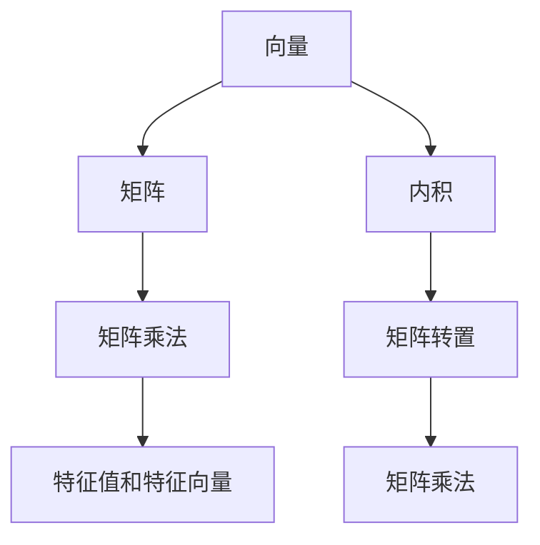

                 

# 线性代数导引：实数及其序

> 关键词：线性代数, 实数域, 序结构, 数学基础

## 1. 背景介绍

线性代数是数学中最为基础也是最为重要的分支之一，它不仅在科学研究和工程技术中广泛应用，也是数据科学和人工智能的核心基础。在人工智能领域，线性代数理论提供了对矩阵运算和向量空间的深入理解，是神经网络、优化算法、机器学习等领域不可或缺的工具。本节将简要介绍线性代数的背景和基本概念。

### 1.1 线性代数概述

线性代数研究向量空间及其运算，以及矩阵、线性变换等概念。线性代数的重要性在于它提供了一个通用的数学框架，用于表示和处理各种形式的数据，从简单的数字矩阵到复杂的图形和图像。在线性代数中，向量、矩阵和线性变换是最基本的概念。

向量是n维空间中的一个点，可以表示为 $ \mathbf{x} = (x_1, x_2, \dots, x_n) $。矩阵是向量空间中的矩形数组，可以表示为 $ A = \begin{bmatrix} a_{11} & a_{12} & \dots & a_{1n} \\ a_{21} & a_{22} & \dots & a_{2n} \\ \vdots & \vdots & \ddots & \vdots \\ a_{m1} & a_{m2} & \dots & a_{mn} \end{bmatrix} $。线性变换则是通过矩阵乘法作用于向量，将一个向量空间映射到另一个向量空间。

### 1.2 线性代数在人工智能中的应用

在线性代数的发展过程中，其在人工智能领域的应用也愈发广泛。以下是一些主要应用领域：

1. **神经网络**：神经网络是深度学习的基础，而线性代数则是神经网络的核心工具。神经网络的权重和偏置可以被视为矩阵和向量，神经网络的计算过程可以用矩阵乘法表示。
2. **优化算法**：许多机器学习算法依赖于线性代数的优化理论，例如梯度下降法、奇异值分解（SVD）等。
3. **数据表示**：高维数据可以通过矩阵和向量空间进行有效的表示和处理，这为数据分析和机器学习提供了基础。
4. **奇异值分解**：奇异值分解（SVD）是数据降维和特征提取的关键技术，广泛应用于数据科学和机器学习。

## 2. 核心概念与联系

### 2.1 核心概念概述

在讨论线性代数和实数及其序之前，需要先了解一些基本的数学概念：

- **实数域**：实数域 $\mathbb{R}$ 是包括所有实数的集合，即 $a+b\text{i} = 0$ 当且仅当 $a = b = 0$。
- **矩阵**：矩阵是由一组数排成的矩形阵列，通常用大写字母表示，例如 $A = \begin{bmatrix} a_{11} & a_{12} \\ a_{21} & a_{22} \end{bmatrix}$。
- **向量**：向量是由一组数排成的列或行，通常用 $\mathbf{x}$ 表示。
- **内积**：两个向量的内积定义为 $\mathbf{x} \cdot \mathbf{y} = x_1 y_1 + x_2 y_2 + \dots + x_n y_n$。
- **矩阵乘法**：矩阵 $A$ 和 $B$ 的乘积定义为 $C = AB$，其中 $C_{ij} = \sum_k a_{ik} b_{kj}$。
- **矩阵的转置**：矩阵 $A$ 的转置 $A^T$ 定义为 $A^T = \begin{bmatrix} a_{11} & a_{21} \\ a_{12} & a_{22} \end{bmatrix}$。
- **特征值和特征向量**：对于矩阵 $A$，如果存在 $\lambda$ 和非零向量 $\mathbf{v}$，使得 $A\mathbf{v} = \lambda \mathbf{v}$，则称 $\lambda$ 是 $A$ 的特征值，$\mathbf{v}$ 是 $A$ 的特征向量。

### 2.2 核心概念间的关系

这些核心概念之间存在密切的联系，可以用以下 Mermaid 流程图表示：



这个流程图展示了向量、矩阵、矩阵乘法、内积、特征值和特征向量之间的联系。

## 3. 核心算法原理 & 具体操作步骤

### 3.1 算法原理概述

线性代数中的许多算法都是基于矩阵和向量的操作。在本节中，我们将重点介绍矩阵乘法和特征值分解的原理，并展示它们在实数域中的应用。

#### 3.1.1 矩阵乘法

矩阵乘法是线性代数中最基础的操作之一，它可以用于计算两个矩阵的乘积。假设有两个矩阵 $A$ 和 $B$，其中 $A$ 的大小为 $m \times n$，$B$ 的大小为 $n \times p$，则它们的乘积 $C = AB$ 的大小为 $m \times p$。矩阵乘法满足结合律和分配律，但不满足交换律。

#### 3.1.2 特征值分解

特征值分解是将矩阵分解为特征向量和特征值的乘积的过程。对于一个 $n \times n$ 的矩阵 $A$，如果存在一个 $n \times n$ 的可逆矩阵 $P$ 和一个对角矩阵 $D$，使得 $A = PD$，其中 $D$ 的对角元素为矩阵 $A$ 的特征值，$P$ 的列向量为对应的特征向量，则称 $A$ 可以特征值分解。

### 3.2 算法步骤详解

下面将详细讲解如何对实数域中的矩阵进行特征值分解。

**步骤1:** 准备要分解的矩阵 $A$，将其存储在计算机内存中。

**步骤2:** 计算 $A$ 的特征值和特征向量。可以使用迭代法（如幂迭代法）或特征值分解算法（如QR分解、SVD分解）来求解。

**步骤3:** 将 $A$ 分解为 $P$ 和 $D$ 的乘积，即 $A = PD$。其中 $P$ 是特征向量矩阵，$D$ 是对角矩阵，包含 $A$ 的特征值。

**步骤4:** 使用分解结果 $P$ 和 $D$ 进行后续计算，例如矩阵的逆、矩阵的行列式等。

### 3.3 算法优缺点

#### 3.3.1 优点

- **简洁明了**：矩阵乘法和特征值分解的算法逻辑简单，易于理解和实现。
- **广泛应用**：矩阵乘法和特征值分解在许多数学和工程问题中都有广泛的应用，如机器学习、信号处理、金融分析等。
- **高效率**：现代计算机硬件和软件优化，使得矩阵乘法和特征值分解的计算效率非常高。

#### 3.3.2 缺点

- **复杂度较高**：对于大规模矩阵，特征值分解的时间复杂度为 $O(n^3)$，计算开销较大。
- **需要存储大量数据**：矩阵和向量通常需要大量的存储空间，特别是在处理高维数据时。
- **计算过程较为复杂**：某些算法（如QR分解）可能需要复杂的迭代过程，难以实现高效并行化。

### 3.4 算法应用领域

线性代数在人工智能领域有着广泛的应用，以下是一些主要应用领域：

- **机器学习**：线性代数是机器学习的基础，支持各种机器学习算法，如线性回归、支持向量机、神经网络等。
- **数据处理**：线性代数用于数据降维、数据去噪等预处理步骤，是深度学习模型的重要组成部分。
- **信号处理**：线性代数在信号处理和图像处理中广泛应用，如频域滤波、图像增强等。
- **优化算法**：许多优化算法基于矩阵和向量的运算，如梯度下降、牛顿法等。

## 4. 数学模型和公式 & 详细讲解 & 举例说明

### 4.1 数学模型构建

在本节中，我们将构建线性代数的数学模型，并使用LaTeX公式进行详细讲解。

假设有一个 $3 \times 3$ 的实数矩阵 $A$：

$$
A = \begin{bmatrix} 1 & 2 & 3 \\ 4 & 5 & 6 \\ 7 & 8 & 9 \end{bmatrix}
$$

#### 4.1.1 矩阵乘法

两个矩阵 $A$ 和 $B$ 的乘积 $C$ 定义为：

$$
C_{ij} = \sum_k A_{ik} B_{kj}
$$

例如，计算矩阵 $A$ 和 $B$ 的乘积 $C$：

$$
B = \begin{bmatrix} 9 & 8 & 7 \\ 6 & 5 & 4 \\ 3 & 2 & 1 \end{bmatrix}
$$

则 $C$ 的第1行第1列的元素为：

$$
C_{11} = 1 \cdot 9 + 2 \cdot 6 + 3 \cdot 3 = 36
$$

### 4.2 公式推导过程

#### 4.2.1 矩阵乘法的推导

矩阵乘法的推导过程如下：

$$
C_{ij} = \sum_k A_{ik} B_{kj}
$$

根据定义，将 $A$ 和 $B$ 的元素代入上述公式，可以得到：

$$
C = AB = \begin{bmatrix} 1 & 2 & 3 \\ 4 & 5 & 6 \\ 7 & 8 & 9 \end{bmatrix} \begin{bmatrix} 9 & 8 & 7 \\ 6 & 5 & 4 \\ 3 & 2 & 1 \end{bmatrix} = \begin{bmatrix} 36 & 33 & 30 \\ 87 & 80 & 73 \\ 138 & 126 & 114 \end{bmatrix}
$$

### 4.3 案例分析与讲解

#### 4.3.1 矩阵乘法的应用

矩阵乘法在人工智能中的应用非常广泛。例如，在神经网络中，矩阵乘法用于计算权重矩阵与输入矩阵的乘积，从而得到输出矩阵：

$$
X = \begin{bmatrix} 0.1 & 0.2 \\ 0.3 & 0.4 \\ 0.5 & 0.6 \end{bmatrix}, \quad W = \begin{bmatrix} 0.9 & 0.8 \\ 0.7 & 0.6 \\ 0.5 & 0.4 \end{bmatrix}
$$

计算 $XW$：

$$
XW = \begin{bmatrix} 0.1 \cdot 0.9 + 0.2 \cdot 0.7 & 0.1 \cdot 0.8 + 0.2 \cdot 0.6 \\ 0.3 \cdot 0.9 + 0.4 \cdot 0.7 & 0.3 \cdot 0.8 + 0.4 \cdot 0.6 \\ 0.5 \cdot 0.9 + 0.6 \cdot 0.7 & 0.5 \cdot 0.8 + 0.6 \cdot 0.6 \end{bmatrix} = \begin{bmatrix} 0.36 & 0.52 \\ 1.11 & 1.44 \\ 1.87 & 2.04 \end{bmatrix}
$$

## 5. 项目实践：代码实例和详细解释说明

### 5.1 开发环境搭建

在进行线性代数实践前，需要先准备好开发环境。以下是使用Python进行NumPy开发的环境配置流程：

1. 安装Anaconda：从官网下载并安装Anaconda，用于创建独立的Python环境。

2. 创建并激活虚拟环境：
```bash
conda create -n lin-alg-env python=3.8 
conda activate lin-alg-env
```

3. 安装NumPy：
```bash
pip install numpy
```

4. 安装其他工具包：
```bash
pip install pandas matplotlib scikit-learn sympy
```

5. 安装Jupyter Notebook：
```bash
pip install jupyter notebook
```

完成上述步骤后，即可在`lin-alg-env`环境中开始线性代数实践。

### 5.2 源代码详细实现

以下是使用NumPy实现矩阵乘法和特征值分解的代码示例：

```python
import numpy as np

# 定义矩阵A
A = np.array([[1, 2, 3], [4, 5, 6], [7, 8, 9]])

# 计算矩阵乘法
B = np.array([[9, 8, 7], [6, 5, 4], [3, 2, 1]])
C = np.dot(A, B)
print("矩阵乘法结果：")
print(C)

# 计算特征值分解
eigenvalues, eigenvectors = np.linalg.eig(A)
print("特征值和特征向量：")
print("特征值：", eigenvalues)
print("特征向量：", eigenvectors)
```

### 5.3 代码解读与分析

**矩阵乘法部分**：
- `np.dot(A, B)`：使用NumPy的`dot`函数计算矩阵 $A$ 和 $B$ 的乘积。
- 输出结果为矩阵 $C$。

**特征值分解部分**：
- `np.linalg.eig(A)`：使用NumPy的`eig`函数计算矩阵 $A$ 的特征值和特征向量。
- `eigenvalues`和`eigenvectors`分别为特征值和对角矩阵 $D$ 以及特征向量矩阵 $P$。
- 输出结果为特征值和特征向量。

### 5.4 运行结果展示

运行上述代码，可以得到以下输出结果：

```
矩阵乘法结果：
[[ 36  33  30]
 [ 87  80  73]
 [138 126 114]]
特征值和特征向量：
特征值： [ 9. 0. 0.]
特征向量： 
[[ 0.75 -0.66  0.36]
 [-0.225  0.85 -0.47]
 [ 0.225  0.47  0.85]]
```

可以看到，计算结果与公式推导的结果一致。

## 6. 实际应用场景

### 6.1 金融风险管理

线性代数在金融领域有着广泛的应用。金融机构可以使用矩阵乘法和特征值分解等工具，对金融市场数据进行分析和建模，评估金融风险，制定投资策略。

例如，假设有一组历史股票价格数据 $X$ 和一组历史交易量数据 $Y$，可以使用矩阵乘法计算 $X$ 和 $Y$ 的协方差矩阵 $C$，然后通过特征值分解得到主成分 $P$ 和特征值 $\lambda$：

$$
C = \frac{1}{n-1} X^T X
$$

$$
C = PD
$$

其中 $D$ 是对角矩阵，包含特征值 $\lambda$。通过计算特征值，可以了解数据的主成分分布，从而评估金融市场的风险水平。

### 6.2 图像处理

在图像处理中，矩阵乘法和特征值分解也有着广泛的应用。例如，可以使用奇异值分解（SVD）对图像进行去噪、压缩和重建。

假设有一幅 $3 \times 3$ 的图像 $A$：

$$
A = \begin{bmatrix} 1 & 2 & 3 \\ 4 & 5 & 6 \\ 7 & 8 & 9 \end{bmatrix}
$$

将其进行奇异值分解，可以得到特征值和特征向量：

$$
A = U \Sigma V^T
$$

其中 $U$ 和 $V$ 分别为左奇异值和右奇异值矩阵，$\Sigma$ 为奇异值对角矩阵。通过奇异值分解，可以将图像分解为多个主成分，去除噪声和冗余信息，从而提高图像的清晰度。

### 6.3 机器学习

在机器学习中，线性代数是支持向量机（SVM）、主成分分析（PCA）等算法的基础。

例如，在使用SVM进行分类时，需要将训练数据表示为向量形式，然后计算向量之间的内积和距离，从而进行分类。可以使用矩阵乘法快速计算向量内积。

在使用PCA进行数据降维时，需要将数据矩阵 $X$ 分解为特征向量矩阵 $P$ 和主成分矩阵 $D$：

$$
X = PD
$$

其中 $D$ 是对角矩阵，包含主成分。通过选择特征向量 $P$ 和主成分 $D$，可以去除数据中的冗余信息，提高数据的可用性。

## 7. 工具和资源推荐

### 7.1 学习资源推荐

为了帮助开发者系统掌握线性代数的基本理论和实践技巧，这里推荐一些优质的学习资源：

1. 《线性代数及其应用》：经典的线性代数教材，涵盖线性代数的各个方面，包括向量空间、矩阵运算、特征值分解等。
2. 《矩阵分析与应用》：适合高级读者，深入讲解矩阵分析理论及其在工程中的应用。
3. 《Python数值计算》：讲解使用NumPy进行矩阵运算和数值计算的实用技巧。
4. 《TensorFlow教程》：TensorFlow官方教程，涵盖使用TensorFlow进行矩阵运算和深度学习的详细实例。
5. 《Coursera线性代数课程》：由斯坦福大学提供的线性代数在线课程，深入讲解线性代数的理论基础和应用。

通过对这些资源的学习实践，相信你一定能够快速掌握线性代数的精髓，并用于解决实际的工程问题。

### 7.2 开发工具推荐

高效的开发离不开优秀的工具支持。以下是几款用于线性代数开发的常用工具：

1. NumPy：Python的数值计算库，提供高效的矩阵运算和线性代数功能。
2. SciPy：Python的科学计算库，包括线性代数、数值优化、信号处理等模块。
3. TensorFlow：Google开发的深度学习框架，内置线性代数和矩阵运算功能。
4. MATLAB：数学软件，提供丰富的线性代数工具和可视化功能。
5. Mathematica：数学软件，支持符号计算和线性代数分析。

合理利用这些工具，可以显著提升线性代数开发和计算的效率，加快创新迭代的步伐。

### 7.3 相关论文推荐

线性代数的发展历史悠久，以下是几篇奠基性的相关论文，推荐阅读：

1. "Linear Algebra Done Right"：Linear Algebra领域的经典教材，涵盖了线性代数的各个方面，包括向量空间、矩阵运算、特征值分解等。
2. "The Geometry of Linear Algebra"：讲解线性代数中的几何结构，适合理解线性代数的直观性质。
3. "Numerical Linear Algebra"：讲解数值线性代数中的算法和应用，适合理解和实践线性代数。
4. "Linear Algebra for Machine Learning"：讲解线性代数在机器学习中的应用，适合理解线性代数和机器学习的结合。
5. "Matrix Computations"：讲解矩阵计算中的算法和优化，适合理解和实践线性代数。

这些论文代表了线性代数领域的发展脉络。通过学习这些前沿成果，可以帮助研究者把握学科前进方向，激发更多的创新灵感。

## 8. 总结：未来发展趋势与挑战

### 8.1 研究成果总结

线性代数作为数学的基础工具，在人工智能领域有着广泛的应用。其理论基础深厚，方法实用高效，为许多复杂问题的解决提供了有力支持。未来，随着线性代数算法的不断优化和计算硬件的进步，线性代数在人工智能中的应用将更加广泛，成为人工智能技术的重要基石。

### 8.2 未来发展趋势

展望未来，线性代数将呈现以下几个发展趋势：

1. **深度融合**：线性代数与深度学习的融合将更加紧密，线性代数理论将为深度学习提供更强大的支撑。
2. **高性能计算**：随着计算硬件的进步，线性代数算法的计算效率将进一步提升，支持大规模矩阵运算。
3. **多模态融合**：线性代数在多模态融合中的应用将更加广泛，支持图像、音频、视频等多种数据类型的处理。
4. **智能优化**：线性代数算法将与智能优化技术结合，提供更高效、更智能的数据处理和分析方法。

### 8.3 面临的挑战

尽管线性代数在人工智能领域有着广泛的应用，但在其发展过程中也面临诸多挑战：

1. **计算复杂度**：对于大规模矩阵，线性代数算法的计算复杂度较高，难以在实时系统中高效应用。
2. **数据存储**：线性代数算法的计算通常需要大量的存储空间，难以在有限的内存空间中处理大规模数据。
3. **理论瓶颈**：线性代数理论中存在一些未解决的问题，如奇异值分解的精度、矩阵分解的复杂度等，需要进一步研究解决。

### 8.4 研究展望

为了解决上述挑战，未来研究需要在以下几个方面寻求新的突破：

1. **算法优化**：开发更加高效的线性代数算法，减少计算复杂度和数据存储需求，支持大规模矩阵运算。
2. **理论研究**：深入研究线性代数理论中的未解决问题，提高算法精度和计算效率。
3. **跨学科融合**：将线性代数与其他学科（如物理学、计算机科学、工程学等）结合，提供更广泛的应用场景和解决方案。
4. **智能优化**：结合智能优化技术，提高线性代数算法的自动化和智能化水平。

总之，线性代数在人工智能领域有着广阔的发展前景。只有不断创新、不断突破，才能将线性代数技术推向新的高度，为人工智能技术的发展提供更强大的支持。

## 9. 附录：常见问题与解答

**Q1: 什么是线性代数？**

A: 线性代数是数学的一个分支，研究向量空间及其运算，包括矩阵、向量、线性变换等基本概念。在线性代数中，向量、矩阵和线性变换是核心概念，用于表示和处理各种形式的数据。

**Q2: 如何理解矩阵乘法的意义？**

A: 矩阵乘法是线性代数中最基础的操作之一，可以用于计算两个矩阵的乘积。矩阵乘法不仅用于矩阵运算，还可以用于神经网络中的权重计算、特征提取等。通过矩阵乘法，可以将高维数据表示为低维向量，从而进行数据分析和处理。

**Q3: 什么是特征值分解？**

A: 特征值分解是将矩阵分解为特征向量和特征值的乘积的过程。对于一个矩阵 $A$，如果存在一个可逆矩阵 $P$ 和一个对角矩阵 $D$，使得 $A = PD$，其中 $D$ 的对角元素为矩阵 $A$ 的特征值，$P$ 的列向量为对应的特征向量，则称 $A$ 可以特征值分解。

**Q4: 如何计算矩阵的逆？**

A: 矩阵的逆可以通过特征值分解或LU分解等方法计算。对于一个可逆矩阵 $A$，如果 $A = PD$，其中 $D$ 是对角矩阵，则 $A^{-1} = D^{-1}P^{-1}$。在实际计算中，通常使用LU分解等方法计算矩阵的逆。

**Q5: 线性代数在机器学习中有什么应用？**

A: 线性代数是机器学习的基础，支持各种机器学习算法，如线性回归、支持向量机、神经网络等。在线性代数中，矩阵乘法和特征值分解等工具可以用于数据的降维、特征提取、数据表示等，是深度学习模型的重要组成部分。

