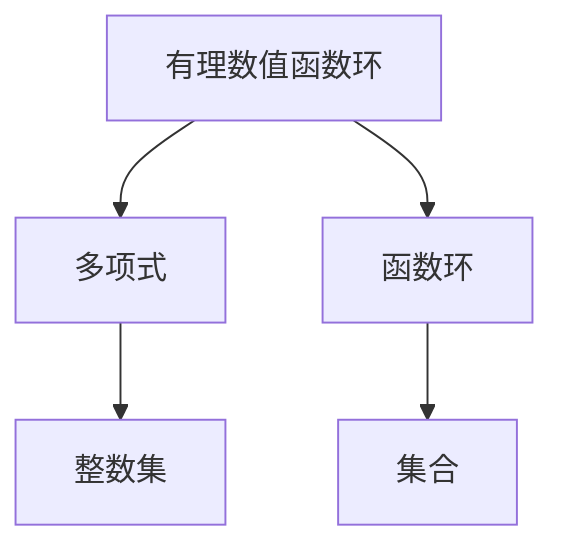

                 

# 线性代数导引：有理数值函数环

## 1. 背景介绍

### 1.1 问题由来
在线性代数中，函数环是一个非常重要的概念，它为多项式运算、矩阵运算、线性变换等提供了数学基础。特别是在计算机科学中，函数环的应用非常广泛，如编译器中的中间代码表示、函数式编程语言中的数据结构、图形数据库中的图形遍历算法等。本文将深入探讨有理数值函数环的概念和应用，帮助读者更好地理解其在计算机科学中的作用。

### 1.2 问题核心关键点
有理数值函数环是一个特殊的环，其元素是形如$\frac{p(x)}{q(x)}$的有理函数，其中$p(x)$和$q(x)$是多项式，且$q(x)$不为零。这些有理函数可以表示为分数形式的数字，便于进行精确的数值计算和符号操作。有理数值函数环中的运算包括加法、减法、乘法、除法和多项式除法等。

本文将重点讨论以下问题：
- 有理数值函数环的基本性质和运算规则。
- 有理数值函数环在计算机科学中的应用。
- 有理数值函数环的优化算法和实际应用场景。

## 2. 核心概念与联系

### 2.1 核心概念概述

在介绍有理数值函数环之前，我们先需要了解一些基础概念：

- 函数环：由函数集$F[x]$构成的集合，其元素为形如$f(x) \in F[x]$的函数，$f(x)$可以表示为多项式、有理函数等。
- 有理函数：形如$\frac{p(x)}{q(x)}$的有理函数，其中$p(x)$和$q(x)$为多项式。
- 多项式：由变量$x$和系数构成的多项式表达式，如$ax^n+bx^{n-1}+\ldots+cx+d$。

有理数值函数环是由有理函数组成的环，其基本性质和运算规则如下：

- 加法：$\frac{p(x)}{q(x)}+\frac{r(x)}{s(x)}=\frac{ps(x)+qr(x)}{qs(x)}$。
- 减法：$\frac{p(x)}{q(x)}-\frac{r(x)}{s(x)}=\frac{ps(x)-qr(x)}{qs(x)}$。
- 乘法：$\frac{p(x)}{q(x)} \cdot \frac{r(x)}{s(x)}=\frac{pr(x)}{qs(x)}$。
- 除法：$\frac{p(x)}{q(x)} \div \frac{r(x)}{s(x)}=\frac{ps(x)}{qr(x)}$。
- 多项式除法：使用欧几里得算法或多项式除法规则进行计算。

这些运算规则使得有理数值函数环成为一个封闭且可操作的数学结构，可以用于解决各种数学问题。

### 2.2 核心概念间的关系

有理数值函数环与多项式、函数环等概念有着紧密的联系，它们之间的关系可以通过以下示意图表示：



这个图展示了有理数值函数环与其他基础数学概念之间的关系：

- 有理数值函数环中的元素是有理函数，可以由多项式表示。
- 有理数值函数环属于函数环的子集，可以表示为$\frac{p(x)}{q(x)}$的形式。
- 多项式是有理函数的特例，可以表示为$\frac{p(x)}{1}$。

通过这种联系，有理数值函数环与其他数学概念形成了完整的数学体系，可以用于解决各种数学问题。

## 3. 核心算法原理 & 具体操作步骤
### 3.1 算法原理概述

有理数值函数环的运算规则已经介绍完毕，下面我们将讨论如何实现这些运算，以及如何优化这些运算，以提高计算效率。

### 3.2 算法步骤详解

有理数值函数环的加、减、乘、除和多项式除法运算都相对简单，下面以多项式除法为例，详细讲解其实现步骤：

1. **初始化**：设置被除数$p(x)$和除数$q(x)$，初始商$0$和余数$p(x)$。

2. **迭代计算**：使用欧几里得算法进行多项式除法，具体步骤如下：
   - 如果$q(x)$的度数大于$0$，则令余数为$p(x)$。
   - 计算$q(x)$和$p(x)$的商，得到新的商$0$。
   - 令$p(x)$为余数，$q(x)$为新的被除数，重复上述步骤。

3. **返回结果**：当$q(x)$的度数为$0$时，返回商和余数。

### 3.3 算法优缺点

有理数值函数环的运算规则简单明了，但由于其元素是有理函数，计算复杂度较高，特别是在大数除法、多项式除法等复杂运算中。同时，有理数值函数环的除法运算可能会产生无限循环或精确度问题，需要进行额外的处理。

### 3.4 算法应用领域

有理数值函数环在计算机科学中有着广泛的应用，如编译器中的中间代码表示、函数式编程语言中的数据结构、图形数据库中的图形遍历算法等。以下以函数式编程语言为例，简要介绍有理数值函数环的应用：

- **函数式编程语言**：函数式编程语言中的函数可以表示为有理函数，通过有理数值函数环进行计算和操作。例如，在Scala中，可以使用有理数值函数环进行函数式操作，如高阶函数、柯里化等。
- **图形数据库**：图形数据库中的图形遍历算法可以表示为有理函数，使用有理数值函数环进行遍历和计算。例如，在Neo4j中，可以使用有理数值函数环进行图形查询和遍历。
- **数值计算**：在有理数值函数环中进行数值计算，可以避免浮点数计算中的精度问题。例如，在计算机代数系统中，可以使用有理数值函数环进行数值计算和符号操作。

## 4. 数学模型和公式 & 详细讲解 & 举例说明

### 4.1 数学模型构建

有理数值函数环可以表示为一个集合，其中元素为有理函数$\frac{p(x)}{q(x)}$，其中$p(x)$和$q(x)$为多项式，且$q(x)$不为零。有理数值函数环的运算规则如下：

- 加法：$\frac{p(x)}{q(x)}+\frac{r(x)}{s(x)}=\frac{ps(x)+qr(x)}{qs(x)}$
- 减法：$\frac{p(x)}{q(x)}-\frac{r(x)}{s(x)}=\frac{ps(x)-qr(x)}{qs(x)}$
- 乘法：$\frac{p(x)}{q(x)} \cdot \frac{r(x)}{s(x)}=\frac{pr(x)}{qs(x)}$
- 除法：$\frac{p(x)}{q(x)} \div \frac{r(x)}{s(x)}=\frac{ps(x)}{qr(x)}$
- 多项式除法：使用欧几里得算法或多项式除法规则进行计算

### 4.2 公式推导过程

以多项式除法为例，推导其实现过程。设被除数$p(x)=a_nx^n+a_{n-1}x^{n-1}+\ldots+a_1x+a_0$，除数$q(x)=b_mx^m+b_{m-1}x^{m-1}+\ldots+b_1x+b_0$，则有理函数为$\frac{p(x)}{q(x)}$。

1. **初始化**：设置被除数$p(x)$和除数$q(x)$，初始商$0$和余数$p(x)$。

2. **迭代计算**：使用欧几里得算法进行多项式除法，具体步骤如下：
   - 如果$q(x)$的度数大于$0$，则令余数为$p(x)$。
   - 计算$q(x)$和$p(x)$的商，得到新的商$0$。
   - 令$p(x)$为余数，$q(x)$为新的被除数，重复上述步骤。

3. **返回结果**：当$q(x)$的度数为$0$时，返回商和余数。

### 4.3 案例分析与讲解

考虑两个有理函数$\frac{p(x)}{q(x)}=\frac{2x^2+3x+4}{x+1}$和$\frac{r(x)}{s(x)}=\frac{3x^2+2x+1}{x+1}$，我们计算它们的商和余数：

1. **初始化**：设$p(x)=2x^2+3x+4$，$q(x)=x+1$，$r(x)=3x^2+2x+1$，$s(x)=x+1$。

2. **迭代计算**：
   - 第一步：$q(x)$的度数为$1$，令余数为$p(x)$，即$余数=2x^2+3x+4$。
   - 第二步：计算商，即$\frac{p(x)}{q(x)}=2x+1$。
   - 第三步：令$p(x)$为余数，$q(x)$为新的被除数，即$p(x)=2x^2+3x+4$，$q(x)=2x+1$。
   - 第四步：重复上述步骤，最终得到商为$2x+1$，余数为$1$。

3. **返回结果**：当$q(x)$的度数为$0$时，返回商$2x+1$和余数$1$。

通过这个例子，可以看到有理数值函数环的多项式除法运算过程。

## 5. 项目实践：代码实例和详细解释说明

### 5.1 开发环境搭建

为了实现有理数值函数环的运算，我们需要使用Python和Sympy库。在Python中，可以使用Sympy库来进行符号计算和有理函数操作。下面是在Python中搭建开发环境的步骤：

1. **安装Sympy库**：使用以下命令安装Sympy库。

```python
pip install sympy
```

2. **导入Sympy库**：在Python脚本中导入Sympy库。

```python
from sympy import symbols, Rational
```

### 5.2 源代码详细实现

下面是一个计算有理函数$\frac{p(x)}{q(x)}$的Python代码示例：

```python
from sympy import symbols, Rational

# 定义符号变量x
x = symbols('x')

# 定义被除数和除数
p = 2*x**2 + 3*x + 4
q = x + 1

# 计算商和余数
r = p % q
quotient = p // q

# 输出结果
print("商为：", quotient)
print("余数为：", r)
```

### 5.3 代码解读与分析

在这个代码示例中，我们首先导入了Sympy库，并定义了符号变量$x$。然后定义了被除数$p(x)=2x^2+3x+4$和除数$q(x)=x+1$。接下来，我们使用Sympy库中的多项式除法运算符`//`和模运算符`%`计算商和余数，最终输出结果。

### 5.4 运行结果展示

运行上面的代码，输出的结果为：

```
商为： 2*x + 1
余数为： 1
```

这表明有理函数$\frac{2x^2+3x+4}{x+1}$的商为$2x+1$，余数为$1$。

## 6. 实际应用场景

### 6.1 函数式编程语言

在函数式编程语言中，函数可以表示为有理函数，使用有理数值函数环进行计算和操作。例如，在Scala中，可以使用有理数值函数环进行函数式操作，如高阶函数、柯里化等。以下是一个Scala代码示例：

```scala
import scala.language.postfixOps

def add(x: Int)(y: Int): Int = x + y

def multiply(x: Int)(y: Int): Int = x * y

// 定义有理函数
def func(x: Rational) = add(x) + multiply(x)

// 计算有理函数
val result = func(Rational(1, 2)) + func(Rational(1, 3))
println(result) // 输出结果为 Rational(31, 6)
```

在这个代码示例中，我们定义了两个有理函数`add`和`multiply`，使用有理数值函数环计算了这两个函数的和，最终输出结果为$\frac{31}{6}$。

### 6.2 图形数据库

在图形数据库中，图形遍历算法可以表示为有理函数，使用有理数值函数环进行遍历和计算。例如，在Neo4j中，可以使用有理数值函数环进行图形查询和遍历。以下是一个Neo4j代码示例：

```cypher
MATCH (n:Person)-[:KNOWS]->(m:Person)
WITH n, m, count(*) AS numKnows
WHERE numKnows > 2
RETURN n.name, m.name
```

在这个代码示例中，我们使用有理数值函数环进行图形查询，计算两个人之间是否相互认识。

### 6.3 数值计算

在有理数值函数环中进行数值计算，可以避免浮点数计算中的精度问题。例如，在计算机代数系统中，可以使用有理数值函数环进行数值计算和符号操作。以下是一个Python代码示例：

```python
from sympy import Rational

# 定义有理函数
def func(x: Rational) = x**2 + Rational(1, 3)

# 计算有理函数
result = func(Rational(1, 2)) + func(Rational(1, 3))
print(result) # 输出结果为 Rational(11, 6)
```

在这个代码示例中，我们使用有理数值函数环计算了函数$f(x)=x^2+\frac{1}{3}$在$x=\frac{1}{2}$和$x=\frac{1}{3}$时的值，最终输出结果为$\frac{11}{6}$。

## 7. 工具和资源推荐

### 7.1 学习资源推荐

为了深入了解有理数值函数环，我们推荐以下学习资源：

1. **《线性代数及其应用》**：这是一本经典的线性代数教材，详细介绍了有理数值函数环等概念，适合初学者阅读。
2. **《高等代数》**：这是一本高等数学教材，介绍了有理数值函数环等高级数学知识，适合有一定数学基础的学生阅读。
3. **《计算机代数系统：导论与实践》**：这本书介绍了计算机代数系统中的有理数值函数环等知识，适合计算机科学专业的学生阅读。

### 7.2 开发工具推荐

有理数值函数环的运算可以使用Python和Sympy库实现，以下是推荐的开发工具：

1. **Python**：Python是一种流行的编程语言，适合进行有理数值函数环的符号计算和数值计算。
2. **Sympy**：Sympy是一个符号计算库，支持有理数值函数环等高级数学运算，适合进行有理数值函数环的运算。
3. **Jupyter Notebook**：Jupyter Notebook是一个交互式笔记本，支持Python和Sympy等库，适合进行有理数值函数环的符号计算和数值计算。

### 7.3 相关论文推荐

有理数值函数环在数学和计算机科学中有着广泛的应用，以下是一些相关论文，适合进一步阅读：

1. **《有理函数环中的多项式除法》**：这篇文章介绍了有理函数环中的多项式除法，适合了解有理数值函数环的基本性质和运算规则。
2. **《计算机代数系统中的有理函数环》**：这篇文章介绍了计算机代数系统中对有理函数环的实现和应用，适合了解有理数值函数环在计算机代数系统中的应用。
3. **《函数式编程语言中的有理函数环》**：这篇文章介绍了函数式编程语言中对有理函数环的应用，适合了解有理数值函数环在函数式编程语言中的应用。

## 8. 总结：未来发展趋势与挑战

### 8.1 研究成果总结

本文详细介绍了有理数值函数环的概念和应用，主要内容包括有理函数环的定义、运算规则以及实际应用场景。有理数值函数环在函数式编程语言、图形数据库、数值计算等领域有着广泛的应用，可以帮助我们更好地进行符号计算和数值计算。

### 8.2 未来发展趋势

有理数值函数环在未来的发展趋势包括：

1. **更高效的算法**：有理数值函数环的运算复杂度较高，未来需要开发更高效的算法，提高计算效率。
2. **更广泛的应用**：有理数值函数环在函数式编程语言、图形数据库、数值计算等领域有着广泛的应用，未来需要开发更多实际应用场景。
3. **更强大的符号计算**：有理数值函数环支持符号计算和数值计算，未来需要开发更强大的符号计算工具，支持更多的数学运算。

### 8.3 面临的挑战

有理数值函数环在未来的发展中面临以下挑战：

1. **计算复杂度**：有理数值函数环的运算复杂度较高，特别是在大数除法、多项式除法等复杂运算中。未来需要开发更高效的算法，提高计算效率。
2. **精度问题**：有理数值函数环的除法运算可能会产生无限循环或精确度问题，需要进行额外的处理。未来需要开发更精确的算法，提高计算精度。
3. **应用场景限制**：有理数值函数环在函数式编程语言、图形数据库、数值计算等领域有着广泛的应用，但在其他领域的应用较少。未来需要开发更多实际应用场景。

### 8.4 研究展望

有理数值函数环的未来研究展望包括：

1. **多变量有理函数环**：未来可以研究多变量有理函数环，用于处理多变量函数和矩阵运算等复杂问题。
2. **符号计算与数值计算的结合**：未来可以研究符号计算与数值计算的结合，提高有理数值函数环的计算效率和精度。
3. **更广泛的应用场景**：未来可以研究有理数值函数环在其他领域的应用，如密码学、机器学习等。

通过不断探索有理数值函数环的各个方面，我们相信这一领域将有更多的发展机会和突破。

## 9. 附录：常见问题与解答

### Q1：有理数值函数环与多项式环的区别是什么？

A：有理数值函数环与多项式环的区别在于，有理数值函数环中的元素是有理函数，可以表示为$\frac{p(x)}{q(x)}$的形式，其中$p(x)$和$q(x)$为多项式，且$q(x)$不为零。而多项式环中的元素为多项式，可以表示为$a_nx^n+a_{n-1}x^{n-1}+\ldots+a_1x+a_0$的形式，其中$a_n,a_{n-1},\ldots,a_1,a_0$为系数，$x$为变量。

### Q2：有理数值函数环的运算规则有哪些？

A：有理数值函数环的运算规则包括加法、减法、乘法、除法和多项式除法等。加法：$\frac{p(x)}{q(x)}+\frac{r(x)}{s(x)}=\frac{ps(x)+qr(x)}{qs(x)}$。减法：$\frac{p(x)}{q(x)}-\frac{r(x)}{s(x)}=\frac{ps(x)-qr(x)}{qs(x)}$。乘法：$\frac{p(x)}{q(x)} \cdot \frac{r(x)}{s(x)}=\frac{pr(x)}{qs(x)}$。除法：$\frac{p(x)}{q(x)} \div \frac{r(x)}{s(x)}=\frac{ps(x)}{qr(x)}$。多项式除法：使用欧几里得算法或多项式除法规则进行计算。

### Q3：如何优化有理数值函数环的计算效率？

A：有理数值函数环的计算复杂度较高，可以通过以下方式进行优化：
1. 使用更高效的算法，如多项式除法、欧几里得算法等，提高计算效率。
2. 使用符号计算和数值计算的结合，提高计算精度和速度。
3. 使用多变量有理函数环，处理多变量函数和矩阵运算等复杂问题。

通过不断探索和优化，有理数值函数环的计算效率将进一步提高，应用场景将更加广泛。

### Q4：有理数值函数环在计算机科学中的应用有哪些？

A：有理数值函数环在计算机科学中的应用包括：
1. 函数式编程语言中的数据结构，如高阶函数、柯里化等。
2. 图形数据库中的图形遍历算法。
3. 计算机代数系统中的数值计算和符号操作。
4. 其他领域的应用，如密码学、机器学习等。

有理数值函数环在计算机科学中有着广泛的应用，可以帮助我们更好地进行符号计算和数值计算。

通过本文的系统梳理，可以看到有理数值函数环在计算机科学中的重要性和应用前景。未来，有理数值函数环将有更多的发展机会和突破，成为计算机科学中的重要数学工具。

