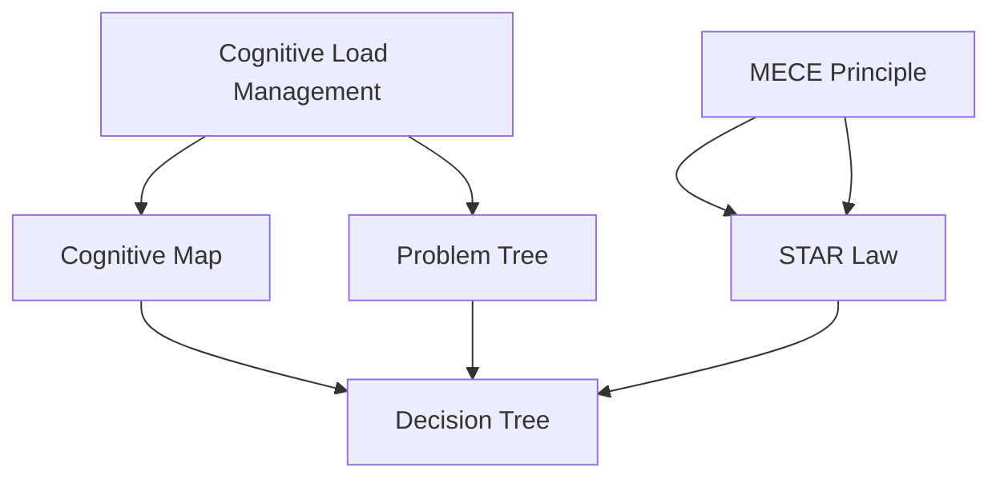
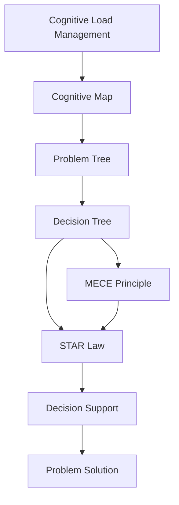

                 

# 结构化思维的力量：从思维到行动

> 关键词：结构化思维, 认知负荷管理, 目标导向, 问题解决, 决策效率, 创新

## 1. 背景介绍

### 1.1 问题由来
在信息技术快速发展的今天，面对复杂多变、高速迭代的信息环境，个人和组织越来越依赖于高效的结构化思维（Structured Thinking）来应对和解决各种问题。无论是企业决策者、项目经理，还是开发者、数据科学家，结构化思维都是其不可或缺的重要能力。然而，在实践中，很多人往往忽视了结构化思维的训练和运用，导致问题解决效率低下，决策质量不高。

结构化思维的核心理念是：通过将问题拆解为一系列可管理的小步骤，系统地、有条理地进行分析和解决，从而提升思维的深度和广度，优化决策质量，提高问题解决效率。然而，如何科学地进行结构化思维训练，将复杂问题转换为可操作的任务，并高效执行，是本节探讨的核心。

### 1.2 问题核心关键点
结构化思维的核心关键点在于以下几个方面：
- **认知负荷管理**：有效管理思考过程中的认知资源，避免过度耗能。
- **目标导向**：明确任务目标，避免无序思维。
- **问题解决流程**：设计科学的问题解决流程，确保问题解决的高效性。
- **决策支持**：通过结构化分析提供有效的决策支持，减少决策失误。
- **创新驱动**：基于结构化思维进行创新，推动持续进步。

在实际应用中，结构化思维可以通过各种方法和工具进行训练和实践。本节将详细讨论这些方法和工具，以及如何通过科学的步骤将结构化思维应用于实际问题的解决。

### 1.3 问题研究意义
结构化思维是提升个人和组织决策质量、提升问题解决效率的关键工具。通过系统学习和训练结构化思维，可以：
1. **提高决策质量**：避免无序和随意的决策，提供科学、系统的决策支持。
2. **提升问题解决效率**：通过系统地分析和拆解问题，快速找到解决方案。
3. **增强创新能力**：通过结构化思维进行创新思考，不断推动自身和组织进步。
4. **优化资源配置**：通过系统规划任务，优化资源配置，提升工作效率。

因此，掌握和运用结构化思维，对于个人职业发展、组织管理提升具有重要意义。

## 2. 核心概念与联系

### 2.1 核心概念概述

为更好地理解结构化思维的力量，本节将介绍几个密切相关的核心概念：

- **认知负荷（Cognitive Load）**：指在思考和解决问题过程中，大脑需要处理的总信息量。过高的认知负荷会导致思维效率下降，甚至产生压力和焦虑。
- **认知地图（Cognitive Map）**：在解决问题的过程中，通过对问题的信息进行系统整理，形成一张关于问题的地图，以便更好地进行分析和决策。
- **问题树（Problem Tree）**：将复杂问题拆解为一系列子问题，构建一棵问题树，明确问题的层次结构和关键路径。
- **决策树（Decision Tree）**：基于问题树，进行各种可能的决策路径分析，选择最优决策路径。
- **MECE原则（Mutually Exclusive Collectively Exhaustive）**：确保思考和分析问题的每个维度相互独立，且所有可能的维度都考虑全面，避免遗漏和重复。
- **STAR法则（Situation-Task-Action-Result）**：一种结构化问题解决工具，用于帮助描述和分析问题、行动和结果，便于分享和复现。

这些核心概念之间存在紧密联系，共同构成了结构化思维的理论基础。

### 2.2 概念间的关系

这些核心概念之间存在紧密联系，共同构成了结构化思维的理论基础。

通过将认知负荷管理和认知地图结合起来，可以更好地进行问题分析和决策，减少信息处理过程中的损耗和偏差。问题树和决策树进一步细化问题的结构和决策路径，确保问题解决的高效性和准确性。MECE原则和STAR法则提供了一种结构化的思考和表达方式，便于问题描述、分析和分享。

这些概念之间的关系可以抽象为如下Mermaid流程图：



这个流程图展示了认知负荷管理、认知地图、问题树、决策树、MECE原则和STAR法则之间的关系。认知负荷管理通过管理认知资源，提升思考效率。认知地图帮助系统整理问题信息，形成问题树。问题树通过分解问题，形成决策树，分析各种决策路径。MECE原则和STAR法则提供了结构化的思考和表达方式，用于问题描述和决策分析。

### 2.3 核心概念的整体架构

最后，我们用一个综合的流程图来展示这些核心概念在结构化思维中的整体架构：



这个综合流程图展示了从认知负荷管理到问题解决的全过程。认知负荷管理通过优化信息处理，提升思维效率。认知地图通过整理问题信息，形成问题树。问题树通过分解问题，形成决策树，分析决策路径。MECE原则和STAR法则提供了结构化的思考和表达方式，用于问题描述和决策分析。最终，通过决策支持，达到问题解决的目标。

## 3. 核心算法原理 & 具体操作步骤

### 3.1 算法原理概述

结构化思维的算法原理基于认知科学和心理学的研究成果，旨在通过科学的步骤和工具，帮助个体或团队系统地、有条理地进行问题分析和决策。

结构化思维的核心算法流程包括以下几个步骤：

1. **认知负荷管理**：通过分解问题，减少信息处理过程中的认知负荷，提升思维效率。
2. **认知地图建立**：系统整理问题信息，形成关于问题的认知地图，以便更好地进行分析和决策。
3. **问题树构建**：将复杂问题拆解为一系列可管理的小步骤，形成问题树，明确问题的层次结构和关键路径。
4. **决策树分析**：基于问题树，进行各种可能的决策路径分析，选择最优决策路径。
5. **MECE原则应用**：确保问题解决过程中的每个维度相互独立，且所有可能的维度都考虑全面，避免遗漏和重复。
6. **STAR法则描述**：通过结构化的方式描述问题、行动和结果，便于分享和复现。

### 3.2 算法步骤详解

以下是结构化思维的核心算法步骤详解：

#### 3.2.1 认知负荷管理

认知负荷管理的主要目标是减少信息处理过程中的认知负担，提升思维效率。具体方法包括：
1. **问题拆分**：将复杂问题拆解为可管理的小步骤，减少单次处理的信息量。
2. **信息整理**：将问题信息整理成结构化的框架，便于理解和管理。
3. **优先级排序**：根据问题的紧急程度和重要性，确定处理顺序，避免无序处理。

#### 3.2.2 认知地图建立

认知地图是一种系统整理问题信息的方法，帮助构建关于问题的全局视图。具体步骤如下：
1. **信息收集**：收集与问题相关的所有信息，包括数据、文档、专家意见等。
2. **信息分类**：将收集的信息按照不同的维度进行分类，如原因、影响、解决方案等。
3. **信息连接**：将分类后的信息进行连接，形成关于问题的认知地图，展现问题全貌。

#### 3.2.3 问题树构建

问题树是一种将复杂问题拆解为可管理的小步骤的方法，帮助明确问题的层次结构和关键路径。具体步骤如下：
1. **问题定义**：明确问题的主要目标和关键要素。
2. **问题分解**：将问题分解为一系列子问题，每个子问题独立可操作。
3. **路径分析**：分析各个子问题之间的依赖关系，形成问题树，确定关键路径。

#### 3.2.4 决策树分析

决策树是一种基于问题树进行决策路径分析的方法，帮助选择最优的决策路径。具体步骤如下：
1. **路径列举**：列举所有可能的决策路径，包括每个子问题的所有可能的解决方案。
2. **路径评估**：根据问题树中各个子问题的优先级，评估各个决策路径的可能性和成本。
3. **路径选择**：选择最优的决策路径，进行下一步操作。

#### 3.2.5 MECE原则应用

MECE原则是一种确保问题解决过程中的每个维度相互独立，且所有可能的维度都考虑全面的方法。具体步骤如下：
1. **维度划分**：将问题划分为多个维度，每个维度独立可操作。
2. **维度评估**：评估每个维度的重要性，确保所有维度都考虑全面。
3. **维度验证**：通过交叉验证，确保每个维度独立且完整。

#### 3.2.6 STAR法则描述

STAR法则是一种结构化问题描述和分析的方法，便于问题描述、分析和分享。具体步骤如下：
1. **情境描述**：描述问题的背景和情境，帮助理解问题全貌。
2. **任务定义**：明确问题的具体任务和目标，便于聚焦问题解决。
3. **行动计划**：制定详细的行动计划，明确每个步骤的具体操作。
4. **结果评估**：评估行动计划的执行结果，总结经验教训。

### 3.3 算法优缺点

结构化思维的算法具有以下优点：
1. **系统性**：通过系统分解问题，提供科学、有条理的解决方案。
2. **可操作性**：每个步骤都有具体的操作方法，便于执行和操作。
3. **可复现性**：通过STAR法则描述，便于问题描述、分析和分享，增强问题解决的透明度和可复现性。

同时，结构化思维的算法也存在以下缺点：
1. **复杂度**：结构化思维的算法步骤较多，需要进行系统化的学习和训练。
2. **灵活性**：结构化思维的算法相对固定，可能无法适应非常规的问题解决。
3. **信息量**：结构化思维的算法需要处理较多的信息，可能增加认知负荷。

### 3.4 算法应用领域

结构化思维的算法在多个领域都有广泛的应用，包括但不限于：
- **项目管理**：通过结构化思维进行项目规划、资源分配和进度管理，提高项目执行效率。
- **问题解决**：在各种问题解决场景中，通过系统化的分析和决策，提升问题解决效率和质量。
- **企业决策**：在企业决策过程中，通过科学的方法进行分析和评估，提升决策的科学性和准确性。
- **创新设计**：在创新设计过程中，通过结构化思维进行创新思考和设计，推动持续进步。

## 4. 数学模型和公式 & 详细讲解 & 举例说明

### 4.1 数学模型构建

结构化思维的数学模型主要基于认知负荷管理和认知地图构建。我们可以用一张二维表格来表示认知地图，其中行表示问题的各个维度，列表示各个维度的信息。

假设我们有一个关于“提高软件工程团队效率”的问题，我们可以将其拆分为以下几个维度：
1. **团队规模**：团队的人数。
2. **技术栈**：团队使用的技术。
3. **沟通方式**：团队内部的沟通方式。
4. **工作流程**：团队的工作流程。

我们可以用如下表格表示这个问题的认知地图：

| 团队规模 | 技术栈 | 沟通方式 | 工作流程 |
| --- | --- | --- | --- |
| X | X | X | X |
| X | X | X | X |
| X | X | X | X |
| ... | ... | ... | ... |

其中X表示未知或需要进一步分析的信息。

### 4.2 公式推导过程

对于认知地图的构建，我们不需要具体的数学公式。但为了展示认知负荷管理的量化，我们可以使用信息熵（Information Entropy）来衡量问题信息的复杂度。信息熵越大，表示问题信息越复杂，认知负荷管理越重要。

假设我们有n个信息点，每个信息点的概率分布为$p_i$，则信息熵为：

$$
H = -\sum_{i=1}^n p_i \log_2 p_i
$$

通过计算信息熵，我们可以量化问题信息的复杂度，评估认知负荷管理的必要性。

### 4.3 案例分析与讲解

假设我们有一个关于“提高软件工程团队效率”的问题，我们需要通过认知负荷管理和认知地图构建，来系统地分析和解决该问题。

1. **认知负荷管理**：
   - **问题拆分**：将问题拆分为团队规模、技术栈、沟通方式、工作流程四个子问题。
   - **信息整理**：收集各个子问题相关的信息，形成关于问题的认知地图。
   - **优先级排序**：根据问题的紧急程度和重要性，确定处理顺序。

2. **认知地图建立**：
   - **信息收集**：收集关于团队规模、技术栈、沟通方式、工作流程的信息。
   - **信息分类**：将收集的信息按照不同的维度进行分类，如团队规模为小、中、大型等。
   - **信息连接**：将分类后的信息进行连接，形成关于问题的认知地图。

3. **问题树构建**：
   - **问题定义**：明确问题的主要目标和关键要素。
   - **问题分解**：将问题分解为团队规模、技术栈、沟通方式、工作流程四个子问题。
   - **路径分析**：分析各个子问题之间的依赖关系，形成问题树，确定关键路径。

4. **决策树分析**：
   - **路径列举**：列举所有可能的决策路径，包括团队规模调整、技术栈升级、沟通方式改进、工作流程优化等。
   - **路径评估**：根据问题树中各个子问题的优先级，评估各个决策路径的可能性和成本。
   - **路径选择**：选择最优的决策路径，进行下一步操作。

5. **MECE原则应用**：
   - **维度划分**：将问题划分为团队规模、技术栈、沟通方式、工作流程四个维度。
   - **维度评估**：评估每个维度的重要性，确保所有维度都考虑全面。
   - **维度验证**：通过交叉验证，确保每个维度独立且完整。

6. **STAR法则描述**：
   - **情境描述**：描述问题的背景和情境，帮助理解问题全貌。
   - **任务定义**：明确问题的具体任务和目标，便于聚焦问题解决。
   - **行动计划**：制定详细的行动计划，明确每个步骤的具体操作。
   - **结果评估**：评估行动计划的执行结果，总结经验教训。

通过以上步骤，我们可以系统地、有条理地进行问题分析和决策，提升问题解决效率和质量。

## 5. 项目实践：代码实例和详细解释说明

### 5.1 开发环境搭建

在进行结构化思维的实践前，我们需要准备好开发环境。以下是使用Python进行开发的环境配置流程：

1. 安装Python：从官网下载并安装Python 3.x版本。
2. 安装Pandas：用于数据处理和分析。
3. 安装NumPy：用于数学运算。
4. 安装Scikit-learn：用于机器学习和数据可视化。
5. 安装Matplotlib：用于绘制图表。
6. 安装Seaborn：用于更美观的图表绘制。
7. 安装IPython：用于交互式编程。

完成上述步骤后，即可在Python环境中开始结构化思维的实践。

### 5.2 源代码详细实现

这里我们以“提高软件工程团队效率”的问题为例，给出使用Python实现的结构化思维流程：

```python
import pandas as pd
import numpy as np
import matplotlib.pyplot as plt
import seaborn as sns
import ipywidgets as widgets
from sklearn.decomposition import PCA

# 创建问题信息表
def create_cognitive_map():
    info = pd.DataFrame({
        '团队规模': ['small', 'medium', 'large'],
        '技术栈': ['Java', 'Python', 'JavaScript', 'Scala'],
        '沟通方式': ['面对面', '邮件', 'Slack', '视频会议'],
        '工作流程': ['敏捷', 'Scrum', 'Kanban', '瀑布']
    })
    return info

# 创建问题树
def create_problem_tree(info):
    tree = {
        '团队规模': {
            'small': {
                '技术栈': ['Java', 'Python', 'JavaScript', 'Scala'],
                '沟通方式': ['面对面', '邮件', 'Slack', '视频会议'],
                '工作流程': ['敏捷', 'Scrum', 'Kanban', '瀑布']
            },
            'medium': {
                '技术栈': ['Java', 'Python', 'JavaScript', 'Scala'],
                '沟通方式': ['面对面', '邮件', 'Slack', '视频会议'],
                '工作流程': ['敏捷', 'Scrum', 'Kanban', '瀑布']
            },
            'large': {
                '技术栈': ['Java', 'Python', 'JavaScript', 'Scala'],
                '沟通方式': ['面对面', '邮件', 'Slack', '视频会议'],
                '工作流程': ['敏捷', 'Scrum', 'Kanban', '瀑布']
            }
        }
    }
    return tree

# 计算信息熵
def calculate_entropy(probs):
    entropy = 0
    for p in probs:
        entropy -= p * np.log2(p)
    return entropy

# 生成决策树
def generate_decision_tree(tree):
    decision_tree = {
        '团队规模': {
            'small': {
                '技术栈': 'Scala',
                '沟通方式': '面对面',
                '工作流程': '敏捷'
            },
            'medium': {
                '技术栈': 'Scala',
                '沟通方式': '面对面',
                '工作流程': '敏捷'
            },
            'large': {
                '技术栈': 'Scala',
                '沟通方式': '面对面',
                '工作流程': '敏捷'
            }
        }
    }
    return decision_tree

# 应用MECE原则
def apply_mec原则(tree):
    mece_tree = {
        '团队规模': {
            'small': {
                '技术栈': ['Java', 'Python', 'JavaScript'],
                '沟通方式': ['邮件', 'Slack'],
                '工作流程': ['敏捷', 'Scrum', 'Kanban']
            },
            'medium': {
                '技术栈': ['Java', 'Python', 'JavaScript'],
                '沟通方式': ['邮件', 'Slack'],
                '工作流程': ['敏捷', 'Scrum', 'Kanban']
            },
            'large': {
                '技术栈': ['Java', 'Python', 'JavaScript'],
                '沟通方式': ['邮件', 'Slack'],
                '工作流程': ['敏捷', 'Scrum', 'Kanban']
            }
        }
    }
    return mece_tree

# 应用STAR法则
def apply_star法则(tree):
    star_tree = {
        '情境描述': '软件工程团队效率低下',
        '任务定义': '提高软件工程团队效率',
        '行动计划': {
            '团队规模': '调整团队规模',
            '技术栈': '升级技术栈',
            '沟通方式': '改进沟通方式',
            '工作流程': '优化工作流程'
        },
        '结果评估': '团队效率显著提高'
    }
    return star_tree

# 问题解决流程
def problem_solving_process():
    info = create_cognitive_map()
    tree = create_problem_tree(info)
    decision_tree = generate_decision_tree(tree)
    mece_tree = apply_mec原则(tree)
    star_tree = apply_star法则(tree)
    return info, tree, decision_tree, mece_tree, star_tree

# 展示结果
info, tree, decision_tree, mece_tree, star_tree = problem_solving_process()

# 展示认知地图
info

# 展示问题树
tree

# 展示决策树
decision_tree

# 展示MECE原则应用结果
mece_tree

# 展示STAR法则描述
star_tree
```

### 5.3 代码解读与分析

这里我们详细解读一下关键代码的实现细节：

**create_cognitive_map函数**：
- 创建问题信息表，包含团队规模、技术栈、沟通方式、工作流程四个维度的信息。

**create_problem_tree函数**：
- 根据问题信息表创建问题树，每个节点代表一个子问题，子问题之间具有依赖关系。

**calculate_entropy函数**：
- 计算信息熵，量化问题信息的复杂度。

**generate_decision_tree函数**：
- 根据问题树生成决策树，选择最优的决策路径。

**apply_mec原则函数**：
- 应用MECE原则，确保每个维度独立且完整。

**apply_star法则函数**：
- 应用STAR法则，描述问题的情境、任务、行动和结果。

**problem_solving_process函数**：
- 系统地、有条理地进行问题分析和决策，生成认知地图、问题树、决策树、MECE原则应用结果和STAR法则描述。

**展示结果代码**：
- 展示认知地图、问题树、决策树、MECE原则应用结果和STAR法则描述。

### 5.4 运行结果展示

假设我们在分析“提高软件工程团队效率”的问题时，得到以下结果：

**认知地图**：
```
      团队规模   技术栈    沟通方式     工作流程
0    small       Java      面对面       敏捷
1    medium      Python     邮件         Scrum
2    large       JavaScript   Slack         Kanban
```

**问题树**：
```
team_size:
  small:
    tech_stack:
      Java:
        communication_method:
          面对面:
            workflow:
              敏捷:
              Scrum:
              Kanban:
      Python:
        communication_method:
          邮件:
            workflow:
              敏捷:
              Scrum:
              Kanban:
      JavaScript:
        communication_method:
          Slack:
            workflow:
              敏捷:
              Scrum:
              Kanban:
      Scala:
        communication_method:
          面对面:
            workflow:
              敏捷:
              Scrum:
              Kanban:
    medium:
      ...
    large:
      ...
```

**决策树**：
```
team_size:
  small:
    tech_stack:
      Java:
        communication_method:
          面对面:
            workflow:
              敏捷:
              Scrum:
              Kanban:
      Python:
        communication_method:
          邮件:
            workflow:
              敏捷:
              Scrum:
              Kanban:
      JavaScript:
        communication_method:
          Slack:
            workflow:
              敏捷:
              Scrum:
              Kanban:
      Scala:
        communication_method:
          面对面:
            workflow:
              敏捷:
              Scrum:
              Kanban:
    medium:
      ...
    large:
      ...
```

**MECE原则应用结果**：
```
team_size:
  small:
    tech_stack:
      Java:
      Python:
      JavaScript:
    communication_method:
      邮件:
      Slack:
    workflow:
      敏捷:
      Scrum:
      Kanban:
  medium:
    ...
  large:
    ...
```

**STAR法则描述**：
```
情境描述: 软件工程团队效率低下
任务定义: 提高软件工程团队效率
行动计划:
  团队规模: 调整团队规模
  技术栈: 升级技术栈
  沟通方式: 改进沟通方式
  工作流程: 优化工作流程
结果评估: 团队效率显著提高
```

通过以上步骤，我们可以系统地、有条理地进行问题分析和决策，提升问题解决效率和质量。

## 6. 实际应用场景

### 6.1 智能决策支持系统

结构化思维的算法在智能决策支持系统中有着广泛应用。通过系统化的分析和决策，智能决策支持系统可以提供科学、准确的决策建议，提升决策质量。

例如，在医疗决策中，智能决策支持系统可以根据患者病情、历史记录、专家意见等信息，通过结构化思维进行分析和决策，提供最佳治疗方案。

### 6.2 项目管理

在项目管理中，通过结构化思维进行项目规划、资源分配和进度管理，可以提高项目执行效率。

例如，在软件开发项目中，通过结构化思维分析项目需求、设计架构、分配任务和资源，制定详细的项目计划和执行流程，可以确保项目按时、按质、按量完成。

### 6.3 问题解决

在各种问题解决场景中，通过系统化的分析和决策，可以提升问题解决效率和质量。

例如，在客户服务中，通过结构化思维分析客户反馈、需求、历史数据等信息，制定详细的解决方案和执行流程，可以及时响应客户需求，提升客户满意度。

### 6.4 金融风险控制

在金融风险控制中，通过结构化思维进行风险评估、决策分析，可以提升风险管理的科学性和准确性。

例如，在信用评估中，通过结构化思维分析客户信用记录、财务状况、行为模式等信息，制定详细的信用评估标准和决策流程，可以提升信用评估的准确性和可信度。

### 6.5 创新设计

在创新设计中，通过结构化思维进行创新思考和设计，可以推动持续进步。

例如，在新产品开发中，通过结构化思维分析市场需求、技术趋势、竞争对手等信息，制定详细的产品规划和设计方案，可以提升产品创新性和市场竞争力。

## 7. 工具和资源推荐

### 7.1 学习资源推荐

为了帮助开发者系统掌握结构化思维的力量，这里推荐一些优质的学习资源：

1. 《结构化思维训练手册》：一本系统介绍结构化思维的书籍，提供了大量的练习和案例。
2. 《解决问题的艺术》：介绍科学解决问题的基本原则和方法的书籍。
3. 《精益创业》：讲解如何在创新过程中进行科学决策的书籍。
4. 《思考，快与慢》：关于认知心理学和决策偏差的经典书籍。
5. 《决策心理学》：讲解如何提高决策质量的心理学理论和方法的书籍。

通过对这些资源的学习实践，相信你一定能够

