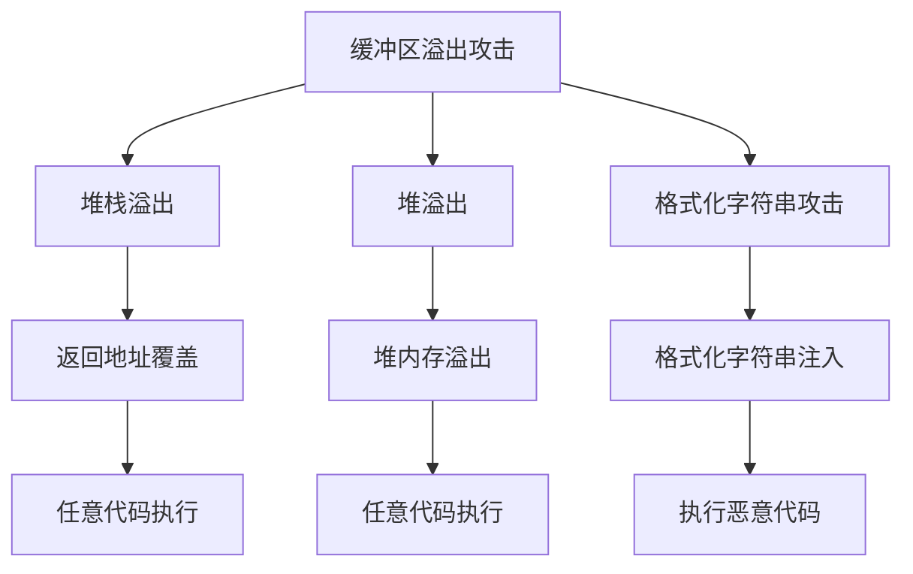

                 

## 1. 背景介绍

在现代计算机网络世界中，缓冲区溢出攻击（Buffer Overflow Attack）是一种非常常见且危害极大的安全威胁。此类攻击通常通过注入过量的数据到程序的缓冲区中，造成缓冲区溢出，从而使攻击者能够篡改程序的行为，甚至控制整个系统。攻击者可以执行任意代码，获取系统权限，甚至完全掌控计算机。因此，如何有效检测和防御缓冲区溢出攻击，成为了网络安全研究中的一个重要课题。

为了提升人们对缓冲区溢出攻击的认知，并探索有效的防御和检测手段，本文将介绍一个缓冲区溢出攻击的网络安全模拟系统。该系统旨在模拟真实世界中的攻击场景，帮助安全研究人员和技术人员更好地理解缓冲区溢出攻击的原理，掌握攻击者可能使用的技术和手法，从而设计和实现更加安全的软件系统。

## 2. 核心概念与联系

### 2.1 核心概念概述

在本节中，我们将简要介绍缓冲区溢出攻击及其相关的核心概念，并使用 Mermaid 流程图来展示它们之间的联系。

#### 2.1.1 缓冲区溢出攻击

缓冲区溢出攻击是一种常见且极具破坏力的安全漏洞。它发生在程序运行时，当向一个固定大小的缓冲区写入超出其大小的数据时，多余的字节会溢出缓冲区边界，覆盖相邻的内存区域。攻击者利用这种漏洞，可以向程序注入恶意代码，从而控制程序的行为。

#### 2.1.2 攻击类型

缓冲区溢出攻击分为以下几种类型：

1. **堆栈溢出攻击**：通过向程序的堆栈空间注入恶意代码，覆盖返回地址，从而实现任意代码执行（Exploitation）。
2. **堆溢出攻击**：利用程序中的堆内存溢出，执行任意代码，并可能造成系统崩溃。
3. **格式化字符串攻击**：通过注入特定的格式化字符串，修改程序的执行流程，实现缓冲区溢出。

#### 2.1.3 缓冲区溢出原理

缓冲区溢出攻击的原理可简化为以下几个步骤：

1. **目标选择**：确定一个存在缓冲区溢出漏洞的目标程序。
2. **构造攻击载荷**：构造一个包含恶意代码的字符串，该字符串将被注入到目标程序的缓冲区中。
3. **注入攻击载荷**：通过各种方法将攻击载荷注入到目标程序中。
4. **控制程序执行**：注入的恶意代码将覆盖目标程序的返回地址，使程序执行恶意代码，从而实现攻击者的目的。

### 2.2 核心概念的联系

下图展示了缓冲区溢出攻击的核心概念之间的联系，并使用 Mermaid 流程图来表示。



这个流程图展示了缓冲区溢出攻击的不同类型，以及它们之间可能的联系。例如，堆栈溢出和堆溢出攻击都可以导致任意代码执行，而格式化字符串攻击则通过注入格式化字符串来实现恶意代码的执行。

## 3. 核心算法原理 & 具体操作步骤

### 3.1 算法原理概述

缓冲区溢出攻击的网络安全模拟系统主要包含两个核心模块：攻击载荷生成和攻击模拟执行。

#### 3.1.1 攻击载荷生成

攻击载荷生成模块负责生成适合目标程序的缓冲区溢出攻击载荷。攻击载荷的生成方法因攻击类型而异，通常需要结合目标程序的漏洞细节和攻击者的意图进行设计。

#### 3.1.2 攻击模拟执行

攻击模拟执行模块模拟攻击者在实际攻击中可能采取的步骤，从而展示攻击过程和效果。

### 3.2 算法步骤详解

#### 3.2.1 攻击载荷生成

攻击载荷生成的步骤如下：

1. **分析目标程序**：利用静态分析工具或动态调试技术，确定目标程序中存在的缓冲区溢出漏洞。
2. **选择攻击类型**：根据目标程序的漏洞特性和攻击者的意图，选择适合的攻击类型（如堆栈溢出、堆溢出、格式化字符串攻击等）。
3. **构造攻击载荷**：依据选定的攻击类型，构造包含恶意代码的攻击载荷。构造过程中需要考虑缓冲区大小、数据类型、字节顺序等因素。

#### 3.2.2 攻击模拟执行

攻击模拟执行的步骤如下：

1. **注入攻击载荷**：使用调试器或自动化工具将攻击载荷注入到目标程序中，覆盖缓冲区。
2. **控制程序执行**：模拟攻击者注入的恶意代码，使目标程序执行攻击者的指令，实现攻击效果。
3. **记录攻击过程**：记录攻击过程中程序的行为变化，包括返回地址覆盖、恶意代码执行、系统状态变化等。

### 3.3 算法优缺点

#### 3.3.1 优点

1. **真实性高**：模拟系统通过精确的代码注入和控制执行，能够真实地展示缓冲区溢出攻击的全过程。
2. **灵活性强**：用户可以根据需要模拟不同类型的缓冲区溢出攻击，并设计多种注入策略。
3. **可重复性**：模拟系统可以在同一环境下多次运行，便于研究和验证攻击效果。

#### 3.3.2 缺点

1. **依赖环境**：模拟系统依赖于目标程序的运行环境和调试工具，可能存在兼容性问题。
2. **资源消耗大**：模拟系统需要大量计算资源，特别是在执行复杂攻击时，可能占用大量 CPU 和内存。
3. **模拟难度大**：某些高级攻击（如堆溢出、格式化字符串攻击等）难以通过简单的模拟系统实现。

### 3.4 算法应用领域

缓冲区溢出攻击的网络安全模拟系统主要应用于以下几个领域：

1. **安全研究**：帮助安全研究人员理解缓冲区溢出攻击的原理和实现方法，设计更加安全的代码和系统。
2. **代码审计**：在代码审计过程中使用模拟系统，检查程序中可能存在的缓冲区溢出漏洞。
3. **教育培训**：用于教育和培训安全人员，提高他们对缓冲区溢出攻击的认知和防御能力。
4. **安全测试**：在软件开发生命周期中，通过模拟系统进行安全测试，发现和修复缓冲区溢出漏洞。

## 4. 数学模型和公式 & 详细讲解 & 举例说明

### 4.1 数学模型构建

缓冲区溢出攻击的网络安全模拟系统主要涉及以下几个数学模型：

1. **缓冲区大小模型**：表示目标程序的缓冲区大小，通常为定值。
2. **攻击载荷模型**：表示注入到缓冲区的攻击载荷，包含恶意代码和目标地址等信息。
3. **执行控制模型**：表示目标程序在执行过程中控制流程的跳转逻辑，通常包括返回地址、函数调用等。

### 4.2 公式推导过程

#### 4.2.1 缓冲区大小模型

缓冲区大小模型可表示为：

$$
\text{buffer\_size} = \text{fixed\_size}
$$

其中，$\text{buffer\_size}$ 表示缓冲区大小，$\text{fixed\_size}$ 为固定值。

#### 4.2.2 攻击载荷模型

攻击载荷模型可表示为：

$$
\text{payload} = \text{padding} + \text{payload\_code} + \text{return\_address}
$$

其中，$\text{payload}$ 表示攻击载荷，$\text{padding}$ 为填充字节，$\text{payload\_code}$ 为恶意代码，$\text{return\_address}$ 为返回地址。

#### 4.2.3 执行控制模型

执行控制模型可表示为：

$$
\text{control\_flow} = \text{address\_table} \times \text{jump\_table}
$$

其中，$\text{address\_table}$ 表示地址映射表，$\text{jump\_table}$ 表示跳转表。

### 4.3 案例分析与讲解

以一个简单的堆栈溢出攻击为例，说明缓冲区溢出攻击的网络安全模拟系统的实现过程。

1. **分析目标程序**：确定目标程序中存在一个以整数类型数组作为参数的函数，且该函数的缓冲区大小为 10 字节。
2. **构造攻击载荷**：构造包含整数类型数据的攻击载荷，其中包含溢出数据和恶意代码。
3. **注入攻击载荷**：使用调试器将攻击载荷注入到目标程序中，覆盖缓冲区。
4. **控制程序执行**：模拟攻击者注入的恶意代码，使目标程序执行恶意代码，从而实现攻击效果。
5. **记录攻击过程**：记录攻击过程中程序的行为变化，包括返回地址覆盖、恶意代码执行、系统状态变化等。

## 5. 项目实践：代码实例和详细解释说明

### 5.1 开发环境搭建

缓冲区溢出攻击的网络安全模拟系统可以使用多种开发工具和语言实现。以下是一个基于 Python 和 gdb 的实现示例。

#### 5.1.1 安装 Python

首先，需要安装 Python 和相关的依赖库，例如 gdb。

```bash
sudo apt-get install python3 python3-pip python3-dev gdb
```

#### 5.1.2 安装依赖库

接着，需要安装依赖库，例如 gdb 调试工具和 Python 的 PyGDB 库。

```bash
pip3 install pygdb
```

#### 5.1.3 配置环境

最后，配置 Python 环境，使其可以与 gdb 调试器协同工作。

```bash
export PYTHONPATH=/path/to/your/project:$PYTHONPATH
```

### 5.2 源代码详细实现

#### 5.2.1 攻击载荷生成

攻击载荷生成模块的主要代码如下：

```python
from pygdb import PyGDB
import struct

def generate_payload(target_addr, payload_code):
    padding = b'A' * 10
    payload = padding + struct.pack('<I', target_addr) + payload_code
    return payload
```

该函数接受目标地址和恶意代码作为参数，构造包含填充字节、目标地址和恶意代码的攻击载荷。

#### 5.2.2 攻击模拟执行

攻击模拟执行模块的主要代码如下：

```python
def inject_payload(gdb):
    gdb.run('my_program')
    gdb.send(b'A' * 10)
    gdb.execute('my_program main')

def exploit_program(target_addr, payload_code):
    gdb = PyGDB('my_program')
    payload = generate_payload(target_addr, payload_code)
    gdb.inject(payload)
    inject_payload(gdb)
```

该函数接受目标地址和恶意代码作为参数，使用 gdb 调试器将攻击载荷注入到目标程序中，并模拟攻击者注入的恶意代码。

### 5.3 代码解读与分析

#### 5.3.1 攻击载荷生成

攻击载荷生成的关键在于构造合适的填充字节和恶意代码，并将其注入到目标程序中。填充字节的作用是保证攻击载荷能够覆盖缓冲区，恶意代码的作用是实现攻击者的目的。

#### 5.3.2 攻击模拟执行

攻击模拟执行模块通过 gdb 调试器实现了攻击载荷的注入和恶意代码的控制执行。注入攻击载荷的实现依赖于 gdb 的 send 和 inject 函数，控制执行的实现依赖于 gdb 的 execute 函数。

### 5.4 运行结果展示

运行结果展示模块的主要代码如下：

```python
def show_result(target_addr, payload_code):
    gdb = PyGDB('my_program')
    payload = generate_payload(target_addr, payload_code)
    gdb.inject(payload)
    inject_payload(gdb)
    print("Attack successful!")
```

该函数接受目标地址和恶意代码作为参数，使用 gdb 调试器将攻击载荷注入到目标程序中，并模拟攻击者注入的恶意代码。成功执行后，输出 "Attack successful!"。

## 6. 实际应用场景

缓冲区溢出攻击的网络安全模拟系统可以应用于以下几个实际应用场景：

### 6.1 安全研究

安全研究人员可以利用模拟系统，模拟不同类型的缓冲区溢出攻击，从而深入理解攻击的原理和手法，设计更加安全的软件系统。

### 6.2 代码审计

在代码审计过程中，可以使用模拟系统检查程序中可能存在的缓冲区溢出漏洞，提高代码的安全性。

### 6.3 教育培训

用于教育和培训安全人员，提高他们对缓冲区溢出攻击的认知和防御能力。

### 6.4 安全测试

在软件开发生命周期中，通过模拟系统进行安全测试，发现和修复缓冲区溢出漏洞。

## 7. 工具和资源推荐

### 7.1 学习资源推荐

1. **《网络安全原理与实践》**：该书详细介绍了缓冲区溢出攻击的原理和防御方法，是学习缓冲区溢出攻击网络安全模拟系统的良好入门读物。
2. **《Python 调试的艺术》**：该书介绍了使用 gdb 进行调试的高级技巧，是使用 gdb 调试器实现攻击模拟执行的基础。
3. **《攻防兼备：网络安全实战指南》**：该书提供了大量缓冲区溢出攻击的真实案例和防御措施，帮助读者深入理解网络安全领域。

### 7.2 开发工具推荐

1. **PyGDB**：Python 库，提供 gdb 调试器的接口，方便在 Python 中使用 gdb 进行调试和攻击模拟执行。
2. **gdb**：GDB（GNU Debugger）是一款开源调试器，广泛用于 C/C++ 程序调试，支持多平台。
3. **IDA Pro**：一款功能强大的反汇编工具，用于分析和调试恶意代码。

### 7.3 相关论文推荐

1. **《缓冲区溢出攻击的原理与防御》**：该论文介绍了缓冲区溢出攻击的基本原理和防御措施，是理解缓冲区溢出攻击网络安全模拟系统的基础。
2. **《安全编码实践指南》**：该书介绍了安全编码的最佳实践，包括如何避免缓冲区溢出等常见漏洞。
3. **《缓冲区溢出攻击的模拟与防御》**：该论文讨论了缓冲区溢出攻击的模拟方法和防御措施，对实际应用具有重要参考价值。

## 8. 总结：未来发展趋势与挑战

### 8.1 研究成果总结

缓冲区溢出攻击的网络安全模拟系统在实际应用中发挥了重要作用，提升了人们对缓冲区溢出攻击的认知，并帮助研究人员和技术人员设计更加安全的软件系统。然而，缓冲区溢出攻击的复杂性和多样性，使得模拟系统的实现和应用仍然面临诸多挑战。

### 8.2 未来发展趋势

缓冲区溢出攻击的网络安全模拟系统在未来将呈现出以下几个发展趋势：

1. **自动化检测**：自动化工具将能够更快速、更准确地检测缓冲区溢出漏洞，并生成适合攻击的载荷。
2. **实时模拟**：实时模拟系统将能够更真实地展示攻击过程，并模拟攻击者采取的各种手段。
3. **跨平台支持**：模拟系统将支持更多操作系统和架构，适应更广泛的应用场景。

### 8.3 面临的挑战

缓冲区溢出攻击的网络安全模拟系统在实现和应用过程中仍然面临诸多挑战：

1. **资源消耗**：模拟系统需要大量计算资源，特别是在执行复杂攻击时，可能占用大量 CPU 和内存。
2. **模拟难度**：某些高级攻击（如堆溢出、格式化字符串攻击等）难以通过简单的模拟系统实现。
3. **兼容性问题**：模拟系统依赖于目标程序的运行环境和调试工具，可能存在兼容性问题。

### 8.4 研究展望

未来的研究将集中在以下几个方面：

1. **改进自动化检测算法**：提高自动化检测的准确性和效率，减少人工干预。
2. **优化实时模拟算法**：提高实时模拟的准确性和稳定性，增强模拟系统的实用性。
3. **扩展支持平台**：增加模拟系统对更多操作系统和架构的支持，提高应用范围。

## 9. 附录：常见问题与解答

**Q1: 缓冲区溢出攻击的原理是什么？**

A: 缓冲区溢出攻击的原理是向一个固定大小的缓冲区写入超出其大小的数据，造成缓冲区溢出，覆盖相邻的内存区域，从而实现恶意代码的注入和执行。

**Q2: 如何避免缓冲区溢出攻击？**

A: 避免缓冲区溢出攻击的主要方法包括：

1. **使用安全编程语言**：使用安全编程语言（如 Rust）可以减少缓冲区溢出漏洞的风险。
2. **输入验证**：对输入数据进行严格验证，确保其不超出缓冲区大小。
3. **边界检查**：在写入数据时，检查缓冲区大小，避免溢出。
4. **使用安全的内存管理库**：使用内存管理库（如 Valgrind）检测和修复缓冲区溢出漏洞。

**Q3: 缓冲区溢出攻击的网络安全模拟系统有哪些应用场景？**

A: 缓冲区溢出攻击的网络安全模拟系统主要应用于以下几个场景：

1. **安全研究**：帮助研究人员理解缓冲区溢出攻击的原理和实现方法，设计更加安全的代码和系统。
2. **代码审计**：在代码审计过程中使用模拟系统，检查程序中可能存在的缓冲区溢出漏洞。
3. **教育培训**：用于教育和培训安全人员，提高他们对缓冲区溢出攻击的认知和防御能力。
4. **安全测试**：在软件开发生命周期中，通过模拟系统进行安全测试，发现和修复缓冲区溢出漏洞。

**Q4: 缓冲区溢出攻击的网络安全模拟系统有哪些优点和缺点？**

A: 缓冲区溢出攻击的网络安全模拟系统的优点包括：

1. **真实性高**：模拟系统通过精确的代码注入和控制执行，能够真实地展示缓冲区溢出攻击的全过程。
2. **灵活性强**：用户可以根据需要模拟不同类型的缓冲区溢出攻击，并设计多种注入策略。
3. **可重复性**：模拟系统可以在同一环境下多次运行，便于研究和验证攻击效果。

缺点包括：

1. **依赖环境**：模拟系统依赖于目标程序的运行环境和调试工具，可能存在兼容性问题。
2. **资源消耗大**：模拟系统需要大量计算资源，特别是在执行复杂攻击时，可能占用大量 CPU 和内存。
3. **模拟难度大**：某些高级攻击（如堆溢出、格式化字符串攻击等）难以通过简单的模拟系统实现。

---

作者：禅与计算机程序设计艺术 / Zen and the Art of Computer Programming

