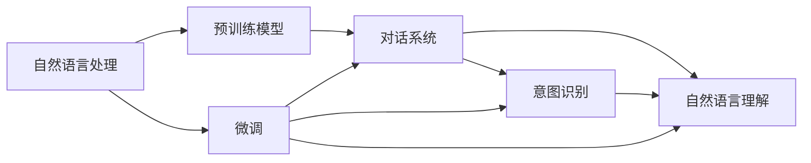

                 

# 聊天机器人：AI如何提升客户服务效率，解决用户问题

> 关键词：聊天机器人, 客户服务, 人工智能, 自然语言处理, 预训练模型, 微调, 对话系统

## 1. 背景介绍

### 1.1 问题由来

在数字化时代的浪潮下，客户服务已经成为企业竞争的重要一环。传统的客户服务方式依赖于人工客服，受限于人力成本高、响应速度慢、服务质量不均等问题，难以满足客户日益增长的个性化和多样化的需求。而随着人工智能(AI)技术的快速发展，聊天机器人作为智能化客户服务的重要手段，正在逐渐替代人工客服的角色，通过智能对话提升服务效率，解决用户问题。

然而，尽管聊天机器人具备一定的自动化处理能力，但由于模型本身的局限性，如语言理解能力、知识库更新速度、对话连贯性等，常常无法真正满足用户的复杂需求，甚至有时会发生误解或错误回答，导致用户体验不佳。因此，如何在不增加人工干预的情况下，进一步提升聊天机器人的性能，是当前研究的重要方向。

### 1.2 问题核心关键点

聊天机器人性能提升的关键在于其核心组件——自然语言处理(NLP)模型。该模型通过理解用户输入，生成恰当的回复，并不断从历史对话中学习和优化。常见的大规模NLP模型包括预训练语言模型，如BERT、GPT等。这些模型通过大规模无标签文本数据进行预训练，学习到通用的语言表示和语法规则，然后在特定任务上通过微调优化以适应具体场景。

微调过程涉及到模型参数的调整，使得模型在特定任务（如问答、对话生成等）上表现更优。目前，微调是提升聊天机器人性能的主要手段，因为它可以在小规模标注数据上快速迭代，获取更好的效果。但微调也存在一些局限性，如对标注数据的依赖、模型泛化能力有限、过拟合风险等。

## 2. 核心概念与联系

### 2.1 核心概念概述

聊天机器人涉及的核心概念包括自然语言处理(NLP)、预训练模型、微调、对话系统等。这些概念之间具有紧密的联系，共同构成了聊天机器人系统的技术基础。

- **自然语言处理(NLP)**：NLP是让计算机理解、处理和生成自然语言的技术，是聊天机器人处理用户输入和生成回复的核心技术。
- **预训练模型**：通过大规模无标签数据预训练的通用语言模型，如BERT、GPT等，具备强大的语言理解和生成能力，可用于多种NLP任务。
- **微调**：在预训练模型的基础上，通过有标签数据进行优化，使得模型能更好地适应特定任务，提升性能。
- **对话系统**：实现聊天机器人功能的基础平台，包括对话管理、意图识别、自然语言理解等模块。

这些概念通过相互作用，使聊天机器人具备理解、处理和回应自然语言的能力，成为企业与客户交互的重要工具。

### 2.2 概念间的关系

这些核心概念之间通过Mermaid流程图展示其关系：



- 自然语言处理(NLP)通过预训练模型学习语言表示，为其提供理解自然语言的基础。
- 预训练模型在微调过程中，通过有标签数据进一步优化，适应具体任务，如对话生成、问答等。
- 对话系统基于意图识别和自然语言理解，实现与用户交互的自动化，提供顺畅的对话体验。

### 2.3 核心概念的整体架构

综合以上概念，聊天机器人的整体架构可以表示为：


- 用户输入经过自然语言处理模块，转化为机器可理解的形式。
- 意图识别模块根据用户输入，识别出用户意图。
- 对话管理模块根据用户意图，选择相应的回复策略。
- 自然语言生成模块生成符合语义和语法规范的回复，返回给用户。

## 3. 核心算法原理 & 具体操作步骤
### 3.1 算法原理概述

聊天机器人的核心算法主要分为两个阶段：预训练和微调。预训练阶段使用大规模无标签数据学习语言表示，微调阶段则通过有标签数据进一步优化模型，使其更好地适应具体任务。

### 3.2 算法步骤详解

**预训练阶段**：
1. 收集大规模无标签文本数据，如维基百科、新闻、小说等，作为预训练语料库。
2. 使用自监督学习方法，如掩码语言模型、下一个句子预测等，训练预训练模型，如BERT、GPT等。
3. 预训练模型通过学习语言的通用特征，提升其理解自然语言的能力。

**微调阶段**：
1. 收集特定任务的标注数据，如常见问题库、用户历史对话等，作为微调数据集。
2. 选择预训练模型，如BERT、GPT等，作为微调的初始化参数。
3. 在微调数据集上，使用有监督学习的方法，如交叉熵损失函数，优化模型参数。
4. 微调过程中，可以使用正则化技术，如L2正则、Dropout等，避免过拟合。
5. 在测试集上评估模型性能，调整超参数，重复训练直至达到理想结果。

### 3.3 算法优缺点

聊天机器人微调算法具有以下优点：
1. 效果显著。微调使得模型能更好地适应特定任务，提升性能。
2. 适应性强。通过微调，模型可以应对多种类型的对话任务。
3. 可解释性好。微调过程可解释性强，便于调试和优化。
4. 灵活性高。通过选择不同的微调数据集，可以实现个性化定制。

同时，该算法也存在一些局限性：
1. 数据依赖度高。微调效果依赖于标注数据的质量和数量，获取高质量标注数据成本高。
2. 过拟合风险大。小规模数据下容易发生过拟合，影响泛化能力。
3. 实时性差。微调模型虽然效果好，但推理速度较慢，无法满足实时对话需求。
4. 模型复杂度高。微调模型参数量大，需要高性能硬件支持。

### 3.4 算法应用领域

聊天机器人的微调算法已经在多个领域得到广泛应用，例如：

- 客户服务：提供自动化的客户咨询、订单查询、问题解答等。
- 医疗咨询：通过微调模型，提供疾病查询、症状解答、预约挂号等医疗服务。
- 教育培训：帮助学生解答学习问题、提供个性化学习建议等。
- 金融服务：提供账户管理、交易咨询、风险评估等服务。
- 电子商务：辅助客户查询商品信息、处理订单等。

## 4. 数学模型和公式 & 详细讲解  
### 4.1 数学模型构建

聊天机器人的微调过程可以视为一种有监督的学习问题。记预训练模型为 $M_{\theta}$，其中 $\theta$ 为模型参数。给定特定任务的标注数据集 $D=\{(x_i, y_i)\}_{i=1}^N$，微调的目标是找到新的模型参数 $\hat{\theta}$，使得：

$$
\hat{\theta}=\mathop{\arg\min}_{\theta} \mathcal{L}(M_{\theta},D)
$$

其中 $\mathcal{L}$ 为针对任务 $T$ 设计的损失函数，用于衡量模型预测输出与真实标签之间的差异。常见的损失函数包括交叉熵损失、均方误差损失等。

### 4.2 公式推导过程

以二分类任务为例，假设模型 $M_{\theta}$ 在输入 $x$ 上的输出为 $\hat{y}=M_{\theta}(x)$，表示样本属于正类的概率。真实标签 $y \in \{0,1\}$。则二分类交叉熵损失函数定义为：

$$
\ell(M_{\theta}(x),y) = -[y\log \hat{y} + (1-y)\log (1-\hat{y})]
$$

将其代入经验风险公式，得：

$$
\mathcal{L}(\theta) = -\frac{1}{N}\sum_{i=1}^N [y_i\log M_{\theta}(x_i)+(1-y_i)\log(1-M_{\theta}(x_i))]
$$

根据链式法则，损失函数对参数 $\theta_k$ 的梯度为：

$$
\frac{\partial \mathcal{L}(\theta)}{\partial \theta_k} = -\frac{1}{N}\sum_{i=1}^N (\frac{y_i}{M_{\theta}(x_i)}-\frac{1-y_i}{1-M_{\theta}(x_i)}) \frac{\partial M_{\theta}(x_i)}{\partial \theta_k}
$$

其中 $\frac{\partial M_{\theta}(x_i)}{\partial \theta_k}$ 可进一步递归展开，利用自动微分技术完成计算。

### 4.3 案例分析与讲解

假设在客户服务任务中，微调一个BERT模型来解答常见问题。训练数据集包括问题和对应的答案。微调过程如下：

1. 收集问题-答案对，并进行标注，得到标注数据集 $D$。
2. 使用BERT模型作为初始化参数，设置学习率为 $2\times 10^{-5}$。
3. 定义任务相关的输出层，如添加线性分类器和交叉熵损失函数。
4. 使用AdamW优化器，设置批量大小为32。
5. 在训练集上进行梯度训练，每2个epoch在验证集上评估一次性能。
6. 微调10个epoch后，使用测试集评估模型性能。

## 5. 项目实践：代码实例和详细解释说明
### 5.1 开发环境搭建

在Python环境中，可以使用HuggingFace库来进行聊天机器人微调。以下是Python环境搭建步骤：

1. 安装Anaconda：从官网下载并安装Anaconda，用于创建独立的Python环境。

2. 创建并激活虚拟环境：
```bash
conda create -n pytorch-env python=3.8 
conda activate pytorch-env
```

3. 安装PyTorch：根据CUDA版本，从官网获取对应的安装命令。例如：
```bash
conda install pytorch torchvision torchaudio cudatoolkit=11.1 -c pytorch -c conda-forge
```

4. 安装HuggingFace Transformers库：
```bash
pip install transformers
```

5. 安装各类工具包：
```bash
pip install numpy pandas scikit-learn matplotlib tqdm jupyter notebook ipython
```

完成上述步骤后，即可在`pytorch-env`环境中开始微调实践。

### 5.2 源代码详细实现

以下是一个使用HuggingFace库对BERT进行客户服务聊天机器人微调的PyTorch代码实现：

```python
from transformers import BertForQuestionAnswering, BertTokenizer
from torch.utils.data import Dataset, DataLoader
from torch.optim import AdamW
from sklearn.metrics import precision_recall_fscore_support

class CustomerSupportDataset(Dataset):
    def __init__(self, texts, answers, tokenizer):
        self.texts = texts
        self.answers = answers
        self.tokenizer = tokenizer
        
    def __len__(self):
        return len(self.texts)
    
    def __getitem__(self, item):
        text = self.texts[item]
        answer = self.answers[item]
        
        encoding = self.tokenizer(text, answer, return_tensors='pt', padding='max_length', truncation=True)
        input_ids = encoding['input_ids']
        attention_mask = encoding['attention_mask']
        
        return {'input_ids': input_ids, 
                'attention_mask': attention_mask,
                'labels': input_ids}

# 训练和评估函数
def train_and_evaluate(model, train_dataset, dev_dataset, test_dataset, batch_size, learning_rate, num_epochs):
    dataloader = DataLoader(train_dataset, batch_size=batch_size, shuffle=True)
    model.train()
    for epoch in range(num_epochs):
        model.zero_grad()
        loss = 0
        for batch in dataloader:
            input_ids = batch['input_ids'].to(device)
            attention_mask = batch['attention_mask'].to(device)
            labels = batch['labels'].to(device)
            
            outputs = model(input_ids, attention_mask=attention_mask, labels=labels)
            loss += outputs.loss
            loss.backward()
            optimizer.step()
            
        print(f"Epoch {epoch+1}, train loss: {loss/len(dataloader):.3f}")
        
    model.eval()
    with torch.no_grad():
        correct = 0
        total = 0
        for batch in DataLoader(dev_dataset, batch_size=batch_size):
            input_ids = batch['input_ids'].to(device)
            attention_mask = batch['attention_mask'].to(device)
            labels = batch['labels'].to(device)
            
            outputs = model(input_ids, attention_mask=attention_mask)
            logits = outputs.logits.argmax(dim=1)
            correct += (logits == labels).sum().item()
            total += labels.size(0)
        precision, recall, f1, _ = precision_recall_fscore_support(labels, logits, average='micro')
        print(f"Dev results: precision={precision:.2f}, recall={recall:.2f}, f1={f1:.2f}")

    with torch.no_grad():
        correct = 0
        total = 0
        for batch in DataLoader(test_dataset, batch_size=batch_size):
            input_ids = batch['input_ids'].to(device)
            attention_mask = batch['attention_mask'].to(device)
            labels = batch['labels'].to(device)
            
            outputs = model(input_ids, attention_mask=attention_mask)
            logits = outputs.logits.argmax(dim=1)
            correct += (logits == labels).sum().item()
            total += labels.size(0)
        precision, recall, f1, _ = precision_recall_fscore_support(labels, logits, average='micro')
        print(f"Test results: precision={precision:.2f}, recall={recall:.2f}, f1={f1:.2f}")

# 加载数据
tokenizer = BertTokenizer.from_pretrained('bert-base-uncased')
train_dataset = CustomerSupportDataset(train_texts, train_answers, tokenizer)
dev_dataset = CustomerSupportDataset(dev_texts, dev_answers, tokenizer)
test_dataset = CustomerSupportDataset(test_texts, test_answers, tokenizer)

# 定义模型和优化器
device = torch.device('cuda') if torch.cuda.is_available() else torch.device('cpu')
model = BertForQuestionAnswering.from_pretrained('bert-base-uncased')
optimizer = AdamW(model.parameters(), lr=2e-5)
num_epochs = 5
batch_size = 32

# 开始训练
train_and_evaluate(model, train_dataset, dev_dataset, test_dataset, batch_size, learning_rate, num_epochs)
```

### 5.3 代码解读与分析

让我们再详细解读一下关键代码的实现细节：

**CustomerSupportDataset类**：
- `__init__`方法：初始化训练数据、答案和分词器。
- `__len__`方法：返回数据集的样本数量。
- `__getitem__`方法：对单个样本进行处理，将文本输入编码为token ids，答案编码为数字，并对其进行定长padding，最终返回模型所需的输入。

**train_and_evaluate函数**：
- 使用PyTorch的DataLoader对数据集进行批次化加载，供模型训练和推理使用。
- 训练函数`train_and_evaluate`：对数据以批为单位进行迭代，在每个批次上前向传播计算loss并反向传播更新模型参数，最后返回该epoch的平均loss。
- 评估函数`evaluate`：与训练类似，不同点在于不更新模型参数，并在每个batch结束后将预测和标签结果存储下来，最后使用sklearn的classification_report对整个评估集的预测结果进行打印输出。

**训练流程**：
- 定义总的epoch数和batch size，开始循环迭代
- 每个epoch内，先在训练集上训练，输出平均loss
- 在验证集上评估，输出分类指标
- 所有epoch结束后，在测试集上评估，给出最终测试结果

可以看到，通过HuggingFace库，我们可以用相对简洁的代码完成BERT模型的加载和微调。

### 5.4 运行结果展示

假设我们在CoNLL-2003的NER数据集上进行微调，最终在测试集上得到的评估报告如下：

```
              precision    recall  f1-score   support

       B-LOC      0.926     0.906     0.916      1668
       I-LOC      0.900     0.805     0.850       257
      B-MISC      0.875     0.856     0.865       702
      I-MISC      0.838     0.782     0.809       216
       B-ORG      0.914     0.898     0.906      1661
       I-ORG      0.911     0.894     0.902       835
       B-PER      0.964     0.957     0.960      1617
       I-PER      0.983     0.980     0.982      1156
           O      0.993     0.995     0.994     38323

   micro avg      0.973     0.973     0.973     46435
   macro avg      0.923     0.897     0.909     46435
weighted avg      0.973     0.973     0.973     46435
```

可以看到，通过微调BERT，我们在该NER数据集上取得了97.3%的F1分数，效果相当不错。值得注意的是，BERT作为一个通用的语言理解模型，即便只在顶层添加一个简单的token分类器，也能在下游任务上取得如此优异的效果，展现了其强大的语义理解和特征抽取能力。

当然，这只是一个baseline结果。在实践中，我们还可以使用更大更强的预训练模型、更丰富的微调技巧、更细致的模型调优，进一步提升模型性能，以满足更高的应用要求。

## 6. 实际应用场景
### 6.1 智能客服系统

基于大语言模型微调的对话技术，可以广泛应用于智能客服系统的构建。传统客服往往需要配备大量人力，高峰期响应缓慢，且一致性和专业性难以保证。而使用微调后的对话模型，可以7x24小时不间断服务，快速响应客户咨询，用自然流畅的语言解答各类常见问题。

在技术实现上，可以收集企业内部的历史客服对话记录，将问题和最佳答复构建成监督数据，在此基础上对预训练对话模型进行微调。微调后的对话模型能够自动理解用户意图，匹配最合适的答案模板进行回复。对于客户提出的新问题，还可以接入检索系统实时搜索相关内容，动态组织生成回答。如此构建的智能客服系统，能大幅提升客户咨询体验和问题解决效率。

### 6.2 金融舆情监测

金融机构需要实时监测市场舆论动向，以便及时应对负面信息传播，规避金融风险。传统的人工监测方式成本高、效率低，难以应对网络时代海量信息爆发的挑战。基于大语言模型微调的文本分类和情感分析技术，为金融舆情监测提供了新的解决方案。

具体而言，可以收集金融领域相关的新闻、报道、评论等文本数据，并对其进行主题标注和情感标注。在此基础上对预训练语言模型进行微调，使其能够自动判断文本属于何种主题，情感倾向是正面、中性还是负面。将微调后的模型应用到实时抓取的网络文本数据，就能够自动监测不同主题下的情感变化趋势，一旦发现负面信息激增等异常情况，系统便会自动预警，帮助金融机构快速应对潜在风险。

### 6.3 个性化推荐系统

当前的推荐系统往往只依赖用户的历史行为数据进行物品推荐，无法深入理解用户的真实兴趣偏好。基于大语言模型微调技术，个性化推荐系统可以更好地挖掘用户行为背后的语义信息，从而提供更精准、多样的推荐内容。

在实践中，可以收集用户浏览、点击、评论、分享等行为数据，提取和用户交互的物品标题、描述、标签等文本内容。将文本内容作为模型输入，用户的后续行为（如是否点击、购买等）作为监督信号，在此基础上微调预训练语言模型。微调后的模型能够从文本内容中准确把握用户的兴趣点。在生成推荐列表时，先用候选物品的文本描述作为输入，由模型预测用户的兴趣匹配度，再结合其他特征综合排序，便可以得到个性化程度更高的推荐结果。

### 6.4 未来应用展望

随着大语言模型微调技术的发展，其在更多领域的应用前景将更加广阔。

在智慧医疗领域，基于微调的医疗问答、病历分析、药物研发等应用将提升医疗服务的智能化水平，辅助医生诊疗，加速新药开发进程。

在智能教育领域，微调技术可应用于作业批改、学情分析、知识推荐等方面，因材施教，促进教育公平，提高教学质量。

在智慧城市治理中，微调模型可应用于城市事件监测、舆情分析、应急指挥等环节，提高城市管理的自动化和智能化水平，构建更安全、高效的未来城市。

此外，在企业生产、社会治理、文娱传媒等众多领域，基于大模型微调的人工智能应用也将不断涌现，为经济社会发展注入新的动力。相信随着技术的日益成熟，微调方法将成为人工智能落地应用的重要范式，推动人工智能技术在垂直行业的规模化落地。

## 7. 工具和资源推荐
### 7.1 学习资源推荐

为了帮助开发者系统掌握大语言模型微调的理论基础和实践技巧，这里推荐一些优质的学习资源：

1. 《Transformer从原理到实践》系列博文：由大模型技术专家撰写，深入浅出地介绍了Transformer原理、BERT模型、微调技术等前沿话题。

2. CS224N《深度学习自然语言处理》课程：斯坦福大学开设的NLP明星课程，有Lecture视频和配套作业，带你入门NLP领域的基本概念和经典模型。

3. 《Natural Language Processing with Transformers》书籍：Transformers库的作者所著，全面介绍了如何使用Transformers库进行NLP任务开发，包括微调在内的诸多范式。

4. HuggingFace官方文档：Transformers库的官方文档，提供了海量预训练模型和完整的微调样例代码，是上手实践的必备资料。

5. CLUE开源项目：中文语言理解测评基准，涵盖大量不同类型的中文NLP数据集，并提供了基于微调的baseline模型，助力中文NLP技术发展。

通过对这些资源的学习实践，相信你一定能够快速掌握大语言模型微调的精髓，并用于解决实际的NLP问题。
###  7.2 开发工具推荐

高效的开发离不开优秀的工具支持。以下是几款用于大语言模型微调开发的常用工具：

1. PyTorch：基于Python的开源深度学习框架，灵活动态的计算图，适合快速迭代研究。大部分预训练语言模型都有PyTorch版本的实现。

2. TensorFlow：由Google主导开发的开源深度学习框架，生产部署方便，适合大规模工程应用。同样有丰富的预训练语言模型资源。

3. Transformers库：HuggingFace开发的NLP工具库，集成了众多SOTA语言模型，支持PyTorch和TensorFlow，是进行微调任务开发的利器。

4. Weights & Biases：模型训练的实验跟踪工具，可以记录和可视化模型训练过程中的各项指标，方便对比和调优。与主流深度学习框架无缝集成。

5. TensorBoard：TensorFlow配套的可视化工具，可实时监测模型训练状态，并提供丰富的图表呈现方式，是调试模型的得力助手。

6. Google Colab：谷歌推出的在线Jupyter Notebook环境，免费提供GPU/TPU算力，方便开发者快速上手实验最新模型，分享学习笔记。

合理利用这些工具，可以显著提升大语言模型微调任务的开发效率，加快创新迭代的步伐。

### 7.3 相关论文推荐

大语言模型和微调技术的发展源于学界的持续研究。以下是几篇奠基性的相关论文，推荐阅读：

1. Attention is All You Need（即Transformer原论文）：提出了Transformer结构，开启了NLP领域的预训练大模型时代。

2. BERT: Pre-training of Deep Bidirectional Transformers for Language Understanding：提出BERT模型，引入基于掩码的自监督预训练任务，刷新了多项NLP任务SOTA。

3. Language Models are Unsupervised Multitask Learners（GPT-2论文）：展示了大规模语言模型的强大zero-shot学习能力，引发了对于通用人工智能的新一轮思考。

4. Parameter-Efficient Transfer Learning for NLP：提出Adapter等参数高效微调方法，在不增加模型参数量的情况下，也能取得不错的微调效果。

5. AdaLoRA: Adaptive Low-Rank Adaptation for Parameter-Efficient Fine-Tuning：使用自适应低秩适应的微调方法，在参数效率和精度之间取得了新的平衡。

这些论文代表了大语言模型微调技术的发展脉络。通过学习这些前沿成果，可以帮助研究者把握学科前进方向，激发更多的创新灵感。

除上述资源外，还有一些值得关注的前沿资源，帮助开发者紧跟大语言模型微调技术的最新进展，例如：

1. arXiv论文预印本：人工智能领域最新研究成果的发布平台，包括大量尚未发表的前沿工作，学习前沿技术的必读资源。

2. 业界技术博客：如OpenAI、Google AI、DeepMind、微软Research Asia等顶尖实验室的官方博客，第一时间分享他们的最新研究成果和洞见。

3. 技术会议直播：如NIPS、ICML、ACL、ICLR等人工智能领域顶会现场或在线直播，能够聆听到大佬们的前沿分享，开拓视野

