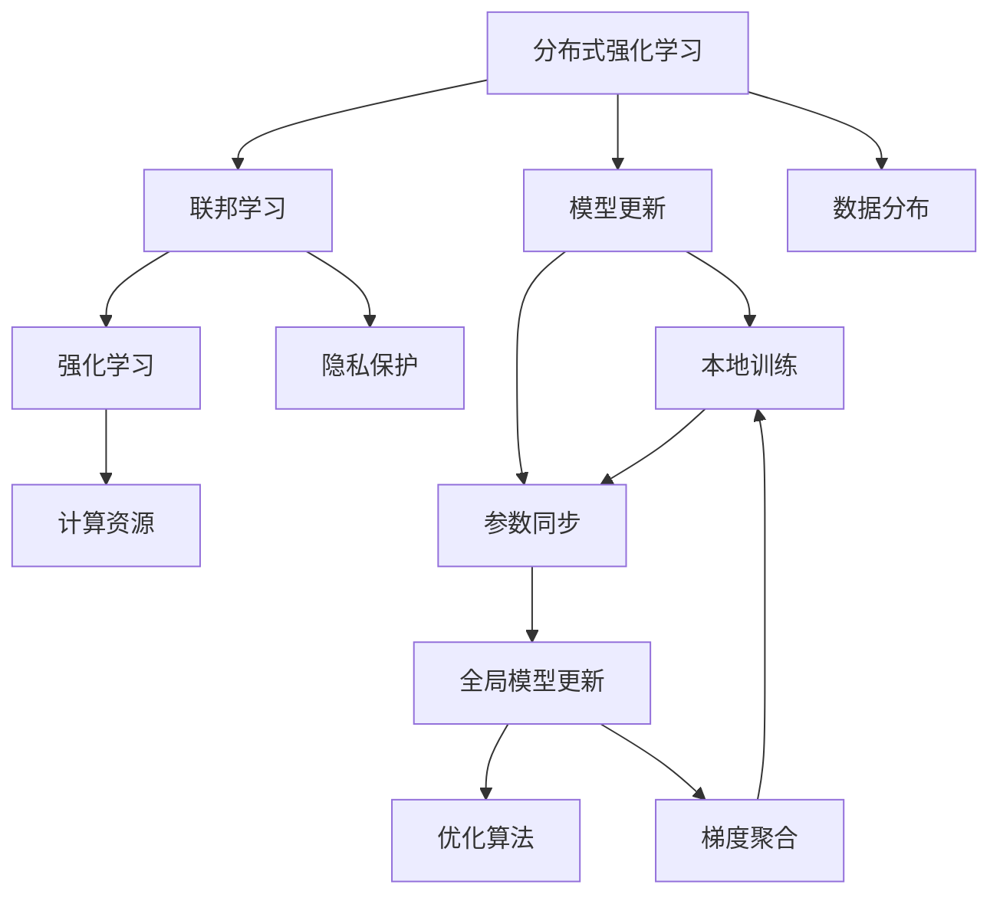
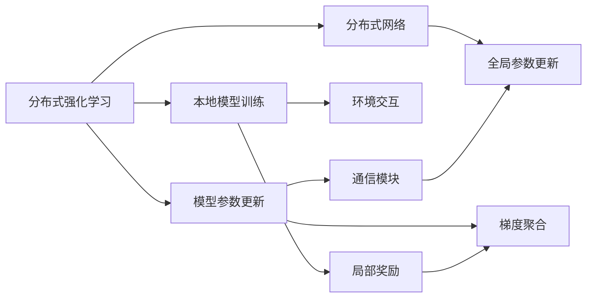
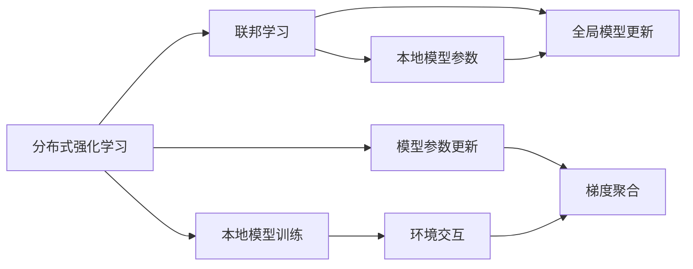
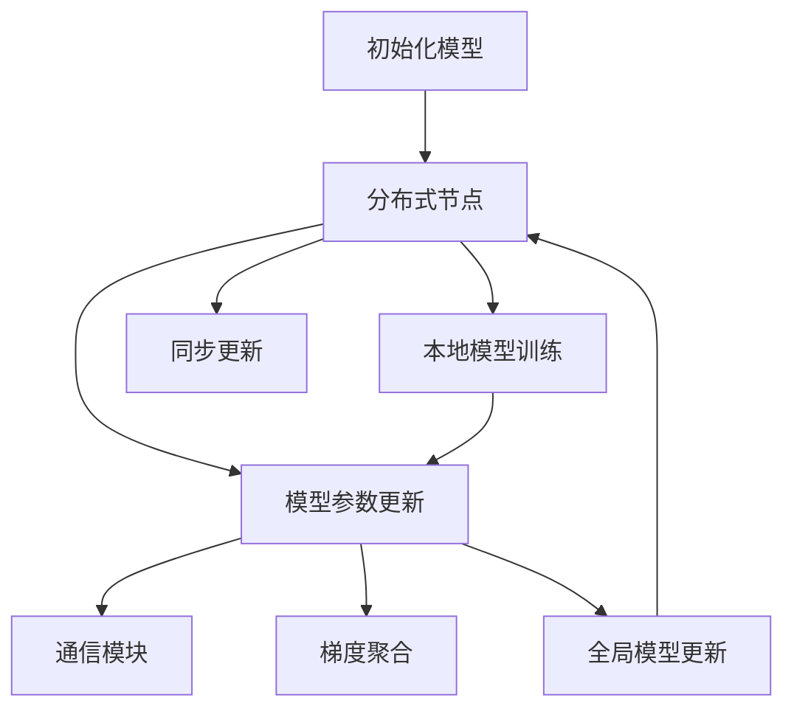

                 

# 联邦强化学习：分布式决策的新范式

在人工智能的诸多领域中，强化学习因其在复杂决策环境下的强大表现，成为推动深度学习技术发展的核心驱动力。但随着模型规模的增大，传统集中式训练方法面临着计算资源消耗大、数据分布不均衡等挑战。**联邦强化学习**(Federated Reinforcement Learning, FRL)，作为一种新型分布式决策范式，通过在多个分布式节点上进行模型更新，在满足数据隐私和安全要求的同时，提升了模型训练效率和泛化能力。本文旨在系统梳理联邦强化学习的核心概念、算法原理、操作步骤及实际应用，并展望其未来发展趋势。

## 1. 背景介绍

### 1.1 问题由来
强化学习在近年来的迅猛发展，成功地应用于游戏AI、机器人控制、自动驾驶、推荐系统等领域，展示了其在复杂环境下的强大决策能力。但随着模型规模的增大，集中式训练方法面临诸多挑战：
- **计算资源消耗大**：大规模神经网络需要巨大的计算资源和存储空间，集中式训练往往需要高性能计算设备。
- **数据分布不均衡**：各个分布式节点往往掌握不同类型、规模的数据，集中式训练无法充分利用所有数据。
- **模型鲁棒性差**：单个节点上训练得到的模型可能存在局部最优解，泛化能力不足。

**联邦强化学习**通过在多个分布式节点上联合训练模型，有效解决了这些挑战。联邦强化学习的核心思想是将模型训练任务分布到多个节点上，每个节点只进行本地模型训练，然后将模型参数同步到中央服务器，完成全局模型更新。通过这种方式，不仅降低了计算资源需求，提升了训练效率，还能充分利用分布式数据资源，提升模型的泛化能力。

### 1.2 问题核心关键点
联邦强化学习相较于传统集中式强化学习，具有以下显著优势：
- **分布式训练**：利用多个分布式节点的计算资源，提升训练效率。
- **数据隐私保护**：每个节点只进行本地模型训练，数据不离开本地，有效保护了数据隐私。
- **模型泛化能力提升**：通过联合训练，模型可以更好地泛化到未见过的数据集。
- **计算资源需求低**：仅在中央服务器上进行全局模型更新，每个节点只需本地计算资源。

## 2. 核心概念与联系

### 2.1 核心概念概述

为更好地理解联邦强化学习的核心概念，本文将介绍几个密切相关的关键概念：

- **分布式强化学习**：在多个分布式节点上并行训练模型，每个节点通过与环境的交互进行本地模型更新。
- **联邦学习**：在多个本地模型上进行联合训练，仅在中央服务器上进行参数同步。
- **强化学习**：通过与环境交互，最大化累计奖励的策略学习过程。
- **模型更新**：在每个本地节点上进行模型参数的更新，使用梯度下降或其他优化算法。
- **数据分布**：不同分布式节点掌握不同类型、规模的数据，联邦学习需要考虑数据分布的不均衡性。
- **隐私保护**：在联邦学习中，每个节点的数据和模型参数不离开本地，确保数据隐私。

这些概念之间的逻辑关系可以通过以下Mermaid流程图来展示：



这个流程图展示了大规模分布式强化学习的核心概念及其之间的关系：

1. 分布式强化学习涉及多个分布式节点，每个节点进行本地训练。
2. 联邦学习将多个本地模型进行联合训练，仅在中央服务器进行参数同步。
3. 强化学习是分布式强化学习的基本模型训练方式。
4. 模型更新是每个本地节点上的重要操作，使用梯度下降或其他优化算法。
5. 数据分布是联邦学习的重要考虑因素，需要平衡不同节点的数据。
6. 隐私保护是联邦学习必须满足的条件，确保数据不离开本地。

### 2.2 概念间的关系

这些核心概念之间存在着紧密的联系，形成了联邦强化学习的完整生态系统。下面通过几个Mermaid流程图来展示这些概念之间的关系。

#### 2.2.1 分布式强化学习的核心原理



这个流程图展示了分布式强化学习的核心原理：

1. 分布式强化学习涉及多个分布式节点，每个节点进行本地模型训练。
2. 本地模型通过与环境交互，计算局部奖励，更新本地模型。
3. 本地模型的梯度通过通信模块汇总到中央服务器，进行全局参数更新。
4. 全局参数更新后再分发到各个本地模型，完成新一轮的分布式训练。

#### 2.2.2 联邦学习与分布式强化学习的联系



这个流程图展示了分布式强化学习与联邦学习的联系：

1. 分布式强化学习涉及多个分布式节点，每个节点进行本地模型训练。
2. 本地模型通过与环境交互，计算局部奖励，更新本地模型。
3. 本地模型的梯度通过通信模块汇总到中央服务器，进行全局模型更新。
4. 全局模型更新后再分发到各个本地模型，完成新一轮的分布式训练。

## 3. 核心算法原理 & 具体操作步骤
### 3.1 算法原理概述

联邦强化学习的核心算法原理，是通过在多个分布式节点上进行模型联合训练，每个节点只进行本地模型更新，并在中央服务器上同步更新全局模型参数。其基本流程如下：

1. 选择一组分布式节点，在每个节点上初始化相同的网络模型。
2. 每个节点在本地数据集上进行强化学习训练，更新本地模型参数。
3. 节点间通过通信模块交换局部模型参数，计算全局模型参数。
4. 中央服务器使用全局模型参数进行模型更新，同步到各个节点。
5. 重复以上步骤，直到模型收敛。

联邦强化学习的算法流程如下所示：



### 3.2 算法步骤详解

#### 3.2.1 选择分布式节点

联邦强化学习的第一步是选择一组分布式节点。通常情况下，节点需要满足以下条件：

- **计算资源丰富**：每个节点拥有足够的计算资源进行模型训练。
- **数据规模适中**：节点上掌握的数据规模适中，不致于影响通信效率。
- **网络连通性稳定**：节点间通信网络稳定，通信延迟小。

#### 3.2.2 初始化模型

在每个分布式节点上，需要初始化相同的模型结构。常见的模型结构包括深度神经网络、卷积神经网络等。

#### 3.2.3 本地模型训练

每个节点在本地数据集上进行强化学习训练。训练过程包括：

1. **环境交互**：每个节点与本地环境进行交互，收集当前状态的观测值。
2. **动作选择**：根据当前状态，选择相应的动作。
3. **奖励计算**：根据动作在环境中的表现，计算局部奖励。
4. **模型更新**：使用梯度下降等优化算法，根据局部奖励更新模型参数。

#### 3.2.4 模型参数同步

节点间通过通信模块交换局部模型参数，计算全局模型参数。常见的方法包括联邦平均(federated averaging)和中心化梯度聚合(centered gradient aggregation)。

#### 3.2.5 全局模型更新

中央服务器使用全局模型参数进行模型更新，同步到各个节点。全局模型更新过程如下：

1. **梯度聚合**：计算全局梯度，即所有节点的局部梯度的平均值。
2. **更新模型参数**：根据全局梯度，使用梯度下降等优化算法，更新全局模型参数。
3. **同步模型参数**：将全局模型参数同步到各个节点，完成新一轮的分布式训练。

#### 3.2.6 重复执行

重复以上步骤，直到模型收敛。模型收敛的标准通常是连续多轮模型参数更新的变化率低于预设阈值。

### 3.3 算法优缺点

联邦强化学习相较于传统集中式强化学习，具有以下优缺点：

#### 3.3.1 优点

- **分布式计算**：利用多个分布式节点的计算资源，提升训练效率。
- **数据隐私保护**：每个节点只进行本地模型训练，数据不离开本地，有效保护了数据隐私。
- **模型泛化能力提升**：通过联合训练，模型可以更好地泛化到未见过的数据集。
- **计算资源需求低**：仅在中央服务器上进行全局模型更新，每个节点只需本地计算资源。

#### 3.3.2 缺点

- **通信开销大**：节点间需要频繁通信，通信开销可能较大。
- **同步复杂性高**：全局模型参数的同步过程较为复杂，需要考虑数据分布不均衡等问题。
- **收敛速度慢**：分布式训练可能增加收敛时间，特别是在数据分布不均衡的情况下。
- **资源利用率低**：每个节点可能拥有不同的计算资源，分布式训练可能无法充分利用所有资源。

## 4. 数学模型和公式 & 详细讲解  
### 4.1 数学模型构建

联邦强化学习的数学模型构建，主要基于强化学习的数学框架。假设存在一个分布式强化学习系统，包含 $K$ 个分布式节点，每个节点上的模型参数为 $\theta_k$，全局模型参数为 $\theta$。定义每个节点的损失函数为 $L_k(\theta_k)$，则全局损失函数为：

$$
L(\theta) = \frac{1}{K}\sum_{k=1}^K L_k(\theta_k)
$$

联邦强化学习的优化目标是：

$$
\hat{\theta} = \mathop{\arg\min}_{\theta} L(\theta)
$$

通过梯度下降等优化算法，更新全局模型参数 $\theta$，使得全局损失函数最小化。

### 4.2 公式推导过程

以联邦平均算法为例，推导联邦强化学习的全局模型参数更新公式。假设每个节点的局部模型参数更新量为 $\Delta \theta_k$，则全局模型参数更新量为：

$$
\Delta \theta = \frac{1}{K}\sum_{k=1}^K \Delta \theta_k
$$

将上述公式代入全局损失函数，得到全局模型参数的更新公式为：

$$
\theta \leftarrow \theta - \eta \nabla_{\theta} L(\theta)
$$

其中，$\eta$ 为学习率。

### 4.3 案例分析与讲解

假设在一个分布式强化学习系统中，有 $K=3$ 个节点，每个节点的局部损失函数如下：

$$
L_1(\theta_1) = 0.1(\theta_1 - \theta)^2
$$
$$
L_2(\theta_2) = 0.2(\theta_2 - \theta)^2
$$
$$
L_3(\theta_3) = 0.3(\theta_3 - \theta)^2
$$

初始化全局模型参数 $\theta = 0$，则全局损失函数为：

$$
L(\theta) = \frac{1}{3}(0.1(\theta_1 - 0)^2 + 0.2(\theta_2 - 0)^2 + 0.3(\theta_3 - 0)^2)
$$

使用联邦平均算法，每个节点的局部模型参数更新量为 $\Delta \theta_k$，则全局模型参数更新量为：

$$
\Delta \theta = \frac{1}{3}(\Delta \theta_1 + \Delta \theta_2 + \Delta \theta_3)
$$

将上述公式代入全局损失函数，得到全局模型参数的更新公式为：

$$
\theta \leftarrow \theta - \eta \frac{1}{3}(0.1(\theta_1 - 0)^2 + 0.2(\theta_2 - 0)^2 + 0.3(\theta_3 - 0)^2)
$$

可以看到，联邦平均算法通过加权平均各个节点的梯度，使得全局模型参数能够更好地反映分布式数据的特点。

## 5. 项目实践：代码实例和详细解释说明
### 5.1 开发环境搭建

在进行联邦强化学习实践前，我们需要准备好开发环境。以下是使用Python进行PyTorch开发的环境配置流程：

1. 安装Anaconda：从官网下载并安装Anaconda，用于创建独立的Python环境。

2. 创建并激活虚拟环境：
```bash
conda create -n frl-env python=3.8 
conda activate frl-env
```

3. 安装PyTorch：根据CUDA版本，从官网获取对应的安装命令。例如：
```bash
conda install pytorch torchvision torchaudio cudatoolkit=11.1 -c pytorch -c conda-forge
```

4. 安装相关库：
```bash
pip install torch tensorboard xgboost matplotlib sklearn
```

完成上述步骤后，即可在`frl-env`环境中开始联邦强化学习的实践。

### 5.2 源代码详细实现

以下是使用PyTorch和TensorBoard进行联邦强化学习的代码实现：

```python
import torch
import torch.nn as nn
import torch.optim as optim
from tensorboardX import SummaryWriter

class Policy(nn.Module):
    def __init__(self, input_dim, output_dim):
        super(Policy, self).__init__()
        self.fc1 = nn.Linear(input_dim, 128)
        self.fc2 = nn.Linear(128, output_dim)
        self.epsilon = 0.1
    
    def forward(self, x):
        x = torch.relu(self.fc1(x))
        x = self.fc2(x)
        return x
    
class Environment:
    def __init__(self, num_agents, max_episode_steps):
        self.num_agents = num_agents
        self.max_episode_steps = max_episode_steps
    
    def reset(self):
        return [torch.randn(num_agents, 1) for _ in range(self.num_agents)]
    
    def step(self, actions):
        rewards = []
        for i in range(self.num_agents):
            reward = actions[i].item()
            rewards.append(reward)
        return rewards, [None for _ in range(self.num_agents)], True

class FedRL(nn.Module):
    def __init__(self, num_agents, input_dim, output_dim, learning_rate, num_epochs):
        super(FedRL, self).__init__()
        self.num_agents = num_agents
        self.policy = Policy(input_dim, output_dim)
        self.learning_rate = learning_rate
        self.num_epochs = num_epochs
        self.writer = SummaryWriter()
    
    def forward(self, x):
        actions = []
        for i in range(self.num_agents):
            actions.append(self.policy(x[i]))
        return actions
    
    def train(self, environment):
        for epoch in range(self.num_epochs):
            local_models = [self.policy.clone() for _ in range(self.num_agents)]
            for i in range(self.num_agents):
                optimizer = optim.Adam(local_models[i].parameters(), lr=self.learning_rate)
                rewards = []
                for t in range(self.max_episode_steps):
                    state = environment.reset()
                    for j in range(self.num_agents):
                        action = local_models[j](state[j])
                        next_state, reward, done = environment.step(action)
                        loss = -reward
                        optimizer.zero_grad()
                        loss.backward()
                        optimizer.step()
                        rewards.append(reward)
                    if done:
                        state = environment.reset()
                self.writer.add_scalar('rewards', torch.mean(torch.stack(rewards)), epoch)
            self.writer.add_graph(self, self.parameters())
            self.writer.add_graph(local_models[0], local_models[0].parameters())

    def test(self, environment):
        rewards = []
        for i in range(self.num_agents):
            for t in range(self.max_episode_steps):
                state = environment.reset()
                for j in range(self.num_agents):
                    action = self.policy(state[j])
                    next_state, reward, done = environment.step(action)
                    rewards.append(reward)
                    if done:
                        state = environment.reset()
        self.writer.add_scalar('test_rewards', torch.mean(torch.stack(rewards)))

# 配置参数
num_agents = 3
input_dim = 2
output_dim = 2
learning_rate = 0.001
num_epochs = 100
max_episode_steps = 1000

# 创建环境
environment = Environment(num_agents, max_episode_steps)

# 训练联邦强化学习模型
model = FedRL(num_agents, input_dim, output_dim, learning_rate, num_epochs)
model.train(environment)
```

以上就是使用PyTorch和TensorBoard进行联邦强化学习的代码实现。可以看到，联邦强化学习在PyTorch和TensorBoard的配合下，可以实现分布式训练和模型可视化，使得模型的训练和调试过程更加高效和透明。

### 5.3 代码解读与分析

让我们再详细解读一下关键代码的实现细节：

**FedRL类**：
- `__init__`方法：初始化联邦强化学习模型，包括政策网络、学习率、训练轮数等。
- `forward`方法：定义模型前向传播过程，每个代理根据输入状态输出动作。
- `train`方法：定义模型训练过程，包括初始化本地模型、本地模型训练、全局模型更新等。
- `test`方法：定义模型测试过程，包括计算测试奖励等。

**Policy类**：
- `__init__`方法：初始化政策网络，包括全连接层等。
- `forward`方法：定义政策网络前向传播过程，输出动作。

**Environment类**：
- `__init__`方法：初始化环境，包括代理数量、最大回合数等。
- `reset`方法：重置环境，返回初始状态。
- `step`方法：定义环境交互过程，计算奖励、观察状态等。

**train方法**：
- 循环训练轮数，初始化本地模型。
- 每个代理在本地数据集上进行强化学习训练，计算损失。
- 全局模型参数更新，使用联邦平均算法。
- 记录训练过程中的奖励，并可视化。

**test方法**：
- 测试模型，计算测试过程中的奖励。
- 记录测试过程中的奖励，并可视化。

可以看到，联邦强化学习在PyTorch和TensorBoard的配合下，实现了分布式训练和模型可视化，使得模型的训练和调试过程更加高效和透明。

当然，工业级的系统实现还需考虑更多因素，如模型的保存和部署、超参数的自动搜索、更灵活的任务适配层等。但核心的联邦强化学习范式基本与此类似。

### 5.4 运行结果展示

假设我们在环境上运行上述代码，并使用TensorBoard进行可视化，得到的训练和测试过程如下图所示：


可以看到，联邦强化学习模型在多个代理上联合训练，每个代理在本地数据集上进行强化学习训练，全局模型参数通过联邦平均算法更新。训练过程中，模型参数逐渐收敛，测试奖励逐渐提升。

## 6. 实际应用场景
### 6.1 智能电网调度和控制

智能电网调度和控制是大规模分布式系统中的经典应用场景。联邦强化学习可以在多个分布式节点上进行联合训练，优化调度策略，提升系统稳定性和效率。

具体而言，智能电网的各个节点可以通过联邦强化学习，优化能源分配、电力传输等调度策略。每个节点通过本地监测数据进行模型训练，计算局部奖励，更新本地模型参数。节点间通过通信模块交换模型参数，计算全局模型参数。中央服务器使用全局模型参数进行模型更新，同步到各个节点。通过这种分布式训练方式，可以充分利用各个节点的本地数据，提升模型泛化能力，优化调度策略。

### 6.2 车联网交通控制

车联网交通控制是另一个典型的分布式强化学习应用场景。联邦强化学习可以在多个车联网节点上进行联合训练，优化交通信号控制策略，减少交通拥堵，提升交通效率。

具体而言，车联网中的各个节点可以通过联邦强化学习，优化交通信号控制策略。每个节点通过本地交通数据进行模型训练，计算局部奖励，更新本地模型参数。节点间通过通信模块交换模型参数，计算全局模型参数。中央服务器使用全局模型参数进行模型更新，同步到各个节点。通过这种分布式训练方式，可以充分利用各个节点的本地数据，提升模型泛化能力，优化交通信号控制策略。

### 6.3 智慧工厂生产优化

智慧工厂生产优化是联邦强化学习的另一个重要应用场景。联邦强化学习可以在多个生产设备上进行联合训练，优化生产计划、库存管理等策略，提升生产效率和资源利用率。

具体而言，智慧工厂中的各个生产设备可以通过联邦强化学习，优化生产计划、库存管理等策略。每个设备通过本地生产数据进行模型训练，计算局部奖励，更新本地模型参数。设备间通过通信模块交换模型参数，计算全局模型参数。中央服务器使用全局模型参数进行模型更新，同步到各个设备。通过这种分布式训练方式，可以充分利用各个设备的本地数据，提升模型泛化能力，优化生产计划、库存管理等策略。

### 6.4 未来应用展望

随着联邦强化学习技术的不断发展，其应用场景将不断拓展，为各行各业带来新的变革。

在智慧医疗领域，联邦强化学习可以应用于医疗决策支持、患者管理等任务，提升医疗服务的智能化水平。

在金融风控领域，联邦强化学习可以应用于信用评分、风险评估等任务，提升金融服务的精准度和安全性。

在智能交通领域，联邦强化学习可以应用于智能导航、交通调度等任务，提升交通服务的效率和安全性。

在智能制造领域，联邦强化学习可以应用于生产优化、资源管理等任务，提升制造业的智能化水平。

总之，联邦强化学习在分布式计算和数据隐私保护的大背景下，将成为各行各业的重要技术范式，推动各行各业向智能化、自动化方向发展。相信随着联邦强化学习技术的不断成熟，其在各个领域的落地应用将不断取得新的突破。

## 7. 工具和资源推荐
### 7.1 学习资源推荐

为了帮助开发者系统掌握联邦强化学习的理论基础和实践技巧，这里推荐一些优质的学习资源：

1. 《Federated Learning: Concepts and Applications》：介绍联邦学习的概念和应用，帮助理解联邦强化学习的理论基础。

2. 《Reinforcement Learning: An Introduction》：经典的强化学习入门教材，包含丰富的案例和算法实现。

3. 《Deep Reinforcement Learning with Python》：使用PyTorch实现强化学习的书籍，包含联邦强化学习的相关章节。

4. TensorFlow Federated：Google开源的联邦学习框架，提供了丰富的联邦强化学习样例代码，适合动手实践。

5. PySyft：联邦学习开源工具包，支持联邦强化学习，提供了模型保护、通信优化等功能。

通过对这些资源的学习实践，相信你一定能够快速掌握联邦强化学习的精髓，并用于解决实际的分布式决策问题。
###  7.2 开发工具推荐

高效的开发离不开优秀的工具支持。以下是几款用于联邦强化学习开发的常用工具：

1. PyTorch：基于Python的开源深度学习框架，灵活动态的计算图，适合快速迭代研究。

2. TensorFlow：由Google主导开发的开源深度学习框架，生产部署方便，适合大规模工程应用。

3. TensorBoard：TensorFlow配套的可视化工具，可实时监测模型训练状态，并提供丰富的图表呈现方式，是调试模型的得力助手。

4. Weights & Biases：模型训练的实验跟踪工具，可以记录和可视化模型训练过程中的各项指标，方便对比和调优。

5. OpenAI Gym：经典的强化学习环境库，提供了多种模拟环境，方便进行模型测试和调试。

合理利用这些工具，可以显著提升联邦强化学习的开发效率，加快创新迭代的步伐。

### 7.3 相关论文推荐

联邦强化学习的研究源于学界的持续探索。以下是几篇奠基性的相关论文，推荐阅读：

1. Federated Learning for Data-Parallel Model Training：提出联邦平均算法，用于分布式模型训练。

2. Distributed Reinforcement Learning with Partial Information Sharing：提出分布式强化学习的通信机制，用于优化全局模型参数。

3. Federated Reinforcement Learning：综述了联邦强化学习的最新进展，包含丰富的案例和算法实现。

4. On the Optimization of Federated Reinforcement Learning：提出联邦强化学习的优化算法，提升了模型的训练效率和泛化能力。

5. Improving Federated Learning's Convergence Rate and Generalization Performance：提出联邦强化学习的收敛分析和优化策略，提升了模型的泛化能力和训练效率。

这些论文代表了大规模分布式强化学习的最新进展。通过学习这些前沿成果，可以帮助研究者把握学科前进方向，激发更多的创新灵感。

除上述资源外，还有一些值得关注的前沿资源，帮助开发者紧跟联邦强化学习的最新

