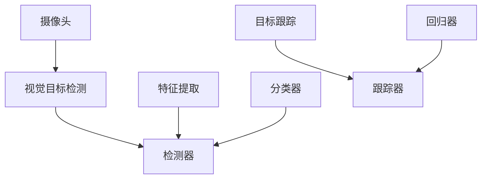
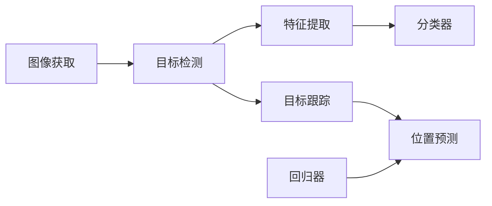
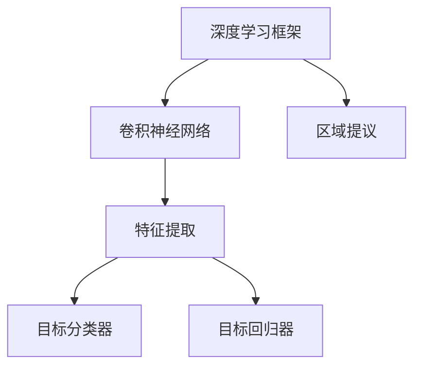
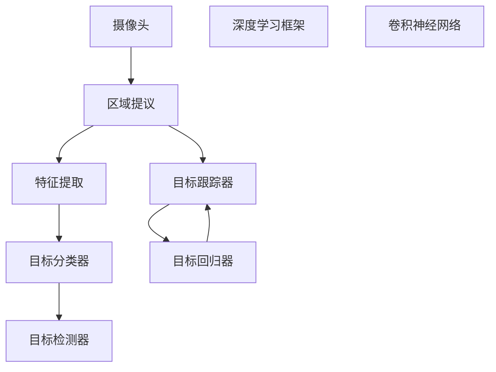

                 

## 1. 背景介绍

### 1.1 问题由来

自动驾驶作为现代汽车技术的新兴领域，其核心之一是环境感知与理解。随着车辆在复杂多变的道路环境中行驶，视觉目标检测与跟踪能力显得尤为重要。通过计算机视觉技术，车辆能够实时感知周围环境中的道路、车辆、行人等关键要素，并根据这些信息做出精准的决策和行动。

当前，自动驾驶领域广泛应用的视觉目标检测与跟踪算法主要基于传统机器学习方法和深度学习框架。尽管这些方法在精度和稳定性方面表现良好，但在实时性和鲁棒性等方面仍存在一定的局限性。如何设计和优化新的算法，使其能够在自动驾驶中更好地应用，成为当前研究的热点问题。

### 1.2 问题核心关键点

自动驾驶中视觉目标检测与跟踪的核心关键点包括：

- 实时性：在高速行驶的车辆中，目标检测与跟踪必须能够在毫秒级别内完成，以保证驾驶决策的及时性。
- 鲁棒性：算法需在各种光照、天气、视角等复杂环境下保持稳定，避免因环境变化导致目标检测失误。
- 精度：检测结果必须准确无误，识别出道路、车辆、行人等关键要素，且能精确跟踪其动态变化。
- 泛化能力：算法需具备良好的泛化能力，能够适应不同车辆、道路和交通状况，实现通用化的应用。
- 可解释性：算法的内部工作机制需透明，便于调优和维护，同时满足法律法规和伦理道德的要求。

这些关键点决定了自动驾驶中视觉目标检测与跟踪算法的设计原则和评价标准。

### 1.3 问题研究意义

研究自动驾驶中的视觉目标检测与跟踪算法，对于推动自动驾驶技术的成熟和产业化具有重要意义：

1. 提升安全性能：通过精确的目标检测与跟踪，降低事故发生率，保障乘员和行人安全。
2. 提高决策效率：实时准确的目标信息为驾驶决策提供基础，减少对人类司机的依赖，提升驾驶体验。
3. 加速技术落地：算法的高性能和可解释性能够更好地与实际驾驶场景融合，促进自动驾驶技术的规模化应用。
4. 拓展应用场景：通过提升检测与跟踪的灵活性和泛化能力，自动驾驶系统能够适应更多复杂环境，拓展应用边界。
5. 推动技术创新：视觉目标检测与跟踪算法的改进和创新，将为自动驾驶技术带来新的突破和进展。

## 2. 核心概念与联系

### 2.1 核心概念概述

为更好地理解自动驾驶中的视觉目标检测与跟踪算法，本节将介绍几个密切相关的核心概念：

- 视觉目标检测：指通过摄像头等视觉传感器，获取道路环境中的图像信息，并识别出其中的目标对象，如车辆、行人等。
- 目标跟踪：指在图像序列中，持续跟踪已检测到的目标对象，获取其动态变化信息。
- 特征提取：指通过算法从图像中提取关键特征，用于目标识别和跟踪。
- 分类器：指用于区分目标类别的模型，如SVM、CNN等。
- 回归器：指用于预测目标位置、速度等动态属性的模型，如线性回归、RNN等。
- 检测器：指将特征提取与分类器结合，实现对图像中目标的检测与识别。
- 跟踪器：指将特征提取与回归器结合，实现对目标的持续跟踪和位置预测。

这些核心概念之间的逻辑关系可以通过以下Mermaid流程图来展示：



这个流程图展示了大规模目标检测与跟踪的过程：

1. 摄像头获取道路环境图像。
2. 视觉目标检测器使用图像信息提取并检测出目标。
3. 目标跟踪器对检测到的目标进行持续跟踪。
4. 特征提取器从图像中提取关键特征。
5. 分类器用于目标类别识别。
6. 回归器用于目标动态属性预测。

### 2.2 概念间的关系

这些核心概念之间存在着紧密的联系，形成了自动驾驶中目标检测与跟踪的完整生态系统。下面通过几个Mermaid流程图来展示这些概念之间的关系。

#### 2.2.1 目标检测与跟踪的核心流程



这个流程图展示了目标检测与跟踪的基本流程：

1. 图像通过摄像头获取。
2. 检测器对图像进行目标检测，提取特征。
3. 分类器对特征进行识别，确定目标类别。
4. 跟踪器对目标进行持续跟踪，提取位置和速度等动态属性。
5. 回归器对目标动态属性进行预测。

#### 2.2.2 目标检测与跟踪的算法组件



这个流程图展示了目标检测与跟踪的核心算法组件：

1. 深度学习框架提供了卷积神经网络(CNN)等基础模块。
2. 区域提议算法用于在图像中提取感兴趣区域。
3. 特征提取模块从感兴趣区域中提取关键特征。
4. 目标分类器用于识别目标类别。
5. 目标回归器用于预测目标位置、速度等动态属性。

### 2.3 核心概念的整体架构

最后，我们用一个综合的流程图来展示这些核心概念在大规模目标检测与跟踪中的整体架构：



这个综合流程图展示了从摄像头获取图像，到最终目标检测与跟踪的完整流程。通过深度学习框架和核心算法组件，实现对目标的精确检测与跟踪。

## 3. 核心算法原理 & 具体操作步骤

### 3.1 算法原理概述

自动驾驶中的视觉目标检测与跟踪算法通常基于深度学习模型，如卷积神经网络(CNN)、区域提议算法(如R-CNN、Faster R-CNN)、目标检测与跟踪算法(如YOLO、SSD、Fast R-CNN)。这些算法在特征提取、目标分类和动态属性预测等方面各有优势，能够有效提升自动驾驶中的环境感知能力。

深度学习模型通过大量的标注数据进行训练，学习目标的视觉特征和空间关系，能够在复杂多变的环境中进行高效的检测与跟踪。以下是三种典型的深度学习模型：

- **卷积神经网络(CNN)**：通过多层次卷积和池化操作，提取图像中的特征，并进行分类或回归任务。
- **区域提议算法**：如R-CNN、Faster R-CNN，在图像中提出多个候选区域，并对每个区域进行特征提取和分类，从而检测出目标。
- **目标检测与跟踪算法**：如YOLO、SSD、Fast R-CNN，将目标检测与跟踪结合起来，实现实时高效的目标检测与动态属性预测。

### 3.2 算法步骤详解

基于深度学习的目标检测与跟踪算法通常包括以下关键步骤：

1. **图像获取**：通过摄像头等视觉传感器获取道路环境图像。
2. **特征提取**：对图像进行卷积操作，提取关键特征。
3. **区域提议**：如R-CNN、Faster R-CNN，通过候选区域算法，在图像中提出多个候选区域。
4. **目标检测**：对每个候选区域进行特征提取和分类，确定目标类别。
5. **目标跟踪**：对检测到的目标进行持续跟踪，提取位置、速度等动态属性。
6. **目标回归**：如YOLO、SSD、Fast R-CNN，使用回归器对目标动态属性进行预测。
7. **融合与输出**：将检测结果与跟踪结果进行融合，输出目标的位置和动态信息。

以YOLO算法为例，其详细步骤如下：

1. **输入图像预处理**：将输入图像缩放至统一尺寸，并进行归一化处理。
2. **特征提取**：使用Darknet-53卷积神经网络，对图像进行特征提取。
3. **候选区域生成**：在特征图上生成多个候选区域，每个区域包含多个目标。
4. **特征分类与回归**：对每个候选区域进行分类和回归，确定目标类别和位置。
5. **非极大值抑制(NMS)**：对重叠的候选框进行非极大值抑制，去除冗余框。
6. **目标跟踪**：对检测到的目标进行持续跟踪，更新其位置和速度。
7. **输出融合**：将检测结果与跟踪结果进行融合，输出目标的位置和动态信息。

### 3.3 算法优缺点

基于深度学习的目标检测与跟踪算法具有以下优点：

- **精度高**：通过大量标注数据训练，模型能够学习到准确的特征表示，实现高精度的目标检测与跟踪。
- **实时性**：部分算法如YOLO、SSD，采用单阶段检测方法，实现实时高效的检测与跟踪。
- **泛化能力强**：通过迁移学习、微调等技术，模型可以适应不同的环境和任务。

同时，这些算法也存在一些缺点：

- **计算量大**：深度学习模型通常需要较大的计算资源，特别是在训练阶段。
- **数据依赖强**：模型需要大量高质量标注数据进行训练，数据获取成本较高。
- **鲁棒性差**：在光照、天气、视角等复杂环境下，模型的鲁棒性不足。
- **可解释性弱**：模型内部的决策过程较为复杂，难以解释。
- **对抗鲁棒性不足**：对抗样本容易对模型的预测结果产生干扰。

### 3.4 算法应用领域

基于深度学习的目标检测与跟踪算法已经在自动驾驶、智能交通、工业检测等多个领域得到广泛应用。例如：

- **自动驾驶**：在自动驾驶中，通过视觉目标检测与跟踪算法，实现对道路、车辆、行人等关键要素的实时感知与理解。
- **智能交通**：在智能交通系统中，通过目标检测与跟踪算法，实现交通流量监测、事故预警等应用。
- **工业检测**：在工业生产中，通过目标检测与跟踪算法，实现产品质量检测、设备故障诊断等应用。
- **医疗影像**：在医疗影像中，通过目标检测与跟踪算法，实现肿瘤检测、手术辅助等应用。
- **安防监控**：在安防监控中，通过目标检测与跟踪算法，实现人员识别、行为监控等应用。

## 4. 数学模型和公式 & 详细讲解  
### 4.1 数学模型构建

在自动驾驶中，目标检测与跟踪的数学模型通常基于目标的位置、速度、角度等动态属性构建。

以YOLO算法为例，其目标检测的数学模型可以表示为：

$$
\hat{y} = M \odot x + b
$$

其中，$x$为输入的特征图，$M$为卷积层的权重矩阵，$b$为偏置项，$\hat{y}$为目标的预测结果。

目标跟踪的数学模型则可以表示为：

$$
\hat{x}_{t+1} = \hat{x}_t + \Delta x_t
$$

其中，$x_t$为目标在第$t$帧的位置，$\Delta x_t$为目标在时间$t$内的运动向量，$\hat{x}_{t+1}$为目标在第$t+1$帧的预测位置。

### 4.2 公式推导过程

以YOLO算法为例，其目标检测的公式推导过程如下：

1. **输入预处理**：将输入图像缩放至统一尺寸，并进行归一化处理。
2. **特征提取**：通过Darknet-53卷积神经网络，对图像进行特征提取，输出特征图$x$。
3. **候选框生成**：在特征图上生成多个候选框，每个候选框包含多个目标。
4. **特征分类与回归**：对每个候选框进行分类和回归，确定目标类别和位置。

具体推导过程如下：

- 设输入图像的尺寸为$W \times H$，缩放后的尺寸为$n \times n$，其中$n$为卷积层的输出尺寸。
- 特征提取层输出特征图$x$，其尺寸为$n \times n \times C$，其中$C$为特征通道数。
- 假设共有$K$个目标类别，每个目标有5个候选框，即$K \times 5$个候选框。
- 设候选框的坐标为$x_{ij}$，目标的类别为$c_i$，目标的位置为$(x_{ij}, y_{ij})$，目标的置信度为$s_i$。
- 目标检测的数学模型为：

$$
\hat{c}_{ij} = \sigma(a_c^T \odot x_{ij}) + b_c
$$

$$
\hat{s}_{ij} = \sigma(a_s^T \odot x_{ij}) + b_s
$$

$$
\hat{x}_{ij} = \hat{c}_{ij} \odot \exp(\hat{s}_{ij}) \cdot x_{ij} + b_x
$$

$$
\hat{y}_{ij} = \hat{c}_{ij} \odot \exp(\hat{s}_{ij}) \cdot y_{ij} + b_y
$$

其中，$\sigma$为sigmoid函数，$a_c$和$a_s$分别为分类器和回归器的权重矩阵，$b_c$和$b_s$分别为分类器和回归器的偏置项，$b_x$和$b_y$分别为目标的位置预测偏移量。

### 4.3 案例分析与讲解

以YOLO算法为例，其目标检测的案例分析如下：

- **输入图像预处理**：假设输入图像的尺寸为$416 \times 416$，将其缩放至$13 \times 13$，并进行归一化处理。
- **特征提取**：通过Darknet-53卷积神经网络，对图像进行特征提取，输出特征图$x$。
- **候选框生成**：在特征图上生成$K \times 5$个候选框，每个候选框包含多个目标。
- **特征分类与回归**：对每个候选框进行分类和回归，确定目标类别和位置。

具体实现如下：

```python
import torch
import torchvision.models as models
import torchvision.transforms as transforms
from torchvision.ops import MultiScaleRoIAlign, ROIAlign, MultiScaleRoIAlign
import numpy as np

# 定义模型
model = models.detection DarknetYoloV3

# 定义预处理函数
transform = transforms.Compose([
    transforms.ToTensor(),
    transforms.Normalize(mean=[0.485, 0.456, 0.406], std=[0.229, 0.224, 0.225])
])

# 定义输入图像
image = torch.rand(3, 416, 416)
image = transform(image)

# 进行特征提取
x = model(x)

# 生成候选框
boxes = np.zeros((K, 5))
boxes[:, 0:4] = x[:, 0:4].detach().cpu().numpy()
boxes[:, 4] = 1.0

# 进行分类和回归
scores = model(x[:, 0:5]).detach().cpu().numpy()
labels = np.argmax(scores, axis=1)
x_pred = model(x[:, 0:5], boxes[:, 0:4]).detach().cpu().numpy()
y_pred = x_pred[:, 4:].reshape(-1, 2)

# 进行非极大值抑制
indices = np.argsort(y_pred[:, 1])[::-1]
boxes = boxes[indices]
labels = labels[indices]
x_pred = x_pred[indices]
y_pred = y_pred[indices]

# 输出结果
print(boxes)
print(labels)
print(x_pred)
print(y_pred)
```

## 5. 项目实践：代码实例和详细解释说明

### 5.1 开发环境搭建

在进行目标检测与跟踪项目实践前，我们需要准备好开发环境。以下是使用Python进行PyTorch开发的环境配置流程：

1. 安装Anaconda：从官网下载并安装Anaconda，用于创建独立的Python环境。

2. 创建并激活虚拟环境：
```bash
conda create -n pytorch-env python=3.8 
conda activate pytorch-env
```

3. 安装PyTorch：根据CUDA版本，从官网获取对应的安装命令。例如：
```bash
conda install pytorch torchvision torchaudio cudatoolkit=11.1 -c pytorch -c conda-forge
```

4. 安装TensorFlow：
```bash
pip install tensorflow==2.6
```

5. 安装OpenCV：
```bash
pip install opencv-python
```

6. 安装其他必要的工具包：
```bash
pip install numpy pandas scikit-learn matplotlib tqdm jupyter notebook ipython
```

完成上述步骤后，即可在`pytorch-env`环境中开始目标检测与跟踪项目实践。

### 5.2 源代码详细实现

下面我们以YOLO算法为例，给出使用PyTorch进行目标检测的完整代码实现。

首先，定义YOLO算法模型的网络结构：

```python
import torch.nn as nn
import torch.nn.functional as F

class DarknetYoloV3(nn.Module):
    def __init__(self):
        super(DarknetYoloV3, self).__init__()
        # 定义特征提取器
        self.encoder = DarknetYoloEncoder()
        # 定义目标检测层
        self.detect = DarknetYoloDetect()

    def forward(self, x):
        # 特征提取
        x = self.encoder(x)
        # 目标检测
        return self.detect(x)
```

然后，定义特征提取器：

```python
class DarknetYoloEncoder(nn.Module):
    def __init__(self):
        super(DarknetYoloEncoder, self).__init__()
        # 定义卷积层和池化层
        self.conv1 = nn.Conv2d(3, 32, kernel_size=3, stride=1, padding=1)
        self.pool1 = nn.MaxPool2d(kernel_size=2, stride=2)
        self.conv2 = nn.Conv2d(32, 64, kernel_size=3, stride=1, padding=1)
        self.pool2 = nn.MaxPool2d(kernel_size=2, stride=2)
        self.conv3 = nn.Conv2d(64, 128, kernel_size=3, stride=1, padding=1)
        self.pool3 = nn.MaxPool2d(kernel_size=2, stride=2)
        self.conv4 = nn.Conv2d(128, 256, kernel_size=3, stride=1, padding=1)
        self.pool4 = nn.MaxPool2d(kernel_size=2, stride=2)
        self.conv5 = nn.Conv2d(256, 512, kernel_size=3, stride=1, padding=1)
        self.pool5 = nn.MaxPool2d(kernel_size=2, stride=2)
        self.conv6 = nn.Conv2d(512, 1024, kernel_size=3, stride=1, padding=1)
        self.pool6 = nn.MaxPool2d(kernel_size=2, stride=2)
        self.conv7 = nn.Conv2d(1024, 512, kernel_size=3, stride=1, padding=1)
        self.pool7 = nn.MaxPool2d(kernel_size=2, stride=2)
        self.conv8 = nn.Conv2d(512, 256, kernel_size=3, stride=1, padding=1)
        self.pool8 = nn.MaxPool2d(kernel_size=2, stride=2)
        self.conv9 = nn.Conv2d(256, 128, kernel_size=3, stride=1, padding=1)
        self.pool9 = nn.MaxPool2d(kernel_size=2, stride=2)
        self.conv10 = nn.Conv2d(128, 32, kernel_size=3, stride=1, padding=1)
        self.pool10 = nn.MaxPool2d(kernel_size=2, stride=2)
        self.conv11 = nn.Conv2d(32, 1, kernel_size=3, stride=1, padding=1)
        self.pool11 = nn.MaxPool2d(kernel_size=2, stride=2)

    def forward(self, x):
        # 特征提取
        x = self.conv1(x)
        x = F.relu(x)
        x = self.pool1(x)
        x = self.conv2(x)
        x = F.relu(x)
        x = self.pool2(x)
        x = self.conv3(x)
        x = F.relu(x)
        x = self.pool3(x)
        x = self.conv4(x)
        x = F.relu(x)
        x = self.pool4(x)
        x = self.conv5(x)
        x = F.relu(x)
        x = self.pool5(x)
        x = self.conv6(x)
        x = F.relu(x)
        x = self.pool6(x)
        x = self.conv7(x)
        x = F.relu(x)
        x = self.pool7(x)
        x = self.conv8(x)
        x = F.relu(x)
        x = self.pool8(x)
        x = self.conv9(x)
        x = F.relu(x)
        x = self.pool9(x)
        x = self.conv10(x)
        x = F.relu(x)
        x = self.pool10(x)
        x = self.conv11(x)
        x = F.relu(x)
        x = self.pool11(x)
        return x
```

然后，定义目标检测层：

```python
class DarknetYoloDetect(nn.Module):
    def __init__(self):
        super(DarknetYoloDetect, self).__init__()
        # 定义分类器和回归器
        self.classifier = DarknetYoloClassifier()
        self.regressor = DarknetYoloRegressor()

    def forward(self, x):
        # 目标检测
        return self.classifier(x), self.regressor(x)
```

最后，定义分类器和回归器：

```python
class DarknetYoloClassifier(nn.Module):
    def __init__(self):
        super(DarknetYoloClassifier, self).__init__()
        # 定义分类器
        self.conv1 = nn.Conv2d(1, 32, kernel_size=3, stride=1, padding=1)
        self.pool1 = nn.MaxPool2d(kernel_size=2, stride=2)
        self.conv2 = nn.Conv2d(32, 64, kernel_size=3, stride=1, padding=1)
        self.pool2 = nn.MaxPool2d(kernel_size=2, stride=2)
        self.conv3 = nn.Conv2d(64, 128, kernel_size=3, stride=1, padding=1)
        self.pool3 = nn.MaxPool2d(kernel_size=2, stride=2)
        self.conv4 = nn.Conv2d(128, 256, kernel_size=3, stride=1, padding=1)
        self.pool4 = nn.MaxPool2d(kernel_size=2, stride=2)
        self.conv5 = nn.Conv2d(256, 512, kernel_size=3, stride=1, padding=1)
        self.pool5 = nn.MaxPool2d(kernel_size=2, stride=2)
        self.conv6 = nn.Conv2d(512, 256, kernel_size=3, stride=1, padding=1)
        self.pool6 = nn.MaxPool2d(kernel_size=2, stride=2)
        self.conv7 = nn.Conv2d(256, 128, kernel_size=3, stride=1, padding=1)
        self.pool7 = nn.MaxPool2d(kernel_size=2, stride=2)
        self.conv8 = nn.Conv2d(128, 32, kernel_size=3, stride=1, padding=1)
        self.pool8 = nn.MaxPool2d(kernel_size=2, stride=2)
        self.conv9 = nn.Conv2d(32, 1, kernel_size=3, stride=1, padding=1)
        self.pool9 = nn.MaxPool2d(kernel_size=2, stride=2)

    def forward(self, x):
        # 分类
        x = self.conv1(x)
        x = F.relu(x)
        x = self.pool1(x)
        x = self.conv2(x)
        x = F.relu(x)
        x = self.pool2(x)
        x = self.conv3(x)
        x = F.relu(x)
        x = self.pool3(x)
        x = self.conv4(x)
        x = F.relu(x)
        x = self.pool4(x)
        x = self.conv5(x)
        x = F.relu(x)
        x = self.pool5(x)
        x = self.conv6(x)
        x = F.relu(x)
        x = self.pool6(x)
        x = self.conv7(x)
        x = F.relu(x)
        x = self.pool7(x)
        x = self.conv8(x)
        x = F.relu(x)
        x = self.pool8(x)
        x = self.conv9(x)
        x = F

