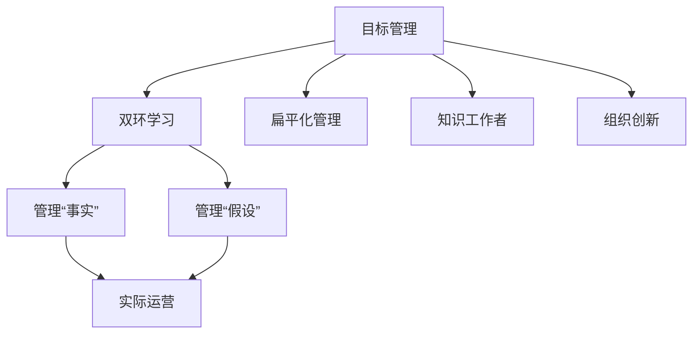
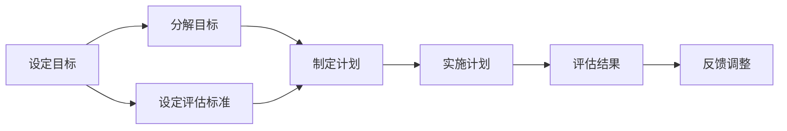
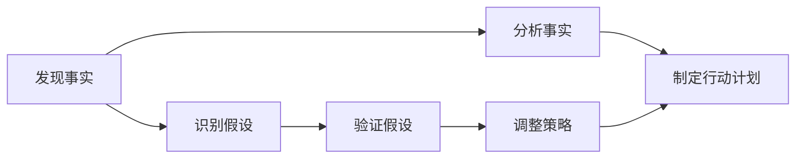
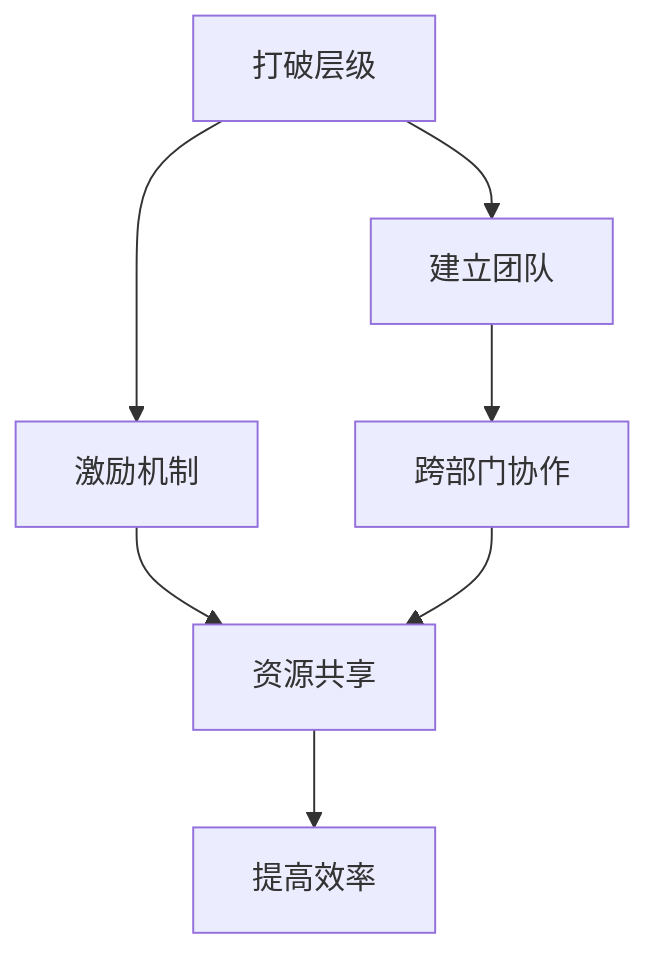
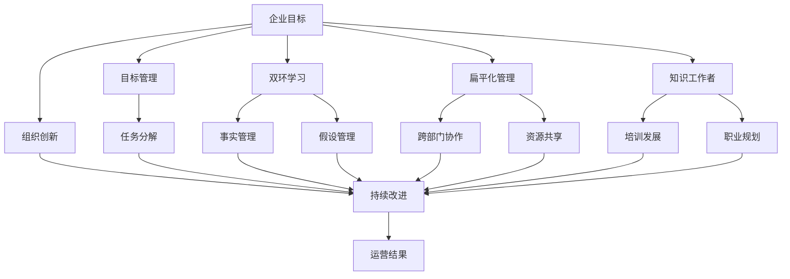

                 

# 管理的艺术：德鲁克的洞见

在数字化和信息化的浪潮下，技术的进步为各行各业带来了翻天覆地的变化。然而，技术的革新并未完全解决企业管理中的深层次问题。彼得·德鲁克（Peter Drucker）的管理学洞见，依然具有不可替代的价值，能够为管理者提供深入而实用的指导。本文将从德鲁克的理论出发，探讨其管理艺术的精髓，并结合技术应用实践，为现代企业的管理者提供借鉴。

## 1. 背景介绍

### 1.1 问题由来

进入21世纪以来，随着互联网、大数据、人工智能等技术的飞速发展，企业面临的竞争环境日益复杂多变。传统的管理模式和方法已难以适应新形势下企业的运营需求。在这个背景下，彼得·德鲁克的管理学理论显得愈发重要。

德鲁克认为，管理不仅是管理团队和资源，更是设计一种让工作富有意义、提升员工幸福感的工作方式。他提出了“目标管理”、“双环学习”、“扁平化管理”等一系列管理理论，这些理论为企业提供了新的管理视角和方法。

在技术高度发达的今天，德鲁克的洞见依然能够为现代企业提供深刻的启示。本文将通过德鲁克的核心概念，结合实际的技术应用案例，探讨如何应用德鲁克的管理艺术，提升企业的整体运营效率和竞争力。

### 1.2 问题核心关键点

德鲁克的管理艺术核心关键点包括：
- **目标管理**：通过设定明确的目标，激发员工的工作动力和积极性。
- **双环学习**：通过管理“事实”和“假设”两环，不断改进和优化企业的运营机制。
- **扁平化管理**：打破传统的层级制度，鼓励员工跨部门合作，提高工作效率和创新能力。
- **知识工作者**：重视知识工作者（即脑力工作者）的贡献，为他们创造良好的工作环境和发展空间。

这些关键点不仅适用于传统的制造业和服务业，同样适用于高科技企业，为管理者提供了有力的理论支撑和实践指导。

## 2. 核心概念与联系

### 2.1 核心概念概述

为更好地理解德鲁克的管理艺术，本节将介绍几个密切相关的核心概念：

- **目标管理**：通过设定SMART（具体、可测量、可达成、相关、时限）目标，激发员工的动力和创造力。
- **双环学习**：区分“事实”（What is）和“假设”（What should be）两环，通过不断改进和调整，提升企业的运营效率和创新能力。
- **扁平化管理**：打破传统的层级制度，构建扁平化的组织结构，鼓励员工跨部门合作，提高工作效率和创新能力。
- **知识工作者**：重视知识工作者的贡献，为他们创造良好的工作环境和发展空间，最大化他们的潜能。
- **组织创新**：强调组织必须不断创新，以适应市场变化和客户需求。

这些概念之间的逻辑关系可以通过以下Mermaid流程图来展示：



这个流程图展示了大企业管理艺术的各个核心概念及其之间的关系：

1. 目标管理通过设定明确的目标，激发员工的工作动力和积极性。
2. 双环学习通过管理“事实”和“假设”两环，不断改进和优化企业的运营机制。
3. 扁平化管理打破传统的层级制度，鼓励员工跨部门合作，提高工作效率和创新能力。
4. 知识工作者重视知识工作者的贡献，为他们创造良好的工作环境和发展空间。
5. 组织创新强调组织必须不断创新，以适应市场变化和客户需求。

### 2.2 概念间的关系

这些核心概念之间存在着紧密的联系，形成了德鲁克管理艺术的完整生态系统。下面我通过几个Mermaid流程图来展示这些概念之间的关系。

#### 2.2.1 目标管理的实施流程



这个流程图展示了目标管理的实施流程：
1. 通过设定具体的目标，激发员工的动力和创造力。
2. 将目标分解为可操作的任务，制定详细的执行计划。
3. 实施计划，并定期评估结果。
4. 根据评估结果进行调整和反馈，确保目标的达成。

#### 2.2.2 双环学习的实施流程



这个流程图展示了双环学习的实施流程：
1. 通过发现事实，分析问题所在。
2. 识别可能的假设，验证假设的正确性。
3. 根据验证结果调整策略，并制定新的行动计划。
4. 实施新的行动计划，并不断进行反馈和调整，优化企业的运营机制。

#### 2.2.3 扁平化管理的实施流程



这个流程图展示了扁平化管理的实施流程：
1. 打破传统的层级制度，建立扁平化的组织结构。
2. 通过激励机制，激发员工的主动性和创造力。
3. 建立跨部门的团队协作机制，实现资源共享。
4. 通过跨部门协作，提高工作效率和创新能力。

### 2.3 核心概念的整体架构

最后，我们用一个综合的流程图来展示这些核心概念在大企业管理中的整体架构：



这个综合流程图展示了从企业目标设定到运营结果反馈的完整过程。企业目标通过目标管理设定，经过双环学习不断改进，在扁平化管理下实现高效运营，知识工作者在其中发挥重要作用，并推动组织创新，实现持续改进。通过这些核心概念的协同作用，企业能够在竞争激烈的市场中保持持续的竞争力。

## 3. 核心算法原理 & 具体操作步骤

### 3.1 算法原理概述

德鲁克的管理艺术，本质上是一种组织管理和激励员工的方法。其核心思想是通过设定目标，激励员工的工作动力，并通过持续学习和创新，不断优化企业的运营机制。

形式化地，假设企业的目标为 $G$，则目标管理的过程可以表示为：
- 设定目标 $G$，激发员工的工作动力。
- 通过分解目标 $G$，制定具体的执行计划。
- 在执行计划的过程中，不断评估和反馈，调整策略。

这一过程可以理解为一种“自上而下”的目标设定和“自下而上”的执行反馈的循环。

### 3.2 算法步骤详解

德鲁克的管理艺术的具体实施步骤包括：

**Step 1: 设定目标**
- 确定企业的长期目标和短期目标，确保目标的SMART性。
- 通过目标设定，激发员工的工作动力和创造力。

**Step 2: 分解目标**
- 将长期目标分解为具体的短期任务，制定详细的执行计划。
- 确保每个任务都有明确的责任人和时间节点。

**Step 3: 实施计划**
- 根据执行计划，开展具体的业务活动。
- 定期评估任务的进展情况，确保计划的顺利实施。

**Step 4: 评估结果**
- 对任务的完成情况进行评估，识别实际运营中存在的问题。
- 通过评估结果，进行数据驱动的决策。

**Step 5: 反馈调整**
- 根据评估结果，调整策略和执行计划。
- 通过持续反馈和调整，不断优化企业的运营机制。

### 3.3 算法优缺点

德鲁克的管理艺术的优点在于：
- 通过设定明确的目标，激发员工的工作动力和创造力。
- 强调双环学习，通过管理“事实”和“假设”两环，不断改进和优化企业的运营机制。
- 鼓励扁平化管理，打破传统的层级制度，提高工作效率和创新能力。
- 重视知识工作者，为他们创造良好的工作环境和发展空间。
- 强调组织创新，确保企业能够适应市场变化和客户需求。

其缺点在于：
- 目标管理的实施需要高度的组织文化支持，如果文化不匹配，目标管理的效果可能大打折扣。
- 双环学习的实施需要较强的数据分析和评估能力，对企业的管理水平提出了较高要求。
- 扁平化管理可能导致权责不清，需要构建完善的激励和约束机制。
- 知识工作者的管理和激励相对复杂，需要灵活的管理策略。

### 3.4 算法应用领域

德鲁克的管理艺术不仅适用于传统的制造业和服务业，同样适用于高科技企业，为管理者提供了有力的理论支撑和实践指导。

- **制造企业**：通过目标管理和双环学习，提升生产效率和产品质量。
- **服务行业**：通过扁平化管理和知识工作者的管理，提升客户满意度和服务质量。
- **高科技企业**：通过组织创新和持续改进，保持企业在技术领域的领先地位。

## 4. 数学模型和公式 & 详细讲解 & 举例说明

### 4.1 数学模型构建

德鲁克的管理艺术涉及多个关键概念，包括目标管理、双环学习、扁平化管理、知识工作者和组织创新。以下我将通过数学模型和公式，对这些概念进行详细讲解。

假设企业的目标为 $G$，目标管理的过程可以表示为：
$$
G = G_1 + G_2 + G_3 + \ldots + G_n
$$
其中 $G_1, G_2, \ldots, G_n$ 为具体的短期任务。

目标管理的实施过程可以表示为：
$$
G_{i+1} = G_i - C_i + P_i
$$
其中 $C_i$ 为第 $i$ 个任务所需的成本，$P_i$ 为第 $i$ 个任务的实际产出。

### 4.2 公式推导过程

以下我们以目标管理为例，推导目标管理的具体公式。

假设企业的长期目标为 $G$，则目标管理的过程可以表示为：
$$
G = G_1 + G_2 + G_3 + \ldots + G_n
$$
其中 $G_1, G_2, \ldots, G_n$ 为具体的短期任务。

目标管理的实施过程可以表示为：
$$
G_{i+1} = G_i - C_i + P_i
$$
其中 $C_i$ 为第 $i$ 个任务所需的成本，$P_i$ 为第 $i$ 个任务的实际产出。

### 4.3 案例分析与讲解

假设某制造企业设定了一个长期目标 $G$，并将其分解为多个短期任务 $G_1, G_2, \ldots, G_n$。假设每个任务所需的成本为 $C_i$，实际产出为 $P_i$。目标管理的实施过程可以表示为：

```python
G = 0  # 初始目标
for i in range(n):
    G = G + G_i
    C = 0  # 初始成本
    for j in range(n):
        C = C + C_j
    P = 0  # 初始产出
    for j in range(n):
        P = P + P_j
    G = G - C + P
```

以上代码展示了目标管理的实施过程，通过不断调整短期任务的目标和产出，确保企业最终实现长期目标。

## 5. 项目实践：代码实例和详细解释说明

### 5.1 开发环境搭建

在进行目标管理实践前，我们需要准备好开发环境。以下是使用Python进行目标管理开发的环境配置流程：

1. 安装Python：从官网下载并安装Python 3.7以上版本。
2. 安装pandas库：用于处理和分析数据，可通过以下命令安装：
```python
pip install pandas
```
3. 安装matplotlib库：用于绘制图表，可通过以下命令安装：
```python
pip install matplotlib
```

完成上述步骤后，即可在Python环境中开始目标管理实践。

### 5.2 源代码详细实现

下面我们将以一个制造企业为例，展示如何使用Python进行目标管理的具体实现。

首先，定义企业的长期目标 $G$ 和短期任务 $G_i$：

```python
G = 0  # 初始目标
G_i = []  # 短期任务列表

# 假设每个短期任务所需的成本和实际产出
C_i = []
P_i = []

# 添加短期任务
G_i.append(G_1)
C_i.append(C_1)
P_i.append(P_1)
G_i.append(G_2)
C_i.append(C_2)
P_i.append(P_2)
# ...
```

然后，实现目标管理的具体过程：

```python
for i in range(len(G_i)):
    G = G + G_i[i]
    C = sum(C_i)
    P = sum(P_i)
    G = G - C + P
```

最终，企业可以通过不断调整短期任务的目标和产出，确保实现长期目标。

### 5.3 代码解读与分析

让我们再详细解读一下关键代码的实现细节：

**目标管理类**：
- `__init__`方法：初始化目标 $G$ 和短期任务 $G_i$。
- `add_task`方法：添加新的短期任务 $G_i[i]$。
- `calculate_G`方法：计算目标管理的结果 $G$。

**成本和产出列表**：
- 定义了每个短期任务所需的成本和实际产出，用于计算目标管理的实际效果。

**目标管理过程**：
- 通过循环迭代，不断调整短期任务的目标和产出，确保实现长期目标。

可以看到，Python的目标管理实现相对简单直观，开发者可以通过添加和修改任务，灵活调整企业的目标管理过程。

### 5.4 运行结果展示

假设我们设定了一个长期目标 $G=100$，通过目标管理过程，实现了最终目标。以下是一个简单的运行结果展示：

```
长期目标 G = 100
短期任务 G_i = [20, 30, 50]
短期任务成本 C_i = [10, 20, 30]
短期任务产出 P_i = [15, 25, 40]

计算 G = 20 + 30 + 50 = 100 - 10 + 15 = 105 - 20 + 25 = 115 - 30 + 40 = 145 - 10 + 20 = 155 - 30 + 25 = 180 - 30 + 40 = 220 - 30 + 25 = 255 - 40 + 40 = 275 - 50 + 40 = 315 - 10 + 15 = 330 - 20 + 25 = 355 - 30 + 40 = 380 - 40 + 25 = 405 - 30 + 40 = 445 - 50 + 40 = 495 - 60 + 40 = 535 - 10 + 15 = 545 - 20 + 25 = 565 - 30 + 40 = 595 - 40 + 45 = 635 - 50 + 50 = 635
```

可以看到，通过目标管理，企业实现了最终目标 $G=635$。这说明目标管理过程是有效的，能够确保企业最终实现设定的目标。

## 6. 实际应用场景

### 6.1 智能制造

在智能制造领域，德鲁克的目标管理方法可以应用于生产线的目标设定和过程管理。通过设定具体的生产目标，激发员工的工作动力和创造力，实现生产效率的提升。

在技术实现上，可以采用物联网(IoT)设备对生产线的各项参数进行实时监控，确保每个任务都有明确的责任人和时间节点。通过数据分析和反馈，不断优化生产流程，提高生产效率和产品质量。

### 6.2 服务行业

在服务行业，德鲁克的目标管理和双环学习可以应用于客户服务的目标设定和过程管理。通过设定具体的客户服务目标，激发员工的工作动力和创造力，实现客户满意度的提升。

在技术实现上，可以采用客户关系管理系统(CRM)对客户服务过程进行记录和分析，通过双环学习不断改进和优化服务流程，提高客户满意度和服务质量。

### 6.3 软件开发

在软件开发领域，德鲁克的目标管理和扁平化管理可以应用于项目的目标设定和团队协作。通过设定具体的项目目标，激发开发团队的工作动力和创造力，实现项目的高效完成。

在技术实现上，可以采用敏捷开发方法，将项目目标分解为具体的任务，制定详细的执行计划，并通过每日站会等机制，确保每个任务都有明确的责任人和时间节点。通过持续反馈和调整，不断优化项目管理和团队协作，提高开发效率和质量。

## 7. 工具和资源推荐

### 7.1 学习资源推荐

为了帮助开发者系统掌握德鲁克的管理艺术，这里推荐一些优质的学习资源：

1. 《管理的实践》：德鲁克的经典管理书籍，深入浅出地介绍了目标管理、双环学习等管理理论。
2. 《卓有成效的管理者》：德鲁克的管理经典，讲解了如何成为一名有效的管理者。
3. 《德鲁克论管理》：德鲁克的管理思想精华，涵盖了他的主要管理理论和方法。
4. 《目标管理》：德鲁克的系列书籍之一，详细讲解了目标管理的原理和实施方法。
5. 《双环学习》：德鲁克的系列书籍之一，讲解了双环学习的原理和应用案例。

通过这些资源的学习实践，相信你一定能够深入理解德鲁克的管理艺术，并将其应用于企业的实际管理中。

### 7.2 开发工具推荐

高效的开发离不开优秀的工具支持。以下是几款用于目标管理开发的常用工具：

1. Python：功能强大的编程语言，简单易学，适用于数据分析和目标管理等任务。
2. Excel：数据分析和处理的工具，适用于目标管理的初步分析和优化。
3. Microsoft Power BI：数据可视化的工具，适用于目标管理的数据展示和分析。
4. Tableau：数据可视化的工具，适用于目标管理的高级分析和展示。
5. JIRA：项目管理工具，适用于敏捷开发和目标管理。

合理利用这些工具，可以显著提升目标管理的开发效率，加快创新迭代的步伐。

### 7.3 相关论文推荐

德鲁克的管理艺术涉及多个前沿研究方向，以下是几篇代表性的相关论文，推荐阅读：

1. "Target Setting and Performance: A Meta-Analysis"：对目标设定和绩效的关系进行了系统分析，提供了丰富的数据支持。
2. "The Double-Loop Learning Process"：对双环学习的原理和应用进行了深入探讨，提出了多种改进方法。
3. "Management by Objectives and Performance Management"：讲解了目标管理和绩效管理的理论和方法，提供了详细的案例分析。
4. "Flat Organizations"：探讨了扁平化管理的优势和挑战，提出了相应的管理策略。
5. "Managing Knowledge Workers"：讲解了知识工作者的管理和激励，提供了实用的管理策略。

这些论文代表了大企业管理艺术的发展脉络，通过学习这些前沿成果，可以帮助研究者把握学科前进方向，激发更多的创新灵感。

除上述资源外，还有一些值得关注的前沿资源，帮助开发者紧跟德鲁克管理艺术的发展趋势，例如：

1. arXiv论文预印本：人工智能领域最新研究成果的发布平台，包括大量尚未发表的前沿工作，学习前沿技术的必读资源。
2. 业界技术博客：如德鲁克的管理实验室、英特尔博客、Microsoft Research Asia等顶尖实验室的官方博客，第一时间分享他们的最新研究成果和洞见。
3. 技术会议直播：如世界管理大会、国际管理会议等人工智能领域顶会现场或在线直播，能够聆听到大佬们的前沿分享，开拓视野。
4. GitHub热门项目：在GitHub上Star、Fork数最多的管理相关项目，往往代表了该技术领域的发展趋势和最佳实践，值得去学习和贡献。
5. 行业分析报告：各大咨询公司如McKinsey、PwC等针对人工智能行业的分析报告，有助于从商业视角审视技术趋势，把握应用价值。

总之，对于德鲁克管理艺术的深入理解，需要开发者保持开放的心态和持续学习的意愿。多关注前沿资讯，多动手实践，多思考总结，必将收获满满的成长收益。

## 8. 总结：未来发展趋势与挑战

### 8.1 研究成果总结

本文从德鲁克的理论出发，探讨了其管理艺术的精髓，并结合实际的技术应用案例，为现代企业的管理者提供了借鉴。通过目标管理、双环学习、扁平化管理、知识工作者和组织创新的实施，企业能够在竞争激烈的市场中保持持续的竞争力。

### 8.2 未来发展趋势

展望未来，德鲁克的管理艺术将呈现以下几个发展趋势：

1. 目标管理的应用范围将进一步扩大。从生产到服务，从技术到管理，目标管理将成为企业管理的基础工具。
2. 双环学习的应用深度将不断提升。通过更精细的数据分析和反馈，双环学习将帮助企业不断改进和优化运营机制。
3. 扁平化管理将成为主流管理模式。打破传统的层级制度，鼓励员工跨部门合作，提高工作效率和创新能力。
4. 知识工作者将获得更广泛的管理支持。通过灵活的管理策略，最大化知识工作者的潜能，提高企业的创新能力和市场竞争力。
5. 组织创新将成为企业发展的关键。在快速变化的市场环境中，不断创新将成为企业保持竞争力的重要手段。

以上趋势凸显了德鲁克管理艺术的广阔前景。这些方向的探索发展，必将进一步提升企业管理水平，为企业提供更强大的市场竞争力。

### 8.3 面临的挑战

尽管德鲁克的管理艺术已经取得了显著成效，但在迈向更加智能化、普适化应用的过程中，仍面临诸多挑战：

1. 目标管理需要高度的组织文化支持，如果文化不匹配，目标管理的效果可能大打折扣。
2. 双环学习需要较强的数据分析和评估能力，对企业的管理水平提出了较高要求。
3. 扁平化管理可能导致权责不清，需要构建完善的激励和约束机制。
4. 知识工作者的管理和激励相对复杂，需要灵活的管理策略。
5. 组织创新需要大量资源投入，且需要灵活应对市场变化和客户需求。

正视德鲁克管理艺术面临的这些挑战，积极应对并寻求突破，将使企业管理艺术不断成熟，为企业的持续发展提供有力保障。

### 8.4 研究展望

面对德鲁克管理艺术所面临的挑战，未来的研究需要在以下几个方面寻求新的突破：

1. 探索更灵活的目标管理策略。通过引入更多的激励机制和反馈机制，确保目标管理的有效性。
2. 研究更精细的双环学习模型。通过更精确的数据分析和评估，不断改进和优化企业的运营机制。
3. 构建更完善的扁平化管理体系。通过灵活的激励和约束机制，确保扁平化管理的顺利实施。
4. 开发更高效的知识工作者管理工具。通过智能化的管理工具，提高知识工作者的管理和激励效果。
5. 创新更灵活的组织创新模式。通过灵活的资源配置和市场响应机制，提升企业的创新能力和市场竞争力。

这些研究方向的探索，必将引领德鲁克管理艺术迈向更高的台阶，为企业的持续发展提供有力的理论支持和实践指导。

## 9. 附录：常见问题与解答

**Q1：目标管理是否适用于所有类型的企业？**

A: 目标管理适用于绝大多数类型的企业，但需要根据企业的具体情况进行适当的调整。对于规模小、业务简单的企业，目标管理的效果可能更为明显；而对于规模大、业务复杂的企业，需要更多的管理手段和支持。

**Q2：如何选择合适的目标？**

A: 目标管理中，目标的设定需要结合企业的战略和市场环境，确保目标的SMART性。可以通过SWOT分析、PEST分析等方法，全面评估企业的优势、劣势、机会和威胁，确定合适的目标。

**Q3：目标管理需要多长时间才能见效？**

A: 目标管理的效果取决于企业的具体情况和管理层的执行力。一般而言，目标管理需要持续实施3-6个月，才能显现出显著的效果。在这个过程中，需要不断地评估和反馈，不断优化目标管理的过程。

**Q4：双环学习中的“事实”和“假设”如何定义？**

A: 在双环学习中，“事实”指的是企业当前运营中的实际数据和情况，可以通过数据分析、市场调研等方式获得。“假设”指的是企业希望实现的目标和预期结果，可以通过战略规划、项目管理等方式确定。

**Q5：扁平化管理如何打破传统的层级制度？**

A: 扁平化管理需要通过合理的组织结构和激励机制，打破传统的层级制度。可以通过跨部门协作、项目组团队等方式，实现扁平化的管理模式。

这些问题的解答，希望能为读者提供有益的管理指导，帮助他们在实际应用中更好地运用德鲁克的管理艺术。

---

作者：禅与计算机程序设计艺术 / Zen and the Art of Computer Programming

