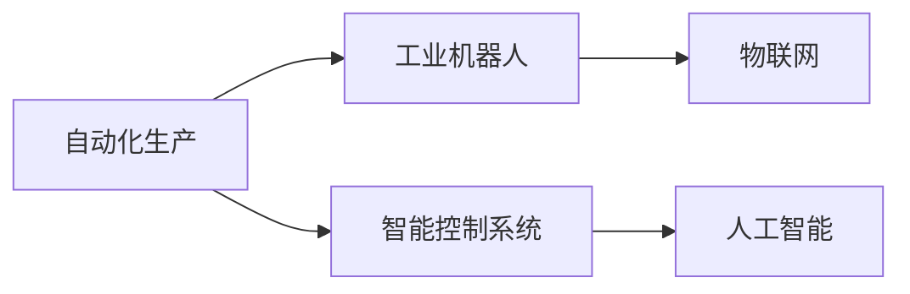

                 

# 纺织业自动化的初期挑战

## 1. 背景介绍

纺织行业作为全球第二大工业部门，长期以来都是工业化的先锋。随着技术的进步，自动化生产已经成为行业的普遍需求。然而，在自动化初期，仍面临诸多挑战。本文将从自动化初期阶段面临的挑战入手，探索纺织自动化未来发展方向。

## 2. 核心概念与联系

### 2.1 核心概念概述

在纺织自动化中，涉及的核心概念主要包括以下几个：

- **自动化生产**：通过智能设备、工业机器人和智能控制系统，实现生产过程的自动化。
- **工业机器人**：执行特定任务的机器人，如搬运、装配、检测等。
- **智能控制系统**：通过传感器、物联网技术实现对生产过程的实时监控和调整。
- **物联网**：连接生产设备、传感器等，实现数据的实时采集和传输。
- **人工智能**：利用机器学习、计算机视觉等技术，提升自动化系统的决策能力和适应性。

这些概念之间的联系通过以下Mermaid流程图展示：



### 2.2 概念间的关系

自动化生产通过工业机器人执行具体的任务，如搬运、装配、检测等。智能控制系统通过物联网技术采集和传输生产数据，实现对生产过程的实时监控和调整。人工智能则通过机器学习、计算机视觉等技术，提升自动化系统的决策能力和适应性。

## 3. 核心算法原理 & 具体操作步骤
### 3.1 算法原理概述

纺织业自动化涉及的算法原理主要包括：

- **机器人路径规划**：基于机器人当前位置和目标位置，规划最优路径。
- **运动控制算法**：控制工业机器人的运动速度、加速度等，确保动作的稳定性和安全性。
- **视觉检测算法**：利用计算机视觉技术，对产品进行缺陷检测和质量控制。
- **物联网数据处理算法**：实时采集和处理生产数据，实现对生产过程的实时监控。
- **机器学习算法**：通过历史数据训练模型，优化生产流程，提升效率和质量。

### 3.2 算法步骤详解

以机器人路径规划为例，具体步骤包括：

1. **地图建立**：使用激光雷达、摄像头等传感器采集生产车间的三维地图。
2. **目标点规划**：根据任务需求，设定机器人需要到达的目标点。
3. **路径规划**：使用A*、D*等算法，规划从当前位置到目标点的最短路径。
4. **路径优化**：根据实时环境变化，动态调整路径，确保机器人安全和高效。
5. **运动控制**：控制机器人按照规划路径运动，避免碰撞和超时。

### 3.3 算法优缺点

- **优点**：
  - 提升生产效率和质量。
  - 降低人工成本和操作风险。
  - 实现生产过程的实时监控和调整。

- **缺点**：
  - 初始投资成本较高。
  - 系统复杂，维护和调试难度大。
  - 对环境和设备要求高，适应性差。

### 3.4 算法应用领域

纺织自动化算法主要应用于以下几个领域：

- **搬运和装配**：自动化机器人完成物料搬运、零件装配等任务。
- **质量检测**：利用计算机视觉和机器学习技术，对产品质量进行检测和分类。
- **库存管理**：通过物联网技术，实现对生产物资的实时监控和管理。
- **生产调度**：优化生产流程，提升生产效率和资源利用率。
- **智能维护**：实现设备的智能维护和故障预测。

## 4. 数学模型和公式 & 详细讲解

### 4.1 数学模型构建

纺织自动化中的数学模型主要涉及以下几个方面：

- **机器人路径规划模型**：通过定义起点、终点、障碍物等参数，构建机器人路径规划模型。
- **运动控制模型**：定义机器人的速度、加速度、位置等参数，构建运动控制模型。
- **视觉检测模型**：利用计算机视觉技术，定义特征提取、图像分类等模型。
- **物联网数据模型**：定义数据采集、处理和传输模型，构建物联网数据模型。
- **机器学习模型**：通过定义训练数据、损失函数、优化器等参数，构建机器学习模型。

### 4.2 公式推导过程

以机器人路径规划为例，假设有地图 $M$、起点 $S$、终点 $T$、障碍物 $O$，定义机器人路径规划的代价函数 $C$，则路径规划的数学模型为：

$$
\min C(S, T, O)
$$

其中，$C$ 包括起始点到每个节点的代价、节点间的代价和终点到目标点的代价。

### 4.3 案例分析与讲解

假设有两个起始点 $S_1$ 和 $S_2$，两个终点 $T_1$ 和 $T_2$，障碍物 $O_1$ 和 $O_2$，如下图所示：

```
S_1 ----> O_1 ----> T_1
     \                / 
      \             /    
       \           /     
        O_2 ------ O_2 
        |             |
        |             |
        |             |
        V             V 
        S_2 -----> O_2 ----> T_2
```

如果希望从 $S_1$ 到 $T_2$ 的路径最短，可以使用A*算法进行路径规划。A*算法通过启发式函数 $H(n)$ 估计从当前节点 $n$ 到终点的距离，计算每条路径的总代价。启发式函数 $H(n)$ 通常定义为节点 $n$ 到终点的曼哈顿距离或欧几里得距离。

## 5. 项目实践：代码实例和详细解释说明

### 5.1 开发环境搭建

要实现纺织自动化算法，需要搭建如下开发环境：

- **硬件设备**：工业机器人、传感器、物联网设备等。
- **软件平台**：操作系统、开发框架、数据库等。
- **编程语言**：Python、C++、Java等。

### 5.2 源代码详细实现

以机器人路径规划为例，以下是一个简单的Python代码实现：

```python
import astar
import math

class Robot:
    def __init__(self, start, goal, obstacles):
        self.start = start
        self.goal = goal
        self.obstacles = obstacles

    def plan_path(self):
        path = astar.astar(self.start, self.goal, self.obstacles)
        return path

class Node:
    def __init__(self, x, y):
        self.x = x
        self.y = y
        self.f = 0
        self.g = 0
        self.h = 0

    def __lt__(self, other):
        return self.f < other.f

class AStar:
    def __init__(self):
        self.open_list = []
        self.close_list = []

    def calculate_heuristic(self, node, goal):
        distance = math.sqrt((node.x - goal[0]) ** 2 + (node.y - goal[1]) ** 2)
        return distance

    def add_node_to_open_list(self, node, g, h):
        node.g = g
        node.h = h
        node.f = node.g + node.h
        self.open_list.append(node)

    def remove_node_from_open_list(self, node):
        self.open_list.remove(node)

    def expand_node(self, node, obstacles):
        neighbours = []
        neighbour_x = node.x - 1, node.x + 1
        neighbour_y = node.y - 1, node.y + 1
        for nx, ny in neighbour_x:
            if 0 <= nx < len(obstacles) and 0 <= ny < len(obstacles[0]) and obstacles[nx][ny] == 0:
                neighbours.append(Node(nx, ny))
        for nx, ny in neighbour_y:
            if 0 <= nx < len(obstacles) and 0 <= ny < len(obstacles[0]) and obstacles[nx][ny] == 0:
                neighbours.append(Node(nx, ny))

        for n in neighbours:
            if n in self.open_list or n in self.close_list:
                continue
            g = node.g + 1
            h = self.calculate_heuristic(n, self.goal)
            self.add_node_to_open_list(n, g, h)

    def find_shortest_path(self, start, goal, obstacles):
        start_node = Node(start[0], start[1])
        self.add_node_to_open_list(start_node, 0, self.calculate_heuristic(start_node, goal))
        self.open_list.sort()

        while self.open_list:
            current = self.open_list[0]
            self.remove_node_from_open_list(current)
            self.close_list.append(current)

            if current.x == goal[0] and current.y == goal[1]:
                path = []
                while current:
                    path.append((current.x, current.y))
                    current = current.parent
                return path[::-1]

            for neighbour in self.expand_node(current, obstacles):
                self.add_node_to_open_list(neighbour, current.g + 1, self.calculate_heuristic(neighbour, goal))

        return None

start = (0, 0)
goal = (3, 3)
obstacles = [
    [0, 0, 0, 0, 0, 0, 0, 0, 0],
    [0, 1, 1, 1, 1, 1, 1, 1, 0],
    [0, 1, 0, 1, 1, 0, 1, 1, 0],
    [0, 1, 1, 1, 1, 1, 1, 1, 0],
    [0, 1, 1, 1, 0, 1, 1, 1, 0],
    [0, 1, 1, 1, 1, 0, 1, 1, 0],
    [0, 1, 1, 1, 1, 1, 1, 1, 0],
    [0, 1, 1, 1, 1, 1, 1, 1, 0],
    [0, 0, 0, 0, 0, 0, 0, 0, 0]
]

robot = Robot(start, goal, obstacles)
path = robot.plan_path()
print(path)
```

### 5.3 代码解读与分析

- **Robot类**：封装机器人路径规划的相关信息，包括起点、终点、障碍物等。
- **Node类**：表示图上的节点，包含x、y坐标、代价函数值等。
- **AStar类**：实现A*算法，包括开放列表、关闭列表、启发式函数等。
- **calculate_heuristic方法**：计算启发式函数，即节点到终点的距离。
- **add_node_to_open_list方法**：将节点添加到开放列表。
- **remove_node_from_open_list方法**：从开放列表移除节点。
- **expand_node方法**：扩展节点，找到所有可到达的相邻节点。
- **find_shortest_path方法**：找到从起点到终点的最短路径。

## 6. 实际应用场景

### 6.1 智能仓储管理

在智能仓储管理中，机器人可以用于物料搬运、库存盘点、搬运装卸等任务。通过路径规划算法，机器人可以高效地完成物流任务，减少人力成本，提升物流效率。

### 6.2 智能质检

在智能质检中，机器人可以用于对产品进行自动检测和分类。通过计算机视觉和机器学习算法，机器人可以自动识别产品缺陷，提高质检效率和准确性。

### 6.3 智能调度

在智能调度中，通过对生产数据和设备状态的实时监控，优化生产流程和资源利用率。通过机器学习算法，系统可以预测设备故障，提前进行维护，减少停机时间。

### 6.4 未来应用展望

未来，纺织自动化将结合人工智能、物联网、大数据等技术，进一步提升生产效率和质量。在智能仓储、智能质检、智能调度等领域，纺织自动化将展现出更广阔的应用前景。

## 7. 工具和资源推荐

### 7.1 学习资源推荐

- **ROS（Robot Operating System）**：工业机器人领域的开源软件平台，提供丰富的机器人开发工具和库。
- **OpenCV**：计算机视觉库，提供强大的图像处理和计算机视觉算法。
- **TensorFlow**：深度学习框架，支持多种机器学习算法和模型。
- **PyTorch**：深度学习框架，支持动态图和静态图模式。
- **Arduino**：物联网开发平台，支持各种传感器和设备。

### 7.2 开发工具推荐

- **MATLAB**：数学计算和数据可视化工具，适合复杂算法的开发和调试。
- **MATLAB Simulink**：仿真工具，适合实时系统开发和测试。
- **Python**：通用编程语言，支持机器学习、计算机视觉等领域的开发。
- **Visual Studio**：开发工具，支持C++和Python等语言。
- **MATLAB Coder**：将MATLAB模型转换为C++代码，方便与工业控制系统集成。

### 7.3 相关论文推荐

- **"Robot Motion Planning with Heuristic Search Algorithms"**：介绍A*、RRT等机器人路径规划算法的原理和实现。
- **"Robot Navigation and Motion Planning in Warehouse"**：介绍仓库中机器人路径规划的实际应用。
- **"Machine Learning-based Quality Inspection in Textile Industry"**：介绍基于机器学习的智能质检算法。
- **"Industrial Internet of Things for Smart Manufacturing"**：介绍工业物联网在智能制造中的应用。
- **"Artificial Intelligence in Textile Manufacturing"**：介绍人工智能在纺织自动化中的应用。

## 8. 总结：未来发展趋势与挑战

### 8.1 研究成果总结

纺织业自动化初期面临的挑战主要包括以下几个方面：

- 自动化设备投资成本高，回报周期长。
- 系统复杂，维护和调试难度大。
- 对环境和设备要求高，适应性差。
- 数据采集和处理技术瓶颈。
- 机器学习模型的泛化能力和鲁棒性不足。

### 8.2 未来发展趋势

未来纺织自动化将向以下几个方向发展：

- **智能化和自动化融合**：通过人工智能技术，提升自动化系统的决策能力和适应性。
- **数据驱动的生产管理**：通过大数据分析，优化生产流程和资源利用率。
- **工业物联网的普及**：通过物联网技术，实现对生产过程的实时监控和调整。
- **机器学习模型的应用**：通过机器学习算法，优化生产流程，提升生产效率和质量。
- **人机协同的生产方式**：实现人机协同作业，提升生产效率和质量。

### 8.3 面临的挑战

未来纺织自动化面临的挑战主要包括以下几个方面：

- 高昂的投资成本和长回报周期。
- 系统复杂，维护和调试难度大。
- 对环境和设备要求高，适应性差。
- 数据采集和处理技术瓶颈。
- 机器学习模型的泛化能力和鲁棒性不足。

### 8.4 研究展望

未来纺织自动化将结合人工智能、物联网、大数据等技术，进一步提升生产效率和质量。在智能仓储、智能质检、智能调度等领域，纺织自动化将展现出更广阔的应用前景。

## 9. 附录：常见问题与解答

**Q1：如何选择合适的工业机器人？**

A: 选择合适的工业机器人需要考虑以下几个因素：

- 机器人类型：根据任务需求选择不同类型的机器人，如搬运机器人、装配机器人、检测机器人等。
- 负载能力：选择适合负载大小的机器人，确保机器人在任务中不会过载。
- 运动精度：选择运动精度高的机器人，确保作业质量。
- 空间布局：根据工厂布局选择合适的机器人，确保机器人能够自由移动。

**Q2：如何提高机器人的路径规划效率？**

A: 提高机器人的路径规划效率需要考虑以下几个因素：

- 优化算法：选择高效的路径规划算法，如A*、D*、RRT等。
- 环境建模：对生产车间进行详细的建模，确保算法能够准确规划路径。
- 动态调整：根据实时环境变化，动态调整路径，确保机器人安全和高效。
- 多机器人协作：通过多机器人协作，提高路径规划效率。

**Q3：如何优化生产调度？**

A: 优化生产调度需要考虑以下几个因素：

- 实时监控：对生产过程进行实时监控，确保生产流程的顺畅。
- 数据采集：对生产数据进行实时采集和处理，优化生产调度。
- 机器学习：通过机器学习算法，预测设备故障，提前进行维护。
- 资源优化：优化生产资源配置，提高资源利用率。

---

作者：禅与计算机程序设计艺术 / Zen and the Art of Computer Programming

